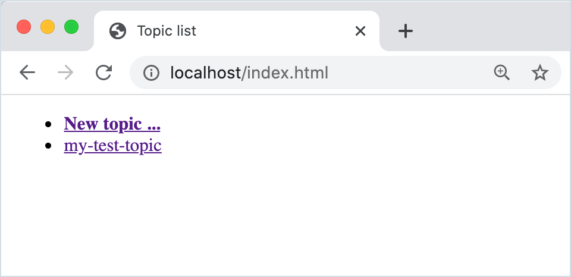
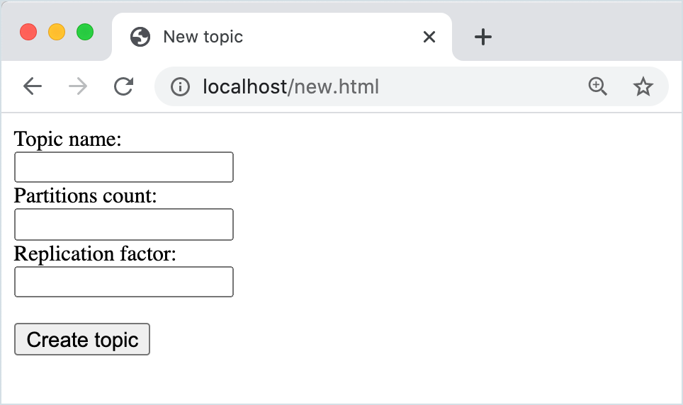
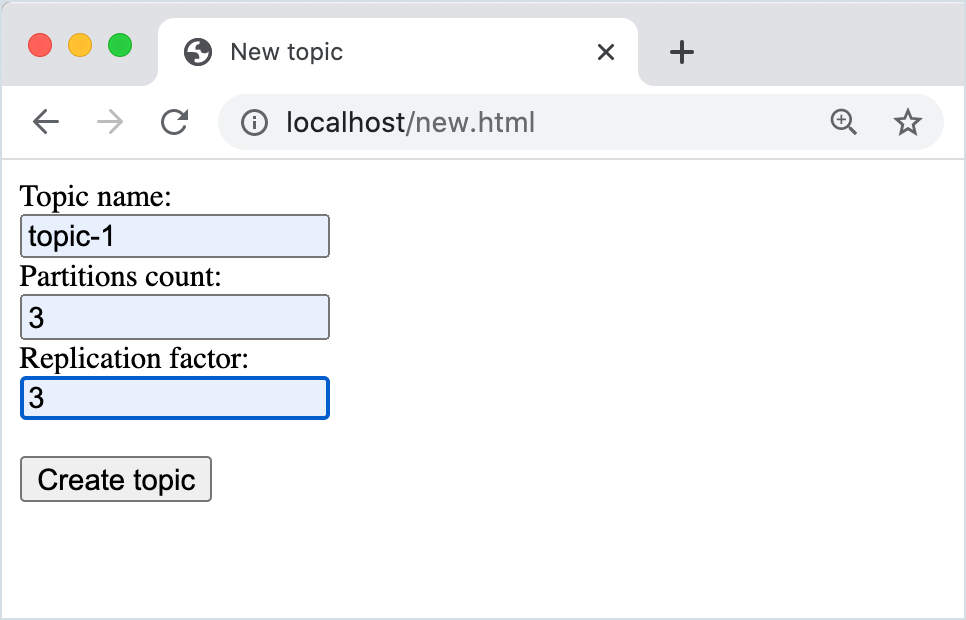
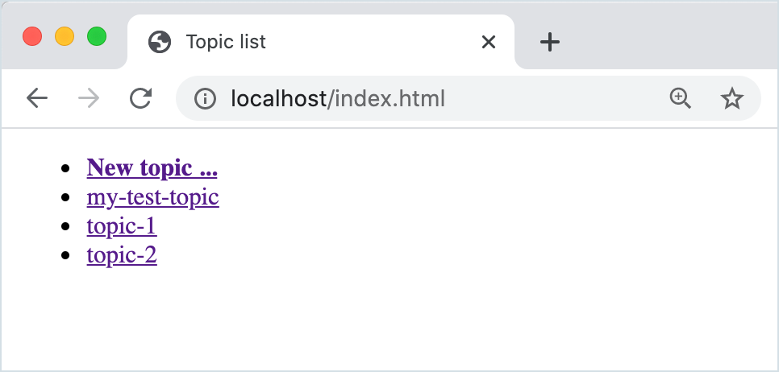
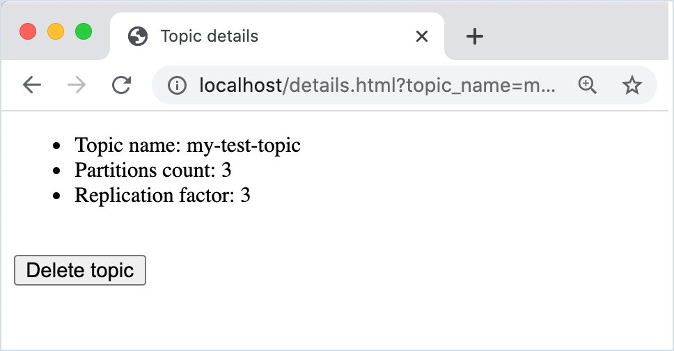
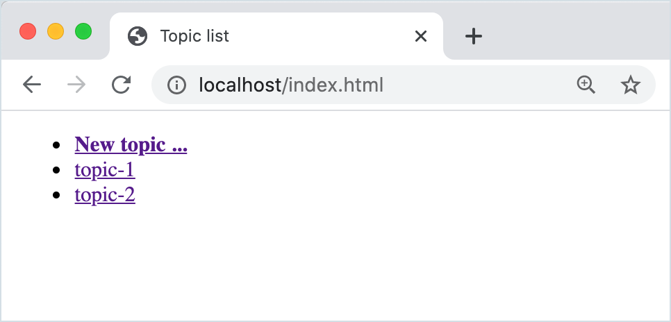

# Confluent Admin REST APIs demo

## Product

### Definition

Apache Kafka allows users to perform admin operations via the Java AdminClient
and, in some cases, via CLI commands. The Confluent Admin REST APIs allow users
to perform admin operations via a series of REST APIs. The following operations
are available starting in Confluent Platform 6.0.0:

* Clusters: List and describe
* Brokers: List and describe
* Topics: Create, delete, list and describe
* Configurations (cluster-, broker- and topic-level): Create, delete, list and describe
* ACLs: Create, delete, list and describe
* Consumer groups: Delete, list and describe
* Partition reassignments: List and describe

To learn more, see
[Confluent REST APIs](https://docs.confluent.io/current/kafka-rest/index.html)
in the Confluent documentation.

### Deployment

Admin REST APIs are available in these forms:

* Users can deploy Confluent Server, which exposes Admin REST APIs by default directly on the brokers.
* Users can deploy standalone REST Proxy node(s), which in addition to Produce and Consume APIs, now also offer Admin REST APIs.
* Admin REST APIs may also available to Cloud users in upcoming releases.

## Demo

### About

This demo is a sample use case for some of the Admin REST APIs, which are
available in Confluent Platform, starting with the the 6.0.0 release.

Specifically, the examples show how to create a basic GUI that allows users to
create, delete, list and describe topics.

### Requirements

To run this demo, you will need:

* Docker

### What's included

This demo pulls the following Docker images:

* ZooKeeper
* Confluent Platform (including core Kafka and Confluent Server)
* nginx, a webserver

# Tutorial

## Start the Demo

Begin by setting up the test cluster. Run `docker-compose` in the background:

`docker-compose up -d`

This starts a single ZooKeeper instance, 3 Confluent Server Kafka brokers, and an nginx webserver to
host the local HTML pages.

The following sections demo and explain 3 static HTML pages with embedded
JavaScript that fetches data from the Confluent Admin REST APIs. You can see the
code in action, by using the web pages shown on [localhost](http://localhost:80) to
list topics, create topics, and delete topics.

## Listing topics

We'll start by going to the Topics list page in the UI, then exploring the code
to see how it's implemented.

### Try this on the UI

Go to [localhost](http://localhost:80) in your web browser (`localhost` on port: `80`).
   
The Topics list page, backed by [src/index.html](src/index.html), lists existing topics, and
provides a link to a page where you can create new topics.

At first, no topics are listed because you haven't created any yet.

Here is what the list looks like when it's populated with a single topic.



### Explore sample code for listing topics

The index page ([src/index.html](src/index.html)), which shows a list of all topics, is
constructed using the following code:

``` html
<!doctype html>
<html lang="en">
  <head>
    <meta charset="utf-8"/>
    <title>Topic list</title>
    <script>
      function getTopics() {
        fetch('http://localhost:8090/kafka/v3/clusters')
          .then(response => response.json())
          .then(({data}) => fetch(data[0].metadata.self + '/topics'))
          .then(response => response.json())
          .then(({data}) => {
            document.getElementById('topics').innerHTML += data
              .filter(({topic_name}) => !topic_name.startsWith('_')) // Skip internal topics
              .map(topic => '<li><a href="./details.html?topic_name=' + topic.topic_name + '">' + topic.topic_name + '</a></li>')
              .join('');
          })
          .catch(error => console.warn(error));
      }
      window.onload = getTopics;
    </script>
  </head>
  <body>
    <ul id="topics">
      <li style="font-weight: bold;"><a href="./new.html">New topic ...</a></li>
    </ul>
  </body>
</html>
```

This code sets up an unordered list of existing topics, and an item that links
to the page for creating topics.

The JavaScript `getTopics` function populates the list of existing topics as follows:

-  First, we call the REST API to determine the cluster ID. Since the REST API can currently
   only be configured to work with a single cluster, the first element in the response
   is the one we're after.

- Then, we make a second HTTP request to get a list of all the topics.

- Finally, we display the topic names in the list along with a link to a details page.

## Creating topics

You might have noticed that our code above also filters topics that start with
`_`. This is done to avoid showing, e.g., the license topic. Most likely, the
list currently shows nothing. Therefore, the next step is to set up a page that
allows us to create topics.

### Try this on the UI

Return to the topics list in your [web browser](http://localhost:80) and, if you
haven't done so already, click **New topic..**.



### Explore the sample code for creating topics

The create topics page ([src/new.html](src/new.html)), displays a form that
allows users to input a topic name, partitions count and replication factor. It
is constructed using the following code:

``` html
<!doctype html>
<html lang="en">
  <head>
    <meta charset="utf-8"/>
    <title>New topic</title>
    <script>
      function createTopic(event) {
        event.preventDefault();
        fetch('http://localhost:8090/kafka/v3/clusters')
          .then(response => response.json())
          .then(({data}) =>
            fetch(data[0].metadata.self + '/topics', {
              method: 'post',
              body: JSON.stringify({
                topic_name: document.getElementById('topic_name').value,
                partitions_count: document.getElementById('partitions_count').value,
                replication_factor: document.getElementById('replication_factor').value
              }),
              headers: {'Content-Type': 'application/json'}
            })
          )
          .then(_ => {
            window.location.href = './index.html';
          })
          .catch(error => console.warn(error));
      }
    </script>
  </head>
  <body>
    <form>
      <label for="topic_name">Topic name:</label><br />
      <input type="text" id="topic_name" name="topic_name" /><br />
      <label for="partitions_count">Partitions count:</label><br />
      <input type="text" id="partitions_count" name="partitions_count" /><br />
      <label for="replication_factor">Replication factor:</label><br />
      <input type="text" id="replication_factor" name="replication_factor" /><br />
      <br />
      <button onclick="createTopic(event)">Create topic</button>
    </form>
  </body>
</html>
```

For simplicity, we are not allowing other parameters that the API supports, such
as configs. Also, this code doesn't validate input in any way.

The `createTopic` function works as follows:

- When the user clicks the **Create topic** button, we fetch the cluster ID (for simplicity,
  we haven't passed state from the previous page)

- We then perform a second HTTP request that creates a topic with the parameters
  the user provided in the form.

- Finally, our code goes back to the topic list where we should now see the topic we just created.

Use the "New topic" page to create some topics, and populate the topics list.



When you click **Create**, you are returned to the updated topics list.

## Describing and deleting topics

Now that you have some topics, you need a page where you can see more details on a
topic and possibly delete it.

### Try this on the UI

1. In your [web browser](http://localhost:80), go to the topics list:

   

2. Select a topic to view details on it. This page also gives you an option to
   delete the selected topic.

   

### Explore sample code for describing and deleting a topic

The topic details page ([src/details.html](src/details.html))displays the topic name, partitions
count and replication factor, along with a button to delete the topic.

``` html
<!doctype html>
<html lang="en">
  <head>
    <meta charset="utf-8"/>
    <title>Topic details</title>
    <script>
      function getTopic() {
        const topicName = new URLSearchParams(window.location.search).get('topic_name');
        document.getElementById('topic_name').innerHTML += topicName;
        fetch('http://localhost:8090/kafka/v3/clusters')
          .then(response => response.json())
          .then(({data}) => {
            topicUrl = data[0].metadata.self + '/topics/' + topicName;
            return fetch(topicUrl);
          })
          .then(response => response.json())
          .then(data => {
            document.getElementById('replication_factor').innerHTML += data.replication_factor;
            return data.partitions.related;
          })
          .then(url => fetch(url))
          .then(response => response.json())
          .then(({data}) => {
            document.getElementById('partitions_count').innerHTML += data.length;
          })
          .catch(error => console.warn(error));
      }
      function deleteTopic(event) {
        event.preventDefault();
        fetch(topicUrl, {method: 'delete'})
          .then(_ => {
            window.location.href = './index.html';
          })
          .catch(error => console.warn(error));
      }
      let topicUrl;
      window.onload = getTopic;
    </script>
  </head>
  <body>
    <ul id="topic">
      <li id="topic_name">Topic name: </li>
      <li id="partitions_count">Partitions count: </li>
      <li id="replication_factor">Replication factor: </li>
    </ul>
    <br />
    <button onclick="deleteTopic(event)">Delete topic</button>
  </body>
</html>
```

This code works in the following way:

- When the page loads, we retrieve the cluster ID and update the topic name
  (which has been passed in a query string parameter).

- In a second HTTP request, we describe the topic, and from the response we are
  able to update the replication factor in the document object model (DOM).
  Partition count is not returned, but we get a link to the actual partitions,
  so by following that link and counting the number of items in the response,
  we can figure out the partition count and update the DOM with that value.

- Finally, if the user clicks the **Delete topic** button, we perform an HTTP request
  that deletes the topic and takes us back to the list of topics where the deleted
  topic has now disappeared.
  
  For example, if you delete `my-test-topic`, it no longer shows in the topic list.
  

  
## Teardown

- Type `docker-compose down` to stop the demo.
- Run `docker ps` or `docker container ls` to make sure you have no running containers.
- Use `docker images` to view the images on your system.
- To remove the images one by one: ``docker image rm <image-id>``.
- To remove all Docker images from your system: `docker rmi $(docker images -q)`

