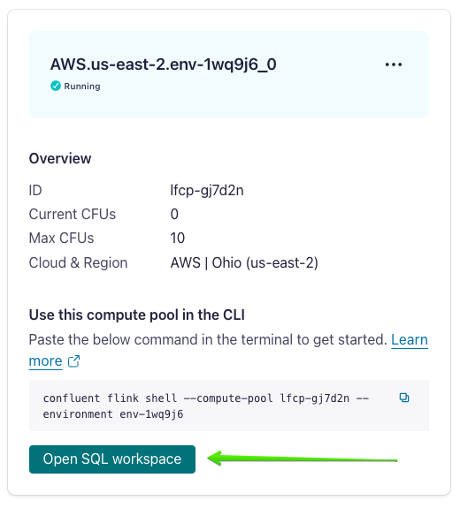

# An Agentic RAG AI Application built on Confluent Cloud

Raw reviews and orders are ingested into Confluent Cloud via programmatic client or connector, the reviews are enriched with AI agents built on [model inference in Flink](https://docs.confluent.io/cloud/current/flink/reference/functions/model-inference-functions.html), and, finally, Flink SQL provides the orchestration to deliver recommendations based on reviews, predictions about the reviews, and past orders.
This demo leverages components in Confluent Cloud in order to show how to build an agentic AI system on data from disparate sources (reviews via a Python producer and orders from MongoDB Atlas). 


## Prerequisites

The following steps and tools are required to run this demo:

* Clone this repo if you haven't already and `cd` into the `agentic-rag` directory:

  ```bash
  git clone https://github.com/confluentinc/demo-scene
  cd agentic-rag
  ```
* An OpenAI account and API key. 
Once you sign up and add money to your account, go to the [Project API keys page](https://platform.openai.com/api-keys) and click `Create new secret key`. 
Copy this key, as we will need it later when creating a remote model in Flink.
* A Confluent Cloud account. 
[Sign up](https://www.confluent.io/confluent-cloud/tryfree) for a free trial if you don't already have one.
* The Confluent CLI. 
Refer to the installation instructions [here](https://docs.confluent.io/confluent-cli/current/install.html).
* A MongoDB Atlas account. 
Follow the steps later in this README to set it up.

## Provision Kafka cluster

We'll use the Confluent CLI to create a Kafka cluster. First, login to your account by running the following command in your terminal:

```shell
confluent login --prompt --save
```

Next, install a CLI plugin that will create many of the resources required for this demo:

```shell
confluent plugin install confluent-cloud_kickstart
```

This plugin allows you to provision a Confluent Cloud environment, cluster, and API key in one command. 
It also enables Schema Registry. 
You may pick `aws`, `azure`, or `gcp` as the `--cloud` argument, and any supported region returned by `confluent kafka region list` as the `--region` argument. 
For example, to use AWS region `us-east-2`:

```shell
confluent cloud-kickstart --name agentic-rag \
  --env agentic-rag \
  --cloud aws \
  --region us-east-2 \
  --output-format stdout
```

The output of this command will contain Kafka and Schema Registry API connection properties that we will use in the next section.

## Produce reviews

Now we can produce product reviews into a `product_reviews` topic on Confluent Cloud.

First, create the topic by running the following command in your terminal:

```shell
confluent kafka topic create product_reviews
```

Next, inspect the `producer/reviews.csv` file. 
Feel free to add additional rows or edit the reviews.Not, though, that for the RAG aspect of this demo you'll also need to 
create accompanying orders in MongoDB Atlas in a later section.

* Open the file `producer/product_reviews_producer.py` and find where the `cc_config` and `sr_config` objects are instantiated.
  * Substitute the `Bootstrap servers endpoint` output earlier for `<BOOTSTRAP SERVERS ENDPOINT>`
  * Substitute the `Kafka API key` output earlier for `<KAFKA API KEY>`
  * Substitute the `Kafka API secret` output earlier for `<KAFKA API SECRET>`
  * Substitute the `Schema Registry Endpoint` output earlier for `<SR ENDPOINT URL>`
  * Substitute the `Schema Registry API key` output earlier for `<SR API KEY>`
  * Substitute the `Schema Registry API secret` output earlier for `<SR API SECRET>`
* Now run the Python program to produce the reviews in the CSV file to the `product_reviews` topic.
  ```shell
  python product_reviews_producer.py
  ```
  You should see output like:
  ```shell
  Producing review records to topic product_reviews. ^C to exit.
  Review record with Id b'B0001PB9FE' successfully produced to Topic:product_reviews Partition: [0] at offset 0
  Review record with Id b'B000E7L2R4' successfully produced to Topic:product_reviews Partition: [3] at offset 0
  Review record with Id b'B000LQOCH0' successfully produced to Topic:product_reviews Partition: [1] at offset 0
  Review record with Id b'B00171APVA' successfully produced to Topic:product_reviews Partition: [1] at offset 1
  ...
  ```


## Create remote model

Now, create a Flink compute pool in the Confluent Cloud Console by navigating to the [Environments page](https://confluent.cloud/environments),
selecting the `agentic-rag` environment, and then clicking the `Flink` tab in the top header:


Click the `Create compute pool` button, pick the same cloud and region that you used earlier in the 
`confluent cloud-kickstart` command, and then click `Create`.

You will see the compute pool tile showing that the pool is `Provisioning`:


While the pool is provisioning, create an Open AI connection using the API key that you created as a prerequisite. 
Again, use the same cloud and region that you have been using, e.g., for AWS `us-east-2`:

```shell
confluent flink connection create openai-connection \
    --cloud aws \
    --region us-east-2 \
    --type openai \
    --endpoint https://api.openai.com/v1/chat/completions \
    --api-key <OPEN AI API KEY>
````

Once the Flink compute pool status changes to `Running` (note: you may need to refresh the page), click the `Open SQL workspace` button:



Copy these commands into the SQL workspace, one at a time, and click `Run`. 
This defines four remote models that we will use to enrich the product reviews. 
One returns a sentiment rating, one predicts whether the review is written by a bot, one extracts product mentions, and one determines the reason for underlying sentiment if it's negative.

```sql
CREATE MODEL review_rating
INPUT(text STRING)
OUTPUT(rating STRING)
COMMENT 'review rating'
WITH (
  'provider' = 'openai',
  'task' = 'classification',
  'openai.model_version' = 'gpt-4o',
  'openai.connection' = 'openai-connection',
  'openai.system_prompt' = 'Analyze the sentiment of the text and return ONLY a numerical rating between 1 to 5.'
);

CREATE MODEL is_bot
INPUT(text STRING)
OUTPUT(is_bot STRING)
COMMENT 'review bot prediction'
WITH (
  'provider' = 'openai',
  'task' = 'classification',
  'openai.connection' = 'openai-connection',
  'openai.model_version' = 'gpt-4o',
  'openai.system_prompt' = 'Analyze whether a bot wrote the text and only return TRUE if it was written by a bot and only return FALSE otherwise.'
);

CREATE MODEL product_mentions
INPUT(text STRING)
OUTPUT(product_mentions STRING)
COMMENT 'review product mentions'
WITH (
  'provider' = 'openai',
  'task' = 'classification',
  'openai.connection' = 'openai-connection',
  'openai.model_version' = 'gpt-4o',
  'openai.system_prompt' = 'Find up to three products mentioned in the text and return them in a comma-separated list.'
);

CREATE MODEL sentiment_reason
INPUT(text STRING)
OUTPUT(sentiment_reason STRING)
COMMENT 'reason for sentiment'
WITH (
  'provider' = 'openai',
  'task' = 'classification',
  'openai.connection' = 'openai-connection',
  'openai.model_version' = 'gpt-4o',
  'openai.system_prompt' = 'If the text has negative sentiment, give the reason why it is negative and limit your response to at most two words. If it has positive sentiment then return the empty string.'
);
```

## Create derived topic with review data plus NLP predictions

Click `+` in the SQL workspace to open a second panel:


To create the derived table, copy the following statement into the new panel and click `Run`:
```sql
CREATE TABLE nlp_product_reviews (
  product_id STRING,
  user_id STRING,
  summary STRING,
  rating STRING,
  is_bot STRING,
  product_mentions STRING,
  sentiment_reason STRING
);
```

Now replace the `CREATE TABLE` statement with the following query that populates the derived table with predictions:
```sql
INSERT INTO `nlp_product_reviews`
SELECT 
  product_id, user_id, summary, rating, is_bot, product_mentions, sentiment_reason
FROM `product_reviews`,
  LATERAL TABLE(ML_PREDICT('review_rating', summary)),
  LATERAL TABLE(ML_PREDICT('is_bot', summary)),
  LATERAL TABLE(ML_PREDICT('product_mentions', summary)),
  LATERAL TABLE(ML_PREDICT('sentiment_reason', summary));
```

Validate natural language processed reviews table:

```sql
SELECT * FROM nlp_product_reviews;
```

You should see sensible predictions. 
E.g., for the review `The Guster Umbrella is supposed to be able to withstand strong gusts of wind but it turns inside out on me even in a light breeze`, the sentiment is 2, it is not written by a bot, the product mentioned is `Guster Umbrella` and the sentiment reason is `Product failure`.

_Note: the models are stochastic, so you may not necessarily get this exact output._

## MongoDB setup

Now that we have enriched product reviews, the next step in the recommendation pipeline is to enhance the information we have about the reviewer even further by joining in their past orders that reside in MongoDB Atlas. 
In this section we'll create a cluster and collection in MongoDB and populate it with orders that correlate with the review data.

[Sign up](https://www.mongodb.com/lp/cloud/atlas/try4-reg) for a MongoDB Atlas trial and deploy an M0 (free tier) cluster.
Name the cluster `my-cluster`. 
Deploy it in your preferred cloud provider and region.

You will be prompted to create a database user. 
Create one called `service-account` and provide a password that you will need when provisioning a MongoDB source connector in Confluent Cloud.

On the next screen where you choose a connection method, select `Shell`, and then copy your MongoDB endpoint. 
You may need towait for the cluster to be provisioned before you can see the endpoint:


Select Database > Clusters in the lefthand navigation, and then click `Browse Collections` in the `my-cluster` cluster panel.
Click `+ Create Database` Name the database `my-db` and the collection `orders`.

## MongoDB Atlas Source Connector

In this section we'll provision a connector to read orders from MongoDB and land them in a Kafka topic.

From the Confluent Cloud cluster overview page, select `Connectors` in the lefthand navigation, type `Mongo` in the search box, and then select `MongoDB Atlas Source`. 
Configure the connector as follows:

* Topic prefix: `mongo`
* Create a new API key
* Connection host: the MongoDB endpoint of the form `my-cluster.abcde.mongodb.net`
* Connection user: `service-account`
* Connection password: the password you chose
* Database name: `my-db`
* Collection name: `orders`

You then need to configure your MongoDB cluster to allow connections from the Confluent Cloud connector. You may either copy the list of static IPs provided in the Confluent Cloud Console and paste them in the Atlas UI under `Network Access` in the lefthand navigation, or, for a less secure but quicker path, simply select `ALLOW ACCESS FROM ANYWHERE` when you click `+ ADD IP ADDRESS` in the Atlas Console.

On the next screen, select Avro as the output format. Then expand the advanced configurations section and change `Publish full document only`.

Deploy the connector with 1 task. Validate that the connector is provisioned without error.

Now go back to the Atlas UI and go to the `orders` collection page. Click `INSERT DOCUMENT` and insert documents that correspond to the reviews:

```json
{"_id":{"$oid":"66c6469f00a6ce3528112033"},"user_id":"KJAGXH7AUH9911","product_id":"B0919282","product_name":"Cordless Handheld Vac","email":"tom@somewhere.com","timestamp":{"$numberLong":"1727817928"}}
```

```json
{"_id":{"$oid":"66c6469f00a6ce3528112035"},"user_id":"188GXH7AUHMANS","product_id":"B09188278781","product_name":"Nylon Rainjacket","email":"jill@somewhere.com","timestamp":{"$numberLong":"1727817288"}}
```

```json
{"_id":{"$oid":"66c6469f00a6ce3528112036"},"user_id":"BJ87127AUH001P","product_id":"B091882382899","product_name":"Rubber Mat","email":"sam@wherever.com","timestamp":{"$numberLong":"1727802983"}}
```

```json
{"_id":{"$oid":"66c6469f00a6ce3528112037"},"user_id":"A3SGXH7AUHU8GW","product_id":"B091889822","product_name":"Beef Liver Treats","email":"sally@place.io","timestamp":{"$numberLong":"1727899382"}}
```

```json
{"_id":{"$oid":"66c6469f00a6ce3528112038"},"user_id":"9KAJSH7AUHDDHA","product_id":"B091811928","product_name":"Apple-scented Candle","email":"john@there.com","timestamp":{"$numberLong":"1727818273"}}
```

In the Confluent Cloud Console, navigate to `Topics` and you should see `mongo.my-db.orders` topic being populated by the source connector.

## Join reviews and orders

In the Flink SQL workspace, create a derived table that joins reviews and orders on the customer ID field in each topic. It also performs some basic orchestration logic and only generates recommendations for non-positive reviews (rating under 4) and only when the review doesn't appear to have been written by a bot.

```sql
CREATE TABLE recommender_inputs (
  product_id STRING,
  user_id STRING,
  summary STRING,
  rating STRING,
  is_bot STRING,
  product_mentions STRING,
  sentiment_reason STRING,
  product_name STRING,
  email STRING
);
```

```sql
INSERT INTO recommender_inputs
SELECT 
  nlp_product_reviews.product_id,
  nlp_product_reviews.user_id, 
  summary,
  rating,
  is_bot,
  product_mentions,
  sentiment_reason,
  orders.product_name,
  orders.email
FROM nlp_product_reviews
INNER JOIN `mongo.my-db.orders` orders
ON nlp_product_reviews.user_id=orders.user_id
WHERE rating < 4 AND is_bot = 'FALSE';
```

Now create another remote model to generate recommendations:

```sql
CREATE MODEL product_recommender
INPUT(text STRING)
OUTPUT(product_reco STRING)
COMMENT 'product recommendations'
WITH (
  'provider' = 'openai',
  'task' = 'classification',
  'openai.connection' = 'openai-connection',
  'openai.model_version' = 'gpt-4o',
  'openai.system_prompt' = 'Given the given reason in the text for not liking the given product, recommend a replacement product that this person might like instead. Limit your response to at most three words.'
);
```

As a final step, create a topic where product recommendations will land, and populate it with the recommendations generated by the remote model.

```sql
CREATE TABLE product_recos (
  user_id STRING,
  email STRING,
  reviewed_product STRING,
  product_reco STRING
); 
```

```sql
INSERT INTO `product_recos`
SELECT user_id,
  email,
  product_mentions AS reviewed_product,
  product_reco
FROM recommender_inputs,
LATERAL TABLE(ML_PREDICT('product_recommender', 'The customer didnt like ' || product_mentions ||
  ' due to this reason: ' || sentiment_reason || 
  ' but in the past they bought and liked this product: ' || product_name));
```

Take a look at the recommendations generated:

```sql
SELECT * FROM product_recos;
```

You should see some reasonable looking recommendations. E.g., for customer `9KAJSH7AUHDDHA` who in the past ordered an `Apple-scented Candle` but gave the car air freshener that they ordered a harsh negative review, the system recommends `Apple-scented Car Diffuser` for this person. 
Remember that your results may vary due to the stochastic nature of the models invoked throughout the pipeline.


To see how RAG helped in this demo, see what kind of recommendation you get without grounding. 
They _likely_ won't make as much sense as the recommendations from the RAG approach. 
E.g., the non-grounded recommendation for the user above might be something like `Natural essential oils`.

```sql
SELECT user_id,
  email,
  product_mentions AS reviewed_product,
  product_reco
FROM recommender_inputs,
LATERAL TABLE(ML_PREDICT('product_recommender', 'The customer didnt like ' || product_mentions ||
  ' due to this reason: ' || sentiment_reason));
```

## Tear down infrastructure

Once you are done exploring, don't forget to tear down the MongoDB Atlas and Confluent Cloud resources created for this demo.

On the Confluent Cloud side, since you created all resources in an environment, you can simply delete the environment and then all resources created for this demo will be deleted (i.e., the Kafka cluster, connector, Flink compute pool, and associated API keys). 
Run the following command in your terminal to get the environment ID of the form `env-123456` corresponding to the environment named `agentic-rag:

```shell
confluent environment list
```

Now delete the environment:

```shell
confluent environment delete <ENVIRONMENT_ID>
```

On the MongoDB Atlas side, select `Clusters` from the lefthand navigation, then click the `...` button on your cluster panel and click `Terminate`.
