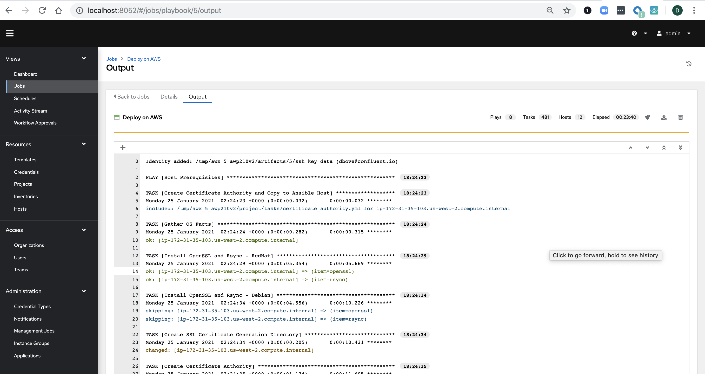
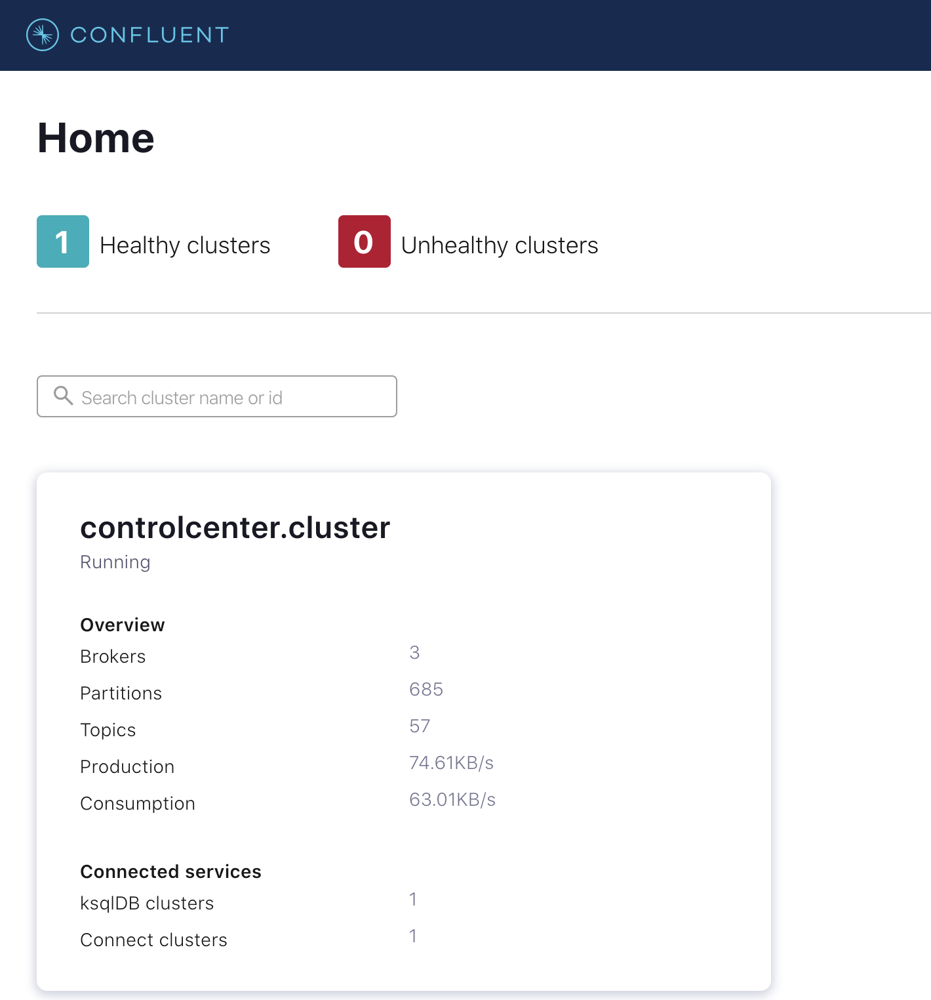

## Prerequisistes:
- [Docker](https://docs.docker.com/desktop/)
- [Docker Compose](https://docs.docker.com/compose/install/)
- [Terraform](https://www.terraform.io/downloads.html)
- An AWS Subnet, preferably in us-west-2

## Usage
Fork this repo. Your fork will serve as a Repo Containing your infrastructure as code.

Set the `REPO_URL` environment variable and clone your fork. Use HTTPS (not SSH) because Tower uses this url
```
export REPO_URL=https://github.com/<fork>/demo-scene

git clone $REPO_URL
```

Set AWS Environment Variables
```
export AWS_ACCESS_KEY_ID="key"
export AWS_SECRET_ACCESS_KEY="secret"
export TF_VAR_vpc_id=vpc-xxxx
export TF_VAR_subnet=subnet-xxxx
```

If subnet outside of us-west-2 set below ami variable to centos image within your region
```
export TF_VAR_ami=ami-xxxx
```

If running this demo in the same subnet as someone else in your organization, to avoid naming collisions set
```
export TF_VAR_unique_identifier=<your-name>
export TF_VAR_ssh_key_pair=<your-name>-key
```

Provision AWS Infrastructure
```
make create-infra
```

Commit the updated inventory file, and push to your fork
```
git add terraform/hosts.yml
git commit -m 'Provisioned infrastructure and updated inventory file.'
git push origin master
```

Stand up Ansible Tower
```
make start-tower
```

Create CP-Ansible Job
```
make create-tower-job
```

Go to http://localhost:8052 in your browser and login with credentials admin/password

Under Templates you can launch `Deploy on AWS`



When the Job Completes, Confluent Platform is Deployed! Find the `ansible_host` of the Control Center host in terraform/hosts.yml and go to https://<ansible_host>:9021 in your browser



Teardown Ansible Tower
```
make stop-tower
```
*Note* This step stops the containers, but does not delete any tower objects. To delete everything delete the `awx/pgdocker/12` directory

Teardown AWS Infrastructure
```
make destroy-infra
```

## Next Steps
You now have a successful Confluent Platform Deployment automated with Ansible Tower.

In CP-Anisble 6.1.0 we have added [Reconfiguration](https://docs.confluent.io/ansible/current/ansible-reconfigure.html). This means you fully automate your Deployments on any changes within Git. First, add [Git Webhooks](https://docs.ansible.com/ansible-tower/latest/html/userguide/webhooks.html) as well. Next under the `Deploy on AWS`, Job Template and add the tag "package" under the skip tags field. Now  any updates to your inventory in Git will trigger Ansible Tower to reconfigure your deployment in true GitOps fashion!

## Future Ideas
The terraform code that enables this blog is great for demos, but is not a production set up. The code should be refactored into Terraform Modules. Autoscaling groups should be added to each ec2 instance. Potentially user data scripts could configure each host on start up.
