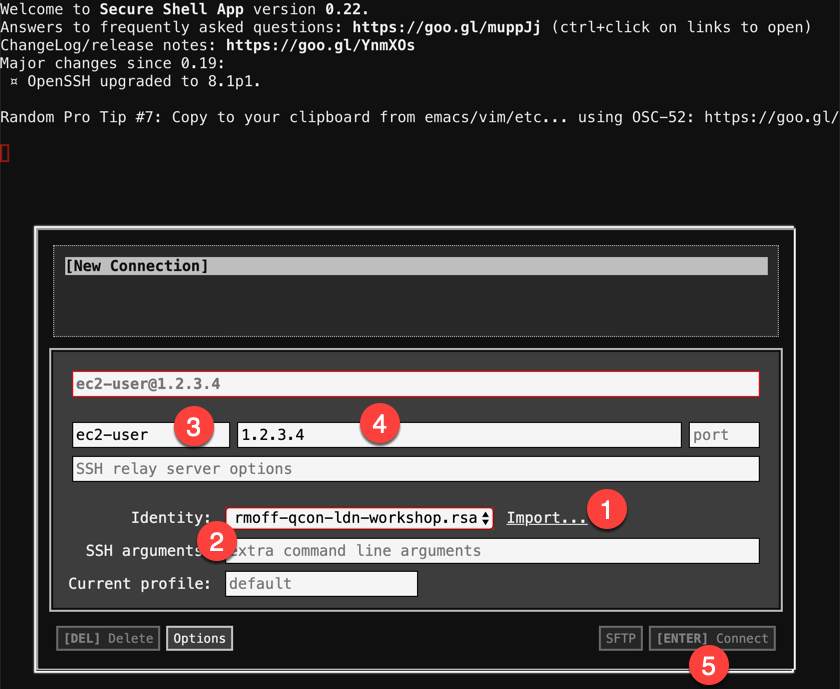
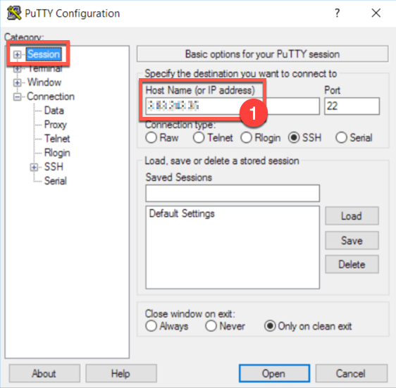
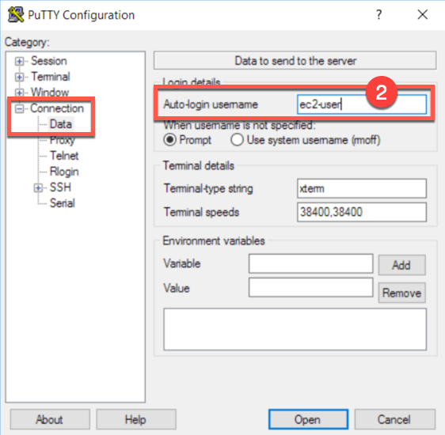
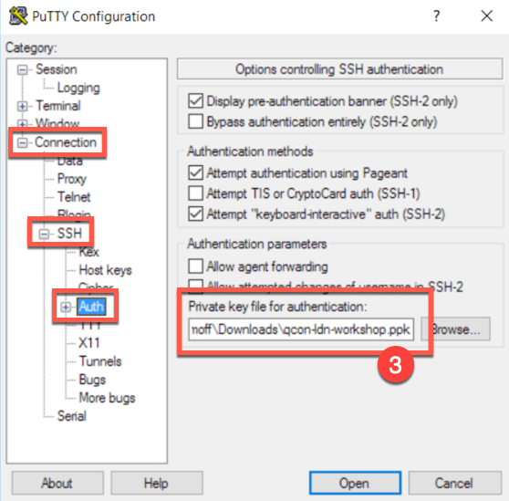
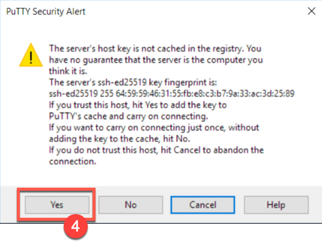
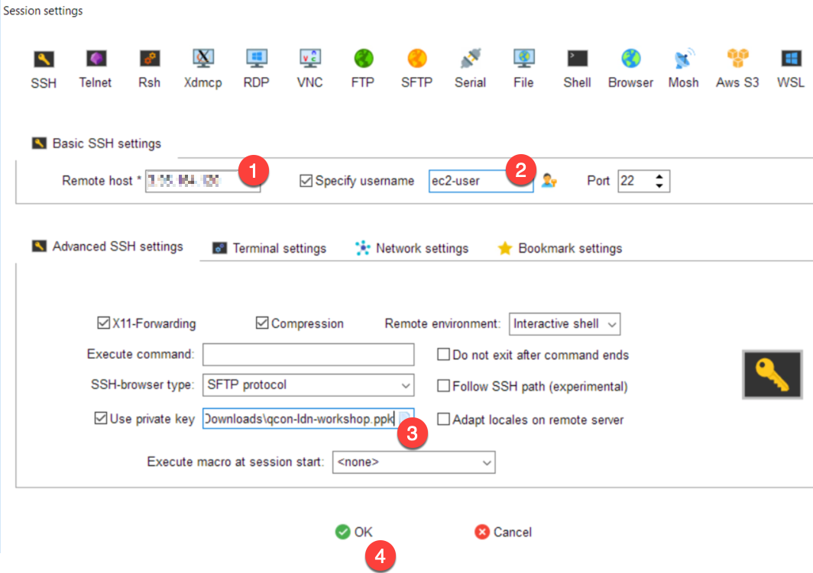

= ksqlDB workshop - connecting to remote environment that's been provisioned for you

NOTE: Do not try to follow this if you're running the stack locally :) 

== What you will need

1. An SSH client. 
+
* On the Mac and Linux you have one already (`Terminal`). 
* On Windows https://www.chiark.greenend.org.uk/~sgtatham/putty/latest.html[PuTTY] or https://mobaxterm.mobatek.net/[MobaXterm] are popular choices. 
* You can also use https://chrome.google.com/webstore/detail/secure-shell-app/pnhechapfaindjhompbnflcldabbghjo/related[`Secure Shell App`] plugin for the Chrome web browser if you want. 

2. The IP address of the machine that's been provisioned for you - speak to the instructor if you do not have this.

3. The SSH private key for connecting to the server. Your instructor will provide this. Copy it to a path on your machine, such as the Downloads folder. 

== Connect to the server

How you do this depends on the SSH client you're using. 

=== Mac/Linux 

Make sure you have the private key. Set the permissions on it so that only your user can read it (otherwise the ssh connection will fail). Use the appropriate path for where you have saved the key. 

[source,bash]
----
chmod 400 ~/Downloads/qcon-ldn-workshop.rsa
----

Use `ssh` from the Terminal to connect to the server, using the `-i` option to tell it to use the SSH key

[source,bash]
----
ssh -i ~/Downloads/qcon-ldn-workshop.rsa ec2-user@1.2.3.4
----

Replace `1.2.3.4` with the IP address of the server that you've been given. 

You'll get a warning: 

[source,bash]
----
The authenticity of host '1.2.3.4 (1.2.3.4)' can't be established.
ECDSA key fingerprint is SHA256:JAoWP5aRvtYu1M4UgPwSewy0/+9lBNdWo2+RahoYxNs.
Are you sure you want to continue connecting (yes/no)? yes
----

Enter `yes` and you should get the shell prompt for your remote server: 

[source,bash]
----
Warning: Permanently added '1.2.3.4' (ECDSA) to the list of known hosts.

   __|  __|  __|
   _|  (   \__ \   Amazon Linux 2 (ECS Optimized)
 ____|\___|____/

For documentation, visit http://aws.amazon.com/documentation/ecs
4 package(s) needed for security, out of 20 available
Run "sudo yum update" to apply all updates.
[ec2-user@ip-10-0-0-53 ~]$
----

Now follow the instructions below **ksqlDB prompt**, and then open a second terminal window, repeat the above process to login to the remote server, and then start a **MySQL prompt** following the separate instructions below. 

=== Windows

Connect using the IP address given, username `ec2-user`. Provide the SSH key to your SSH client (see appendices below for specific instructions). 

Now follow the instructions below **ksqlDB prompt**, and then open a second terminal window, repeat the above process to login to the remote server, and then start a **MySQL prompt** following the separate instructions below. 

=== Chrome SSH extension

1. Click `Import` and upload the private key
2. From the dropdown menu select the private key that you uploaded
3. Set `username` to `ec2-user`
4. Set `hostname` to the IP address of your server
5. Click **Connect**

You'll get a warning: 

[source,bash]
----
The authenticity of host '1.2.3.4 (1.2.3.4)' can't be established.
ECDSA key fingerprint is SHA256:JAoWP5aRvtYu1M4UgPwSewy0/+9lBNdWo2+RahoYxNs.
Are you sure you want to continue connecting (yes/no)? yes
----

Enter `yes` and you should get the shell prompt for your remote server: 

[source,bash]
----
Warning: Permanently added '1.2.3.4' (ECDSA) to the list of known hosts.

   __|  __|  __|
   _|  (   \__ \   Amazon Linux 2 (ECS Optimized)
 ____|\___|____/

For documentation, visit http://aws.amazon.com/documentation/ecs
4 package(s) needed for security, out of 20 available
Run "sudo yum update" to apply all updates.
[ec2-user@ip-10-0-0-53 ~]$
----

Now follow the instructions below **ksqlDB prompt**, and then open a second terminal window, repeat the above process to login to the remote server, and then start a **MySQL prompt** following the separate instructions below. 

== Start your ksqlDB prompt

On the remote server you've just connected to, run the following: 

[source,bash]
----
docker exec -it $(docker ps|grep ksqldb|awk '{print $11}') ksql http://localhost:8088
----

This will take you to the ksqlDB prompt: 

[source,bash]
----
                  ===========================================
                  =       _              _ ____  ____       =
                  =      | | _____  __ _| |  _ \| __ )      =
                  =      | |/ / __|/ _` | | | | |  _ \      =
                  =      |   <\__ \ (_| | | |_| | |_) |     =
                  =      |_|\_\___/\__, |_|____/|____/      =
                  =                   |_|                   =
                  =  Event Streaming Database purpose-built =
                  =        for stream processing apps       =
                  ===========================================

Copyright 2017-2019 Confluent Inc.

CLI v6.0.0-SNAPSHOT, Server v6.0.0-SNAPSHOT located at http://localhost:8088

Having trouble? Type 'help' (case-insensitive) for a rundown of how things work!

ksql>
----

== Start a MySQL prompt

On the remote server you've just connected to, run the following: 

[source,bash]
----
docker exec -it $(docker ps|grep mysql|awk '{print $12}') bash -c 'mysql -u $MYSQL_USER -p$MYSQL_PASSWORD demo'
----

This will take you to the MySQL prompt: 

[source,bash]
----

mysql: [Warning] Using a password on the command line interface can be insecure.
Reading table information for completion of table and column names
You can turn off this feature to get a quicker startup with -A

Welcome to the MySQL monitor.  Commands end with ; or \g.
Your MySQL connection id is 8
Server version: 8.0.19 MySQL Community Server - GPL

Copyright (c) 2000, 2020, Oracle and/or its affiliates. All rights reserved.

Oracle is a registered trademark of Oracle Corporation and/or its
affiliates. Other names may be trademarks of their respective
owners.

Type 'help;' or '\h' for help. Type '\c' to clear the current input statement.

mysql>
----

== Appendix - Using SSH keys with Windows clients

=== PuTTY

1. Launch PuTTY
2. In the **Session** pane enter the IP of your server under **Host Name**
+

3. In the **Connection** -> **Data** pane enter `ec2-user` under **Auto-login username**
+

4. In the **Connection** -> **SSH** -> **Auth** pane click **Browse** to select the SSH private key that you've been provided. Make sure you use the `ppk` format one and not `rsa`.
+

5. Click **Open**. You will get a `PuTTY Security Alert` - click **Yes**
+

=== MobaXterm

1. Launch MobaXterm
2. Click the **Session** button on the toolbar, or from the menus select **Sessions** -> **New Session**
3. Select an **SSH** session type and then fill out the **Remote host**, **Specify username** (`ec2-user`) and click **Advanced SSH settings** and **Use private key** (use the `ppk` format key)
+

