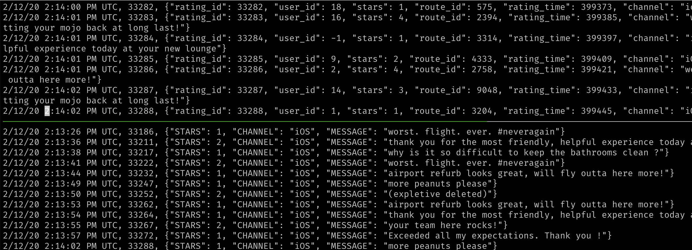
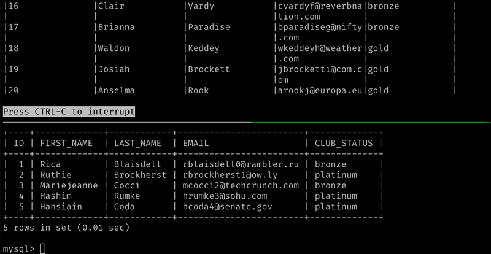
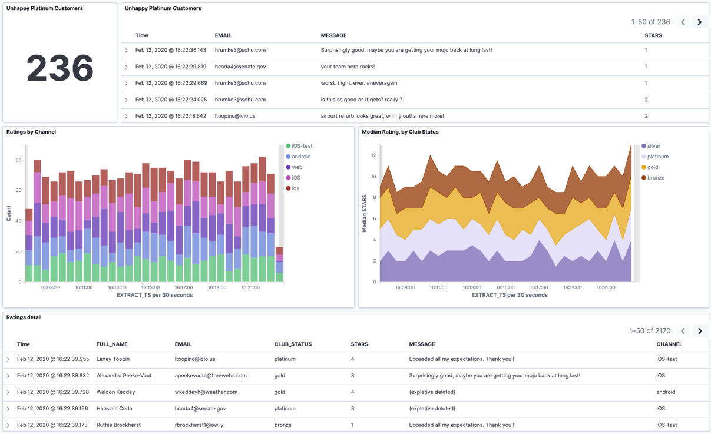

= Workshop: Real-time SQL Stream Processing at Scale with Apache Kafka and ksqlDB (Mac/Linux)
:doctype: book
:toc:
:sectnums:
:experimental:
:icon: font
Robin Moffatt <@rmoff>
v1.50, 12 February 2020

:toc:

== Introduction

[quote]
____
https://ksqldb.io[ksqlDB] is the event streaming database purpose-built for stream processing applications.

Using just SQL, it is possible for developers to build powerful stream processing applications.

This workshop will show practical examples of ksqlDB:

* Filtering streams of data
* Ingesting data from a database to join to a stream of data in Kafka
* Streaming data from Kafka to Elasticsearch
____

image::images/ksql_workshop_01.png[Diagram of what's being built with the ksqlDB demo]

The slides that go with it https://speakerdeck.com/rmoff/javazone-workshop-apache-kafka-and-ksql-in-action-lets-build-a-streaming-data-pipeline[can be found here].

Don't forget to check out the `#ksqldb` channel on our https://slackpass.io/confluentcommunity[Community Slack group]

——_Robin Moffatt https://twitter.com/rmoff/[@rmoff]_

== Prerequisites

IMPORTANT: You need to have a fully-provisioning workshop environment. link:README.adoc[See here for details].

== ksqlDB

ksqlDB can be used via the command-line interface (CLI), a graphical UI built into Confluent Control Center, or the documented https://docs.ksqldb.io/en/latest/developer-guide/api/[REST API].

In this workshop, we will use the CLI, which if you have used Oracle's `sql*plus`, MySQL CLI, and so on will feel very familiar to you.

If you haven't already, refer to the instructions for how to link:README.adoc[provision and connect to ksqlDB either locally or remotely]. Before continuing, ensure that you are at a ksqlDB prompt that looks like this :

[source,bash]
----
                  ===========================================
                  =       _              _ ____  ____       =
                  =      | | _____  __ _| |  _ \| __ )      =
                  =      | |/ / __|/ _` | | | | |  _ `      =
                  =      |   <\__ \ (_| | | |_| | |_) |     =
                  =      |_|\_\___/\__, |_|____/|____/      =
                  =                   |_|                   =
                  =  Event Streaming Database purpose-built =
                  =        for stream processing apps       =
                  ===========================================

Copyright 2017-2019 Confluent Inc.

CLI v0.7.1, Server v0.7.1 located at http://localhost:8088

Having trouble? Type 'help' (case-insensitive) for a rundown of how things work!

ksql>
----

=== See available Kafka topics

ksqlDB can be used to view the topic metadata on a Kafka cluster (`SHOW TOPICS;`), as well as inspect the messages in a topic (`PRINT <topic>;`).

[source,sql]
----
ksql> SHOW TOPICS;

 Kafka Topic                           | Partitions | Partition Replicas
-------------------------------------------------------------------------
 confluent_rmoff_02ksql_processing_log | 1          | 1
 ratings                               | 1          | 1
-------------------------------------------------------------------------
----

=== Inspect a topic contents - Ratings

The event stream driving this example is a simulated stream of events purporting to show the ratings left by users on a website, with data elements including the device type that they used, the star rating, and a message associated with the rating.

Using the `PRINT` command we can easily see column names and values within a topic's messages.
Kafka messages consist of a timestamp, key, and message (payload), which are all shown in the `PRINT` output.

[TIP]
====
Note that we don't need to know the format of the data; ksqlDB introspects the data and understands how to deserialise it.
====

[source,sql]
----
ksql> PRINT 'ratings';
Format:AVRO
rowtime: 3/2/20 11:59:25 AM UTC, key: 76, value: {"rating_id": 76, "user_id": 18, "stars": 2, "route_id": 9346, "rating_time": 901, "channel": "web", "message": "airport refurb looks great, will fly outta here more!"}
rowtime: 3/2/20 11:59:26 AM UTC, key: 77, value: {"rating_id": 77, "user_id": 6, "stars": 1, "route_id": 1313, "rating_time": 913, "channel": "android", "message": "airport refurb looks great, will fly outta here more!"}
----

Press Ctrl-C to cancel and return to the ksqlDB prompt.

[NOTE]
====
*Optional*: You can also inspect the Kafka topic with a tool such as https://github.com/edenhill/kafkacat/[`kafkacat`]. Just like ksqlDB this shows the Kafka messages, but it also includes detailed metadata. Run this from the same shell prompt from which you connected to ksqlDB earlier (but not the ksqlDB prompt itself!). 

[source,bash]
----
docker exec -it $(docker ps|grep kafkacat|awk '{print $13}') kafkacat \
          kafkacat -b kafka:29092 -C -K: \
          -f 'Topic %t / Partition %p / Offset: %o / Timestamp: %T\nHeaders: %h\nKey (%K bytes): %k\nPayload (%S bytes): %s\n--\n' \
          -t ratings \
          -s value=avro \
          -r http://schema-registry:8081 \
          -o end          
----

[source,bash]
----
% Reached end of topic ratings [0] at offset 18987
Topic ratings / Partition 0 / Offset: 18987 / Timestamp: 1581511477183
Headers: task.generation=0,task.id=0,current.iteration=18987
Key (5 bytes): 18988
Payload (52 bytes): {"rating_id": 18988, "user_id": 13, "stars": 4, "route_id": 3964, "rating_time": 227845, "channel": "ios", "message": "worst. flight. ever. #neveragain"}
…
----

Press Ctrl-C to cancel and return to the command prompt.
====

== Querying and filtering streams of data

Having inspected the topics and contents of them, let's get into some SQL now.
The first step in ksqlDB is to register the source topic with ksqlDB.

=== Register the ratings topic

By registering a topic with ksqlDB, we declare its schema and properties.

The inbound event stream of ratings data is a `STREAM`—later we will talk about `TABLE`, but for now, we just need a simple `CREATE STREAM` with the appropriate values in the `WITH` clause:

[source,sql]
----
ksql> CREATE STREAM ratings WITH (KAFKA_TOPIC='ratings', VALUE_FORMAT='AVRO');

 Message
---------------
 Stream created
---------------
----

NOTE: Here we're using data in Avro format, but you can also read and write JSON or CSV data with ksqlDB.
If you use JSON or CSV you have to specify the schema when you create the stream.

=== Describe ratings stream

You'll notice that in the above `CREATE STREAM` statement we didn't specify any of the column names.
That's because the data is in Avro format, and the Confluent Schema Registry supplies the actual schema details.
You can use `DESCRIBE` to examine an object's columns:

[source,sql]
----
ksql> DESCRIBE ratings;

Name                 : RATINGS
 Field       | Type
-----------------------------------------
 ROWTIME     | BIGINT           (system)
 ROWKEY      | VARCHAR(STRING)  (system)
 RATING_ID   | BIGINT
 USER_ID     | INTEGER
 STARS       | INTEGER
 ROUTE_ID    | INTEGER
 RATING_TIME | BIGINT
 CHANNEL     | VARCHAR(STRING)
 MESSAGE     | VARCHAR(STRING)
-----------------------------------------
For runtime statistics and query details run: DESCRIBE EXTENDED <Stream,Table>;
----

Note the presence of a couple of `(system)` columns here. `ROWTIME` is the timestamp of the Kafka message—important for when we do time-based aggregations later— and `ROWKEY` is the key of the Kafka message.

=== Querying data in ksqlDB

Let's run our first SQL.
As anyone familar with SQL knows, `SELECT` will return the specified columns from a given object.
So let's try it!

[source,sql]
----
ksql> SELECT RATING_ID, STARS, CHANNEL, MESSAGE FROM RATINGS EMIT CHANGES;
+------------+-------+-----------+---------------------+
|RATING_ID   |STARS  |CHANNEL    |MESSAGE              |
+------------+-------+-----------+---------------------+
|29197       |2      |iOS-test   |more peanuts please  |
|29198       |4      |android    |worst. flight. ever. |
|            |       |           |#neveragain          |
|29199       |1      |iOS-test   |thank you for the mos|
|            |       |           |t friendly, helpful e|
|            |       |           |xperience today at yo|
|            |       |           |ur new lounge        |
|29200       |2      |web        |airport refurb looks |
|            |       |           |great, will fly outta|
|            |       |           | here more!          |
|29201       |2      |iOS        |your team here rocks!|
[…]
----

You'll notice that the data keeps on coming. That is because ksqlDB is fundamentally a _streaming engine_, and the queries that you run are _continuous queries_. We specified `EMIT CHANGES` which tells ksqlDB to output the changes to the stream, which is everytime a new event arrives.

_This is called a *push query*; later on we'll consider the other kind of query, the *pull query*._ 

Press Ctrl-C to cancel the query and return to the ksqlDB command prompt.

To inspect a finite set of data, you can use the `LIMIT` clause.
Try it out now:

[source,sql]
----
ksql> SELECT RATING_ID, STARS, CHANNEL, MESSAGE 
        FROM RATINGS 
        EMIT CHANGES 
        LIMIT 2;

+-----------+--------+-----------+-------------------------+
|RATING_ID  |STARS   |CHANNEL    |MESSAGE                  |
+-----------+--------+-----------+-------------------------+
|29890      |1       |iOS-test   |meh                      |
|29891      |3       |iOS        |your team here rocks!    |
Limit Reached
Query terminated
----

=== Filtering streams of data in ksqlDB

Since ksqlDB is heavily based on SQL, you can do many of the standard SQL things you'd expect to be able to do, including predicates and selection of specific columns:

[source,sql]
----
ksql> SELECT STARS, CHANNEL, MESSAGE
        FROM RATINGS
       WHERE STARS<3
      EMIT CHANGES;

+-------+----------+------------------------------------------------------+
|STARS  |CHANNEL   |MESSAGE                                               |
+-------+----------+------------------------------------------------------+
|1      |web       |meh                                                   |
|2      |iOS       |more peanuts please                                   |
|1      |web       |worst. flight. ever. #neveragain                      |
Limit Reached
Query terminated
----

<<<
=== ksqlDB offsets

Since Apache Kafka persists data, it is possible to use ksqlDB to query and process data from the past, as well as new events that arrive on the topic.

To tell ksqlDB to process from beginning of topic run 

[source,sql]
----
SET 'auto.offset.reset' = 'earliest';
----

Run this now, so that future processing includes all existing data.

[source,sql]
----
Successfully changed local property 'auto.offset.reset' to 'earliest'. Use the UNSET command to revert your change.
ksql>
----

<<<

== Creating a Kafka topic populated by a filtered stream

image::images/ksql_workshop_02.png[Filtering data with ksqlDB]

Let's take the poor ratings from people with iOS devices, and create a new stream from them!

[source,sql]
----
ksql> CREATE STREAM POOR_RATINGS AS 
        SELECT STARS, CHANNEL, MESSAGE
          FROM ratings 
         WHERE STARS <3 
           AND CHANNEL='iOS';

 Message
----------------------------------------------------------------------------------------------
 Stream POOR_RATINGS created and running. Created by query with query ID: CSAS_POOR_RATINGS_0
----------------------------------------------------------------------------------------------
----

What this does is set a ksqlDB continuous query running that processes messages on the source `ratings` topic to:

* applies the predicates (`STARS<3 AND CHANNEL='iOS'``)
* selects just the specified columns
** If you wanted to take all columns from the source stream, you would simply use `SELECT *`

Each processed message is written to a new Kafka topic.
Remember, this is a _continuous query_, so every single source message—past, present, and future—will be processed with low-latency in this way.
If we only want to process _new_ messages and not existing ones, we would configure `SET 'auto.offset.reset' = 'latest';`.

=== Inspect the derived stream

Information about the derived stream is available with the `DESCRIBE EXTENDED` command:

[source,sql]
----
ksql> DESCRIBE EXTENDED POOR_RATINGS;

Name                 : POOR_RATINGS
Type                 : STREAM
Key field            :
Timestamp field      : Not set - using <ROWTIME>
Key format           : KAFKA
Value format         : AVRO
Kafka topic          : POOR_RATINGS (partitions: 1, replication: 1)
Statement            : CREATE STREAM POOR_RATINGS WITH (KAFKA_TOPIC='POOR_RATINGS', PARTITIONS=1, REPLICAS=1) AS SELECT
  RATINGS.STARS STARS,
  RATINGS.CHANNEL CHANNEL,
  RATINGS.MESSAGE MESSAGE
FROM RATINGS RATINGS
WHERE ((RATINGS.STARS < 3) AND (RATINGS.CHANNEL = 'iOS'))
EMIT CHANGES;

 Field   | Type
-------------------------------------
 ROWTIME | BIGINT           (system)
 ROWKEY  | VARCHAR(STRING)  (system)
 STARS   | INTEGER
 CHANNEL | VARCHAR(STRING)
 MESSAGE | VARCHAR(STRING)
-------------------------------------

Queries that write from this STREAM
-----------------------------------
CSAS_POOR_RATINGS_5 (RUNNING) : CREATE STREAM POOR_RATINGS WITH (KAFKA_TOPIC='POOR_RATINGS', PARTITIONS=1, REPLICAS=1) AS SELECT  RATINGS.STARS STARS,  RATINGS.CHANNEL CHANNEL,  RATINGS.MESSAGE MESSAGEFROM RATINGS RATINGSWHERE ((RATINGS.STARS < 3) AND (RATINGS.CHANNEL = 'iOS'))EMIT CHANGES;

For query topology and execution plan please run: EXPLAIN <QueryId>

Local runtime statistics
------------------------
messages-per-sec:     32.08   total-messages:      3189     last-message: 2020-02-12T14:04:36.722Z

(Statistics of the local KSQL server interaction with the Kafka topic POOR_RATINGS)
----

Note the *runtime statistics* above.
If you re-run the `DESCRIBE EXTENDED` command you'll see these values increasing.

----
Local runtime statistics
------------------------
messages-per-sec:      0.26   total-messages:      3200     last-message: 2020-02-12T14:05:10.306Z

(Statistics of the local KSQL server interaction with the Kafka topic POOR_RATINGS)
----

_N.B. you can use the up arrow on your keyboard to cycle through ksqlDB command history for easy access and replay of previous commands.
Ctrl-R also works for searching command history._

=== Query the stream

The derived stream that we've created is just another stream that we can interact with in ksqlDB as any other.
If you run a `SELECT` against the stream you'll see new messages arriving based on those coming from the source `ratings` topic:

[source,sql]
----
ksql> SELECT STARS, CHANNEL, MESSAGE FROM POOR_RATINGS EMIT CHANGES;
+-------+--------+-----------------------------------------------------------+
|STARS  |CHANNEL |MESSAGE                                                    |
+-------+--------+-----------------------------------------------------------+
|1      |iOS     |(expletive deleted)                                        |
|2      |iOS     |why is it so difficult to keep the bathrooms clean ?       |
|1      |iOS     |worst. flight. ever. #neveragain                           |
----

Press Ctrl-C to cancel and return to the ksqlDB prompt.

=== It's just a Kafka topic…

The query that we created above (`CREATE STREAM POOR_RATINGS AS…`) populates a Kafka topic, which we can also access as a ksqlDB stream (as in the previous step). Let's inspect this topic now, using ksqlDB.

Observe that the topic exists:

[source,sql]
----
ksql> SHOW TOPICS;

 Kafka Topic                           | Partitions | Partition Replicas
-------------------------------------------------------------------------
 POOR_RATINGS                          | 1          | 1
 confluent_rmoff_01ksql_processing_log | 1          | 1
 ratings                               | 1          | 1
-------------------------------------------------------------------------
----

Inspect the Kafka topic's data

[source,bash]
----
ksql> SET 'auto.offset.reset' = 'latest';
ksql> PRINT 'POOR_RATINGS';
Format:AVRO
2/12/20 2:07:32 PM UTC, 32224, {"STARS": 2, "CHANNEL": "iOS", "MESSAGE": "Surprisingly good, maybe you are getting your mojo back at long last!"}
2/12/20 2:07:33 PM UTC, 32225, {"STARS": 2, "CHANNEL": "iOS", "MESSAGE": "is this as good as it gets? really ?"}
----

=== Optional step: Compare to the source events arriving

Open a second window with another ksqlDB prompt. In this one, run 

[source,sql]
----
ksql> SET 'auto.offset.reset' = 'latest';
ksql> PRINT 'ratings';
----

Note how this new one shows events arriving at the source topic, whilst the previous one shows the new topic with only events with a star rating less than three and from a device `iOS`

=== Optional step: Alternative serialisation methods

By default ksqlDB will write to the target stream using the same serialisation as the source.
So if it's reading Avro data, it'll write Avro data.
You can override this behaviour using the `WITH (VALUE_FORMAT='xx')` syntax.
For example, if for some terrible reason you wanted to write data to CSV in a topic, you would run:

[source,sql]
----
ksql> CREATE STREAM POOR_RATINGS_CSV WITH (VALUE_FORMAT='DELIMITED') AS 
        SELECT * FROM ratings WHERE STARS <3 AND CHANNEL='iOS';
----

You can use a similar syntax to change the name and partitions of the target Kafka topic:

[source,sql]
----
ksql> CREATE STREAM POOR_RATINGS_JSON WITH (VALUE_FORMAT='JSON', PARTITIONS=2) AS 
        SELECT * FROM ratings WHERE STARS <3 AND CHANNEL='iOS';
----

[NOTE]
====
Re-serialising data this way can be a powerful use of ksqlDB in itself.
Consider a source topic being written to in CSV format, and this topic is to be used by multiple consumers.
One option is each consumer has to know the schema of the CSV.
Another option is to declare the schema in ksqlDB once, and then reserialise the data into a better format such as Avro.
Now each consumer can use the data without being tightly-coupled to the original system.

_The SQL code would look like this - the source topic doesn't exist in your workshop environment so you won't be able to actually run it._

[source,sql]
----
CREATE STREAM USER_LOGON_CSV (first_name VARCHAR, 
                              last_name  VARCHAR, 
                              email      VARCHAR, 
                              ip_address VARCHAR, 
                              logon_date VARCHAR) 
        WITH (KAFKA_TOPIC ='user_logons', 
              VALUE_FORMAT='DELIMITED');

CREATE STREAM USER_LOGON WITH (VALUE_FORMAT='AVRO') AS 
  SELECT * FROM USER_LOGON_CSV;           
----
====

<<<

== Kafka Connect / Integrating Kafka with a database

In the stream of events that we worked with above there was a field called `USER_ID` that is a reference to the customer who left the review. We have information about customers held on a database. Let's see how we can pull in information from a database into Kafka, and use it in ksqlDB to enrich streams of events. 

We'll ingest the Customers data from a database using https://www.confluent.io/blog/no-more-silos-how-to-integrate-your-databases-with-apache-kafka-and-cdc[Kafka Connect and CDC]. 

Let's take a look at the database first. From the *MySQL prompt* that you link:README.adoc[created earlier] inspect the tables: 

NOTE: Make sure that you run this in the MySQL CLI, *not* the ksqlDB CLI :) 

[source,sql]
----
mysql> SHOW TABLES;
+----------------+
| Tables_in_demo |
+----------------+
| CUSTOMERS      |
+----------------+
1 row in set (0.00 sec)
----

Examine the data in the table: 

[source,sql]
----
mysql> SELECT ID, FIRST_NAME, LAST_NAME, EMAIL, CLUB_STATUS FROM CUSTOMERS LIMIT 5;
+----+-------------+------------+------------------------+-------------+
| ID | FIRST_NAME  | LAST_NAME  | EMAIL                  | CLUB_STATUS |
+----+-------------+------------+------------------------+-------------+
|  1 | Rica        | Blaisdell  | rblaisdell0@rambler.ru | bronze      |
|  2 | Ruthie      | Brockherst | rbrockherst1@ow.ly     | platinum    |
|  3 | Mariejeanne | Cocci      | mcocci2@techcrunch.com | bronze      |
|  4 | Hashim      | Rumke      | hrumke3@sohu.com       | platinum    |
|  5 | Hansiain    | Coda       | hcoda4@senate.gov      | platinum    |
+----+-------------+------------+------------------------+-------------+
5 rows in set (0.01 sec)
----

=== Create the connector 

Now back in the *ksqlDB* CLI, create the connector. This will ingest into a Kafka topic everything already in the MySQL table _and every subsequent change to it_. 

NOTE: Run this in the *ksqlDB* CLI

[source,sql]
----
ksql> CREATE SOURCE CONNECTOR SOURCE_MYSQL_01 WITH (
    'connector.class' = 'io.debezium.connector.mysql.MySqlConnector',
    'database.hostname' = 'mysql',
    'database.port' = '3306',
    'database.user' = 'debezium',
    'database.password' = 'dbz',
    'database.server.id' = '42',
    'database.server.name' = 'asgard',
    'table.whitelist' = 'demo.customers',
    'database.history.kafka.bootstrap.servers' = 'kafka:29092',
    'database.history.kafka.topic' = 'dbhistory.demo' ,
    'include.schema.changes' = 'false',
    'transforms'= 'unwrap,extractkey',
    'transforms.unwrap.type'= 'io.debezium.transforms.ExtractNewRecordState',
    'transforms.extractkey.type'= 'org.apache.kafka.connect.transforms.ExtractField$Key',
    'transforms.extractkey.field'= 'id',
    'key.converter'= 'org.apache.kafka.connect.storage.StringConverter',
    'value.converter'= 'io.confluent.connect.avro.AvroConverter',
    'value.converter.schema.registry.url'= 'http://schema-registry:8081'
    );

 Message
-----------------------------------
 Created connector SOURCE_MYSQL_01
-----------------------------------    
----

Check that the connector is running. You'll see the one you just created, along with another one that was set up as part of the environment when it was built. 

[source,sql]
----
ksql> SHOW CONNECTORS;

 Connector Name    | Type   | Class                                               | Status
----------------------------------------------------------------------------------------------------------------
 source-datagen-01 | SOURCE | io.confluent.kafka.connect.datagen.DatagenConnector | RUNNING (1/1 tasks RUNNING)
 SOURCE_MYSQL_01   | SOURCE | io.debezium.connector.mysql.MySqlConnector          | RUNNING (1/1 tasks RUNNING)
----------------------------------------------------------------------------------------------------------------
----

Make sure that the `Status` is `RUNNING` and not `WARNING`. 

=== Inspect the data from the connector

The data is written to a topic based on the table name. You will see `asgard.demo.CUSTOMERS` listed in the topics: 

[source,sql]
----
ksql> SHOW TOPICS;

 Kafka Topic                           | Partitions | Partition Replicas
-------------------------------------------------------------------------
 POOR_RATINGS                          | 1          | 1
 asgard.demo.CUSTOMERS                 | 1          | 1
 confluent_rmoff_01ksql_processing_log | 1          | 1
 dbhistory.demo                        | 1          | 1
 ratings                               | 1          | 1
-------------------------------------------------------------------------
----

Sample some records from the topic; observe that it's the same data from MySQL: 

[source,sql]
----
ksql> PRINT 'asgard.demo.CUSTOMERS' FROM BEGINNING LIMIT 5;

Format:AVRO
2/12/20 2:40:43 PM UTC, 1, {"id": 1, "first_name": "Rica", "last_name": "Blaisdell", "email": "rblaisdell0@rambler.ru", "gender": "Female", "club_status": "bronze", "comments": "Universal optimal hierarchy", "create_ts": "2020-02-12T10:45:04Z", "update_ts": "2020-02-12T10:45:04Z"}
2/12/20 2:40:43 PM UTC, 2, {"id": 2, "first_name": "Ruthie", "last_name": "Brockherst", "email": "rbrockherst1@ow.ly", "gender": "Female", "club_status": "platinum", "comments": "Reverse-engineered tangible interface", "create_ts": "2020-02-12T10:45:04Z", "update_ts": "2020-02-12T10:45:04Z"}
2/12/20 2:40:43 PM UTC, 3, {"id": 3, "first_name": "Mariejeanne", "last_name": "Cocci", "email": "mcocci2@techcrunch.com", "gender": "Female", "club_status": "bronze", "comments": "Multi-tiered bandwidth-monitored capability", "create_ts": "2020-02-12T10:45:04Z", "update_ts": "2020-02-12T10:45:04Z"}
2/12/20 2:40:43 PM UTC, 4, {"id": 4, "first_name": "Hashim", "last_name": "Rumke", "email": "hrumke3@sohu.com", "gender": "Male", "club_status": "platinum", "comments": "Self-enabling 24/7 firmware", "create_ts": "2020-02-12T10:45:04Z", "update_ts": "2020-02-12T10:45:04Z"}
2/12/20 2:40:43 PM UTC, 5, {"id": 5, "first_name": "Hansiain", "last_name": "Coda", "email": "hcoda4@senate.gov", "gender": "Male", "club_status": "platinum", "comments": "Centralized full-range approach", "create_ts": "2020-02-12T10:45:04Z", "update_ts": "2020-02-12T10:45:04Z"}
----

=== Modelling a Kafka topic as a Table

Up until now, we've used the idea of a Kafka topic plus a schema equalling a *Stream*. ksqlDB supports a second type of object: a *Table*. A table differs from a stream in that values are _mutable_. Whilst a stream is append-only (you cannot change what has happened, only add to it) a table holds a value for a key, and that value can change. 

INFO: Read https://www.confluent.io/blog/kafka-streams-tables-part-1-event-streaming[Michael Noll's excellent article "Streams and Tables in Apache Kafka: A Primer"] to learn more about the concept of streams and tables.  

You define a table the same as a stream, just specifying `TABLE` instead: 

[source,sql]
----
ksql> CREATE TABLE  CUSTOMERS WITH (KAFKA_TOPIC='asgard.demo.CUSTOMERS', VALUE_FORMAT='AVRO');

 Message
---------------
 Table created
---------------
----

Now we can query the table, which is just an abstraction on top of the Kafka topic that we loaded from MySQL: 

[source,sql]
----
ksql> SET 'auto.offset.reset' = 'earliest';
ksql> SELECT ID, FIRST_NAME, LAST_NAME, EMAIL, CLUB_STATUS 
        FROM CUSTOMERS 
        EMIT CHANGES;

+----+-------------+------------+------------------------+-------------+
|ID  |FIRST_NAME   |LAST_NAME   |EMAIL                   |CLUB_STATUS  |
+----+-------------+------------+------------------------+-------------+
|1   |Rica         |Blaisdell   |rblaisdell0@rambler.ru  |bronze       |
|2   |Ruthie       |Brockherst  |rbrockherst1@ow.ly      |platinum     |
|3   |Mariejeanne  |Cocci       |mcocci2@techcrunch.com  |bronze       |
|4   |Hashim       |Rumke       |hrumke3@sohu.com        |platinum     |
|5   |Hansiain     |Coda        |hcoda4@senate.gov       |platinum     |
…
----

Leaving this ksqlDB query running, use the MySQL CLI in another window to make changes to the database. Observe that as you change the data in MySQL, it is updated in ksqlDB. 

[source,sql]
----
mysql> INSERT INTO CUSTOMERS (ID,FIRST_NAME,LAST_NAME) VALUES (42,'Rick','Astley');
----

[source,sql]
----
mysql> UPDATE CUSTOMERS SET EMAIL = 'rick@example.com' where ID=42;
----

[source,sql]
----
mysql> UPDATE CUSTOMERS SET CLUB_STATUS = 'bronze' where ID=42;
----

[source,sql]
----
mysql> UPDATE CUSTOMERS SET CLUB_STATUS = 'platinum' where ID=42;
----

=== Stream/Table duality

We've got a single topic (`asgard.demo.CUSTOMERS`) populated by the connector from MySQL, but we can _model_ it in two different ways: as a stream, or as a table. 

The stream shows us all the events, whilst the table gives us the *state* (value) for a given key. 

Let's explore that. Open a second ksqlDB prompt, and run: 

[source,sql]
----
ksql> CREATE STREAM CUSTOMERS_STREAM WITH (KAFKA_TOPIC='asgard.demo.CUSTOMERS', VALUE_FORMAT='AVRO');

ksql> SET 'auto.offset.reset' = 'earliest';

ksql> SELECT TIMESTAMPTOSTRING(ROWTIME, 'HH:mm:ss') AS EVENT_TS, 
       ID, 
       FIRST_NAME, 
       LAST_NAME, 
       EMAIL, 
       CLUB_STATUS 
  FROM CUSTOMERS_STREAM WHERE ID=42
  EMIT CHANGES;
----

In the first ksqlDB prompt run

[source,sql]
----
ksql> SET 'auto.offset.reset' = 'earliest';

ksql> SELECT TIMESTAMPTOSTRING(ROWTIME, 'HH:mm:ss') AS EVENT_TS, 
       ID, 
       FIRST_NAME, 
       LAST_NAME, 
       EMAIL, 
       CLUB_STATUS 
  FROM CUSTOMERS WHERE ID=42
  EMIT CHANGES;
----

Observe how the *stream* shows all the _events_, whilst the *table* shows the current _state_. Both come from the same Kafka topic!

=== [Optional] Tables and Keys

Note that the _key_ thing with a table is just that - it's *key*. The key of the Kafka message is what ksqlDB will use when performing a join to another object. For the customers table that field is `ID` so we need to check that the `ROWKEY` matches it for the join to succeed. 

You can see the Kafka message key in the output of a tool such as `kafkacat` (see above where we used it on `ratings` - try it out for the customers topic), as well as ksqlDB itself in the `ROWKEY` field: 

[source,sql]
----
ksql> SELECT ROWKEY, ID, FIRST_NAME FROM CUSTOMERS EMIT CHANGES;
+--------+-------+----------------+
|ROWKEY  |ID     |FIRST_NAME      |
+--------+-------+----------------+
|1       |1      |Rica            |
|2       |2      |Ruthie          |
|3       |3      |Mariejeanne     |
|4       |4      |Hashim          |
|5       |5      |Hansiain        |
…
----

<<< 
== Joining Data in ksqlDB

image::images/ksql_workshop_03.png[Joining data with ksqlDB]

Let's use the customer data (`CUSTOMERS`) and use it to enrich the inbound stream of ratings data (`RATINGS`) to show against each rating who the customer is, and their club status ('platinum','gold', etc).

Run the following SQL:

[source,sql]
----
ksql> SELECT R.MESSAGE, C.FIRST_NAME, C.LAST_NAME 
        FROM RATINGS R INNER JOIN CUSTOMERS C 
        ON CAST(R.USER_ID AS STRING) = C.ROWKEY
        EMIT CHANGES LIMIT 5;
----

There are a couple of things to note about this query :

* We're aliasing the table and stream names to make column names unambiguous
* To satisfy the join requirements, we cast the `USER_ID` to a `STRING` to match the type of the message key in the customers Kafka messages. 

In the output you should see a rating message, and the name of the customer who left it:

[source,sql]
----
+-----------------------------------------------------------+------------+-----------+
|MESSAGE                                                    |FIRST_NAME  |LAST_NAME  |
+-----------------------------------------------------------+------------+-----------+
|more peanuts please                                        |Brena       |Tollerton  |
|Surprisingly good, maybe you are getting your mojo back at |Robinet     |Leheude    |
|long last!                                                 |            |           |
|thank you for the most friendly, helpful experience today a|Clair       |Vardy      |
|t your new lounge                                          |            |           |
|Surprisingly good, maybe you are getting your mojo back at |Patti       |Rosten     |
|long last!                                                 |            |           |
|Surprisingly good, maybe you are getting your mojo back at |Rodrique    |Silverton  |
|long last!                                                 |            |           |
Limit Reached
Query terminated
ksql>
----

<<<
==== Populating a Kafka topic with the results of a Stream-Table join

Let's persist this as an enriched stream, including a few more columns (including concatenating the two components of the name (`FIRST_NAME` and `LAST_NAME`)), by using `CREATE STREAM … AS`:

[source,sql]
----
ksql> SET 'auto.offset.reset' = 'earliest';
ksql> CREATE STREAM RATINGS_WITH_CUSTOMER_DATA 
        WITH (KAFKA_TOPIC='ratings-enriched') AS 
            SELECT R.RATING_ID, R.MESSAGE, R.STARS, R.CHANNEL,
                   C.ID, C.FIRST_NAME + ' ' + C.LAST_NAME AS FULL_NAME, 
                   C.CLUB_STATUS, C.EMAIL 
            FROM   RATINGS R 
                   LEFT JOIN CUSTOMERS C 
                     ON CAST(R.USER_ID AS STRING) = C.ROWKEY      
            WHERE  C.FIRST_NAME IS NOT NULL
            EMIT CHANGES;

Successfully changed local property 'auto.offset.reset' to 'earliest'. Use the UNSET command to revert your change.

 Message
---------------------------------------------------------------------------------------------------------------------------
 Stream RATINGS_WITH_CUSTOMER_DATA created and running. Created by query with query ID: CSAS_RATINGS_WITH_CUSTOMER_DATA_21
---------------------------------------------------------------------------------------------------------------------------
----

=== [Optional] Examine changing reference data

CUSTOMERS is a ksqlDB _table_, which means that we have the latest value for a given key.

Check out the ratings for customer id 2 only from the new stream that we've created - note the `CLUB_STATUS` is `platinum`:

[source,sql]
----
ksql> SELECT TIMESTAMPTOSTRING(ROWTIME, 'HH:mm:ss') AS EVENT_TS, 
             FULL_NAME, CLUB_STATUS, STARS, MESSAGE, CHANNEL 
        FROM RATINGS_WITH_CUSTOMER_DATA 
       WHERE ID=2
       EMIT CHANGES;
----

In MySQL, make a change to ID 2

[source,sql]
----
mysql> UPDATE CUSTOMERS SET CLUB_STATUS = 'bronze' WHERE ID=2;
----

Observe in the continuous ksqlDB query output that the customer's club status reflects that _current status_ as set in the database. 

=== Filtering an enriched stream

Now that we have customer information added to every rating event, we can easily answer questions such as "Which of our Premier customers are not happy?":

[source,sql]
----
ksql> SELECT EMAIL, STARS, MESSAGE 
        FROM RATINGS_WITH_CUSTOMER_DATA 
        WHERE CLUB_STATUS='platinum' 
        AND STARS <3 
        EMIT CHANGES;
----

[source,sql]
----
+----------------------+------+-----------------------------------------------------------+
|EMAIL                 |STARS |MESSAGE                                                    |
+----------------------+------+-----------------------------------------------------------+
|rbrockherst1@ow.ly    |1     |worst. flight. ever. #neveragain                           |
|rleheude5@reddit.com  |2     |meh                                                        |
|ltoopinc@icio.us      |2     |more peanuts please                                        |
…
----

<<<
=== Daisy-chaining derived streams

image::images/ksql_workshop_04.png[Filtering enriched data with ksqlDB]

Having enriched the initial stream of ratings events with customer data, we can now persist a filtered version of that stream that includes a predicate to identify just those VIP customers who have left bad reviews:

[source,sql]
----
ksql> CREATE STREAM UNHAPPY_PLATINUM_CUSTOMERS AS 
        SELECT FULL_NAME, CLUB_STATUS, EMAIL, STARS, MESSAGE 
        FROM   RATINGS_WITH_CUSTOMER_DATA 
        WHERE  STARS < 3 
        AND  CLUB_STATUS = 'platinum';
----

[source,sql]
----

 Message
---------------------------------------------------------------------------------------------------------------------------
 Stream UNHAPPY_PLATINUM_CUSTOMERS created and running. Created by query with query ID: CSAS_UNHAPPY_PLATINUM_CUSTOMERS_27
---------------------------------------------------------------------------------------------------------------------------
----

==== Query the new stream

Now we can query the derived stream to easily identify important customers who are not happy.
Since this is backed by a Kafka topic being continually popuated by ksqlDB we can also drive other applications with this data, as well as land it to datastores down-stream for visualisation.

[source,sql]
----
ksql> SELECT STARS, MESSAGE, EMAIL FROM UNHAPPY_PLATINUM_CUSTOMERS EMIT CHANGES;
1 | is this as good as it gets? really ? | aarent0@cpanel.net
2 | airport refurb looks great, will fly outta here more! | aarent0@cpanel.net
2 | meh | aarent0@cpanel.net
----

== Stream the data to Elasticsearch

Using Kafka Connect you can stream data from a Kafka to one (or many) targets, including Elasticsearch, HDFS, S3, and so on.

Here we'll see how to stream it to Elasticsearch for rapid visualisation and analysis. As with ingest data from MySQL, we can define the connector to the external system from within ksqlDB itself. This is how to stream data from two different Kafka topics out to Elasticsearch: 

[source,sql]
----
ksql> CREATE SINK CONNECTOR SINK_ELASTIC_01 WITH (
  'connector.class' = 'io.confluent.connect.elasticsearch.ElasticsearchSinkConnector',
  'connection.url' = 'http://elasticsearch:9200',
  'type.name' = '',
  'behavior.on.malformed.documents' = 'warn',
  'errors.tolerance' = 'all',
  'errors.log.enable' = 'true',
  'errors.log.include.messages' = 'true',
  'topics' = 'ratings-enriched,UNHAPPY_PLATINUM_CUSTOMERS',
  'key.ignore' = 'true',
  'schema.ignore' = 'true',
  'key.converter' = 'org.apache.kafka.connect.storage.StringConverter',
  'transforms'= 'ExtractTimestamp',
  'transforms.ExtractTimestamp.type'= 'org.apache.kafka.connect.transforms.InsertField$Value',
  'transforms.ExtractTimestamp.timestamp.field' = 'EXTRACT_TS'
);
----

[source,sql]
----
 Message
-----------------------------------
 Created connector SINK_ELASTIC_01
-----------------------------------
----

Check that the connector is running. The `Status` should be `RUNNING (1/1 tasks RUNNING)`:

[source,sql]
----
ksql> SHOW CONNECTORS;

 Connector Name    | Type   | Class                                                         | Status
--------------------------------------------------------------------------------------------------------------------------
 SOURCE_MYSQL_01   | SOURCE | io.debezium.connector.mysql.MySqlConnector                    | RUNNING (1/1 tasks RUNNING)
 source-datagen-01 | SOURCE | io.confluent.kafka.connect.datagen.DatagenConnector           | RUNNING (1/1 tasks RUNNING)
 SINK_ELASTIC_01   | SINK   | io.confluent.connect.elasticsearch.ElasticsearchSinkConnector | RUNNING (1/1 tasks RUNNING)
--------------------------------------------------------------------------------------------------------------------------
----

Now we need to launch the Kibana dashboard. How you do this depends on where your environment is running:

* *If you're running the whole stack locally*, simply go to http://localhost:5601/app/kibana#/dashboard/mysql-ksql-kafka-es
* *If you're using a remotely-hosted environment*, you need the _IP address of the server to which you have connected with SSH to ksqlDB_. Take this IP address and in your local web browser go to `http://my_ip_address:5601/app/kibana#/dashboard/mysql-ksql-kafka-es`

You should see a dashboard like this: 

Note that this is being fed with live events—if you click the *Refresh* button you'll see it updates with up-to-the-second data. By default the dashboard shows the last 15 minutes of events.

== Streaming Aggregates

ksqlDB can create aggregations of event data, either over all events to date (and continuing to update with new data), or based on a time window.
The time window types supported are:

* Tumbling (e.g. every 5 minutes : 00:00, 00:05, 00:10)
* Hopping (e.g. every 5 minutes, advancing 1 minute: 00:00-00:05, 00:01-00:06)
* Session (Sets a timeout for the given key, after which any new data is treated as a new session)

To understand more about these time windows, you can read the related https://docs.confluent.io/current/streams/developer-guide/dsl-api.html#windowing[Kafka Streams documentation]. Since ksqlDB is built on Kafka Streams, the concepts are the same.
The https://docs.confluent.io/current/ksql/docs/tutorials/examples.html#aggregating-windowing-and-sessionization[ksqlDB-specific documentation] is also useful.

NOTE: ksqlDB will _re-emit_ aggregates as they are updated by incoming events.
This means that you will see multiple rows of output for a given window/key.

image::images/ksql_workshop_05.png[Aggregating data with ksqlDB]

=== Running Count per Minute

This shows the number of ratings per customer status, per minute:

[source,sql]
----
ksql> SET 'auto.offset.reset' = 'earliest';
ksql> SELECT TIMESTAMPTOSTRING(WINDOWSTART, 'yyyy-MM-dd HH:mm:ss') AS WINDOW_START_TS, 
            CLUB_STATUS, COUNT(*) AS RATING_COUNT 
        FROM RATINGS_WITH_CUSTOMER_DATA 
            WINDOW TUMBLING (SIZE 1 MINUTES) 
        GROUP BY CLUB_STATUS
        EMIT CHANGES;
----

[source,sql]
----
+--------------------+-------------+---------------+
|WINDOW_START_TS     |CLUB_STATUS  |RATING_COUNT   |
+--------------------+-------------+---------------+
|2020-02-12 10:46:00 |silver       |15             |
|2020-02-12 10:46:00 |platinum     |30             |
|2020-02-12 10:46:00 |gold         |36             |
|2020-02-12 10:46:00 |bronze       |38             |
|2020-02-12 10:47:00 |gold         |43             |
…
----

The time window itself is exposed in the results using the system column `WINDOWSTART`, which is then cast from epoch to human-readable form with the `TIMESTAMPTOSTRING` function.

=== Writing aggregates to a new Kafka topic

Aggregates can be persisted too.

Instead of `CREATE STREAM` as we did above, we're going to instead persist with a `CREATE TABLE`, since aggregates are always a table (key + value). Just as before though, a Kafka topic is continually populated with the results of the query:

[source,sql]
----
ksql> SET 'auto.offset.reset' = 'earliest';
ksql> CREATE TABLE RATINGS_BY_CLUB_STATUS AS
        SELECT CLUB_STATUS, COUNT(*) AS RATING_COUNT 
        FROM RATINGS_WITH_CUSTOMER_DATA 
            WINDOW TUMBLING (SIZE 1 MINUTES) 
        GROUP BY CLUB_STATUS
        EMIT CHANGES;
----

[source,sql]
----

 Message
------------------------------------------------------------------------------------------------------------------
 Table RATINGS_BY_CLUB_STATUS created and running. Created by query with query ID: CTAS_RATINGS_BY_CLUB_STATUS_29
------------------------------------------------------------------------------------------------------------------
----

=== Querying aggregates with Push queries

This table that we've created is just a first class object in ksqlDB, updated in real time with the results from the aggregate query.
Because it's just another object in ksqlDB, we can query and filter it as any other:

[source,sql]
----
SELECT TIMESTAMPTOSTRING(WINDOWSTART, 'yyyy-MM-dd HH:mm:ss') AS WINDOW_START_TS, 
        CLUB_STATUS, RATING_COUNT 
FROM RATINGS_BY_CLUB_STATUS 
WHERE CLUB_STATUS='bronze'
EMIT CHANGES;
----

[source,sql]
----
+--------------------+------------+-------------+
|WINDOW_START_TS     |CLUB_STATUS |RATING_COUNT |
+--------------------+------------+-------------+
|2020-02-12 10:46:00 |bronze      |38           |
|2020-02-12 10:47:00 |bronze      |26           |
|2020-02-12 10:48:00 |bronze      |25           |
|2020-02-12 10:49:00 |bronze      |35           |
|2020-02-12 10:50:00 |bronze      |35           |
…
----

If you let the `SELECT` output continue to run, you'll see all of the past time window aggregate values—but also the current one.
Note that the _current_ time window's aggregate value will continue to update, because new events are being continually processed and reflected in the value.
If you were to send an event to the source `ratings` topic with a timestamp in the past, the corresponding time window's aggregate would be re-emitted.

=== Querying aggregates with Pull queries

So far we've worked solely with *Push* queries. That is, we set a query running against a stream and/or table, and as something changes ksqlDB sends us ('pushes') the changed data. That's why we specify `EMIT CHANGES` in the query. The query runs forever (unless we terminate it), because Kafka topics are _unbounded_ and thus there is no point in the data driving the query at which it would make semantic sense for ksqlDB to complete the query.

Now let's consider the alternative, which is a *Pull* query. Here we're asking ksqlDB for the _current state_. ksqlDB materialises this state from the Kafka topic, and we can query that state. The push query in the section above shows the number of ratings from customers with a club status of `bronze`, broken down by minute. But what if we just want to know how many ratings were left at a particular point in time? 

NOTE: _Modify the query to use a timestamp that occurred during the workshop, for example, in the last five minutes._

[source,sql]
----
ksql> SELECT TIMESTAMPTOSTRING(WINDOWSTART, 'yyyy-MM-dd HH:mm:ss') AS WINDOW_START_TS,
             CLUB_STATUS, RATING_COUNT
        FROM RATINGS_BY_CLUB_STATUS
       WHERE ROWKEY='bronze' 
         AND WINDOWSTART='2020-03-05T13:46:00.000';

+--------------------+-------------+--------------+
|WINDOW_START_TS     |CLUB_STATUS  |RATING_COUNT  |
+--------------------+-------------+--------------+
|2020-02-12 10:46:00 |bronze       |38            |
Query terminated
ksql>
----

Note the two last lines - `Query terminated` and a `ksql>` prompt. The query has run, it's returned the state, and completed. Just like a query against a RDBMS would!

NOTE: Pull queries are new in ksqlDB and still developing, which means that there are some restrictions on their use at the moment. 

You can run Pull queries against any _materialised table_ (which any aggregated table will), and with a predicate against:

* `ROWKEY` which will be the same as the `GROUP BY` of the populating query (`CLUB_STATUS` in this example). 
* `WINDOWSTART` either expressed as milliseconds since Unix epoch, or a string.

=== [Optional] Running a pull query via the REST API

Run this from the same shell prompt from which you connected to ksqlDB earlier (but not the ksqlDB prompt itself!). It will take you to the bash prompt inside the ksqlDB container:

[source,bash]
----
docker exec -it $(docker ps|grep ksqldb|awk '{print $11}') bash
----

You should get this prompt: 

[source,bash]
----
root@ksqldb:/#
----

Then run these commands to execute a pull query against ksqlDB: 

[source,bash]
----
# Store the epoch (milliseconds) one minutes ago
PREDICATE=$(date --date '-1 min' +%s)000

# Pull from ksqlDB the aggregate-by-minute for the last one minute for a given user: 
curl -s -X "POST" "http://localhost:8088/query" \
     -H "Content-Type: application/vnd.ksql.v1+json; charset=utf-8" \
     -d '{"ksql":"SELECT TIMESTAMPTOSTRING(WINDOWSTART, '\''yyyy-MM-dd HH:mm:ss'\'') AS WINDOW_START_TS,        CLUB_STATUS,       RATING_COUNT FROM   RATINGS_BY_CLUB_STATUS WHERE  ROWKEY='\''bronze'\''   AND  WINDOWSTART > '$PREDICATE';"}' | json_pp
----
  
Press Ctrl-D to exit the Docker container

