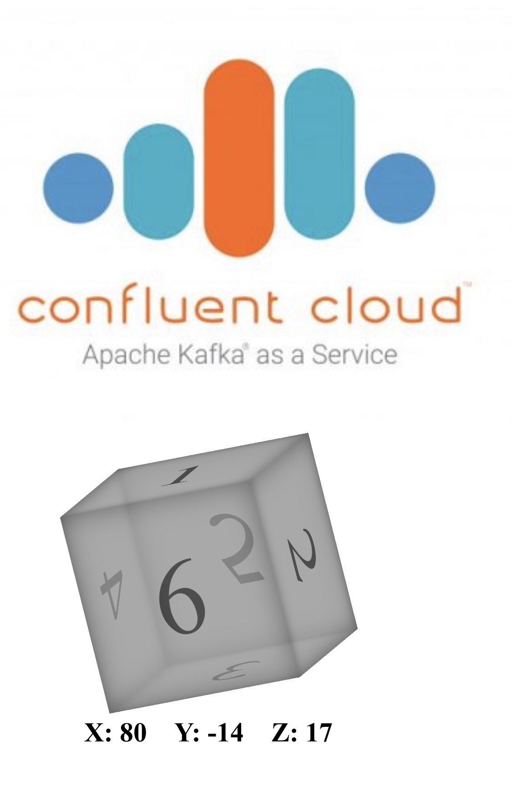
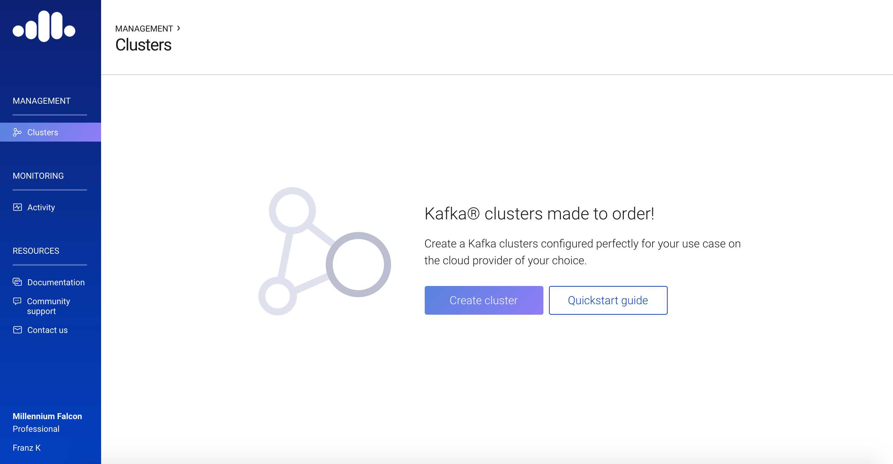
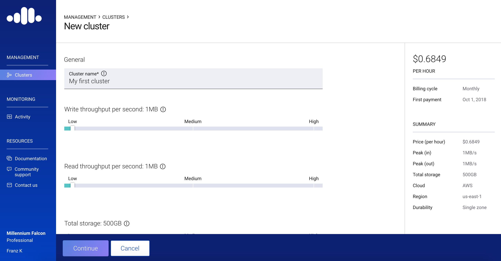
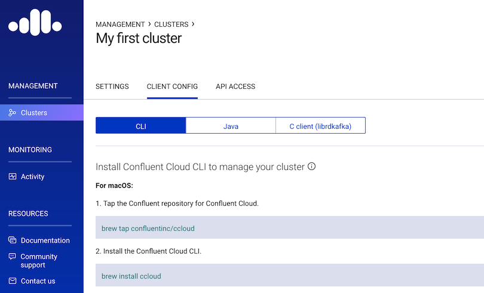
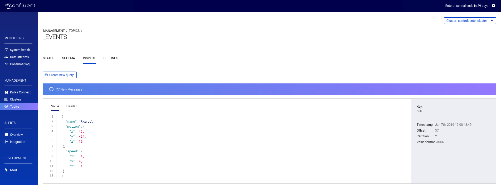

= Confluent Cloud "The Cube" Demo - Hands On guide

Ricardo Ferreira, <ricardo@confluent.io>
v1.00, January 4, 2019

== Introduction

This code contains a sample application called "The Cube" that allow users to interact with Kafka clusters running on Confluent Cloud by using their movile devices.

While users play with the application from their mobile devices, events containing their moves are emitted to a topic. This topic holds the log of all events and it is the basis for a set of inbound streams created by KSQL. The game is about having people moving the cube in their mobile devices, trying to position the number 3 using a set of coordinates.

Anyone capable of perfectly positioning the cube to these coordinates will be shown in a KSQL query. This query is executed against a table called "SELECTED_WINNERS", that is the result of a join between the inbound streams and a table that holds the information of the coordinates.

image:images/selected_winner.png[Selected Winner]

== Step 1: Create Kafka Cluster in Confluent Cloud

1. Login to Confluent Cloud at https://confluent.cloud.

2. Click *Create cluster*.

3. Specify a cluster name, choose a cloud provider, and click *Continue*. Optionally, you can specify read and write throughput, storage, region, and durability.

4. Confirm your cluster subscription details, payment information, and click *Save and launch cluster*.

== Step 2: Get Connectivity Details from your Confluent Cloud Cluster

In this step, you retrieve the connectivity details from your Confluent Cloud cluster. The actions shown here are usually performed when you want to install the Confluent Cloud CLI and interact with your cluster. However, you don’t need to perform a full install of the Confluent Cloud CLI. We only need the connectivity details that are created as part of the process.

1. From the *Management -> Clusters* page, click the ellipses on the right-hand side of your cluster name and click *Client config*.

image:images/cloud-view-details.png[View Cluster Details]

2. Follow the on-screen Confluent Cloud installation instructions, starting from the section *Configure Confluent Cloud CLI*. You don’t need to perform any steps from that section, because you’re not installing the Confluent Cloud CLI. Just click *Create Kafka Cluster API key & secret* to generate a new credential key pair.

3. Take note of the information provided by this page, especifically the *Bootstrap Broker List*, the *API Key* and *API Secret*, and keep it in a safe place. You’ll provide this information later, during the Terraform setup.

== Step 3: Specify the Cloud Provider (AWS) Credentials Details

In this step, you configure your cloud provider credentials, so Terraform can connect to AWS and perform infrastructure provisioning and application deployment.

1. Navigate to the */terraform/aws* directory.

[source,bash]
----
cd terraform/aws
----

2. Rename the file *cloud.auto.tfvars.example* to *cloud.auto.tfvars*.

[source,bash]
----
mv cloud.auto.tfvars.example cloud.auto.tfvars
----

3. Open the *cloud.auto.tfvars* file in a text editor to edit its contents.

[source,bash]
----
###########################################
################## AWS ####################
###########################################

aws_access_key = "<YOUR_AWS_ACCESS_KEY>"
aws_secret_key = "<YOUR_AWS_SECRET_KEY>"
----

4. Provide the requested information accordingly and save the changes in the file.

== Step 4: Specify the Confluent Cloud Cluster Connectivity Details

In this step, you configure your Confluent Cloud cluster connectivity details, so that once the tools are provisioned, they can connect to the cluster automatically. The information used here was gathered during Step 2: Get Connectivity Details from your Confluent Cloud Cluster.

1. Navigate to the */terraform/aws* directory.

[source,bash]
----
cd terraform/aws
----

2. Rename the file *ccloud.auto.tfvars.example* to *ccloud.auto.tfvars*.

[source,bash]
----
mv ccloud.auto.tfvars.example ccloud.auto.tfvars
----

3. Open the *ccloud.auto.tfvars* file in a text editor to edit its contents.

[source,bash]
----
###########################################
############# Confluent Cloud #############
###########################################

ccloud_broker_list = "<CCLOUD_BROKER_LIST>"
ccloud_access_key = "<CCLOUD_ACCESS_KEY>"
ccloud_secret_key = "<CCLOUD_SECRET_KEY>"
----

4. Provide the requested information accordingly and save the changes in the file.

== Step 5: Run Terraform

In this step, you run Terraform, so it can create the infrastructure and deploy necessary components for the demo.

1. Navigate to the */terraform/aws* directory.

[source,bash]
----
cd terraform/aws
----

2. Initialize the folder to download the required plugins. This step is only required once.

[source,bash]
----
terraform init
----

3. Perform a dry-run of the install by planning what is going to be created, modified and destroyed.

[source,bash]
----
terraform plan
----

4. Apply the plan configuration in AWS. After running the command below.

[source,bash]
----
terraform apply -auto-approve
----

5. The provisioning process may take ~5 minutes to complete. Once it finishes, it will show all relevant endpoints like this:

[source,bash]
----
Apply complete! Resources: 50 added, 0 changed, 0 destroyed.

Outputs:

1) Playing the Game           = http://ccloud-demo-riferrei.s3-website-us-east-1.amazonaws.com
Bastion Server IP Address     = Bastion Server has been disabled
Bastion Server Private Key    = Bastion Server has been disabled
Control Center                = http://control-center-1113398061.us-east-1.elb.amazonaws.com
KSQL Server                   = http://ksql-server-1946425298.us-east-1.elb.amazonaws.com
Kafka Connect                 = Kafka Connect has been disabled
REST Proxy                    = http://rest-proxy-900948845.us-east-1.elb.amazonaws.com
Schema Registry               = http://schema-registry-689395304.us-east-1.elb.amazonaws.com
----

== Step 6: Presenting the Demo

In this step, you are going to present the demo to the audience and play the game with them. Keep in mind that the steps shown here are mandatory; and though you might be tempted to skip some of them and go straight to the action, that will cause the demo to fail.

1. From the list of endpoints shown by Terraform, copy the one that says *1) Playing the Demo* to your mobile device and open the URL using your phone's browser. That will open up a page where you will write your name. Don't do nothing at this point.

2. From the list of endpoints shown by Terraform, copy the one that says *Control Center* to your laptop. The idea here is to show the audience events being produced to a topic using C3.

3. In C3, go to *Topics -> _EVENTS -> Inspect*

4. In your mobile device, write your name in the field and then click *Play*. You will see a cube that moves as you move your phone. Move your phone a little bit and then close the browser to stop emitting events.

5. At this point, lots of events should be seen in C3 as a result of your play with the mobile device. Use this time to explain the audience the nature of the events, highlighting the schema behind the event. BTW, if you go to the *Schema* tab you can see the schema used when serializing the records to that topic.

6. From the list of endpoints shown by Terraform, copy the one that says *KSQL Server*. Open up a new terminal in your laptop and access a new KSQL CLI instance using the endpoint that you copied.

[source,bash]
----
ksql KSQL_SERVER_ENDPOINT
----

7. In KSQL CLI, execute the following command:

[source,bash]
----
PRINT _NUMBERS FROM BEGINNING;
----

[source,bash]
----
{"ROWTIME":1546904994638,"ROWKEY":"1","NUMBER":1,"X":1,"Y":0,"Z":0}
{"ROWTIME":1546904994645,"ROWKEY":"3","NUMBER":3,"X":-180,"Y":0,"Z":180}
{"ROWTIME":1546904994645,"ROWKEY":"2","NUMBER":2,"X":1,"Y":-90,"Z":1}
{"ROWTIME":1546904994645,"ROWKEY":"4","NUMBER":4,"X":1,"Y":90,"Z":-1}
----

8. Explain to the audience that these are the coordinates from each number stored in the Kafka topic. Ask them to write down the coordinates for number 3, which is *X: -180, Y: 0, Z: 180*.

9. Create the streams and tables necessary to run the demo using the DDL statements below:

[source,bash]
----
CREATE TABLE NUMBERS (NUMBER BIGINT, X INTEGER, Y INTEGER, Z INTEGER) WITH (KAFKA_TOPIC='_NUMBERS', VALUE_FORMAT='JSON', KEY='NUMBER');

CREATE STREAM EVENTS WITH (KAFKA_TOPIC='_EVENTS', VALUE_FORMAT='AVRO');

CREATE STREAM EVENTS_ENRICHED AS SELECT NAME, MOTION->X AS X, MOTION->Y AS Y, MOTION->Z AS Z, 3 AS NUMBER FROM EVENTS;

CREATE TABLE SELECTED_WINNERS AS SELECT E.NAME AS NAME, COUNT(*) AS TOTAL FROM EVENTS_ENRICHED E LEFT OUTER JOIN NUMBERS N ON E.NUMBER = N.NUMBER WHERE E.X = N.X AND E.Y = N.Y AND E.Z = N.Z GROUP BY NAME;
----

10. To prepare for the audience to play with the demo, execute the following query in the KSQL CLI:

[source,bash]
----
SELECT CONCAT('AND THE WINNER IS ----------> ', NAME) AS MESSAGE FROM SELECTED_WINNERS;
----

11. Explain the logic of the demo to the audience. The first person that correctly position the number 3 in the cube using the coordinates given previously will show up in the query that was just executed. The winner might win a prize... blah...

12. Provide the url of the game to the audience. That is the same url that you used on step number one. You might want to use a URL shortener before providing that url. That will make easy for the audience to write it down in their mobile devices.

== Step 7: Destroying the Demo

In this step, you are going to destroy all the resources created by Terraform. This is important because these resources will cost money from the AWS account being used in the demo.

1. Navigate to the */terraform/aws* directory.

[source,bash]
----
cd terraform/aws
----

2. Run the following command:

[source,bash]
----
terraform destroy -auto-approve
----