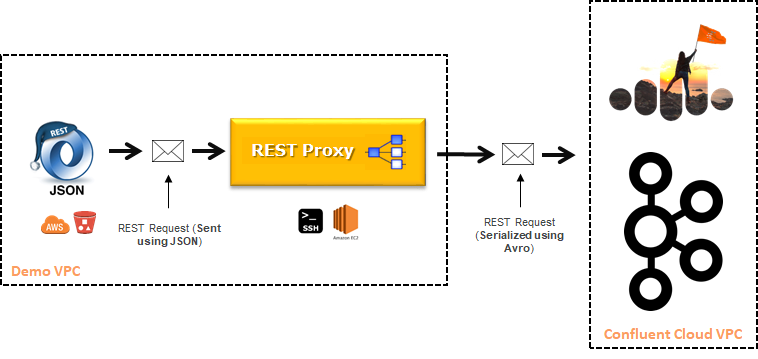

= Confluent Cloud "The Cube" Demo

Ricardo Ferreira, <ricardo@confluent.io>
v1.00, January 4, 2019

== Introduction

This code contains a sample application called "The Cube" that allow users to interact with Kafka clusters running on Confluent Cloud by using their mobile devices. While users play with the application from their mobile devices, events containing their moves are emitted to a topic.

As you can see in the diagram above, the application performs a REST call into a REST Proxy deployment that runs on its own VPC. This REST Proxy deployment, in turn, serializes the record using Avro and writes to a topic called *_EVENTS* that sits on a cluster running on Confluent Cloud.

image:images/the_cube.jpg[The Cube, 300, 500, role="center"]

The application itself is a set of HTML pages stored in an S3 bucket in AWS, and this S3 bucket has been configured to act as a web server. Therefore, users can access from anywhere as long as they are using an HTTP-enabled device. The application presents the user with a cube that moves as the user moves its hands and body. It relies on the device orientation API found in most modern devices.

Anyone capable of perfectly positioning the cube using the coordinates that represents the number three will be shown in the output of a KSQL query. This query is executed against a KSQL table called *SELECTED_WINNERS*, that is the result of a join between the inbound streams (created based on the *_EVENTS* topic) and a table that holds the information of the coordinates.

image:images/selected_winner.png[Selected Winner]

This demo was created based on the open-source project called ccloud-tools: https://github.com/confluentinc/ccloud-tools

== Pre-Requisites

1. You need to have reliable internet connection to run this demo. This is particularly important when you were running Terraform and when you were executing KSQL statements from your laptop.
+

2. You need to have Terraform installed locally. You can find more details about how to install it https://learn.hashicorp.com/terraform/getting-started/install.html[here].
+

3. You need to have the Confluent Cloud CLI installed locally. You can find more details about how to install it https://docs.confluent.io/current/cloud/cli/install.html[here]. Make sure to have the Confluent Cloud CLI in the path of your O.S, since the provisioning process creates the necessary topics from your computer using the 'ccloud' tool.
+

4. You need to have the KSQL CLI installed locally. You can find more details about how to install it https://docs.confluent.io/current/ksql/docs/installation/installing.html#installation-instructions[here]. Make sure to have the KSQL CLI in the path of your O.S, since the provisioning process creates the necessary Streams/Tables from your computer using the 'ksql' tool.

== Step 1: Create Kafka Cluster in Confluent Cloud

1. Login to Confluent Cloud at https://confluent.cloud.
+

2. Click *Create cluster*.
+

image:images/cloud-create-topic.png[Create Cluster]

3. Specify a cluster name, choose a cloud provider, and click *Continue*. Optionally, you can specify read and write throughput, storage, region, and durability.
+

image:images/cloud-pay-launch.png[Launch Cluster]

4. Confirm your cluster subscription details, payment information, and click *Save and launch cluster*.

== Step 2: Get Connectivity Details from your Confluent Cloud Cluster

In this step, you are going to retrieve the connectivity details from your Confluent Cloud cluster. The data obtained in this step will be further used when Terraform will provision the Confluent Platform components in AWS, and these components will need to connect to the Kafka cluster running on Confluent Cloud.

1. From the *Management -> Clusters* page, click the ellipses on the right-hand side of your cluster name and click *Client config*.
+

image:images/cloud-view-details.png[View Cluster Details]

2. Follow the on-screen Confluent Cloud installation instructions, starting from the section *Configure Confluent Cloud CLI*. Click in the *Create Kafka Cluster API key & secret* button to generate a new credential key pair.
+

image:images/cloud-cli-config.png[Client Config]

3. Take note of the information provided by this page, especifically the *Bootstrap Broker List*, the *API Key* and *API Secret*, and keep it in a safe place. You’ll provide this information later, during the Terraform setup.

== Step 3: Specify the Cloud Provider (AWS) Credentials Details

In this step, you configure your cloud provider credentials, so Terraform can connect to AWS and perform infrastructure provisioning and application deployment.

1. Navigate to the */terraform/aws* directory.
+

[source,bash]
----
cd terraform/aws
----

2. Rename the file *cloud.auto.tfvars.example* to *cloud.auto.tfvars*.
+

[source,bash]
----
mv cloud.auto.tfvars.example cloud.auto.tfvars
----

3. Open the *cloud.auto.tfvars* file in a text editor to edit its contents.
+

[source,bash]
----
###########################################
################## AWS ####################
###########################################

aws_access_key = "<YOUR_AWS_ACCESS_KEY>"
aws_secret_key = "<YOUR_AWS_SECRET_KEY>"
----

4. Provide the requested information accordingly and save the changes in the file.

== Step 4: Specify the Confluent Cloud Cluster Connectivity Details

In this step, you configure your Confluent Cloud cluster connectivity details, so that once the Confluent components are provisioned, they can connect to the Kafka cluster automatically. The information used here was gathered during Step 2: Get Connectivity Details from your Confluent Cloud Cluster.

1. Navigate to the */terraform/aws* directory.
+

[source,bash]
----
cd terraform/aws
----

2. Rename the file *ccloud.auto.tfvars.example* to *ccloud.auto.tfvars*.
+

[source,bash]
----
mv ccloud.auto.tfvars.example ccloud.auto.tfvars
----

3. Open the *ccloud.auto.tfvars* file in a text editor to edit its contents.
+

[source,bash]
----
###########################################
############# Confluent Cloud #############
###########################################

ccloud_broker_list = "<CCLOUD_BROKER_LIST>"
ccloud_access_key = "<CCLOUD_ACCESS_KEY>"
ccloud_secret_key = "<CCLOUD_SECRET_KEY>"
----

4. Provide the requested information accordingly and save the changes in the file.

== Step 5: Run Terraform

In this step, you run Terraform, so it can create the infrastructure and deploy necessary components for the demo.

1. Navigate to the */terraform/aws* directory.
+

[source,bash]
----
cd terraform/aws
----

2. Open the *webapp.tf* file in a text editor to edit its contents. In the section that declares a variable called *bucket_suffix*; you ought to replace the current content with a suffix that is unique to you, such as your last name. This is important to prevent race conditions if two or more persons are running the demo simultaneously.
+

[source,bash]
----
###########################################
################ S3 Bucket ################
###########################################

variable "bucket_suffix" {

    default = "<SET_YOUR_OWN_SUFFIX_WITHIN_THESE_DOUBLE_QUOTES>"

}
----

3. Initialize the folder to download the required plugins. This step is only required once.
+

[source,bash]
----
terraform init
----

4. Perform a dry-run of the install by planning what is going to be created, modified and destroyed.
+

[source,bash]
----
terraform plan
----

5. Apply the plan configuration in AWS. After running the command below.
+

[source,bash]
----
terraform apply -auto-approve
----

6. The provisioning process may take *~5 minutes to complete*. Once it finishes, it will show all relevant endpoints like this:
+

[source,bash]
----
Apply complete! Resources: 52 added, 0 changed, 0 destroyed.

Outputs:

1) Playing the Game           = http://ccloud-demo-custom.s3-website-us-east-1.amazonaws.com
Bastion Server IP Address     = Bastion Server has been disabled
Bastion Server Private Key    = Bastion Server has been disabled
Control Center                = http://control-center-0000000000.us-east-1.elb.amazonaws.com
KSQL Server                   = http://ksql-server-0000000000000.us-east-1.elb.amazonaws.com
Kafka Connect                 = Kafka Connect has been disabled
REST Proxy                    = http://rest-proxy-00000000000000.us-east-1.elb.amazonaws.com
Schema Registry               = http://schema-registry-000000000.us-east-1.elb.amazonaws.com
----

== Step 6: Execute the Initialization Script

In this step, you are going to execute a script that will create certain resources in the infrastructure just provisioned by Terraform.
These resources include the schema that will be used for the _EVENTS topic, a record produced into that same topic, as well as a couple Streams and Tables necessary to play the demo.

Note that the 'initialize.sh' script is created by Terraform, so don't worry if you don't see this file before running Terraform. This script is created by Terraform to make sure that the endpoints used are up-to-date with the infrastructure provisioned.

[source,bash]
----
sh initialize.sh
----

== Step 7: Presenting the Demo

In this step, you are going to present the demo to the audience and play the game with them. Keep in mind that the steps shown here are mandatory; and though you might be tempted to skip some of them and go straight to the action, that will cause the demo to fail.

1. From the list of endpoints shown by Terraform, copy the one that says *1) Playing the Demo* to your mobile device and open the URL using your phone's browser. That will open up a page where you will write your name. Don't do nothing at this point.
+

2. From the list of endpoints shown by Terraform, copy the one that says *Control Center* to your laptop. The idea here is to show the audience events being produced to a topic using C3.
+

3. In C3, go to *Topics -> _EVENTS -> Inspect*
+

4. In your mobile device, write your name in the field and then click *Play*. You will see a cube that moves as you move your phone. Move your phone a little bit and then close the browser to stop emitting events.
+

5. At this point, lots of events should be seen in C3 as a result of your play with the mobile device. Use this time to explain the audience the nature of the events, highlighting the schema behind the event. BTW, if you go to the *Schema* tab you can see the schema used when serializing the records to that topic.
+

image:images/demo-using-c3.png[Playing the Game]

6. From the list of endpoints shown by Terraform, copy the one that says *KSQL Server*. Open up a new terminal in your laptop and access a new KSQL CLI instance using the endpoint that you copied.
+

[source,bash]
----
ksql http://ksql-server-000000000.us-east-1.elb.amazonaws.com

                  ===========================================
                  =        _  __ _____  ____  _             =
                  =       | |/ // ____|/ __ \| |            =
                  =       | ' /| (___ | |  | | |            =
                  =       |  <  \___ \| |  | | |            =
                  =       | . \ ____) | |__| | |____        =
                  =       |_|\_\_____/ \___\_\______|       =
                  =                                         =
                  =  Streaming SQL Engine for Apache Kafka® =
                  ===========================================

Copyright 2017-2018 Confluent Inc.

CLI v5.1.0, Server v5.1.0 located at http://ksql-server-000000000.us-east-1.elb.amazonaws.com

Having trouble? Type 'help' (case-insensitive) for a rundown of how things work!

ksql>
----

7. In KSQL CLI, execute the following commands:
+

[source,bash]
----
SET 'auto.offset.reset' = 'earliest';

SELECT * FROM NUMBERS;
----
+
The following results will be shown in the KSQL CLI terminal:
+

[source,bash]
----
1548605261506 | 1 | 1 | 1 | 0 | 0
1548605261514 | 2 | 2 | 1 | -90 | 1
1548605261515 | 3 | 3 | -180 | 0 | 180
1548605261515 | 4 | 4 | 1 | 90 | -1
----

8. Explain to the audience that these are the coordinates from each number stored in the Kafka topic. Ask them to write down the coordinates for number 3, which is *X: -180, Y: 0, Z: 180*.
+

9. To prepare for the audience to play with the demo, execute the following query in the KSQL CLI:
+

[source,bash]
----
SELECT CONCAT('AND THE WINNER IS ----------> ', NAME) AS MESSAGE FROM SELECTED_WINNERS;
----

10. Explain the logic of the demo to the audience. The first person that correctly position the number 3 in the cube using the coordinates given previously will show up in the query that was just executed. The winner might win a prize... blah...
+

11. Provide the url of the game to the audience. That is the same url that you used on step number one. You might want to use a URL shortener before providing that url. That will make easy for the audience to write it down in their mobile devices.

== Step 8: Destroying the Demo

In this step, you are going to destroy all the resources created by Terraform in the AWS account. This is important because the resources created costs money and are billed by the hour, therefore you don't want to just leave them there.

1. Navigate to the */terraform/aws* directory.
+

[source,bash]
----
cd terraform/aws
----

2. Run the following command:
+

[source,bash]
----
terraform destroy -auto-approve
----