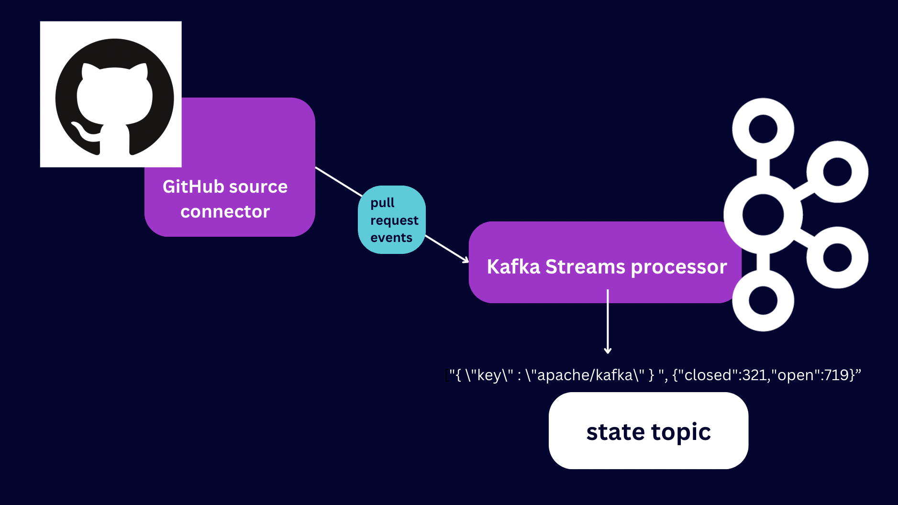

# Confluent Connector Github Demo 

In this demo, you'll learn how to set up the Confluent GitHub Connector, and then how to capture pull request events that surface to the Confluent interface. After that, you'll learn to process those GitHub events using Kafka Streams! The processor that you'll use will pull the state (open or closed) from the GitHub pull request event, and store the current ratio of those events in a Kafka topic.



Let's get started. 

PS-- If you'd like to read more about this project, read [the blog post](https://www.confluent.io/blog/process-github-data-with-kafka-streams/)! 

## Prerequisites

1. A [Confluent Cloud](https://rebrand.ly/f0kvol5) account. 
2. A [GitHub account](https://docs.github.com/en/get-started/signing-up-for-github/signing-up-for-a-new-github-account). You'll also need a [classic personal access token](https://docs.github.com/en/authentication/keeping-your-account-and-data-secure/creating-a-personal-access-token#creating-a-personal-access-token-classic) for accessing the GitHub REST API. Use the 'repo' permission setting. To test your token, run this command in your terminal:

```
curl -L \
  -H "Accept: application/vnd.github+json" \
  -H "Authorization: Bearer <YOUR-TOKEN>"\
  -H "X-GitHub-Api-Version: 2022-11-28" \
  https://api.github.com/emojis
  ```
  You'll get a list of emojis returned if your GitHub token is working. 😊
  
  ## Step 1: Configure your Confluent Cloud connector. 
 
 Log in to the Confluent Cloud interface. 
 
 Sign in to your Confluent Cloud account. Head over to the [confluent.cloud/environments](https://confluent.cloud/environments) page and click 'Add Cloud Environment' on the top right of your screen. 


Name your environment 'github_data' and click 'Create'. Note: If you're prompted to select a Stream Governance package, do it and accept the default free option. This will help enable the automatic schema registry that the GitHub connector will need to use. 

On your cluster page, click 'Create cluster on my own' or 'Create cluster'. 

In the navbar on the left, select 'Connectors'. Search the connectors for "GitHub". _There will be two results. Select the one with the GitHub logo present._ 

Generate the API key and download as prompted. You'll then be prompted to enter these two values:


For 'GitHub Endpoint', enter `https://api.github.com`.

For 'GitHub Access Token', enter the classic personal token you created earlier. _You do not need to preface it with 'Bearer'._

Next, add configuration details. Set the output record format to 'JSON'. 


> Note: copy and paste this value into the 'Topic Name Pattern' field:  `github-${resourceName}` 

Under 'GitHub Repositories', enter "apache/kafka". If you enter the full url, the connector will fail. 

Under 'GitHub Resources', select 'pull_requests'. 

Under 'Since', put the date you want to read pull requests from. It's important it be in the format 'YYYY-MM-DD', including the dashes. `apache/kafka` was created on Aug 8, 2011, so you can enter '2011-08-15' if you want to analyze all the pull requests since then. 

As far as the sizing goes, default values are ok. Once you hit 'Launch', verify that the connector has created a Kafka topic called 'github-pull_requests' by visiting the 'topics' tab on the left.

## Step 3: Create and edit the topics you'll need.  

Follow the steps in the [Confluent Cloud documentation](https://docs.confluent.io/cloud/current/client-apps/topics/manage.html#create-topics) to create a topic named 'state'. Instead of the default number of partitions, give it 1 partition. Then, edit the 'github-pull_requests' topic which has been auto-created for you to have only 1 partition as well. There are instructions in the [Confluent docs](https://docs.confluent.io/cloud/current/client-apps/topics/manage.html#edit-topics) to do this as well. 

## Step 4: Get started with Kafka Streams

Now, we'll pivot to building a Kafka Streams application that process the 'github-pull_requests' events, creating an up-to-date ratio of open/closed pull requests. 

Make a new folder for your project:

```bash
mkdir github-streams && cd github-streams && touch build.gradle
```

In your `build.gradle` file, you'll need the values from this directory's `build.gradle` file, so copy/paste them in. You'll need a `get-started.properties` file at the same directory level. There's a `get-started.properties.orig` file in this demo to show you what that looks like:

```
bootstrap.servers=
security.protocol=SASL_SSL
sasl.jaas.config=org.apache.kafka.common.security.plain.PlainLoginModule required username='< CLUSTER API KEY >' password='< CLUSTER API SECRET >';
sasl.mechanism=PLAIN

# Required for correctness in Apache Kafka clients prior to 2.6
client.dns.lookup=use_all_dns_ips

# Best practice for Kafka producer to prevent data loss
acks=all
key.serializer=org.apache.kafka.common.serialization.StringSerializer
value.serializer=org.apache.kafka.common.serialization.StringSerializer
key.deserializer=org.apache.kafka.common.serialization.StringDeserializer
value.deserializer=org.apache.kafka.common.serialization.StringDeserializer
```

You can find the values for `bootstrap.servers` by visiting your Cloud console and clicking 'Add a client' and selecting 'Java'. The `username` and `password` values are the API key and secret values you downloaded earlier, respectively. 

Now, create folders for your Java files:

```
mkdir -p src/main/java/clients

mkdir -p src/main/java/model

mkdir -p src/main/java/serde
```

Paste the code located at this folder's `GitHubPrRatio.java` into a file that you've named: `clients/GitHubPrRatio`.java`. It's a good little chunk of code! We'll walk through what each bit does in a minute.

You'll also need to copy the code in `model/` and `serde/`.

```
cp -a path/to/demo/folder/model/  path/to/your/folder/model/

cp -a path/to/demo/folder/model/  path/to/your/folder/serde/
```


Now, if you run `./gradlew clean build` & `./gradlew shadowJar`, and then run `java -jar build/libs/kafka-java-getting-started.jar`, you'll get output that calculates the ratio of open/closed pull requests!

```bash
Store value GitHubPRStateCounter{open=138, closed=199}
Store value GitHubPRStateCounter{open=139, closed=199}
Store value GitHubPRStateCounter{open=140, closed=199}
Store value GitHubPRStateCounter{open=141, closed=199}
```

## Step 5: Understanding what we just did

What is happening in this file that gives us this pull request ratio? Let's walk through it. 


On line 102 in `GitHubPrRatio.java`, we've got a `MyProcessorSupplier` class. What this will do is provide a processor  for the `github-pull_request` stream in order to pull out the `open` and `closed` states. 

On line 130 inside the `MyProcessorSupplier` class, we've got a state store established, which will hold the current state of the open/closed pull request ratio. The `init` method on line 112 schedules a puntuation to fire every second, printing the ratio in the store. The `process` method on line 123 will take in the events, mark them as open or closed and increment the count, and stash them in the state store. 

Now, when  the`.topology` is invoked on line 155 within the `main` method ,it builds the Streams topology for processing, and then the aptly named `KafkaStreams.start()` starts the process. 

P.S. What's going on with the `model/` and `serde/` folders? 

The `model/GitHubPRInfo.java` file provides a record to map the JsonNode to, as you can see on line 70. The `model/GitHubPRState.java` file provides a data object for state tracking, implemented on line 116. 

The `serde/` folder provides a custom JSON serde, declared on line 59 and implemented on lines 89 and 143 to handle the serialization and deserialization of events. 

## Where to go from here

If you're interested in learning more about Confluent's GitHub connector, [visit the Confluent documentation](https://docs.confluent.io/cloud/current/connectors/cc-github-source.html). There's also a course on [Kafka Streams](https://developer.confluent.io/courses/kafka-streams/get-started/) on Confluent Developer, as well as a selection of [more tutorials](https://developer.confluent.io/tutorials/) for you to follow! 
