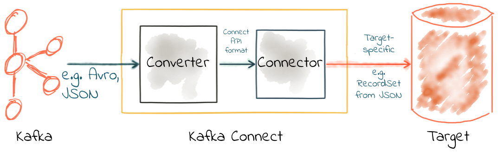
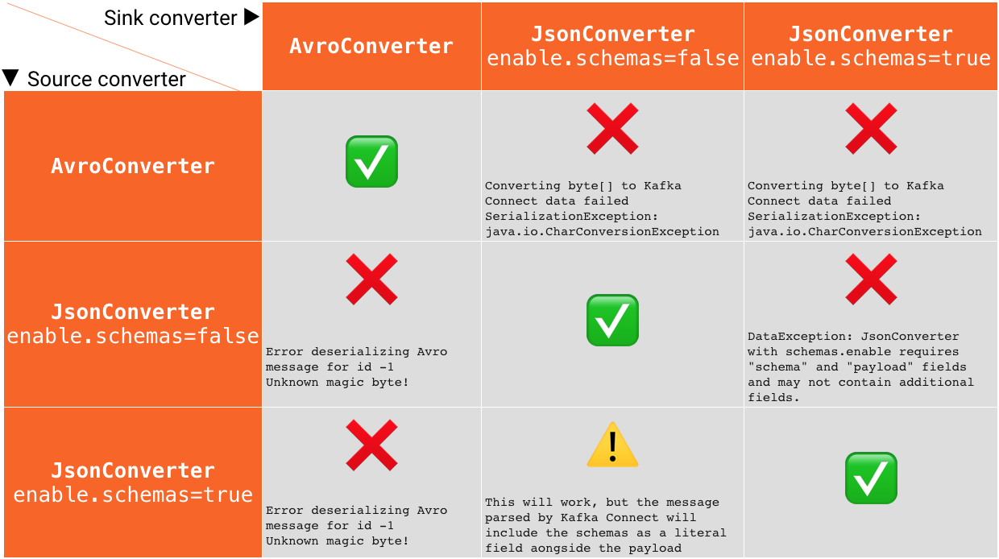

= Kafka Connect Deep Dive - Converters and Serialization explained

Kafka Connect is part of Apache Kafka®, providing streaming integration between data stores and Kafka. For data engineers it just requires JSON configuration files to use. There are connectors for common (and not-so-common) data stores out there already, including https://www.confluent.io/connector/kafka-connect-jdbc/[JDBC], https://www.confluent.io/connector/kafka-connect-elasticsearch/[Elasticsearch], https://www.confluent.io/connector/kafka-connect-ibm-mq/[IBM MQ], https://www.confluent.io/connector/kafka-connect-s3/[S3], and https://www.confluent.io/connector/bigquery-sink-connector/[BigQuery]—to name but a few. For developers Kafka Connect has a https://docs.confluent.io/current/connect/javadocs/index.html[rich API] in which additional connectors can be https://docs.confluent.io/current/connect/devguide.html[developed] if required. In addition to this it also has a https://docs.confluent.io/current/connect/references/restapi.html[REST API] for configuration and management of connectors. 

Kafka Connect is modular in nature, providing a very powerful way of handling integration requirements. You can read more about the key concepts in https://docs.confluent.io/current/connect/concepts.html[the documentation], but some of the key components include: 

* Connectors - the JAR files that define how to integrate with the data store itself
* Converters - handling serialization and deserialization of data
* Transforms - for in-flight manipulation of messages

One of the more frequent sources of mistakes and misunderstanding around Kafka Connect involves the serialization of data, which Kafka Connect handles using Converters. Let's take a good look at how these work, and illustrate some of the common issues encountered. 

== Kafka messages are just bytes

Kafka messages are organised into topics, which can be partitioned. Each message is a key/value, but that is all that Kafka requires. Both key and value are just bytes when they are stored on Kafka. This is a very powerful construct, but also means that developers have the responsibility of deciding how to serialize the data. In configuring Kafka Connect, one of the key things to standardize on is the serialization format. You need to make sure that anyone reading from the topic is using the same serialization format as those writing to the topic. Otherwise, confusion will ensue! 

An analogy: within a country, people speak the native language. But, when flying between countries, pilots and air traffic control have to standardise on a language. If they didn't, communication would be difficult or impossible. In the same way, Kafka Connect provides this "translation" between message format specific to the source system, and the serialization format that you want to use in Kafka. 

image::images/connect_converters_02.png[]

There are several common serialization formats, including: 

* JSON
* Avro
* Protobuf
* String delimited (e.g. CSV)

There are advantages and disadvantages to each of these. Well, except delimited, in which case it's only disadvantages ;-)

=== Choosing a serialization format

Some guiding principles for choosing a serialization format include: 

* **Schema**. A lot of the time your data will have a schema to it. You may not like the fact, but it's your responsibility as a developer to preserve and propagate this schema. The schema provides the https://www.infoq.com/presentations/contracts-streaming-microservices[contract between your services]. Some message formats (such as Avro and Protobuf) have strong schema support, whilst others have lesser support (JSON) or none at all (delimited string). 
* **Ecosystem compatibility**. Avro is a first-class citizen in the Confluent Platform, with native support from the Schema Registry, Kafka Connect, KSQL, and more. Protobuf, on the other hand, relies on community contributions for partial levels of feature support. 
* **Message size**. Whilst JSON is plain text and relies on any compression configured in Kafka itself, Avro and Protobuf are both binary formats and thus provide smaller message sizes
* **Language support**. Support for Avro is strong in the Java space, but if your company is not Java-based then you may find it less easy to work with

=== Q: I need to write to my target in JSON, so I must use JSON for my topics? A: Nope.

The format in which you’re reading data **from** a source, or writing it **to** an external data store, doesn’t need to have a bearing on the format you use for your topics. 

A connector in Kafka Connect is responsible for taking the data from the source data store (for example, a database) and passing it as an https://docs.confluent.io/current/connect/javadocs/index.html?org/apache/kafka/connect/data/SchemaAndValue.html[internal representation of the data] to the converter. Kafka Connect’s converters then serialize this source data object onto the topic. The same happens in reverse, when using Kafka Connect as a sink—the converter deserializes the data from the topic into this internal representation, which is passed to the connector to write to the target data store using the appropriate method specific to the target.

What this means is that you can have data on a topic in Avro (for example), and when you come to write it to HDFS (for example) you simply specify that you want https://docs.confluent.io/current/connect/kafka-connect-hdfs/configuration_options.html#connector[the sink connector to use that format].

== Configuring converters

Kafka Connect takes a default converter configuration at the _worker_ level, and it can also be overridden _per connector_. Since using the same serialization format throughout your pipelines is generally a good idea, you'll often just set the converter at the worker, and never need to specify it in a connector. But maybe you're pulling data from someone else's topic and they've decided to use a different serialization format—in that case you'd set this in the connector configuration. Even though you override it in the connector's configuration, it's still the _converter_ that performs the work. **Connectors that are written properly never do the [de-]serialization themselves**. 

image::images/connect_source_converter_01.png[]

The configuration setting is `converter`, prefixed by `value` or `key`. Remember, Kafka messages are _just pairs of key/value bytes_, and you need to specify the converter for both. In some situations you may use different converters for the key and the value. 

Here's an example of using the **String** converter. Since it's just a string, there's no schema to the data, and thus it's not so useful to use for the `value`: 

[source,bash]
----
"key.converter": "org.apache.kafka.connect.storage.StringConverter",
----

Some converters have additional configuration. For Avro, you need to specify the Schema Registry. For JSON, you need to specify if you want Kafka Connect to embed the schema in the JSON itself. When you specify converter configuration you need to include the `key` or `value` prefix. For example, to use Avro for the message payload you'd specify: 

[source,bash]
----
"value.converter": "io.confluent.connect.avro.AvroConverter",
"value.converter.schema.registry.url": "http://schema-registry:8081",
----

Common converters include: 

* Avro - https://www.confluent.io/connector/kafka-connect-avro-converter/[open source from Confluent]
** `io.confluent.connect.avro.AvroConverter`
* String - part of Apache Kafka
** `org.apache.kafka.connect.storage.StringConverter`
* JSON - part of Apache Kafka
** `org.apache.kafka.connect.json.JsonConverter`
* ByteArray - part of Apache Kafka
** `org.apache.kafka.connect.converters.ByteArrayConverter`
* Protobuf - https://www.confluent.io/connector/kafka-connect-protobuf-converter/[open source from the community] (❤️ to our friends at Blue Apron)
** `com.blueapron.connect.protobuf.ProtobufConverter`

== JSON and schemas

Whilst JSON does not by default support carrying a schema, Kafka Connect does support a particular format of JSON in which the schema is embedded. The resulting data size can get large as the schema is included in every single message along with the schema. 

If you're setting up a Kafka Connect source and want Kafka Connect to include the schema in the message it writes to Kafka, you'd set : 

[source,bash]
----
value.converter=org.apache.kafka.connect.json.JsonConverter
value.converter.schemas.enable=true
----

The resulting message to Kafka would look like the following example, with `schema` and `payload` top-level elements in the JSON:

[source,bash]
----
{
  "schema": {
    "type": "struct",
    "fields": [
      {
        "type": "int64",
        "optional": false,
        "field": "registertime"
      },
      {
        "type": "string",
        "optional": false,
        "field": "userid"
      },
      {
        "type": "string",
        "optional": false,
        "field": "regionid"
      },
      {
        "type": "string",
        "optional": false,
        "field": "gender"
      }
    ],
    "optional": false,
    "name": "ksql.users"
  },
  "payload": {
    "registertime": 1493819497170,
    "userid": "User_1",
    "regionid": "Region_5",
    "gender": "MALE"
  }
}
----

Note the size of the message, and the proportion of it made up of the payload vs the schema. Consider that this is repeated in every message, and you can see why a format like Avro, in which the schema is stored separately and the message holds just the payload (and compressed at that) makes a lot of sense. 

If you're _consuming_ JSON data from a Kafka topic into a Kafka Connect sink, you need to understand already if the data includes a schema. If it does—and it's in the same format as above, not some arbitrary schema-inclusion format—then you'd set

[source,bash]
----
value.converter=org.apache.kafka.connect.json.JsonConverter
value.converter.schemas.enable=true
----

However if you're consuming JSON data and it _doesn't_ have the `schema`/`payload` construct, such as this sample: 

[source,bash]
----
{
  "registertime": 1489869013625,
  "userid": "User_1",
  "regionid": "Region_2",
  "gender": "OTHER"
}
----

you must tell Kafka Connect not to try and decode it as such, by setting `schemas.enable=false`:

[source,bash]
----
value.converter=org.apache.kafka.connect.json.JsonConverter
value.converter.schemas.enable=false
----

As before, remember that the converter configuration option (here, `schemas.enable`) need the prefix of `key.converter` or `value.converter` as appropriate. 

== Common Errors

Here are some of the common errors that you can get if you mis-configure the converters in Kafka Connect. These will show themselves in the sinks you configure for Kafka Connect, as it's this point at which you'll be trying to deserialize the data. Each of these will cause the connector to fail, with a headline error of: 

[source,bash]
----
ERROR WorkerSinkTask{id=sink-file-users-json-noschema-01-0} Task threw an uncaught and unrecoverable exception (org.apache.kafka.connect.runtime.WorkerTask)
org.apache.kafka.connect.errors.ConnectException: Tolerance exceeded in error handler
   at org.apache.kafka.connect.runtime.errors.RetryWithToleranceOperator.execAndHandleError(RetryWithToleranceOperator.java:178)
   at org.apache.kafka.connect.runtime.errors.RetryWithToleranceOperator.execute(RetryWithToleranceOperator.java:104)
----

after this error, you'll see a further stack trace describing exactly _why_ it errored. **Be aware that the above error will be thrown for _any_ fatal error in a connector, so you may well see this for errors unrelated to serialization.**

To quickly visualize what errors you can expect with which mis-configuration, here's a quick reference: 

=== Problem: Reading non-Json data with JsonConverter

If you have non-Json data on your source topic but try to read it with the JsonConverter, you can expect to see

[source,bash]
----
org.apache.kafka.connect.errors.DataException: Converting byte[] to Kafka Connect data failed due to serialization error:
…
org.apache.kafka.common.errors.SerializationException: java.io.CharConversionException: Invalid UTF-32 character 0x1cfa7e2 (above 0x0010ffff) at char #1, byte #7)
----

This could be caused by the source topic being serialized in Avro, or another format.

Solution: If the data is actually in Avro, then change your Kafka Connect sink connector to use 

[source,bash]
----
"value.converter": "io.confluent.connect.avro.AvroConverter",
"value.converter.schema.registry.url": "http://schema-registry:8081",
----

**OR** if the topic is populated by Kafka Connect, and you have the option and would rather, switch the upstream source to emit JSON data:

[source,bash]
----
"value.converter": "org.apache.kafka.connect.json.JsonConverter",
"value.converter.schemas.enable": "false",
----

=== Problem: Reading Non-Avro data with AvroConverter

This may be the most common error that I see reported again and again on places like the Confluent Community https://groups.google.com/forum/#!forum/confluent-platform[mailing list] and https://slackpass.io/confluentcommunity[Slack group]. It happens when you try to use the Avro converter to read data from a topic that is not Avro. This would include data written by another Avro serializer than the Confluent Schema Registry's https://docs.confluent.io/5.0.0/schema-registry/docs/serializer-formatter.html#serializer[Avro serializer], which has its own https://docs.confluent.io/5.0.0/schema-registry/docs/serializer-formatter.html#wire-format[wire format]. 

[source,bash]
----
org.apache.kafka.connect.errors.DataException: my-topic-name
  at io.confluent.connect.avro.AvroConverter.toConnectData(AvroConverter.java:97)
…
org.apache.kafka.common.errors.SerializationException: Error deserializing Avro message for id -1
org.apache.kafka.common.errors.SerializationException: Unknown magic byte!
----

The solution is to check the source topic's serialization format, and either switch Kafka Connect's sink connector to use the correct source, or if you want to use Avro (which is a good idea) then switch the upstream format to Avro. If upstream is Kafka Connect then you can configure the source connector's converter as follows: 

[source,bash]
----
"value.converter": "io.confluent.connect.avro.AvroConverter",
"value.converter.schema.registry.url": "http://schema-registry:8081",
----

=== Problem: Reading JSON message without the expected schema/payload structure

As described earlier, Kafka Connect supports a special structure of JSON messages containing both payload _and_ schema. If you try to read JSON data that _does not contain the data in this structure_ you will get this error: 

[source,bash]
----
org.apache.kafka.connect.errors.DataException: JsonConverter with schemas.enable requires "schema" and "payload" fields and may not contain additional fields. If you are trying to deserialize plain JSON data, set schemas.enable=false in your converter configuration.
----

To be clear; the only JSON structure that is valid for `schemas.enable=true` is with the `schema` and `payload` fields as the top-level elements, as shown above. 

As the message itself states, if you just have plain JSON data you should change your connector's configuration to : 

[source,bash]
----
"value.converter": "org.apache.kafka.connect.json.JsonConverter",
"value.converter.schemas.enable": "false",
----

If you want to include the schema in the data, you can either switch to using Avro (recommended), or you can configure Kafka Connect upstream to include the schema in the message: 

[source,bash]
----
"value.converter": "org.apache.kafka.connect.json.JsonConverter",
"value.converter.schemas.enable": "true",
----

== Troubleshooting tips

=== Finding the Connect worker log

To find the error log from Kafka Connect you need to locate the Kafka Connect worker's output, and the location of this depends on how you launched Kafka Connect. There are several ways to [install Kafka Connect](https://docs.confluent.io/current/installation/installing_cp/index.html#on-premises-deployments), including Docker, Confluent CLI, systemd, and manually from the downloaded archive. You'll find the worker log in : 

* Docker: `docker logs container_name`
* Confluent CLI: `confluent log connect`
* systemd: log file is written to `/var/log/confluent/kafka-connect`
* Other: by default Kafka Connect sends its output to `stdout` so you'll find it in the terminal session that launched Kafka Connect

=== Finding the Kafka Connect configuration file

To change configuration properties for Kafka Connect workers (which apply to all connectors run), set it as follows: 

* Docker: Set environment variables, for example in Docker Compose: 
+
[source,bash]
----
CONNECT_KEY_CONVERTER: io.confluent.connect.avro.AvroConverter
CONNECT_KEY_CONVERTER_SCHEMA_REGISTRY_URL: 'http://schema-registry:8081'
CONNECT_VALUE_CONVERTER: io.confluent.connect.avro.AvroConverter
CONNECT_VALUE_CONVERTER_SCHEMA_REGISTRY_URL: 'http://schema-registry:8081'
----
* Confluent CLI: configuration file `etc/schema-registry/connect-avro-distributed.properties`
* systemd (deb/rpm): configuration file `/etc/kafka/connect-distributed.properties`
* Other: when you launch Kafka Connect you specify the worker properties file, for example
+
[source,bash]
----
$ cd confluent-5.0.0
$ ./bin/connect-distributed ./etc/kafka/connect-distributed.properties
----

=== Inspecting a Kafka topic

Let's say we've hit one of the errors shown above, and want to troubleshoot why our Kafka Connect sink connector can't read from a topic. We need to check the data on the topic that is being read, and ensure it's in the serialization format that we think it is. Also bear in mind that _all_ the messages need to be in this format, so don't just assume that because you're _now_ sending messages in the correct format to the topic there won't be a problem. Existing messages on the topic are also read by Kafka Connect. 

Below I describe troubleshooting this from the command line, but there are a few other tools to be aware of : 

* https://www.confluent.io/confluent-control-center/[Confluent Control Center] includes the feature to visually inspect topic contents including automagic determination of the serialization format. 
* https://docs.confluent.io/current/ksql/docs/developer-guide/syntax-reference.html#print[KSQL's `PRINT`] command will print the contents of a topic to the console, including automagic determination of the serialization format. 
* The https://docs.confluent.io/current/cli/index.html[`confluent` CLI] tool includes the `consume` command, which can be used to read both string and Avro data.

=== Inspecting a topic—if you think you've got string/JSON data…

You can use console tools including `kafkacat` and `kafka-console-consumer`. My personal preference is https://github.com/edenhill/kafkacat[`kafkacat`]: 

[source,bash]
----
$ kafkacat -b localhost:9092 -t users-json-noschema -C -c1
{"registertime":1493356576434,"userid":"User_8","regionid":"Region_2","gender":"MALE"}
----

Using the excellent https://stedolan.github.io/jq/[`jq`] you can also validate and format the JSON: 

[source,bash]
----
$ kafkacat -b localhost:9092 -t users-json-noschema -C -c1|jq '.'
{
  "registertime": 1493356576434,
  "userid": "User_8",
  "regionid": "Region_2",
  "gender": "MALE"
}
----

If you get something like this, with a bunch of "weird" characters, chances are you're looking at binary data, as would be written by Avro or Protobuf, for example: 

[source,bash]
----
$ kafkacat -b localhost:9092 -t users-avro -C -c1
ڝ���VUser_9Region_MALE
----

=== Inspecting a topic—if you think you've got Avro data…

You should use a console tool designed for reading and deserialized Avro data. Here I'm using `kafka-avro-console-consumer`. Make sure you specify the correct Schema Registry URL at which the schema is held: 

[source,bash]
----
$ kafka-avro-console-consumer --bootstrap-server localhost:9092 \
                              --property schema.registry.url=http://localhost:8081 \
                              --topic users-avro \
                              --from-beginning --max-messages 1
{"registertime":1505213905022,"userid":"User_5","regionid":"Region_4","gender":"FEMALE"}
----

As before, you can pipe the resulting output through https://stedolan.github.io/jq/[`jq`] if you want to format it: 

[source,bash]
----
$ kafka-avro-console-consumer --bootstrap-server localhost:9092 \
                              --property schema.registry.url=http://localhost:8081 \
                              --topic users-avro \
                              --from-beginning --max-messages 1 | \
                              jq '.'
{
  "registertime": 1505213905022,
  "userid": "User_5",
  "regionid": "Region_4",
  "gender": "FEMALE"
}
----

== Internal Converters

Kafka Connect, when run in Distributed mode, uses Kafka itself to store metadata about its operation, including connector configuration, offsets, and so on. These Kafka topics themselves can be configured to use different converters, through the `internal.key.converter` / `internal.value.converter` settings. However these settings are purely for internal use, and indeed have been https://cwiki.apache.org/confluence/display/KAFKA/KIP-174+-+Deprecate+and+remove+internal+converter+configs+in+WorkerConfig[deprecated as of Apache Kafka 2.0]. You should not change these, and you will get warnings from Apache Kafka as of 2.0 if you do try to configure them. 

== Applying a schema to messages without a schema

A lot of the time Kafka Connect will be bringing in data from places where there is a schema already, and retaining that schema is just a matter of using a suitable serialization format such as Avro. All down-stream users of that data then benefit from the schema being available to them, with the compatibility guarantees that something like Schema Registry provide. What about if there is no explicit schema? Maybe you're reading data from a flat file (using the https://docs.confluent.io/current/connect/filestream_connector.html[FileSourceConnector]—not recommended for Production, but often used for PoCs), or pulling data from a REST endpoint using the https://github.com/llofberg/kafka-connect-rest[REST connector]. Since both of these, and others, have no inherant schema, it's up to you to declare it. 

Sometimes you'll just want to pass the bytes through that you've read from the source and put them on a topic, but most of the time you'll want to do the Right Thing and apply a schema so that the data can be used. Doing it once as part of the ingestion, instead of pushing the problem onto each (potentially multiple) consumer, is a much better pattern to follow. 

You can write your own Kafka Streams application to apply schema to data in a Kafka topic, but you can also use KSQL. https://www.confluent.io/blog/data-wrangling-apache-kafka-ksql[This post] shows how to do it against JSON data pulled from a REST endpoint. Let's look here at a simple example of applying a schema to some CSV data. Obviously to be able to do this, we have to know the schema itself! 

Let's say we've got a Kafka topic, `testdata-csv`, with some CSV data in it. It looks like this: 

[source,bash]
----
$ kafkacat -b localhost:9092 -t testdata-csv -C
1,Rick Astley,Never Gonna Give You Up
2,Johnny Cash,Ring of Fire
----

By eye-balling it we can guess at there being three fields, maybe something like: 

* ID
* Artist
* Song

If we leave the data in the topic like this then any application wanting to use the data—whether a Kafka Connect sink, bespoke Kafka application, or whatever—will need to guess at this schema each time. Or, just as bad, they'll need to constantly go back to the team providing the data to check about the schema and any changes to it. Just as Kafka decouples systems, this kind of schema-dependency forces a hard-coupling between teams, and it's not a good thing. 

So what we'll do is simply apply a schema to the data using KSQL, and populate a new, derived, topic in which the schema is present. From KSQL, optionally inspect the topic data:

[source,sql]
----
ksql> PRINT 'testdata-csv' FROM BEGINNING;
Format:STRING
11/6/18 2:41:23 PM UTC , NULL , 1,Rick Astley,Never Gonna Give You Up
11/6/18 2:41:23 PM UTC , NULL , 2,Johnny Cash,Ring of Fire
----

The first two fields here (timestamp and NULL) are the timestamp and key of the Kafka message respectively. The remaining fields are from our CSV file. So now let's register this topic with KSQL, and declare the schema: 

[source,sql]
----
ksql> CREATE STREAM TESTDATA_CSV (ID INT, ARTIST VARCHAR, SONG VARCHAR) WITH (KAFKA_TOPIC='testdata-csv', VALUE_FORMAT='DELIMITED');

 Message
----------------
 Stream created
----------------
----

Observe that KSQL now has a schema for the stream of data: 

[source,sql]
----
ksql> DESCRIBE TESTDATA_CSV;

Name                 : TESTDATA_CSV
 Field   | Type
-------------------------------------
 ROWTIME | BIGINT           (system)
 ROWKEY  | VARCHAR(STRING)  (system)
 ID      | INTEGER
 ARTIST  | VARCHAR(STRING)
 SONG    | VARCHAR(STRING)
-------------------------------------
For runtime statistics and query details run: DESCRIBE EXTENDED <Stream,Table>;
----

Check that the data is as expected by querying the KSQL stream. Note that at this point we're simply acting as a Kafka consumer against the existing Kafka topic - we've not changed or duplicated any data yet.

[source,sql]
----
ksql> SET 'auto.offset.reset' = 'earliest';
Successfully changed local property 'auto.offset.reset' from 'null' to 'earliest'
ksql> SELECT ID, ARTIST, SONG FROM TESTDATA_CSV;
1 | Rick Astley | Never Gonna Give You Up
2 | Johnny Cash | Ring of Fire
----

Finally, create a new Kafka topic, populated by the reserialized data with schema. KSQL queries are continuous, so as well as sending any _existing_ data from the source topic to the target one, KSQL will send any _future_ data to the topic too. 

[source,sql]
----
ksql> CREATE STREAM TESTDATA WITH (VALUE_FORMAT='AVRO') AS SELECT * FROM TESTDATA_CSV;

 Message
----------------------------
 Stream created and running
----------------------------
----

Verify the data, using the Avro console consumer: 

[source,bash]
----
$ kafka-avro-console-consumer --bootstrap-server localhost:9092 \
                                --property schema.registry.url=http://localhost:8081 \
                                --topic TESTDATA \
                                --from-beginning | \
                                jq '.'
{
  "ID": {
    "int": 1
  },
  "ARTIST": {
    "string": "Rick Astley"
  },
  "SONG": {
    "string": "Never Gonna Give You Up"
  }
}
[…]
----

You can even check the Schema Registry for the registered schema: 

[source,bash]
----
$ curl -s http://localhost:8081/subjects/TESTDATA-value/versions/latest|jq '.schema|fromjson'
{
  "type": "record",
  "name": "KsqlDataSourceSchema",
  "namespace": "io.confluent.ksql.avro_schemas",
  "fields": [
    {
      "name": "ID",
      "type": [
        "null",
        "int"
      ],
      "default": null
    },
    {
      "name": "ARTIST",
      "type": [
        "null",
        "string"
      ],
      "default": null
    },
    {
      "name": "SONG",
      "type": [
        "null",
        "string"
      ],
      "default": null
    }
  ]
}
----

Any new messages written to the original topic (`testdata-csv`) are automagically processed by KSQL and written to the new `TESTDATA` topic in Avro. Now any application or team wanting to use this data can simply work with the `TESTDATA` topic and take advantage of the Avro-serialized data with declared schema. As well as reserializing data, you can use this to change the number of partitions in a topic, change the partitioning key, and change the replication factor. 

== Conclusion

Kafka Connect is a very simple, yet powerful, tool to use for integrating other systems with Kafka. This article has addressed one of the most common sources of misunderstanding, the converters that Kafka Connect offers. Kafka messages are just key/value pairs, and it's important to understand which serialization you should use and then standardize on that in your Kafka Connect connectors.

The code samples used in this blog are available on https://github.com/confluentinc/demo-scene/blob/master/connect-deepdive[GitHub].

For more information about Kafka Connect you can refer to the documentation, as well as find help on the Confluent Community https://groups.google.com/forum/#!forum/confluent-platform[mailing list] and https://slackpass.io/confluentcommunity[Slack group]. 

The quick KSQL snippet above barely scratches the surface of what's possible with KSQL; check out the https://www.confluent.io/stream-processing-cookbook/ksql-recipes/[KSQL recipes] and https://www.confluent.io/blog/tag/ksql[blogs] for more.
