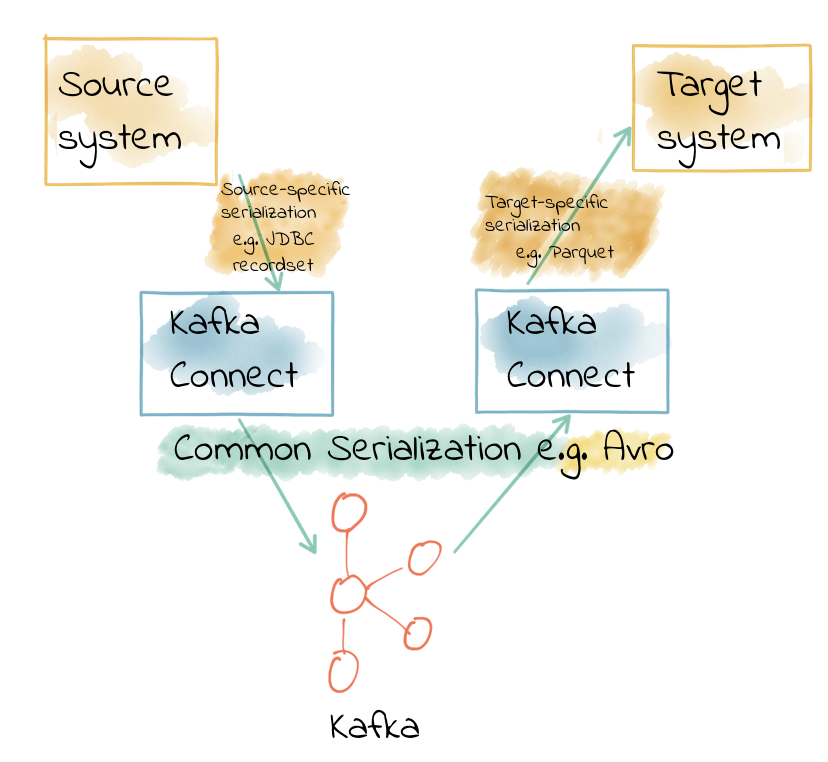

= Kafka Connect Deep Dive - Converters and Serialisation explained

Kafka Connect is part of Apache Kafka®, providing streaming integration between data stores and Kafka. For data engineers it requires just JSON configuration files to use; for developers it has a rich API in which connectors can be developed. There are connectors for common (and not-so-common) data stores out there already, including JDBC, Elasticsearch, HDFS, S3 to name but a few. 

Kafka Connect is modular in nature, providing a very powerful way of handling integration requirements. Some key components include: 

* Connectors - the JAR files that define how to integrate with the data store itself
* Converters - handling serialisation and deserialisation of data
* Transforms - for in-flight manipulation of messages

One of the most frequently asked questions around Kafka Connect involves the serialisation of data, which Kafka Connect handles using Converters. Let's take a good look at how these work, and illustrate some of the common issues encountered. 

== Kafka messages are just bytes

Kafka messages are organised into topics, which can be partitioned. Each message is a key/value, but that is all that Kafka requires. Both key and value are just bytes when they are stored on Kafka. This is a very powerful construct, but also means that developers have the responsibility of deciding how to serialise the data. In configuring Kafka Connect, one of the key things to standardize on is the serialisation format. You need to make sure that anyone reading from the topic is using the same as those writing to the topic. Otherwise, confusion will ensue! 

An analogy: within a country, people speak the native language. But, when flying between countries, pilots and air traffic control have to standardise on a language. If they didn't, communication would be difficult or impossible. In the same way, Kafka Connect provides this "translation" between message format specific to the source system, and the serialisation format that you want to use in Kafka. 

There are various serialisation formats, with common ones including: 

* JSON
* Avro
* Protobuf
* String delimited (e.g. CSV)

There are advantages and disadvantages to each of these. Well, except delimited, in which case it's only disadvantages ;-)

=== Choosing a serialization format

Some guiding principles for choosing a serialisation format include: 

* **Schema**. A lot of the time your data will have a schema to it. You may not like the fact, but it's your responsibility as a developer to preserve and propagate this schema. The schema provides the http://TODO.link.to.gwens.qcon.talk[contract between your services]. Some message formats (such as Avro and Protobuf) have strong schema support, whilst others have lesser support (JSON) or none at all (delimited string). 
* **Ecosystem compatibility**. Avro is a first-class citizen in Confluent Platform, with native support from the Schema Registry, Kafka Connect, KSQL, and more. Protobuf, on the other hand, relies on community contributions for partial levels of feature support. 
* **Message size**. Whilst JSON is plain text and relies on any compression configured in Kafka itself, Avro and Protobuf are both binary formats and thus provide smaller message sizes
* **Language support**. Support for Avro is strong in the Java space, but if your company is not Java-based then you may find it less easy to work with

=== Q: I need to write to my target in JSON, so I must use JSON for my topics? A: Nope.

The format that you're reading data *from* or writing it *to* doesn't need to have a bearing on the format you use for your topics. Kafka Connect's converters serialise the data from source onto the topic, and from a topic out to the target. What this means is that you can have data on a topic in Avro (for example), and when you come to write it to HDFS (for example) you simply specify that you want https://docs.confluent.io/current/connect/kafka-connect-hdfs/configuration_options.html#connector[the sink connector to use that format].

== Configuring converters

Kafka Connect takes a default converter configuration at the _worker_ level, and it can also be overridden _per connector_. Since using the same serialisation format throughout your pipelines is generally a good idea, you'll often just set the converter at the worker, and never need to specify it in a connector. But maybe you're pulling data from someone else's topic and they've decided to use a different serialisation format—in that case you'd set this at the connector. 

image::images/connect_source_converter_01.png[]

The configuration setting is `converter`, prefixed by `value` or `key`. Remember, Kafka messages are _just pairs of key/value bytes_, and you need to specify the converter for both. In some situations you may use different converters for the key and the value. 

Here's an example of using the **String** converter. Since it's just a string, there's no schema to the data, and thus it's not so useful to use for the `value`: 

[source,bash]
----
"key.converter": "org.apache.kafka.connect.storage.StringConverter",
----

Some converters have additional configuration. For Avro, you need to specify the Schema Registry. For JSON, you need to specify if you want Kafka Connect to embed the schema in the JSON itself. When you specify converter configuration you need to include the `key` or `value` prefix. For example, to use Avro for the message payload you'd specify: 

[source,bash]
----
"value.converter": "io.confluent.connect.avro.AvroConverter",
"value.converter.schema.registry.url": "http://schema-registry:8081",
----

Common converters include: 

* Avro - https://www.confluent.io/connector/kafka-connect-avro-converter/[open source from Confluent]
** `io.confluent.connect.avro.AvroConverter`
* String - part of Apache Kafka
** `org.apache.kafka.connect.storage.StringConverter`
* JSON - part of Apache Kafka
** `org.apache.kafka.connect.json.JsonConverter`
* ByteArray - part of Apache Kafka
** `org.apache.kafka.connect.converters.ByteArrayConverter`
* Protobuf - https://www.confluent.io/connector/kafka-connect-protobuf-converter/[open source from the community]
** `com.blueapron.connect.protobuf.ProtobufConverter`

== JSON and schemas

Whilst JSON does not by default support carrying a schema, Kafka Connect does support a particular format of JSON in which the schema is embedded. The resulting data size can get large as the schema is included in every single message along with the schema. 

If you're setting up a Kafka Connect source and want Kafka Connect to include the schema in the message it writes to Kafka, you'd set : 

[source,bash]
----
value.converter=org.apache.kafka.connect.json.JsonConverter
value.converter.schemas.enable=true
----

The resulting message to Kafka would look like the following example, with `schema` and `payload` top-level elements in the JSON:

[source,bash]
----
{
  "schema": {
    "type": "struct",
    "fields": [
      {
        "type": "int64",
        "optional": false,
        "field": "registertime"
      },
      {
        "type": "string",
        "optional": false,
        "field": "userid"
      },
      {
        "type": "string",
        "optional": false,
        "field": "regionid"
      },
      {
        "type": "string",
        "optional": false,
        "field": "gender"
      }
    ],
    "optional": false,
    "name": "ksql.users"
  },
  "payload": {
    "registertime": 1493819497170,
    "userid": "User_1",
    "regionid": "Region_5",
    "gender": "MALE"
  }
}
----

If you're _consuming_ JSON data from a Kafka topic into a Kafka Connect sink, you need to understand already if the data includes a schema. If it does—and it's in the same format as above, not some arbitrary schema-inclusion format—then you'd set

[source,bash]
----
value.converter=org.apache.kafka.connect.json.JsonConverter
value.converter.schemas.enable=true
----

However if you're consuming JSON data and it _doesn't_ have the `schema`/`payload` construct, such as this sample: 

[source,bash]
----
{
  "registertime": 1489869013625,
  "userid": "User_1",
  "regionid": "Region_2",
  "gender": "OTHER"
}
----

you must tell Kafka Connect not to try and decode it as such, by setting `schemas.enable=false`:

[source,bash]
----
value.converter=org.apache.kafka.connect.json.JsonConverter
value.converter.schemas.enable=false
----

As before, remember that the converter configuration option (here, `schemas.enable`) need the prefix of `key.converter` or `value.converter` as appropriate. 

== Common Errors

Here are some of the common errors that you can get if you mis-configure the converters in Kafka Connect. These will show themselves in the sinks you configure for Kafka Connect, as it's this point at which you'll be trying to deserialize the data. Each of these will cause the connector to fail, with a headline error of: 

[source,bash]
----
ERROR WorkerSinkTask{id=sink-file-users-json-noschema-01-0} Task threw an uncaught and unrecoverable exception (org.apache.kafka.connect.runtime.WorkerTask)
org.apache.kafka.connect.errors.ConnectException: Tolerance exceeded in error handler
   at org.apache.kafka.connect.runtime.errors.RetryWithToleranceOperator.execAndHandleError(RetryWithToleranceOperator.java:178)
   at org.apache.kafka.connect.runtime.errors.RetryWithToleranceOperator.execute(RetryWithToleranceOperator.java:104)
----

after this error, you'll see a further stack trace describing exactly _why_ it errored.

=== Reading non-Json data with JsonConverter

If you have non-Json data on your source topic but try to read it with the JsonConverter, you can expect to see

[source,bash]
----
org.apache.kafka.connect.errors.DataException: Converting byte[] to Kafka Connect data failed due to serialization error:
…
org.apache.kafka.common.errors.SerializationException: java.io.CharConversionException: Invalid UTF-32 character 0x1cfa7e2 (above 0x0010ffff) at char #1, byte #7)
----

This could be caused by the source topic being serialized in Avro, or another format.

Solution: If the data is actually in Avro, then change your Kafka Connect sink connector to use 

[source,bash]
----
"value.converter": "io.confluent.connect.avro.AvroConverter",
"value.converter.schema.registry.url": "http://schema-registry:8081",
----

**OR** if the topic is populated by Kafka Connect, and you have the option and would rather, switch the upstream source to emit JSON data:

[source,bash]
----
"value.converter": "org.apache.kafka.connect.json.JsonConverter",
"value.converter.schemas.enable": "false",
----

=== Reading Non-Avro data with AvroConverter

This may be the #1 error that I see reported again and again on places like the Confluent Community https://groups.google.com/forum/#!forum/confluent-platform[mailing list] and https://slackpass.io/confluentcommunity[Slack group]. It happens when you try to use the Avro converter to read data from a topic that is not Avro. This would include data written by another Avro serializer than the Confluent Schema Registry's [Avro serializer](https://docs.confluent.io/5.0.0/schema-registry/docs/serializer-formatter.html#serializer), which has its own https://docs.confluent.io/5.0.0/schema-registry/docs/serializer-formatter.html#wire-format[wire format]. 

[source,bash]
----
org.apache.kafka.connect.errors.DataException: my-topic-name
  at io.confluent.connect.avro.AvroConverter.toConnectData(AvroConverter.java:97)
…
org.apache.kafka.common.errors.SerializationException: Error deserializing Avro message for id -1
org.apache.kafka.common.errors.SerializationException: Unknown magic byte!
----

The solution is to check the source topic's serialization format, and either switch Kafka Connect's sink connector to use the correct source, or if you want to use Avro (which is a good idea) then switch the upstream format to Avro. If upstream is Kafka Connect then you can configure the source connector's converter as follows: 

[source,bash]
----
"value.converter": "io.confluent.connect.avro.AvroConverter",
"value.converter.schema.registry.url": "http://schema-registry:8081",
----

=== Reading JSON message without the expected schema/payload structure

As described earlier, Kafka Connect supports a special structure of JSON messages containing both payload _and_ schema. If you try to read JSON data that _does not contain the data in this structure_ you will get this error: 

[source,bash]
----
org.apache.kafka.connect.errors.DataException: JsonConverter with schemas.enable requires "schema" and "payload" fields and may not contain additional fields. If you are trying to deserialize plain JSON data, set schemas.enable=false in your converter configuration.
----

As the message itself states, if you just have plain JSON data you should change your connector's configuration to : 

[source,bash]
----
"value.converter": "org.apache.kafka.connect.json.JsonConverter",
"value.converter.schemas.enable": "false",
----

If you want to include the schema in the data, you can either switch to using Avro (recommended), or you can configure Kafka Connect upstream to include the schema in the message: 

[source,bash]
----
"value.converter": "org.apache.kafka.connect.json.JsonConverter",
"value.converter.schemas.enable": "true",
----

$ docker-compose exec kafka-connect ls -l /tmp/
total 28
drwxr-xr-x 1 root root  4096 Nov  5 15:00 hsperfdata_root
-rw-r--r-- 1 root root  2242 Nov  5 15:01 users-avro.txt
-rw-r--r-- 1 root root     0 Nov  5 15:01 users-json-noschema-01.txt
-rw-r--r-- 1 root root  2618 Nov  5 15:01 users-json-noschema-02.txt
-rw-r--r-- 1 root root     0 Nov  5 15:01 users-json-noschema-03.txt
-rw-r--r-- 1 root root  2476 Nov  5 15:01 users-json-withschema-01.txt
-rw-r--r-- 1 root root 10474 Nov  5 15:01 users-json-withschema-02.txt
[~/g/d/connect-deepdive] Robin@asgard02.moffatt.me  (connect-deepdive|…)
$

$ docker-compose exec kafka-connect cat /tmp/users-json-noschema-02.txt
{registertime=1506601103005, gender=MALE, regionid=Region_7, userid=User_6}
{registertime=1494322512667, gender=FEMALE, regionid=Region_3, userid=User_6}
{registertime=1512577119982, gender=OTHER, regionid=Region_3, userid=User_5}

$ docker-compose exec kafka-connect cat /tmp/users-json-withschema-01.txt
Struct{registertime=1517206846485,userid=User_7,regionid=Region_8,gender=FEMALE}
Struct{registertime=1488194613026,userid=User_9,regionid=Region_3,gender=FEMALE}
Struct{registertime=1501337865395,userid=User_8,regionid=Region_3,gender=MALE}

$ docker-compose exec kafka-connect cat /tmp/users-avro.txt
Struct{registertime=1494124940983,userid=User_6,regionid=Region_2,gender=OTHER}
Struct{registertime=1507502362439,userid=User_9,regionid=Region_6,gender=FEMALE}

$ docker-compose exec kafka-connect cat /tmp/users-json-withschema-02.txt
{schema={name=ksql.users, optional=false, type=struct, fields=[{field=registertime, optional=false, type=int64}, {field=userid, optional=false, type=string}, {field=regionid, optional=false, type=string}, {field=gender, optional=false, type=string}]}, payload={registertime=1517206846485, gender=FEMALE, regionid=Region_8, userid=User_7}}
{schema={name=ksql.users, optional=false, type=struct, fields=[{field=registertime, optional=false, type=int64}, {field=userid, optional=false, type=string}, {field=regionid, optional=false, type=string}, {field=gender, optional=false, type=string}]}, payload={registertime=1488194613026, gender=FEMALE, regionid=Region_3, userid=User_9}}

$ docker-compose exec kafka-connect \
                      kafka-avro-console-consumer \
                      --bootstrap-server kafka:29092 \
                      --property schema.registry.url=http://schema-registry:8081 \
                      --topic users-avro --from-beginning
{"registertime":1513121421609,"userid":"User_6","regionid":"Region_4","gender":"OTHER"}
{"registertime":1506980341594,"userid":"User_3","regionid":"Region_7","gender":"MALE"}

$ docker run --rm -it --network connect-deepdive_default confluentinc/cp-kafkacat \
    kafkacat -b kafka:29092 -t users-json-noschema -C
{"registertime":1489869013625,"userid":"User_1","regionid":"Region_2","gender":"OTHER"}
{"registertime":1501504484224,"userid":"User_9","regionid":"Region_4","gender":"OTHER"}
{"registertime":1491945892920,"userid":"User_9","regionid":"Region_7","gender":"FEMALE"}
{"registertime":1488720890186,"userid":"User_3","regionid":"Region_7","gender":"MALE"}
{"registertime":1510412265433,"userid":"User_6","regionid":"Region_9","gender":"OTHER"}
{"registertime":1499492089595,"userid":"User_8","regionid":"Region_9","gender":"MALE"}
{"registertime":1511475499040,"userid":"User_6","regionid":"Region_6","gender":"OTHER"}
{"registertime":1510299526935,"userid":"User_2","regionid":"Region_7","gender":"FEMALE"}
{"registertime":1500969941178,"userid":"User_2","regionid":"Region_9","gender":"MALE"}
{"registertime":1512623334159,"userid":"User_6","regionid":"Region_4","gender":"OTHER"}
{"registertime":1512739946941,"userid":"User_7","regionid":"Region_3","gender":"FEMALE"}
{"registertime":1498954239463,"userid":"User_2","regionid":"Region_6","gender":"OTHER"}
% Reached end of topic users-json-noschema [0] at offset 12
^C⏎                                                                                                                                                           [~/g/d/connect-deepdive] Robin@asgard02.moffatt.me  (connect-deepdive|…)
$ docker run --rm -it --network connect-deepdive_default confluentinc/cp-kafkacat \
    kafkacat -b kafka:29092 -t users-json-withschema -C
{"schema":{"type":"struct","fields":[{"type":"int64","optional":false,"field":"registertime"},{"type":"string","optional":false,"field":"userid"},{"type":"string","optional":false,"field":"regionid"},{"type":"string","optional":false,"field":"gender"}],"optional":false,"name":"ksql.users"},"payload":{"registertime":1493819497170,"userid":"User_1","regionid":"Region_5","gender":"MALE"}}
{"schema":{"type":"struct","fields":[{"type":"int64","optional":false,"field":"registertime"},{"type":"string","optional":false,"field":"userid"},{"type":"string","optional":false,"field":"regionid"},{"type":"string","optional":false,"field":"gender"}],"optional":false,"name":"ksql.users"},"payload":{"registertime":1518251837453,"userid":"User_1","regionid":"Region_4","gender":"MALE"}}
{"schema":{"type":"struct","fields":[{"type":"int64","optional":false,"field":"registertime"},{"type":"string","optional":false,"field":"userid"},{"type":"string","optional":false,"field":"regionid"},{"type":"string","optional":false,"field":"gender"}],"optional":false,"name":"ksql.users"},"payload":{"registertime":1497903577404,"userid":"User_3","regionid":"Region_1","gender":"FEMALE"}}
{"schema":{"type":"struct","fields":[{"type":"int64","optional":false,"field":"registertime"},{"type":"string","optional":false,"field":"userid"},{"type":"string","optional":false,"field":"regionid"},{"type":"string","optional":false,"field":"gender"}],"optional":false,"name":"ksql.users"},"payload":{"registertime":1491331304628,"userid":"User_6","regionid":"Region_6","gender":"OTHER"}}
{"schema":{"type":"struct","fields":[{"type":"int64","optional":false,"field":"registertime"},{"type":"string","optional":false,"field":"userid"},{"type":"string","optional":false,"field":"regionid"},{"type":"string","optional":false,"field":"gender"}],"optional":false,"name":"ksql.users"},"payload":{"registertime":1500799220091,"userid":"User_7","regionid":"Region_4","gender":"OTHER"}}
{"schema":{"type":"struct","fields":[{"type":"int64","optional":false,"field":"registertime"},{"type":"string","optional":false,"field":"userid"},{"type":"string","optional":false,"field":"regionid"},{"type":"string","optional":false,"field":"gender"}],"optional":false,"name":"ksql.users"},"payload":{"registertime":1497691680754,"userid":"User_2","regionid":"Region_1","gender":"FEMALE"}}
{"schema":{"type":"struct","fields":[{"type":"int64","optional":false,"field":"registertime"},{"type":"string","optional":false,"field":"userid"},{"type":"string","optional":false,"field":"regionid"},{"type":"string","optional":false,"field":"gender"}],"optional":false,"name":"ksql.users"},"payload":{"registertime":1505775959533,"userid":"User_6","regionid":"Region_9","gender":"FEMALE"}}
{"schema":{"type":"struct","fields":[{"type":"int64","optional":false,"field":"registertime"},{"type":"string","optional":false,"field":"userid"},{"type":"string","optional":false,"field":"regionid"},{"type":"string","optional":false,"field":"gender"}],"optional":false,"name":"ksql.users"},"payload":{"registertime":1504383956725,"userid":"User_1","regionid":"Region_3","gender":"MALE"}}
{"schema":{"type":"struct","fields":[{"type":"int64","optional":false,"field":"registertime"},{"type":"string","optional":false,"field":"userid"},{"type":"string","optional":false,"field":"regionid"},{"type":"string","optional":false,"field":"gender"}],"optional":false,"name":"ksql.users"},"payload":{"registertime":1504160286552,"userid":"User_6","regionid":"Region_6","gender":"FEMALE"}}
{"schema":{"type":"struct","fields":[{"type":"int64","optional":false,"field":"registertime"},{"type":"string","optional":false,"field":"userid"},{"type":"string","optional":false,"field":"regionid"},{"type":"string","optional":false,"field":"gender"}],"optional":false,"name":"ksql.users"},"payload":{"registertime":1499304573866,"userid":"User_4","regionid":"Region_3","gender":"MALE"}}
% Reached end of topic users-json-withschema [0] at offset 10

== How to find the errors

== Inspecting topic data
