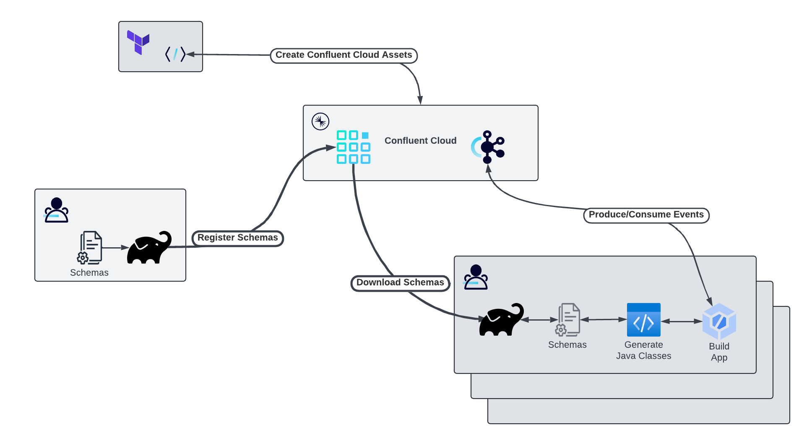
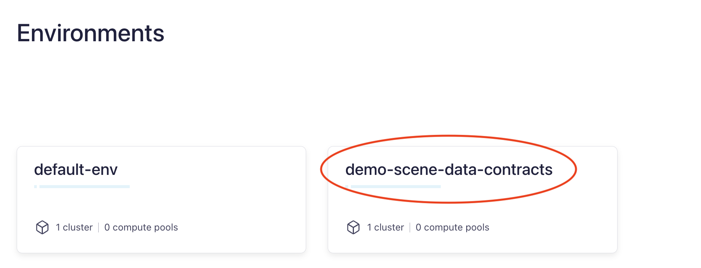
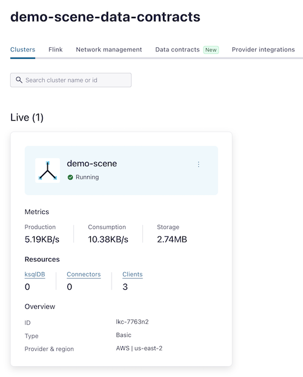
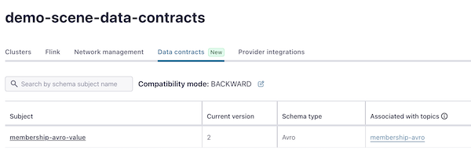

# Managing Data Contracts in Confluent Cloud

Data contracts consist not only of the schemas to define the structure of events, but also rulesets allowing for more fine-grained validations,
controls, and discovery. In this demo, we'll evolve a schema by adding migration rules.

## Running the Example



In the workflow above, we see these tools in action:
* The [Confluent Terraform Provider](https://registry.terraform.io/providers/confluentinc/confluent/latest/docs) is used to define Confluent Cloud assets (Kafka cluster(s), Data Governance, Kafka Topics, and Schema Configurations).
* Using the newly created Schema Registry, data engineers and architects define the schema of the events that comprise the organization's canonical data model - i.e. entities, events, and commands that are shared across applications. - along with other parts of the data contract. This includes data quality rules, metadata, and migration rules. A gradle plugin is utilized to register the schemas and related elements of the data contract with the Schema Registry.
* Applications which producer and/or consume these event types can download the schemas from the Schema Registry. In our example, this is a JVM application built using Gradle. A gradle plugin is used to download the schemas, after which another gradle plugin is used to generate Java classes from those schemas - thus providing the application with compile-time type safety.

### Prerequisites

Clone the `confluentinc/demo-scene` GitHub repository (if you haven't already) and navigate to the `demo-scene` directory:

```shell
git clone git@github.com:confluentinc/demo-scene.git
cd demo-scene
```

Here are the tools needed to run this tutorial:
* [Confluent Cloud](http://confluent.cloud)
* [Confluent CLI](https://docs.confluent.io/confluent-cli/current/install.html)
* [Terraform](https://developer.hashicorp.com/terraform/install?product_intent=terraform)
* [jq](https://jqlang.github.io/jq/)
* [Gradle](https://gradle.org/install/)
* JDK 17
* IDE of choice

> [!Note] When installing and configuring the Confluent CLI, include the Confluent Cloud credentials as environment variables for future use. For instance with bash or zsh, include these export statements:
> 
> ```shell
> export CONFLUENT_CLOUD_API_KEY=<API KEY>
> export CONFLUENT_CLOUD_API_SECRET<API SECRET>
> ```
>

Terraform can use the value of any environment variable whose name begins with `TF_VAR_` as the value of a terraform variable of the same name. For more on this functionality, see the [terraform documentation](https://developer.hashicorp.com/terraform/cli/config/environment-variables#tf_var_name).

Our example requires we set the value the `org_id` variable from Confluent Cloud. This denotes which organization will house the Confluent Cloud assets we are creating. So let's export the Confluent Cloud organization ID to a terraform environment variable.

This command may open a browser window asking you to authenticate to Confluent Cloud. Once that's complete, the result of
`confluent organization list` is queried by `jq` to extract the `id` of the current organization to which you are authenticated:

```shell
export TF_VAR_org_id=$(confluent organization list -o json | jq -c -r '.[] | select(.is_current)' | jq '.id')
```

### Create Assets in Confluent Cloud

From the root of `data-contracts`, run the provided setup script - `setup.sh`. Note, you may need to edit permissions to make this file executable.

```shell
chmod +x setup.sh
./setup.sh
Setup Confluent Cloud and all Gradle Builds for Demo
-------------------------------------
Initializing Confluent Cloud Environment...
......
......
......
......
BUILD SUCCESSFUL in 2s
6 actionable tasks: 6 executed
Watched directory hierarchies: [/Users/sjacobs/code/confluentinc/demo-scene/data-contracts]
Code Generation Complete
-------------------------------------

Setup Complete!
```

Let's have a look at what we've created in Confluent Cloud, we find a new Environment:



With a Kafka cluster:



And Data Contracts:




Locally, we also create a `properties` file containing the parameters needed for our Kafka clients to connect to Confluent Cloud. For an example of this 
`properties` file, see [confluent.properties.orig](shared/src/main/resources/confluent.properties.orig).

> [!NOTE]
> The file-based approach we're using here is NOT recommended for a production-quality application. Perhaps a secrets manager implementation would be better suited - which the major cloud providers all offer, or perhaps a tool like Hashicorp Vault. Such a tool would also have client libraries in a Maven repository for the JVM applications to access the secrets.
> 

### Run the Examples

In `app-schema-v1`, the `ApplicationMain` object's `main` function starts a consumer in a new thread to subscribe to the `membership-avro` topic. It then begins
producing randomly-generated events to `membership-avro` at a provided interval for a provided duration. By default, an event is produced every 1 second for 100 seconds. These events are created and consumed using version 1 of the membership schema. The console output of the consumer should look something like this:

```shell
[Thread-0] INFO io.confluent.devrel.datacontracts.shared.BaseConsumer - Received Membership d0e65c83-b1c5-451d-b08b-8d1ed6fca8d6, {"user_id": "d0e65c83-b1c5-451d-b08b-8d1ed6fca8d6", "start_date": "2023-01-14", "end_date": "2025-05-28"}
[Thread-0] INFO io.confluent.devrel.datacontracts.shared.BaseConsumer - Received Membership 940cf6fa-eb12-46af-87e8-5a9bc33df119, {"user_id": "940cf6fa-eb12-46af-87e8-5a9bc33df119", "start_date": "2023-05-23", "end_date": "2025-07-02"}
```

The `app-schema-v2` module's `main` function starts a consumer subscribed to the `membership-avro` topic. But this time, events will be consumed using
version 2 of the membership schema. Notice the `Map` of consumer overrides in the constructor of the `MembershipConsumer` in that module. As such, those
same events which `app-schema-v1` produced using `major_version=1` of the schema are consumed using `major_version=2`:

```shell
[Thread-0] INFO io.confluent.devrel.datacontracts.shared.BaseConsumer - v2 - Received Membership b0e34c68-208c-4771-be19-79689fc9ad28, {"user_id": "b0e34c68-208c-4771-be19-79689fc9ad28", "validity_period": {"from": "2022-11-06", "to": "2025-09-03"}}
[Thread-0] INFO io.confluent.devrel.datacontracts.shared.BaseConsumer - v2 - Received Membership 517f8c7e-4ae5-47ea-93a2-c1f00669d330, {"user_id": "517f8c7e-4ae5-47ea-93a2-c1f00669d330", "validity_period": {"from": "2023-01-29", "to": "2025-02-19"}}
```

This illustrates how the use of migration rules allows producers and consumers to independently make any code and configuration changes needed to accommodate schema changes.

## Teardown

When you're done with the demo, issue this command from the `cc-terraform` directory to destroy the Confluent Cloud environment
we created:

```shell
terraform destroy -auto-approve
```

Check the Confluent Cloud console to ensure this environment no longer exists.


