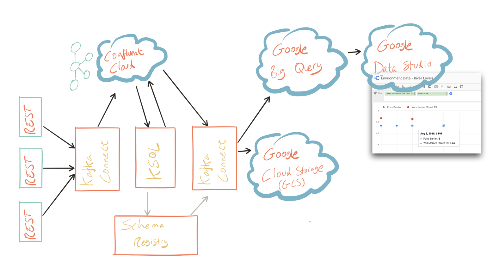
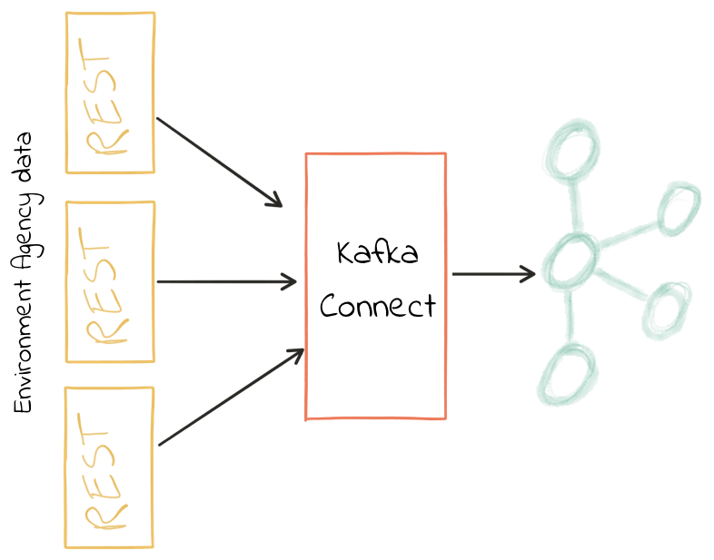
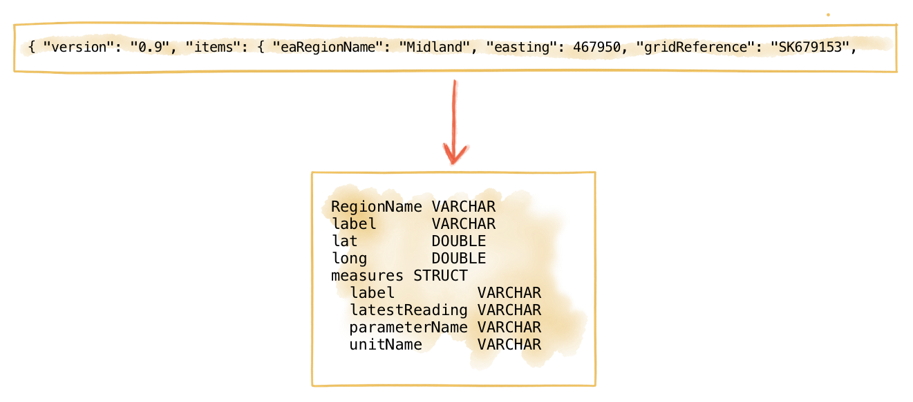
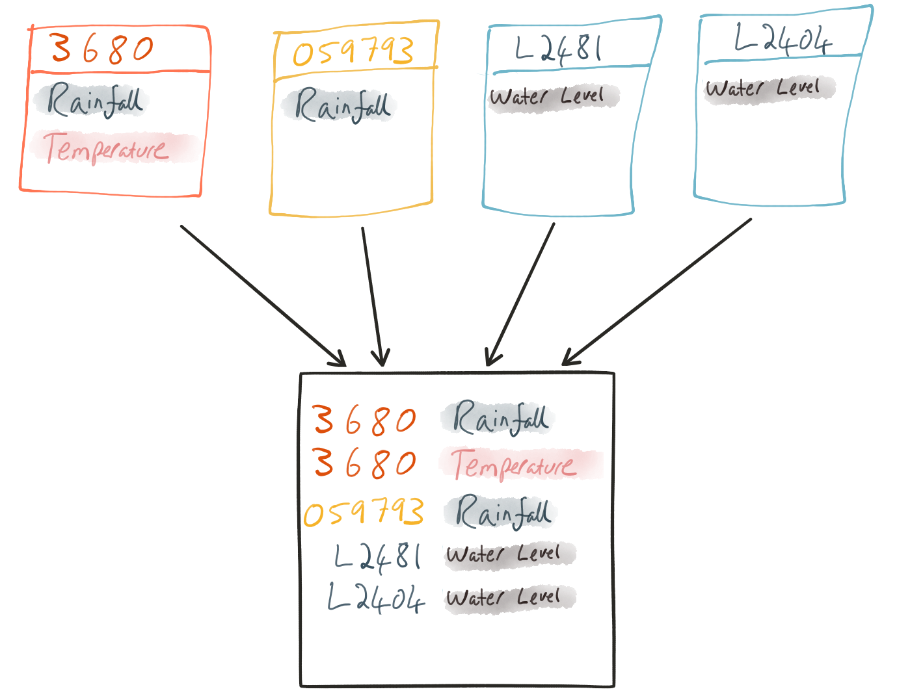
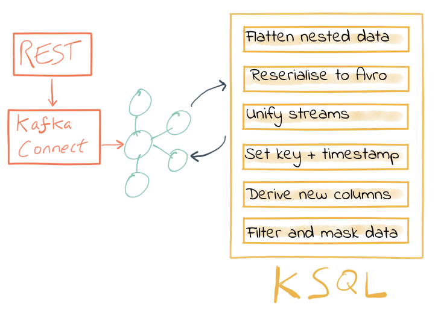
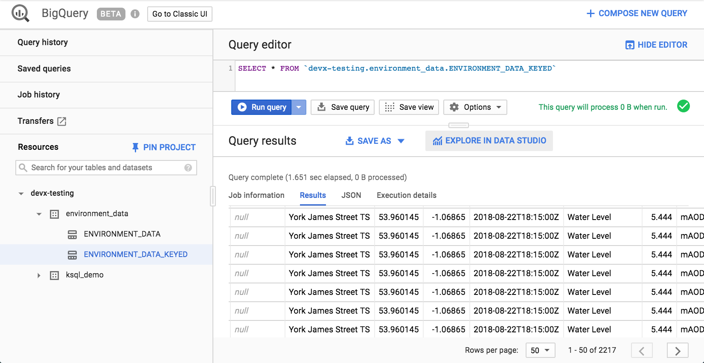
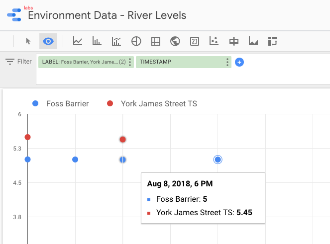
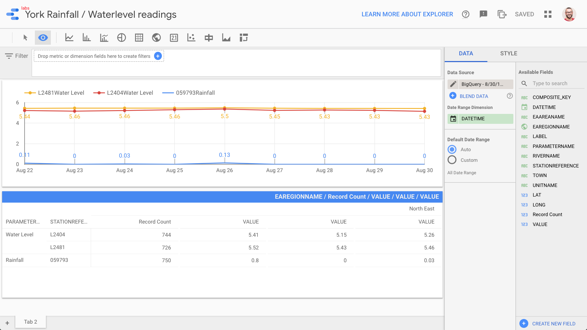

= Data Wrangling with Apache Kafka and KSQL

Robin Moffatt <robin@confluent.io>
v1.20, September 6, 2018

KSQL, the SQL streaming engine for Apache Kafka®, puts the power of stream processing into the hands of anyone who knows SQL. It's fun to use for exploring data in Kafka topics, but its real power comes in building stream processing applications. By continually streaming messages from one Kafka topic to another, applying transformations expressed in SQL, it is possible to build powerful applications doing common data wrangling tasks such as: 

- Applying schema to data
- Filtering and masking data
- Changing data structures (for example, flattening nested data)
- Changing the serialization format
- Enriching streams of data
- Unifying multiple streams of data

Imagine you’ve got data on which you want to build some analytics. It’s coming from multiple sources—maybe different instances of the same system. You need to unify those sources into a single one, reformat the data along the way and apply a schema to the data so that it can be easily analyzed downstream. Apache Kafka and KSQL are a great choice for this.

Why Kafka? Because we can use it for integrating the source systems with those downstream, in near real-time and with the ability to add and swap out sources and targets without disturbing the rest of the components. In addition, we can reprocess data as required and share it with other systems—enabling them to take advantage of the data cleansing and wrangling that we’ve performed.

In this article, we’ll see how to pull in data from REST sources, cleanse and wrangle it with KSQL, then stream it out to both Google Cloud Storage (GCS) as well as Google BigQuery for analysis and visualization in Google Data Studio. We’re using https://confluent.cloud[Confluent Cloud]™ to host our Kafka brokers, but it will work on a local cluster instead if you want to.

_You can find all of the code used in this article on https://github.com/confluentinc/demo-scene/blob/master/gcp-pipeline/env-data/[GitHub], including https://github.com/confluentinc/demo-scene/blob/master/gcp-pipeline/docker-compose-all-local.yml[Docker Compose] files._

== Getting the data in

_Credit: This section uses Environment Agency rainfall data from the real-time data API (beta)._

The data that I’m working with here is from the http://environment.data.gov.uk/flood-monitoring/doc/reference[public API] provided by the U.K. government’s Environment Agency. It contains readings taken from various weather stations around the country regarding information  like rainfall, river levels and so on. Each station has its own REST API endpoint. 

We’re going to pull in data from four of these, using Kafka Connect to poll the sources. The data structures from each endpoint vary slightly, giving us a nice real-world example of data cleansing problems.

I'm using the https://github.com/llofberg/kafka-connect-rest[Kafka Connect REST] source connector, which is a community-contributed connector written by Lenny Löfberg. Using this connector I can specify a REST endpoint, and a polling interval, and the resulting payload is written to a Kafka topic. 

To start with, create the connectors (one per station): 

[source,json]
----
{
    "name": "source_rest_flood-monitoring-L2404",
    "config": {
        "connector.class": "com.tm.kafka.connect.rest.RestSourceConnector",
        "rest.source.url": "http://environment.data.gov.uk/flood-monitoring/id/stations/L2404",
        [...]
    }
}
----
_https://github.com/confluentinc/demo-scene/blob/master/gcp-pipeline/env-data/connect_source.sh[-> full code on github]_

With this running, I have a Kafka topic per weather station and data in each: 

[source,bash]
----
$ ccloud consume --from-beginning --topic flood-monitoring-059793|jq '.'                                                                                                                                 {
  "@context": "http://environment.data.gov.uk/flood-monitoring/meta/context.jsonld",
  "meta": {
    "publisher": "Environment Agency",
    [...]
    ]
  },
  "items": {
    [...]
    "label": "Rainfall station",
    "lat": 53.966652,
    "long": -1.115089,
    "measures": {
      [...]
      "latestReading": {
        "dateTime": "2018-08-22T05:30:00Z",
        "value": 0
        [...]
----

You'll note from the above sample of JSON that it's nested data. For this station (`059793`) there is just one measure. However, for another station (`3680`) there are multiple measure readings, and the `measure` is supplied as an array: 

[source,json]
----
[...]
  "items": {
    "@id": "http://environment.data.gov.uk/flood-monitoring/id/stations/3680",
    "label": "Rainfall station",
    [...
    "measures": [
      {
        [...]
        "label": "rainfall-tipping_bucket_raingauge-t-15_min-mm",
        "latestReading": {
          "dateTime": "2018-08-30T04:00:00Z",
          "value": 0
          [...]
        },
      },
      {
        [...]
        "label": "temperature-dry_bulb-i-15_min-deg_C",
        "latestReading": {
          "dateTime": "2018-08-30T04:00:00Z",
          "value": 8
          [...]
        },
      }
    ],
[...]    
----

This kind of varying structure in the data is a common problem in data integration and ETL. We'll see in this article how KSQL can help with addressing this kind of challenge. 

Now, we want to take these four Kafka topics and build a stream processing application that will populate a single unified output topic of transformed data from across the four topics. This will process data that already exists in the Kafka topic, along with every new message that arrives.

== Declaring the schema

The data coming in is JSON—but with no declared schema as such. As a framework, Kafka Connect can automagically register a schema for inbound data that it serializes as Apache Avro™, but the REST connector here is basically just pulling string data from the REST endpoint, and that string data happens to be JSON. So, the first thing we're going to do with KSQL is declare a schema for our source data from each topic. Note that the schema varies slightly to take into account the data from one of the stations that includes an array. 

[source,sql]
----
CREATE STREAM flood_monitoring_059793 \
    (meta STRUCT<publisher         VARCHAR, \
                 comment           VARCHAR>, \
     items STRUCT<eaRegionName     VARCHAR, \
                  label            VARCHAR, \
                  stationReference VARCHAR, \
                  lat              DOUBLE, \
                  long             DOUBLE, \
                  measures STRUCT<label         VARCHAR, \
                                  latestReading STRUCT<dateTime VARCHAR, \
                                                Value DOUBLE>,\
                                  parameterName VARCHAR, \
                                  unitName VARCHAR>> \
    ) WITH (KAFKA_TOPIC='flood-monitoring-059793',VALUE_FORMAT='JSON');

[...]

CREATE STREAM flood_monitoring_3680 \
    (meta STRUCT<publisher VARCHAR, \
                 comment VARCHAR>, \
     items STRUCT<eaRegionName VARCHAR, \
                  label VARCHAR, \
                  stationReference VARCHAR, \
                  lat DOUBLE, \
                  long DOUBLE, \
                  measures ARRAY<STRUCT<label VARCHAR, \
                        latestReading STRUCT<\
                            dateTime VARCHAR, \
                     Value DOUBLE>,\
                        parameterName VARCHAR, \
                        unitName VARCHAR>>> \
    ) WITH (KAFKA_TOPIC='flood-monitoring-3680',VALUE_FORMAT='JSON');

----

With the Kafka topics registered and schemas defined, we can list them out: 

[source,sql]
----
ksql> show streams;

 Stream Name             | Kafka Topic                 | Format
----------------------------------------------------------------
 FLOOD_MONITORING_3680   | flood-monitoring-3680       | JSON
 FLOOD_MONITORING_L2404  | flood-monitoring-L2404      | JSON
 FLOOD_MONITORING_059793 | flood-monitoring-059793     | JSON
 FLOOD_MONITORING_L2481  | flood-monitoring-L2481      | JSON
----------------------------------------------------------------
----

Before we even do anything else to the data, we could use KSQL’s ability to reserialize and convert the raw JSON data into Avro. The advantage here is that any application downstream—whether it’s another KSQL process, Kafka Connect or a Kafka consumer—can work with the data directly from the topic and obtain the schema for it from the Schema Registry. To do this, use the `CREATE STREAM…AS SELECT` statement with the `VALUE_FORMAT` specified as part of the `WITH` clause:

[source,sql]
----
CREATE STREAM FLOOD_MONITORING_3680_AVRO \
    WITH (VALUE_FORMAT='AVRO') AS \
    SELECT * FROM FLOOD_MONITORING_3680;
----

You can also define the partitioning and replication factor at this stage, too, if you wanted to change that.

For the rest of this exercise we’ll stick to the original JSON topics and apply the Avro serialization later on.

== Working with nested data

Because the data in the source topic is nested JSON, we declare the parent column's data type as `STRUCT`. To access the data with KSQL, use the `->` operator: 

[source,sql]
----
select items->stationreference, \
       items->earegionname, \
       items->measures->parameterName, \
       items->measures->latestreading->datetime,\
       items->measures->latestreading->value, \
       items->measures->unitname \
from   flood_monitoring_L2481 limit 1;
L2481 | North East | Water Level | 2018-08-22T13:00:00Z | 5.447 | mAOD
----

For the readings that are part of an array (declared as an `ARRAY<STRUCT>`), use square brackets to designate the index: 

[source,sql]
----
ksql> select items->stationreference, \
        items->earegionname, \
        items->measures[0]->parameterName, \
        items->measures[0]->latestreading->datetime,\
        items->measures[0]->latestreading->value, \
        items->measures[0]->unitname \
 from   flood_monitoring_3680  limit 1;
3680 | Midland | Rainfall | 2018-08-30T04:00:00Z | 0.0 | mm
----

== Unifying data from multiple streams

Taking a sample record from each topic and reading type gives us this table when manually collated: 

[options="header"]
|=================================================================================
|Station reference|Station region|Measurement type|Timestamp|Measurement|Unit
|3680 | Midland | Rainfall | 2018-08-30T04:00:00Z | 0.0 | mm
|3680 | Midland | Temperature | 2018-08-30T04:00:00Z | 8.0 | deg C
|059793 | North East | Rainfall | 2018-08-22T05:30:00Z | 0.0 | mm
|L2481 | North East | Water Level | 2018-08-22T13:00:00Z | 5.447 | mAOD
|L2404 | North East | Water Level | 2018-08-22T18:45:00Z | 5.23 | mAOD
|=================================================================================

Looking at the data, we can apply a data model that looks something like this: 

[source,bash]
----
+-Environment Readings
  +-Station reference
  +-Station region
  +-Type of measurement
  +-Measurement timestamp
  +-Measurement
  +-Measurement units
----

The type of reading (e.g., temperature, rainfall and river level) varies, as do the units associated with it and the station. We could normalize this out into stations, reading types and so on—but for ease of reporting we’ll actually denormalize it into a single flat structure. This means bringing in data from the multiple streams, including manually exploding the array within the 3680 topic (which contains both rainfall and temperature data):

To do this, we can use KSQL's `INSERT INTO` statement. This streams the results of a `SELECT` statement into an existing target `STREAM`. The initial `STREAM` we'll create using `CREATE STREAM…AS SELECT`. We'll also take the opportunity to serialize the data to Avro. 

[source,sql]
----
CREATE STREAM ENVIRONMENT_DATA WITH \
        (VALUE_FORMAT='AVRO') AS \
SELECT  items->stationreference AS stationreference, \
        items->earegionname AS earegionname, \
        items->label AS label, \
        items->lat AS lat, items->long AS long, \
        items->measures->latestreading->datetime AS reading_ts, \
        items->measures->parameterName AS parameterName, \
        items->measures->latestreading->value AS reading_value, \
        items->measures->unitname AS unitname \
 FROM   flood_monitoring_L2404 ;

INSERT INTO ENVIRONMENT_DATA \
SELECT  items->stationreference AS stationreference, \
        items->earegionname AS earegionname, \
        items->label AS label, \
        items->lat AS lat, items->long AS long, \
        items->measures->latestreading->datetime AS reading_ts, \
        items->measures->parameterName AS parameterName, \
        items->measures->latestreading->value AS value, \
        items->measures->unitname AS unitname \
 FROM   flood_monitoring_L2481 ;

-- (INSERT INTO repeated for the remaining source topics)
----
_https://github.com/confluentinc/demo-scene/blob/master/gcp-pipeline/env-data/apply_schema__unify_streams_minimal.sql[-> full code on github]_

Now when we inspect the `STREAMS`, we can see the new one created and populated by the above statements: 

[source,sql]
----
ksql> show streams;

 Stream Name                | Kafka Topic                 | Format
-------------------------------------------------------------------
 FLOOD_MONITORING_3680      | flood-monitoring-3680       | JSON
 FLOOD_MONITORING_L2404     | flood-monitoring-L2404      | JSON
 FLOOD_MONITORING_059793    | flood-monitoring-059793     | JSON
 FLOOD_MONITORING_L2481     | flood-monitoring-L2481      | JSON
 ENVIRONMENT_DATA           | ENVIRONMENT_DATA            | AVRO
-------------------------------------------------------------------
----

Note that the “Format” as shown in the column in the above output is `AVRO`. Using `DESCRIBE EXTENDED` you can check that messages are being processed by reviewing the `Local runtime statistics`: 

[source,sql]
----
ksql> DESCRIBE EXTENDED ENVIRONMENT_DATA;
[...]
Local runtime statistics
------------------------
messages-per-sec:         0   total-messages:      2311     last-message: 8/30/18 2:38:48 PM UTC
 failed-messages:         0 failed-messages-per-sec:         0      last-failed:       n/a
(Statistics of the local KSQL server interaction with the Kafka topic ENVIRONMENT_DATA)
ksql>
----

The unified topic is `ENVIRONMENT_DATA`, and has data from all source topics within it: 

[source,sql]
----
ksql> SELECT * FROM ENVIRONMENT_DATA ;
1534992115367 | null | L2404 | North East | Foss Barrier | 53.952443 | -1.078056 | 2018-08-22T18:45:00Z | Water Level | 5.23 | mAOD
[...]
1535615911999 | null | L2481 | North East | York James Street TS | 53.960145 | -1.06865 | 2018-08-30T05:30:00Z | Water Level | 5.428 | mAOD
[...]
1535135263726 | null | 059793 | North East | Rainfall station | 53.966652 | -1.115089 | 2018-08-24T17:00:00Z | Rainfall | 0.0 | mm
[...]
1535638518251 | null | 3680 | Midland | Rainfall station | 52.73152 | -0.995167 | 2018-08-30T04:00:00Z | Rainfall | 0.0 | mm
[...]
1535638518251 | null | 3680 | Midland | Rainfall station | 52.73152 | -0.995167 | 2018-08-30T04:00:00Z | Temperature | 8.0 | deg C
----

== Re-keying data in KSQL

Based on the above data model, the unique key for data is a composite of the station, reading type, and timestamp. We’re going to handle the timestamp separately - for now let’s see how to use KSQL to set the message key used by Kafka.

The message key is important as it defines the partition on which messages are stored in Kafka, and is used in any KSQL joins. At the moment there’s no key set, so data for the same station and reading type could be scattered across partitions. For a few rows of data this may not matter, but as volumes increase it becomes more important to consider. It’s also pertinent to the strict ordering guarantee that Kafka provides, which only applies within a partition.

Using https://docs.confluent.io/current/app-development/kafkacat-usage.html[kafkacat] we can inspect the partition assignments. I'm using a topic that I've created just for this purpose, with the serialization set to JSON (kafkacat doesn't currently support Avro). By filtering for a given station we can see the partitions that messages are assigned to as well as the message key:

[source,bash]
----
$ kafkacat -b kafka-broker:9092 -t ENVIRONMENT_DATA_JSON -f 'Partition: %p\tOffset: %o\tKey (%K bytes): %k\tValue (%S bytes): %s\n'|grep L2481

Partition: 0    Offset: 344  Key (-1 bytes):  Value (260 bytes): {"STATIONREFERENCE":"L2481"[...]
[...]
Partition: 1    Offset: 595  Key (-1 bytes):  Value (260 bytes): {"STATIONREFERENCE":"L2481"[...]
[...]
Partition: 2    Offset: 48   Key (-1 bytes):  Value (260 bytes): {"STATIONREFERENCE":"L2481"[...]
Partition: 2    Offset: 49   Key (-1 bytes):  Value (260 bytes): {"STATIONREFERENCE":"L2481"[...]
[...]
----

Note that the messages span several partitions and have a null key.

Next, let’s repartition our unified data stream using the `PARTITION BY` clause: 

[source,sql]
----
CREATE STREAM ENVIRONMENT_DATA_REKEYED AS \
    SELECT STATIONREFERENCE+PARAMETERNAME AS COMPOSITE_KEY, * FROM ENVIRONMENT_DATA \
    PARTITION BY COMPOSITE_KEY;
----

Checking the data with kafkacat again, we see the following:

[source,bash]
----
kafkacat -b kafka-broker:9092 -t ENVIRONMENT_DATA_REKEYED -f 'Partition: %p\tOffset: %o\tKey (%K bytes): %k\tValue (%S bytes): %s\n'|grep L2481
% Auto-selecting Consumer mode (use -P or -C to override)
% Reached end of topic ENVIRONMENT_DATA_REKEYED2 [3] at offset 0
% Reached end of topic ENVIRONMENT_DATA_REKEYED2 [1] at offset 0
Partition: 2    Offset: 0    Key (16 bytes): L2481Water Level        Value (241 bytes): {"COMPOSITE_KEY":"L2481Water Level","STATIONREFERENCE":"L2481"[...]
Partition: 2    Offset: 1    Key (16 bytes): L2481Water Level        Value (241 bytes): {"COMPOSITE_KEY":"L2481Water Level","STATIONREFERENCE":"L2481"[...]
[...]
Partition: 2    Offset: 734  Key (16 bytes): L2481Water Level        Value (241 bytes): {"COMPOSITE_KEY":"L2481Water Level","STATIONREFERENCE":"L2481"[...]
----

All of the messages for the given key reside on a single partition, and each message has a key and value.

== Managing message timestamps in KSQL 

As well as messages having a key (and value), they also have a timestamp in their metadata. This can be set explicitly by the application producing the messages to Kafka, or in the absence of that messages will take the time at which it arrives at the Kafka broker. The timestamp of the messages that we’re working with have the timestamp of the time at which they were ingested by Kafka Connect. However, the actual timestamp to use in processing the data for analysis is the `items.measures.latestReading.dateTime` value within the message. This matters particularly when using the data for aggregations, time-based partitioning and so on. Using the `TIMESTAMPTOSTRING` function we can examine the two timestamps discussed above: 

[source,sql]
----
ksql> SELECT TIMESTAMPTOSTRING(ROWTIME, 'yyyy-MM-dd HH:mm:ss'), items->measures->latestReading->dateTime FROM FLOOD_MONITORING_L2404 LIMIT 1;
2018-08-23 01:11:53 | 2018-08-22T18:45:00Z
----

In this example, the data arrived in Kafka at 01:11 on Aug. 23, 2018, but the reading occurred at 18:45 on the Aug. 22, 2018. If we did any arithmetic on the data as it stands (for example, calculating the maximum reading value on Aug. 22), we’d get an incorrect answer. This is because KSQL uses the _message timestamp_ (accessible through the virtual system column `ROWTIME`) in its time processing (such as windowed aggregates). 

To rectify this, we can use KSQL. Just as we used the `WITH` clause previously to set the serialization format to Avro, we can use a similar pattern to override the timestamp that will be used for the messages in the target stream being created: 

[source,sql]
----
CREATE STREAM ENVIRONMENT_DATA_WITH_TS \
            WITH (TIMESTAMP='READING_TS', \
                  TIMESTAMP_FORMAT='yyyy-MM-dd''T''HH:mm:ssX') AS \
SELECT * \
  FROM ENVIRONMENT_DATA ;
----

* _This is currently blocked by https://github.com/confluentinc/ksql/issues/1439[#1439]. The workaround is a two-step conversion_:
+
[source,sql]
----
CREATE STREAM ENVIRONMENT_DATA_WITH_TS_STG AS \
SELECT STRINGTOTIMESTAMP(READING_TS, 'yyyy-MM-dd''T''HH:mm:ssX') AS READING_TS_EPOCH, * \
FROM ENVIRONMENT_DATA ;

CREATE STREAM ENVIRONMENT_DATA_WITH_TS \
            WITH (TIMESTAMP='READING_TS_EPOCH') AS \
SELECT * \
  FROM ENVIRONMENT_DATA_WITH_TS_STG;
----

You can validate the conversion by comparing the `ROWTIME` of the newly created stream with the source `READING_TS`:

[source,sql]
----
ksql> SELECT TIMESTAMPTOSTRING(ROWTIME, 'yyyy-MM-dd HH:mm:ss'), READING_TS \
      FROM ENVIRONMENT_DATA_WITH_TS LIMIT 1;
2018-08-22 18:45:00 | 2018-08-22T18:45:00Z
----

== Column derivations with KSQL

Beyond filtering, KSQL can be used to create derivations based on the incoming data. Let’s take the example of dates. As well as the raw timestamp of each reading that we receive, it could be that for ease of use down-stream we want to also add columns for just year, month and so on. The `TIMESTAMPTOSTRING` function and https://docs.oracle.com/javase/8/docs/api/java/time/format/DateTimeFormatter.html[DateTime format strings] allow you to easily accomplish these tasks: 

[source,sql]
----
CREATE STREAM ENVIRONMENT_DATA_LOCAL_WITH_TS_AND_DATE_COLS AS \
SELECT *, \
       TIMESTAMPTOSTRING(ROWTIME,'QQQ') as READING_QTR, \
       TIMESTAMPTOSTRING(ROWTIME,'yyyy-MM-dd') as READING_YMD, \
       TIMESTAMPTOSTRING(ROWTIME,'yyyy-MM') as READING_YM \
FROM   ENVIRONMENT_DATA_LOCAL_WITH_TS;
----

The stream now includes the new columns:

[source,sql]
----
ksql> DESCRIBE ENVIRONMENT_DATA_LOCAL_WITH_TS_AND_DATE_COLS;

Name                 : ENVIRONMENT_DATA_LOCAL_WITH_TS_AND_DATE_COLS
 Field            | Type
----------------------------------------------
 ROWTIME          | BIGINT           (system)
 ROWKEY           | VARCHAR(STRING)  (system)
 READING_TS_EPOCH | BIGINT
 STATIONREFERENCE | VARCHAR(STRING)
 EAREGIONNAME     | VARCHAR(STRING)
 LABEL            | VARCHAR(STRING)
 LAT              | DOUBLE
 LONG             | DOUBLE
 READING_TS       | VARCHAR(STRING)
 PARAMETERNAME    | VARCHAR(STRING)
 READING_VALUE    | DOUBLE
 UNITNAME         | VARCHAR(STRING)
 READING_QTR      | VARCHAR(STRING)
 READING_YMD      | VARCHAR(STRING)
 READING_YM       | VARCHAR(STRING)
----------------------------------------------
----

Each message includes the derived data: 

[source,sql]
----
ksql> SELECT READING_TS, \
             READING_QTR, \
             READING_YMD, \
             READING_YM \
      FROM   ENVIRONMENT_DATA_LOCAL_WITH_TS_AND_DATE_COLS \
             LIMIT 5;
2018-08-26T18:15:00Z | Q3 | 2018-08-26 | 2018-08
2018-08-24T18:15:00Z | Q3 | 2018-08-24 | 2018-08
2018-08-29T09:15:00Z | Q3 | 2018-08-29 | 2018-08
2018-08-23T18:15:00Z | Q3 | 2018-08-23 | 2018-08
2018-08-25T05:30:00Z | Q3 | 2018-08-25 | 2018-08
Limit Reached
Query terminated
----

_Note: In this example we’re building step by step a series of transformations in a daisy-chain style. In practice you may refactor them into fewer steps, but I’m keeping them separate here to make the explanations clearer._.

== Filtering data with KSQL

Let's see how we can filter the data using KSQL. Each `CREATE STREAM…AS SELECT` statement creates a Kafka topic populated continually with the results of the transformation. We can use the same approach to filter the stream of data. For example, using the KSQL function `GEO_DISTANCE` we can filter the stream of data to just messages within a given distance of https://www.google.com/maps?q=53.919066%2C+-1.815725[a point]. 

[source,sql]
----
CREATE STREAM ENVIRONMENT_DATA_LOCAL_WITH_TS AS \
SELECT * FROM ENVIRONMENT_DATA_WITH_TS \
WHERE  GEO_DISTANCE(LAT,LONG,53.919066, -1.815725,'KM') < 100;
----

== Masking data with KSQL

As well as filtering entire rows based on a predicate as shown above, KSQL can also be used to ‘filter’ columns from a message. Imagine you have a field in your source data that you don't want to persist downstream—with KSQL you simply create a derived stream and omit the column(s) in question from the projection: 

[source,sql]
----
ksql> DESCRIBE ENVIRONMENT_DATA;

Name                 : ENVIRONMENT_DATA
 Field            | Type
----------------------------------------------
 ROWTIME          | BIGINT           (system)
 ROWKEY           | VARCHAR(STRING)  (system)
 STATIONREFERENCE | VARCHAR(STRING)
 EAREGIONNAME     | VARCHAR(STRING)
 LABEL            | VARCHAR(STRING)
 LAT              | DOUBLE
 LONG             | DOUBLE
 READING_TS       | VARCHAR(STRING)
 PARAMETERNAME    | VARCHAR(STRING)
 READING_VALUE    | DOUBLE
 UNITNAME         | VARCHAR(STRING)
----------------------------------------------

ksql> CREATE STREAM ENVIRONMENT_DATA_MINIMAL AS \
        SELECT STATIONREFERENCE, READING_TS, READING_VALUE \
        FROM ENVIRONMENT_DATA;

ksql> DESCRIBE ENVIRONMENT_DATA_MINIMAL;

Name                 : ENVIRONMENT_DATA_MINIMAL
 Field            | Type
----------------------------------------------
 ROWTIME          | BIGINT           (system)
 ROWKEY           | VARCHAR(STRING)  (system)
 STATIONREFERENCE | VARCHAR(STRING)
 READING_TS       | VARCHAR(STRING)
 READING_VALUE    | DOUBLE
----------------------------------------------
----

As well as simply dropping a column, KSQL ships with functions to mask data: 

[source,sql]
----
ksql> SELECT STATIONREFERENCE, EAREGIONNAME \
      FROM ENVIRONMENT_DATA;
L2404 | North East

ksql> SELECT STATIONREFERENCE, EAREGIONNAME, MASK_RIGHT(EAREGIONNAME,4) AS REGION_NAME_MASKED \
      FROM ENVIRONMENT_DATA2;
L2404 | North East | North Xxxx
----

There are several `MASK`-based functions, and if you have your own special-sauce you’d like to use here, KSQL does support https://docs.confluent.io/current/ksql/docs/udf.html#example-udf-class[user-defined functions (UDFs)] as of Confluent Platform 5.0.

== Recap

So far, we’ve ingested data from several sources with similar but varying data models. Using KSQL we’ve wrangled the data by:

* Flattening nested data structures
* Reserializing JSON data to Avro
* Unifying the multiple streams into one
* Setting the message partitioning key
* Setting the message timestamp metadata to the correct logical value
* Creating derived columns in the transformation
* Filtering and masking the data

The results of these transformations is *continually populated Kafka topics*. As new messages arrive on the source,  continuously running KSQL statements process and write them to the target Kafka topic.

== Streaming Onwards…

The great thing about Kafka is its ability to build systems in which functionality is compartmentalized. Ingest is handled by one process in this case, Kafka Connect), and transformation is handled by a series of KSQL statements. Each can be modified and switched out for another without impacting the pipeline we’re building. Keeping them separate makes it easier to perform important activities such as testing, troubleshooting and analyzing performance metrics. It also means that we can extend data pipelines easily. We may have a single use case in mind when initially building it, and one way to do this would be building a single application that pulls data from REST endpoints before cleansing, wrangling and writing it out to the original target. But now if we want to add other targets, we have to modify that application, which becomes more complex and risky. Instead, by breaking up the processes and building them all around Kafka, adding another target for the data is as simple as consuming the transformed data from a Kafka topic.

So, let’s take our transformed data and do something with it! We can use it to drive analytic requirements, but we’ll also see how it can drive applications themselves, too.

For our analytics, we're going to land the data to https://cloud.google.com/bigquery/[BigQuery], Google's cloud data warehouse tool. We'll use another Kafka Connect community connector, one written by WePay to https://www.confluent.io/connector/bigquery-sink-connector/[stream data from Kafka topics to BigQuery]. You’ll need to set up your Google Cloud Platform (GCP) credentials in a file accessible to the Connect worker(s), and also make sure that the BigQuery project and dataset exist first. Here, I’m using ones called `devx-testing` and `environment_data`, respectively:

[source,json]
----
{
  "name": "sink_gbq_environment-data",
  "config": {
    "connector.class":"com.wepay.kafka.connect.bigquery.BigQuerySinkConnector",
    "topics": "ENVIRONMENT_DATA",
    "autoCreateTables":"true",
    "autoUpdateSchemas":"true",
    "project":"devx-testing",
    "datasets":".*=environment_data",
    "keyfile":"/root/creds/gcp_creds.json"
    [...]
----
_https://github.com/confluentinc/demo-scene/blob/master/gcp-pipeline/env-data/connect_sink_gbq.sh[-> full code on github]_

Once deployed, we can see data arriving in BigQuery using the Console: 

We can also use `bq`: 

[source,bash]
----
$ bq ls environment_data
         tableId           Type    Labels   Time Partitioning
 ------------------------ ------- -------- -------------------
  ENVIRONMENT_DATA         TABLE            DAY

$ bq query 'select * from environment_data.ENVIRONMENT_DATA'
Waiting on bqjob_r5ce1258159e7bf44_000001658f8cfedb_1 ... (0s) Current status: DONE
+------------------+--------------+------------------------+------+------------+----------------------+-----------+-----------+----------------------+---------------+-------+----------+
| STATIONREFERENCE | EAREGIONNAME |       EAAREANAME       | TOWN | RIVERNAME  |        LABEL         |    LAT    |   LONG    |       DATETIME       | PARAMETERNAME | VALUE | UNITNAME |
+------------------+--------------+------------------------+------+------------+----------------------+-----------+-----------+----------------------+---------------+-------+----------+
| L2404            | North East   | North East - Yorkshire | York | River Ouse | Foss Barrier         | 53.952443 | -1.078056 | 2018-08-08T16:30:00Z | Water Level   |  5.01 | mAOD     |
| L2404            | North East   | North East - Yorkshire | York | River Ouse | Foss Barrier         | 53.952443 | -1.078056 | 2018-08-08T18:15:00Z | Water Level   | 5.003 | mAOD     |
[...]
----

There are many ways to work with data in BigQuery: the direct SQL interface, the GUI console—or through numerous analytics visualization tools, including Looker, Tableau, Qlik, re:dash, etc. Here, I’ve used Google’s own https://marketingplatform.google.com/about/data-studio/[Data Studio]. Connecting to BigQuery is simple, and once the dataset is in Data Studio, it’s a matter of moments to throw some useful visualizations together: 

We’ve discussed streaming data to Google BigQuery, but did you know that you can also stream the same transformed data to GCS for archival purposes or even batch access from other applications (although arguably this would be done from consuming the Kafka topic directly)? 

[source,json]
----
{
  "name": "sink_gcs_environment-data",
  "config": {
    "connector.class": "io.confluent.connect.gcs.GcsSinkConnector",
    "topics": "ENVIRONMENT_DATA",
    "gcs.bucket.name": "rmoff-environment-data",
    "gcs.part.size": "5242880",
    "flush.size": "16",
    "gcs.credentials.path": "/root/creds/gcp_creds.json",
[...]
----
_https://github.com/confluentinc/demo-scene/blob/master/gcp-pipeline/env-data/connect_sink_gcs.sh[-> full code on github]_

With this connector running, we now have data streaming to both BigQuery and GCS:

[source,bash]
----
$ gsutil ls gs://rmoff-environment-data/topics/
gs://rmoff-environment-data/topics/ENVIRONMENT_DATA/

$ gsutil ls gs://rmoff-environment-data/topics/ENVIRONMENT_DATA/partition=0/
gs://rmoff-environment-data/topics/ENVIRONMENT_DATA/partition=0/ENVIRONMENT_DATA+0+0000000000.json
gs://rmoff-environment-data/topics/ENVIRONMENT_DATA/partition=0/ENVIRONMENT_DATA+0+0000000016.json
----

== Conclusion

KSQL and Apache Kafka are a powerful way to build integration between systems, with transformation applied to the data in-flight, and the resulting data available to multiple consuming applications downstream. By working with streaming data, organisations can take advantage of the transform-once-use-many paradigm, since the data is available instantly for real-time applications to use, whilst applications with less immediate requirements (as is often the case with analytics) can use the same data. This reduces complexity, reduces duplication of code, and leads to a more flexible and powerful architecture. 

Using KSQL, streaming processing can be expressed using SQL alone so you don’t need to write any Java code— opening up stream processing to a much wider audience of developers. To learn more about KSQL and get started with it, check out: 

* https://www.confluent.io/product/ksql/[KSQL home page]
* https://www.youtube.com/playlist?list=PLa7VYi0yPIH2eX8q3mPpZAn3qCS1eDX8W[KSQL video tutorials]
* https://docs.confluent.io/current/ksql/docs/tutorials/basics-docker.html[KSQL hands-on tutorials]

_You can find all of the code used in this article on https://github.com/confluentinc/demo-scene/blob/master/gcp-pipeline/env-data/[github]_.