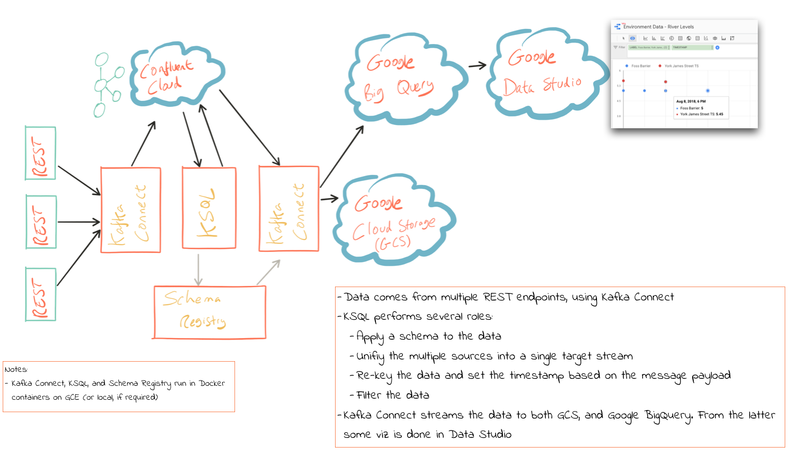
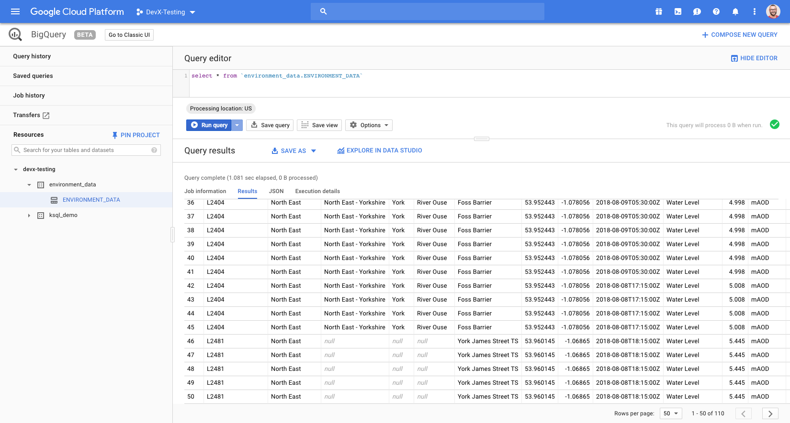
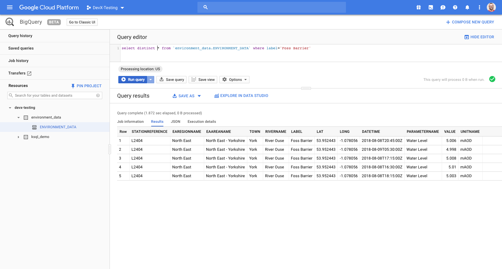
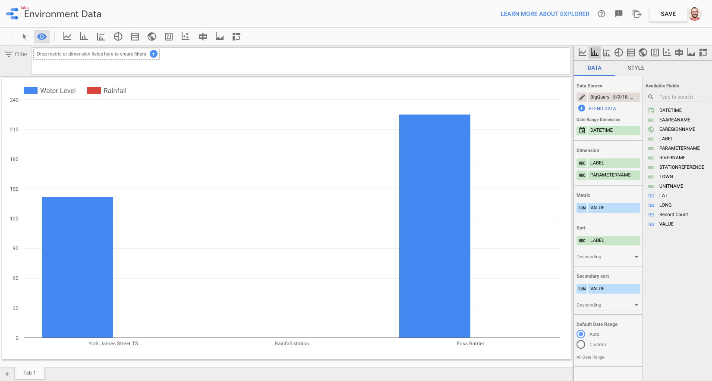

= Scenario 1 - REST source, KSQL to wrangle, stream to GCS & GBQ, viz with GDS

:toc:

== Overview

* Data comes from multiple REST endpoints, using *Kafka Connect*.
** In real life this could be the same system, with multiple instances, perhaps geographically distributed. 
* KSQL performs several roles: 
** Apply a schema to the data
** Serialise it to Avro
** Unify the multiple sources into a single target stream (since the data model is the same)
** Re-key the data
** Set the timestamp based on a message payload field
** Filter the data
* *Kafka Connect* streams the data to both GCS, and Google BigQuery. 
** From GBQ viz is done in Data Studio

_Mandatory credit: this uses Environment Agency rainfall data from the real-time data API (Beta)_

== Set up data source

Create the target topic in CCloud: 

[source,bash]
----
ccloud topic create flood-monitoring-L2404
ccloud topic create flood-monitoring-L2481
ccloud topic create flood-monitoring-059793
----

POST the connector config: 

[source,bash]
----
include::env-data/connect_source.sh[]
----

Check status: 

[source,bash]
----
$ curl -s "http://$CONNECT_HOST_SOURCE:8083/connectors"| jq '.[]'| xargs -I{connector_name} curl -s "http://$CONNECT_HOST_SOURCE:8083/connectors/"{connector_name}"/status"| jq -c -M '[.name,.connector.state,.tasks[].state]|join(":|:")'| column -s : -t| sed 's/\"//g'| sort
source_rest_flood-monitoring-L2404  |  RUNNING  |  RUNNING
----

Check data from KSQL: 

[source,bash]
----
ksql> print 'flood-monitoring-L2404' from beginning;
Format:STRING
8/8/18 2:42:14 PM UTC , NULL , { \x0A  "@context" : "http://environment.data.gov.uk/flood-monitoring/meta/context.jsonld" ,\x0A  "meta" : { \x0A    "publisher" : "Environment Agency" ,\x0A    "licence" : "http://www.nationalarchives.gov.uk/doc/open-government-licence/version/3/" ,\x0A    "documentation" : "http://environment.data.gov.uk/flood-monitoring/doc/reference" ,\x0A    "version" : "0.9" ,\x0A    "comment" : "Status: Beta service" ,\x0A    "hasFormat" : [ "http://environment.data.gov.uk/flood-monitoring/id/stations/L2404.rdf", [...]
----

== Wrangle me some data

=== Define source schema 

[source,sql]
----
include::env-data/define_source_data.sql[]
----

[source,sql]
----
ksql> show streams;

 Stream Name             | Kafka Topic             | Format
------------------------------------------------------------
 FLOOD_MONITORING_L2404  | flood-monitoring-L2404  | JSON
 FLOOD_MONITORING_059793 | flood-monitoring-059793 | JSON
 FLOOD_MONITORING_L2481  | flood-monitoring-L2481  | JSON
------------------------------------------------------------
----

=== Examine the data

[source,sql]
----
include::env-data/query_source_data.sql[]
----

Output: 

[source,sql]
----
L2481 | North East | null | null | null | York James Street TS | 53.960145 | -1.06865 | 2018-08-08T16:00:00Z | Water Level | 5.496 | mAOD
L2481 | North East | null | null | null | York James Street TS | 53.960145 | -1.06865 | 2018-08-08T16:00:00Z | Water Level | 5.496 | mAOD
…
L2404 | North East | North East - Yorkshire | York | River Ouse | Foss Barrier | 53.952443 | -1.078056 | 2018-08-08T16:30:00Z | Water Level | 5.01 | mAOD
L2404 | North East | North East - Yorkshire | York | River Ouse | Foss Barrier | 53.952443 | -1.078056 | 2018-08-08T16:30:00Z | Water Level | 5.01 | mAOD
…
059793 | North East | null | null | null | Rainfall station | 53.966652 | -1.115089 | 2018-08-08T05:30:00Z | Rainfall | 0.0 | mm
059793 | North East | null | null | null | Rainfall station | 53.966652 | -1.115089 | 2018-08-08T05:30:00Z | Rainfall | 0.0 | mm
----

=== Apply schema to the data, unify streams

[source,sql]
----
include::env-data/apply_schema__unify_streams.sql[]
----

Use `DESCRIBE EXTENDED` to examine the new stream: 

* Check the serialisation used, and the target topic: 
+
[source,sql]
----
ksql>  ENVIRONMENT_DATA;

Name                 : ENVIRONMENT_DATA
Type                 : STREAM
Key field            :
Key format           : STRING
Timestamp field      : Not set - using <ROWTIME>
Value format         : AVRO
Kafka topic          : ENVIRONMENT_DATA (partitions: 4, replication: 1)
----

* Verify the new schema: 
+
[source,sql]
----
 Field            | Type
----------------------------------------------
 ROWTIME          | BIGINT           (system)
 ROWKEY           | VARCHAR(STRING)  (system)
 STATIONREFERENCE | VARCHAR(STRING)
 EAREGIONNAME     | VARCHAR(STRING)
 EAAREANAME       | VARCHAR(STRING)
 TOWN             | VARCHAR(STRING)
 RIVERNAME        | VARCHAR(STRING)
 LABEL            | VARCHAR(STRING)
 LAT              | DOUBLE
 LONG             | DOUBLE
 DATETIME         | VARCHAR(STRING)
 PARAMETERNAME    | VARCHAR(STRING)
 VALUE            | DOUBLE
 UNITNAME         | VARCHAR(STRING)
----------------------------------------------
----

* Note that multiple queries now write to the same stream: 
[source,sql]
----
Queries that write into this STREAM
-----------------------------------
CSAS_ENVIRONMENT_DATA_0 : CREATE STREAM ENVIRONMENT_DATA WITH         (VALUE_FORMAT='AVRO') AS SELECT  items->stationreference AS stationreference,         items->earegionname AS earegionname,         items->eaareaname AS eaareaname,         items->town AS town,         items->RiverName AS RiverName,         items->label AS label,         items->lat AS lat, items->long AS long,         items->measures->latestreading->datetime AS datetime,         items->measures->parameterName AS parameterName,         items->measures->latestreading->value AS value,         items->measures->unitname AS unitname  FROM   flood_monitoring_L2404 ;
InsertQuery_1 : INSERT INTO ENVIRONMENT_DATA SELECT  items->stationreference AS stationreference,         items->earegionname AS earegionname,         items->eaareaname AS eaareaname,         items->town AS town,         items->RiverName AS RiverName,         items->label AS label,         items->lat AS lat, items->long AS long,         items->measures->latestreading->datetime AS datetime,         items->measures->parameterName AS parameterName,         items->measures->latestreading->value AS value,         items->measures->unitname AS unitname  FROM   flood_monitoring_L2481 ;
InsertQuery_2 : INSERT INTO ENVIRONMENT_DATA SELECT  items->stationreference AS stationreference,         items->earegionname AS earegionname,         items->eaareaname AS eaareaname,         items->town AS town,         items->RiverName AS RiverName,         items->label AS label,         items->lat AS lat, items->long AS long,         items->measures->latestreading->datetime AS datetime,         items->measures->parameterName AS parameterName,         items->measures->latestreading->value AS value,         items->measures->unitname AS unitname  FROM   flood_monitoring_059793 ;

For query topology and execution plan please run: EXPLAIN <QueryId>
----

* Verify that messages are flowing successfully: 
[source,sql]
----
Local runtime statistics
------------------------
messages-per-sec:      0.25   total-messages:        82     last-message: 8/9/18 11:28:06 AM UTC
 failed-messages:         0 failed-messages-per-sec:         0      last-failed:       n/a
(Statistics of the local KSQL server interaction with the Kafka topic ENVIRONMENT_DATA)
ksql>
----

=== Repartition data to apply a key

[source,sql]
----
include::env-data/repartition.sql
----

== Stream data to target datastore(s)

=== Stream to GCS

Requires the `kafka-connect-gcs` connector, which can be installed from http://hub.confluent.io[Confluent Hub].

Make the target bucket: 

[source,bash]
----
gsutil mb gs://rmoff-environment-data
----

Create the connector: 

[source,bash]
----
include::env-data/connect_sink_gcs.sh
----

N.B. `flush.size` is how many messages will be collected before Kafka Connect writes to storage. If it's too high, you'll not see any data in your target object store. If it's too low, your performance is gonna suck…

Check data made it: 

[source,bash]
----
$ gsutil ls gs://rmoff-environment-data/topics/ENVIRONMENT_DATA/
gs://rmoff-environment-data/topics/ENVIRONMENT_DATA/partition=0/
gs://rmoff-environment-data/topics/ENVIRONMENT_DATA/partition=1/
gs://rmoff-environment-data/topics/ENVIRONMENT_DATA/partition=2/
gs://rmoff-environment-data/topics/ENVIRONMENT_DATA/partition=3/
----

View the data: 

[source,bash]
----
$ gsutil cp gs://rmoff-environment-data/topics/ENVIRONMENT_DATA/partition=0/ENVIRONMENT_DATA+0+0000000000.json /tmp/
Copying gs://rmoff-environment-data/topics/ENVIRONMENT_DATA/partition=0/ENVIRONMENT_DATA+0+0000000000.json...
- [1 files][  4.3 KiB/  4.3 KiB]
Operation completed over 1 objects/4.3 KiB.
[~/g/n/gcp-pipeline] Robin@asgard02.local  (master|✚2…)
$ cat /tmp/ENVIRONMENT_DATA+0+0000000000.json
{"STATIONREFERENCE":"L2404","EAREGIONNAME":"North East","EAAREANAME":"North East - Yorkshire","TOWN":"York","RIVERNAME":"River Ouse","LABEL":"Foss Barrier","LAT":53.952443,"LONG":-1.078056,"DATETIME":"2018-08-08T16:30:00Z","PARAMETERNAME":"Water Level","VALUE":5.01,"UNITNAME":"mAOD"}
----

=== Stream to Google BigQuery

Requires the `kafka-connect-bigquery` connector, which can be installed from http://hub.confluent.io[Confluent Hub].

Create the target dataset

[source,bash]
----
$ bq mk environment_data
Dataset 'GCP_PROJECT_NAME:environment_data' successfully created.
----

Create the connector

[source,bash]
----
include::env-data/connect_sink_gbq.sh
----

=== Google Data Studio

image::images/gds_env-data-02.png[]

== Appendix

=== TODO: Set the timestamp correctly for messages

Messages have the timestamp of the time at which they were ingested by Kafka Connect. The actual timestamp to use for analysis is the `DATETIME` value within the message. This can be assigned as part of the `WITH` clause of `CREATE STREAM…AS SELECT`: 

[source,sql]
----
CREATE STREAM ENVIRONMENT_DATA_WITH_TS \
            WITH (TIMESTAMP='DATETIME', \
                  TIMESTAMP_FORMAT='yyyy-MM-dd''T''HH:mm:ssX') \
AS \
SELECT * FROM   ENVIRONMENT_DATA ;
----

BLOCKED BY https://github.com/confluentinc/ksql/issues/1439

=== Environment Data API notes

API reference: 

* http://environment.data.gov.uk/flood-monitoring/doc/reference
* http://environment.data.gov.uk/flood-monitoring/doc/rainfall

Example REST calls: 

* Rainfall stations within 2km of York
** http://environment.data.gov.uk/flood-monitoring/id/stations?parameter=rainfall&lat=53.961517&long=-1.088830&dist=2

* River Level stations within 2km of York
** http://environment.data.gov.uk/flood-monitoring/id/stations?parameter=level&lat=53.961517&long=-1.088830&dist=2

* All measurement stations (no reading data):	
** http://environment.data.gov.uk/flood-monitoring/id/stations
* Stations on River Wharfe: 
** http://environment.data.gov.uk/flood-monitoring/id/stations?riverName=River%20Wharfe
* Ilkley station current reading: 
** https://environment.data.gov.uk/flood-monitoring/id/stations/F1902 
*** (n.b. has a broken `latestReading` which breaks parsing the record)
* York station (1) current reading: 
** https://environment.data.gov.uk/flood-monitoring/id/stations/L2481
* York station (2) current reading: 
** https://environment.data.gov.uk/flood-monitoring/id/stations/L2404
* All readings for all measures from across all the stations (i.e. historical too):	
** http://environment.data.gov.uk/flood-monitoring/data/readings
* All readings for measures from a particular station:	`{root}/id/stations/{id}/readings` 
** e.g. https://environment.data.gov.uk/flood-monitoring/id/stations/059793/readings 

==== Parsing with KSQL 

Many of the stations return just a single reading, which can be parsed with : 

[source,sql]
----
-- Malham
CREATE STREAM flood_monitoring_073422 \
    (meta STRUCT<publisher VARCHAR, \
                 comment VARCHAR>, \
     items STRUCT<eaRegionName VARCHAR, \
                  gridReference VARCHAR, \
                  lat DOUBLE, \
                  long DOUBLE, \
                  measures STRUCT<label VARCHAR, \
                        latestReading STRUCT<\
                            dateTime VARCHAR, \
                            value DOUBLE>,\
                        parameterName VARCHAR, \
                        unitName VARCHAR>, \
                  stationReference VARCHAR,\
                  label VARCHAR> \
    ) WITH (KAFKA_TOPIC='flood-monitoring-073422',VALUE_FORMAT='JSON');

select items->stationreference, \
       items->earegionname, \
       items->lat, items->long, \
       items->measures->latestreading->datetime,\
       items->measures->parameterName, \
       items->measures->latestreading->value, \
       items->measures->unitname \
from   flood_monitoring_073422 ;

73422 | North East | 54.100116 | -2.164345 | 2018-08-03T10:00:00Z | Rainfall | 0.0 | mm
73422 | North East | 54.100116 | -2.164345 | 2018-08-03T10:00:00Z | Rainfall | 0.0 | mm
73422 | North East | 54.100116 | -2.164345 | 2018-08-03T10:00:00Z | Rainfall | 0.0 | mm
----

Others have multiple readings, which require an `ARRAY` to reference: 

[source,sql]
----

CREATE STREAM flood_monitoring_3680 \
    (meta STRUCT<publisher VARCHAR, \
                 comment VARCHAR>, \
     items STRUCT<eaRegionName VARCHAR, \
                  gridReference VARCHAR, \
                  lat DOUBLE, \
                  long DOUBLE, \
                  measures ARRAY<STRUCT<label VARCHAR, \
                        latestReading STRUCT<\
                            dateTime VARCHAR, \
                            value DOUBLE>,\
                        parameterName VARCHAR, \
                        unitName VARCHAR>>, \
                  stationReference VARCHAR> \
    ) WITH (KAFKA_TOPIC='flood-monitoring-3680',VALUE_FORMAT='JSON');

select items->stationreference, \
       items->earegionname, \
       items->long, items->lat, \
       items->measures[0]->parameterName, \
       items->measures[0]->latestreading->datetime,\
       items->measures[0]->latestreading->value, \
       items->measures[0]->unitname \
from   flood_monitoring_3680 ;

3680 | Midland | -0.995167 | 52.73152 | Rainfall | 2018-08-03T04:00:00Z | 0.0 | mm
3680 | Midland | -0.995167 | 52.73152 | Rainfall | 2018-08-03T04:00:00Z | 0.0 | mm
3680 | Midland | -0.995167 | 52.73152 | Rainfall | 2018-08-03T04:00:00Z | 0.0 | mm
3680 | Midland | -0.995167 | 52.73152 | Rainfall | 2018-08-03T04:00:00Z | 0.0 | mm

select items->stationreference, \
       items->earegionname, \
       items->long, items->lat, \
       items->measures[1]->parameterName, \
       items->measures[1]->latestreading->datetime,\
       items->measures[1]->latestreading->value, \
       items->measures[1]->unitname \
from   flood_monitoring_3680 ;

3680 | Midland | -0.995167 | 52.73152 | Temperature | 2018-08-03T04:00:00Z | 13.5 | deg C
3680 | Midland | -0.995167 | 52.73152 | Temperature | 2018-08-03T13:15:00Z | 26.4 | deg C
----

=== Other REST data sources to play with

==== Current datetime (useful smoke test)

[source,bash]
----
ccloud topic create current-datetime
----

[source,bash]
----
# Current time
curl -i -X POST -H "Accept:application/json" \
          -H  "Content-Type:application/json" http://localhost:8083/connectors/ \
          -d '{
    "name": "source_rest_current-datetime",
    "config": {
      "key.converter":"org.apache.kafka.connect.storage.StringConverter",
      "value.converter":"org.apache.kafka.connect.storage.StringConverter",
      "connector.class": "com.tm.kafka.connect.rest.RestSourceConnector",
      "tasks.max": "1",
      "rest.source.poll.interval.ms": "60000",
      "rest.source.method": "GET",
      "rest.source.url": "http://worldclockapi.com/api/json/utc/now",
      "rest.source.payload.converter.class": "com.tm.kafka.connect.rest.converter.StringPayloadConverter",
      "rest.source.properties": "Content-Type:application/json,Accept::application/json",
      "rest.source.topic.selector": "com.tm.kafka.connect.rest.selector.SimpleTopicSelector",
      "rest.source.destination.topics": "current-datetime"
    }
  }'
----

Check status: 

[source,bash]
----
$ curl -s "http://localhost:8083/connectors"| jq '.[]'| xargs -I{connector_name} curl -s "http://localhost:8083/connectors/"{connector_name}"/status"| jq -c -M '[.name,.connector.state,.tasks[].state]|join(":|:")'| column -s : -t| sed 's/\"//g'| sort
source_rest_current-datetime        |  RUNNING  |  RUNNING
source_rest_flood-monitoring-L2404  |  RUNNING  |  RUNNING
----

Check the data: 

[source,bash]
----
"2018-08-07T09:55Z"
"2018-08-07T09:56Z"
----

==== Weather 

https://openweathermap.org/current#one

[source,bash]
----
#!/bin/bash

curl -i -X POST -H "Accept:application/json" \
          -H  "Content-Type:application/json" http://localhost:8083/connectors/ \
          -d '{
    "name": "source-rest-weather_york",
    "config": {
      "key.converter":"org.apache.kafka.connect.storage.StringConverter",
      "value.converter":"org.apache.kafka.connect.storage.StringConverter",
      "connector.class": "com.tm.kafka.connect.rest.RestSourceConnector",
      "tasks.max": "1",
      "rest.source.poll.interval.ms": "900000",
      "rest.source.method": "GET",
      "rest.source.url": "https://api.openweathermap.org/data/2.5/weather?q=York,uk&appid=5139ef0dd688cdb7d864f4e118445aa3",
      "rest.source.payload.converter.class": "com.tm.kafka.connect.rest.converter.StringPayloadConverter",
      "rest.source.properties": "Content-Type:application/json,Accept::application/json",
      "rest.source.topic.selector": "com.tm.kafka.connect.rest.selector.SimpleTopicSelector",
      "rest.source.destination.topics": "york-weather"
    }
  }'
----

[source,sql]
----
ksql> create stream weather (weather array<struct<icon varchar ,description varchar, main varchar,id int>>,main struct<temp double,pressure bigint, humidity bigint>, visibility bigint, wind struct<speed double,deg int>,name varchar) with (kafka_topic='london-weather',value_format='json');

 Message
----------------
 Stream created
----------------
ksql> select name,weather[0], main->temp, main->temp - 273.15 as temp_c from weather;
London | {ICON=04n, DESCRIPTION=overcast clouds, MAIN=Clouds, ID=804} | 291.64 | 18.49000000000001
London | {ICON=04n, DESCRIPTION=overcast clouds, MAIN=Clouds, ID=804} | 291.63 | 18.480000000000018
London | {ICON=04n, DESCRIPTION=overcast clouds, MAIN=Clouds, ID=804} | 291.69 | 18.54000000000002
^CQuery terminated
ksql> select name,weather[0]->description, main->temp, main->temp - 273.15 as temp_c from weather;
London | overcast clouds | 291.64 | 18.49000000000001
London | overcast clouds | 291.63 | 18.480000000000018
London | overcast clouds | 291.69 | 18.54000000000002

----

==== Stock details

From https://iextrading.com/developer/

[source,bash]
----
ccloud topic create iex-stock-aapl-quote
ccloud topic create iex-stock-aapl-company
----

[source,bash]
----
# IEX APPL quote
# https://iextrading.com/developer/
curl -i -X POST -H "Accept:application/json" -H  "Content-Type:application/json" http://localhost:8083/connectors/ -d '{
    "name": "source_rest_iex-stock-aapl-quote",
    "config": {"key.converter":"org.apache.kafka.connect.storage.StringConverter","value.converter":"org.apache.kafka.connect.storage.StringConverter","connector.class": "com.tm.kafka.connect.rest.RestSourceConnector","tasks.max": "1", "rest.source.method": "GET", "rest.source.payload.converter.class": "com.tm.kafka.connect.rest.converter.StringPayloadConverter", "rest.source.properties": "Content-Type:application/json,Accept::application/json", "rest.source.topic.selector": "com.tm.kafka.connect.rest.selector.SimpleTopicSelector", 
      "rest.source.url": "https://api.iextrading.com/1.0/stock/aapl/quote",
      "rest.source.poll.interval.ms": "60000",
      "rest.source.destination.topics": "iex-stock-aapl-quote"
    }}'
# IEX APPL company
# https://iextrading.com/developer/
curl -i -X POST -H "Accept:application/json" -H  "Content-Type:application/json" http://localhost:8083/connectors/ -d '{
    "name": "source_rest_iex-stock-aapl-company",
    "config": {"key.converter":"org.apache.kafka.connect.storage.StringConverter","value.converter":"org.apache.kafka.connect.storage.StringConverter","connector.class": "com.tm.kafka.connect.rest.RestSourceConnector","tasks.max": "1", "rest.source.method": "GET", "rest.source.payload.converter.class": "com.tm.kafka.connect.rest.converter.StringPayloadConverter", "rest.source.properties": "Content-Type:application/json,Accept::application/json", "rest.source.topic.selector": "com.tm.kafka.connect.rest.selector.SimpleTopicSelector", 
      "rest.source.url": "https://api.iextrading.com/1.0/stock/aapl/company",
      "rest.source.poll.interval.ms": "600000",
      "rest.source.destination.topics": "iex-stock-aapl-company"
    }}'
----

Check the data: 

[source,bash]
----
$ ccloud consume --from-beginning --topic iex-stock-aapl-quote
{"symbol":"AAPL","companyName":"Apple Inc.","primaryExchange":"Nasdaq Global Select","sector":"Technology","calculationPrice":"close","open":207.93,"openTime":1533562200581,"close":209.07,"closeTime":1533585600168,"high":209.25,"low":207.07,"latestPrice":209.07,"latestSource":"Close","latestTime":"August 6, 2018","latestUpdate":1533585600168,"latestVolume":25390079,"iexRealtimePrice":null,"iexRealtimeSize":null,"iexLastUpdated":null,"delayedPrice":209.06,"delayedPriceTime":1533585600229,"extendedPrice":209.02,"extendedChange":-0.05,"extendedChangePercent":-0.00024,"extendedPriceTime":1533589186272,"previousClose":207.99,"change":1.08,"changePercent":0.00519,"iexMarketPercent":null,"iexVolume":null,"avgTotalVolume":23922439,"iexBidPrice":null,"iexBidSize":null,"iexAskPrice":null,"iexAskSize":null,"marketCap":1009792628820,"peRatio":20.18,"week52High":209.25,"week52Low":149.16,"ytdChange":0.22852624924298495}
----

Check the data: 

[source,bash]
----
$ ccloud consume --from-beginning --topic iex-stock-aapl-company
{"symbol":"AAPL","companyName":"Apple Inc.","exchange":"Nasdaq Global Select","industry":"Computer Hardware","website":"http://www.apple.com","description":"Apple Inc is designs, manufactures and markets mobile communication and media devices and personal computers, and sells a variety of related software, services, accessories, networking solutions and third-party digital content and applications.","CEO":"Timothy D. Cook","issueType":"cs","sector":"Technology","tags":["Technology","Consumer Electronics","Computer Hardware"]}
----
