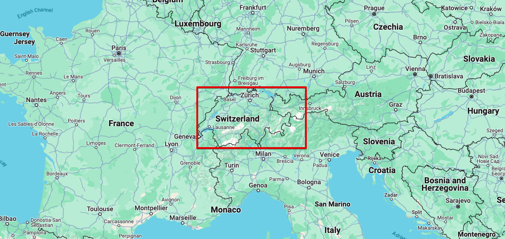
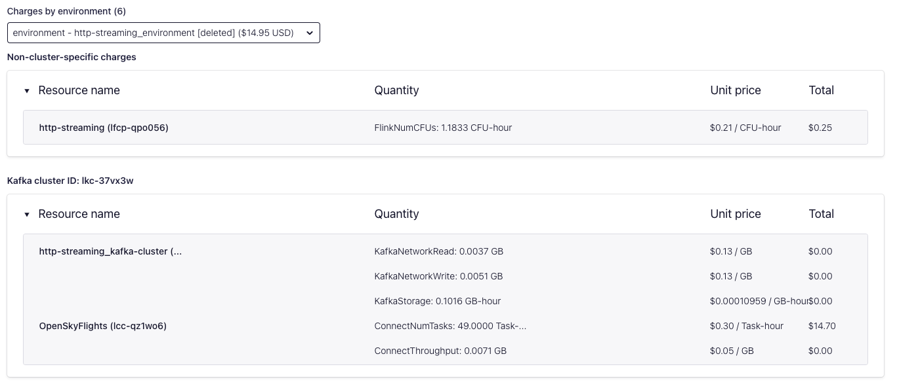
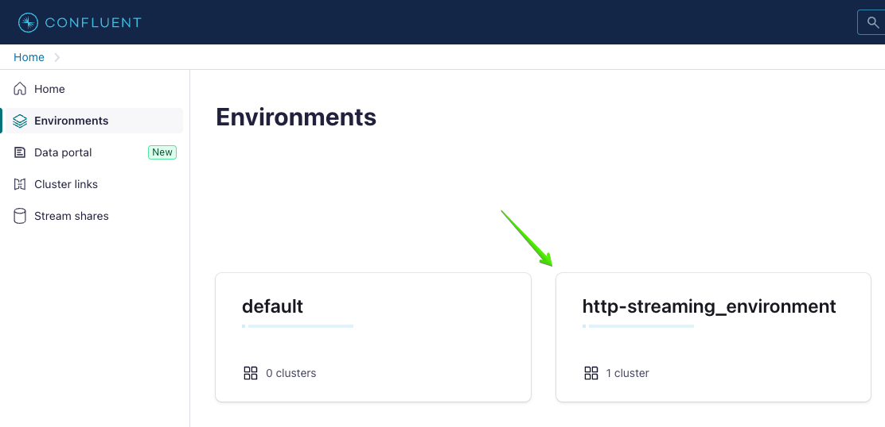
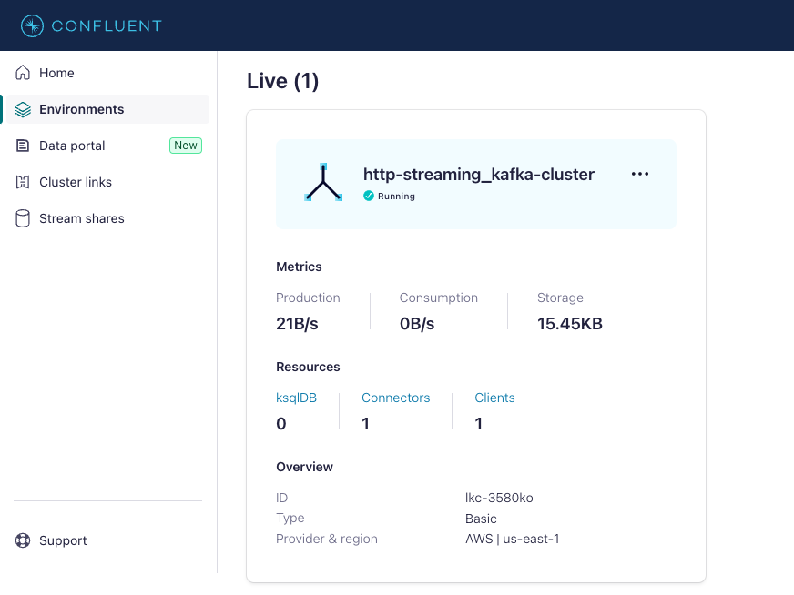
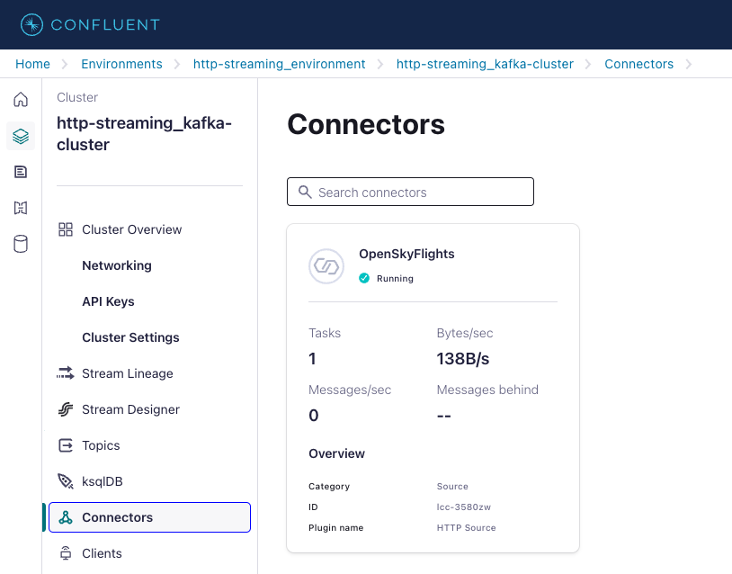
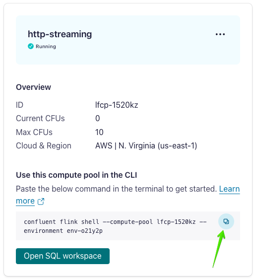

# REST API-based data streams

HTTP-based REST APIs are alive and well in the data ecosystem, but they don't always lend themselves streaming applications, especially in the case where a REST API returns state as of a point in time. Such an API doesn't naturally support stateful streaming applications, so, as developers, we need a way to bridge the gap between REST APIs and streaming.

This data integration use case demonstrates how to turn an HTTP-based REST API into a clean, governed, sharable, replayable data stream in Kafka. Once in Kafka, the data can be used to power streaming analytics or other applications that require more than a point-in-time snapshot of state.

# Why REST APIs for data streaming?

In the space of APIs for consuming up-to-date data (say, events or state available within an hour of occurring) many API paradigms exist, for example:

1. File- or object-based, e.g., S3 access
2. Database access, e.g., direct Snowflake access
3. Decoupled client-server APIs, e.g., REST APIs, gRPC, webhooks, and streaming APIs. In this context, "decoupled" means that the client usually communicates with the server over a language-agnostic standard network protocol like HTTP/S, usually receives data in a standard format like JSON, and, in contrast to direct database access, typically doesn't know what data store backs the API. 

Of the above styles, [more often than not](https://rapidapi.com/learn/trends/2022-state-of-apis-what-developers-are-saying) API developers settle on HTTP-based REST APIs for one or more of the following reasons:

1. Popularity: more developers know how to use REST APIs and are using them in production compared to other API technologies. E.g., Rapid API's [2022 State of APIs](https://rapidapi.com/learn/trends/2022-state-of-apis-what-developers-are-saying) reports 69.3% of survey respondents using REST APIs in production, well above the percentage using alternatives like gRPC (8.2%), GraphQL (18.6%), or webhooks (34.6%).
2. Scale: REST's caching and statelessness properties provide a clear path to scale and client performance optimization. REST naturally lends itself to supporting many clients issuing many concurrent requests.
3. Maturity: 20+ years of REST API adoption have resulted in a rich tooling ecosystem
   * For API development & deployment. E.g., [OpenAPI](https://swagger.io/specification/) and its [tool](https://github.com/OpenAPITools/openapi-generator) for generating client bindings, API management solutions like [Kong Konnect](https://konghq.com/products/kong-konnect) to handle security and rate limiting.
   * For API consumption. E.g., [Postman](https://www.postman.com/) for learning and testing APIs, and mature client libraries like [Python Requests](https://requests.readthedocs.io/en/latest/) for building applications that leverage REST APIs.
4. Verb flexibility: while we are talking about _reading_ up-to-date data in this demo, many applications also need to create, update, and delete data too! HTTP-based REST services can use the same tools to develop and deploy all of the verbs. Some of the API patterns above like streaming are really only geared toward reading. While some mature engineering organizations offer APIs that span API styles (e.g., X exposes [streaming](https://developer.twitter.com/en/docs/twitter-api/enterprise/compliance-firehose-api/overview) and [REST](https://developer.twitter.com/en/docs/twitter-api/users/lookup/introduction) APIs), doing so comes at higher cost.

Regardless of why data is exposed via REST API, the bottom line is:

### As application developers, we don't always get to choose how to consume data. We have to use what API providers offer, and, more often than not, they give us REST APIs.


# Demo

We'll use the [OpenSky Network's](https://opensky-network.org/) live API to demonstrate the REST-to-streaming use case. The API exposes live information about aircraft in a way that is typical of many REST APIs:

* JSON-based REST API (there are also Python and Java clients exposing the REST API)
* The data returned is state rather than discrete events. For example, the [State Vectors](https://openskynetwork.github.io/opensky-api/rest.html#all-state-vectors) method that this demo builds on returns aircraft state (e.g., location, altitude, and speed) as of the time of the request.
* The data needs a bit of massaging and cleaning. In the case of this demo, adding schema and cleaning string fields are a couple of the ways that the data is shaped and cleaned on its way to becoming a Kafka-based stream.

## Prerequisites

The following steps and tools are required to run this demo:

* Clone this repo if you haven't already:
  ```bash
  git clone https://github.com/confluentinc/demo-scene
  ```
* A Confluent Cloud account. [Sign up](https://www.confluent.io/confluent-cloud/tryfree) for a free trial if you don't already have one.
* The Confluent CLI. Refer to the installation instructions [here](https://docs.confluent.io/confluent-cli/current/install.html).
* The `confluent-flink-quickstart` CLI plugin. This plugin spins up the Kafka and Flink resources in Confluent Cloud that are needed for this demo. Install the plugin by running:
  ```bash
  confluent plugin install confluent-flink-quickstart
  ```
* Review the OpenSky Network's [terms of use](https://opensky-network.org/about/terms-of-use).

## Provision Confluent Cloud infrastructure

We will use the Confluent CLI to provision the Confluent Cloud resources used in this demo.

First, login via the CLI

```bash
confluent login --prompt --save
```

Next, run the following command to spin up a Kafka cluster and Flink compute pool in Confluent Cloud:

```bash
confluent flink quickstart \
    --name http-streaming \
    --max-cfu 10 \
    --region us-east-1 \
    --cloud aws
```

The command will run for about a minute and drop you into an interactive Flink shell.

Once you're in the Flink shell, run your first Flink SQL statement to see what Flink SQL tables exist. In the Flink shell:

```sql
show tables;
```

Since we don't have any data in the system yet, you will see the message:

```noformat
The server returned empty rows for this statement.
```

Don't worry! This is expected since we haven't produced any data into the system yet.

## Launch HTTP Source Connector

Run the `http-streaming/scripts/create-connector.sh` script included in this repository to provision an [HTTP Source Connector](https://docs.confluent.io/cloud/current/connectors/cc-http-source.html) in Confluent Cloud. The script will complete in a few seconds, and then the resulting connector will need a minute or so to be provisioned.

Note the following connector configurations in the script:

1. We specify that we are polling the OpenSky Network's [All State Vectors](https://openskynetwork.github.io/opensky-api/rest.html#all-state-vectors) method in the `url` property:
   ```noformat
   "url": "https://opensky-network.org/api/states/all"
   ```

2. For the purposes of demo, we limit the flight data that we are interested in to a small bounding box containing Switzerland. The box is defined by a point in Boussy, France on the bottom left and Aitrang, Germany on the top right:
   ```noformat
   "http.request.parameters": "lamin=45.8389&lomin=5.9962&lamax=47.8229&lomax=10.5226"
   ```
   Here is a sketch of the box defined by these points:

   

3. The `request.interval.ms` property specifies how often we should poll the API:
   ```noformat
   "request.interval.ms": "60000"
   ```
   Let's take a brief sidetrack on the polling interval to pick for a use case like this. For demo purposes, we poll every minute without giving the decision too much thought since we'll stop the connector once we're done. In choosing how often to scrape in a production setting, though, there are a few points to consider:

   1. The REST API's rate limit. E.g., in the OpenSky case, the documentation [here](https://openskynetwork.github.io/opensky-api/rest.html#limitations) specifies that anonymous users get 400 API credits per day, and users get 4000 credits per day. The credit cost of an API call to the `/states/all` endpoint depends on the size of the area for which states are being requested. In our case, we are polling `(47.8229 - 45.8389) * (10.5226 - 5.9962) = ~9` square degrees, so each API call costs 1 credit. If you were an OpenSky user getting 4,000 credits per day, you would be able to poll as frequently as once every ~22 seconds while remaining under the rate limit (86,400 seconds per day, divided by 4,000, yields an API call every 21.6 seconds to exactly use up 4,000 credits in a day).
   2. Understand data provider time granularity. E.g., if you are an anonymous OpenSky user, [see](https://openskynetwork.github.io/opensky-api/rest.html#limitiations-for-anonymous-unauthenticated-users) that you can only retrieve data with a time resolution of 10 seconds. In other words, there would be no point in polling more frequently than every 10 seconds. This documented time resolution lower bounds the polling intervals we should consider.
   3. Infrastructure cost, in particular, understand the variable costs that will fluctuate based on how often you poll (e.g., Kafka cluster and connector network I/O, data storage). In the case of Confluent Cloud, you can [estimate your cost](https://www.confluent.io/confluent-cloud/pricing/) and also validate the exact cost by running the connector for a few days and visiting the `Billing & payment` page in the Confluent Cloud Console. By isolating the use case to an environment, you can view all infrastructure costs tied to that environment, e.g.:
      
   4. Understand the impact of polling frequency on your use case, the requirements, and the space where trade offs are on the table. Any "live" or "real-time" apps would likely benefit from frequent polling, but it's not always true that more data more often is better. If you were building a model to predict flight delays based on aircraft position, perhaps polling every 5 minutes rather than every 30 seconds would be more than sufficient and be a sensible way to trade off data freshness for cost savings.

## Validate connector

Before we explore the flight data, check that the connector is up and running. In the [Confluent Cloud Console](https://confluent.cloud/), select `Environments` in the lefthand navigation, and click the `http-streaming_environment` environment:



Next, click the `http-streaming_kafka-cluster` tile to go to the cluster detail page:



Finally, select `Connectors` in the lefthand navigation, and validate that the `OpenSkyFlights` connector is `Running`:



## Explore raw data

Now let's explore the data populated by the connector in more detail. We'll use Flink SQL for this. Return to the Flink SQL shell that the `confluent-flink-quickstart` plugin opened for you. If you closed out of the shell and need to reopen a session, you can copy the command to get back to it from the Confluent Cloud Console:
* Select the `http-streaming_environment` environment
* Click the `Flink` tab
* At the bottom of the `http-streaming` compute pool tab is a command that you can copy to start the Flink shell:
  

In the Flink shell, first run the same `SHOW TABLES;` command that you ran previously. This time you can see that there is now an `all_flights` table [automatically available](https://docs.confluent.io/cloud/current/flink/index.html#metadata-mapping-between-ak-cluster-topics-schemas-and-af):

```noformat
+-------------+
| table name  |
+-------------+
| all_flights |
+-------------+
```

Let's describe the table:

```sql
DESCRIBE all_flights;
```

This shows three columns:

```noformat
+-------------+-------------------------------+----------+------------+
| Column Name |           Data Type           | Nullable |   Extras   |
+-------------+-------------------------------+----------+------------+
| key         | BYTES                         | NULL     | BUCKET KEY |
| time        | INT                           | NOT NULL |            |
| states      | ARRAY<ARRAY<STRING> NOT NULL> | NOT NULL |            |
+-------------+-------------------------------+----------+------------+
```

And query the table:

```sql
SELECT * FROM all_flights;
```

An example row looks like this:

```noformat
key  time       states                                                                                                                                                                                                                                                     ║
NULL 1710358279 [[4b1803, SWR736  , Switzerland, 1710358141, 1710358237, 8.5569, 47.4543, 373.38, true, 0, 185.62, NULL, NULL, NULL, 1000, false, 0], ...]
```

It's worth noting that this reflects the data as it's returned via API. Calling the API directly:

```bash
curl -s "https://opensky-network.org/api/states/all?lamin=45.8389&lomin=5.9962&lamax=47.8229&lomax=10.5226"
```

We can see the same array of arrays containing codes and numbers. The `states` field doesn't have a self-documenting schema and the data isn't as clean as it could be, e.g., the second column in each inner array is right-padded with spaces:

```format:
{
  "time":1710361210,
  "states":[
    ["4b1817","SWR4TH  ","Switzerland",1710361210,1710361210,8.1462,47.3854,3931.92,false,188.81,233.75,9.75,null,4038.6,"1000",false,0],
    ["4b1806","SWR6MZ  ","Switzerland",1710361210,1710361210,8.5502,47.4551,null,true,8.23,149.06,null,null,null,"1000",false,0],
    ["4b1620","SWR829  ","Switzerland",1710361210,1710361210,8.5914,47.4551,487.68,false,75.05,276.3,-4.55,null,594.36,"1000",false,0],
    ...
  ]
}
```
In the next section we will get this data into a more usable format.

## Shape and cleanse data with Flink

Before we can shape and cleanse the data, let's list the issues that we need to address:

1. For each row in the `all_flights` table, the `states` column represents all aircraft in the given bounding box. We should convert this so that each aircraft gets its own record.
2. Rather than have a single array column whose values require [documentation](https://openskynetwork.github.io/opensky-api/rest.html#response) to understand, let's introduce a more intuitive schema. For example, instead of needing to know that the second member of each array is the aircraft's call sign, let's have an independent column called `callsign` for this field.
3. Let's trim any whitespace padding from the values. E.g., the aforementioned `callsign` field.

We'll start by defining the table schema. Run this statement in the Flink SQL interactive shell:

```sql
CREATE TABLE all_flights_cleansed (
  poll_timestamp TIMESTAMP_LTZ(0),
  icao24 STRING,
  callsign STRING,
  origin_country STRING,
  event_timestamp TIMESTAMP_LTZ(0),
  longitude DECIMAL,
  latitude DECIMAL,
  barometric_altitude DECIMAL,
  on_ground BOOLEAN,
  velocity_m_per_s DECIMAL
);
```

Now, run the following insert from select statement to populate the table:

```sql
INSERT INTO all_flights_cleansed
    SELECT TO_TIMESTAMP_LTZ(`time`, 0) AS poll_timestamp,
      RTRIM(StatesTable.states[1]) AS icao24,
      RTRIM(StatesTable.states[2]) AS callsign,
      RTRIM(StatesTable.states[3]) AS origin_country,
      TO_TIMESTAMP_LTZ(CAST(StatesTable.states[4] AS NUMERIC), 0) AS event_timestamp,
      CAST(StatesTable.states[6] AS DECIMAL) AS longitude,
      CAST(StatesTable.states[7] AS DECIMAL) AS latitude,
      CAST(StatesTable.states[8] AS DECIMAL) AS barometric_altitude,
      CAST(StatesTable.states[9] AS BOOLEAN) AS on_ground,
      CAST(StatesTable.states[10] AS DECIMAL) AS velocity_m_per_s
    FROM all_flights CROSS JOIN UNNEST(all_flights.states) as StatesTable (states);
```

The `INSERT` query will continue to run, so press `Enter` to detach from the query and return to the prompt.

Note the following data shaping and cleansing aspects of the query:

1. We expand the `states` array in each row of the `all_flights` table into new rows, one per array element, by performing a [cross join](https://docs.confluent.io/cloud/current/flink/reference/queries/joins.html#array-expansion) against the `UNNEST`'ing of the `states` array.
2. The two timestamp fields (one for the poll time and one for the reported event time) are converted from Unix epoch longs to [`TIMESTAMP_LTZ`](https://docs.confluent.io/cloud/current/flink/reference/datatypes.html#timestamp-ltz) timestamps.
3. String, numeric, and boolean fields are typecast accordingly, with string fields `RTRIM`'ed to remove any whitespace padding on the right.

As a final step, let's look at the cleansed table. Enter the following query:

```sql
SELECT * FROM all_flights_cleansed;
```

Check out how clean and self-documented the results are:

```sql
╔═════════════════════════════════════════════════════════ Table mode (80b65624-b6fc-46e2) ═════════════════════════════════════════════════════════╗
║poll_timestamp          icao24 callsign origin_country event_timestamp         longitude latitude barometric_altitude on_ground velocity_m_per_s   ║
║2024-03-17 20:00:00.000 4cae4c RYR4193  Ireland        2024-03-17 20:00:00.000 9         46       6066                FALSE     234                ║
║2024-03-17 20:00:00.000 4b43ac RGA03    Switzerland    2024-03-17 19:55:32.000 8         47       NULL                TRUE      0                  ║
║2024-03-17 20:00:00.000 06a080 QTR8112  Qatar          2024-03-17 20:00:00.000 8         47       8710                FALSE     250                ║
║2024-03-17 20:00:00.000 4d223a RYR349   Malta          2024-03-17 19:59:59.000 10        48       10668               FALSE     205                ║
║2024-03-17 20:00:00.000 4b17df SWR      Switzerland    2024-03-17 19:59:57.000 9         47       NULL                TRUE      0                  ║
║2024-03-17 20:00:58.000 4b5da2 TE21     Switzerland    2024-03-17 19:00:53.000 9         47       NULL                FALSE     0                  ║
║2024-03-17 20:00:58.000 4b5d8e EUGEN18  Switzerland    2024-03-17 20:00:58.000 9         47       NULL                TRUE      1                  ║
║2024-03-17 20:00:58.000 4cae4c RYR4193  Ireland        2024-03-17 20:00:58.000 9         46       5342                FALSE     228                ║
║2024-03-17 20:00:58.000 06a080 QTR8112  Qatar          2024-03-17 20:00:57.000 8         47       8283                FALSE     246                ║
║2024-03-17 20:00:58.000 4d223a RYR349   Malta          2024-03-17 20:00:58.000 10        48       10668               FALSE     205                ║
║2024-03-17 20:00:58.000 4b17df SWR      Switzerland    2024-03-17 20:00:47.000 9         47       NULL                TRUE      0                  ║
║2024-03-17 20:02:06.000 4b5da2 TE21     Switzerland    2024-03-17 20:02:04.000 9         47       NULL                TRUE      0                  ║
║2024-03-17 20:02:06.000 4b5d8e EUGEN18  Switzerland    2024-03-17 20:02:05.000 9         47       NULL                TRUE      1                  ║
║2024-03-17 20:02:06.000 06a080 QTR8112  Qatar          2024-03-17 20:02:05.000 8         47       7734                FALSE     236                ║
║2024-03-17 20:02:06.000 4d223a RYR349   Malta          2024-03-17 20:02:05.000 10        47       10668               FALSE     205                ║
║2024-03-17 20:02:06.000 4b17df SWR      Switzerland    2024-03-17 20:02:02.000 9         47       NULL                TRUE      0                  ║
║2024-03-17 20:02:59.000 4b5d8e EUGEN18  Switzerland    2024-03-17 20:02:59.000 9         47       NULL                TRUE      0                  ║
║2024-03-17 20:02:59.000 06a080 QTR8112  Qatar          2024-03-17 20:02:58.000 8         46       7269                FALSE     230                ║
║2024-03-17 20:02:59.000 4d223a RYR349   Malta          2024-03-17 20:02:58.000 10        47       10668               FALSE     206                ║
║2024-03-17 20:02:59.000 4b17df SWR      Switzerland    2024-03-17 20:02:47.000 9         47       NULL                TRUE      0                  ║
║2024-03-17 20:04:00.000 4b5d8e EUGEN18  Switzerland    2024-03-17 20:04:00.000 9         47       NULL                TRUE      0                  ║
║2024-03-17 20:04:00.000 06a080 QTR8112  Qatar          2024-03-17 20:04:00.000 8         46       6751                FALSE     223                ║
║2024-03-17 20:04:00.000 4d223a RYR349   Malta          2024-03-17 20:04:00.000 10        47       10668               FALSE     206                ║
║2024-03-17 20:04:00.000 4b17df SWR      Switzerland    2024-03-17 20:03:56.000 9         47       NULL                TRUE      0                  ║
║2024-03-17 20:04:59.000 4b5d8e EUGEN18  Switzerland    2024-03-17 20:04:59.000 9         47       NULL                TRUE      1                  ║
║2024-03-17 20:04:59.000 a972ee GTI8069  United States  2024-03-17 20:04:59.000 7         48       9449                FALSE     252                ║
║2024-03-17 20:04:59.000 06a080 QTR8112  Qatar          2024-03-17 20:04:58.000 8         46       6271                FALSE     219                ║
║2024-03-17 20:04:59.000 4d223a RYR349   Malta          2024-03-17 20:04:58.000 10        47       10668               FALSE     207                ║
║2024-03-17 20:04:59.000 4b17df SWR      Switzerland    2024-03-17 20:04:57.000 9         47       NULL                TRUE      0                  ║
║2024-03-17 20:06:06.000 4b5d8e EUGEN18  Switzerland    2024-03-17 20:06:05.000 9         47       NULL                TRUE      0                  ║
║2024-03-17 20:06:06.000 a972ee GTI8069  United States  2024-03-17 20:06:06.000 8         48       9449                FALSE     251                ║
║2024-03-17 20:06:06.000 06a080 QTR8112  Qatar          2024-03-17 20:06:05.000 8         46       5799                FALSE     214                ║
║                                                                                                                                                   ║
╚═══════════════════════════════════════════════════════════════════════════════════════════════════════════════════════════════════════════════════╝
```

## Tear down Confluent Cloud infrastructure

Since you created all resources in a Confluent Cloud environment, you can simply delete the environment and all resources created for this demo will be deleted (i.e., the Kafka cluster, connector, Flink compute pool, and associated API keys). Run the following command in your terminal to get the environment ID of the form `env-123456` corresponding to the environment named `http-streaming_environment`:

```bash
confluent environment list
```

Now delete the environment:

```bash
confluent environment delete <ENVIRONMENT_ID>
```

# OpenSky Network

The demo in this repository connects to data provided by the [OpenSky Network](http://www.opensky-network.org) originally published in:

>Bringing up OpenSky: A large-scale ADS-B sensor network for research
Matthias Schäfer, Martin Strohmeier, Vincent Lenders, Ivan Martinovic, Matthias Wilhelm
ACM/IEEE International Conference on Information Processing in Sensor Networks, April 2014
