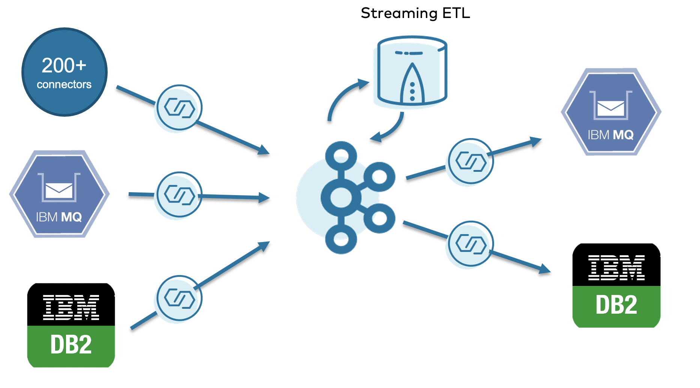
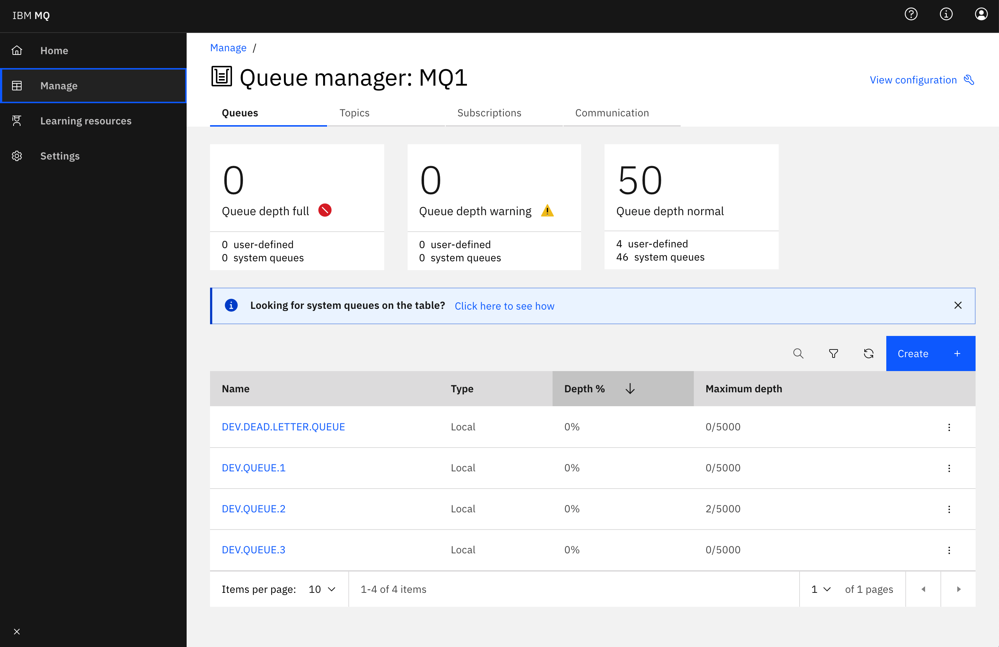
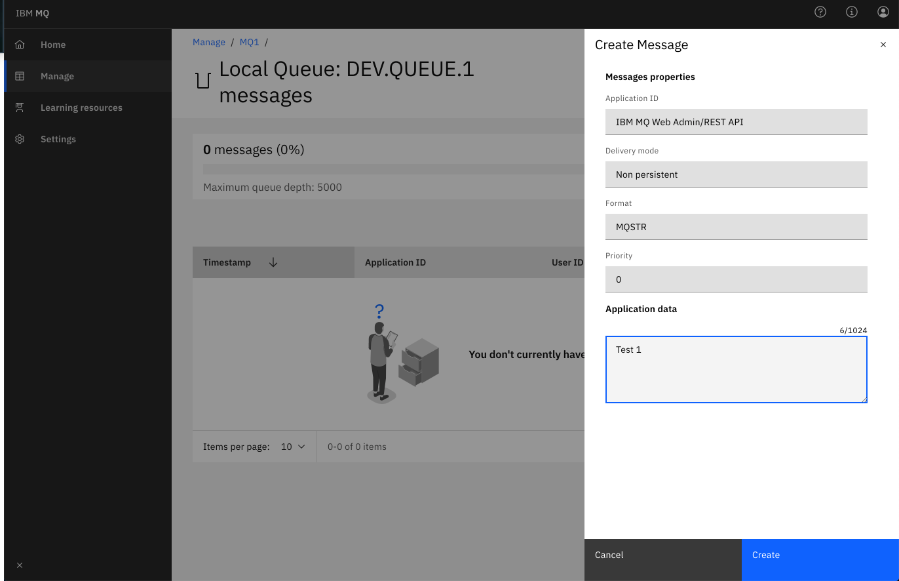
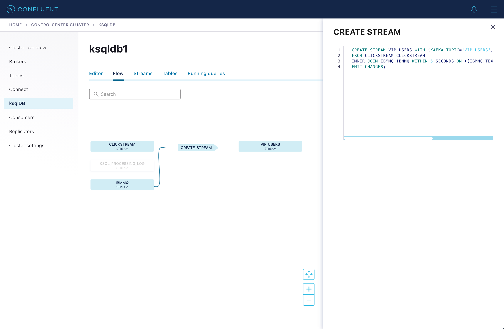

# Confluent + IBM Demo

This repository demonstrates how to use the IBM MQ connector. Two connectors will be started up: Datagen source, to mock clickstream data and IBM MQ Connetor source. Then we'll use KSQL to join the two sources together. No sink connector is configured.

## Download the demo
You can download the demo [here](https://bit.ly/3ex1tLx)

Unzip the ibm-demo.zip and cd into the directory from your terminal.

## Make commands

This step will spin up the Confluent Platform cluster and the IBM DB2 and IBM MQ servers.

```bash
make build
make cluster
# wait a minute for cluster to spinup
```

## Make the topics

With these commands we create the topics we need

```bash
make topic
```

## Open the IBM MQ Dashboard

[log in](https://localhost:9443/ibmmq/console/login.html)

```conf
UserName=admin
Password=passw0rd
```

## Show AVRO schema in C3 topics

You need to send a message to IBM MQ before the schema will appear in the topic in C3.

- Select `DEV.QUEUE.1` under "Queues on MQ1"



- Add a message




Notice that the messages are not consumed yet...

## Access Confluent Control Center
Access [Confluent Control Center](https://localhost:9021) 
Here you can see your local Confluent cluster, and the topics created before.

## Make the source connectors

Now we configure the connector so we can read data from IBM MQ

```bash
make connectsource
# wait a minute before moving on to the next step
```

- You can now see the schema assigned to the `ibmmq` topic


## AVRO message appear in consumer

Run the ibmmq consumer to see messages coming in from `DEV.QUEUE.1` (or check in C3)

```bash
make consumer
```

You can also see in IBM MQ that the messages are not there anymore.


## KSQL

### Create the stream from the CLICKSTREAM topic with ksqlDB

In [Confluent Control Center](https://localhost:9021)  , Select the cluster tile, Click on ksqlDB on the left menu  , and select the ksqldb1 cluster.

Using the editor run the queries below:

```sql
CREATE STREAM CLICKSTREAM
  WITH (KAFKA_TOPIC='clickstream',
        VALUE_FORMAT='AVRO');
```

## Add anothermessage to DEV.QUEUE.1

Send another message to IBM MQ. You can use the user names `bobk_43` or `akatz1022` to capture clickstreams for those users with a KSQL join.

## Create the Stream for the IBMMQ topic


```sql
CREATE STREAM ibmmq
  WITH (KAFKA_TOPIC='ibmmq',
        VALUE_FORMAT='AVRO');
```
Click on Add query properties and select auto.offset.reset = Earliest

```sql
SELECT * FROM ibmmq
EMIT CHANGES;
```

```sql
SELECT "TEXT" FROM ibmmq
EMIT CHANGES;
```

## JOIN the 2 streams

Paste the KSQL statement into the KSQL Editor to perform the join.

```sql
CREATE STREAM VIP_USERS AS
select  * from  CLICKSTREAM
join  IBMMQ WITHIN 5 seconds
on text = username emit changes;
```



```sql
SELECT * FROM VIP_USERS 
emit changes;
```

## Configure DB2

```bash
docker exec -ti ibmdb2 bash -c "su - db2inst1"
```

```bash
db2 connect to sample user db2inst1 using passw0rd
```

```bash
db2 LIST TABLES
```

You can now exit db2 

```bash
exit
```

Now you can create the connector to load the data from db2

```bash
make connectdb2source
```

You will see that the connector automatically creates data in Confluent. Check in [Confluent Control Center](https://localhost:9021) , under topics.

You can also see the connectors created by clicking on the Connect link in the left menu.

## Sink data to IBM MQ 

Let's sink the new stream data into IBM MQ into `DEV.QUEUE.2`

```bash
make connectsink
```

You can see the data by [loggin in](https://localhost:9443/ibmmq/console/login.html)

```conf
UserName=admin
Password=passw0rd
```

## Bring down the demo 
When you are done with the demo execute the command:

```conf
make down
```