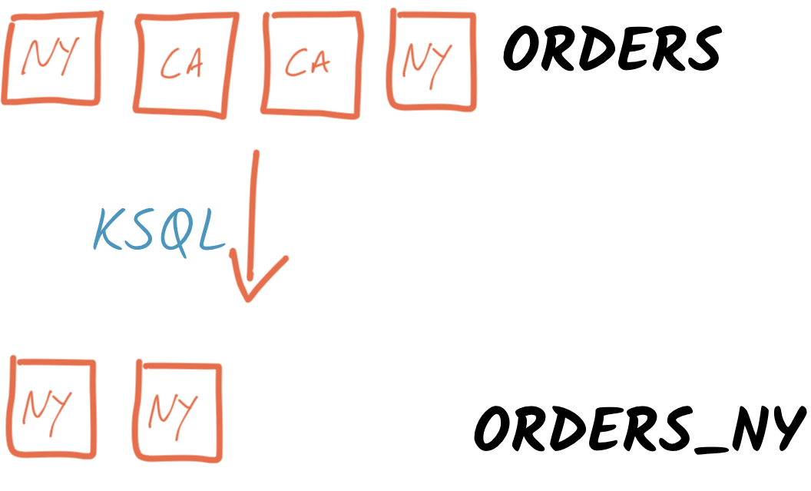
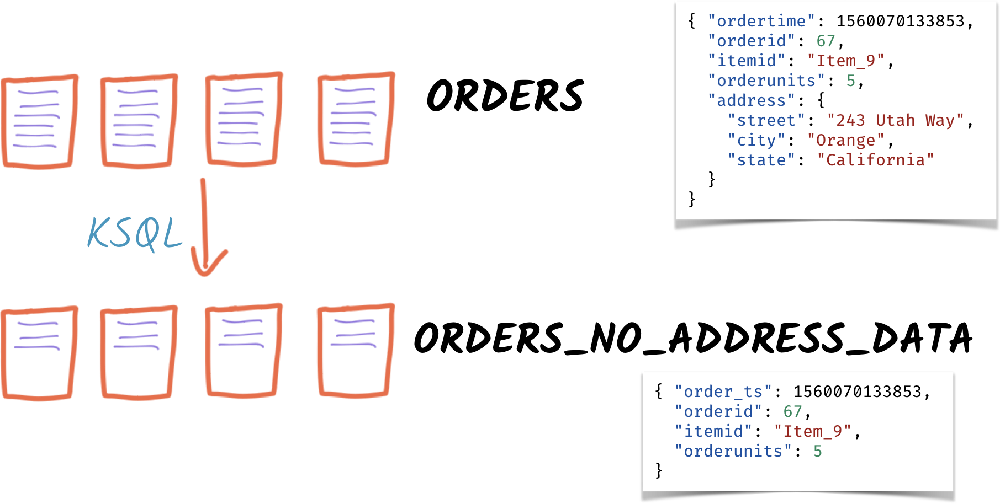
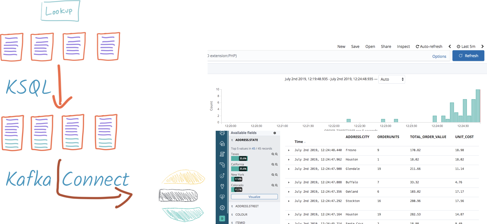
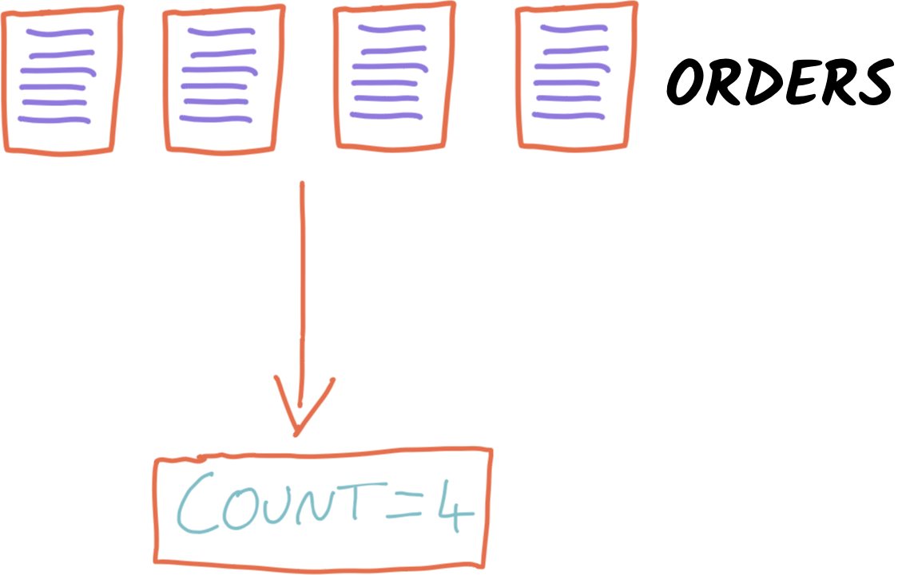

# An introduction to KSQL 
Robin Moffatt <robin@confluent.io>
v1.20, 11 February 2021
:toc:

## Setup

1. Clone the repository
+
[source,bash]
----
git clone https://github.com/confluentinc/demo-scene.git
cd demo-scene
----

2. Start up the environment
+
_The first time that you do this, the Docker images will be pulled down from the remote server. This may take a while!_
+
[source,bash]
----
cd introduction-to-ksqldb
docker-compose up -d
----

3. Launch the KSQL CLI in *TWO* terminal windows (you'll need both)
+
[source,bash]
----
docker exec -it ksqldb bash -c 'echo -e "\n\n⏳ Waiting for KSQL to be available before launching CLI\n"; while : ; do curl_status=$(curl -s -o /dev/null -w %{http_code} http://ksqldb:8088/info) ; echo -e $(date) " KSQL server listener HTTP state: " $curl_status " (waiting for 200)" ; if [ $curl_status -eq 200 ] ; then  break ; fi ; sleep 5 ; done ; ksql http://ksqldb:8088'
----

## Getting started

### Declare stream

[source,sql]
----
SHOW TOPICS;

PRINT orders;

CREATE STREAM ORDERS WITH 
  (VALUE_FORMAT='AVRO', 
   KAFKA_TOPIC ='orders');

SHOW STREAMS;

DESCRIBE ORDERS;

SELECT * FROM ORDERS EMIT CHANGES LIMIT 10;

SELECT ORDERID, ADDRESS FROM ORDERS EMIT CHANGES LIMIT 10;
----

## Filter for given state

[source,sql]
----
SELECT * 
  FROM ORDERS 
 WHERE ADDRESS->STATE='New York' 
EMIT CHANGES;
----

### Persist to a new Kafka topic

[source,sql]
----
CREATE STREAM ORDERS_NY AS 
  SELECT * 
    FROM ORDERS 
   WHERE ADDRESS->STATE='New York' 
  EMIT CHANGES;
----

Open a second terminal and run KSQL CLI 

[source,bash]
----
docker exec -it ksqldb bash -c 'echo -e "\n\n⏳ Waiting for KSQL to be available before launching CLI\n"; while : ; do curl_status=$(curl -s -o /dev/null -w %{http_code} http://ksqldb:8088/info) ; echo -e $(date) " KSQL server listener HTTP state: " $curl_status " (waiting for 200)" ; if [ $curl_status -eq 200 ] ; then  break ; fi ; sleep 5 ; done ; ksql http://ksqldb:8088'
----

In the original window show the source messages: 

[source,sql]
----
PRINT 'orders';
----

Print the new topic in the second window:

[source,sql]
----
PRINT 'ORDERS_NY';
----

Optionally, use the terminal software's Find function to highlight all `New York` text in the source stream, and show that only these messages are written to the new topic.

## Schema manipulation - Drop field

[source,sql]
----
SELECT ORDERTIME, ORDERID, ITEMID, ORDERUNITS 
  FROM ORDERS 
EMIT CHANGES;

CREATE STREAM ORDERS_NO_ADDRESS_DATA AS 
  SELECT TIMESTAMPTOSTRING(ORDERTIME, 'yyyy-MM-dd HH:mm:ss') AS ORDER_TIMESTAMP, 
         ORDERID, 
         ITEMID, 
         ORDERUNITS 
    FROM ORDERS 
  EMIT CHANGES;
----

Observe that new schema has no address fields: 

[source,sql]
----
DESCRIBE EXTENDED ORDERS_NO_ADDRESS_DATA;
----

In second window, print the new topic:

[source,sql]
----
PRINT 'ORDERS_NO_ADDRESS_DATA';
----

In the original window show the source messages: 

[source,sql]
----
PRINT 'orders';
----

## Joins

### Join to items reference

image::images/join01.png[]

[source,sql]
----

PRINT 'item_details_01' FROM BEGINNING LIMIT 10;

CREATE TABLE ITEM_REFERENCE_01 (ITEM_ID VARCHAR PRIMARY KEY) 
    WITH (VALUE_FORMAT='AVRO', 
          KAFKA_TOPIC='item_details_01');

DESCRIBE ITEM_REFERENCE_01;

SELECT TIMESTAMPTOSTRING(O.ORDERTIME, 'yyyy-MM-dd HH:mm:ss') AS ORDER_TIMESTAMP, 
       O.ORDERID, 
       O.ITEMID, 
       I.MAKE, 
       I.COLOUR, 
       I.UNIT_COST, 
       O.ORDERUNITS, 
       O.ORDERUNITS * I.UNIT_COST AS TOTAL_ORDER_VALUE, 
       O.ADDRESS
  FROM ORDERS O 
       INNER JOIN ITEM_REFERENCE_01 I 
       ON O.ITEMID = I.ITEM_ID 
EMIT CHANGES
LIMIT 5;

SET 'auto.offset.reset' = 'earliest';
CREATE STREAM ORDERS_ENRICHED AS 
SELECT O.ORDERTIME AS ORDER_TIMESTAMP, 
       O.ORDERID, 
       O.ITEMID, 
       I.MAKE, 
       I.COLOUR, 
       I.UNIT_COST, 
       O.ORDERUNITS, 
       O.ORDERUNITS * I.UNIT_COST AS TOTAL_ORDER_VALUE, 
       O.ADDRESS
  FROM ORDERS O 
       INNER JOIN ITEM_REFERENCE_01 I 
       ON O.ITEMID = I.ITEM_ID 
  PARTITION BY ORDERID;
----

Land to Elasticsearch

[source,sql]
----
CREATE SINK CONNECTOR SINK_ELASTIC_ORDERS_01 WITH (
  'connector.class'                     = 'io.confluent.connect.elasticsearch.ElasticsearchSinkConnector',
  'topics'                              = 'ORDERS_ENRICHED',
  'key.converter'                       = 'org.apache.kafka.connect.storage.StringConverter',
  'value.converter'                     = 'io.confluent.connect.avro.AvroConverter',
  'value.converter.schema.registry.url' = 'http://schema-registry:8081',
  'connection.url'                      = 'http://elasticsearch:9200',
  'type.name'                           = '_doc',
  'key.ignore'                          = 'true',
  'schema.ignore'                       = 'true'
);
----

Check that the connector is `RUNNING`

[source,sql]
----
DESCRIBE CONNECTOR SINK_ELASTIC_ORDERS_01;
----

[source,sql]
----
Name                 : SINK_ELASTIC_ORDERS_01
Class                : io.confluent.connect.elasticsearch.ElasticsearchSinkConnector
Type                 : sink
State                : RUNNING
WorkerId             : ksqldb:8083

 Task ID | State   | Error Trace
---------------------------------
 0       | RUNNING |
---------------------------------
----

View in http://localhost:5601/app/discover#/?_g=(filters:!(),refreshInterval:(pause:!f,value:2000),time:(from:now-15m,to:now))&_a=(columns:!(_source),filters:!(),index:orders_enriched,interval:auto,query:(language:kuery,query:''),sort:!())[Kibana]

''''

NOTE: 40 minute talk ends here

''''

## Schema manipulation - Flatten schema & derive new columns

image::images/schema02.png[]

[source,sql]
----
CREATE STREAM ORDERS_FLAT AS 
  SELECT TIMESTAMPTOSTRING(ORDERTIME, 'yyyy-MM-dd HH:mm:ss') AS ORDER_TIMESTAMP, 
         ORDERTIME AS ORDERTIME_EPOCH, 
         ORDERID, 
         ITEMID, 
         ORDERUNITS, 
         ADDRESS->STREET AS ADDRESS_STREET, 
         ADDRESS->CITY AS ADDRESS_CITY, 
         ADDRESS->STATE AS ADDRESS_STATE
    FROM ORDERS;
----

[source,sql]
----
PRINT 'ORDERS_FLAT';
----

### Reserialise to CSV

image::images/reserialise01.png[]

[source,sql]
----
CREATE STREAM ORDERS_FLAT_CSV WITH (VALUE_FORMAT='DELIMITED', 
                                    KAFKA_TOPIC='orders_csv') AS 
  SELECT * FROM ORDERS_FLAT;

PRINT 'orders_csv';
----

## Aggregates 

### Orders count by manufacturer

[source,sql]
----
SELECT MAKE, 
       COUNT(*) AS ORDER_COUNT,
       SUM(TOTAL_ORDER_VALUE) AS TOTAL_ORDER_VALUE
  FROM ORDERS_ENRICHED 
  GROUP BY MAKE 
  EMIT CHANGES
  LIMIT 5;
----

[source,sql]
----
CREATE TABLE MAKE_AGG AS
SELECT MAKE, 
       COUNT(*) AS ORDER_COUNT,
       SUM(TOTAL_ORDER_VALUE) AS TOTAL_ORDER_VALUE
  FROM ORDERS_ENRICHED 
  GROUP BY MAKE;
----

Pull query

[source,sql]
----
SELECT ORDER_COUNT, 
       TOTAL_ORDER_VALUE 
  FROM MAKE_AGG
 WHERE MAKE IN ('Satterfield and Sons',
                'Beer, Feil and Ratke');
----

### Total order value per hour, by make

[source,sql]
----
CREATE TABLE ORDERS_PER_HOUR_BY_MAKE AS
  SELECT MAKE, 
         COUNT(*) AS ORDER_COUNT, 
         CAST(SUM(TOTAL_ORDER_VALUE) AS DECIMAL(9,2)) AS TOTAL_ORDER_VALUE 
    FROM ORDERS_ENRICHED 
          WINDOW TUMBLING (SIZE 1 HOUR) 
  GROUP BY MAKE
  EMIT CHANGES;
----

Pull query

[source,sql]
----
SELECT TIMESTAMPTOSTRING(WINDOWSTART,'yyyy-MM-dd HH:mm:ss','Europe/London') AS WINDOW_START,
        TIMESTAMPTOSTRING(WINDOWEND,'HH:mm:ss','Europe/London') AS WINDOW_END, 
        MAKE, 
        ORDER_COUNT,
        TOTAL_ORDER_VALUE 
  FROM ORDERS_PER_HOUR_BY_MAKE 
  WHERE MAKE = 'Funk Inc';
----

[source,sql]
----
+---------------------+------------+----------+-------------+------------------+
|WINDOW_START         |WINDOW_END  |MAKE      |ORDER_COUNT  |TOTAL_ORDER_VALUE |
+---------------------+------------+----------+-------------+------------------+
|2021-02-09 13:00:00  |14:00:00    |Funk Inc  |13           |689.92            |
|2021-02-09 14:00:00  |15:00:00    |Funk Inc  |39           |1426.88           |
|2021-02-09 15:00:00  |16:00:00    |Funk Inc  |100          |3967.04           |
|2021-02-09 16:00:00  |17:00:00    |Funk Inc  |105          |3927.84           |
|2021-02-09 17:00:00  |18:00:00    |Funk Inc  |66           |2438.24           |
Query terminated
ksql>
----

Push query

[source,sql]
----
SELECT TIMESTAMPTOSTRING(WINDOWSTART,'yyyy-MM-dd HH:mm:ss','Europe/London') AS WINDOW_START,
        TIMESTAMPTOSTRING(WINDOWEND,'HH:mm:ss','Europe/London') AS WINDOW_END,
        MAKE,
        ORDER_COUNT,
        TOTAL_ORDER_VALUE
  FROM ORDERS_PER_HOUR_BY_MAKE
  EMIT CHANGES;
----

[source,sql]
----
+----------------------+-----------+----------+-------------+------------------+
|WINDOW_START          |WINDOW_END |MAKE      |ORDER_COUNT  |TOTAL_ORDER_VALUE |
+----------------------+-----------+----------+-------------+------------------+
|2021-02-09 13:00:00   |14:00:00   |Funk Inc  |13           |689.92            |
|2021-02-09 14:00:00   |15:00:00   |Funk Inc  |39           |1426.88           |
|2021-02-09 15:00:00   |16:00:00   |Funk Inc  |100          |3967.04           |
|2021-02-09 16:00:00   |17:00:00   |Funk Inc  |105          |3927.84           |
|2021-02-09 17:00:00   |18:00:00   |Funk Inc  |87           |3175.20           |
|2021-02-09 17:00:00   |18:00:00   |Funk Inc  |88           |3206.56           |
|2021-02-09 17:00:00   |18:00:00   |Funk Inc  |89           |3269.28           |
|2021-02-09 17:00:00   |18:00:00   |Funk Inc  |90           |3339.84           |
----

### Manufacturers for which there have been more than $10,000 of orders in an hour

[source,sql]
----
SELECT TIMESTAMPTOSTRING(WINDOWSTART,'yyyy-MM-dd HH:mm:ss') AS WINDOW_START_TS, 
       MAKE, 
       COUNT(*) AS ORDER_COUNT, 
       CAST(SUM(TOTAL_ORDER_VALUE) AS DECIMAL(9,2)) AS TOTAL_ORDER_VALUE 
  FROM ORDERS_ENRICHED 
         WINDOW TUMBLING (SIZE 1 HOUR) 
GROUP BY MAKE 
HAVING SUM(TOTAL_ORDER_VALUE) > 10000
EMIT CHANGES;
----

## Merging and Splitting Streams

### Merging streams with INSERT INTO

image::images/merge01.png[]

Imagine you have two inbound streams of orders, from separate geographies (e.g. UK and US). You want to combine these into a single stream for use by consumers. 

Add the second stream, containing UK orders: 

[source,sql]
----
SHOW TOPICS;

CREATE STREAM ORDERS_UK WITH (VALUE_FORMAT='AVRO', KAFKA_TOPIC='orders_uk');

SELECT * FROM ORDERS_UK EMIT CHANGES LIMIT 5;
----

Create the new combined stream, populated first by all US orders (the original `ORDERS` stream): 

[source,sql]
----
CREATE STREAM ORDERS_COMBINED AS 
  SELECT 'US' AS SOURCE, 
         CONCAT_WS('-','US',CAST(ORDERID AS VARCHAR)) AS ORDERID, 
         ORDERTIME, 
         ITEMID, 
         ORDERUNITS, 
         ADDRESS 
    FROM ORDERS
    PARTITION BY CONCAT_WS('-','US',CAST(ORDERID AS VARCHAR));
----

Add the source of UK order data: 

[source,sql]
----
INSERT INTO ORDERS_COMBINED 
  SELECT 'UK' AS SOURCE, 
         CONCAT_WS('-','UK',CAST(ORDERID AS VARCHAR)) AS ORDERID, 
         ORDERTIME, 
         ITEMID, 
         ORDERUNITS, 
         ADDRESS 
    FROM ORDERS_UK
    PARTITION BY CONCAT_WS('-','UK',CAST(ORDERID AS VARCHAR));
----

[source,sql]
----
SET 'auto.offset.reset' = 'latest';

SELECT * FROM ORDERS_COMBINED EMIT CHANGES LIMIT 20;
----

### Splitting streams

image::images/split01.png[]

Imagine you have only the single source of `ORDERS_COMBINED` and you want two separate streams of US and UK order data : 

[source,sql]
----
CREATE STREAM ORDER_SPLIT_US AS 
  SELECT * 
    FROM ORDERS_COMBINED 
   WHERE SOURCE ='US';

CREATE STREAM ORDER_SPLIT_UK AS 
  SELECT * 
    FROM ORDERS_COMBINED 
   WHERE SOURCE ='UK';

CREATE STREAM ORDER_SPLIT_OTHER AS 
  SELECT * 
    FROM ORDERS_COMBINED 
   WHERE SOURCE !='US' 
     AND SOURCE !='UK';

SELECT SOURCE, COUNT(*) AS ORDER_COUNT
  FROM ORDER_SPLIT_US 
GROUP BY SOURCE
EMIT CHANGES;

SELECT SOURCE, COUNT(*) AS ORDER_COUNT
  FROM ORDER_SPLIT_UK 
GROUP BY SOURCE
EMIT CHANGES;
----

## Time handling

### Event time vs ingest time (`ORDERTIME` vs `ROWTIME`)

[source,sql]
----
SET 'auto.offset.reset' = 'earliest';

SELECT TIMESTAMPTOSTRING(ORDERTIME,'yyyy-MM-dd HH:mm:ss') AS ORDERTIME, 
       'Order ID : ' + CAST(ORDERID AS VARCHAR) AS ORDERID
  FROM ORDERS 
 WHERE ITEMID='Item_42' 
 EMIT CHANGES
 LIMIT 5;
----

[source,sql]
----
+----------------------+-------------------+
|ORDERTIME             |ORDERID            |
+----------------------+-------------------+
|2019-06-09 12:38:05   |Order ID : 336     |
|2019-06-09 20:16:30   |Order ID : 713     |
|2019-06-09 16:10:19   |Order ID : 1357    |
|2019-06-09 21:16:25   |Order ID : 1512    |
|2019-06-09 05:09:04   |Order ID : 2091    |
Limit Reached
Query terminated
----

[source,sql]
----
SELECT TIMESTAMPTOSTRING(WINDOWSTART,'yyyy-MM-dd HH:mm:ss') AS WINDOW_START_TS, 
       ITEMID, 
       COUNT(*) AS ORDER_COUNT 
  FROM ORDERS 
         WINDOW TUMBLING (SIZE 1 HOUR) 
 WHERE ITEMID='Item_42' 
GROUP BY ITEMID 
EMIT CHANGES;
----

[source,sql]
----
+----------------------+---------+--------------+
|WINDOW_START_TS       |ITEMID   |ORDER_COUNT   |
+----------------------+---------+--------------+
|2021-02-09 13:00:00   |Item_42  |32            |
|2021-02-09 14:00:00   |Item_42  |17            |
|2021-02-09 15:00:00   |Item_42  |103           |
|2021-02-09 16:00:00   |Item_42  |70            |
----

[source,sql]
----
SELECT TIMESTAMPTOSTRING(ROWTIME,'yyyy-MM-dd HH:mm:ss') AS ROWTIME_STR,
       TIMESTAMPTOSTRING(ORDERTIME,'yyyy-MM-dd HH:mm:ss') AS ORDERTIME, 
       'Order ID : ' + CAST(ORDERID AS VARCHAR) AS ORDERID
  FROM ORDERS 
 WHERE ITEMID='Item_42' 
 EMIT CHANGES
 LIMIT 5;
----

[source,sql]
----
+----------------------+----------------------+----------------+
|ROWTIME_              |ORDERTIME             |ORDERID         |
+----------------------+----------------------+----------------+
|2021-02-09 13:37:28   |2019-06-09 20:39:54   |Order ID : 395  |
|2021-02-09 13:38:13   |2019-06-09 04:02:29   |Order ID : 590  |
|2021-02-09 13:38:14   |2019-06-09 21:47:57   |Order ID : 597  |
|2021-02-09 13:38:59   |2019-06-09 15:33:59   |Order ID : 777  |
|2021-02-09 13:39:36   |2019-06-09 00:21:32   |Order ID : 922  |
----

[source,sql]
----
CREATE STREAM ORDERS_BY_EVENTTIME WITH (VALUE_FORMAT='AVRO', 
                                        KAFKA_TOPIC='orders', 
                                        TIMESTAMP='ORDERTIME');
----

[source,sql]
----
SELECT TIMESTAMPTOSTRING(ROWTIME,'yyyy-MM-dd HH:mm:ss') AS ROWTIME_STR,
       TIMESTAMPTOSTRING(ORDERTIME,'yyyy-MM-dd HH:mm:ss') AS ORDERTIME, 
       'Order ID : ' + CAST(ORDERID AS VARCHAR) AS ORDERID
  FROM ORDERS_BY_EVENTTIME 
 WHERE ITEMID='Item_42'
 EMIT CHANGES
 LIMIT 5;
----

[source,sql]
----
+----------------------+---------------------+-----------------+
|ROWTIME_              |ORDERTIME            |ORDERID          |
+----------------------+---------------------+-----------------+
|2019-06-09 16:10:19   |2019-06-09 16:10:19  |Order ID : 1357  |
|2019-06-09 05:09:04   |2019-06-09 05:09:04  |Order ID : 2091  |
|2019-06-09 20:10:49   |2019-06-09 20:10:49  |Order ID : 2097  |
|2019-06-09 18:41:06   |2019-06-09 18:41:06  |Order ID : 3300  |
|2019-06-09 15:58:26   |2019-06-09 15:58:26  |Order ID : 3448  |
----

[source,sql]
----
SELECT TIMESTAMPTOSTRING(WINDOWSTART,'yyyy-MM-dd HH:mm:ss') AS WINDOW_START_TS, 
       ITEMID, 
       COUNT(*) AS ORDER_COUNT 
  FROM ORDERS_BY_EVENTTIME 
         WINDOW TUMBLING (SIZE 1 HOUR) 
 WHERE ITEMID='Item_42' 
GROUP BY ITEMID
EMIT CHANGES;
----

[source,sql]
----
+--------------------------+---------+--------------+
|WINDOW_START_TS           |ITEMID   |ORDER_COUNT   |
+--------------------------+---------+--------------+
|2019-06-09 13:00:00       |Item_42  |8             |
|2019-06-09 08:00:00       |Item_42  |11            |
|2019-06-09 03:00:00       |Item_42  |9             |
|2019-06-09 07:00:00       |Item_42  |6             |
|2019-06-09 06:00:00       |Item_42  |13            |
|2019-06-09 20:00:00       |Item_42  |13            |

----

## Analytics - pivoting & bucketing metrics

* Using `CASE` to bucket metrics:
+
[source,sql]
----
SELECT ORDERID, 
       ORDERUNITS,
       CASE WHEN ORDERUNITS > 15 THEN 'Really big order' 
            WHEN ORDERUNITS > 10 THEN 'Big order' 
                                 ELSE 'Normal order' 
         END AS ORDER_TYPE 
  FROM ORDERS_ENRICHED
  EMIT CHANGES
  LIMIT 10;
----
+
[source,sql]
----
+------------+-------------+--------------------------+
|ORDERID     |ORDERUNITS   |ORDER_TYPE                |
+------------+-------------+--------------------------+
|4343        |5            |Normal order              |
|4339        |19           |Really big order          |
|4354        |11           |Big order                 |
|4346        |14           |Big order                 |
|4355        |9            |Normal order              |
|4351        |12           |Big order                 |
|4353        |8            |Normal order              |
|4362        |4            |Normal order              |
|4365        |7            |Normal order              |
|4368        |7            |Normal order              |
Limit Reached
Query terminated
----

* Using `CASE` to create bucket metric aggregates
+
[source,sql]
----
SELECT CASE WHEN ORDERUNITS > 15 THEN 'Really big order' 
            WHEN ORDERUNITS > 10 THEN 'Big order' 
                                 ELSE 'Normal order' 
         END AS ORDER_TYPE,
       COUNT(*) AS ORDER_COUNT
  FROM ORDERS_ENRICHED 
GROUP BY CASE WHEN ORDERUNITS > 15 THEN 'Really big order' 
              WHEN ORDERUNITS > 10 THEN 'Big order' 
                                   ELSE 'Normal order' 
           END
EMIT CHANGES;
----
+
[source,sql]
----
+-------------------+--------------+
|ORDER_TYPE         |ORDER_COUNT   |
+-------------------+--------------+
|Really big order   |2135          |
|Normal order       |11707         |
|Big order          |3855          |
----

* Using `CASE` to pivot bucket aggregates
+
[source,sql]
----
SELECT TIMESTAMPTOSTRING(WINDOWSTART,'yyyy-MM-dd HH:mm:ss') AS WINDOW_START_TS, 
       MAKE, 
       COUNT(*) AS ORDER_CT, 
       SUM(CASE WHEN ORDERUNITS > 15 THEN 1 ELSE 0 END) AS CT_REALLY_BIG_ORDER,
       SUM(CASE WHEN ORDERUNITS > 10 AND ORDERUNITS<15 THEN 1 ELSE 0 END) AS CT_BIG_ORDER,
       SUM(CASE WHEN ORDERUNITS <= 10 THEN 1 ELSE 0 END) AS CT_NORMAL_ORDER
  FROM ORDERS_ENRICHED 
        WINDOW TUMBLING (SIZE 1 HOUR)
GROUP BY MAKE
EMIT CHANGES
LIMIT 5;
----
+
[source,sql]
----
+---------------------+-------------------+---------+---------------------+--------------+-----------------+
|WINDOW_START_TS      |MAKE               |ORDER_CT |CT_REALLY_BIG_ORDER  |CT_BIG_ORDER  |CT_NORMAL_ORDER  |
+---------------------+-------------------+---------+---------------------+--------------+-----------------+
|2021-02-09 13:00:00  |Corkery-Rath       |11       |2                    |0             |8                |
|2021-02-09 14:00:00  |Corkery-Rath       |25       |1                    |3             |20               |
|2021-02-09 13:00:00  |Hilpert and Sons   |10       |1                    |2             |6                |
|2021-02-09 15:00:00  |Corkery-Rath       |119      |17                   |35            |67               |
|2021-02-09 14:00:00  |Hilpert and Sons   |31       |5                    |5             |20               |
Limit Reached
Query terminated
----

