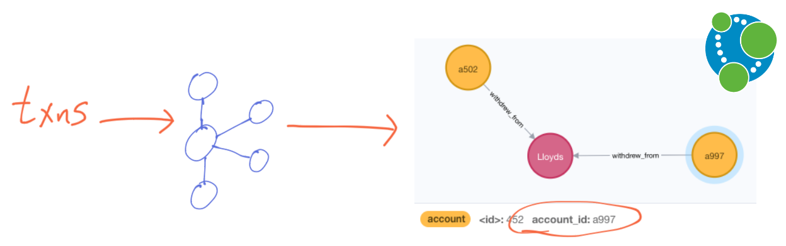
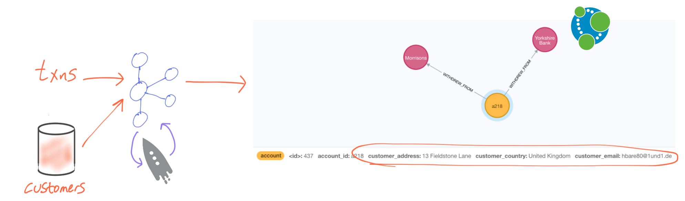
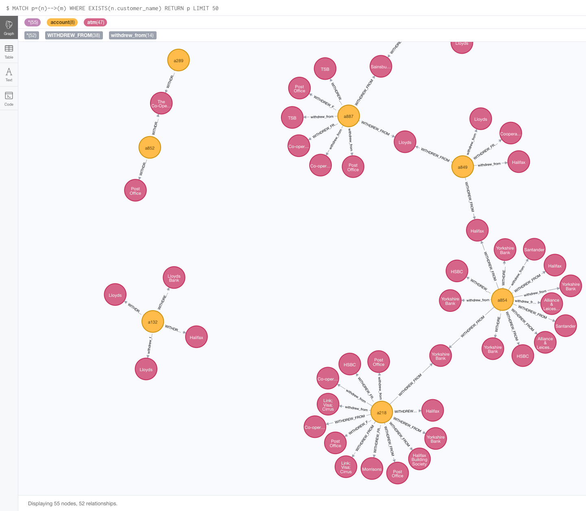

= ATM Fraud Detection with Kafka and KSQL - Hands on Guide
Robin Moffatt <robin@confluent.io>
v1.10, November 22, 2018

== Running the test rig

1. Bring up the stack
+
[source,bash]
----
git clone https://github.com/confluentinc/demo-scene.git
cd ksql-atm-fraud-detection
docker-compose up -d
----
+
This brings up the stack, and also loads the necessary Kafka Connect, Elasticsearch, and Kibana configuration. It also launches the ATM data generator, streaming events to the `atm_txns_gess` topic.

2. Launch the KSQL CLI: 
+
[source,bash]
----
docker-compose exec ksql-cli bash -c 'echo -e "\n\n⏳ Waiting for KSQL to be available before launching CLI\n"; while [ $(curl -s -o /dev/null -w %{http_code} http://ksql-server:8088/) -eq 000 ] ; do echo -e $(date) "KSQL Server HTTP state: " $(curl -s -o /dev/null -w %{http_code} http://ksql-server:8088/) " (waiting for 200)" ; sleep 5 ; done; ksql http://ksql-server:8088'
----

3. Launch Kibana: http://localhost:5601/app/kibana#/dashboard/atm-transactions?_g=(refreshInterval:(pause:!f,value:30000),time:(from:now-15m,mode:quick,to:now))[All ATM transactions]

4. Launch MySQL CLI
+
[source,bash]
----
docker-compose exec mysql bash -c 'mysql -u $MYSQL_USER -p$MYSQL_PASSWORD demo'
----

== Demo 1: Kafka data + Kibana

Show topics: 

[source,sql]
----
LIST TOPICS;
----

Inspect source transactions: 

[source,sql]
----
PRINT 'atm_txns_gess' FROM BEGINNING;
----

Show in Kibana: http://localhost:5601/app/kibana#/dashboard/atm-transactions?_g=(refreshInterval:(pause:!f,value:30000),time:(from:now-15m,mode:quick,to:now))[All ATM transactions]

== Demo 2: Stream-Stream joins in KSQL

Register the topic as a KSQL stream: 

[source,sql]
----
CREATE STREAM ATM_TXNS_GESS (account_id VARCHAR, 
                            atm VARCHAR, 
                            location STRUCT<lon DOUBLE, 
                                            lat DOUBLE>, 
                            amount INT, 
                            timestamp VARCHAR, 
                            transaction_id VARCHAR) 
            WITH (KAFKA_TOPIC='atm_txns_gess', 
            VALUE_FORMAT='JSON', 
            TIMESTAMP='timestamp', 
            TIMESTAMP_FORMAT='yyyy-MM-dd HH:mm:ss X');
----

Query the stream: 

[source,sql]
----
ksql> SELECT TIMESTAMPTOSTRING(ROWTIME, 'HH:mm:ss'), ACCOUNT_ID, ATM, AMOUNT
        FROM ATM_TXNS_GESS 
        LIMIT 5;

2018-11-23 11:57:45 +0000 | a136 | ATM : 48930597 | 200
2018-11-23 11:57:46 +0000 | a552 | ATM : 1626440972 | 300
2018-11-23 11:57:47 +0000 | a250 | Barclays | 400
2018-11-23 11:57:47 +0000 | a327 | ATM : 1182516742 | 300
2018-11-23 11:57:48 +0000 | a973 | ATM : 5920382950 | 400
----

Create a clone of the stream: 

[source,sql]
----
CREATE STREAM ATM_TXNS_GESS_02 WITH (PARTITIONS=1) AS 
        SELECT * FROM ATM_TXNS_GESS;
----

Join the stream (two in practice, but logically still just a single Kafka topic).
Also calculate time between two events (useful for spotting past-joins, not future).

[source,sql]
----
SELECT S1.ACCOUNT_ID, 
        TIMESTAMPTOSTRING(S1.ROWTIME, 'HH:mm:ss') AS S1_TS, 
        TIMESTAMPTOSTRING(S2.ROWTIME, 'HH:mm:ss') AS S2_TS, 
        (S2.ROWTIME - S1.ROWTIME)/1000 AS TIME_DIFF_SEC, 
        S1.TRANSACTION_ID ,S2.TRANSACTION_ID 
FROM   ATM_TXNS_GESS S1 
       INNER JOIN ATM_TXNS_GESS_02 S2 
        WITHIN 10 MINUTES 
        ON S1.ACCOUNT_ID = S2.ACCOUNT_ID 
LIMIT 40;

----

Filter out : 

* direct matches to self
* those in the same location. 
* Joins to past-dated events. 

[source,sql]
----
SELECT S1.ACCOUNT_ID, 
        TIMESTAMPTOSTRING(S1.ROWTIME, 'HH:mm:ss') AS S1_TS, 
        TIMESTAMPTOSTRING(S2.ROWTIME, 'HH:mm:ss') AS S2_TS, 
        (S2.ROWTIME - S1.ROWTIME)/1000 AS TIME_DIFF_SEC, 
        S1.ATM, S2.ATM, 
        S1.TRANSACTION_ID ,S2.TRANSACTION_ID 
FROM   ATM_TXNS_GESS S1 
       INNER JOIN ATM_TXNS_GESS_02 S2 
        WITHIN (0 MINUTES, 10 MINUTES) 
        ON S1.ACCOUNT_ID = S2.ACCOUNT_ID 
WHERE   S1.TRANSACTION_ID != S2.TRANSACTION_ID 
  AND   (S1.location->lat != S2.location->lat OR 
         S1.location->lon != S2.location->lon) 
  AND   S2.ROWTIME != S1.ROWTIME 
LIMIT 20;
----

Derive distance between ATMs & calculate required speed: 

[source,sql]
----
SELECT S1.ACCOUNT_ID, 
        TIMESTAMPTOSTRING(S1.ROWTIME, 'HH:mm:ss') AS S1_TS, 
        TIMESTAMPTOSTRING(S2.ROWTIME, 'HH:mm:ss') AS S2_TS, 
        (CAST(S2.ROWTIME AS DOUBLE) - CAST(S1.ROWTIME AS DOUBLE)) / 1000 / 60 AS MINUTES_DIFFERENCE,  
        CAST(GEO_DISTANCE(S1.location->lat, S1.location->lon, S2.location->lat, S2.location->lon, 'KM') AS INT) AS DISTANCE_BETWEEN_TXN_KM, 
        GEO_DISTANCE(S1.location->lat, S1.location->lon, S2.location->lat, S2.location->lon, 'KM') / ((CAST(S2.ROWTIME AS DOUBLE) - CAST(S1.ROWTIME AS DOUBLE)) / 1000 / 60 / 60) AS KMH_REQUIRED, 
        S1.ATM, S2.ATM 
FROM   ATM_TXNS_GESS S1 
       INNER JOIN ATM_TXNS_GESS_02 S2 
        WITHIN (0 MINUTES, 10 MINUTES) 
        ON S1.ACCOUNT_ID = S2.ACCOUNT_ID 
WHERE   S1.TRANSACTION_ID != S2.TRANSACTION_ID 
  AND   (S1.location->lat != S2.location->lat OR 
         S1.location->lon != S2.location->lon) 
  AND   S2.ROWTIME != S1.ROWTIME 
LIMIT 20;
----

Persist as a new stream: 

[source,sql]
----
CREATE STREAM ATM_POSSIBLE_FRAUD  
    WITH (PARTITIONS=1) AS 
SELECT S1.ROWTIME AS TX1_TIMESTAMP, S2.ROWTIME AS TX2_TIMESTAMP, 
        GEO_DISTANCE(S1.location->lat, S1.location->lon, S2.location->lat, S2.location->lon, 'KM') AS DISTANCE_BETWEEN_TXN_KM, 
        (S2.ROWTIME - S1.ROWTIME) AS MILLISECONDS_DIFFERENCE,  
        (CAST(S2.ROWTIME AS DOUBLE) - CAST(S1.ROWTIME AS DOUBLE)) / 1000 / 60 AS MINUTES_DIFFERENCE,  
        GEO_DISTANCE(S1.location->lat, S1.location->lon, S2.location->lat, S2.location->lon, 'KM') / ((CAST(S2.ROWTIME AS DOUBLE) - CAST(S1.ROWTIME AS DOUBLE)) / 1000 / 60 / 60) AS KMH_REQUIRED, 
        S1.ACCOUNT_ID AS ACCOUNT_ID, 
        S1.TRANSACTION_ID AS TX1_TRANSACTION_ID, S2.TRANSACTION_ID AS TX2_TRANSACTION_ID, 
        S1.AMOUNT AS TX1_AMOUNT, S2.AMOUNT AS TX2_AMOUNT, 
        S1.ATM AS TX1_ATM, S2.ATM AS TX2_ATM, 
        CAST(S1.location->lat AS STRING) + ',' + CAST(S1.location->lon AS STRING) AS TX1_LOCATION, 
        CAST(S2.location->lat AS STRING) + ',' + CAST(S2.location->lon AS STRING) AS TX2_LOCATION 
FROM   ATM_TXNS_GESS S1 
       INNER JOIN ATM_TXNS_GESS_02 S2 
        WITHIN (0 MINUTES, 10 MINUTES) 
        ON S1.ACCOUNT_ID = S2.ACCOUNT_ID 
WHERE   S1.TRANSACTION_ID != S2.TRANSACTION_ID 
  AND   (S1.location->lat != S2.location->lat OR 
         S1.location->lon != S2.location->lon) 
  AND   S2.ROWTIME != S1.ROWTIME;
----

View the resulting transactions: 

[source,sql]
----
SELECT ACCOUNT_ID, 
        TIMESTAMPTOSTRING(TX1_TIMESTAMP, 'yyyy-MM-dd HH:mm:ss') AS TX1_TS, 
        TIMESTAMPTOSTRING(TX2_TIMESTAMP, 'HH:mm:ss') AS TX2_TS, 
        TX1_ATM, TX2_ATM, 
        DISTANCE_BETWEEN_TXN_KM, MINUTES_DIFFERENCE 
FROM ATM_POSSIBLE_FRAUD;  
----

++++

++++

== Demo 3: Customer data

[source,bash]
----
docker-compose exec mysql bash -c 'mysql -u $MYSQL_USER -p$MYSQL_PASSWORD demo'
----

[source,sql]
----
SHOW TABLES;
----

[source,sql]
----
SELECT ACCOUNT_ID, FIRST_NAME, LAST_NAME, EMAIL, PHONE FROM accounts LIMIT 5;
----

In KSQL, examine Customer data: 

[source,sql]
----
SET 'auto.offset.reset' = 'earliest';
CREATE STREAM ACCOUNTS_STREAM WITH (KAFKA_TOPIC='asgard.demo.accounts', VALUE_FORMAT='AVRO');
CREATE STREAM ACCOUNTS_REKEYED WITH (PARTITIONS=1) AS SELECT * FROM ACCOUNTS_STREAM PARTITION BY ACCOUNT_ID;
-- This select statement is simply to make sure that we have time for the ACCOUNTS_REKEYED topic
-- to be created before we define a table against it
SELECT * FROM ACCOUNTS_REKEYED LIMIT 1;
CREATE TABLE ACCOUNTS WITH (KAFKA_TOPIC='ACCOUNTS_REKEYED',VALUE_FORMAT='AVRO',KEY='ACCOUNT_ID');
----

Show updates from DB reflected in KSQL table : 

[source,sql]
----
SELECT ACCOUNT_ID, FIRST_NAME, LAST_NAME, EMAIL, PHONE FROM ACCOUNTS WHERE ACCOUNT_ID='a42';
----

[source,sql]
----
UPDATE accounts SET EMAIL='none' WHERE ACCOUNT_ID='a42';
UPDATE accounts SET EMAIL='robin@rmoff.net' WHERE ACCOUNT_ID='a42';
UPDATE accounts SET EMAIL='robin@confluent.io' WHERE ACCOUNT_ID='a42';
----

Optionally, explore stream/table difference: 

[source,sql]
----
SELECT ACCOUNT_ID, FIRST_NAME, LAST_NAME, EMAIL, PHONE FROM ACCOUNTS_STREAM WHERE ACCOUNT_ID='a42';
----

---

Write enriched data to new stream: 

[source,sql]
----
CREATE STREAM ATM_POSSIBLE_FRAUD_ENRICHED WITH (PARTITIONS=1) AS 
SELECT A.ACCOUNT_ID AS ACCOUNT_ID, 
      A.TX1_TIMESTAMP, A.TX2_TIMESTAMP, 
      A.TX1_AMOUNT, A.TX2_AMOUNT, 
      A.TX1_ATM, A.TX2_ATM, 
      A.TX1_LOCATION, A.TX2_LOCATION, 
      A.TX1_TRANSACTION_ID, A.TX2_TRANSACTION_ID, 
      A.DISTANCE_BETWEEN_TXN_KM, 
      A.MILLISECONDS_DIFFERENCE, 
      A.MINUTES_DIFFERENCE, 
      A.KMH_REQUIRED, 
      B.FIRST_NAME + ' ' + B.LAST_NAME AS CUSTOMER_NAME, 
      B.EMAIL AS CUSTOMER_EMAIL, 
      B.PHONE AS CUSTOMER_PHONE, 
      B.ADDRESS AS CUSTOMER_ADDRESS, 
      B.COUNTRY AS CUSTOMER_COUNTRY 
FROM ATM_POSSIBLE_FRAUD A 
     INNER JOIN ACCOUNTS B 
     ON A.ACCOUNT_ID = B.ACCOUNT_ID;
----

View enriched data: 

[source,sql]
----
SELECT ACCOUNT_ID, CUSTOMER_NAME, CUSTOMER_PHONE, 
        TIMESTAMPTOSTRING(TX1_TIMESTAMP, 'yyyy-MM-dd HH:mm:ss') AS TX1_TS, 
        TIMESTAMPTOSTRING(TX2_TIMESTAMP, 'HH:mm:ss') AS TX2_TS, 
        TX1_ATM, TX2_ATM, 
        DISTANCE_BETWEEN_TXN_KM, MINUTES_DIFFERENCE 
FROM ATM_POSSIBLE_FRAUD_ENRICHED;  
----

http://localhost:5601/app/kibana#/dashboard/fraudulent-atm-transactions?_g=(refreshInterval:(pause:!f,value:30000),time:(from:now-15m,mode:quick,to:now))[Show suspect transactions in Kibana]

http://localhost:5601/app/kibana#/discover/90f2e7f0-ef15-11e8-a410-976398351471?_g=(refreshInterval:(pause:!f,value:30000),time:(from:now-15m,mode:quick,to:now))&_a=(columns:!(ACCOUNT_ID,CUSTOMER_NAME,TX1_ATM,TX1_AMOUNT,TX2_ATM,TX2_AMOUNT,DISTANCE_BETWEEN_TXN_KM,MINUTES_DIFFERENCE),filters:!(),index:atm-possible-fraud-enriched,interval:auto,query:(language:lucene,query:''),sort:!(TX1_TIMESTAMP,desc))[Show detail view in Kibana]

== Demo 4 : customer data enrichment -> Neo4j

Kafka Connect can stream data from a topic directly to Neo4j: 

But note how the data is missing any information about the account holder. We can use KSQL to enrich the raw stream of all transactions and adds in information about the account holder. 

* Declare stream and tables if not already: 
+
[source,sql]
----
CREATE STREAM ATM_TXNS_GESS (account_id VARCHAR, 
                            atm VARCHAR, 
                            location STRUCT<lon DOUBLE, 
                                            lat DOUBLE>, 
                            amount INT, 
                            timestamp VARCHAR, 
                            transaction_id VARCHAR) 
            WITH (KAFKA_TOPIC='atm_txns_gess', 
            VALUE_FORMAT='JSON', 
            TIMESTAMP='timestamp', 
            TIMESTAMP_FORMAT='yyyy-MM-dd HH:mm:ss X');

SET 'auto.offset.reset' = 'earliest';
CREATE STREAM ACCOUNTS_STREAM WITH (KAFKA_TOPIC='asgard.demo.accounts', VALUE_FORMAT='AVRO');
CREATE STREAM ACCOUNTS_REKEYED WITH (PARTITIONS=1) AS SELECT * FROM ACCOUNTS_STREAM PARTITION BY ACCOUNT_ID;
-- This select statement is simply to make sure that we have time for the ACCOUNTS_REKEYED topic
-- to be created before we define a table against it
SELECT * FROM ACCOUNTS_REKEYED LIMIT 1;
CREATE TABLE ACCOUNTS WITH (KAFKA_TOPIC='ACCOUNTS_REKEYED',VALUE_FORMAT='AVRO',KEY='ACCOUNT_ID');
----

* Do the join:
+
[source,sql]
----
CREATE STREAM ATM_TXNS_GESS_ENRICHED WITH (PARTITIONS=1) AS 
SELECT A.ACCOUNT_ID AS ACCOUNT_ID,
        A.TIMESTAMP AS TIMESTAMP,
        A.AMOUNT AS AMOUNT,
        A.ATM AS ATM,
        A.LOCATION AS LOCATION,
        A.TRANSACTION_ID AS TRANSACTION_ID,
        B.FIRST_NAME + ' ' + B.LAST_NAME AS CUSTOMER_NAME, 
        B.EMAIL AS CUSTOMER_EMAIL, 
        B.PHONE AS CUSTOMER_PHONE, 
        B.ADDRESS AS CUSTOMER_ADDRESS, 
        B.COUNTRY AS CUSTOMER_COUNTRY 
FROM ATM_TXNS_GESS A 
     INNER JOIN ACCOUNTS B 
     ON A.ACCOUNT_ID = B.ACCOUNT_ID;
----

* Launch http://localhost:7474/browser/[Neo4j Browser] (login: `neo4j / connect`) and run query: 
+
[source,sql]
----
MATCH p=(n)-->() WHERE exists(n.customer_name) RETURN p LIMIT 2
----
+

+

