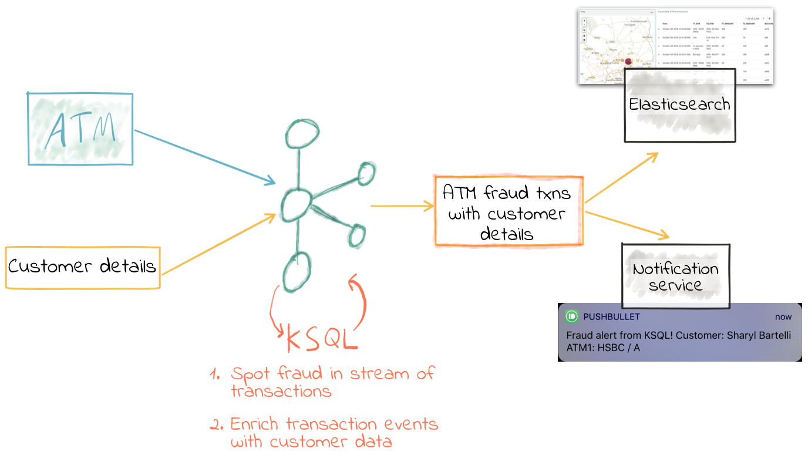
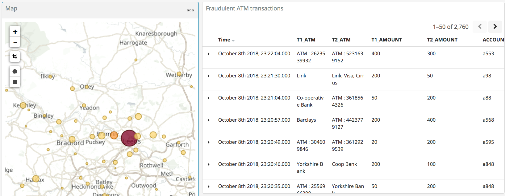
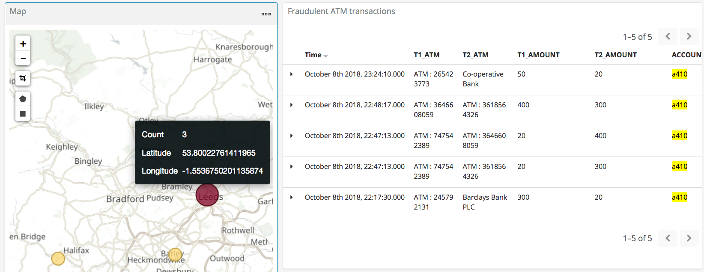
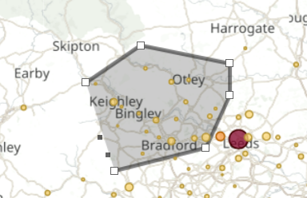
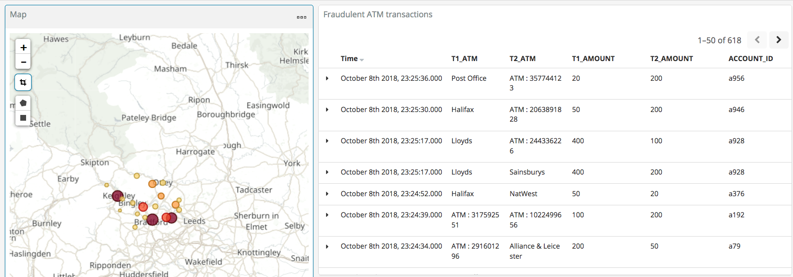
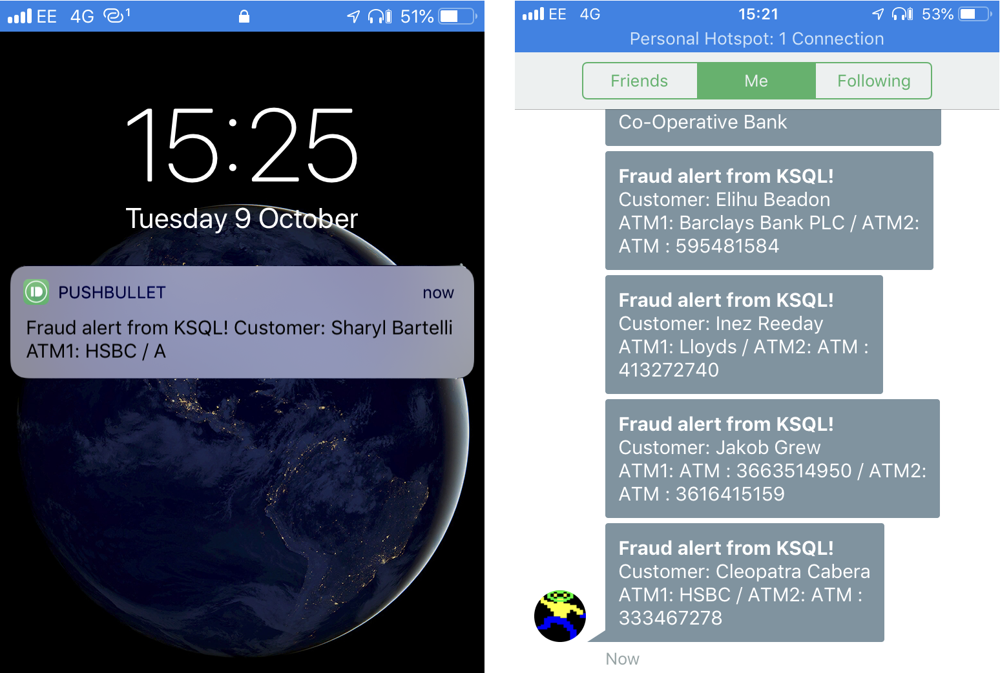

= ATM Fraud Detection with Apache Kafka® and KSQL
Robin Moffatt <robin@confluent.io>
v1.00, October 5, 2018

Detecting fraudulent transactions is one of the classic use-cases for real time data. The business value is clear: 

* Reduce exposure to risk by identifying fraud sooner in order to take action to stop it
* Improve customer experience by reducing false-positives

Traditionally fraud detection will have been done using stream processing applications written in Java, for example. Maybe using Kafka Streams, maybe Spark Streaming, but regardless of the framework, it required a strong understanding of the core language first. This reduces the base of developers who can access stream processing. KSQL changes this, because anyone who can write SQL can now write stream processing applications. 

KSQL is a _continuous query language_. Whilst you can use it for interactive exploration of data—as we will see in a moment—its core purpose it for building stream processing applications. Because KSQL is built on Kafka Streams, which is built on Kafka, it benefits from the horizontal scalability characteristics for both resilience and throughput. 

We're going to see here how taking a stream of inbound ATM transactions we can easily set up an application to detect transactions which look fraudulent. We'll use a three key factors in determining if we think a transaction is fraudulent: 

* The same account number has a previous transaction…
* …but at a different location
* …less than ten minutes after the previous one

As part of the processing we'll also calculate the distance (as the crow flies) between the two suspect transactions, the time between them, and thus how fast someone would have had to travel to plausibly make the transaction. This could feed into a second iteration of processing to refine the detection further. 

We're going to use Elasticsearch to store the transactions and enriched data, and Kibana to provide visualization and further data inspection capabilities.

== Streams of ATM Transactions

KSQL has supported joining between two streams of events since Confluent Platform 5.0. This means you can take two Kafka topics, and join between them on a common key. This could be something like a stream of order events, and a stream of shipment events—with a stream-stream join you can match up orders being placed to those being shipped. 

A stream-stream join can also make sense when done against the same stream of data, and that's how we're going to use it here. To start with, we're going to take a simplified stream of ATM transactions and use it to understand what a stream-stream join is doing and the semantics around it. Once we've done that, we'll dive into a full-blown example with a data generator and some realistic test data to use. 

I'm using Docker Compose to easily provision a test environment—if you want to follow along all the examples here you can find the https://github.com/confluentinc/demo-scene/tree/master/ksql-atm-fraud-detection[files on GitHub].

Here are three transactions, on three different account (`ac_01`, `ac_02`, `ac_03`). They have a transaction amount, and a location (both name, and coordinates). 

[source,javascript]
----
{"account_id": "ac_01", "atm": "ID_2276369282", "amount": 20, "location": {"lat": "38.6956033", "lon": "-121.5922283"}, "transaction_id": "01"}
{"account_id": "ac_02", "atm": "Flying Pig Bistro", "amount": 400, "location": {"lat": "37.766319", "lon": "-122.417422"}, "transaction_id": "02"}
{"account_id": "ac_03", "atm": "Wells Fargo", "amount": 50, "location": {"lat": "37.5522855", "lon": "-121.9797997"}, "transaction_id": "04"}
----

Let's pull this into KSQL and see what we can do…

[source,sql]
----
ksql> SET 'auto.offset.reset'='earliest';
ksql> CREATE STREAM ATM_TXNS (account_id VARCHAR, \
                            atm VARCHAR, \
                            location STRUCT<lon DOUBLE, \
                                            lat DOUBLE>, \
                            amount INT, \
                            transaction_id VARCHAR) \
                    WITH (KAFKA_TOPIC='atm_txns', \
                    VALUE_FORMAT='JSON');
ksql> SELECT ACCOUNT_ID, TRANSACTION_ID, AMOUNT, ATM FROM ATM_TXNS;
ac_01 | 01 | 20 | ID_2276369282
ac_02 | 02 | 400 | Flying Pig Bistro
ac_03 | 04 | 50 | Wells Fargo
----

So far, so good. No naughty transactions—just three regular ones from three different accounts. Now let's fire in two more. The first is a second transaction _at the same location_ for the same account (someone forgot to pick up the drinks bill!), the second one is our nefarious fraudster, with a clone of the card for account `ac_03` drawing cash from an ATM elsewhere: 

[source,javascript]
----
{"account_id": "ac_02", "atm": "Flying Pig Bistro", "amount": 40, "location": {"lat": "37.766319", "lon": "-122.417422"}, "transaction_id": "03"}
{"account_id": "ac_03", "atm": "Barclays", "amount": 500, "location": {"lat": "33.5522855", "lon": "-120.9797997"}, "transaction_id": "X05"}
----

You'll see these two new transactions appear straightaway in the KSQL output: 

[source,sql]
----
ksql> SELECT ACCOUNT_ID, TRANSACTION_ID, AMOUNT, ATM FROM ATM_TXNS;
ac_01 | 01 | 20 | ID_2276369282
ac_02 | 02 | 400 | Flying Pig Bistro
ac_03 | 04 | 50 | Wells Fargo
ac_02 | 03 | 40 | Flying Pig Bistro
ac_03 | X05 | 500 | Barclays
----

So `ac_03` is the one we're interested in; the transaction ID has an `X` prefix to help us spot it in the output, but the key thing is that it's the same account, but a different location (`Flying Pig Bistro` and then `Barclays`). What about time window? I'm glad you asked! 

All Kafka messages have a timestamp (as well as a key and value). This can be set by the producing application, or it will take the value of the time at which the message arrived at the broker. KSQL exposes the message's timestamp through the system column `ROWTIME`: 

[source,sql]
----
ksql> SELECT TIMESTAMPTOSTRING(ROWTIME, 'yyyy-MM-dd HH:mm:ss'),ACCOUNT_ID, TRANSACTION_ID, AMOUNT, ATM FROM ATM_TXNS;
2018-10-05 16:56:08 | ac_01 | 01 | 20 | ID_2276369282
2018-10-05 16:56:08 | ac_02 | 02 | 400 | Flying Pig Bistro
2018-10-05 16:56:08 | ac_03 | 04 | 50 | Wells Fargo
2018-10-05 17:01:59 | ac_02 | 03 | 40 | Flying Pig Bistro
2018-10-05 17:01:59 | ac_03 | X05 | 500 | Barclays
----

The two transactions for account `ac_03` occurred within the space of just over five minutes. 

By eyeballing this data, we can spot that something doesn't look right; but how do we express this in stream processing terms? Enter stream-stream joins. 

== Joining the Streams

Just as rows from two database tables can be joined, the same is possible with streams. The only difference is that since streams are _unbounded_ (semantically—and often in practice—there is no defined end to the events arriving on the stream) the join syntax needs to account for this. Whilst a join between two tables in a database will consider _all rows_ as candidates for matching on the join key, a stream-stream join will typically expect a window in which to look for events ("rows") to join. Otherwise the stream processing engine would have to cache all events, indefinitely. 

In KSQL the time window is expressed using the `WITHIN` clause of the join. You can specify either a single window value which applies _either side_ of the event, or two window values, giving the range _before_ and _after_ the event in which the join is to be evaluated. This time window is a convenient vehicle for our fraud criteria—any two transactions _within a ten minute window_ are to be captured. 

To start with, we'll create a second KSQL stream for the transaction events: 

[source,sql]
----
CREATE STREAM ATM_TXNS_02 WITH (PARTITIONS=1) AS SELECT * FROM ATM_TXNS;
----

Now we have two identical streams, one actually a clone of the first: 

[source,sql]
----
ksql> SHOW STREAMS;

 Stream Name | Kafka Topic | Format
------------------------------------
 ATM_TXNS    | atm_txns    | JSON
 ATM_TXNS_02 | ATM_TXNS_02 | JSON
------------------------------------

ksql> SELECT TIMESTAMPTOSTRING(ROWTIME, 'yyyy-MM-dd HH:mm:ss'),ACCOUNT_ID, TRANSACTION_ID, AMOUNT, ATM FROM ATM_TXNS_02;
2018-10-05 16:56:08 | ac_03 | 04 | 50 | Wells Fargo
2018-10-05 16:56:08 | ac_01 | 01 | 20 | ID_2276369282
2018-10-05 17:01:59 | ac_03 | X05 | 500 | Barclays
2018-10-05 16:56:08 | ac_02 | 02 | 400 | Flying Pig Bistro
2018-10-05 17:01:59 | ac_02 | 03 | 40 | Flying Pig Bistro
----

_In practice this is a necessary step that in principle could be handled by KSQL, and is tracked in https://github.com/confluentinc/ksql/issues/2030[GitHub issue 2030]._

With the two streams, let's join them: 

[source,sql]
----
ksql> SELECT TIMESTAMPTOSTRING(T1.ROWTIME, 'yyyy-MM-dd HH:mm:ss'), TIMESTAMPTOSTRING(T2.ROWTIME, 'yyyy-MM-dd HH:mm:ss'), \
        T1.ACCOUNT_ID, T2.ACCOUNT_ID, \
        T1.TRANSACTION_ID, T2.TRANSACTION_ID, \
        T1.LOCATION, T2.LOCATION \
FROM   ATM_TXNS T1 \
       INNER JOIN ATM_TXNS_02 T2 \
        WITHIN 10 MINUTES \
        ON T1.ACCOUNT_ID = T2.ACCOUNT_ID ;

2018-10-05 16:56:08 | 2018-10-05 16:56:08 | ac_01 | ac_01 | 01 | 01 | {LON=-121.5922283, LAT=38.6956033} | {LON=-121.5922283, LAT=38.6956033}
2018-10-05 16:56:08 | 2018-10-05 16:56:08 | ac_02 | ac_02 | 02 | 02 | {LON=-122.417422, LAT=37.766319} | {LON=-122.417422, LAT=37.766319}
2018-10-05 16:56:08 | 2018-10-05 17:01:59 | ac_02 | ac_02 | 02 | 03 | {LON=-122.417422, LAT=37.766319} | {LON=-122.417422, LAT=37.766319}
2018-10-05 16:56:08 | 2018-10-05 16:56:08 | ac_03 | ac_03 | 04 | 04 | {LON=-121.9797997, LAT=37.5522855} | {LON=-121.9797997, LAT=37.5522855}
2018-10-05 16:56:08 | 2018-10-05 17:01:59 | ac_03 | ac_03 | 04 | X05 | {LON=-121.9797997, LAT=37.5522855} | {LON=-120.9797997, LAT=33.5522855}
2018-10-05 17:01:59 | 2018-10-05 16:56:08 | ac_02 | ac_02 | 03 | 02 | {LON=-122.417422, LAT=37.766319} | {LON=-122.417422, LAT=37.766319}
2018-10-05 17:01:59 | 2018-10-05 17:01:59 | ac_02 | ac_02 | 03 | 03 | {LON=-122.417422, LAT=37.766319} | {LON=-122.417422, LAT=37.766319}
2018-10-05 17:01:59 | 2018-10-05 16:56:08 | ac_03 | ac_03 | X05 | 04 | {LON=-120.9797997, LAT=33.5522855} | {LON=-121.9797997, LAT=37.5522855}
2018-10-05 17:01:59 | 2018-10-05 17:01:59 | ac_03 | ac_03 | X05 | X05 | {LON=-120.9797997, LAT=33.5522855} | {LON=-120.9797997, LAT=33.5522855}
----

Looking at the output, there's a lot more here than just the fraudulent transaction we're expecting to identify. We can explain these additional matches thus: 

.KSQL S-S join results
[options="header",cols="e,m,m,m,m,m,m,m,m"]
|====================================================================================
|Commentary| T1 timestamp |T2 timestamp |T1 Account |T2 Account |T1 TXN ID |T2 TXN ID|T1 Location |T2 Location
|self-join|2018-10-05 16:56:08 | 2018-10-05 16:56:08 | ac_01 | ac_01 | 01 | 01 | {LON=-121.5922283, LAT=38.6956033} | {LON=-121.5922283, LAT=38.6956033}
|self-join|2018-10-05 16:56:08 | 2018-10-05 16:56:08 | ac_02 | ac_02 | 02 | 02 | {LON=-122.417422, LAT=37.766319} | {LON=-122.417422, LAT=37.766319}
|self-join|2018-10-05 16:56:08 | 2018-10-05 17:01:59 | ac_02 | ac_02 | 02 | 03 | {LON=-122.417422, LAT=37.766319} | {LON=-122.417422, LAT=37.766319}
|self-join|2018-10-05 16:56:08 | 2018-10-05 16:56:08 | ac_03 | ac_03 | 04 | 04 | {LON=-121.9797997, LAT=37.5522855} | {LON=-121.9797997, LAT=37.5522855}
|!FRAUD!|2018-10-05 16:56:08 | 2018-10-05 17:01:59 | ac_03 | ac_03 | 04 | X05 | {LON=-121.9797997, LAT=37.5522855} | {LON=-120.9797997, LAT=33.5522855}
|valid (same location, not shown) |2018-10-05 17:01:59 | 2018-10-05 16:56:08 | ac_02 | ac_02 | 03 | 02 | {LON=-122.417422, LAT=37.766319} | {LON=-122.417422, LAT=37.766319}
|self-join|2018-10-05 17:01:59 | 2018-10-05 17:01:59 | ac_02 | ac_02 | 03 | 03 | {LON=-122.417422, LAT=37.766319} | {LON=-122.417422, LAT=37.766319}
|!FRAUD! (duplicate)|2018-10-05 17:01:59 | 2018-10-05 16:56:08 | ac_03 | ac_03 | X05 | 04 | {LON=-120.9797997, LAT=33.5522855} | {LON=-121.9797997, LAT=37.5522855}
|self-join|2018-10-05 17:01:59 | 2018-10-05 17:01:59 | ac_03 | ac_03 | X05 | X05 | {LON=-120.9797997, LAT=33.5522855} | {LON=-120.9797997, LAT=33.5522855}
|====================================================================================

The first thing to do is weed out the join results where it's just the same event joining to itself (that is, the transaction ID is the same): 

[source,sql]
----
ksql> SELECT 
      […]
      WHERE   T1.TRANSACTION_ID != T2.TRANSACTION_ID ;

2018-10-05 17:01:59 | 2018-10-05 16:56:08 | ac_02 | ac_02 | 03 | 02 | {LON=-122.417422, LAT=37.766319} | {LON=-122.417422, LAT=37.766319}
2018-10-05 17:01:59 | 2018-10-05 16:56:08 | ac_03 | ac_03 | X05 | 04 | {LON=-120.9797997, LAT=33.5522855} | {LON=-121.9797997, LAT=37.5522855}
2018-10-05 16:56:08 | 2018-10-05 17:01:59 | ac_02 | ac_02 | 02 | 03 | {LON=-122.417422, LAT=37.766319} | {LON=-122.417422, LAT=37.766319}
2018-10-05 16:56:08 | 2018-10-05 17:01:59 | ac_03 | ac_03 | 04 | X05 | {LON=-121.9797997, LAT=37.5522855} | {LON=-120.9797997, LAT=33.5522855}
----

Much better. Now we just need to eliminate the transactions on the same account that took place at the same location—our fraud criteria determine those as not suspicious in this model. 

[source,sql]
----
ksql> SELECT 
        […]
      WHERE 
        […]
        (T1.location->lat != T2.location->lat OR \
         T1.location->lon != T2.location->lon);

2018-10-05 16:56:08 | 2018-10-05 17:01:59 | ac_03 | ac_03 | 04 | X05 | {LON=-121.9797997, LAT=37.5522855} | {LON=-120.9797997, LAT=33.5522855}
2018-10-05 17:01:59 | 2018-10-05 16:56:08 | ac_03 | ac_03 | X05 | 04 | {LON=-120.9797997, LAT=33.5522855} | {LON=-121.9797997, LAT=37.5522855}
----

Now the only two results are those on the account `ac_03`, one being genuine (Transaction ID 04) and one fraudulent (X05). We're getting both returned as each is an event on the left hand stream (the driving one), that joins to the other based on the time window specified (10 minutes before or after the driving event). So all we need to do is change our join window to only return events that happen *after* the one we're using to drive the join. To do this, simply specify a zero `BEFORE` threshold in the `WITHIN` criteria: 

[source,sql]
----
ksql> SELECT 
        […]
        FROM   ATM_TXNS T1 \
       INNER JOIN ATM_TXNS_02 T2 \
        WITHIN (0 MINUTES, 10 MINUTES) \
        ON T1.ACCOUNT_ID = T2.ACCOUNT_ID \
      […]

2018-10-05 16:56:08 | 2018-10-05 17:01:59 | ac_03 | ac_03 | 04 | X05 | {LON=-121.9797997, LAT=37.5522855} | {LON=-120.9797997, LAT=33.5522855}
----

With the core logic of the statement built, let's add in a few more bells and whistles. Using the built in `GEO_DISTANCE` function we can include a column in the output showing the distance between the two transactions: 

[source,sql]
----
ksql> SELECT 
        […]
        GEO_DISTANCE(T1.location->lat, T1.location->lon, T2.location->lat, T2.location->lon, 'KM') AS DISTANCE_BETWEEN_TXN_KM, \
        […]

 {LON=-121.9797997, LAT=37.5522855} | {LON=-120.9797997, LAT=33.5522855} | 453.87740037465375
----

So transaction `04` took place over 450km as the crow flies from `X05`. What was the time duration between them? We can observe from the timestamps pretty easily the answer to this, but more sensible is to include it in the query: 

[source,sql]
----
ksql> SELECT
        […]
        (T2.ROWTIME - T1.ROWTIME) AS MILLISECONDS_DIFFERENCE,  \
        (CAST(T2.ROWTIME AS DOUBLE) - CAST(T1.ROWTIME AS DOUBLE)) / 1000 / 60 AS MINUTES_DIFFERENCE,  \
        (CAST(T2.ROWTIME AS DOUBLE) - CAST(T1.ROWTIME AS DOUBLE)) / 1000 / 60 / 60 AS HOURS_DIFFERENCE,  \
        GEO_DISTANCE(T1.location->lat, T1.location->lon, T2.location->lat, T2.location->lon, 'KM') / ((CAST(T2.ROWTIME AS DOUBLE) - CAST(T1.ROWTIME AS DOUBLE)) / 1000 / 60 / 60) AS KMH_REQUIRED, 
        […]

351473 | 5.8578833333333336 | 0.09763138888888889 | 4648.888083433872 
----

We've also combined the distance and the time calculations to give us a derived calculation of the speed at which someone would have to move between the two events. At 4648 km/h, it's almost four times the https://en.wikipedia.org/wiki/ThrustSSC[fastest supersonic car]—we can be pretty sure it's fraudulent!

One remaining point to make about the above query is that the message's timestamp (`ROWTIME`) is cast from its `BIGINT` data type to `DOUBLE` so that the subsequent division arithmetic will work. 

== Running it with 'real' data

Let's now fire up our data generator to see what our query looks like against a continuous stream of transaction. I'm using an open source tool called `gess`, which I've https://github.com/rmoff/gess[forked and tweaked] to suit this demo. 

[source,bash]
----
python scripts/gess-main.py
----

It works by taking a list of ATMs, generates transactions against them, and emits these to UDP. UDP is a networking protocol in the same way that TCP is, but unlike UDP doesn't require any kind of acknowledgement of delivery—it just fires bytes out into the ether, and if someone picks them up that's great, and if not that's all-good too. It makes for a useful test-rig here where we can start up the data generator and simply 'tap into' the event stream as and when we want to. 

To route the events to Kafka from UDP, I'm using two great little commandline tools that any self-respecting engineer should know: netcat (`nc`), and `kafkacat`. Netcat listens for the UDP traffic, which is then piped to `kafkacat`. `kafkacat` simply takes any input from `stdin` and sends it as messages to the target topic. 

Here's netcat picking up the events: 

[source,bash]
----
$ nc -v -u -l 6900
{"account_id": "a9", "timestamp": "2018-10-07T20:40:48.585666", "atm": "ATM : 3616415159", "amount": 50, "location": {"lat": "53.8233994", "lon": "-1.4865327"}, "transaction_id": "e406bf57-ca68-11e8-a4cb-186590d22a35"}
{"account_id": "a102", "timestamp": "2018-10-07T20:40:49.087221", "atm": "Co-op Bank", "amount": 400, "location": {"lat": "53.7986913", "lon": "-1.2518281"}, "transaction_id": "e4534754-ca68-11e8-a119-186590d22a35"}
{"account_id": "a496", "timestamp": "2018-10-07T20:40:49.589651", "atm": "Link", "amount": 50, "location": {"lat": "53.8442149", "lon": "-1.5094248"}, "transaction_id": "e49ff142-ca68-11e8-9c4f-186590d22a35"}
{"account_id": "a223", "timestamp": "2018-10-07T20:40:50.093244", "atm": "ATM : 5523013160", "amount": 400, "location": {"lat": "53.6781485", "lon": "-1.4991026"}, "transaction_id": "e4ecc8fd-ca68-11e8-9132-186590d22a35"}
[...]
----

and now piping it to a Kafka topic: 

[source,bash]
----
$ nc -v -u -l 6900 | docker run --interactive --rm --network ksql-atm-fraud-detection_default confluentinc/cp-kafkacat kafkacat -b kafka:29092 -P -t atm_txns_gess
----

Note that there's no console output from this, because it's being redirected to `kafkacat`. 

== Event time processing with KSQL

We need to make one change to the KSQL statement that we developed above. Whereas we were previously using the Kafka message timestamp as the event rowtime, now we want to use the `timestamp` field that's included in the payload of the message. This is easy to do with KSQL, by simply specifying the `TIMESTAMP` field in the `WITH` clause: 

[source,sql]
----
CREATE STREAM ATM_TXNS_GESS (account_id VARCHAR, \
                            atm VARCHAR, \
                            location STRUCT<lon DOUBLE, \
                                            lat DOUBLE>, \
                            amount INT, \
                            timestamp VARCHAR, \
                            transaction_id VARCHAR) \
            WITH (KAFKA_TOPIC='atm_txns_gess', \
            VALUE_FORMAT='JSON', \
            TIMESTAMP='timestamp', \
            TIMESTAMP_FORMAT='yyyy-MM-dd HH:mm:ss X');
----

Just to check that KSQL is indeed picking up the value of `timestamp` field in the source message, let's run a query to report the `timestamp` field's value along with the system column `ROWTIME` which represents the timestamp with which KSQL will process the message: 

[source,sql]
----
ksql> SELECT TIMESTAMPTOSTRING(ROWTIME, 'yyyy-MM-dd HH:mm:ss Z'), timestamp FROM ATM_TXNS_GESS;
2018-10-07 22:31:39 +0000 | 2018-10-07 22:31:39 +0000
2018-10-07 22:31:40 +0000 | 2018-10-07 22:31:40 +0000
2018-10-07 22:26:58 +0000 | 2018-10-07 22:26:58 +0000
2018-10-07 22:31:41 +0000 | 2018-10-07 22:31:41 +0000
----

As expected, they match. One subtlety to notice here is that the third message above is dated _earlier_ than the one previously. That's because the ATM transactions may be arriving out of order, but KSQL will process them based on **event time** (i.e. `timestamp` value in the source message, when the _actual ATM transaction occurred) rather than **processing time** (when the message arrived at the system)

Bringing together our new source stream (`ATM_TXNS_GESS`) with the logic we prototyped above gives us this code to run: 

[source,sql]
----
CREATE STREAM ATM_TXNS_GESS_02 WITH (PARTITIONS=1) AS SELECT * FROM ATM_TXNS_GESS;

CREATE STREAM ATM_POSSIBLE_FRAUD  \
    WITH (PARTITIONS=1) AS \
SELECT T1.ROWTIME AS T1_TIMESTAMP, T2.ROWTIME AS T2_TIMESTAMP, \
        GEO_DISTANCE(T1.location->lat, T1.location->lon, T2.location->lat, T2.location->lon, 'KM') AS DISTANCE_BETWEEN_TXN_KM, \
        (T2.ROWTIME - T1.ROWTIME) AS MILLISECONDS_DIFFERENCE,  \
        (CAST(T2.ROWTIME AS DOUBLE) - CAST(T1.ROWTIME AS DOUBLE)) / 1000 / 60 AS MINUTES_DIFFERENCE,  \
        GEO_DISTANCE(T1.location->lat, T1.location->lon, T2.location->lat, T2.location->lon, 'KM') / ((CAST(T2.ROWTIME AS DOUBLE) - CAST(T1.ROWTIME AS DOUBLE)) / 1000 / 60 / 60) AS KMH_REQUIRED, \
        T1.ACCOUNT_ID AS ACCOUNT_ID, \
        T1.TRANSACTION_ID, T2.TRANSACTION_ID, \
        T1.AMOUNT, T2.AMOUNT, \
        T1.ATM, T2.ATM, \
        CAST(T1.location->lat AS STRING) + ',' + CAST(T1.location->lon AS STRING) AS T1_LOCATION, \
        CAST(T2.location->lat AS STRING) + ',' + CAST(T2.location->lon AS STRING) AS T2_LOCATION \
FROM   ATM_TXNS_GESS T1 \
       INNER JOIN ATM_TXNS_GESS_02 T2 \
        WITHIN (0 MINUTES, 10 MINUTES) \
        ON T1.ACCOUNT_ID = T2.ACCOUNT_ID \
WHERE   T1.TRANSACTION_ID != T2.TRANSACTION_ID \
  AND   (T1.location->lat != T2.location->lat OR \
         T1.location->lon != T2.location->lon) \
  AND   T2.ROWTIME != T1.ROWTIME;
----

And checking the output shows that there are plenty of fraudulent transactions being detected: 

[source,sql]
----
SELECT T1_ACCOUNT_ID, \
        TIMESTAMPTOSTRING(T1_TIMESTAMP, 'yyyy-MM-dd HH:mm:ss'), TIMESTAMPTOSTRING(T2_TIMESTAMP, 'HH:mm:ss'), \
        T1_ATM, T2_ATM, \
        DISTANCE_BETWEEN_TXN_KM, MINUTES_DIFFERENCE \
FROM ATM_POSSIBLE_FRAUD;

a739 | 2018-10-08 15:35:58 | 15:38:31 | Halifax | Barclays Bank PLC | 15.698597512981406 | 2.55
a649 | 2018-10-08 15:36:22 | 15:38:04 | Yorkshire Bank | Barclays Bank PLC | 23.179463348879413 | 1.7
[...]
----

++++

++++

The execution statistics shows that we've processed multiple message—that is, we've detected many possibly fraudulent transactions:

[source,sql]
----
ksql> DESCRIBE EXTENDED ATM_POSSIBLE_FRAUD;

[...]
Kafka topic          : ATM_POSSIBLE_FRAUD (partitions: 1, replication: 1)
[...]
Local runtime statistics
------------------------
messages-per-sec:      0.85   total-messages:       324     last-message: 10/9/18 11:25:11 AM UTC
[...]
----

There are some changes to note from the query that we iteratively built up at the beginning of this article. These are just to streamline and tidy it up—the core logic is the same: 

* Add `CREATE STREAM … AS` to tell KSQL to persist this as a streaming application, and populate the named stream as a Kafka topic with the results
* Retain the timestamp as an epoch, rather than the `VARCHAR` I've been using for printing it in human-readable format
* Only include one of the `ACCOUNT_ID` fields in the output (since they are equal, as stated in the `JOIN` criteria)
* Remove an intermediate calculated columns of the time difference between the two transactions 
* Include the name of the ATM at which each transaction took place
* Wrangle the source `LOCATION` column (a `STRUCT` by default) into a comma-separated `STRING`. This is necessary for being able to index it into Elasticsearch as a `geopoint`

== Kafka + Elastic = ❤️

Using the above KSQL application we've got a Kafka topic being populated with suspect ATM transactions. We can query this from the command line in KSQL to inspect it, but at the end of the day it's just a Kafka topic. We can use this Kafka topic for multiple independent purposes: 

* drive a microservice—perhaps to trigger an alert or block on a particular card
* stream the data to a store such as Elasticsearch for visualization and analysis in Kibana

Streaming data from Kafka to Elasticsearch is easy using Kafka Connect and the Elasticsearch connector. Check out the code on GitHub for full details but in essence it's two scripts: 

1. A dynamic mapping template for the Elasticsearch indices so that things like geopoints and timestamps are set up correctly
2. Kafka Connect JSON configuration specifying the Kafka topics from which to stream data and the corresponding Elasticsearch indices to load

With the data in Elasticsearch we can easily build some powerful dashboards and analyses with Kibana. Here's a view of all suspected fraudulent activity in a region, with hotspots highlighted: 

By selecting a specific account all ATM transactions for that account can be shown for further analysis. Here any fraud alerts for account `a410` are shown and plotted on the map: 

You can also use Kibana to draw a bounding-box around a particular region of the map to filter events just for that area: 

== Enriching streams of events 

We've taken an inbound stream of events, and used KSQL to populate a Kafka topic of transactions that look possibly fraudulent. But all we have to go on is the account number. Wouldn't it be more useful if we can include in our event stream information about the account itself? We can then show in this not only in the visual analysis, but also use it to drive notifications directly. 

Let's assume that we have all of our customer information in a database. Pretty standard place to keep it. It's maintained by a separate application, and it is our master store of customer data. Here I'm using MySQL but it could be any RDBMS really: 

[source,sql]
----
mysql> SELECT FIRST_NAME, LAST_NAME, EMAIL, ADDRESS FROM accounts WHERE ACCOUNT_ID='a42';
+------------+-----------+--------------------+------------------+
| FIRST_NAME | LAST_NAME | EMAIL              | ADDRESS          |
+------------+-----------+--------------------+------------------+
| Robin      | Moffatt   | robin@confluent.io | 22 Acacia Avenue |
+------------+-----------+--------------------+------------------+
1 row in set (0.00 sec)
----

Using Kafka Connect and a CDC tool such as Debezium we can stream the contents of it to a Kafka topic, as well as _any changes made to the data, in real time_. With the data in a Kafka topic, it's possible to model it as a table and join it to the event stream of ATM transactions: 

[source,sql]
----
ksql> SELECT FIRST_NAME, LAST_NAME, EMAIL, ADDRESS FROM accounts WHERE ACCOUNT_ID='a42';
Robin | Moffatt | robin@confluent.io | 22 Acacia Avenue
----

If something changes in the database, it's reflected straight away in the Kafka topic (and thus KSQL table too): 

++++

++++

So with an accurate mirror of the data from the table available in KSQL, it's a simple matter to join this to the stream of ATM transactions: 

[source,sql]
----
ksql> SELECT A.ACCOUNT_ID, \
        C.FIRST_NAME + ' ' + C.LAST_NAME, \
        C.EMAIL, C.PHONE, \
        C.ADDRESS, \
        TIMESTAMPTOSTRING(A.T1_TIMESTAMP, 'yyyy-MM-dd HH:mm:ss'), TIMESTAMPTOSTRING(A.T2_TIMESTAMP, 'HH:mm:ss'), \
        A.T1_ATM, A.T2_ATM, \
        A.DISTANCE_BETWEEN_TXN_KM, A.MINUTES_DIFFERENCE \
FROM ATM_POSSIBLE_FRAUD A LEFT OUTER JOIN ACCOUNTS C ON A.ACCOUNT_ID = C.ACCOUNT_ID;  

a279 | Shandeigh Isakovic | sisakovic5n@upenn.edu | +44 645 302 9358 | 49 Nevada Center | 2018-10-09 13:42:07 | 13:47:21 | Yorkshire Bank | ATM : 319429912 | 12.536338916950928 | 5.233333333333333
a769 | Kathe Cutteridge | kcutteridgehg@gov.uk | +44 501 421 3436 | 5 Jackson Pass | 2018-10-09 13:45:47 | 13:47:35 | Barclays | Co-Op | 14.448491852409132 | 1.8
[…]
----

Persisting this as another new Kafka topic gives us this rich stream of events, every time an ATM transaction occurs matching our fraud criteria, and includes all the information we might want to be able to contact the customer concerned:

image::images/kafka_ksql_kibana_atm_fraud_05.png[]

The same data is used to drive fraud notifications direct to customers' phones: 

== Conclusion 

We've seen a couple of key concepts with KSQL here: 

- Detect patterns in a stream of data based on an event's time relative to another's, as well as characteristics of the two events
- Populate a target Kafka topic with a real time feed of these events matching the defined conditions
- Denormalize data, bringing together events (facts) and additional information about entities within those (dimensions)

The enriched data from the Kafka topic (which is being continually populated by KSQL) is streamed into Elasticsearch using Kafka Connect, and from there analysis and visualiation done in Kibana. This same enriched topic serves as the driver for a microservices responsible for further actions based on suspected fraud on an account, such as putting a temporary hold on it or notifying the account holder. 

< CTA >
