= Troubleshooting KSQL - Part 2: What's happening under the covers?
//:source-highlighter: pygments

Robin Moffatt <robin@confluent.io>
v1.00, September 20, 2018

== Introduction

KSQL is the powerful SQL Streaming engine for Apache Kafka. Using standard SQL statements you can build powerful stream processing applications. https://www.confluent.io/blog/[Previously] we saw how to troubleshoot one of the most common issues that people have with KSQL—queries not returning data. In this article we'll dig deeper into the internals for more advanced troubleshooting, as well as to just understand better how it all works.

You can use this article for reference, or you can follow along with the code examples to try them out as we go. Using Docker and Docker Compose, we can easily provision an environment in which to explore and try out the different techniques and tools. The environment includes a data generator for a continuous stream of events into a Kafka topic that we will use for testing. You'll find all the necessary code on https://github.com/confluentinc/demo-scene/blob/ksql-troubleshooting/ksql-troubleshooting/[GitHub].

So now let's dive in and start exploring what to do when things aren't working…

== How many messages have been processed by a KSQL query? 

In KSQL you can populate Kafka topics with the results of a query. You do this using the `CREATE STREAM…AS SELECT` syntax: 

[source,sql]
----
ksql> CREATE STREAM GOOD_IOS_RATINGS AS \
        SELECT * FROM RATINGS WHERE STARS >= 4 \
                                AND CHANNEL='iOS';
----

Because KSQL queries are continuous, this means that we've just written and executed an application. It takes the inbound data, filters it for a condition, and writes any matches to the target topic. 

What does any self-respecting application need? Metrics! How many messages have been processed? When was the last message processed? And so on. 

The simplest option is from within KSQL itself, using the same `DESCRIBE EXTENDED` command that we saw previously: 

[source,sql]
----
ksql> DESCRIBE EXTENDED GOOD_RATINGS;
[...]
Local runtime statistics
------------------------
messages-per-sec:      1.10   total-messages:      2898     last-message: 9/17/18 1:48:47 PM UTC
 failed-messages:         0 failed-messages-per-sec:         0      last-failed:       n/a
(Statistics of the local KSQL server interaction with the Kafka topic GOOD_RATINGS)
ksql>
----

Of note here is also the `failed-messages` count - if that's going up, then it's not a good sign for the health of your query. It could be caused by serialization errors, as discussed earlier. 

== What's happening under the covers? 

You can dig deeper into the execution of queries. Let's start by listing the queries that are running: 

[source,sql]
----
ksql> SHOW QUERIES;

 Query ID                | Kafka Topic      | Query String
--------------------------------------------------------------------------------------------------------------------------------------------------------------------------
 CSAS_GOOD_IOS_RATINGS_0 | GOOD_IOS_RATINGS | CREATE STREAM GOOD_IOS_RATINGS AS     SELECT * FROM RATINGS WHERE STARS >= 4                             AND CHANNEL='iOS';
--------------------------------------------------------------------------------------------------------------------------------------------------------------------------
----

Just the one, populating `GOOD_IOS_RATINGS` with the CSAS statement we ran above. The query's called `CSAS_GOOD_IOS_RATINGS_0` (note, this name is non-deterministic). 

We can examine the query itself, and how KSQL is going to perform the transformation we've asked it to, through the explain plan—the same thing as you get in RDBMS. To access it, use the `EXPLAIN` command: 

[source,sql]
----
ksql> EXPLAIN CSAS_GOOD_IOS_RATINGS_0;

[...]

Execution plan
--------------
 > [ SINK ] Schema: [ROWTIME : BIGINT, ROWKEY : VARCHAR, RATING_ID : BIGINT, USER_ID : BIGINT, STARS : INT, ROUTE_ID : BIGINT, RATING_TIME : BIGINT, CHANNEL : VARCHAR, MESSAGE : VARCHAR].
                 > [ PROJECT ] Schema: [ROWTIME : BIGINT, ROWKEY : VARCHAR, RATING_ID : BIGINT, USER_ID : BIGINT, STARS : INT, ROUTE_ID : BIGINT, RATING_TIME : BIGINT, CHANNEL : VARCHAR, MESSAGE : VARCHAR].
                                 > [ FILTER ] Schema: [RATINGS.ROWTIME : BIGINT, RATINGS.ROWKEY : VARCHAR, RATINGS.RATING_ID : BIGINT, RATINGS.USER_ID : BIGINT, RATINGS.STARS : INT, RATINGS.ROUTE_ID : BIGINT, RATINGS.RATING_TIME : BIGINT, RATINGS.CHANNEL : VARCHAR, RATINGS.MESSAGE : VARCHAR].
                                                 > [ SOURCE ] Schema: [RATINGS.ROWTIME : BIGINT, RATINGS.ROWKEY : VARCHAR, RATINGS.RATING_ID : BIGINT, RATINGS.USER_ID : BIGINT, RATINGS.STARS : INT, RATINGS.ROUTE_ID : BIGINT, RATINGS.RATING_TIME : BIGINT, RATINGS.CHANNEL : VARCHAR, RATINGS.MESSAGE : VARCHAR].
----

Because KSQL is built on Kafka Streams, and executes queries using it, the `EXPLAIN` command can also tell you the topology Kafka Streams will use: 

[source,sql]
----
ksql> EXPLAIN CSAS_GOOD_IOS_RATINGS_0;

[...]

Processing topology
-------------------
Topologies:
   Sub-topology: 0
    Source: KSTREAM-SOURCE-0000000000 (topics: [ratings])
      --> KSTREAM-MAPVALUES-0000000001
    Processor: KSTREAM-MAPVALUES-0000000001 (stores: [])
      --> KSTREAM-TRANSFORMVALUES-0000000002
      <-- KSTREAM-SOURCE-0000000000
    Processor: KSTREAM-TRANSFORMVALUES-0000000002 (stores: [])
      --> KSTREAM-FILTER-0000000003
      <-- KSTREAM-MAPVALUES-0000000001
    Processor: KSTREAM-FILTER-0000000003 (stores: [])
      --> KSTREAM-MAPVALUES-0000000004
      <-- KSTREAM-TRANSFORMVALUES-0000000002
    Processor: KSTREAM-MAPVALUES-0000000004 (stores: [])
      --> KSTREAM-MAPVALUES-0000000005
      <-- KSTREAM-FILTER-0000000003
    Processor: KSTREAM-MAPVALUES-0000000005 (stores: [])
      --> KSTREAM-SINK-0000000006
      <-- KSTREAM-MAPVALUES-0000000004
    Sink: KSTREAM-SINK-0000000006 (topic: GOOD_IOS_RATINGS)
      <-- KSTREAM-MAPVALUES-0000000005
----

Taking the query name, you can even go and poke around the KSQL Server log, and see the Kafka Streams applications firing up, with the query name as part of their client id: 

[source,bash]
----
ksql-server_1      | [2018-09-19 21:05:40,625] INFO stream-thread [_confluent-ksql-confluent_rmoff_01query_CSAS_GOOD_IOS_RATINGS_0-c36ebad2-f969-40e1-9b59-757305cf3b61-StreamThread-5] State transition from CREATED to RUNNING (org.apache.kafka.streams.processor.internals.StreamThread:209)
----

The KSQL Server log is where you'd head if you're suspecting problems with your queries that you can't diagnose through the KSQL CLI itself. 

=== Locating KSQL Server logs

KSQL writes most of its logs to `stdout` by default. If you're https://hub.docker.com/r/confluentinc/cp-ksql-server/[running KSQL using Docker] then you'll find the output in the container logs themselves, for example: 

* `docker logs 483b1958efc4` 
* `docker-compose logs ksql-server`

Using the Confluent CLI you can run : 

* `confluent log ksql-server`

If you've installed Confluent Platform using rpm/deb then you should find the logs under `/var/log/confluent/`. 

== Digging deeper with Confluent Control Center and JMX

=== Confluent Control Center

Part of Confluent Enterprise, Confluent Control Center gives you powerful monitoring, management, and alerting capabilities for your Apache Kafka environment. From a KSQL point of view there's a KSQL editor for building and exploring KSQL objects, and crucially a streams monitoring capability. 

With streams monitoring you can check: 

- What's the message throughput rate of the pipeline? 
- Were all messages that were written to Kafka consumed by the downstream application (which includes KSQL)? 
- Were any messages consumed more than once? 
- What was the latency of each consumer? 

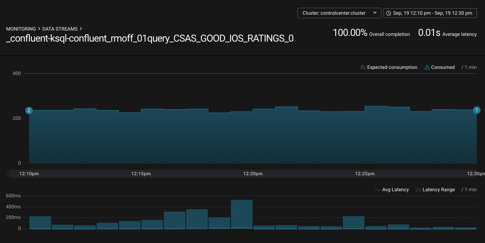

You can drill down into individual topics and consumers to inspect their particular behaviour. Here we can see that there are two Kafka Streams threads, only one of which (`StreamThread-2`) is consuming data. The reason for that is the source topic has a single partition:

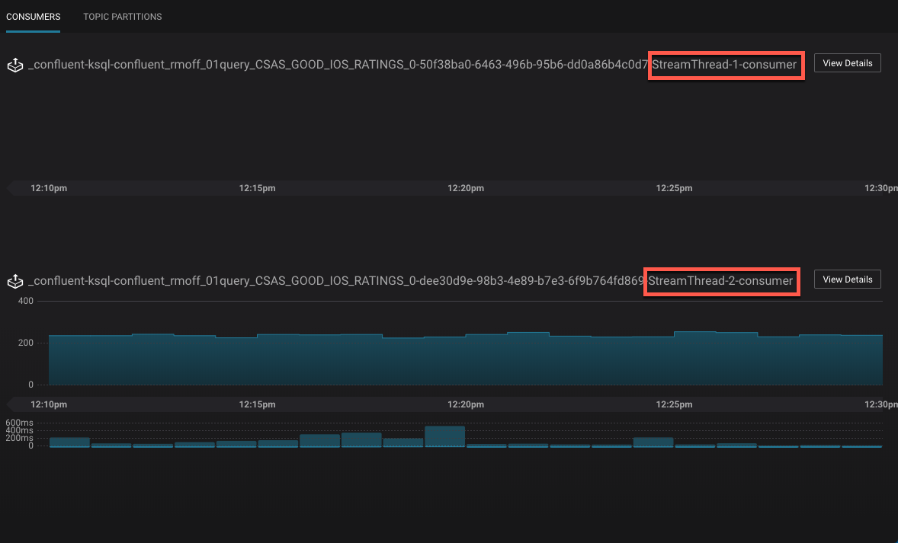

If we repartition the topic to four partitions, the Kafka Streams/KSQL task then consumes this over four threads: 

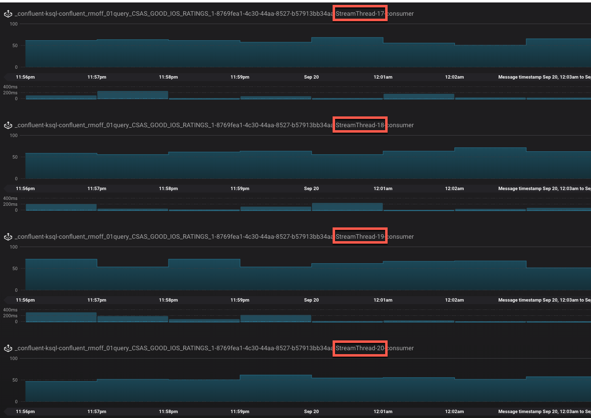

Confluent Control Center can also show you when consumers are over-consuming. That could be because messages are being processed more than once—or as the case is in this screenshot, the required monitoring interceptors haven't been set up on the producer. 

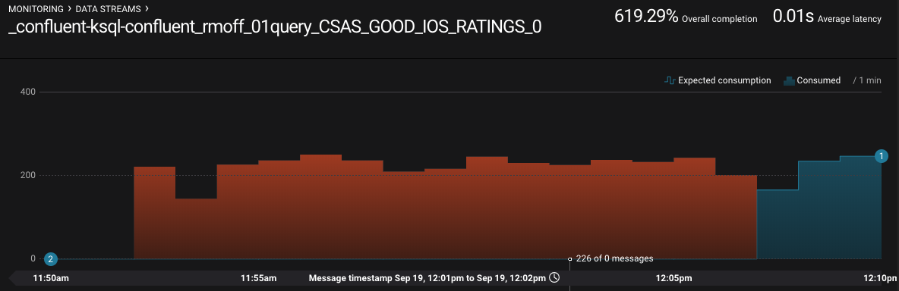

=== JMX 

So Confluent Control Center is very cool for inspecting the flow of data in topics and behaviour of producers and consumers. But how about peeking inside how those producers and consumers are actually behaving? KSQL, as with other components in the Apache Kafka ecosystem, exposes a wealth of metrics through JMX. You can access these on an ad hoc basis through something like https://rmoff.net/2018/09/19/exploring-jmx-with-jmxterm/[jmxterm] or https://docs.oracle.com/javase/8/docs/technotes/guides/management/jconsole.html[JConsole] as seen here: 

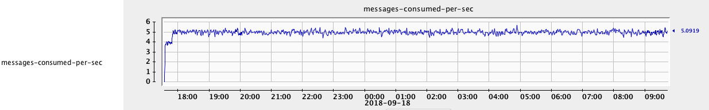

Much more useful is to persist them to a datastore (such as InfluxDB) for subsequent analysis (for example through Grafana): 

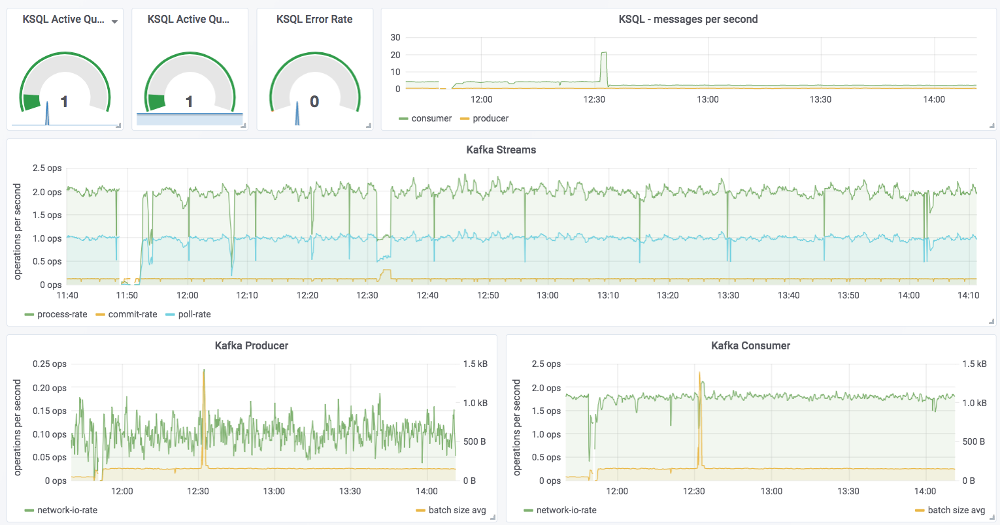

You can see messages being consumed by KSQL (all data from the `ratings` topic) and produced by it (to the `GOOD_IOS_RATINGS` stream with messages matching the `STARS >= 4 AND CHANNEL='iOS'` criteria). Just by looking at it you can determine that roughly 15% (0.26 divided by 1.96) of the messages are passing through from the source (`ratings`) to the target (`GOOD_IOS_RATINGS`): 

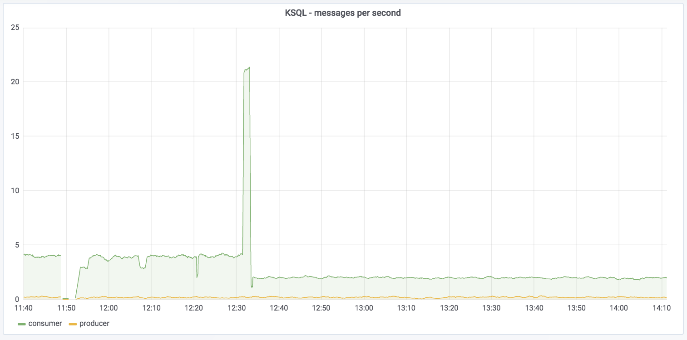

The spike at 12:31 coincides with when I ran the example in https://www.confluent.io/blog/[part 1] of trying to read messages with the wrong serialization format defined. Handily enough, there's also a JMX metric we can track for errors: 

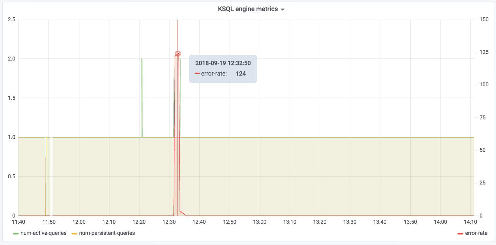

Note the spike in `error-rate`, amd also the increase in `num-active-queries`—which makes sense, since there was the additional query running at the time against the invalid stream (in addition to the one already running against `ratings`).

You can dig down into the underlying Kafka Streams metrics: 

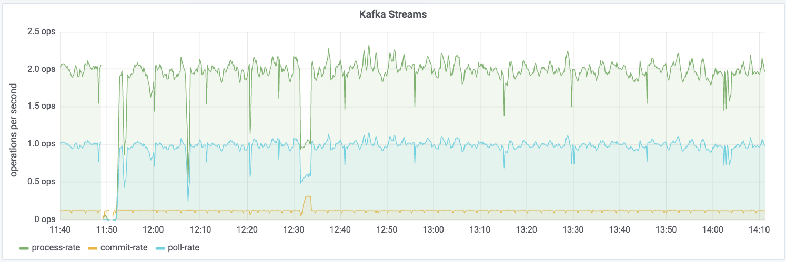

Kafka Streams is itself built on Kafka, and you can drill down to the underlying Kafka Producer and Consumer metrics too:

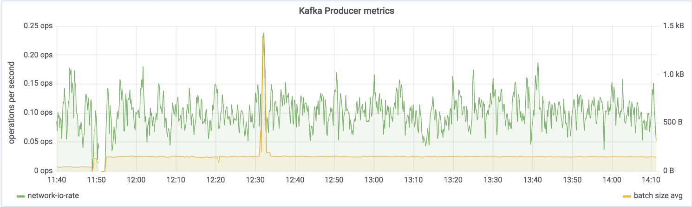
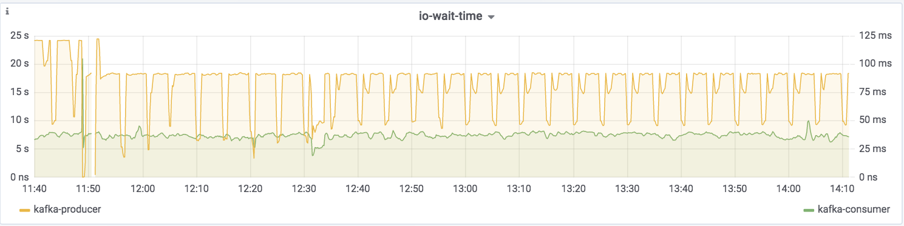

If you want to try this out for yourself and explore the JMX metrics, you can use the https://github.com/confluentinc/demo-scene/tree/master/ksql-troubleshooting[complete code samples on GitHub].

For details of the specific metrics see: 

*  https://docs.confluent.io/current/streams/monitoring.html#accessing-metrics-via-jmx-and-reporters[Kafka Streams docs]
* https://kafka.apache.org/documentation/#monitoring[Apache Kafka docs]

== Where Next? 

So you're still stuck, and you need more help? There's several places to turn: 

* KSQL is supported as part of the Confluent Enterprise platform— https://www.confluent.io/contact/[contact us for details]
* Community support for KSQL is available: 
** http://cnfl.io/slack[Confluent Community Slack] #ksql channel
** https://github.com/confluentinc/ksql/issues[Search for similar issues] on GitHub, or  https://github.com/confluentinc/ksql/issues/new[raise a new issue] if one doesn't exist

Other articles in this series: 

* https://www.confluent.io/blog/[Part 1: Why's my KSQL query not returning data?]