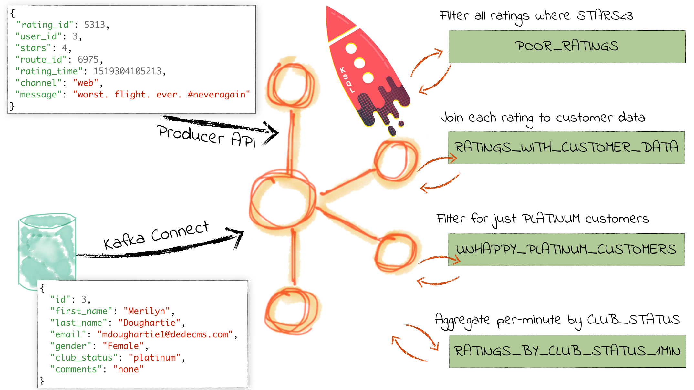

= Workshop: Real-time SQL Stream Processing at Scale with Apache Kafka and KSQL
:source-highlighter: pygments
:doctype: book
Robin Moffatt <@rmoff>
v0.10, 19 Jun 2018

:toc:

== Introduction

This is a two-hour hands-on workshop.

[quote]
____
KSQL is the streaming SQL engine for Apache Kafka. Using just SQL it is possible for developers to build powerful stream processing applications. This talk will show practical examples of KSQL:

* Filtering streams of data
* Joining live events with reference data from a database
* Stateful aggregations
* Convert streams from JSON to AVRO
____

Don't forget to check out the #ksql channel on our https://slackpass.io/confluentcommunity[Community Slack group]

——_Robin Moffatt https://twitter.com/rmoff/[@rmoff], 19 Jun 2018_

== Pre-requisites

* Docker
* Docker Compose
* 8GB+ RAM

IMPORTANT: *THIS MUST BE DONE _BEFORE_ THE WORKSHOP - The docker images are large and will take time to download. Please don't wait until the workshop as the wi-fi will not cope!*

[IMPORTANT]
====

0. In Docker’s advanced settings, increase the memory dedicated to Docker to at least 8GB.
** Don't forget to do this

1. Clone the workshop repo to your local machine:
+
[source,bash]
----
git clone https://github.com/confluentinc/demo-scene.git
----

0. Did you remember to increase the memory dedicated to Docker to at least 8GB?
** You really do need to do this

2. Change working directory
+
[source,bash]
----
cd ksql-workshop
----

0. How much memory did you allocate to Docker? It needs to be >= 8 GB!
** Nothing will work if you don't do this

3. Pull all required docker images—this will take a while!
+
[source,bash]
----
docker-compose pull
----
====

== Start Confluent Platform

NOTE: In Docker’s advanced settings, increase the memory dedicated to Docker to at least 8GB.

[source,bash]
----
cd ksql-workshop
docker-compose up -d
docker-compose logs -f kafka|grep "INFO Kafka version"
----

Once you see output then it means Kafka is running and you can proceed

[source,bash]
----
$ docker-compose logs -f kafka|grep "INFO Kafka version"
kafka_1                 | [2018-06-19 11:37:32,586] INFO Kafka version : 1.1.1-cp1 (org.apache.kafka.common.utils.AppInfoParser)
----

Press Ctrl-C twice to exit the `docker-compose logs` command

Run `docker-compose ps` to confirm that all components are running:

[source,bash]
----
$ docker-compose ps
     Name                    Command               State                        Ports
-----------------------------------------------------------------------------------------------------------
connect           /etc/confluent/docker/run        Up      0.0.0.0:8083->8083/tcp, 9092/tcp
control-center    /etc/confluent/docker/run        Up      0.0.0.0:9021->9021/tcp
kafka             /etc/confluent/docker/run        Up      0.0.0.0:29092->29092/tcp, 0.0.0.0:9092->9092/tcp
ksql-server       perl -e while(1){ sleep 99 ...   Up      0.0.0.0:8088->8088/tcp
rest-proxy        /etc/confluent/docker/run        Up      0.0.0.0:8082->8082/tcp
schema-registry   /etc/confluent/docker/run        Up      0.0.0.0:8081->8081/tcp
zookeeper         /etc/confluent/docker/run        Up      0.0.0.0:2181->2181/tcp, 2888/tcp, 3888/tcp
----

== Populate Customers topic manually

[source,bash]
----
cat data/customers.json | \
docker run --interactive \
           --network ksql-workshop_default \
           confluentinc/cp-kafkacat \
           kafkacat -b kafka:29092 \
                    -t customers \
                    -P
----

== Inspect Customers topic data

[source,bash]
----
docker run --network ksql-workshop_default \
          --tty --interactive \
          confluentinc/cp-kafkacat \
          kafkacat -b kafka:29092 -C -K: \
          -f '\nKey (%K bytes): %k\t\nValue (%S bytes): %s\n\Partition: %p\tOffset: %o\n--\n' \
          -t customers
----

<<<

== Inspect Ratings topic data

[source,bash]
----
docker run --network ksql-workshop_default \
          --tty --interactive \
          confluentinc/cp-kafkacat \
          kafkacat -b kafka:29092 -C -K: \
          -f '\nKey (%K bytes): %k\t\nValue (%S bytes): %s\n\Partition: %p\tOffset: %o\n--\n' \
          -t ratings
----

Note that the data is in Avro, so you will see lots of special characters in the output.

Press Ctrl-C to cancel

<<<

== Launch KSQL CLI

[source,bash]
----
docker-compose exec ksql-cli ksql http://ksql-server:8088
----

Make sure that you get a successful start up screen:

[source,bash]
----
Copyright 2017 Confluent Inc.

CLI v5.0.0-SNAPSHOT, Server v5.0.0-SNAPSHOT located at http://ksql-server:8088

Having trouble? Type 'help' (case-insensitive) for a rundown of how things work!

ksql>
----

== See available Kafka topics

[source,sql]
----
ksql> show topics;

 Kafka Topic      | Registered | Partitions | Partition Replicas | Consumers | Consumer Groups
-----------------------------------------------------------------------------------------------
 _schemas         | false      | 1          | 1                  | 0         | 0
 connect-configs  | false      | 1          | 1                  | 0         | 0
 connect-offsets  | false      | 25         | 1                  | 0         | 0
 connect-statuses | false      | 5          | 1                  | 0         | 0
 ksql__commands   | true       | 1          | 1                  | 0         | 0
 ratings          | false      | 1          | 1                  | 0         | 0
 customers        | false      | 1          | 1                  | 0         | 0
-----------------------------------------------------------------------------------------------
----

<<<
=== Inspect a topic contents - Ratings

[TIP]
====
Don't need to know the format of the data. Can see column names and values.
====

`PRINT 'ratings';`

Explain TS/Key/Message concept

[source,sql]
----
ksql> PRINT 'ratings';
Format:AVRO
22/02/18 12:55:04 GMT, 5312, {"rating_id": 5312, "user_id": 4, "stars": 4, "route_id": 2440, "rating_time": 1519304104965, "channel": "web", "message": "Surprisingly good, maybe you are getting your mojo back at long last!"}
22/02/18 12:55:05 GMT, 5313, {"rating_id": 5313, "user_id": 3, "stars": 4, "route_id": 6975, "rating_time": 1519304105213, "channel": "web", "message": "why is it so difficult to keep the bathrooms clean ?"}
----

<<<
=== Inspect a topic contents - Customers

Don't need to know the format of the data. Can see column names and values.

`PRINT 'customers' FROM BEGINNING;`

<<<
=== Tell KSQL to process from beginning of topic

Process from beginning of topic

`SET 'auto.offset.reset' = 'earliest';`

[source,sql]
----
ksql> SET 'auto.offset.reset' = 'earliest';
Successfully changed local property 'auto.offset.reset' from 'null' to 'earliest'
----

<<<
=== Register Ratings topic for querying

`CREATE STREAM ratings WITH (KAFKA_TOPIC='ratings', VALUE_FORMAT='AVRO');`

Why's it a stream? Because it's a continuous stream of *events*

[source,sql]
----
ksql> CREATE STREAM ratings WITH (KAFKA_TOPIC='ratings', VALUE_FORMAT='AVRO');

 Message
---------------
 Table created
---------------
----

<<<
=== Describe ratings stream

`DESCRIBE ratings;`

Note :

1. System columns for timestamp and key
2. All the other columns have been picked up automagically - have not had to specify them

[source,sql]
----
ksql> DESCRIBE ratings;

 Field       | Type
-----------------------------------------
 ROWTIME     | BIGINT           (system)
 ROWKEY      | VARCHAR(STRING)  (system)
 RATING_ID   | BIGINT
 USER_ID     | INTEGER
 STARS       | INTEGER
 ROUTE_ID    | INTEGER
 RATING_TIME | BIGINT
 CHANNEL     | VARCHAR(STRING)
 MESSAGE     | VARCHAR(STRING)
-----------------------------------------
For runtime statistics and query details run: DESCRIBE EXTENDED <Stream,Table>;
----

<<<
=== Query ratings stream

`SELECT * FROM ratings;`

This is a continuous query!

[source,sql]
----
ksql> SELECT * FROM ratings;
1519402268942 | 1 | 1 | 13 | 1 | 3700 | 1519402267832 | ios | airport refurb looks great, will fly outta here more!
1519402269200 | 2 | 2 | 12 | 2 | 9907 | 1519402269200 | android | (expletive deleted)
1519402269694 | 3 | 3 | 2 | 1 | 5421 | 1519402269694 | android | is this as good as it gets? really ?
1519402269857 | 4 | 4 | 18 | 2 | 1462 | 1519402269856 | android | your team here rocks!
----

Cancel the datagen task - note that the query stops.

Restart the datagen task - query now continues to return data

<<<
=== Filter the ratings stream

`SELECT USER_ID, STARS, CHANNEL, MESSAGE FROM ratings WHERE STARS <3 AND CHANNEL='iOS' LIMIT 5;`

Note the use of `LIMIT` so that we just see a sample of the stream of data

[source,sql]
----
ksql> SELECT USER_ID, STARS, CHANNEL, MESSAGE FROM ratings WHERE STARS <3 AND CHANNEL='iOS' LIMIT 5;
7 | 1 | iOS | thank you for the most friendly, helpful experience today at your new lounge
12 | 1 | iOS | is this as good as it gets? really ?
12 | 2 | iOS | more peanuts please
16 | 2 | iOS | worst. flight. ever. #neveragain
10 | 2 | iOS | why is it so difficult to keep the bathrooms clean ?
Limit Reached
Query terminated
----

<<<
=== Persist a filtered stream

==== Create the stream

Let's take the poor ratings from people with iOS devices, and create a new stream from them!

[source,sql]
----
CREATE STREAM POOR_RATINGS AS SELECT * FROM ratings WHERE STARS <3 AND CHANNEL='iOS';
----

[source,sql]
----
ksql> CREATE STREAM POOR_RATINGS AS SELECT * FROM ratings WHERE STARS <3 AND CHANNEL='iOS';

 Message
----------------------------
 Stream created and running
----------------------------
----

<<<
==== Inspect the stream

[source,sql]
----
DESCRIBE POOR_RATINGS;
----

[source,sql]
----
ksql> DESCRIBE POOR_RATINGS;

 Field       | Type
-----------------------------------------
 ROWTIME     | BIGINT           (system)
 ROWKEY      | VARCHAR(STRING)  (system)
 RATING_ID   | BIGINT
 USER_ID     | INTEGER
 STARS       | INTEGER
 ROUTE_ID    | INTEGER
 RATING_TIME | BIGINT
 CHANNEL     | VARCHAR(STRING)
 MESSAGE     | VARCHAR(STRING)
-----------------------------------------
For runtime statistics and query details run: DESCRIBE EXTENDED <Stream,Table>;
ksql>
----

<<<
==== Inspect the stream further

[source,sql]
----
DESCRIBE EXTENDED POOR_RATINGS;
----

[source,sql]
----
ksql> DESCRIBE EXTENDED POOR_RATINGS;

Name                 : POOR_RATINGS
Type                 : STREAM
Key field            :
Key format           : STRING
Timestamp field      : Not set - using <ROWTIME>
Value format         : AVRO
Kafka topic          : POOR_RATINGS (partitions: 4, replication: 1)

 Field       | Type
-----------------------------------------
 ROWTIME     | BIGINT           (system)
 ROWKEY      | VARCHAR(STRING)  (system)
 RATING_ID   | BIGINT
 USER_ID     | INTEGER
 STARS       | INTEGER
 ROUTE_ID    | INTEGER
 RATING_TIME | BIGINT
 CHANNEL     | VARCHAR(STRING)
 MESSAGE     | VARCHAR(STRING)
-----------------------------------------

Queries that write into this STREAM
-----------------------------------
CSAS_POOR_RATINGS_0 : CREATE STREAM POOR_RATINGS AS SELECT * FROM ratings WHERE STARS <3 AND CHANNEL='iOS';

For query topology and execution plan please run: EXPLAIN <QueryId>

Local runtime statistics
------------------------
messages-per-sec:      2.18   total-messages:       217     last-message: 6/20/18 11:09:11 AM UTC
 failed-messages:         0 failed-messages-per-sec:         0      last-failed:       n/a
(Statistics of the local KSQL server interaction with the Kafka topic POOR_RATINGS)
----

<<<
==== Query the stream

[source,sql]
----
SELECT STARS, CHANNEL, MESSAGE FROM POOR_RATINGS;
----

[source,sql]
----
ksql> SELECT STARS, CHANNEL, MESSAGE FROM POOR_RATINGS;
1 | iOS | thank you for the most friendly, helpful experience today at your new lounge
1 | iOS | why is it so difficult to keep the bathrooms clean ?
2 | iOS | worst. flight. ever. #neveragain
2 | iOS | your team here rocks!
2 | iOS | more peanuts please
----

<<<
==== See the Kafka Topic

It's just a Kafka topic!

[source,bash]
----
ksql> show topics;

 Kafka Topic        | Registered | Partitions | Partition Replicas | Consumers | ConsumerGroups
------------------------------------------------------------------------------------------------
 _confluent-metrics | false      | 12         | 1                  | 0         | 0
 _schemas           | false      | 1          | 1                  | 0         | 0
 customers          | false      | 1          | 1                  | 0         | 0
 POOR_RATINGS       | true       | 4          | 1                  | 0         | 0
 ratings            | true       | 1          | 1                  | 1         | 1
------------------------------------------------------------------------------------------------
----

<<<
==== Inspect the Kafka topic's data

[source,bash]
----
ksql> print 'POOR_RATINGS';
Format:AVRO
6/20/18 11:01:03 AM UTC, 37, {"RATING_ID": 37, "USER_ID": 12, "STARS": 2, "ROUTE_ID": 8916, "RATING_TIME": 1529492463400, "CHANNEL": "iOS", "MESSAGE": "more peanuts please"}
6/20/18 11:01:07 AM UTC, 55, {"RATING_ID": 55, "USER_ID": 10, "STARS": 2, "ROUTE_ID": 5232, "RATING_TIME": 1529492467552, "CHANNEL": "iOS", "MESSAGE": "why is it so difficult to keep the bathrooms clean ?"}
----

<<<
=== Joining Data in KSQL

Remember our Customer data? Let's bring that into play, and use it to enrich the inbound stream of ratings data.

<<<
==== Inspect Customers Data

Let's check the data first, using the very handy `PRINT` command:

`PRINT 'customers' FROM BEGINNING;`

[source,sql]
----
ksql> PRINT 'customers' FROM BEGINNING;
Format:JSON
{"ROWTIME":1529492614185,"ROWKEY":"null","id":1,"first_name":"Annemarie","last_name":"Arent","email":"aarent0@cpanel.net","gender":"Female","club_status":"platinum","comments":"Organized web-enabled ability"}
----

<<<

==== Re-Key Customers Topic

Define source stream

[source,sql]
----
ksql> CREATE STREAM CUSTOMERS_SRC (id BIGINT, first_name VARCHAR, last_name VARCHAR, email VARCHAR, gender VARCHAR, club_status VARCHAR, comments VARCHAR) WITH (KAFKA_TOPIC='customers', VALUE_FORMAT='JSON');

 Message
----------------
 Stream created
----------------
ksql>
----

KSQL to continually transform source topic into keyed topic, and re-serialise into Avro:
[source,sql]
----
ksql> CREATE STREAM CUSTOMERS_SRC_REKEY WITH (PARTITIONS=1, VALUE_FORMAT='AVRO') AS SELECT * FROM CUSTOMERS_SRC PARTITION BY ID;

 Message
----------------------------
 Stream created and running
----------------------------
ksql>
----

Wait for a moment here; if you run the CTAS _immediately_ after the CSAS it may fail
with error `Could not fetch the AVRO schema from schema registry. Subject not found.; error code: 40401`

==== Create Customers Table

Now, create a `TABLE` over the Kafka topic. Why's it a table? Because for each key (user id), we want to know its value (name, status, etc)

[source,sql]
----
ksql> CREATE TABLE CUSTOMERS WITH (KAFKA_TOPIC='CUSTOMERS_SRC_REKEY', VALUE_FORMAT ='AVRO', KEY='ID');

 Message
---------------
 Table created
---------------
ksql>
----

Query the table:

[source,sql]
----
ksql> SELECT ID, FIRST_NAME, LAST_NAME, EMAIL, CLUB_STATUS FROM CUSTOMERS;
1 | Annemarie | Arent | aarent0@cpanel.net | platinum
2 | Merilyn | Doughartie | mdoughartie1@dedecms.com | platinum
----

==== [Optional] Demonstrate why the re-key is required

[source,sql]
----
ksql> SELECT C.ROWKEY, C.ID FROM CUSTOMERS_SRC C LIMIT 3;
null | 1
null | 2
null | 3
Limit Reached
Query terminated

ksql> SELECT C.ROWKEY, C.ID FROM CUSTOMERS C LIMIT 3;
1 | 1
2 | 2
3 | 3
Limit Reached
Query terminated
ksql>
----

<<<
==== Stream-Table join (1)

Now let's join our ratings data, which includes user ID, to our user information:

Basics to start with -- rating message plus the user's name.

Couple of things to note:
* We're aliasing the table and stream names to make column names unambiguous
* I'm using the backspace line continuation character

[source,sql]
----
SELECT R.MESSAGE, U.FIRST_NAME, U.LAST_NAME \
FROM RATINGS R LEFT JOIN CUSTOMERS U \
ON R.USER_ID = U.ID \
LIMIT 5;
----

[source,sql]
----
ksql> SELECT R.MESSAGE, U.FIRST_NAME, U.LAST_NAME \
> FROM RATINGS R LEFT JOIN CUSTOMERS U \
> ON R.USER_ID = U.ID \
> LIMIT 5;
Surprisingly good, maybe you are getting your mojo back at long last! | null | null
thank you for the most friendly, helpful experience today at your new lounge | Allyn | Langlois
airport refurb looks great, will fly outta here more! | Mirilla | Orwin
is this as good as it gets? really ? | Mirilla | Orwin
more peanuts please | Gianina | Mixhel
Limit Reached
Query terminated
ksql>
----

<<<
==== Stream-Table join (2)

Now let's pull the full set of data, including a reformat of the timestamp into something human readable:

Note the `IS NOT NULL` clause to filter out any ratings with no corresponding user data

[source,sql]
----
SELECT TIMESTAMPTOSTRING(R.RATING_TIME, 'yyyy-MM-dd HH:mm:ss'), R.RATING_ID, R.STARS, R.ROUTE_ID,  R.CHANNEL, \
R.MESSAGE, U.FIRST_NAME, U.LAST_NAME, U.CLUB_STATUS \
FROM RATINGS R LEFT JOIN CUSTOMERS U \
ON R.USER_ID = U.ID WHERE U.LAST_NAME IS NOT NULL;
----

[source,sql]
----
ksql> SELECT TIMESTAMPTOSTRING(R.RATING_TIME, 'yyyy-MM-dd HH:mm:ss'), R.RATING_ID, R.STARS, R.ROUTE_ID,  R.CHANNEL, \
> R.MESSAGE, U.FIRST_NAME, U.LAST_NAME, U.CLUB_STATUS \
> FROM RATINGS R LEFT JOIN CUSTOMERS U \
> ON R.USER_ID = U.ID WHERE U.LAST_NAME IS NOT NULL;
2018-06-20 11:00:53 | 2 | 1 | 537 | web | thank you for the most friendly, helpful experience today at your new lounge | Allyn | Langlois | gold
2018-06-20 11:00:54 | 3 | 2 | 5028 | android | airport refurb looks great, will fly outta here more! | Mirilla | Orwin | gold
2018-06-20 11:00:54 | 4 | 4 | 3557 | web | is this as good as it gets? really ? | Mirilla | Orwin | gold
----

<<<
==== Stream-Table join (3)

Let's persist this as an enriched stream:

[source,sql]
----
CREATE STREAM RATINGS_WITH_CUSTOMER_DATA WITH (PARTITIONS=1) AS \
SELECT R.RATING_ID, R.CHANNEL, R.STARS, R.MESSAGE, \
       C.ID, C.CLUB_STATUS, C.EMAIL, \
       C.FIRST_NAME, C.LAST_NAME \
FROM RATINGS R \
     LEFT JOIN CUSTOMERS C \
       ON R.USER_ID = C.ID \
WHERE C.FIRST_NAME IS NOT NULL ;
----

[source,sql]
----
ksql> CREATE STREAM RATINGS_WITH_CUSTOMER_DATA WITH (PARTITIONS=1) AS \
> SELECT R.RATING_ID, R.CHANNEL, R.STARS, R.MESSAGE, \
>        C.ID, C.CLUB_STATUS, C.EMAIL, \
>        C.FIRST_NAME, C.LAST_NAME \
> FROM RATINGS R \
>      LEFT JOIN CUSTOMERS C \
>        ON R.USER_ID = C.ID \
> WHERE C.FIRST_NAME IS NOT NULL ;

 Message
----------------------------
 Stream created and running
----------------------------
----

<<<
=== Filtering an enriched stream

Which of our Premier customers are not happy?

`SELECT * FROM RATINGS_WITH_CUSTOMER_DATA WHERE CLUB_STATUS='platinum' AND STARS <3;`

[source,sql]
----
ksql> SELECT * FROM RATINGS_WITH_CUSTOMER_DATA WHERE CLUB_STATUS='platinum' AND STARS <3;
1529492455187 | 2 | 8 | web | 2 | Exceeded all my expectations. Thank you ! | 2 | platinum | mdoughartie1@dedecms.com | Merilyn | Doughartie
1529492479155 | 1 | 100 | iOS-test | 1 | is this as good as it gets? really ? | 1 | platinum | aarent0@cpanel.net | Annemarie | Arent
----

<<<
==== Persist the filtered & enriched stream

[source,sql]
----
CREATE STREAM UNHAPPY_PLATINUM_CUSTOMERS \
       WITH (VALUE_FORMAT='JSON') AS \
SELECT CLUB_STATUS, EMAIL, STARS, MESSAGE \
FROM   RATINGS_WITH_CUSTOMER_DATA \
WHERE  STARS < 3 \
  AND  CLUB_STATUS = 'platinum';
----

[source,sql]
----
ksql> CREATE STREAM UNHAPPY_PLATINUM_CUSTOMERS \
>        WITH (VALUE_FORMAT='JSON') AS \
> SELECT CLUB_STATUS, EMAIL, STARS, MESSAGE \
> FROM   RATINGS_WITH_CUSTOMER_DATA \
> WHERE  STARS < 3 \
>   AND  CLUB_STATUS = 'platinum';

 Message
----------------------------
 Stream created and running
----------------------------
ksql>
ksql>
----

<<<
==== Query the new stream

`SELECT STARS, MESSAGE, NAME FROM UNHAPPY_VIPS;`

[source,sql]
----
ksql> SELECT STARS, MESSAGE, EMAIL FROM UNHAPPY_PLATINUM_CUSTOMERS;
1 | is this as good as it gets? really ? | aarent0@cpanel.net
2 | airport refurb looks great, will fly outta here more! | aarent0@cpanel.net
2 | meh | aarent0@cpanel.net
----

<<<
==== View the underlying topic data

[source,sql]
----
ksql> SHOW TOPICS;

 Kafka Topic                | Registered | Partitions | Partition Replicas | Consumers | ConsumerGroups
--------------------------------------------------------------------------------------------------------
 _confluent-metrics         | false      | 12         | 1                  | 0         | 0
 _schemas                   | false      | 1          | 1                  | 0         | 0
 customers                  | true       | 1          | 1                  | 2         | 2
 CUSTOMERS_SRC_REKEY        | true       | 1          | 1                  | 0         | 0
 POOR_RATINGS               | true       | 4          | 1                  | 0         | 0
 ratings                    | true       | 1          | 1                  | 2         | 2
 RATINGS_WITH_CUSTOMER_DATA | true       | 1          | 1                  | 1         | 1
 UNHAPPY_PLATINUM_CUSTOMERS | true       | 4          | 1                  | 0         | 0
--------------------------------------------------------------------------------------------------------
ksql>
----

[source,sql]
----
ksql> PRINT UNHAPPY_PLATINUM_CUSTOMERS;
----

[source,sql]
----
ksql> PRINT 'UNHAPPY_PLATINUM_CUSTOMERS';
Format:JSON
{"ROWTIME":1529492479155,"ROWKEY":"1","MESSAGE":"is this as good as it gets? really ?","CLUB_STATUS":"platinum","STARS":1,"EMAIL":"aarent0@cpanel.net"}
{"ROWTIME":1529492488095,"ROWKEY":"1","MESSAGE":"airport refurb looks great, will fly outta here more!","CLUB_STATUS":"platinum","STARS":2,"EMAIL":"aarent0@cpanel.net"}
----

<<<
=== Streaming Aggregates

Explain windowing

* Tumbling (e.g. every 5 minutes : 00:00, 00:05, 00:10)
* Hopping (e.g. every 5 minutes, advancing 1 minute: 00:00-00:05, 00:01-00:06)
* Session (Sets a timeout for the given key, after which any new data is treated as a new session)

<<<
==== Running Count per Minute

Show count of ratings per customer status, per minute

[source,sql]
----
SELECT CLUB_STATUS, COUNT(*) AS RATING_COUNT \
FROM RATINGS_WITH_CUSTOMER_DATA WINDOW TUMBLING (SIZE 1 MINUTES) \
GROUP BY CLUB_STATUS;
----

[source,sql]
----
ksql> SELECT CLUB_STATUS, COUNT(*) AS RATING_COUNT \
> FROM RATINGS_WITH_CUSTOMER_DATA WINDOW TUMBLING (SIZE 1 MINUTES) \
> GROUP BY CLUB_STATUS;
platinum | 1
bronze | 2
gold | 12
bronze | 13
----

<<<
==== CREATE TABLE

Let's persist that into a TABLE. So far we've only worked with a STREAM. A table gives the state of a given key at a given point in time. So here, for each club status, at each minute window, what's the total count

[source,sql]
----
CREATE TABLE RATINGS_BY_CLUB_STATUS AS \
SELECT CLUB_STATUS, COUNT(*) AS RATING_COUNT \
FROM RATINGS_WITH_CUSTOMER_DATA WINDOW TUMBLING (SIZE 1 MINUTES) \
GROUP BY CLUB_STATUS;
----

[source,sql]
----
ksql> CREATE TABLE RATINGS_BY_CLUB_STATUS AS \
> SELECT CLUB_STATUS, COUNT(*) AS RATING_COUNT \
> FROM RATINGS_WITH_CUSTOMER_DATA WINDOW TUMBLING (SIZE 1 MINUTES) \
> GROUP BY CLUB_STATUS;

 Message
---------------------------
 Table created and running
---------------------------
ksql>
----

<<<
==== Examine the created table's columns

`DESCRIBE RATINGS_BY_CLUB_STATUS;`

Note that the city is denoted as `(key)`

[source,sql]
----
ksql> DESCRIBE RATINGS_BY_CLUB_STATUS;

Name                 : RATINGS_BY_CLUB_STATUS
 Field        | Type
------------------------------------------
 ROWTIME      | BIGINT           (system)
 ROWKEY       | VARCHAR(STRING)  (system)
 CLUB_STATUS  | VARCHAR(STRING)
 RATING_COUNT | BIGINT
------------------------------------------
For runtime statistics and query details run: DESCRIBE EXTENDED <Stream,Table>;
ksql>
----

Note the system columns - `ROWTIME` and `ROWKEY`.

<<<
==== Examine the contents of the new table's columns

`SELECT ROWTIME, ROWKEY, CLUB_STATUS, RATING_COUNT FROM RATINGS_BY_CLUB_STATUS LIMIT 5;`

[source,sql]
----
ksql> SELECT ROWTIME, ROWKEY, CLUB_STATUS, RATING_COUNT FROM RATINGS_BY_CLUB_STATUS LIMIT 5;
1529492400000 | bronze : Window{start=1529492400000 end=-} | bronze | 2
1529492460000 | bronze : Window{start=1529492460000 end=-} | bronze | 13
1529492520000 | bronze : Window{start=1529492520000 end=-} | bronze | 23
1529492580000 | bronze : Window{start=1529492580000 end=-} | bronze | 15
1529492640000 | bronze : Window{start=1529492640000 end=-} | bronze | 31
Limit Reached
Query terminated
ksql>
----

<<<
==== Using Functions like `TIMESTAMPTOSTRING`

KSQL comes with a bunch of functions, both scalar and aggregate (like `COUNT` which we saw previously).

Let's convert the `ROWTIME` epoch value to a more readable one:

`SELECT TIMESTAMPTOSTRING(ROWTIME, 'yyyy-MM-dd HH:mm:ss') AS WINDOW_START_TS, CLUB_STATUS, RATING_COUNT FROM RATINGS_BY_CLUB_STATUS;`

[source,sql]
----
ksql> SELECT TIMESTAMPTOSTRING(ROWTIME, 'yyyy-MM-dd HH:mm:ss') AS WINDOW_START_TS, CLUB_STATUS, RATING_COUNT FROM RATINGS_BY_CLUB_STATUS;
2018-06-20 11:00:00 | platinum | 1
2018-06-20 11:01:00 | platinum | 22
2018-06-20 11:02:00 | platinum | 29
2018-06-20 11:03:00 | platinum | 27
2018-06-20 11:04:00 | platinum | 23
----

<<<
==== Filtering the aggregate table

This table is just a first class object in KSQL, that we can query and filter as any other:

`SELECT TIMESTAMPTOSTRING(ROWTIME, 'yyyy-MM-dd HH:mm:ss') AS WINDOW_START_TS, CLUB_STATUS, RATING_COUNT FROM RATINGS_BY_CLUB_STATUS WHERE CLUB_STATUS='bronze';`

[source,sql]
----
ksql> SELECT TIMESTAMPTOSTRING(ROWTIME, 'yyyy-MM-dd HH:mm:ss') AS WINDOW_START_TS, CLUB_STATUS, RATING_COUNT FROM RATINGS_BY_CLUB_STATUS WHERE CLUB_STATUS='bronze';
2018-06-20 11:00:00 | bronze | 2
2018-06-20 11:01:00 | bronze | 13
2018-06-20 11:02:00 | bronze | 23
2018-06-20 11:03:00 | bronze | 15
----

Note how aggregates update within the current window.
