= Streaming ETL on Confluent with Maritime AIS data
Robin Moffatt <robin@confluent.io>
v1.00, 05 March 2021

:toc:

One of the canonical examples of streaming data is location data over time. Whether it's https://www.confluent.io/resources/kafka-summit-2020/can-kafka-handle-a-lyft-ride/[ride-sharing vehicles], the https://www.confluent.io/blog/build-streaming-etl-solutions-with-kafka-and-rail-data/[position of trains on the rail network], or https://simon-aubury.medium.com/using-ksql-apache-kafka-a-raspberry-pi-and-a-software-defined-radio-to-find-the-plane-that-wakes-14f6f9e74584[tracking airplanes waking up your cat], handling the stream of data in realtime enables functionality for businesses and their customers in a way that is just not possible in the batch world. Here I'm going to explore another source of streaming data, but away from road and rail—out at sea, with data from ships. 

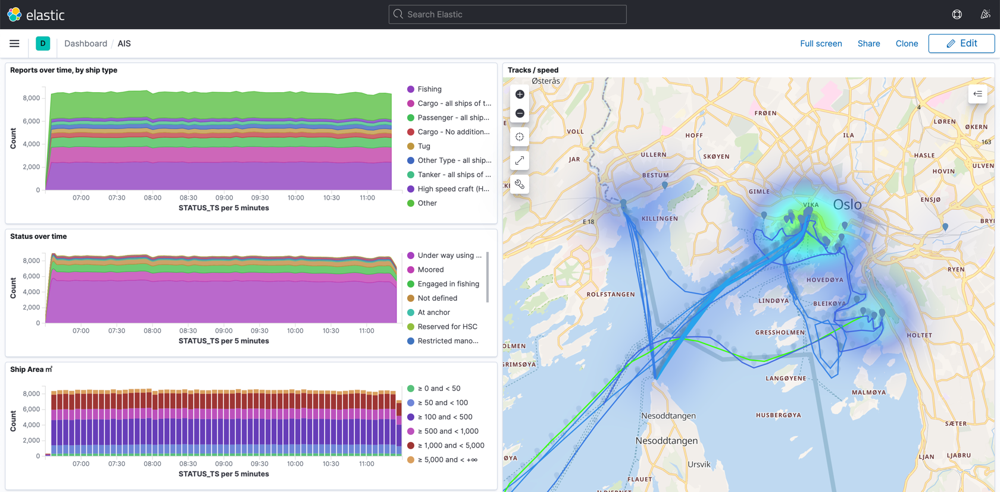

https://help.marinetraffic.com/hc/en-us/articles/204581828-What-is-the-Automatic-Identification-System-AIS-[Automatic identification system (AIS) data] is broadcast by most ships and can be consumed passively by anyone with a receiver. By streaming a feed of AIS data into Apache Kafka it's possible to use it for various purposes, each of which I'm going to explore in more detail below. 

* *Analytics*, both realtime and ad-hoc data exploration. We use _streaming ETL_ to build a pipeline to cleanse and transform the data.

* *Stream processing* to identify patterns in the data that could suggest certain behaviour. 
+
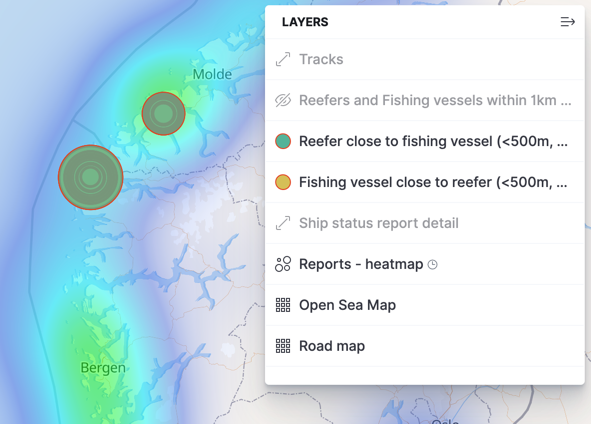

== AIS Data

The AIS data source that I used came from a https://www.kystverket.no/en/navigation-and-monitoring/ais/access-to-ais-data/[public feed] published under the https://data.norge.no/nlod/en/2.0/[Norwegian licence for Open Government data (NLOD)] distributed by the Norwegian Coastal Administration. It covers: 

> AIS data from all vessels within a coverage area that includes the Norwegian economic zone and the protection zones off Svalbard and Jan Mayen, but with the exception of fishing vessels under 15 meters and recreational vessels under 45 meters.

Any AIS data stream can contain messages of different types. There's a great resource https://gpsd.gitlab.io/gpsd/AIVDM.html#_ais_payload_interpretation[here] that explains all the different types and fields associated with each. For example, message type 01 is a `Position Report`, but doesn't include details about the vessel. For that, you need message type 05 (`Static and Voyage Related Data`). 

Often an AIS source will be provided as a feed on a TCPIP port (as in the case of the one I am using here). As a raw feed it's not much to look at: 

[source,bash]
----
$ nc 153.44.253.27 5631
\s:2573485,c:1614772291*0C\!BSVDM,1,1,,A,13maq;7000151TNWKWIA3r<v00SI,0*01
\s:2573250,c:1614772291*02\!BSVDO,1,1,,B,402M3hQvDickN0PTuPRwwH7000S:,0*37
!BSVDM,1,1,,A,13o;a20P@K0LIqRSilCa?W4t0<2<,0*19
\s:2573450,c:1614772291*04\!BSVDM,1,1,,B,13m<?c00000tBT`VuBT1anRt00Rs,0*0D
\s:2573145,c:1614772291*05\!BSVDM,1,1,,B,13m91<001IPPnJlQ9HVJppo00<0;,0*33
----

Fortunately https://gpsd.io/[GPSd] provides https://gpsd.gitlab.io/gpsd/gpsdecode.html[`gpsdecode`] which makes a lot more sense of it: 

[source,javascript]
----
$ nc 153.44.253.27 5631|gpsdecode |jq --unbuffered '.'
{
  "class": "AIS",
  "device": "stdin",
  "type": 1,
  "repeat": 0,
  "mmsi": 259094000,
  "scaled": true,
  "status": 0,
  "status_text": "Under way using engine",
  "turn": 0,
  "speed": 11.4,
  "accuracy": false,
  "lon": 7.085755,
  "lat": 62.656673,
  "course": 179.1,
  "heading": 186,
  "second": 9,
  "maneuver": 0,
  "raim": false,
  "radio": 98618
}
----

== Analytics

Let's take a look at the kind of analytics we can easily create from this data, before then taking a step back and walking through how to build it. I'm using Kibana on top of the data held in Elasticsearch, with https://rmoff.net/2021/03/04/using-open-sea-map-data-in-kibana-maps/[OpenSeaMap tiles added].

Each ship reports periodically information about itself (AIS message type 5) and we can use that to look at the types of ships: 

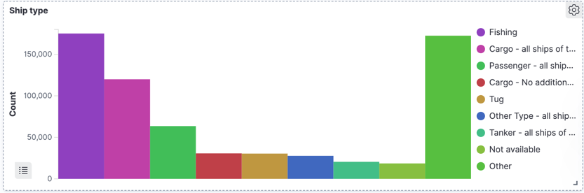

If we filter this just for passenger ships we can see—as would be expected—fewer reporting in towards the end of the day: 

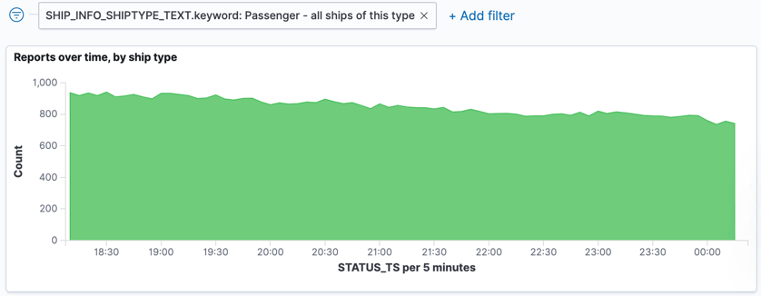

We can also look at other properties of the ships, such as their square area. This is calculated from the AIS data in which the ship's dimensions are reported: 

image::images/kibana_shiparea01.png[Kibana - Ship area]

Using Kibana's filtering we can drill down into large ships (>5000 ㎡) which unsuprisingly are mostly cargo and tankers: 

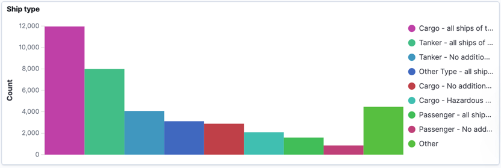

This is pretty interesting, but it's just looking at the static data that ships report. What about the continuous stream of data that we get from AIS? This tells us _where_ the ships are, and also _what_ they're reporting as doing. If we filter for ships that report as Fishing vessels we shan't be too suprised to see that around a third of them are `Engaged in fishing`: 

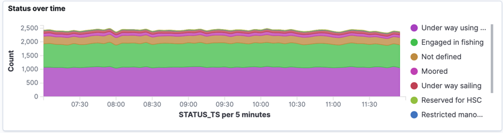

Part of the AIS payload for a status update is the latitude & longitude points reported by the ship and we can use this to plot the data on a map. Using Kibana's heatmap option we can easily see where the most number of fishing vessels are: 

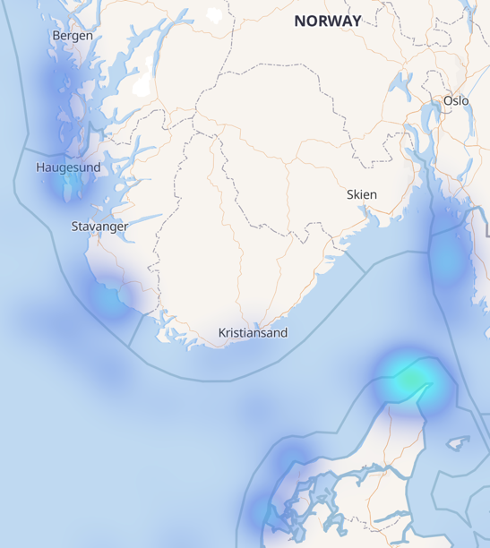

One of the things I was really interested to see in the version 7.11 release of Kibana recently was the *Tracks* support in the Map visualisation. By breaking down the data by ship name & callsign, it's possible to plot the path of each ship:

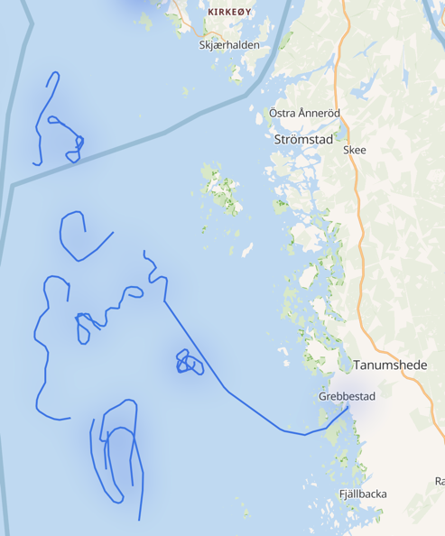

The plot here is just for Fishing vessels (as that's what we'd filtered on previously), but if we open it up to all ships, but vary the track colour based on the size of the ship we can see patterns starting to form around shipping routes and the different ships using them:

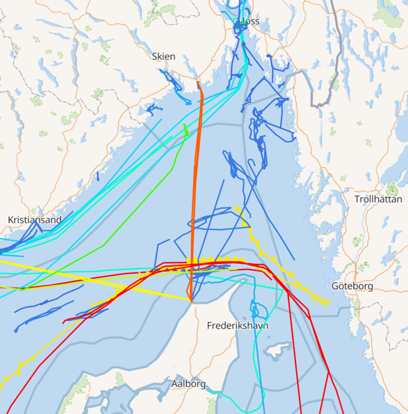
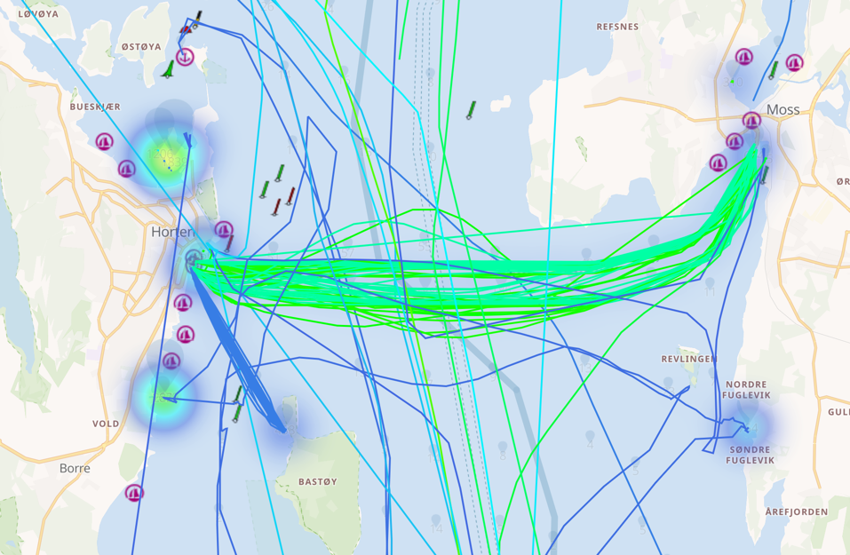

Using the map filtering option you can draw a region on which to filter the data and examine aggregate information about the ships within it. Here's everything that's happening within ~15km of the city of Bergen, and the associated ship types, activities, and sizes. 

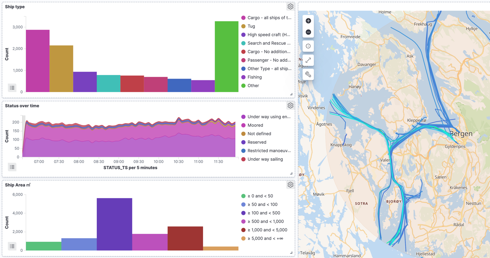

As well as looking at the data in aggregate, you can drill all the way down. I found it fascinating looking at all the shipping activities and then being able to dive all the way down to the particular vessel. Starting with the map view you may spot a track that you're interested in. Here I've seen a larger ship and want to know more about it, so click on the track and then the filter button next to the ship's name

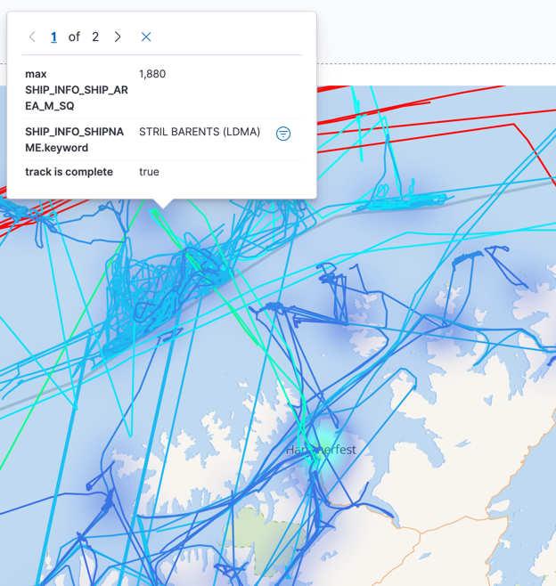

From that we can then see what it was doing, over time: 

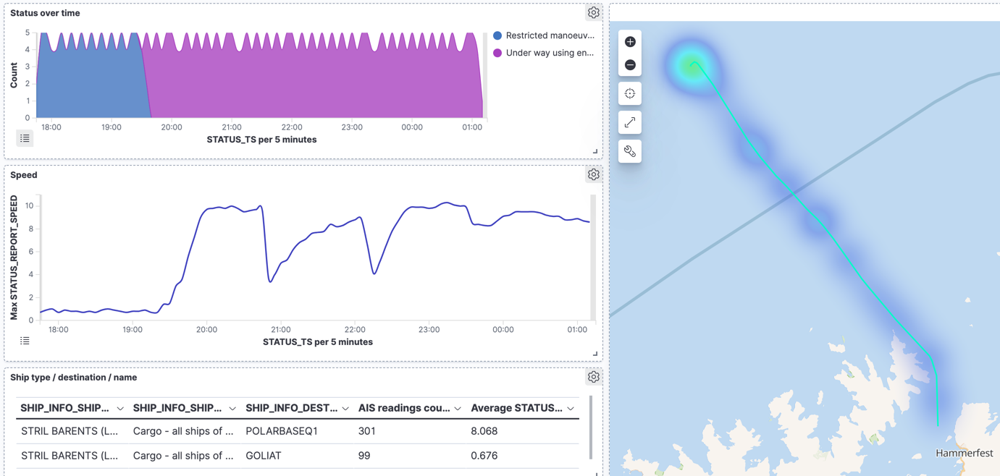

as well as individual status reports:

image::images/kibana_detail01.png[Kibana - Detail view]

So that's how _what_ we can do; but let's take a look now at exactly _how_. As a streaming ETL data pipeline it is a relatively simple one, but with some interesting tricks needed along the way…

== Streaming ETL - Extract

I built all this on Confluent Cloud, so first off provisioned myself a cluster: 

image::images/ccloud01.png[]

and with my API keys in hand, created a target topic to stream the source AIS data into: 

[source,bash]
----
$ ccloud kafka topic create ais
Created topic "ais".
----

As mentioned above, the raw AIS data can be parsed by https://gpsd.gitlab.io/gpsd/gpsdecode.html[`gpsdecode`] to put it into a structured form. From here, I used `kafkacat` to write it to my Kafka topic. I wrapped this in a docker container (piggybacking on the existing `kafkacat` image) to make it self-contained and TODO_LINK_TO_'/Users/rmoff/git/demo-scene/maritime-ais/cloud_ingest.sh.sample'_ON_GH[deployable in the cloud]

[source,bash]
----
docker run --rm -t --entrypoint /bin/sh edenhill/kafkacat:1.6.0 -c '
  # Install stuff
  apk add gpsd gpsd-clients

  nc 153.44.253.27 5631 | \
  gpsdecode | \
  kafkacat \
    -X security.protocol=SASL_SSL -X sasl.mechanisms=PLAIN \
    -X ssl.ca.location=./etc/ssl/cert.pem -X api.version.request=true \
    -b BROKER.gcp.confluent.cloud:9092 \
    -X sasl.username="API_USER" \
    -X sasl.password="API_PASSWORD" \
    -t ais -P 
' 
----

NOTE: _For the purposes of a proof-of-concept, this was good enough—were I to build this into something needing a more resilient ingest pipe I'd probably build a robust service to handle the ingest and parsing of AIS data that used the Producer API to stream it to Kafka._

This gave me a stream of data into the `ais` topic at a rate of around 8KB/s (not really touching the sides of the 100MB/s limit on the lowest-level basic cluster spec)

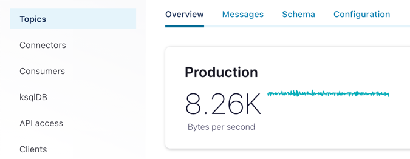

The `gpsdecode` tool writes the messages out as JSON, which I could inspect with the topic viewer: 

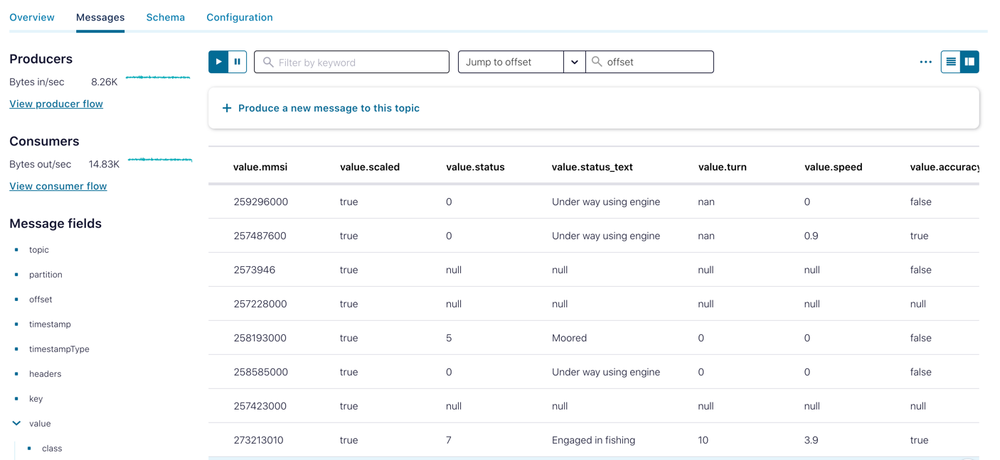

== Streaming ETL - Transform

With the data streaming in, next up was taking this single stream of events and transforming it into something easily usable. The tool I used for transforming the stream of data was ksqlDB. This lets me use SQL to describe the stream processing that I want to apply to the data. 

=== The raw stream 

The first step in ksqlDB was to dump a sample of the topic just to check what we were working with:

[source,sql]
----
ksql> PRINT ais LIMIT 5;
Key format: ¯\_(ツ)_/¯ - no data processed
Value format: JSON or KAFKA_STRING
rowtime: 2021/02/25 10:50:06.934 Z, key: <null>, value: {"class":"AIS","device":"stdin","type":3,"repeat":0,"mmsi":257124880,"scaled":true,"status":15,"status_text":"Not defined","turn":0,, partition: 0ccuracy":false,"lon":11.257358,"lat":64.902517,"course":85.0,"heading":225,"second":2,"maneuver":0,"raim":false,"radio":25283}
rowtime: 2021/02/25 10:50:06.934 Z, key: <null>, value: {"class":"AIS","device":"stdin","type":1,"repeat":0,"mmsi":257045680,"scaled":true,"status":0,"status_text":"Under way using engine", partition: 0"speed":0.3,"accuracy":true,"lon":16.725387,"lat":68.939000,"course":65.7,"heading":511,"second":5,"maneuver":0,"raim":true,"radio":52}
rowtime: 2021/02/25 10:50:06.934 Z, key: <null>, value: {"class":"AIS","device":"stdin","type":5,"repeat":0,"mmsi":259421000,"scaled":true,"imo":9175030,"ais_version":0,"callsign":"LIPZ","shipname":"ROALDNES","shiptype":30,"shiptype_text":"Fishing","to_bow":10,"to_stern":24,"to_port":5,"to_starboard":5,"epfd":1,"epfd_text":"GPS","eta":"01-16T14:00Z","draught":6.3,"destinati, partition: 0,"dte":0}
rowtime: 2021/02/25 10:50:06.934 Z, key: <null>, value: {"class":"AIS","device":"stdin","type":3,"repeat":0,"mmsi":257039700,"scaled":true,"status":5,"status_text":"Moored","turn":0,"speed, partition: 0y":false,"lon":12.273450,"lat":65.998892,"course":188.6,"heading":36,"second":5,"maneuver":0,"raim":false,"radio":0}
rowtime: 2021/02/25 10:50:06.934 Z, key: <null>, value: {"class":"AIS","device":"stdin","type":5,"repeat":0,"mmsi":257956500,"scaled":true,"imo":0,"ais_version":2,"callsign":"LG9456","shipname":"FROY MULTI","shiptype":0,"shiptype_text":"Not available","to_bow":3,"to_stern":12,"to_port":7,"to_starboard":5,"epfd":1,"epfd_text":"GPS","eta":"00-00T24:60Z","draught":0.0,"destina, partition: 0:0}
Topic printing ceased
----

AIS data is broadcast as a single stream of messages of different types. Each message type has its own set of fields, along with some common ones. 

TODO_IMG SHOWING STREAM OF DIFFERENT MESSAGE TYPES

I used https://rmoff.net/2021/03/04/quick-profiling-of-data-in-apache-kafka-using-kafkacat-and-visidata/[a little bit of commandline magic] to do a quick inspection on a sample of the data to see how many messages of different types I had. Around 75% were position reports, 15% ship information, and the remainder a mix of other messages. 

`NOTE TO ED: EITHER EMBED THIS HTML SCRIPT, OR USE ANIGIF (BUT IT'S 3.3MB)`

++++

++++

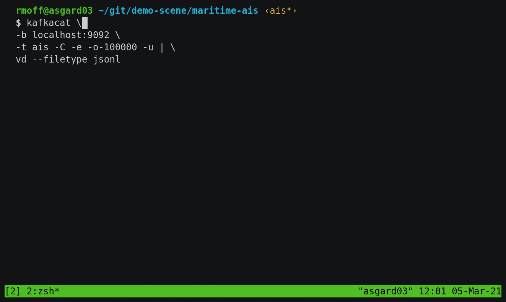

ksqlDB can be used to split streams of data based on a characteristics of the data, and that's what we needed to here, so that we'd end up with a dedicated stream of messages for each logical type or group of AIS messages. To do any processing with ksqlDB you need a schema declared on the data (the source data is just lumps of JSON strings, with no explicit schema). Since there's a mix of message types (and thus schemas) in the single stream it's hard to declare the schema in its entirety up front, so we use a little trick here to map the first ksqlDB stream. By specifying the serialisation type as `KAFKA` we can delay having to declare the schema - but still access fields in the data when we need to for the predicate in splitting the stream.  

[source,sql]
----
CREATE STREAM AIS_RAW (MSG VARCHAR) WITH (KAFKA_TOPIC='ais', FORMAT='KAFKA');
----

This declare a stream on the existing `ais` topic, with a single field that we've arbitarily called `MSG`. The trick is that we're using `KAFKA` format. If we specified it as `JSON` (as one may reasonably expect, it being JSON data) then there'd have to be a common root field for us to map; which there isn't. 

With a stream declared we can query it and check that it's working. The result is pretty much the same as dumping the data with `PRINT`, but we're validating now that ksqlDB is happy reading the data: 

[source,sql]
----
ksql> SELECT * FROM AIS_RAW EMIT CHANGES LIMIT 5;
+------------------------------------------------------------------------------------------------------------------------------------------------------------------------------------------+
|MSG                                                                                                                                                                                       |
+------------------------------------------------------------------------------------------------------------------------------------------------------------------------------------------+
|{"class":"AIS","device":"stdin","type":3,"repeat":0,"mmsi":259589000,"scaled":true,"status":0,"status_text":"Under way using engine","turn":0,"speed":11.6,"accuracy":false,"lon":11.60895|
|{"class":"AIS","device":"stdin","type":3,"repeat":0,"mmsi":257499000,"scaled":true,"status":5,"status_text":"Moored","turn":0,"speed":0.0,"accuracy":false,"lon":6.447663,"lat":62.593768,|
|{"class":"AIS","device":"stdin","type":1,"repeat":0,"mmsi":259625000,"scaled":true,"status":0,"status_text":"Under way using engine","turn":"nan","speed":0.0,"accuracy":true,"lon":16.542|
|{"class":"AIS","device":"stdin","type":3,"repeat":0,"mmsi":257334400,"scaled":true,"status":5,"status_text":"Moored","turn":0,"speed":0.0,"accuracy":false,"lon":7.732775,"lat":63.113140,|
|{"class":"AIS","device":"stdin","type":5,"repeat":0,"mmsi":257628580,"scaled":true,"imo":0,"ais_version":2,"callsign":"LJ8162","shipname":"MORVIL","shiptype":37,"shiptype_text":"Pleasure|
Limit Reached
Query terminated
----

Now comes the schema bit. `MSG` holds the full JSON payload, and we can use `EXTRACTJSONFIELD` to—as the name suggests—extract JSON fields: 

[source,sql]
----
ksql> SELECT EXTRACTJSONFIELD(msg,'$.type') AS MSG_TYPE FROM AIS_RAW EMIT CHANGES LIMIT 5;
+--------------+
|MSG_TYPE      |
+--------------+
|1             |
|1             |
|3             |
|5             |
|1             |
Limit Reached
Query terminated
----

As shown above we can set the name of fields that we create (using `AS`), and we can also `CAST` data types as well using other functions such as `TIMESTAMPTOSTRING`, as well as use the extracted `type` field as a predicate: 

[source,sql]
----
ksql> SELECT TIMESTAMPTOSTRING(ROWTIME,'yyyy-MM-dd HH:mm:ss','Europe/London') AS TS,
             CAST(EXTRACTJSONFIELD(msg,'$.type') AS INT)                      AS MSG_TYPE, 
             CAST(EXTRACTJSONFIELD(msg,'$.status_text') AS VARCHAR)           AS STATUS_TEXT 
        FROM AIS_RAW
       WHERE EXTRACTJSONFIELD(msg,'$.type') = '1' 
       EMIT CHANGES;

+--------------------+----------+-----------------------+
|TS                  |MSG_TYPE  |STATUS_TEXT            |
+--------------------+----------+-----------------------+
|2021-02-25 10:50:06 |1         |Under way using engine |
|2021-02-25 10:50:09 |1         |Engaged in fishing     |
|2021-02-25 10:50:11 |1         |Not defined            |
|2021-02-25 10:50:17 |1         |Under way using engine |
----

So based on this we can populate new dedicated streams just for particular entities, with a full schema defined. This is done using the `CREATE STREAM…AS SELECT` (`CSAS`) syntax, which writes to a new stream with the continuous results of the declared `SELECT` statement (which is where the transformations take place). By setting the offset back to `earliest` we can process all existing data held on the topic as well as every new message as it arrives. The data is written as Avro (which stores the schema in the Schema Registry), and the message partitioning key is set with `PARTITION BY` to the unique identifier of the vessel (`MMSI`). 

TODO_DIAGRAM AIS DATA INTO RAW TOPIC, SPLIT INTO TWO NEW ONES LABELLED ACCORDINGLY

You can find the full SQL declarations TODO_LINK_TO_GH_'/Users/rmoff/git/demo-scene/maritime-ais/ksql_statements.ksql'[in the repository], but as a general pattern they look something like this: 

* Ship position reports (type 1, 2, or 3 messages): 
+
[source,sql]
----
CREATE OR REPLACE STREAM AIS_MSG_TYPE_1_2_3 WITH (FORMAT='AVRO') AS 
  SELECT  CAST(EXTRACTJSONFIELD(msg,'$.type') AS INT)             AS msg_type,
          CAST(EXTRACTJSONFIELD(msg,'$.mmsi') AS VARCHAR)         AS mmsi,
          CAST(EXTRACTJSONFIELD(msg,'$.status_text') AS VARCHAR)  AS status_text,
          CAST(EXTRACTJSONFIELD(msg,'$.speed') AS DOUBLE)         AS speed,
          CAST(EXTRACTJSONFIELD(msg,'$.course') AS DOUBLE)        AS course,
          CAST(EXTRACTJSONFIELD(msg,'$.heading') AS INT)          AS heading
  FROM    AIS_RAW
  WHERE   EXTRACTJSONFIELD(msg,'$.type') IN ('1' ,'2' ,'3' ,'18' ,'27')
  PARTITION BY CAST(EXTRACTJSONFIELD(msg,'$.mmsi') AS VARCHAR);
----

* Ship and Voyage data (type 5 messages): 
+
[source,sql]
----
CREATE OR REPLACE STREAM AIS_MSG_TYPE_5 WITH (FORMAT='AVRO')          AS 
  SELECT  CAST(EXTRACTJSONFIELD(msg,'$.type') AS INT)                 AS msg_type, 
          CAST(EXTRACTJSONFIELD(msg,'$.mmsi') AS VARCHAR)             AS mmsi, 
          CAST(EXTRACTJSONFIELD(msg,'$.callsign') AS VARCHAR)         AS callsign, 
          CAST(EXTRACTJSONFIELD(msg,'$.shipname') AS VARCHAR)         AS shipname_raw, 
          CONCAT(CAST(EXTRACTJSONFIELD(msg,'$.shipname') AS VARCHAR),
                 ' (',
                 CAST(EXTRACTJSONFIELD(msg,'$.callsign') AS VARCHAR),
                 ')')                                                 AS shipname,
          CAST(EXTRACTJSONFIELD(msg,'$.shiptype_text') AS VARCHAR)    AS shiptype_text, 
          CAST(EXTRACTJSONFIELD(msg,'$.destination') AS VARCHAR)      AS destination
  FROM    AIS_RAW
  WHERE   EXTRACTJSONFIELD(msg,'$.type') = '5'
  PARTITION BY CAST(EXTRACTJSONFIELD(msg,'$.mmsi') AS VARCHAR);
----

After this, there are now three streams - the original (`AIS_RAW`) along with streams holding only messages of a certain type: 

[source,sql]
----
ksql> SHOW STREAMS;

 Stream Name                    | Kafka Topic                        | Key Format | Value Format | Windowed
------------------------------------------------------------------------------------------------------------
 AIS_MSG_TYPE_1_2_3             | AIS_MSG_TYPE_1_2_3                 | AVRO       | AVRO         | false
 AIS_MSG_TYPE_5                 | AIS_MSG_TYPE_5                     | AVRO       | AVRO         | false
 AIS_RAW                        | ais                                | KAFKA      | KAFKA        | false
----

=== Building a lookup table from a stream of events

The status report messages in the stream `AIS_MSG_TYPE_1_2_3` are nice, simple, events. A ship was here, and then it was there, and then it was there. 

[source,sql]
----
ksql> SELECT MMSI, STATUS_TEXT, LON, LAT 
        FROM AIS_MSG_TYPE_1_2_3 
       WHERE MMSI = '257293400' 
       EMIT CHANGES;
+----------+-----------------------+----------+----------+
|MMSI      |STATUS_TEXT            |LON       |LAT       |
+----------+-----------------------+----------+----------+
|257293400 |Under way using engine |15.995308 |68.417305 |
|257293400 |Under way using engine |15.995307 |68.417282 |
|257293400 |Under way using engine |15.995288 |68.417288 |
…
----

But let's now think about the https://gpsd.gitlab.io/gpsd/AIVDM.html#_type_5_static_and_voyage_related_data[type 5 messages], which describe the ship's characteristics. In the old world of batch data this would be a straight-up "dimension" or "lookup" table. What's that look like in a streaming world? 

Well, it actually looks pretty similar. It's still a table! The important thing here is that the *key* is crucial. A ksqlDB table maintains the latest value for each key based on the messages in a Kafka topic. Consider this _stream_ of messages on the `AIS_MSG_TYPE_5` stream that we have built: 

[source,sql]
----
ksql> SELECT TIMESTAMPTOSTRING(ROWTIME,'HH:mm:ss','Europe/Oslo') AS TS, 
             MMSI, 
             SHIPNAME, 
             DRAUGHT, 
             DESTINATION  
        FROM AIS_MSG_TYPE_5 
       WHERE MMSI = '255805587' 
       EMIT CHANGES;
+---------+-----------+------------------+--------+------------+
|TS       |MMSI       |SHIPNAME          |DRAUGHT |DESTINATION |
+---------+-----------+------------------+--------+------------+
|11:17:17 |255805587  |NCL AVEROY (CQHL) |7.5     |SVELGEN     |
|12:47:26 |255805587  |NCL AVEROY (CQHL) |7.5     |SVELGEN     |
|13:06:27 |255805587  |NCL AVEROY (CQHL) |7.5     |MALOY       |
|13:13:43 |255805587  |NCL AVEROY (CQHL) |7.5     |FLORO       |
…
----

Here we can see some attributes are unchanged (the ship's name, its callsign, and its https://www.marineinsight.com/naval-architecture/vessel-draft-vessel-draught-ship/[draught]) which we would expect, whilst others (its reported destination) can vary over time. We model this stream of events as a table, taking the unique identifier (the `MMSI`) as the key (`GROUP BY`): 

[source,sql]
----
CREATE TABLE SHIP_INFO AS
  SELECT MMSI,
        MAX(ROWTIME) AS LAST_INFO_PING_TS,
        LATEST_BY_OFFSET(SHIPNAME) AS SHIPNAME,
        LATEST_BY_OFFSET(DRAUGHT) AS DRAUGHT,
        LATEST_BY_OFFSET(DESTINATION) AS DESTINATION
    FROM AIS_MSG_TYPE_5
  GROUP BY MMSI
  EMIT CHANGES;
----

When we query this table at first it will show the state at that point in time: 

[source,sql]
----
SELECT MMSI, 
       TIMESTAMPTOSTRING(LAST_INFO_PING_TS,'HH:mm:ss','Europe/London') AS LAST_INFO_PING_TS,
       SHIPNAME,
       DRAUGHT,
       DESTINATION
  FROM SHIP_INFO
  WHERE MMSI = '255805587';
----

[source,sql]
----
+----------+------------------+------------------+--------+------------+
|MMSI      |LAST_INFO_PING_TS |SHIPNAME          |DRAUGHT |DESTINATION |
+----------+------------------+------------------+--------+------------+
|255805587 |11:17:17          |NCL AVEROY (CQHL) |7.5     |SVELGEN     |
+----------+------------------+------------------+--------+------------+
----

As new messages arrive on the underlying source topic the value for the key (`MMSI`) changes, and so does the state of the table: 

[source,sql]
----
+----------+------------------+------------------+--------+------------+
|MMSI      |LAST_INFO_PING_TS |SHIPNAME          |DRAUGHT |DESTINATION |
+----------+------------------+------------------+--------+------------+
|255805587 |13:06:27          |NCL AVEROY (CQHL) |7.5     |MALOY       |
+----------+------------------+------------------+--------+------------+
----

This table that we've built is held as a materialised view within ksqlDB, and also as a Apache Kafka topic. This means we can do several things with it: 

* Join it to a stream of events ("facts"), as we will see shortly
* Query the state from an external application using a pull query from a Java client or other REST API client.
* Push the state to an external data store such as a database

=== Joining ship movements to ship information 

To do useful things with the data we want to join messages from the same original stream to each other. We want to _denormalise_ the information provided in one message about a ship's movements to additional information provided in another message about the ship's characteristics. 

TODO DIAGRAM SHOWING JOIN

As discussed above, the ship's characteristics is modelled as a ksqlDB table, which we then join to the stream of ship position updates thus: 

[source,sql]
----
CREATE STREAM SHIP_STATUS_REPORTS WITH
  (KAFKA_TOPIC='SHIP_STATUS_REPORTS_V00') AS
SELECT STATUS_REPORT.ROWTIME AS STATUS_TS,
       STATUS_REPORT.*, 
       SHIP_INFO.*
FROM  AIS_MSG_TYPE_1_2_3 STATUS_REPORT 
      LEFT JOIN SHIP_INFO SHIP_INFO 
        ON STATUS_REPORT.MMSI = SHIP_INFO.MMSI 
;
----

This writes to a new Kafka topic (the name for which will inherit the stream name, unless explicitly defined as in the example above) every message from the source stream (`AIS_MSG_TYPE_1_2_3`) enriched with, when found, the information about the ship (that originally came from the (`AIS_MSG_TYPE_5` stream, then modelled into a table holding state). 

You can also do stream-stream joins in ksqlDB and we'll see a good use for those later on. 

With the joined data stream we can now see for a given ship every movement along with information about the ship itself: 

[source,sql]
----
ksql> SELECT TIMESTAMPTOSTRING(STATUS_TS,'HH:mm:ss','Europe/Oslo') AS STATUS_TS, 
             SHIP_LOCATION, 
             STATUS_REPORT_STATUS_TEXT, 
             SHIP_INFO_SHIPNAME, 
             SHIP_INFO_DRAUGHT, 
             SHIP_INFO_DESTINATION_LIST 
        FROM SHIP_STATUS_REPORTS 
       WHERE SHIP_INFO_MMSI = '255805587' 
       EMIT CHANGES;
+-----------+--------------------------------+---------------------------+---------------------+-------------------+----------------------+
|STATUS_TS  |SHIP_LOCATION                   |STATUS_REPORT_STATUS_TEXT  |SHIP_INFO_SHIPNAME   |SHIP_INFO_DRAUGHT  |SHIP_INFO_DESTINATION |
+-----------+--------------------------------+---------------------------+---------------------+-------------------+----------------------+
|11:37:47   |{lat=61.773223, lon=5.294023}   |Moored                     |NCL AVEROY (CQHL)    |7.5                |[SVELGEN]             |
[…]
|17:16:45   |{lat=61.939807, lon=5.143242}   |Under way using engine     |NCL AVEROY (CQHL)    |7.5                |[FLORO]               |
[…]
|23:05:25   |{lat=62.468148, lon=6.137387}   |Under way using engine     |NCL AVEROY (CQHL)    |8.1                |[ALESUND]             |
[…]
|23:11:04   |{lat=62.468122, lon=6.13745}    |Under way using engine     |NCL AVEROY (CQHL)    |8.1                |[ALESUND]             |
[…]
|23:35:47   |{lat=62.468125, lon=6.137473}   |Moored                     |NCL AVEROY (CQHL)    |8.1                |[ALESUND]             |
[…]
----

_If you get really curious about a particular ship you can even go and look up more information about it over on https://www.marinetraffic.com/en/ais/details/ships/shipid:300128/mmsi:255805587/imo:9326990/vessel:NCL_AVEROY[MarineTraffic.com]_.

The output of this is a Kafka topic, and we'll see shortly what we did with it next. First though, I'd like to discuss some of the nitty-gritty of the streaming ETL work, illustrating the kind of real-world problems that data engineers encounter, and can solve with ksqlDB. 

=== Cleaning up the data's latitude and longitude values

Some of the location values reported in the feed turn out to be a bit…unlikely

[source,javascript]
----
{
  "type": 1,
  "repeat": 0,
  "mmsi": 257565600,
  "status_text": "Under way using engine",
  "lon": 181.000000,
  "lat": 91.000000,
  "course": 360.0,
  "heading": 511
  …
}
----

The https://en.wikipedia.org/wiki/Geographic_coordinate_system#Latitude_and_longitude[latitude and longitude] are reported as 91 and 181 respectively, which is nonsensical (the valid limits are -90/90 and -180/180). 

Since we're going to be doing work with these location values downstream, we should clean this data up. We have different options available to us. If the data is just offset incorrect then we could recalculate it, but here we're going to assume that it's junk and so null it out. 

Let's test that this is going to work. First up, we'll dump a bunch of messages and eyeball to identify ships by their unique code (`MMSI`) for a couple with valid location readings, and one with the dodgy values: 

[source,sql]
----
SELECT TIMESTAMPTOSTRING(ROWTIME,'yyyy-MM-dd HH:mm:ss','Europe/Oslo') AS TS, 
       EXTRACTJSONFIELD(msg,'$.mmsi'), 
       EXTRACTJSONFIELD(msg,'$.lon'),
       EXTRACTJSONFIELD(msg,'$.lat') 
  FROM AIS_RAW 
  EMIT CHANGES LIMIT 500;

+--------------------+--------------------+--------------------+--------------------+
|TS                  |KSQL_COL_0          |KSQL_COL_1          |KSQL_COL_2          |
+--------------------+--------------------+--------------------+--------------------+
|2021-02-25 10:50:06 |257124880           |11.257358           |64.902517           |
|2021-02-25 10:50:06 |257045680           |16.725387           |68.939000           |
…
…
…
|2021-02-25 10:50:13 |257014400           |181.000000          |91.000000           |
|2021-02-25 10:50:13 |273322840           |32.357117           |70.427183           |
----

Now let's use those identifiers (257124880, 257045680, 257014400) to sample records just for these ships, using a `WHERE` clause with an `IN` predicate

[source,sql]
----
SELECT TIMESTAMPTOSTRING(ROWTIME,'yyyy-MM-dd HH:mm:ss','Europe/Oslo') AS TS, 
       EXTRACTJSONFIELD(msg,'$.mmsi'), 
       EXTRACTJSONFIELD(msg,'$.lon'), 
       EXTRACTJSONFIELD(msg,'$.lat') 
  FROM AIS_RAW 
  WHERE EXTRACTJSONFIELD(msg,'$.mmsi') IN (257124880, 257045680, 257014400) 
  EMIT CHANGES LIMIT 3;

+--------------------+--------------------+--------------------+--------------------+
|TS                  |KSQL_COL_0          |KSQL_COL_1          |KSQL_COL_2          |
+--------------------+--------------------+--------------------+--------------------+
|2021-02-25 10:50:06 |257124880           |11.257358           |64.902517           |
|2021-02-25 10:50:06 |257045680           |16.725387           |68.939000           |
|2021-02-25 10:50:13 |257014400           |181.000000          |91.000000           |
Limit Reached
Query terminated
----

Now we can transform the source lat/lon fields to their target format (`DOUBLE`) but use a `CASE` to handle these out of range values. Note that if _either_ lat or lon is invalid we store a `NULL` for _both_. We'll test it using the same messages as above. 

[source,sql]
----
SELECT TIMESTAMPTOSTRING(ROWTIME,'yyyy-MM-dd HH:mm:ss','Europe/Oslo') AS TS, 
       EXTRACTJSONFIELD(msg,'$.mmsi') AS MMSI, 
       EXTRACTJSONFIELD(msg,'$.lat') AS RAW_LAT,
       EXTRACTJSONFIELD(msg,'$.lon') AS RAW_LON, 
       CASE
         WHEN (   CAST(EXTRACTJSONFIELD(msg,'$.lon') AS DOUBLE) >  180 
               OR CAST(EXTRACTJSONFIELD(msg,'$.lon') AS DOUBLE) < -180
               OR CAST(EXTRACTJSONFIELD(msg,'$.lat') AS DOUBLE) >   90
               OR CAST(EXTRACTJSONFIELD(msg,'$.lat') AS DOUBLE) < - 90) THEN CAST(NULL AS DOUBLE)
         ELSE CAST(EXTRACTJSONFIELD(msg,'$.lon') AS DOUBLE) END AS lon,
       CASE
         WHEN (   CAST(EXTRACTJSONFIELD(msg,'$.lon') AS DOUBLE) >  180 
               OR CAST(EXTRACTJSONFIELD(msg,'$.lon') AS DOUBLE) < -180
               OR CAST(EXTRACTJSONFIELD(msg,'$.lat') AS DOUBLE) >   90
               OR CAST(EXTRACTJSONFIELD(msg,'$.lat') AS DOUBLE) < - 90) THEN CAST(NULL AS DOUBLE)
         ELSE CAST(EXTRACTJSONFIELD(msg,'$.lat') AS DOUBLE) END AS lat,
   FROM AIS_RAW 
  WHERE EXTRACTJSONFIELD(msg,'$.mmsi') IN (257124880, 257045680, 257014400) 
  EMIT CHANGES LIMIT 3;

+-------------------+-----------+-----------+------------+----------+----------+
|TS                 |MMSI       |RAW_LAT    |RAW_LON     |LAT       |LON       |
+-------------------+-----------+-----------+------------+----------+----------+
|2021-02-25 10:50:06|257124880  |64.902517  |11.257358   |64.902517 |11.257358 |
|2021-02-25 10:50:06|257045680  |68.939000  |16.725387   |68.939    |16.725387 |
|2021-02-25 10:50:13|257014400  |91.000000  |181.000000  |null      |null      |
Limit Reached
Query terminated
----

=== Creating a location object 

Since latitude and longitude aren't two fields in isolation—but actually a pair of values that exist together and don't make much sense individually—we're going to transform them into a nested object in the schema. We do this using `STRUCT` in the `SELECT` statement and define the fields to nest within it: 

[source,sql]
----
STRUCT("lat" := LAT, "lon" := LON)
----

Note that we use quote marks to force the field names to lowercase, since this is what Elasticsearch needs downstream to recognise the object as a geopoint (if it's `LAT`/`LON` it won't work—it has to be `lat`/`lon`). 

We also need handle the NULL values that we created in the cleanup process above, which we do using a `CASE` and `IS NULL` predicate, which when it evaluates to true builds the necessary NULL object struct to maintain compatibility with the schema: 

[source,sql]
----
WHEN LAT IS NULL OR LON IS NULL THEN 
  CAST(NULL AS STRUCT<`lat` DOUBLE, `lon` DOUBLE>)
----

The full SQL looks like this: 

[source,sql]
----
SELECT TIMESTAMPTOSTRING(ROWTIME,'yyyy-MM-dd HH:mm:ss','Europe/Oslo') AS TS,
       MMSI, LAT, LON,
       CASE
         WHEN LAT IS NULL OR LON IS NULL THEN 
           CAST(NULL AS STRUCT<`lat` DOUBLE, `lon` DOUBLE>)
         ELSE 
           STRUCT("lat" := LAT, "lon" := LON)
       END AS LOCATION
  FROM AIS_MSG_TYPE_1_2_3
 WHERE MMSI IN (257124880, 257045680, 257014400)
 EMIT CHANGES;
+---------------------+-----------+----------+----------+-------------------------------+
|TS                   |MMSI       |LAT       |LON       |LOCATION                       |
+---------------------+-----------+----------+----------+-------------------------------+
|2021-02-25 10:50:06  |257124880  |64.902517 |11.257358 |{lat=64.902517, lon=11.257358} |
|2021-02-25 10:50:06  |257045680  |68.939    |16.725387 |{lat=68.939, lon=16.725387}    |
|2021-02-25 10:50:13  |257014400  |null      |null      |null                           |
…
----

=== Uniquely identifying ships

When I plotted the movements of a ship identified by its name alone, I got this: 

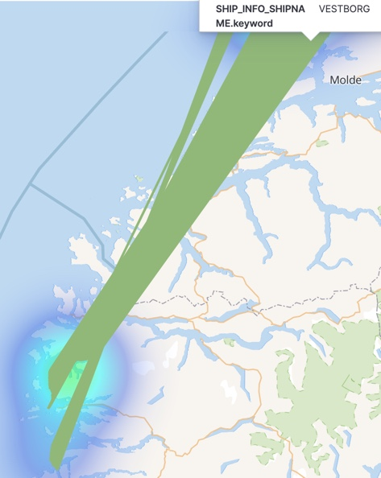

It turns out ship names are not unique, as can be seen if I query the stream of data and observe the callsign and MMSI: 

[source,sql]
----
ksql> SELECT MMSI, CALLSIGN, SHIPNAME FROM SHIP_INFO WHERE SHIPNAME='VESTBORG' EMIT CHANGES;
+-----------+----------+---------+
|MMSI       |CALLSIGN  |SHIPNAME |
+-----------+----------+---------+
|219000035  |OXMC2     |VESTBORG |
|257477000  |LAIQ8     |VESTBORG |
----

So we create a compound column using SQL to include the callsign, giving us a field that's still human-readable (unlike MMSI) but now hopefully unique: 

[source,sql]
----
ksql> SELECT MMSI, CALLSIGN, SHIPNAME AS SHIPNAME_RAW,
             CONCAT(SHIPNAME,' (',CALLSIGN,')') AS SHIPNAME 
        FROM SHIP_INFO SHIPNAME='VESTBORG' EMIT CHANGES;
+----------+---------+-------------+-----------------+
|MMSI      |CALLSIGN |SHIPNAME_RAW |SHIPNAME         |
+----------+---------+-------------+-----------------+
|257477000 |LAIQ8    |VESTBORG     |VESTBORG (LAIQ8) |
|219000035 |OXMC2    |VESTBORG     |VESTBORG (OXMC2) |
----

=== Tracking destinations

Looking at the source stream of updates we can see that the destination can change over time (as would be expected): 

[source,sql]
----
ksql> SELECT TIMESTAMPTOSTRING(ROWTIME,'yyyy-MM-dd HH:mm:ss','Europe/London') AS TS, MMSI,
>         SHIPNAME,
>         DESTINATION
>    FROM AIS_MSG_TYPE_5 WHERE MMSI=311411000
>emit changes;
+---------------------+-------------+------------+
|TS                   |SHIPNAME     |DESTINATION |
+---------------------+-------------+------------+
|2021-02-25 09:56:01  |SAMSKIP ICE  |TROMSO      |
…
|2021-02-25 12:38:06  |SAMSKIP ICE  |TROMSO      |
|2021-02-25 12:41:59  |SAMSKIP ICE  |SORTLAND    |
|2021-02-25 12:41:59  |SAMSKIP ICE  |SORTLAND    |
|2021-02-25 13:42:42  |SAMSKIP ICE  |LODINGEN    |
|2021-02-25 13:48:42  |SAMSKIP ICE  |LODINGEN    |
…
----

We're building a table that holds the current state of ships, including their current reported destination. It will also be useful to have a full list of the destination(s) available on the table for direct querying. We can use the `COLLECT_SET` aggregation for this: 

[source,sql]
----
ksql> SELECT TIMESTAMPTOSTRING(LATEST_BY_OFFSET(ROWTIME),'yyyy-MM-dd HH:mm:ss','Europe/London') AS TS, 
             MMSI,
             LATEST_BY_OFFSET(SHIPNAME) AS SHIPNAME,
             LATEST_BY_OFFSET(DESTINATION) AS DESTINATION, 
             COLLECT_SET(DESTINATION) AS DESTINATIONS
        FROM AIS_MSG_TYPE_5 
        WHERE MMSI=311411000
        GROUP BY MMSI 
        EMIT CHANGES;
+----------------------+----------------------+----------------------+----------------------+----------------------+
|TS                    |MMSI                  |SHIPNAME              |DESTINATION           |DESTINATIONS          |
+----------------------+----------------------+----------------------+----------------------+----------------------+
|2021-02-25 11:26:05   |311411000             |SAMSKIP ICE           |TROMSO                |[TROMSO]              |
|2021-02-25 14:12:43   |311411000             |SAMSKIP ICE           |LODINGEN              |[TROMSO, SORTLAND, LOD|
|                      |                      |                      |                      |INGEN]                |
----

== Streaming ETL - Transform recap

I've described quite a lot of the detail of the pipeline, hopefully to both flesh out the practical beyond just the theory, as well as give some tips and tricks for its use in other applications. To recap on the overall pipeline: 

* We've modelled the inbound raw stream of AIS data in JSON format into a ksqlDB stream, with no schema to start with
* We split the stream based on message types, and applied the relevant schema to each type
+
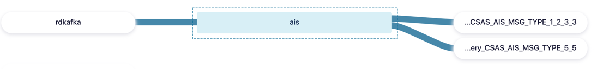
* We converted the stream of ship information messages to state by modelling it as a ksqlDB table
+
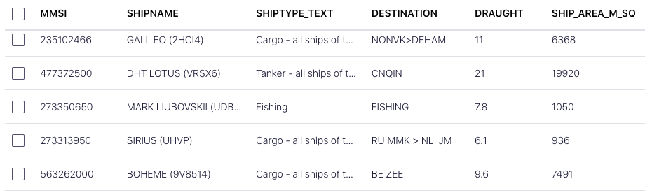
* We joined the ship status reports to the ship information table to create an enriched (denormalised) stream of real-time data about ship movements combined with information about that ship
+
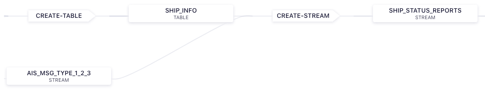

The final result of this is a realtime feed into a Kafka topic which we can then use for subsequent processing, as will be described immediately below forthwith. 

== Streaming ETL - Load

Let's finish off this journey through streaming ETL in action with the final logical step - load. Load has got such a stodgy batch connotation to it; what we're building here is _streaming ingest_ into another system. Here I'm using Elasticsearch for my analytics. Because the source data exists on a Kafka topic and is retained there I could easily add in additional targets, using the same data.

I'm using Elastic Cloud here which, like Confluent Cloud, provides a fully-managed platform and makes my life a whole lot easier. Before we stream the data into Elasticsearch, we need to create an index template that's going to define a couple of important field type mappings. You can do this in Kibana Dev Tools, or just with the REST API directly: 

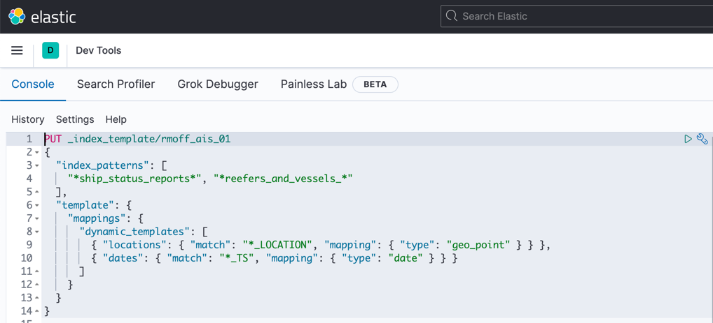

This ensures that any field we send over that ends in `_TS` is mapped as a date, and `_LOCATION` as a geopoint. 

Now we can go and get that ingest running. You can run Kafka Connect yourself to handle integration in and out of Apache Kafka, but since we've got all our data in Confluent Cloud let's make use of the managed connectors that it provides, including one for Elasticsearch: 

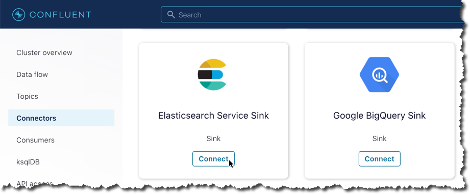

We fill in a few details, including the name of the source topic, location and credentials for the Elasticsearch cluster: 

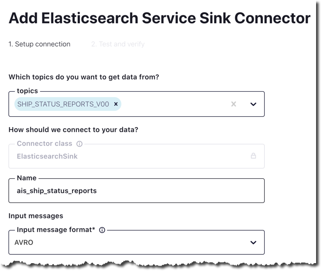

and off we go!

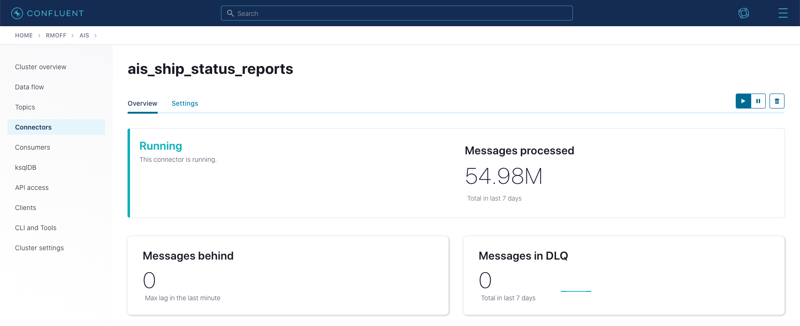

Making sure that the data types have been set in the new Elasticsearch index is important, and we can check that from Kibana Dev Tools again: 

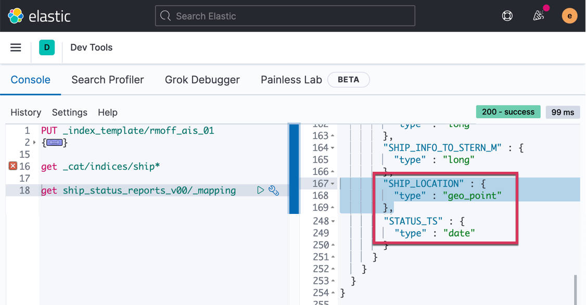

With that done, all that remains now is to build our dashboard and analytics in Kibana. 

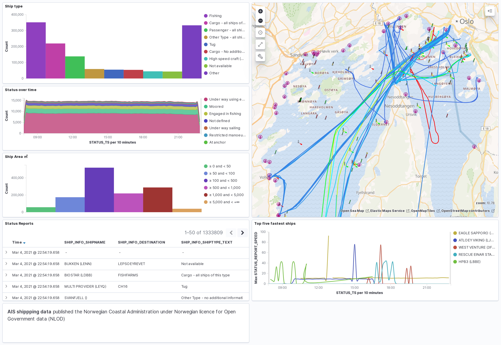

== Detecting patterns of behaviour in streaming data

The original inspiration for all of this came from https://stackoverflow.com/questions/65933728/how-to-find-if-two-objects-have-been-close-for-a-certain-amount-of-time[a question on StackOverflow] that piqued my curiosity. In offline discussion with the author of the question it transpired that he was investigating the behaviour of ships that can sometimes be an indicator of illegal fishing activities. In this particular case it was transshipping—the uses of which can be perfectly legal, but https://www.youtube.com/watch?v=N9w9jTORIoY[not always]. https://globalfishingwatch.org/[Global Fishing Watch] https://globalfishingwatch.org/news-views/close-encounters-of-the-fishy-kind/[describe it] thus:

> Large vessels with refrigerated holds collect catch from multiple fishing boats and carry it back to port. By enabling fishing vessels to remain on the fishing grounds, transshipment reduces fuel costs and ensures catch is delivered to port more quickly. It also leaves the door open for mixing illegal catch with legitimate catch, drug smuggling, forced labor and human rights abuses aboard fishing vessels that remain at sea for months or years at a time.

https://globalfishingwatch.org/[Global Fishing Watch] have done a lot of work in identifying suspected illegal fishing and published https://globalfishingwatch.org/transshipment-success/report-first-global-view-transshipment-sea/[detailed reports] on their findings and techniques used. Their approach was to take a historical look at the data and retrospectively identify patterns. I want to show here how stream processing can be used to look for TODO FIX LINK TEXT https://globalfishingwatch.org/carrier-portal/?dataset=carriers:v20201201&layer[0]=cp_rfmo&layer[1]=cp_next_port&layer[2]=loitering&layer[3]=eez&latitude=66.9757672&longitude=18.026174&zoom=4.1233072&eventType=loitering&graph=loitering-flag&eez[0]=5686 "these patterns" as they occur.

The spec to which I was working was based on that described in https://www.frontiersin.org/articles/10.3389/fmars.2018.00240/full#h3[Identifying Global Patterns of Transshipment Behavior]: 

> Encounters were identified from AIS data as locations where *a fishing vessel and a transshipment vessel were continuously within 500 m for at least 2 h and traveling at < 2 knots*, while at least 10 km from a coastal anchorage. 

In my example I built the first part of this (_within 500 m for at least 2 h and traveling at < 2 knots_ but not the second (at least 10 km from a coastal anchorage) and thus as you will see later on there are plenty of false positives identified. And, it bears repeating, transshipping is not itself illegal - so no comment whatsoever is made about the behaviour of any ships identified here. 

Let's break the problem down into pieces. 

=== Identifying fishing and transshipment vessels

First up, we need to identify ships that are fishing, and those that are transshipment vessels, or _reefers_ (refrigerated cargo), as they are often known. Just like we did in the streaming ETL section above with the information about ships in general collected from AIS, we're going to get the data into a Kafka topic and then model the stream of events as a table, against which we can then query. 

Global Fishing Watch used machine learning to https://globalfishingwatch.org/data-download/datasets/public-fishing-vessels-v1[create a list] of fishing vessels based not only on the reported ship type in the AIS data but also https://science.sciencemag.org/content/359/6378/904[other attributes]. In my initial proof of concept I just used the AIS atttribute alone, but as we see shortly incorporating the list here would be easily done. 

For reefers there are two sources of data, both also from Global Fishing Watch. 

* https://globalfishingwatch.org/data-download/datasets/carriers:v20201201[A list of carriers], from which a list of unique MMSIs and ship name was extracted to `Reefers.csv`
* https://globalfishingwatch.org/data-download/datasets/public-miller-frontiers-marine-science-2018[A list of transshipment vessels], written to `transshipment-vessels-v20170717.csv`

This is where the fun bit of data engineering comes in, because the reality is that datasets are frequently imperfect, or in different formats, or just need wrangling for other reasons. Here I wanted to see what the overlap was between the two sets of data that I had for reefers. I could have used various tools, but had `comm` to hand. Each file needed a bit of pre-processing using https://tldp.org/LDP/abs/html/process-sub.html[process substitution] to fix `CRLF` linebreaks and extract just the `mmsi` field:

* MMSI in both files: 
+
[source,bash]
----
$ comm -12 <(tr -d '\r' < Reefer.csv |awk -F";" ' { print $2}'|sort) <(tr -d '\r' < transshipment-vessels-v20170717.csv|awk -F"," '{print $1}'|sort) | wc -l
     501
----

* MMSI only in `Reefers.csv`
+
[source,bash]
----
$ comm -23 <(tr -d '\r' < Reefer.csv |awk -F";" ' { print $2}'|sort) <(tr -d '\r' < transshipment-vessels-v20170717.csv|awk -F"," '{print $1}'|sort) | wc -l
     326
----

* MMSI only in `transshipment-vessels-v20170717.csv`:
+
[source,bash]
----
$ comm -13 <(tr -d '\r' < Reefer.csv |awk -F";" ' { print $2}'|sort) <(tr -d '\r' < transshipment-vessels-v20170717.csv|awk -F"," '{print $1}'|sort) | wc -l
     624
----

Since there were clearly plenty of reefers in each file that weren't in the other I decided to load both into Kafka. I did this https://rmoff.net/2021/02/26/loading-delimited-data-into-kafka-quick-dirty-but-effective/[using kafkacat and a technique to set the key column correctly at ingest]: 

[source,bash]
----
$ ccloud kafka topic create reefers
$ tr -d '\r' < Reefer.csv | \
  awk -F";" ' { print $2 "\x1c" $1 } '| \
  docker run --rm --interactive edenhill/kafkacat:1.6.0 \
  kafkacat -X security.protocol=SASL_SSL -X sasl.mechanisms=PLAIN \
           -X ssl.ca.location=./etc/ssl/cert.pem -X api.version.request=true \
           -b $CCLOUD_BROKER:9092 \
           -X sasl.username="$CCLOUD_API_KEY" \
           -X sasl.password="$CCLOUD_API_SECRET" \
           -t reefers -K$'\x1c' -P

$ ccloud kafka topic create transshipment-vessels
$ tr -d '\r' < transshipment-vessels-v20170717.csv | \
  sed  "s/,/$(printf '\x1c')/" | \
  docker run --rm --interactive edenhill/kafkacat:1.6.0 \
  kafkacat -X security.protocol=SASL_SSL -X sasl.mechanisms=PLAIN \
           -X ssl.ca.location=./etc/ssl/cert.pem -X api.version.request=true \
           -b $CCLOUD_BROKER:9092 \
           -X sasl.username="$CCLOUD_API_KEY" \
           -X sasl.password="$CCLOUD_API_SECRET" \
           -t transshipment-vessels -K$'\x1c' -P

----

With the data now in topics in Confluent Cloud I could inspect it to check that the key had been set correctly on both (different  options in the topic viewer enable inspection of the data to suit its contents best)

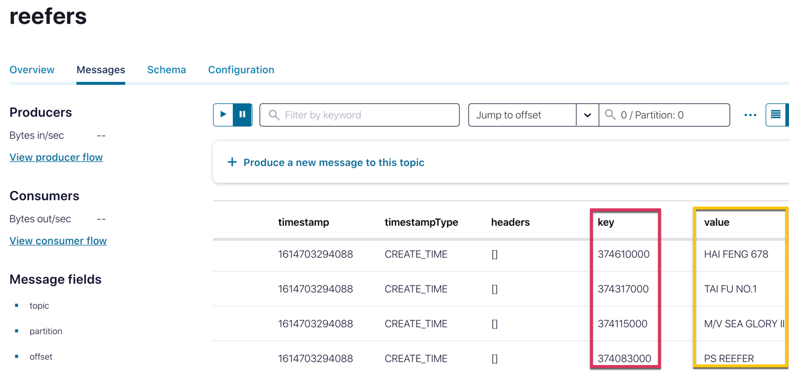
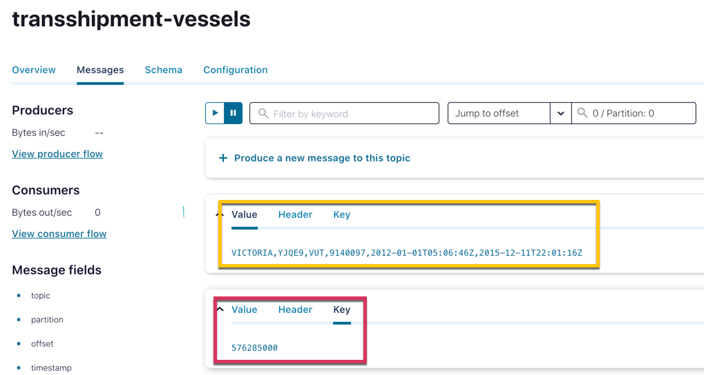

The next step was to define a ksqlDB table on each of the Kafka topics. Because the data's delimited I had to declare the full schema. Note also the `PRIMARY KEY` specification on each, which denotes that that field comes from the key of the Kafka message (rather than the value) 

[source,sql]
----
CREATE TABLE reefers_raw (mmsi         VARCHAR PRIMARY KEY, 
                          shipname_raw VARCHAR) 
  WITH (KAFKA_TOPIC='reefers', 
        FORMAT     ='DELIMITED');

CREATE TABLE transshipment_vessels_raw (mmsi            VARCHAR PRIMARY KEY,
                                        shipname        VARCHAR, 
                                        callsign        VARCHAR,
                                        flag            VARCHAR,
                                        imo             VARCHAR,
                                        first_timestamp VARCHAR,
                                        last_timestamp  VARCHAR)
  WITH (KAFKA_TOPIC='transshipment-vessels', 
        FORMAT     ='DELIMITED');
----

With the tables created, the next step is to integrate the data into the existing pipeline (since it's the same logical entities). Using a `LEFT OUTER JOIN` I added in two new attribute fields to the existing `SHIP_INFO` table. Note that whilst evolvable queries (`CREATE OR REPLACE`) have been recently added to ksqlDB, the change I was making to the table wasn't supported so I had to rebuild it. But since Kafka stores data it was easy enough to just rebuild this table from the original data stream (`AIS_MSG_TYPE_5`), by setting `'auto.offset.reset' = 'earliest'` so that ksqlDB reconsumes all of the data from the beginning of the topic. 

[source,sql]
----
DROP TABLE SHIP_INFO;

SET 'auto.offset.reset' = 'earliest';

CREATE TABLE SHIP_INFO AS
  SELECT A.MMSI                                                       AS MMSI,
         MAX(ROWTIME)                                                 AS LAST_INFO_PING_TS,
         LATEST_BY_OFFSET(SHIPNAME)                                   AS SHIPNAME,
         LATEST_BY_OFFSET(DRAUGHT)                                    AS DRAUGHT,
         LATEST_BY_OFFSET(DESTINATION)                                AS DESTINATION
         LATEST_BY_OFFSET(CASE WHEN R.MMSI IS NULL THEN 0 ELSE 1 END) AS IS_REEFER, 
         LATEST_BY_OFFSET(CASE WHEN T.MMSI IS NULL THEN 0 ELSE 1 END) AS IS_TRANSSHIPPER
    FROM AIS_MSG_TYPE_5 A
        LEFT JOIN REEFERS_RAW R ON A.MMSI=R.MMSI
        LEFT JOIN TRANSSHIPMENT_VESSELS_RAW T ON A.MMSI=T.MMSI 
GROUP BY A.MMSI ;
----

Now we can use the updated table to lookup each information about a ship by its MMSI, as well as analyse the data that we have. Bear in mind that the row counts shown from `comm` above are for the entire file, whilst the `SHIP_INFO` table is driven by AIS type 5 messages received around Norway - so we can only expect to see ships identified with the reefer/transshipper flags that are sailing in those waters, _and_ have reported a type 5 message in the time sample. 

[source,sql]
----
ksql> SELECT CASE
              WHEN IS_REEFER =0 AND IS_TRANSSHIPPER = 0 THEN 'Neither'
              WHEN IS_REEFER =1 AND IS_TRANSSHIPPER = 0 THEN 'Reefer.csv only'
              WHEN IS_REEFER =0 AND IS_TRANSSHIPPER = 1 THEN 'transshiper.csv only'
              WHEN IS_REEFER =1 AND IS_TRANSSHIPPER = 1 THEN 'Both'
            END AS LABEL,
            COUNT(*) AS CT 
        FROM SHIP_INFO 
        GROUP BY CASE
              WHEN IS_REEFER =0 AND IS_TRANSSHIPPER = 0 THEN 'Neither'
              WHEN IS_REEFER =1 AND IS_TRANSSHIPPER = 0 THEN 'Reefer.csv only'
              WHEN IS_REEFER =0 AND IS_TRANSSHIPPER = 1 THEN 'transshiper.csv only'
              WHEN IS_REEFER =1 AND IS_TRANSSHIPPER = 1 THEN 'Both'
            END
        EMIT CHANGES;

+---------------------+-----+
|LABEL                |CT   |
+---------------------+-----+
|transshiper.csv only |6    |
|Reefer.csv only      |8    |
|Both                 |6    |
|Neither              |3223 |
…
----

=== Identifying vessels that are close to each other for a period of time

Having built a table that enables us to characterise ships as fishing vessels or reefers, we now come to the crux of the requirement: 

> …where a fishing vessel and a transshipment vessel were *continuously within 500 m for at least 2 h and traveling at < 2 knots*

I solved this using two hops: 

* Create stream of ships close to each other at any time and travelling at a slow speed
+
> …where a fishing vessel and a transshipment vessel were *continuously within 500 m … and traveling at < 2 knots*

* Create a windowed aggregate on this stream to identify those that had been close for longer than two hours
+
> for at least 2 h 

==== Stream-Stream joins in ksqlDB

When we built the streaming ETL pipeline above we used a stream-table join, to enrich a stream of events with supplemental information. Now we're going to use a stream-stream join. The two streams are both going to be from the AIS data of ship position reports, but one stream will only be fishing vessels, and the other reefers. We can use the `GEO_DISTANCE` function to determine the distance between them (based on the https://en.wikipedia.org/wiki/Great-circle_distance[great-circle distance]) and use this as a predicate in the resulting stream. 

When doing a stream-stream join ksqlDB requires two unique source streams, for various https://github.com/confluentinc/ksql/issues/2030[reasons]. This is the case even if the underlying data is the same, so what we do here is a bit of a cludgy workaround. First up we rebuild `SHIP_STATUS_REPORTS` to include a literal value in a field called `DUMMY` (you'll see why in a moment): 

[source,sql]
----
DROP STREAM SHIP_STATUS_REPORTS;

SET 'auto.offset.reset' = 'earliest';

CREATE STREAM SHIP_STATUS_REPORTS WITH (KAFKA_TOPIC='SHIP_STATUS_REPORTS_V00') AS
SELECT STATUS_REPORT.ROWTIME AS STATUS_TS, STATUS_REPORT.*,  SHIP_INFO.*,
       1 AS DUMMY
FROM  AIS_MSG_TYPE_1_2_3 STATUS_REPORT 
      LEFT JOIN SHIP_INFO SHIP_INFO 
        ON STATUS_REPORT.MMSI = SHIP_INFO.MMSI;
----

and then we _clone_ this stream into a new one, with a predicate to include only events which come from what we think may be a reefer (i.e. a ship whose MMSI appears on one or both of the `Reefer.csv` / `transshipper.csv`): 

[source,sql]
----
CREATE STREAM REEFER_MOVEMENTS AS 
  SELECT *
    FROM SHIP_STATUS_REPORTS
   WHERE (SHIP_INFO_IS_TRANSSHIPPER=1 
       OR SHIP_INFO_IS_REEFER=1);
----

_Now_ we build our stream-stream join, between `SHIP_STATUS_REPORTS` (with a predicate to include only fishing vessels) and `REEFER_MOVEMENTS`. 

[source,sql]
----
CREATE STREAM REEFERS_AND_VESSELS_WITHIN_500M 
  WITH (KAFKA_TOPIC='REEFERS_AND_VESSELS_WITHIN_500M_V00') AS
SELECT    V.STATUS_REPORT_MMSI   AS FISHING_VESSEL_MMSI,
          R.STATUS_REPORT_MMSI   AS REEFER_MMSI,
          V.SHIP_LOCATION        AS FISHING_VESSEL_LOCATION,
          R.SHIP_LOCATION        AS REEFER_LOCATION,
          GEO_DISTANCE(V.STATUS_REPORT_LAT, V.STATUS_REPORT_LON, R.STATUS_REPORT_LAT, R.STATUS_REPORT_LON, 'KM') AS DISTANCE_KM,
          CASE
            WHEN GEO_DISTANCE(V.STATUS_REPORT_LAT, V.STATUS_REPORT_LON, R.STATUS_REPORT_LAT, R.STATUS_REPORT_LON, 'KM') < 0.5
                 AND  (    R.STATUS_REPORT_SPEED <2
                       AND V.STATUS_REPORT_SPEED < 2) THEN 1
                 ELSE 0
             END AS IN_RANGE_AND_SPEED
FROM      SHIP_STATUS_REPORTS V
          INNER JOIN REEFER_MOVEMENTS R 
            WITHIN 1 MINUTE
            ON     R.DUMMY = V.DUMMY
WHERE     V.SHIP_INFO_SHIPTYPE_TEXT  = 'Fishing'
AND       V.STATUS_REPORT_MMSI      != R.STATUS_REPORT_MMSI
AND       GEO_DISTANCE(V.STATUS_REPORT_LAT, V.STATUS_REPORT_LON, R.STATUS_REPORT_LAT, R.STATUS_REPORT_LON, 'KM') < 1 
PARTITION BY V.STATUS_REPORT_MMSI;
----

This stream includes a `IN_RANGE_AND_SPEED` flag which we'll use in the next step and hardcodes the predicates of the pattern we're looking for (distance is less than 0.5km, both ships moving at less than 2 knots). The resulting stream only includes ships that are within 1km of each other (regardless of speed). Why 1km? Because when I was testing I wanted to make sure it worked, so included values over 500m too :) 

[source,sql]
----
+--------------------+------------+-------------------------------+------------------------------+----------------------+-------------------+
|FISHING_VESSEL_MMSI |REEFER_MMSI |FISHING_VESSEL_LOCATION        |REEFER_LOCATION               |DISTANCE_KM           |IN_RANGE_AND_SPEED |
+--------------------+------------+-------------------------------+------------------------------+----------------------+-------------------+
|258036000           |257430000   |{lat=62.324023, lon=5.66427}   |{lat=62.321373, lon=5.653208} |0.642853083812366     |0                  |
|273844800           |273440860   |{lat=69.728918, lon=30.034538} |{lat=69.72819, lon=30.03179}  |0.1332701769571591    |1                  |
|273433220           |273440860   |{lat=69.72493, lon=30.023542}  |{lat=69.72819, lon=30.03179}  |0.4820709202116538    |1                  |
|273433400           |273440860   |{lat=69.727357, lon=30.03141}  |{lat=69.72819, lon=30.03179}  |0.09377524348557457   |1                  |
|257810500           |258211000   |{lat=62.55565, lon=6.26555}    |{lat=62.548723, lon=6.276892} |0.9649975921607864    |0                  |
----

Using Kibana we can use this stream to plot on the map where these types of ship are close to each other, regardless of for how long: 

TODO_

==== Session windows in ksqlDB

With this stream of events we can now look at which ships match the requirement in terms of the duration of their closeness and speed. I used a windowed aggregation here with a session window to group the aggregates. You can learn more about windowed aggregates in ksqlDB in https://docs.ksqldb.io/en/latest/concepts/time-and-windows-in-ksqldb-queries/[the documentation], but whereas a https://docs.ksqldb.io/en/latest/concepts/time-and-windows-in-ksqldb-queries/#tumbling-window[tumbling window] has a fixed duration, a https://docs.ksqldb.io/en/latest/concepts/time-and-windows-in-ksqldb-queries/#session-window[session window] varies depending on the continuing arrival of events within a given timeout. 

[source,sql]
----
SELECT FISHING_VESSEL_MMSI,
       REEFER_MMSI,
       TIMESTAMPTOSTRING(MIN(ROWTIME),'HH:mm:ss','Europe/Oslo') AS FIRST_TIME,
       TIMESTAMPTOSTRING(MAX(ROWTIME),'HH:mm:ss','Europe/Oslo') AS LAST_TIME,
       (MAX(ROWTIME) - MIN(ROWTIME)) / 1000                     AS DIFF_SEC,
       MAX(DISTANCE_KM) AS FURTHEST_DISTANCE,
       COUNT(*) AS EVENT_CT
FROM   REEFERS_AND_VESSELS_WITHIN_1KM WINDOW SESSION (10 MINUTES)
WHERE  IN_RANGE_AND_SPEED=1
GROUP BY FISHING_VESSEL_MMSI, REEFER_MMSI
EMIT CHANGES;
----

[source,sql]
----
+--------------------+------------+-----------+----------+---------+-------------------+---------+
|FISHING_VESSEL_MMSI |REEFER_MMSI |FIRST_TIME |LAST_TIME |DIFF_SEC |FURTHEST_DISTANCE  |EVENT_CT |
+--------------------+------------+-----------+----------+---------+-------------------+---------+
|273433220           |273440860   |11:57:14   |12:33:13  |2159     |0.4846046047267392 |13       |
|258036000           |257430000   |13:01:07   |13:04:54  |227      |0.4997634317289095 |4        |
|257888000           |258211000   |11:57:54   |13:33:45  |5751     |0.3039245344432804 |58       |
----

The `10 MINUTES` session window timeout is unrelated to the the two hours time period that we're going to build into a predicate. The session window timeout means that if two ships are close and within speed parameters, but there is no event received from both within ten minutes then the session window 'closes'. If events are subsequently received that counts as a new window. The window is important because that gives us the duration of the window (`DIFF_SEC`) against which we can build a predicate. If you want to allow for greater 'blackouts' in events you can increase the timeout on the session window—but bear in mind that it could be that events _were_ received from both ships but one or other predicate (speed / distance) wasn't matched. In this scenario you'd end up with logically invalid results.

Using this session windowing logic, combined with a `HAVING` predicate, we can now build out table of fishing vessels and reefers that are close together, at slow speed, for more than two hours (7200 seconds): 

[source,sql]
----
CREATE TABLE REEFERS_AND_VESSELS_CLOSE_FOR_GT_2HR 
  WITH (KAFKA_TOPIC='REEFERS_AND_VESSELS_CLOSE_FOR_GT_2HR_V00') AS
SELECT   FISHING_VESSEL_MMSI,
         REEFER_MMSI,
         STRUCT("lat":=LATEST_BY_OFFSET(FISHING_VESSEL_LAT),"lon":=LATEST_BY_OFFSET(FISHING_VESSEL_LON)) AS LATEST_FISHING_VESSEL_LOCATION,
         STRUCT("lat":=LATEST_BY_OFFSET(REEFER_LAT),        "lon":=LATEST_BY_OFFSET(REEFER_LON))         AS LATEST_REEFER_LOCATION,
         MIN(DISTANCE_KM)                                                                                AS CLOSEST_DISTANCE_KM,
         MAX(DISTANCE_KM)                                                                                AS FURTHEST_DISTANCE_KM,
         MIN(FISHING_VESSEL_TS)                                                                          AS FIRST_TS,
         MAX(FISHING_VESSEL_TS)                                                                          AS LAST_TS,
         (MAX(FISHING_VESSEL_TS) - MIN(FISHING_VESSEL_TS)) / 1000                                        AS DIFF_SEC
FROM     REEFERS_AND_VESSELS_WITHIN_1KM WINDOW SESSION (10 MINUTES)
WHERE    IN_RANGE_AND_SPEED = 1
GROUP BY FISHING_VESSEL_MMSI,
         REEFER_MMSI
HAVING   (MAX(ROWTIME) - MIN(ROWTIME)) / 1000 > 7200;
----

=== Visualising the results

Tables in ksqlDB are backed by Kafka topics, which means that we can stream the continually-updated table over to Elasticsearch (using the managed connector as before), from where it can be plotted in Kibana alongside the existing map view:

Zooming in we can see that in this case it's in the Ålesund municipality, 

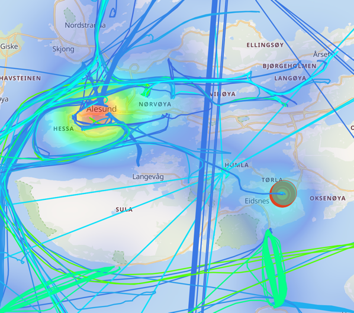

and going right down to the detail the reason the ships are close together for this period of time is…they're in port!

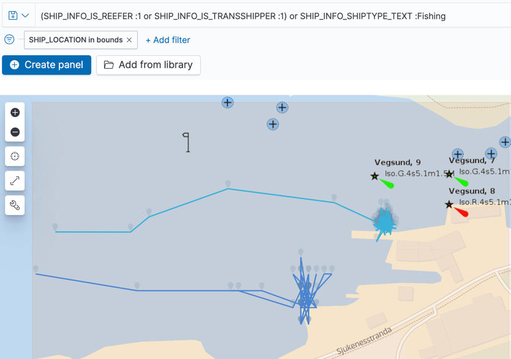

We can see the same behaviour repeating for other matches of the pattern

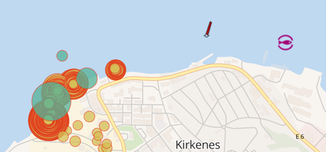

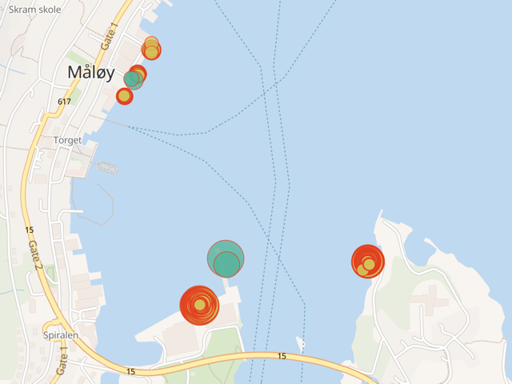

Hence the crucial additional step in the original requirements on which this idea was based: 

> at least 10 km from a coastal anchorage

But that is a project for another day. It'd be entirely doable in ksqlDB—load a Kafka topic with a list of lat/long of coastal anchorages, build a ksqlDB table on that and do a negated join to the stream of vessels identified as close to each other. 

You can use the map visualisation even further, to look at the route that the two vessels took - the fishing vessel (blue) looping around the local area whilst the transhipper (green) continues out and beyond. 

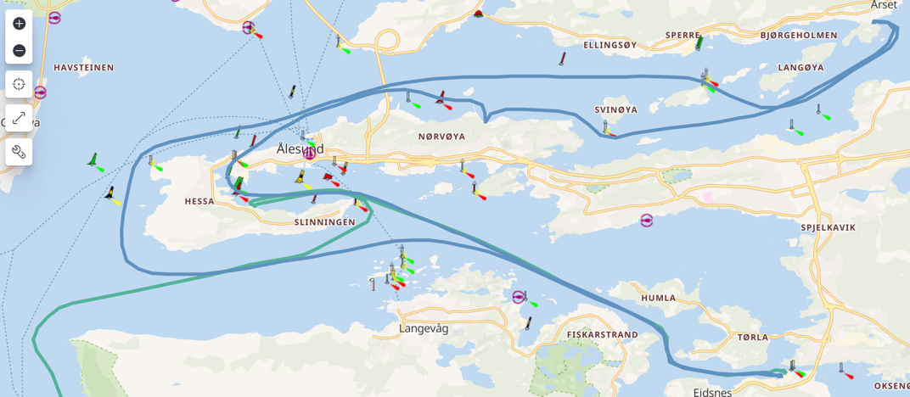

What else can we do with the pattern matches (once we make them a tad more precise)? Visualised on an interactive map is pretty powerful, but let's remember this is data on a Kafka topic, so we can other things with it too: 

* Write it to a database, from where reporting could be driven.
* Build a microservice which subscribes to the topic and drive realtime alerts to prompt action on suspicious behaviour

=== Fishing vessel turns its AIS off

TODO!

=== Summary

The most interesting examples of technology in action are where it fulfills a real requirement. Tools can be fun for the sake of tools, but the AIS data has shown just how useful streams of events like this can be, and what's possible to build with a bit of SQL and some managed cloud services. 

You can https://www.confluent.io/confluent-cloud/tryfree[try out Confluent Cloud] using code `RMOFF200` for an additional $200 off your bill, and Elastic Cloud TODO_WHAT_IS_THEIR_PROMO_OR_CTA?

If you'd rather run this on-premises you can do that too, using the Docker Compose and instructions in https://github.com/confluentinc/demo-scene/blob/master/maritime-ais[the GitHub repo].

==== Acknowledgments

* My huge thanks to Lars Roar Uggerud Dugstad for prompting my curiosity with his question on StackOverflow, and for all his help in scratching the figurative itch that it prompted!
* AIS data distributed by the Norwegian Coastal Administration under https://data.norge.no/nlod/en/2.0/[Norwegian licence for Open Government data (NLOD)]
* https://globalfishingwatch.org/datasets-and-code/[Datasets] distributed by Global Fishing Watch under Creative Commons Attribution-ShareAlike 4.0 International license
