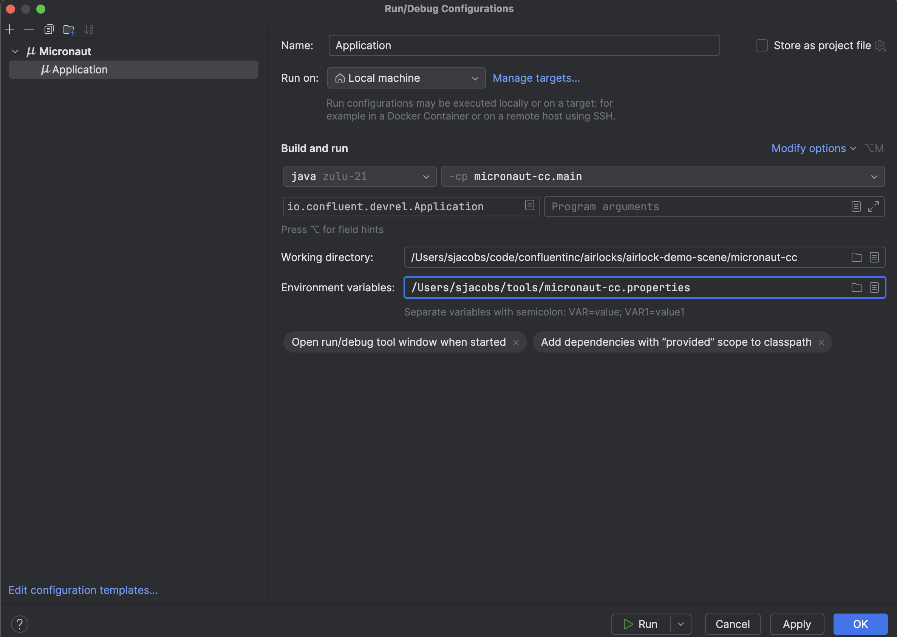

# Micronaut Framework, Apache Kafka&reg; and Confluent Cloud

## What is Micronaut Framework?

Micronaut is an open source JVM-based framework for building lightweight microservices. It is designed to provide features like
dependency injection and inversion of control without Java reflection. Micronaut provides configuration-first bindings with sensible
defaults to a number of external systems - databases, messaging systems, caches, and others.

Among those integrations is Apache Kafka. The code in this example should help you get started with concrete examples on integrating
Micronaut with Apache Kafka, specifically on Confluent Cloud with Stream Governance.

## Using this Example

There are some prerequisites to using these examples:

* [Confluent Cloud Account](https://confluent.cloud)
* [Confluent CLI](https://docs.confluent.io/confluent-cli/current/install.html)
* [Terraform](https://www.terraform.io/)
* Java 21 (I like using [sdkman](https://sdkman.io/) to manage multiple JDK installations.)
* [Docker](https://www.docker.com/)
* [jq](https://jqlang.github.io/jq/)
* Editor/IDE of choice

Note that when installing and configuring the Confluent CLI, include the Confluent Cloud credentials as environment variables for future use. For instance with bash or zsh, include these in your profile as export statements:

```shell
export CONFLUENT_CLOUD_API_KEY=<API KEY>
export CONFLUENT_CLOUD_API_SECRET<API SECRET>
```

### Provision Confluent Cloud Resources

Confluent Cloud resources are provisioned using terraform. Change to the `terraform` directory and issue the following commands:

```bash
export TF_VAR_org_id=$(confluent organization list -o json | jq -c -r '.[] | select(.is_current)' | jq '.id')
terraform init 					
terraform plan -out "tfplan" 			
terraform apply 					
```

Export the environment variables needed to run the application using `terraform output` as follows:

```bash
mkdir -p ~/tools
terraform output -json | jq -r 'to_entries[] | .key + "=\"" + (.value.value | tostring) + "\""' | while read -r line ; do echo "$line"; done > ~/tools/micronaut-cc.properties    
```

These key-value pairs will need to be added as environment variables to the shell (or IDE run configuration) used to run the application.

### Run the Application

This microservice requires a MySQL database instance. Using Docker, start a MySQL container as follows:

```bash
docker run --name micronaut-mysql -e MYSQL_ROOT_PASSWORD="micronaut" -p 3306:3306 -d mysql:8.2.0 
```

Next, use the bash shell of the running container to create a schema:

```bash
docker exec -it micronaut-mysql bash
bash-4.4# mysql -u root -p
Enter password: 
Welcome to the MySQL monitor.  Commands end with ; or \g.
Your MySQL connection id is 31
Server version: 8.2.0 MySQL Community Server - GPL

Copyright (c) 2000, 2023, Oracle and/or its affiliates.

Oracle is a registered trademark of Oracle Corporation and/or its
affiliates. Other names may be trademarks of their respective
owners.

Type 'help;' or '\h' for help. Type '\c' to clear the current input statement.

mysql> show schemas;
+--------------------+
| Database           |
+--------------------+
| information_schema |
| mysql              |
| performance_schema |
| sys                |
+--------------------+
5 rows in set (0.01 sec)

mysql> create schema micronaut;
Query OK, 1 row affected (0.01 sec)

mysql> show schemas;
+--------------------+
| Database           |
+--------------------+
| information_schema |
| micronaut          |
| mysql              |
| performance_schema |
| sys                |
+--------------------+
5 rows in set (0.01 sec)
```

As commited to this repo, the `application.yml` file for Micronaut is configured to use this MySQL database and schema, with the 
credentials in the command. If you configure MySQL differently, please make the appropriate changes to the `application.yml` before executing.

Export the key-value pairs to your shell (or IDE run configuration) then start the application. If using the command line, you can find information
on that in the Micronaut User Guide linked below. IntelliJ IDEA provides a mechanism to import a key-value file as environment variables to a 
run configuration, as follows:



### Unit Testing

This repository includes unit tests to validate events are flowing to and from the Kafka topics configured. These unit tests make
extensive use of Testcontainers, as does the test API for Micronaut by default. More can be found in the user guides.

To execute these tests using Gradle from the terminal window:
```bash
./gradlew test
```

## Useful Micronaut Links
- [User Guide](https://docs.micronaut.io/4.6.3/guide/index.html)
- [API Reference](https://docs.micronaut.io/4.6.3/api/index.html)
- [Configuration Reference](https://docs.micronaut.io/4.6.3/guide/configurationreference.html)
- [Micronaut Guides](https://guides.micronaut.io/index.html)

### Feature kafka documentation

- [Micronaut Kafka Messaging documentation](https://micronaut-projects.github.io/micronaut-kafka/latest/guide/index.html)

### Feature serialization-jackson documentation

- [Micronaut Serialization Jackson Core documentation](https://micronaut-projects.github.io/micronaut-serialization/latest/guide/)

### Feature Testcontainers documentation

- [https://www.testcontainers.org/](https://www.testcontainers.org/)

## Confluent Cloud

- [https://confluent.cloud](Confluent Cloud Login/Signup)
- [https://docs.confluent.io/cloud/current/overview.html](Confluent Cloud Docs)


