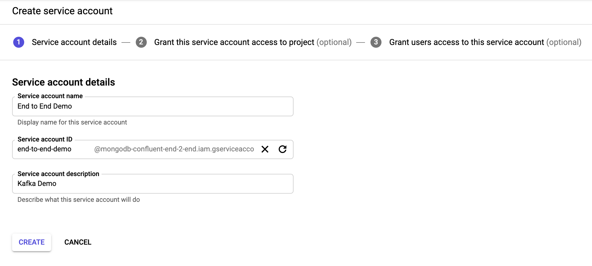

# Bridge to Cloud Demo with Confluent Platform and MongoDB Atlas
This is a joint demo to showcase the power of Confluent Platform and MongoDB together.

You can watch a recording of the joint webinar including the demo here: [Stream me to the Cloud (and back) with Confluent & MongoDB](https://www.mongodb.com/presentations/stream-me-to-the-cloud-and-back)

In this demo we'll use:
1. Confluent Platform
1. Confluent Cloud
1. Confluent Replicator
1. Google Cloud Platform
1. MongoDB Atlas

## Pre-requisites
1. Install Terraform:
   - for MacOs -> `brew install terraform`
   - Alternatively see [Installation Instructions](https://learn.hashicorp.com/terraform/getting-started/install.html)
1. Install Confluent Cloud CLI:
   - for MacOs -> `curl -L https://cnfl.io/ccloud-cli | sh -s -- -b /<path-to-directory>/bin`i.e./usr/local/bin
   - Alternatively see [Installation Instructions](https://docs.confluent.io/current/cloud/cli/install.html)
1. Install Mac coreutils:
   - for MacOs -> `brew install coreutils`
1. Clone this repository, from now on we'll consider this as base path
1. MongoDB Realm CLI
   - [Install realm-cli](https://docs.mongodb.com/realm/deploy/realm-cli-reference/#installation)
   - [Create API key](https://docs.atlas.mongodb.com/configure-api-access/#programmatic-api-keys) You will need at least the project owner role.

## Configure Cloud Provider

### Configure GCP

1. Login to http://console.cloud.google.com
2. Navigate to "IAM & Admin" -> "Service Accounts"
3. Create a Service Account
   
4. Download the credentials json file to the local file system

## Configure MongoDB Atlas
1. Create a project
1. Add an API Key with Project Permissions: `Project Owner`
1. copy the public_key, the private_key and the project id (you will need them later)

## Configure the demo
1. create a copy of the file `config/demo.cfg.example` and rename the copy `demo.cfg`
1. fill the `demo.cfg` file with the required information
   - **CLOUD_PROVIDER**: can be only be `gcp` at the moment. A VM will be created on GCP, so your laptop has no content running for the demo.
1. execute `create_demo_environment.sh`
1. At the end of the script you will receive an output with the IP of your demo. Copy that ip in your browser to continue

## Destroy the environment
1. execute `destroy_demo_environment.sh`