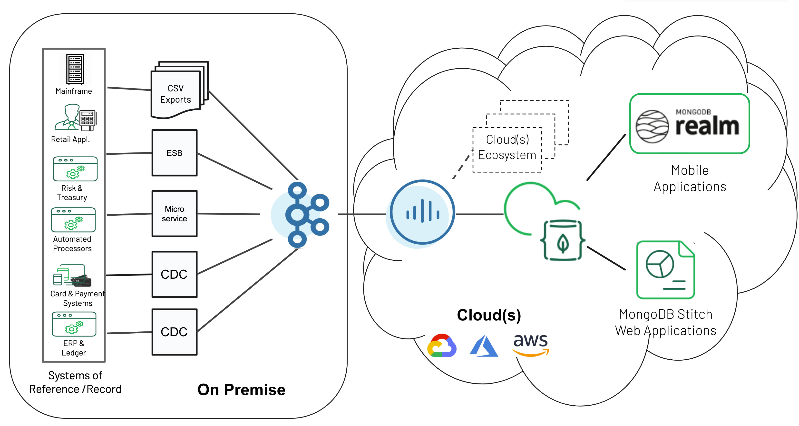
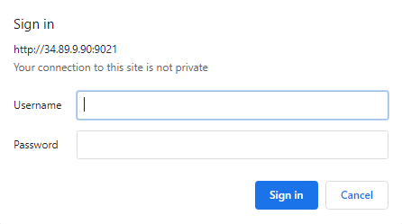
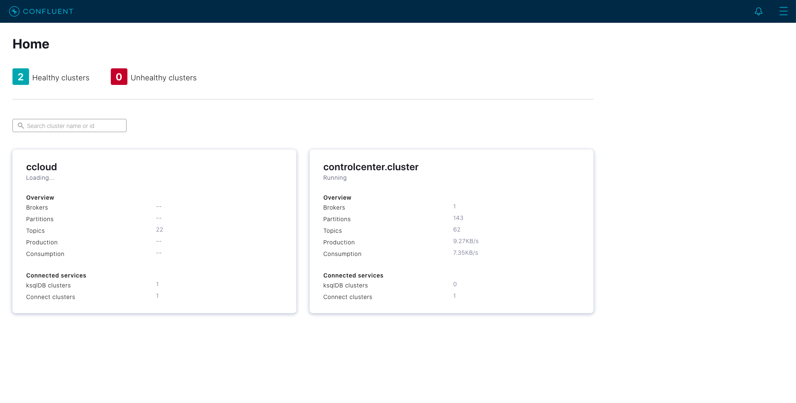
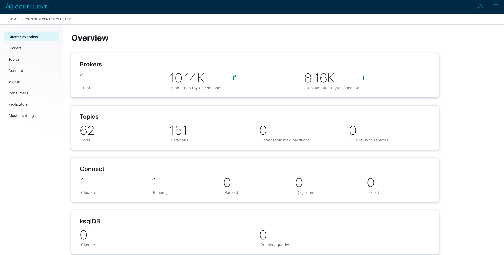
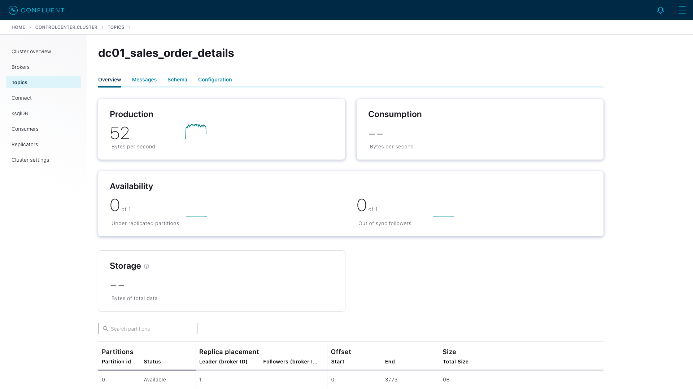
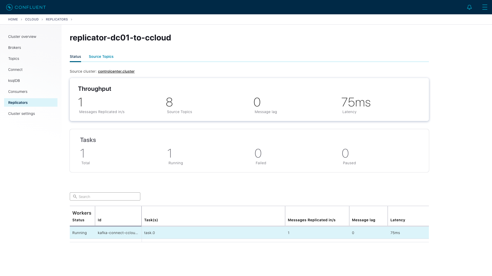
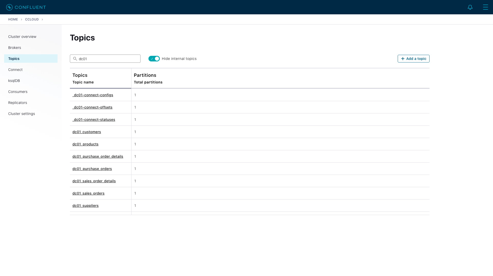
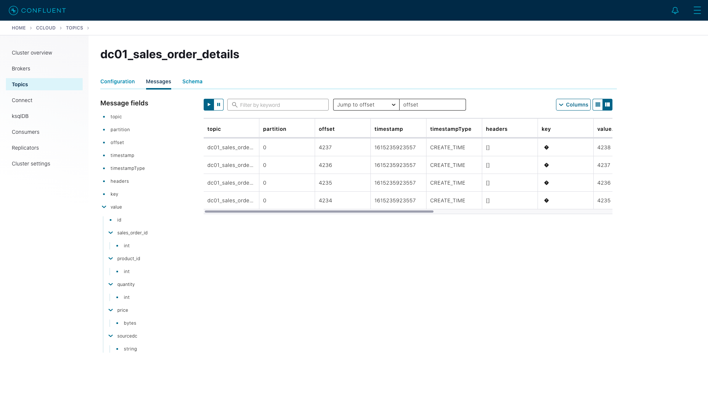
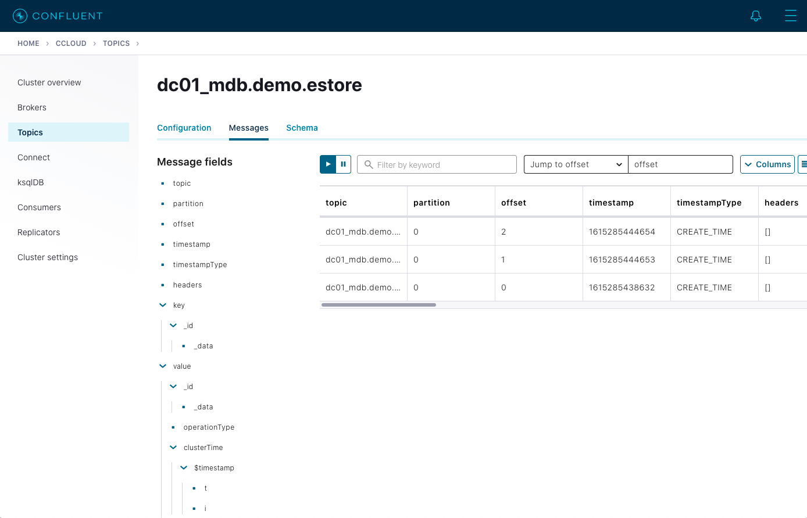

# Bridge to Cloud (and back!) with Confluent and MongoDB Atlas
This is a joint demo to showcase the power of Confluent and MongoDB together.

You can watch a recording of the joint webinar including the demo here: [Stream me to the Cloud (and back) with Confluent & MongoDB](https://www.mongodb.com/presentations/stream-me-to-the-cloud-and-back)

In this demo we'll use:
1. Confluent Platform
1. Confluent Cloud
1. Confluent Replicator
1. Google Cloud Platform
1. MongoDB Atlas





## Configure Cloud Provider

### Configure GCP

1. Login to http://console.cloud.google.com
2. Navigate to "IAM & Admin" -> "Service Accounts"
3. Create a Service Account
   
4. Download the credentials json file to the local file system

## Configure MongoDB Atlas
1. Create a project
1. Add an API Key with Project Permissions: `Project Owner`
1. copy the public_key, the private_key and the project id (you will need them later)

## Configure the demo
1. Clone this repository, from now on we'll consider this as base path
1. create a copy of the file `config/demo.cfg.example` and rename the copy `demo.cfg`
1. fill the `demo.cfg` file with the required information
   - **CLOUD_PROVIDER**: can be only be `gcp` at the moment. A VM will be created on GCP, so your laptop has no content running for the demo.

## Spin Up the Demo (using Docker, Easier)
This approach uses Docker tosandbox the environment needed to spin up the demo, if you prefer a direct approach see next chapter.

1. Copy the gcp json license you downloaded earlier to the tmp folder, rename it to gcp-license.json then in the config file you should point to it like: `/mongodb-demo/tmp/gcp-license.json`
1. In your terminal, navigate to the folder docker
1. Run `docker-compose up -d`
1. Enter in the bash terminal of the docker container using: 
   `docker exec -it mongodb-demo-launcher /bin/bash`
1. Navigate to the right folder: `cd /mongodb-demo`
1. Login to your Confluent Cloud account and save the credentials:
   `ccloud login --save`
1. execute `./create_demo_environment.sh`
1. The script will prompt you to confirm twice.
    - The first time it will ask you if you are ok to create resources in Confluent Cloud, you must answer YES
    - The first time it will ask you if you want to create a ksqlDB instance. This is not required for this demo as it will be provisioned in the VM. You can answer NO .
1. At the end of the script you will receive an output with the IP of your demo. Copy that ip in your browser to continue

## Spin Up the Demo (directly)

### Pre-requisites
For this approach you need the following installed in your computer.

1. Install Terraform:
   - for MacOs -> `brew install terraform`
   - Alternatively see [Installation Instructions](https://learn.hashicorp.com/terraform/getting-started/install.html)
1. Install Confluent Cloud CLI:
   - for MacOs -> `curl -L https://cnfl.io/ccloud-cli | sh -s -- -b /<path-to-directory>/bin`i.e./usr/local/bin
   - Alternatively see [Installation Instructions](https://docs.confluent.io/current/cloud/cli/install.html)
1. Python + [Yaml](https://pyyaml.org/wiki/PyYAML)
1. Install Mac coreutils:
   - for MacOs -> `brew install coreutils`
1. MongoDB Realm CLI
   - [Install realm-cli](https://docs.mongodb.com/realm/deploy/realm-cli-reference/#installation)
   - [Create API key](https://docs.atlas.mongodb.com/configure-api-access/#programmatic-api-keys) You will need at least the project owner role.

### Create the demo environment

1. execute `create_demo_environment.sh`
1. At the end of the script you will receive an output with the IP of your demo. Copy that ip in your browser to continue

## Demo Walkthrough
At the end of the script you should receive an uotput that looks like this:

```bash
Apply complete! Resources: 1 added, 0 changed, 0 destroyed.
                                                                                              
██╗  ██╗██╗   ██╗██████╗ ██████╗ ██╗██████╗      ██████╗██╗      ██████╗ ██╗   ██╗██████╗  
██║  ██║╚██╗ ██╔╝██╔══██╗██╔══██╗██║██╔══██╗    ██╔════╝██║     ██╔═══██╗██║   ██║██╔══██╗ 
███████║ ╚████╔╝ ██████╔╝██████╔╝██║██║  ██║    ██║     ██║     ██║   ██║██║   ██║██║  ██║ 
██╔══██║  ╚██╔╝  ██╔══██╗██╔══██╗██║██║  ██║    ██║     ██║     ██║   ██║██║   ██║██║  ██║ 
██║  ██║   ██║   ██████╔╝██║  ██║██║██████╔╝    ╚██████╗███████╗╚██████╔╝╚██████╔╝██████╔╝ 
╚═╝  ╚═╝   ╚═╝   ╚═════╝ ╚═╝  ╚═╝╚═╝╚═════╝      ╚═════╝╚══════╝ ╚═════╝  ╚═════╝ ╚═════╝  
                                                                                           
                        ██████╗ ███████╗███╗   ███╗ ██████╗                                
                        ██╔══██╗██╔════╝████╗ ████║██╔═══██╗                               
                        ██║  ██║█████╗  ██╔████╔██║██║   ██║                               
                        ██║  ██║██╔══╝  ██║╚██╔╝██║██║   ██║                               
                        ██████╔╝███████╗██║ ╚═╝ ██║╚██████╔╝                               
                        ╚═════╝ ╚══════╝╚═╝     ╚═╝ ╚═════╝                                
                                                                                           
     ██████╗ ██████╗ ███╗   ██╗███████╗██╗     ██╗   ██╗███████╗███╗   ██╗████████╗        
    ██╔════╝██╔═══██╗████╗  ██║██╔════╝██║     ██║   ██║██╔════╝████╗  ██║╚══██╔══╝        
    ██║     ██║   ██║██╔██╗ ██║█████╗  ██║     ██║   ██║█████╗  ██╔██╗ ██║   ██║           
    ██║     ██║   ██║██║╚██╗██║██╔══╝  ██║     ██║   ██║██╔══╝  ██║╚██╗██║   ██║           
    ╚██████╗╚██████╔╝██║ ╚████║██║     ███████╗╚██████╔╝███████╗██║ ╚████║   ██║           
     ╚═════╝ ╚═════╝ ╚═╝  ╚═══╝╚═╝     ╚══════╝ ╚═════╝ ╚══════╝╚═╝  ╚═══╝   ╚═╝           
                                                                                           
            ███╗   ███╗ ██████╗ ███╗   ██╗ ██████╗  ██████╗ ██████╗ ██████╗                
            ████╗ ████║██╔═══██╗████╗  ██║██╔════╝ ██╔═══██╗██╔══██╗██╔══██╗               
            ██╔████╔██║██║   ██║██╔██╗ ██║██║  ███╗██║   ██║██║  ██║██████╔╝               
            ██║╚██╔╝██║██║   ██║██║╚██╗██║██║   ██║██║   ██║██║  ██║██╔══██╗               
            ██║ ╚═╝ ██║╚██████╔╝██║ ╚████║╚██████╔╝╚██████╔╝██████╔╝██████╔╝               
            ╚═╝     ╚═╝ ╚═════╝ ╚═╝  ╚═══╝ ╚═════╝  ╚═════╝ ╚═════╝ ╚═════╝                
                                                                                           
                                                                                           
*******************************************************************************************
 
 
Handy links: 
 - External IP: YY.89.XX.39
 - Confluent Control Center: http://YY.89.XX.39:9021
 - MongoDB Atlas Realm App: https://checkout-rdmrw.mongodbstitch.com
```

### Introduction

Your environment represents an on-premise data center and consists of a virtual machine hosted in the cloud running several docker containers. In a real world implementation, some of the components would be deployed differently but the logical data flow that we will be working on would remain the same.

The primary data source for this workshop is a MySQL database running in your data center (VM). Connected to this database is a orders application. This application will continuously create new sales orders to simulate product demand. The application will also raise purchase orders when told to do so.


### View Messages in Confluent Control Center

We can use Confluent Control Center (use the link returned by the demo creation script) to monitor and control our whole demo environment. 

Use the following username and password to authenticate to Confluent Control Center

```
Username: dc01
Password: your workshop password
```



On the landing page we can see that Confluent Control Center is monitoring two Kafka Clusters, our on-premise cluster and a Confluent Cloud Cluster



Click on the "controlcenter.cluster" tile, this is your on-premise cluster.



Select the Topics Menu on the left


Select the `dc01_sales_order_details` topic



Finally select the Messages tab and observe that messages are being streamed into Kafka from MySQL in real time.


### Confluent Replicator

This Demo uses Confluent Replicator to stream the messages created by Debezium connector to Confluent Cloud.

Confluent Replicator uses Kafka Connect under the covers and can be considered a special type of connector, however, unlike other connectors, the source _and_ target technology for the connector is a Kafka Cluster.

We can view the status of Replicator in Confluent Control Center by selecting `Replicators` on the left-hand navigation pane. Here we can see throughput and latency statistics.



### Confirm that Messages are Arriving in Confluent Cloud

In Control Center you can always reach back the home by clicking on the confluent logo on the top left, or by clicking ont the HOME in the top navigation bar.
Select the "ccloud" cluster and then select "Topics". 

You can filter the list of topics by using the search box, type your data center name, dc01, into the search box at the top to filter.



Select the `dc01_sales_order_details` topic and finally the "Messages" tab under the topic heading. You should see messages streaming in from your on-premise Kafka cluster.



### ksqlDB Application

We now have all the data we need being streamed, in realtime, to Confluent Cloud. You have a ksqlDB Server. You can find it in Control Center, ccloud cluster, click on ksqlDB on the left menu.
Now click on the Flow Tab, you will see the topology of the ksqlDB application. Spend some time in understanding how the data is transformed, and see the data flowing in and being enriched in real time.


If you want more details on each step see the Deep Dive [Deep Dive](deep-dive.md).


### Stream Sales & Purchases to MongoDB Atlas

We can use the MongoDB Sink Connector to stream changes from Confluent Cloud to MongoDB Atlas, from here the data can be leveraged in the wider MongoDB ecosystem.

To do this we used ksqlDB to create the connector.

The command we used (below) will create a connector that will sink the `dc01_sales_enriched` and the `dc01_purchases_enriched` topics to MongoDB.

```
CREATE SINK CONNECTOR dc01_mongodb_sink WITH (
  'connector.class'='com.mongodb.kafka.connect.MongoSinkConnector',
  'tasks.max'='1',
  'topics'='dc01_sales_enriched,dc01_purchases_enriched',
  'connection.uri'='${file:/secrets.properties:MONGODBATLAS_SRV_ADDRESS}',
  'database'='demo',
  'collection'='dc01',
  'topic.override.dc01_sales_enriched.collection'='dc01_sales',
  'topic.override.dc01_purchases_enriched.collection'='dc01_purchases',
  'key.converter'='org.apache.kafka.connect.storage.StringConverter',
  'transforms'='WrapKey',
  'transforms.WrapKey.type'='org.apache.kafka.connect.transforms.HoistField$Key',
  'transforms.WrapKey.field'='ROWKEY',
  'document.id.strategy'='com.mongodb.kafka.connect.sink.processor.id.strategy.UuidStrategy',
  'post.processor.chain'='com.mongodb.kafka.connect.sink.processor.DocumentIdAdder',
  'max.batch.size'='20'
);
```

We can list our current connectors using the following command in ksqlDB

```
show connectors;
```

```
 Connector Name            | Type   | Class
------------------------------------------------------------------------------------------------
 dc01_MONGODB_SINK         | SINK   | com.mongodb.kafka.connect.MongoSinkConnector
 replicator-dc01-to-ccloud | SOURCE | io.confluent.connect.replicator.ReplicatorSourceConnector
```

We can also describe a connector and view its status using the `describe connector` statement.

```
describe connector dc01_MONGODB_SINK;
```

```
Name                 : dc01_MONGODB_SINK
Class                : com.mongodb.kafka.connect.MongoSinkConnector
Type                 : sink
State                : RUNNING
WorkerId             : kafka-connect:18084

 Task ID | State   | Error Trace
---------------------------------
 0       | RUNNING |
---------------------------------
```

Depending on who's hosting the demo, you may or may not have access to the MongoDB Atlas account where the database is held.


### Realm triggers
Now that we got our data in MongoDB Atlas, there are multiple things we can do with it.

MongoDB Realm triggers enable you to execute application and database logic automatically, either in response to events or based on a pre-defined schedule. Realm supports three types of triggers:

* **Database triggers**, which can automatically respond when documents are added, updated, or removed in a linked MongoDB collection.
* **Authentication triggers**, which execute additional server-side logic when a user is created, authenticated, or deleted.
* **Scheduled triggers**, which execute functions at regular intervals according to a pre-defined schedule.

Triggers listen for application events of a configured type and are each linked with a specific Realm function. Whenever a trigger observes an event that matches your configuration, it “fires” and passes the event object that caused it to fire as the argument to its linked function. You can configure the events that cause a trigger to fire based on their operation type as well as other values specific to each type of trigger.

In this workshop we configured a Trigger that reads data from the `dc01_sales` collection in MongoDB and writes it to a new collection using a different JSON structure. Below you can see the code of this function.

```
exports = function(changeEvent) {

    const order = changeEvent.fullDocument;

    let purchaseOrder = {
      'ORDER_ID': order.ORDER_ID,
      'CUSTOMER': {
        'ID': order.CUSTOMER_ID,
        'FNAME': order.CUSTOMER_FNAME,
        'LNAME': order.CUSTOMER_LNAME,
        'EMAIL': order.CUSTOMER_EMAIL,
        'COUNTRY': order.CUSTOMER_COUNTRY,
        'CITY': order.CITY},
      'PRODUCT':{
        'CODE': order.PRODUCT_ID,
        'QUANTITY': order.PRODUCT_QTY},
      'DATE':{
        'ORDERED': order.ORDER_DATE}
    };

    var collection = context.services.get("mongodb-atlas").db("demo").collection("po");
    collection.insertOne(purchaseOrder);

};
```

### Realm application
MongoDB Atlas is a great platform to build modern and scalable applications. These applications can now leverage all the data retrieved in real time from your legacy systems as it is now in MongoDB Atlas ready to be used. 
These applications will also produce new data, what if you need to communicate these information back to your on premise environment? Let's have a look!

The application is already deployed in MongoDB Atlas and lets you put Orders online, with a simple web application. 

You can place your first order by using the Link returned by the demo creation script


The application itself is hosted in MongoDB Atlas, and the data inserted from the UI will flow in the collection `demo.po`

### MongoDB Source Connector
Now  your customers can place orders from this brand new web applications! That's great but... how do you tie this with your backend processes? Let's get this new data back to on-premise!

In this case we configured the connector to load data from MongoDB Atlas to Confluent Cloud.

Every Time you will place an order using the demo web store , these orders are persisted in MongoDB. We'll read the collection that contains these orders, and produce these events to the `dc01_mdb.demo.estore` topic

```
curl -i -X POST -H "Accept:application/json" \
  -H  "Content-Type:application/json" http://localhost:18084/connectors/ \
  -d '{
      "name": "dc01_mongodb_source",
      "config": {
        "connector.class":"com.mongodb.kafka.connect.MongoSourceConnector",
        "tasks.max":1,
        "key.converter":"org.apache.kafka.connect.storage.StringConverter",
        "value.converter":"org.apache.kafka.connect.storage.StringConverter",
        "connection.uri":"${file:/secrets.properties:MONGODBATLAS_SRV_ADDRESS}",
        "database":"demo",
        "collection":"estore",
        "topic.prefix": "dc01_mdb"
      }
  }'
```

Use Confluent Control Center to see the events coming in, as they are synced from MongoDB Atlas.
Select "ccloud" cluster from the Home page.

Select the `dc01_mdb.demo.estore` topic, then click on the Messages tab and observe that messages are being streamed into Kafka from MongoDB ATlas in real time.




### Replicate MongoDB orders to On-Premise Kafka
Now that the data is in Confluent Cloud, you could sync it back to On-Premise Kafka, and then to MySQL using Confluent Replicator. Have fun!


## Further Reading
If you want to dig deeper here some useful links:

* [Demo Deep Dive](deep-dive.md)
* [Debezium MySQL Configuration Options](https://debezium.io/documentation/reference/1.1/connectors/mysql.html#mysql-connector-configuration-properties_debezium)
* [Kafka Connect REST API](https://docs.confluent.io/current/connect/references/restapi.html)
* [cURL manpage](https://curl.haxx.se/docs/manpage.html)
* [Confluent Control Center Documentation](https://docs.confluent.io/current/control-center/index.html)
* [Confluent Replicator](https://docs.confluent.io/current/connect/kafka-connect-replicator/index.html)
* [Confluent Replicator Configuration Properties](https://docs.confluent.io/current/connect/kafka-connect-replicator/configuration_options.html)
* [ksqlDB Overview](https://docs.ksqldb.io/en/latest/)
* [ksqlDB Streams](https://docs.ksqldb.io/en/latest/developer-guide/create-a-stream/)

## Troubleshooting

### No data generated in the `sales_order` topic

The orders application will continuously create new sales orders to simulate product demand. The application will also raise purchase orders when told to do so, we'll cover this aspect later on in the workshop. If you don't see data flowing in, check if the simulator is working as expected.

```
docker logs -f db-trans-simulator
```

You should see an output like this:
```
Sales Order 1 Created
Sales Order 2 Created
Sales Order 3 Created
Sales Order 4 Created
Sales Order 5 Created
Sales Order 6 Created
...
```

Press `ctrl-c` to quit

If you need to restart the generator you can use the following command:
```
docker exec -dit db-trans-simulator sh -c "python -u /simulate_dbtrans.py > /proc/1/fd/1 2>&1"
```

We now have `sales_order` and `sales_order_details` rows being created for us by the orders application.


## Destroy the environment
1. execute `destroy_demo_environment.sh`