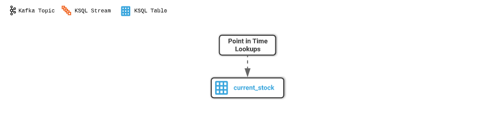
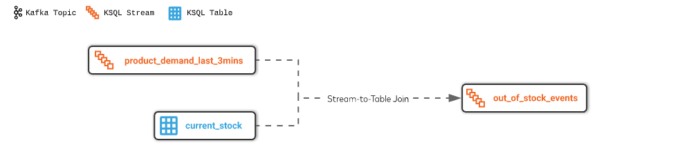
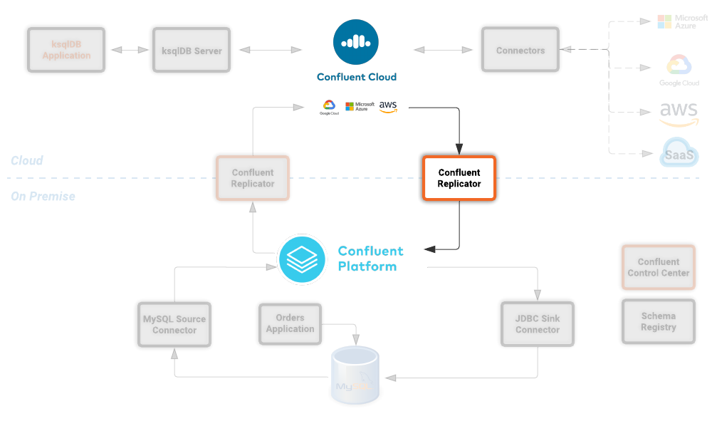
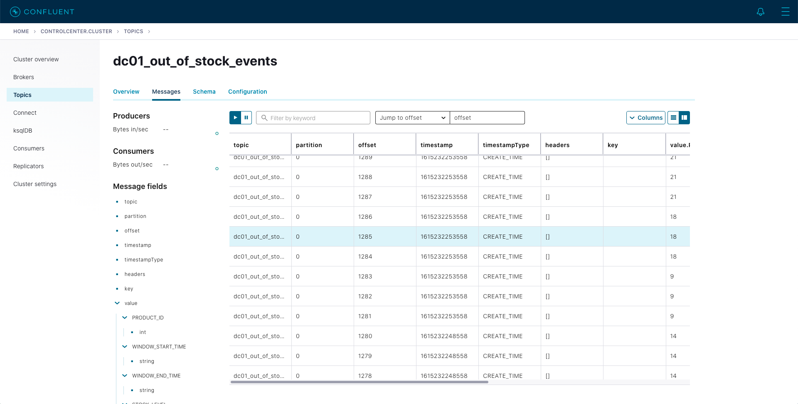

# Bridge to Cloud (and back!) with Confluent and MongoDB Atlas


## Deep Dive

### Connecting to your virtual Data Center (VM)
To login to your virtual data center open a terminal session and use the password that you configured. Replace <External IP> with the value returned by the creation script

```
ssh dc01@<External IP>
```

Once logged in run the following command to confirm that you have several docker containers running

```bash
docker ps --format "table {{.ID}}\t{{.Names}}\t{{.RunningFor}}\t{{.Status}}"
```

You should see something similar to this.

```
CONTAINER ID        NAMES                     CREATED             STATUS
ef959fb9e566        db-trans-simulator        3 minutes ago       Up 3 minutes
979c20e26e60        ksqldb-cli                3 minutes ago       Up 3 minutes
0d9e1fa2c83f        ksqldb-server-ccloud      3 minutes ago       Up 3 minutes
4eb1ba589357        control-center            3 minutes ago       Up 3 minutes
e83088712e60        kafka-connect-ccloud      3 minutes ago       Up 3 minutes
c2362c0fc8e0        kafka-connect-onprem      3 minutes ago       Up 3 minutes
82086be4e239        schema-registry           3 minutes ago       Up 3 minutes
62b037976674        broker                    3 minutes ago       Up 3 minutes
92c955b221f3        zookeeper                 3 minutes ago       Up 3 minutes
0794f9008bb6        mysql                     3 minutes ago       Up 3 minutes (healthy)
31c3c1372aa1        workshop-docs-webserver   3 minutes ago       Up 3 minutes
```

### Inspecting the Database Schema

The MySQL database contains a simple schema that includes _Customer_, _Supplier_, _Product_, _Sales Order_ and _Purchase Order_ information. 

The idea behind this schema is simple, customers order products from a company and sales orders get created, the company then sends purchase orders to their suppliers so that product demand can be met by maintaining sensible stock levels.


We can inspect this schema further by logging into the MySQL CLI...

```
docker exec -it mysql bash -c 'mysql -u root -p$MYSQL_ROOT_PASSWORD --database orders'
```

...and viewing your tables

```
show tables;
```

There's an extra table here called `dc01_out_of_stock_events` that not in the schema diagram above, we'll cover this table separately later on.

```
+--------------------------+
| Tables_in_orders         |
+--------------------------+
| customers                |
| dc01_out_of_stock_events |
| products                 |
| purchase_order_details   |
| purchase_orders          |
| sales_order_details      |
| sales_orders             |
| suppliers                |
+--------------------------+
8 rows in set (0.00 sec)
```

Let's view the row count for each table

```
SELECT * from (
  SELECT 'customers' as table_name, COUNT(*) FROM customers 
  UNION 
  SELECT 'products' as table_name, COUNT(*) FROM products 
  UNION 
  SELECT 'suppliers' as table_name, COUNT(*) FROM suppliers 
  UNION 
  SELECT 'sales_orders' as table_name, COUNT(*) FROM sales_orders 
  UNION 
  SELECT 'sales_order_details' as table_name, COUNT(*) FROM sales_order_details 
  UNION 
  SELECT 'purchase_orders' as table_name, COUNT(*) FROM purchase_orders 
  UNION 
  SELECT 'purchase_order_details' as table_name, COUNT(*) FROM purchase_order_details 
) row_counts;
```

As you can see, we have 30 customers, suppliers and products. The count for sales orders and  purchase order will increase over time. 

```
+------------------------+----------+
| table_name             | COUNT(*) |
+------------------------+----------+
| customers              |       30 |
| products               |       30 |
| suppliers              |       30 |
| sales_orders           |      150 |
| sales_order_details    |      150 |
| purchase_orders        |       14 |
| purchase_order_details |       30 |
+------------------------+----------+
7 rows in set (0.00 sec)
```


```
SELECT * FROM purchase_order_details LIMIT 5;
```

```
+----+-------------------+------------+----------+------+
| id | purchase_order_id | product_id | quantity | cost |
+----+-------------------+------------+----------+------+
|  1 |                 1 |          1 |      100 | 6.82 |
|  2 |                 1 |          2 |      100 | 7.52 |
|  3 |                 1 |          3 |      100 | 6.16 |
|  4 |                 1 |          4 |      100 | 8.07 |
|  5 |                 1 |          5 |      100 | 2.10 |
+----+-------------------+------------+----------+------+
5 rows in set (0.00 sec)
```

Type `exit` to leave the MySQL CLI

### Debezium MySQL Source connector

In order to stream the changes happening in your MySQL database into your on-premise Kafka cluster we are using the [Debezium MySQL Source connector](https://debezium.io/documentation/reference/1.0/connectors/mysql.html)

We have a Kafka Connect worker up and running in a docker container called `kafka-connect-onprem`. This Kafka Connect worker is configured to connect to your on-premise Kafka cluster and has a internal REST server listening on port `18083`. We created a connector from the command line using the cURL command. You can of course create and manage connectors using any tool or language capable of issuing HTTP requests.
If you are curious on what the command we ran, the cURL command below allows us to send an HTTP POST request to the REST server, the '-H' option specifies the header of the request and includes the target host and port information, the `-d` option specifies the data we will send, in this case its the configuration options for the connector. 


```bash
curl -i -X POST -H "Accept:application/json" \
  -H  "Content-Type:application/json" http://localhost:18083/connectors/ \
  -d '{
    "name": "mysql-source-connector",
    "config": {
          "connector.class": "io.debezium.connector.mysql.MySqlConnector",
          "database.hostname": "mysql",
          "database.port": "3306",
          "database.user": "mysqluser",
          "database.password": "mysqlpw",
          "database.server.id": "12345",
          "database.server.name": "dc01",
          "database.whitelist": "orders",
          "table.blacklist": "orders.dc01_out_of_stock_events",
          "database.history.kafka.bootstrap.servers": "broker:29092",
          "database.history.kafka.topic": "debezium_dbhistory" ,
          "include.schema.changes": "false",
          "snapshot.mode": "when_needed",
          "transforms": "unwrap,sourcedc,TopicRename,extractKey",
          "transforms.unwrap.type": "io.debezium.transforms.UnwrapFromEnvelope",
          "transforms.sourcedc.type":"org.apache.kafka.connect.transforms.InsertField$Value",
          "transforms.sourcedc.static.field":"sourcedc",
          "transforms.sourcedc.static.value":"dc01",
          "transforms.TopicRename.type": "org.apache.kafka.connect.transforms.RegexRouter",
          "transforms.TopicRename.regex": "(.*)\\.(.*)\\.(.*)",
          "transforms.TopicRename.replacement": "$1_$3",
          "transforms.extractKey.type": "org.apache.kafka.connect.transforms.ExtractField$Key",
          "transforms.extractKey.field": "id",
          "key.converter": "org.apache.kafka.connect.converters.IntegerConverter"
      }
  }'
```

We can confirm the connector is running by querying the REST interface

```bash
curl -s localhost:18083/connectors/mysql-source-connector/status | jq
```

You should see that the connector's state is `RUNNING`

```
{
  "name": "mysql-source-connector",
  "connector": {
    "state": "RUNNING",
    "worker_id": "kafka-connect-onprem:18083"
  },
  "tasks": [
    {
      "id": 0,
      "state": "RUNNING",
      "worker_id": "kafka-connect-onprem:18083"
    }
  ],
  "type": "source"
}
```

### Confluent Replicator

This Demo uses Confluent Replicator to stream the messages created by Debezium connector to Confluent Cloud.

Confluent Replicator uses Kafka Connect under the covers and can be considered a special type of connector, however, unlike other connectors, the source _and_ target technology for the connector is a Kafka Cluster.

To support this connector, we have another Kafka Connect worker running in a different docker container called `kafka-connect-ccloud`. This Kafka Connect worker is configured to connect to the Confluent Cloud instance you specified in the demo configuration. This Kafka Connect worker has an internal REST server listening on port `18084`.

In the demo creation script we executed the following command to create the Replicator Connector instance, this connector is replicating events from you on-premise Kafka cluster to your Confluent Cloud Cluster.

```bash
curl -i -X POST -H "Accept:application/json" \
    -H  "Content-Type:application/json" http://localhost:18084/connectors/ \
    -d '{
        "name": "replicator-dc01-to-ccloud",
        "config": {
          "connector.class": "io.confluent.connect.replicator.ReplicatorSourceConnector",
          "key.converter": "io.confluent.connect.replicator.util.ByteArrayConverter",
          "value.converter": "io.confluent.connect.replicator.util.ByteArrayConverter",
          "topic.config.sync": false,
          "topic.regex": "dc[0-9][0-9][_].*",
          "topic.blacklist": "dc01_out_of_stock_events",
          "dest.kafka.bootstrap.servers": "${file:/secrets.properties:CCLOUD_CLUSTER_ENDPOINT}",
          "dest.kafka.security.protocol": "SASL_SSL",
          "dest.kafka.sasl.mechanism": "PLAIN",
          "dest.kafka.sasl.jaas.config": "org.apache.kafka.common.security.plain.PlainLoginModule required username=\"${file:/secrets.properties:CCLOUD_API_KEY}\" password=\"${file:/secrets.properties:CCLOUD_API_SECRET}\";",
          "dest.kafka.replication.factor": 3,
          "src.kafka.bootstrap.servers": "broker:29092",
          "src.consumer.group.id": "replicator-dc01-to-ccloud",
          "src.consumer.interceptor.classes": "io.confluent.monitoring.clients.interceptor.MonitoringConsumerInterceptor",
          "src.consumer.confluent.monitoring.interceptor.bootstrap.servers": "broker:29092",
          "src.kafka.timestamps.producer.interceptor.classes": "io.confluent.monitoring.clients.interceptor.MonitoringProducerInterceptor",
          "src.kafka.timestamps.producer.confluent.monitoring.interceptor.bootstrap.servers": "broker:29092",
          "tasks.max": "1"
        }
    }'
```

Confirm that Replicator is in a `RUNNING` state


```bash
curl -s localhost:18084/connectors/replicator-dc01-to-ccloud/status | jq
```
You should see a similar result

```
{
  "name": "replicator-dc01-to-ccloud",
  "connector": {
    "state": "RUNNING",
    "worker_id": "kafka-connect-ccloud:18084"
  },
  "tasks": [
    {
      "id": 0,
      "state": "RUNNING",
      "worker_id": "kafka-connect-ccloud:18084"
    }
  ],
  "type": "source"
}
```

### ksqlDB Application

Below is an illustration of the completed Supply & Demand ksqlDB Application that is built in this demo.


### Start the ksqlDB CLI

To start the ksqlDB CLI run the following command:-

```
docker exec -it ksqldb-cli ksql http://ksqldb-server-ccloud:8088
```

You should see something like this:-

```
                  ===========================================
                  =       _              _ ____  ____       =
                  =      | | _____  __ _| |  _ \| __ )      =
                  =      | |/ / __|/ _` | | | | |  _ \      =
                  =      |   <\__ \ (_| | | |_| | |_) |     =
                  =      |_|\_\___/\__, |_|____/|____/      =
                  =                   |_|                   =
                  =  Event Streaming Database purpose-built =
                  =        for stream processing apps       =
                  ===========================================

Copyright 2017-2020 Confluent Inc.

CLI v0.9.0, Server v0.9.0 located at http://ksqldb-server-ccloud:8088

Having trouble? Type 'help' (case-insensitive) for a rundown of how things work!

ksql>

```

The ksqlDB CLI is pointing at a ksqlDB Server connected to your Confluent Cloud instance.

To view a list of all topics in Confluent Cloud run the following command:-

`show topics;`

You should see your own topics, `dc01_*`, along with topics from other workshop users.

```
ksql> show topics;

 Kafka Topic                 | Partitions | Partition Replicas
---------------------------------------------------------------
 dc01_customers              | 1          | 3
 dc01_products               | 1          | 3
 dc01_purchase_order_details | 1          | 3
 dc01_purchase_orders        | 1          | 3
 dc01_sales_order_details    | 1          | 3
 dc01_sales_orders           | 1          | 3
 dc01_suppliers              | 1          | 3
 dc02_customers              | 1          | 3
 dc02_products               | 1          | 3
 dc02_purchase_order_details | 1          | 3
 dc02_purchase_orders        | 1          | 3
 dc02_sales_order_details    | 1          | 3
...
```

### Inspect a topic\'s contents

To inspect the contents of a topic run the following:-

`PRINT dc01_sales_orders;`

You should see something similar:-

```
ksql> PRINT dc01_sales_orders;
Key format: AVRO
Value format: AVRO
rowtime: 2020/05/20 10:10:29.264 Z, key: {"id": 1}, value: {"id": 1, "order_date": 1589969387000, "customer_id": 14, "sourcedc": "dc01"}
rowtime: 2020/05/20 10:10:29.265 Z, key: {"id": 2}, value: {"id": 2, "order_date": 1589969392000, "customer_id": 14, "sourcedc": "dc01"}
rowtime: 2020/05/20 10:10:29.265 Z, key: {"id": 3}, value: {"id": 3, "order_date": 1589969397000, "customer_id": 14, "sourcedc": "dc01"}
rowtime: 2020/05/20 10:10:29.265 Z, key: {"id": 4}, value: {"id": 4, "order_date": 1589969402000, "customer_id": 7, "sourcedc": "dc01"}
```

Press `ctrl-c` to stop

### ksqlDB Streams

In order to work with a stream of data in ksqlDB we first need to register a stream over an existing topic.

To view your current streams run the following command:-

```
SHOW STREAMS;
```

Notice that each stream is mapped to an underlying Kafka topic and that the format is AVRO. 

```
 Stream Name            | Kafka Topic                 | Format
---------------------------------------------------------------
 CUSTOMERS              | dc01_customers              | AVRO
 PRODUCTS               | dc01_products               | AVRO
 PURCHASE_ORDERS        | dc01_purchase_orders        | AVRO
 PURCHASE_ORDER_DETAILS | dc01_purchase_order_details | AVRO
 SALES_ORDERS           | dc01_sales_orders           | AVRO
 SALES_ORDER_DETAILS    | dc01_sales_order_details    | AVRO
 SUPPLIERS              | dc01_suppliers              | AVRO
```

To view the details of an individual topic you can you can use the `describe` command:-
```
DESCRIBE sales_order_details;
```

Notice that all the columns have been created for us and we didn't need to explicitly set their names and data types when we created the stream, this is one of the advantages of using AVRO and the Schema Registry.

Also notice that ksqlDB adds an implicit `ROWKEY` column to every stream and table, which represents the corresponding Kafka message key.

```
Name                 : SALES_ORDER_DETAILS
 Field          | Type
-----------------------------------------
 ROWKEY         | VARCHAR(STRING)  (key)
 ID             | INTEGER
 SALES_ORDER_ID | INTEGER
 PRODUCT_ID     | INTEGER
 QUANTITY       | INTEGER
 PRICE          | DECIMAL
 SOURCEDC       | VARCHAR(STRING)
-----------------------------------------
For runtime statistics and query details run: DESCRIBE EXTENDED <Stream,Table>;
```

### Querying Streams with ksqlDB

There are two types of query in ksqlDB, *Push* queries and *Pull* queries.

* https://docs.ksqldb.io/en/latest/developer-guide/ksqldb-reference/select-push-query/[Push Queries] enable you to subscribe to a result as it changes in real-time. You can subscribe to the output of any query, including those that return a stream or a materialized aggregate table. The `EMIT CHANGES` clause is used to indicate a query is a push query.
* https://docs.ksqldb.io/en/latest/developer-guide/ksqldb-reference/select-pull-query/[Pull Queries] enable you to look up information at a point in time.

Another important point to understand is where within a stream a query starts to read from. You can control this behaviour using the `ksql.streams.auto.offset.reset` property. This property can either be set to `earliest` where data is consumed from the very beginning of the topic or `latest` where only new data is consumed.


Let's start by running a Push query and consume all messages from the beginning of a stream.

```
SET 'auto.offset.reset'='earliest';
SELECT  id, 
        sales_order_id, 
        product_id, 
        quantity, 
        price 
FROM  sales_order_details 
EMIT CHANGES;
```

You should see something similar to this:-
```
ksql> SELECT id, sales_order_id, product_id, quantity, price FROM sales_order_details EMIT CHANGES;
+-----------------+-----------------+-----------------+-----------------+-----------------+
|ID               |SALES_ORDER_ID   |PRODUCT_ID       |QUANTITY         |PRICE            |
+-----------------+-----------------+-----------------+-----------------+-----------------+
|1                |1                |1                |10               |2.68             |
|2                |1                |23               |1                |9.01             |
|3                |1                |14               |6                |5.84             |
|4                |2                |12               |7                |4.00             |
|5                |2                |9                |4                |9.83             |
|6                |2                |5                |1                |8.81             |
|7                |2                |3                |8                |9.99             |
|8                |2                |1                |9                |2.68             |
|9                |3                |21               |5                |9.90             |
|10               |3                |2                |1                |8.23             |
|11               |3                |4                |2                |9.78             |
|12               |4                |15               |2                |6.16             |
...
...
|480              |157              |26               |5                |9.03             |
|481              |158              |2                |2                |8.23             |
|482              |159              |10               |4                |5.32             |
|483              |160              |25               |8                |9.00             |

```
Press `ctrl-c` to stop

Notice that events continue to stream to the console until you explicitly cancel the query, this is because when we are working with streams in ksqlDB the data set is unbounded and could theoretically continue forever.

To inspect a bounded set of data, you can use the `LIMIT` clause.

```
SELECT  id, 
        sales_order_id, 
        product_id, 
        quantity, 
        price 
FROM  sales_order_details 
EMIT CHANGES
LIMIT 10;
```

Here we are seeing the first 10 messages that were written to the topic. Notice that the query automatically terminates when the limit of 10 events is reached.

```
+-----------------+-----------------+-----------------+-----------------+-----------------+
|ID               |SALES_ORDER_ID   |PRODUCT_ID       |QUANTITY         |PRICE            |
+-----------------+-----------------+-----------------+-----------------+-----------------+
|1                |1                |1                |10               |2.68             |
|2                |1                |23               |1                |9.01             |
|3                |1                |14               |6                |5.84             |
|4                |2                |12               |7                |4.00             |
|5                |2                |9                |4                |9.83             |
|6                |2                |5                |1                |8.81             |
|7                |2                |3                |8                |9.99             |
|8                |2                |1                |9                |2.68             |
|9                |3                |21               |5                |9.90             |
|10               |3                |2                |1                |8.23             |
Limit Reached
Query terminated
ksql>
```


### Filtering Streams

Since ksqlDB is based on SQL, you can do many of the standard SQL things you'd expect to be able to do, including predicates and projections. The following query will return a stream of  you the latest sales orders where the `quantity` column is greater than 3.

```
SET 'auto.offset.reset'='latest';
SELECT  id, 
        product_id, 
        quantity
FROM    sales_order_details
WHERE  quantity > 3 
EMIT CHANGES;
```

You should only see events where the `quantity` column value is greater than `3`.

```
+------------------------------+------------------------------+------------------------------+
|ID                            |PRODUCT_ID                    |QUANTITY                      |
+------------------------------+------------------------------+------------------------------+
|3153                          |22                            |8                             |
|3154                          |4                             |6                             |
|3155                          |9                             |4                             |
|3156                          |25                            |10                            |
|3158                          |24                            |8                             |
|3159                          |7                             |4                             |
|3161                          |28                            |8                             |
|3162                          |22                            |7                             |
|3163                          |24                            |6                             |
|3165                          |5                             |8                             |
|3167                          |21                            |9                             |

```

Press `ctrl-c` to stop


### Creating ksqlDB tables

ksqlDB tables allow you to work the data in topics as key/value pairs, with a single value for each key. Tables can be created from an existing topic or from the query results from other tables or streams. You can read more about this [here](https://docs.confluent.io/current/streams/concepts.html#duality-of-streams-and-tables).

We created tables over our `customers`, `suppliers` and `products` streams so we can look up the current state for each customer, supplier and product. Later on we'll be joining these tables to other streams. To successfully join to a table in ksqlDB you need to ensure that the table is keyed on the column you are going to use in the join. Our underlying topics already have the correct key set thanks to the Debezium MySQL connector configuration so we just need to use the `PRIMARY KEY` clause when we create each table.


We can view our current tables using the following command:-

```
SHOW TABLES;
```


### Joining Streams & Tables with ksqlDB

We can join two streams together in ksqlDB using a windowed join. When using a windowed join, you must specify a windowing scheme by using the `WITHIN` clause. A new input record on one side produces a join output for each matching record on the other side, and there can be multiple such matching records within a join window.

In the example below you can see that we are joining the `sales_orders` stream to the `sales_order_details` stream using a window of 1 seconds (`INNER JOIN sales_order_details od WITHIN 1 SECONDS ON (o.id = od.sales_order_id)`). The orders application creates sales orders and their associated sales order detail rows at the same time, so 1 second will be plenty of time to ensure that a join takes place.

We are also joining to the `customers_tbl` and `products_tbl` tables

### Lab 9: Streaming Current Stock Levels

Before we can create an out of stock event stream, we need to work out the current stock levels for each product. We can do this by combining the `sales_enriched` stream with the `purchases_enriched` stream and summing the `sales_enriched.quantity` column (stock decrements) and the `purchases_enriched.quantity` column (stock increments).

Let's have a go at this now by creating a new stream called `product_supply_and_demand`. This stream is consuming messages from the `sales_enriched` stream and included the `product_id` and `quantity` column converted to a negative value, we do this because sales events are our _demand_ and hence decrement stock.

```
SET 'auto.offset.reset'='earliest';
CREATE STREAM product_supply_and_demand *WITH* (PARTITIONS=1, KAFKA_TOPIC='dc01_product_supply_and_demand') *AS SELECT* 
  product_id, 
  product_qty * -1 "QUANTITY" 
FROM sales_enriched;
```


Let's have a quick look at the first few rows of this stream

```
SET 'auto.offset.reset'='earliest';
SELECT  product_id, 
        quantity 
FROM    product_supply_and_demand 
EMIT CHANGES
LIMIT 10;
```

This query shows a history of all sales and their effect on stock levels. 

```
+------------------------------------------+------------------------------------------+
|PRODUCT_ID                                |QUANTITY                                  |
+------------------------------------------+------------------------------------------+
|1                                         |-6                                        |
|15                                        |-3                                        |
|14                                        |-7                                        |
|23                                        |-3                                        |
|13                                        |-10                                       |
|4                                         |-9                                        |
|10                                        |-9                                        |
|15                                        |-8                                        |
|10                                        |-2                                        |
|27                                        |-7                                        |
Limit Reached
Query terminated
```

What we need to do now is also include all product purchases in the same stream. We can do this using an `INSERT INTO` statement. The `INSERT INTO` statement streams the result of a SELECT query into an existing stream and its underlying topic.

```
INSERT INTO product_supply_and_demand 
  SELECT  product_id, 
          product_qty "QUANTITY" 
  FROM    purchases_enriched;
```


Our `product_supply_and_demand` now includes all product sales as stock decrements and all product purchases as stock increments.

We can see the demand for a single product by filtering on the `product_id` and including only events where the `quantity` is less than zero, i.e. stock decrements.

```
SET 'auto.offset.reset'='earliest';
SELECT  product_id, 
        quantity 
FROM    product_supply_and_demand 
WHERE product_id = 15
AND   quantity < 0
EMIT CHANGES;
```

```
+------------------------------------------+------------------------------------------+
|PRODUCT_ID                                |QUANTITY                                  |
+------------------------------------------+------------------------------------------+
|1                                         |-6                                        |
|1                                         |-9                                        |
|1                                         |-7                                        |
|1                                         |-5                                        |
|1                                         |-1                                        |
|1                                         |-7                                        |
|1                                         |-7                                        |
|1                                         |-10                                       |
|1                                         |-8                                        |
|1                                         |-4                                        |
|1                                         |-2                                        |
...
...
...
```

We can also see the supply for a single product by filtering on the `product_id` and including only events where the `quantity` is greater than zero, i.e. stock increments.

```
SET 'auto.offset.reset'='earliest';
SELECT  product_id, 
        quantity 
FROM    product_supply_and_demand 
WHERE product_id = 15
AND   quantity > 0
EMIT CHANGES;
```

This query will only return a single event and reflects the initial purchase order line that was raised for this product.

```
+------------------------------------------+------------------------------------------+
|PRODUCT_ID                                |QUANTITY                                  |
+------------------------------------------+------------------------------------------+
|1                                         |100                                       |
```

We're now is a position where we can calculate the current stock level for each product. We can do this by creating a table that groups by the `product_id` and sums up the `quantity` column which contains both stock decrements and stock increments.

```
SET 'auto.offset.reset'='earliest';
CREATE TABLE current_stock WITH (PARTITIONS = 1, KAFKA_TOPIC = 'dc01_current_stock') AS SELECT
      product_id
    , SUM(quantity) "STOCK_LEVEL" 
FROM product_supply_and_demand
GROUP BY product_id;
```


When we query this table with a Push query... 

```
SET 'auto.offset.reset'='latest';
SELECT  product_id,
        stock_level
FROM  current_stock
EMIT CHANGES;
```

...each new event that is displayed on the console reflects the current stock level for the associated product, a new event will be emitted  each time a product's stock level changes. 
Depending on how long it took you to get to this point in the workshop, you may see that all your stock levels are negative. This is because, apart from the initial purchase order for 100 of each product, we have not created any more purchase orders and our customers will have their orders on hold until we acquire more stock, not good, but we'll fix that soon.


### Pull Queries

We can now run our first Pull query. Pull queries are used against tables with aggregates and can only query a single key.

To run a Pull query we just query the table as normal but drop the `EMIT CHANGES` clause. In this query we are asking "*what is the _current_ stock level for product id 1?*"

```
select product_id, stock_level from current_stock where rowkey=15;
```



The query will return the current stock level and immediatly terminate.

```
+----------------------------------------------------+----------------------------------------------------+
|PRODUCT_ID                                          |STOCK_LEVEL                                         |
+----------------------------------------------------+----------------------------------------------------+
|1                                                   |-67                                                 |
Query terminated
```

We can also use the ksqlDB Server's REST endpoint to make Pull queries.

Exit from the ksqlDB CLI and run the following from the command line.

```
curl -s -X "POST" "http://localhost:8088/query" -H "Content-Type: application/vnd.ksql.v1+json; charset=utf-8" -d $'{ "ksql": "select product_id, stock_level from current_stock where rowkey=15;" }'| jq .
```

As you can see, the ksqlDB Server's REST endpoint will return a JSON message with the `product_id` and its current `stock_level`. This is useful for applications that want access to the current state of the world using a request/response type pattern.

```
[
  {
    "header": {
      "queryId": "query_1582892390468",
      "schema": "`PRODUCT_ID` INTEGER, `STOCK_LEVEL` INTEGER"
    }
  },
  {
    "row": {
      "columns": [
        1,
        -76
      ]
    }
  }
]
```

### Streaming Recent Product Demand

Now that we know the current stock level is for each product, we can use this information to send an event to the orders application and ask it to create purchase orders to replenish the stock, but how much should we stock should we order? we could just order enough to satisfy the current backlog but we'd quickly run out of stock again. 

What we really want to do is order enough to satisfy the backlog _and_ enough to meet future demand, we can make an attempt at predicting what the future demand will be by looking at the past.

In the following query we are creating a table that will calculate the demand for each product over the last 3 minutes using a `WINDOW HOPPING` clause.

Hopping windows are based on time intervals. They model fixed-sized, possibly overlapping windows. A hopping window is defined by two properties: the window’s duration and its advance, or “hop”, interval. The advance interval specifies how far a window moves forward in time relative to the previous window. In our query we we have a window with a duration of three minutes and an advance interval of one minute. Because hopping windows can overlap, a record can belong to more than one such window.


Create the windowed query

```
SET 'auto.offset.reset'='earliest';
CREATE TABLE product_demand_last_3mins_tbl WITH (PARTITIONS = 1, KAFKA_TOPIC = 'dc01_product_demand_last_3mins') 
AS SELECT
      timestamptostring(windowStart,'HH:mm:ss') "WINDOW_START_TIME"
    , timestamptostring(windowEnd,'HH:mm:ss') "WINDOW_END_TIME"
    , product_id
    , SUM(product_qty) "DEMAND_LAST_3MINS"
FROM sales_enriched
WINDOW HOPPING (SIZE 3 MINUTES, ADVANCE BY 1 MINUTE)
GROUP BY product_id EMIT CHANGES;
```


If we query this table for a single product...

```
SET 'auto.offset.reset'='latest';
SELECT  window_start_time,
        window_end_time,
        product_id,
        demand_last_3mins
FROM  product_demand_last_3mins_tbl
WHERE product_id = 15
EMIT CHANGES;
```

...you'll see the start and end times for each three minute window, along with the product demand for those 3 minutes. Notice how the window start times are staggered by one minute, this is the advance interval in action. As new sales events occur a new message will be displayed with an update to the window(s) total.

```
+-----------------+-----------------+-----------------+-----------------+
|WINDOW_START_TIME|WINDOW_END_TIME  |PRODUCT_ID       |DEMAND_LAST_3MINS|
+-----------------+-----------------+-----------------+-----------------+
|13:33:00         |13:36:00         |1                |10               |
|13:34:00         |13:37:00         |1                |10               |
|13:35:00         |13:38:00         |1                |1                |
|13:33:00         |13:36:00         |1                |11               |
|13:34:00         |13:37:00         |1                |11               |
|13:35:00         |13:38:00         |1                |2                |
|13:34:00         |13:37:00         |1                |21               |
|13:35:00         |13:38:00         |1                |12               |
|13:36:00         |13:39:00         |1                |10               |
|13:34:00         |13:37:00         |1                |26               |
|13:35:00         |13:38:00         |1                |17               |
|13:36:00         |13:39:00         |1                |15               |
|13:35:00         |13:38:00         |1                |22               |
|13:36:00         |13:39:00         |1                |20               |
|13:37:00         |13:40:00         |1                |5                |
|13:36:00         |13:39:00         |1                |28               |
|13:37:00         |13:40:00         |1                |13               |
|13:38:00         |13:41:00         |1                |8                |

```

We will now create a stream from this table and then join it to the `current_stock` table

Create a stream from the table's underlying topic...

```
*CREATE STREAM* product_demand_last_3mins *WITH* (KAFKA_TOPIC='dc01_product_demand_last_3mins', VALUE_FORMAT='AVRO');
```


### Streaming _"Out of Stock"_ Events

Now that we have the `current_stock` table and `product_demand_last_3mins` stream, we can create a `out_of_stock_events` stream by joining the two together and calculating the required purchase order quantity. We calculate the `purchase_qty` from adding the inverse of the current stock level to the last 3 minutes of demand. The stream is filtered to only include products that have negative stock and therefore need purchase orders raising for them.

```
SET 'auto.offset.reset' = 'latest';
CREATE STREAM out_of_stock_events WITH (PARTITIONS = 1, KAFKA_TOPIC = 'dc01_out_of_stock_events') 
AS SELECT
  cs.product_id "PRODUCT_ID",
  pd.window_start_time,
  pd.window_end_time,
  cs.stock_level,
  pd.demand_last_3mins,
  (cs.stock_level * -1) + pd.DEMAND_LAST_3MINS "QUANTITY_TO_PURCHASE"
FROM product_demand_last_3mins pd
INNER JOIN current_stock cs *ON* pd.product_id = cs.product_id 
WHERE stock_level <= 0;
```



When we query the `out_of_stock_events` stream...

```
SET 'auto.offset.reset' = 'latest';
SELECT product_id,
       window_start_time,
       window_end_time,
       stock_level,
       demand_last_3mins,
       quantity_to_purchase 
FROM out_of_stock_events
EMIT CHANGES;
```

...you'll see a constant stream of _out of stock products_ and the predicted purchase quantity that should be ordered to satisfy any current backlog and also meet the next 3 minutes demand.   

```
+----------------+------------------+----------------+-------------+-----------------+-------------------+
|PRODUCT_ID      |WINDOW_START_TIME |WINDOW_END_TIME |STOCK_LEVEL  |DEMAND_LAST_3MINS|QUANTITY_TO_PURCASE|
+----------------+------------------+----------------+-------------+-----------------+-------------------+
|28              |13:53:00          |13:56:00        |-85          |12               |97                 |
|28              |13:54:00          |13:57:00        |-85          |1                |86                 |
|28              |13:55:00          |13:58:00        |-85          |1                |86                 |
|4               |13:53:00          |13:56:00        |-128         |26               |154                |
|4               |13:54:00          |13:57:00        |-128         |11               |139                |
|4               |13:55:00          |13:58:00        |-128         |11               |139                |
|5               |13:53:00          |13:56:00        |-73          |15               |88                 |
|5               |13:54:00          |13:57:00        |-73          |15               |88                 |
|5               |13:55:00          |13:58:00        |-73          |15               |88                 |
|28              |13:53:00          |13:56:00        |-85          |18               |103                |
|28              |13:54:00          |13:57:00        |-91          |7                |98                 |
|28              |13:55:00          |13:58:00        |-91          |7                |98                 |
|14              |13:53:00          |13:56:00        |-156         |31               |187                |
|14              |13:54:00          |13:57:00        |-156         |15               |171                |
|14              |13:55:00          |13:58:00        |-156         |6                |162                |
|5               |13:53:00          |13:56:00        |-73          |25               |98                 |
|5               |13:54:00          |13:57:00        |-83          |25               |108                |
|5               |13:55:00          |13:58:00        |-83          |25               |108                |
|12              |13:53:00          |13:56:00        |-197         |25               |222                |
|12              |13:54:00          |13:57:00        |-197         |21               |218                |
|12              |13:55:00          |13:58:00        |-200         |3                |203                |
...
...
```

### Replicate Events to On-Premise Kafka

The next step is to replicate the `out_of_stock_events` topic to our on-premise cluster.



Before we do that, we created the target topic in our on-premise Kafka cluster using Confluent Control Center
Select your on-premise cluster from the home, select _"topics"_ and then click on _"Add a Topic"_. 	

We created the connector using the cURL command.

```
curl -i -X POST -H "Accept:application/json" \
    -H  "Content-Type:application/json" http://localhost:18083/connectors/ \
    -d '{
        "name": "replicator-ccloud-to-dc01",
        "config": {
          "connector.class": "io.confluent.connect.replicator.ReplicatorSourceConnector",
          "key.converter": "io.confluent.connect.replicator.util.ByteArrayConverter",
          "value.converter": "io.confluent.connect.replicator.util.ByteArrayConverter",
          "topic.config.sync": "false",
          "topic.whitelist": "dc01_out_of_stock_events",
          "dest.kafka.bootstrap.servers": "broker:29092",
          "dest.kafka.replication.factor": 1,
          "src.kafka.bootstrap.servers": "${file:/secrets.properties:CCLOUD_CLUSTER_ENDPOINT}",
          "src.kafka.security.protocol": "SASL_SSL",
          "src.kafka.sasl.mechanism": "PLAIN",
          "src.kafka.sasl.jaas.config": "org.apache.kafka.common.security.plain.PlainLoginModule required username=\"${file:/secrets.properties:CCLOUD_API_KEY}\" password=\"${file:/secrets.properties:CCLOUD_API_SECRET}\";",
          "src.consumer.group.id": "replicator-ccloud-to-dc01",
          "src.consumer.interceptor.classes": "io.confluent.monitoring.clients.interceptor.MonitoringConsumerInterceptor",
          "src.consumer.confluent.monitoring.interceptor.bootstrap.servers": "${file:/secrets.properties:CCLOUD_CLUSTER_ENDPOINT}",
          "src.kafka.timestamps.producer.interceptor.classes": "io.confluent.monitoring.clients.interceptor.MonitoringProducerInterceptor",
          "src.kafka.timestamps.producer.confluent.monitoring.interceptor.bootstrap.servers": "${file:/secrets.properties:CCLOUD_CLUSTER_ENDPOINT}",
          "tasks.max": "1"
        }
    }'
```

Notice that we've specified only to replicate the `dc01_out_of_stock_events` topic by configuring `"topic.whitelist": "dc01_out_of_stock_events"`

We can confirm that the `dc01_out_of_stock_events` is being replicated from Confluent Cloud to our on-premise cluster by checking for messages in Confluent Control Center



### Sink Events into MySQL

Finally we need to sink the `dc01_out_of_stock_events` topic into a MySQL database table, the on-premise application will then process these events and create purchase order for us.


Open 2 ksqlDB sessions.

Execute the following query in the 1st session...

```
SET 'auto.offset.reset'='latest';
SELECT  product_id,
        stock_level
FROM  current_stock
EMIT CHANGES;
```

...and this query in the 2nd session

```
SET 'auto.offset.reset'='latest';
SELECT  product_id,
        product_qty
FROM  purchases_enriched
EMIT CHANGES;
```

You now have a real time view of the current product stock levels in the first ksqlDB session and the purchases being made to replenish the stock in second. Not that the second query isn't returning anything yet.

Let's now sink the _out of stock events_ to the MySQL database using the JDBC Connector. Once the events start arriving in the database, the orders application will process them and start generating the required purchase orders.

In a third terminal session, create the JDBC Sink Connector by running the following from the command line.

```
curl -i -X POST -H "Accept:application/json" \
    -H  "Content-Type:application/json" http://localhost:18083/connectors/ \
    -d '{
        "name": "jdbc-mysql-sink",
        "config": {
          "connector.class": "io.confluent.connect.jdbc.JdbcSinkConnector",
          "topics": "dc01_out_of_stock_events",
          "connection.url": "jdbc:mysql://mysql:3306/orders",
          "connection.user": "mysqluser",
          "connection.password": "mysqlpw",
          "insert.mode": "INSERT",
          "batch.size": "3000",
          "auto.create": "true",
          "key.converter": "org.apache.kafka.connect.storage.StringConverter"
       }
    }'
```

Observe the current stock query in the first ksqlDB session, when a product has zero or less stock you should see a purchase event appear in the second ksqlDB session and then the new stock level reflected in the first session. In theory, given a constant demand, each product should run out of stock and get replenished roughly every 3 minutes.

