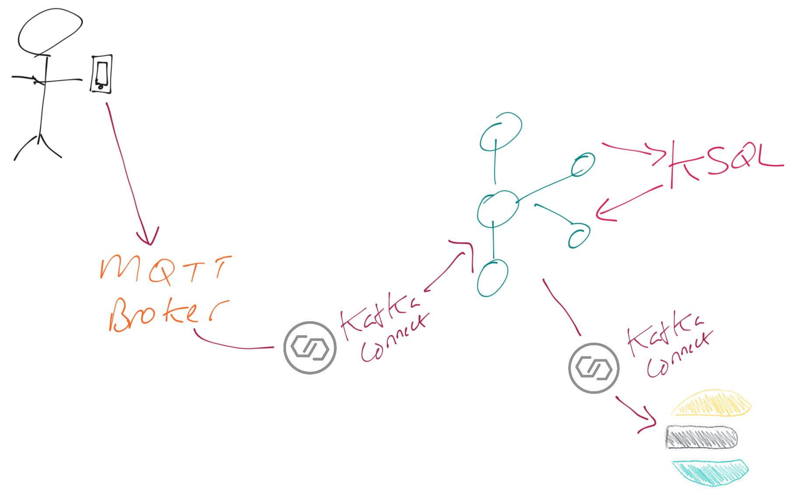
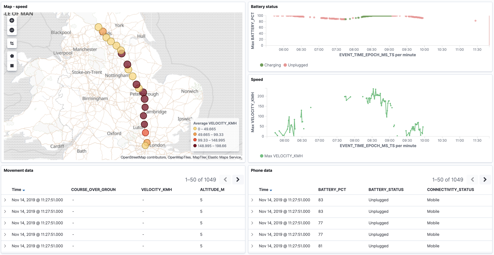

= MQTT Kafka tracker
Robin Moffatt <robin@confluent.io>
v1.00, 27 September 2019

:toc:
:sectnums:

**Built based on https://github.com/saubury/race-mapper[Simon Aubury's excellent example], all credit and thanks to Simon for this.**

*For demo script see link:./mqtt_demo.adoc[here]*

''''

* Install Owntracks on your phone
* Owntracks sends https://owntracks.org/booklet/tech/json/#_typelocation[data] to MQTT server
* Kafka Connect ingests MQTT into Kafka topic
* ksqlDB parses and transforms the data for analysis
* Kafka Connect streams the data to Elasticsearch
* Kibana does nice visualisation of the data

== Pre-requisites

=== MQTT 

1. You'll need an MQTT server; https://www.cloudmqtt.com is very easy to setup and no credit card required for entry-level tier. From your MQTT server you need: 
** Hostname
** Port
** Username
** Password

Tip: https://mqtt-explorer.com/[MQTT Explorer] is a useful tool. 

=== OwnTracks

1. Download Owntracks to your phone. Click the ℹ️ icon in the top left and configure the MQTT settings. 

2. On your MQTT server (e.g. CloudMQTT's `WebSocket UI` view) you should see messages arriving

=== Option 1 : Cloud

In this approach you use Confluent Cloud and Elastic Cloud as fully managed services. The only thing you have to run is a Kafka Connect worker, which is shown here done under Docker, but there are also link::ec2_notes.adoc[notes here on deploying it on EC2]. 

* Sign up for https://confluent.cloud/[Confluent Cloud], and provision a Schema Registry and ksqlDB instance. 
* Sign up for https://elastic.co/cloud/[Elastic Cloud] - use version 6, not 7.

Create a local `.env` file and enter into it your details from Confluent Cloud along with your details of your MQTT server and Elasticsearch instance. 

[source,bash]
----
CCLOUD_BROKER_HOST=
CCLOUD_API_KEY=
CCLOUD_API_SECRET=
CCLOUD_SCHEMA_REGISTRY_URL=
CCLOUD_SCHEMA_REGISTRY_API_KEY=
CCLOUD_SCHEMA_REGISTRY_API_SECRET=

ELASTIC_URL=
ELASTIC_USERNAME=
ELASTIC_PASSWORD=

CONFLUENTPLATFORM_VERSION=5.4.0-beta1

MQTT_USERNAME=
MQTT_PASSWORD=
MQTT_URL=
----

Make sure you've got Docker/Docker Compose and then run: 

`docker-compose -f docker-compose_ccloud.yml up -d`

=== Option 2 : Local

In this approach you run the full Confluent Platform and Elastic stack locally, through Docker. 

Create a local `.env` file and enter into it your details of your MQTT server. You can leave the Elasticsearch details as they are. 

[source,bash]
----
CONFLUENTPLATFORM_VERSION=5.4.0-beta1

ELASTIC_URL=http://elasticsearch:9200
ELASTIC_USERNAME=dummy
ELASTIC_PASSWORD=dummy

MQTT_USERNAME=
MQTT_PASSWORD=
MQTT_URL=
----

Make sure you've got Docker/Docker Compose and then run: 

`docker-compose -f up -d`

== Configuration 

=== Kafka Connect MQTT Source

Depending on whether you are sending data up to Confluent Cloud or to a local Kafka broker run : 

* Confluent Cloud
+
[source,bash]
----
./create_mqtt_source_ccloud.sh
----

* Local
+
[source,bash]
----
./create_mqtt_source_local.sh
----

=== ksqlDB

With data flowing in, now it's time to build your stream processing apps! The ksqlDB applications apply a schema to the data, set the data types, and extract fields such as the device/sender ID. 

* Confluent Cloud - launch the ksqlDB page, and paste in the contents of the `mqtt.ksql` file. 
* Local
** Run ksqlDB CLI
+
[source,bash]
----
docker exec -it ksqldb-cli bash -c 'echo -e "\n\n⏳ Waiting for ksqlDB to be available before launching CLI\n"; while : ; do curl_status=$(curl -s -o /dev/null -w %{http_code} http://ksqldb-server:8088/info) ; echo -e $(date) " ksqlDB server listener HTTP state: " $curl_status " (waiting for 200)" ; if [ $curl_status -eq 200 ] ; then  break ; fi ; sleep 5 ; done ; ksql http://ksqlDB-server:8088'
----
** Run script
+
[source,sql]
----
RUN SCRIPT '/data/mqtt.ksql'; 
----

=== Kafka Connect Elasticsearch sink

Depending on whether you are sending data up to Confluent Cloud or to a local Kafka broker run : 

* Confluent Cloud
+
[source,bash]
----
./create_mqtt_source_ccloud.sh
----

* Local
+
[source,bash]
----
./create_mqtt_source_local.sh
----

=== Kafka Connect Elasticsearch sink

1. You need to create an Elasticsearch dynamic mapping template so that geopoint fields and dates are correctly picked up. 
+
**If running using Docker Compose this has already been done for you**. If using a hosted Elasticsearch then run : 
+
[source,bash]
----
./create_es_dynamic_mapping.sh
----

2. Create the sink connectors. There are two because the `key.ignore` value is different between them (otherwise they could be combined into one and use a `topics` list or `topics.regex`): 
+
[source,bash]
----
./create_es_sink.sh
----
+
Check connector status: 
+
[source,bash]
----
curl -s "http://localhost:8083/connectors?expand=info&expand=status" | \
           jq '. | to_entries[] | [ .value.info.type, .key, .value.status.connector.state,.value.status.tasks[].state,.value.info.config."connector.class"]|join(":|:")' | \
           column -s : -t| sed 's/\"//g'| sort
----
+
[source,bash]
----
sink    |  sink-elastic-runner_location-00  |  RUNNING  |  RUNNING  |  io.confluent.connect.elasticsearch.ElasticsearchSinkConnector
sink    |  sink-elastic-runner_status-00    |  RUNNING  |  RUNNING  |  io.confluent.connect.elasticsearch.ElasticsearchSinkConnector
source  |  source-mqtt-01                   |  RUNNING  |  RUNNING  |  io.confluent.connect.mqtt.MqttSourceConnector
----
3. Check data is arriving in Elasticsearch: 
+
[source,bash]
----
$ curl "http://localhost:9200/_cat/indices/runn*?h=idx,docsCount"
runner_status     0
runner_location 237
----
+
(For Elastic Cloud just add `-u user:password` to the `curl` call before the URL)

== Footnote - Sync data from Confluent Cloud to local Kafka brokers

You can use Confluent Replicator to stream the contents of a topic (or topics) between Kafka clusters, including between on-premises Kafka and Confluent Cloud. This could be useful if you wanted a copy of the data on a local environment to use whilst not connected to Confluent Cloud (e.g. whilst on ✈️)

In the `docker-compose.yml` is a container for `replicator`. Make sure that this is running, and then run 

[source,bash]
----
./create_replicator_source.sh
----

This runs on the local stack and pulls down messages from the Confluent Cloud topic(s) specified. Note that three brokers are run as part of the `docker-compose.yml` because Replicator creates topics with the same config as on the source (and Confluent Cloud has replication factor=3)

Check the status: 

[source,bash]
----
curl -s "http://localhost:58083/connectors?expand=info&expand=status" | \
         jq '. | to_entries[] | [ .value.info.type, .key, .value.status.connector.state,.value.status.tasks[].state,.value.info.config."connector.class"]|join(":|:")' | \
         column -s : -t| sed 's/\"//g'| sort
----

[source,bash]
----
source  |  replicator-source   |  RUNNING  |  RUNNING  |  io.confluent.connect.replicator.ReplicatorSourceConnector
----