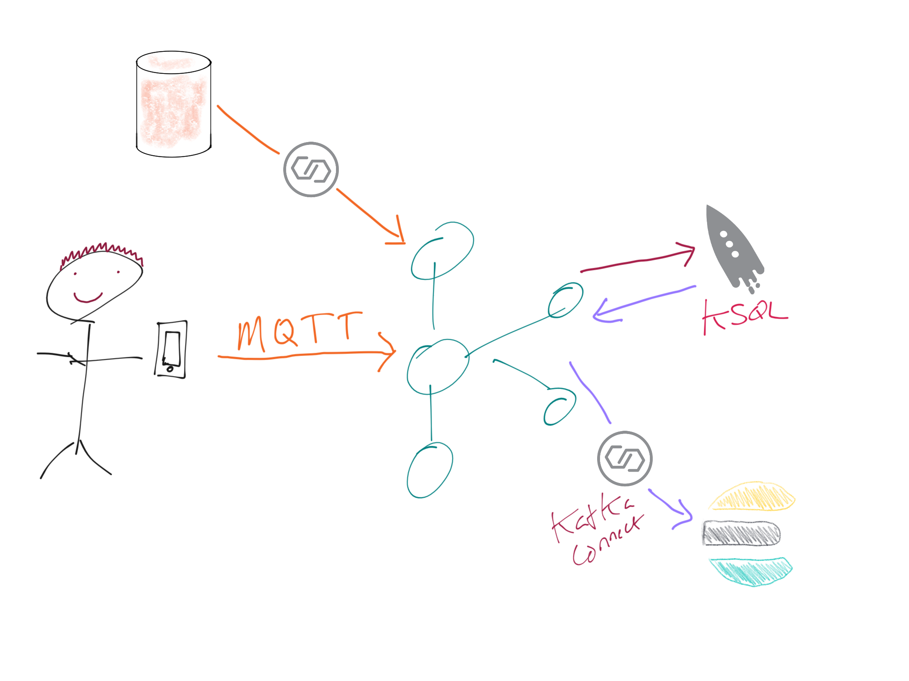
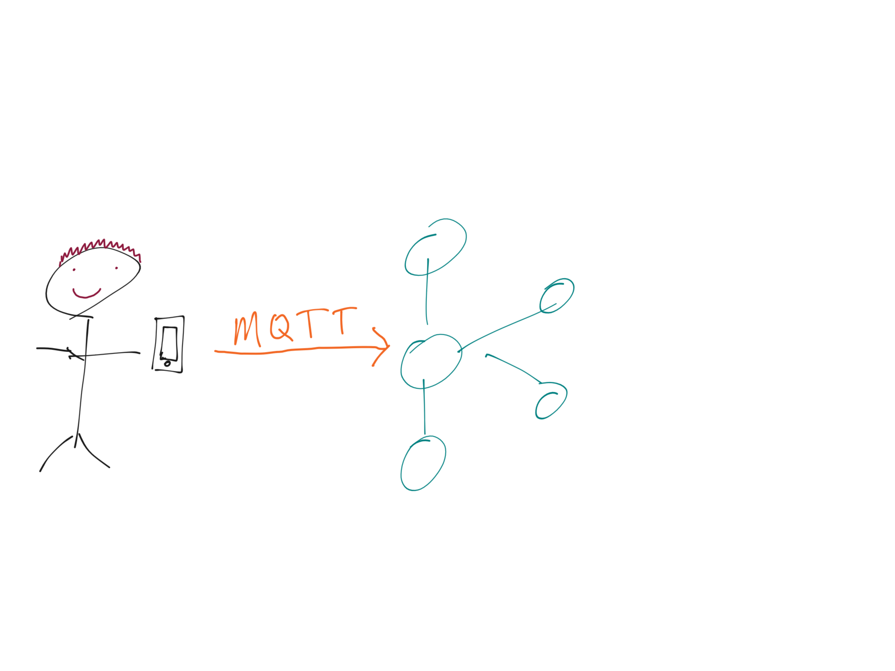
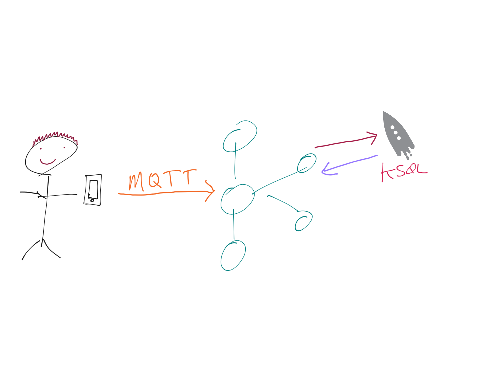
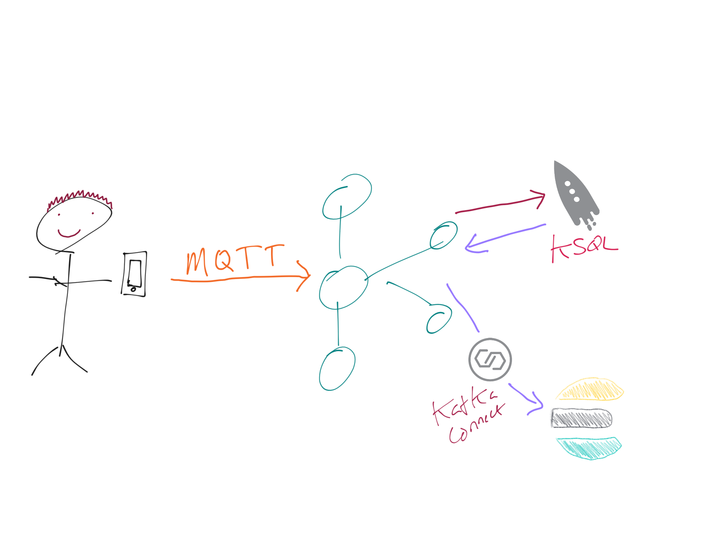
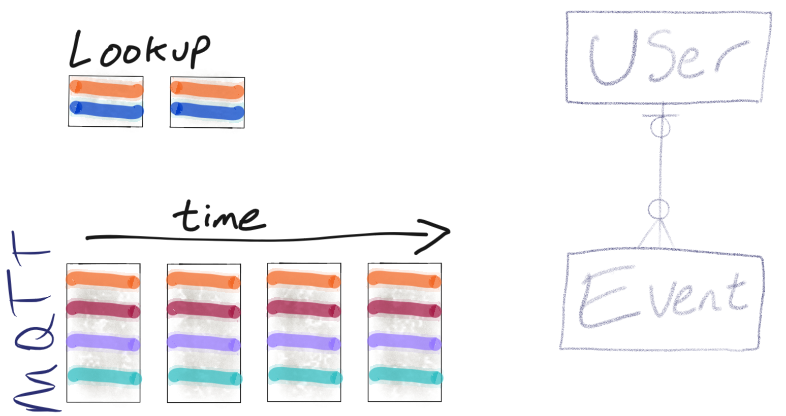
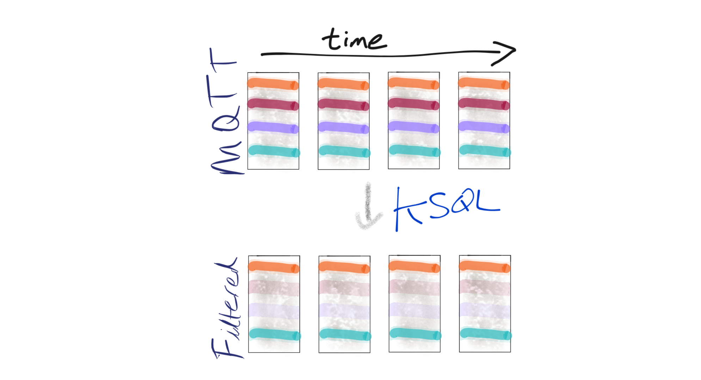
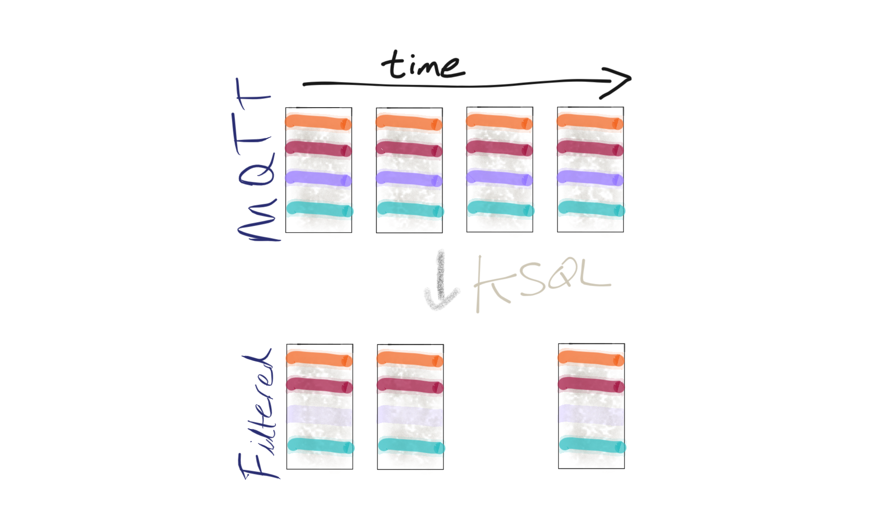

= Building a Stream Processing pipeline with MQTT, Apache Kafka, and KSQL
Robin Moffatt <robin@confluent.io>
v1.00, 29 September 2019

== Overview

== Pre-Flight Setup

=== Pre-reqs

Local:

* `curl`
* `jq`
* Docker
* `kafkacat` (or use the docker images and modify the scripts accordingly)

=== Get the repo

[source,bash]
----
git clone https://github.com/confluentinc/demo-scene.git
cd demo-scene/mqtt-tracker
----

=== Start the environment

[source,bash]
----
docker-compose up -d
----

=== Run KSQL CLI and MySQL CLI

* KSQL CLI:
+
[source,bash]
----
docker exec -it ksql-cli bash -c 'echo -e "\n\n⏳ Waiting for KSQL to be available before launching CLI\n"; while : ; do curl_status=$(curl -s -o /dev/null -w %{http_code} http://ksql-server:8088/info) ; echo -e $(date) " KSQL server listener HTTP state: " $curl_status " (waiting for 200)" ; if [ $curl_status -eq 200 ] ; then  break ; fi ; sleep 5 ; done ; ksql http://ksql-server:8088'
----

* MySQL CLI:
+
[source,bash]
----
docker exec -it mysql bash -c 'mysql -u $MYSQL_USER -p$MYSQL_PASSWORD demo'
----

=== Data

* Option 1 : load sample data from local
+
[source,bash]
----
./load_sample_data.sh
----

* Option 2 : live pull from CCloud

** Replicator
+
[source,bash]
----
./create_replicator_source.sh
----

** kafkacat hacky way
+
[source,bash]
----
#!/bin/bash

source .env

kafkacat -b $CCLOUD_BROKER_HOST \
    -X security.protocol=SASL_SSL -X sasl.mechanisms=PLAIN \
    -X sasl.username="$CCLOUD_API_KEY" -X sasl.password="$CCLOUD_API_SECRET" \
    -X ssl.ca.location=/usr/local/etc/openssl/cert.pem -X api.version.request=true \
    -X auto.offset.reset=earliest \
    -G copy_to_local_01 data_mqtt -K: | \
kafkacat -b localhost:9092,localhost:19092,localhost:29092 \
    -t data_mqtt-import \
    -K: -P 
----

Check there's data on the topic: 

[source,bash]
----
kafkacat -b localhost:9092 -t data_mqtt-import -o beginning -C
----

== Demo

Check out the topics on the cluster

[source,sql]
----
SHOW TOPICS; 
----

There's a stream of MQTT data; let's take a look at it!

[source,sql]
----
PRINT 'data_mqtt';
----

Let's take this stream of JSON messages and declare the schema so that we can use it in KSQL. The schema comes from the owner of the data: https://owntracks.org/booklet/tech/json/#_typelocation

[source,sql]
----
CREATE STREAM MQTT_RAW
    (TID  VARCHAR, BATT INTEGER, LON       DOUBLE,  LAT  DOUBLE, 
     TST  BIGINT,  ALT  INTEGER, COG       INTEGER, VEL  INTEGER,
     P    DOUBLE,  BS   INTEGER, CONN      VARCHAR, ACC  INTEGER,
     T    VARCHAR, VAC  INTEGER, INREGIONS VARCHAR, TYPE VARCHAR) 
WITH (KAFKA_TOPIC = 'data_mqtt-import', VALUE_FORMAT='JSON');
----

[source,sql]
----
SELECT TIMESTAMPTOSTRING(TST*1000, 'MMM-dd HH:mm:ss','America/Los_Angeles') as TS, 
       TID, 
       BATT,
       BS 
  FROM MQTT_RAW; 
----

Now let's do something more than just write this to the screen. Let's write it to a new Kafka topic! 

[source,sql]
----
CREATE STREAM RUNNER_LOCATION_00
    WITH (VALUE_FORMAT='AVRO') AS
    SELECT SPLIT(ROWKEY, '/')[2] AS WHO
            , TST * 1000 AS EVENT_TIME_EPOCH_MS_TS
            , TIMESTAMPTOSTRING(TST*1000,'yyyy-MM-dd HH:mm:ss','America/Los_Angeles') AS EVENT_TIME
            , CASE WHEN LAT IS NULL OR LON IS NULL THEN CAST(NULL AS VARCHAR) 
            	   ELSE CAST(LAT AS VARCHAR) ||','||CAST(LON AS VARCHAR) 
              END AS LOCATION
            , ACC AS LOCATION_ACCURACY_M
            , ALT AS ALTITUDE_M
            , BATT AS BATTERY_PCT
            , CASE WHEN BS=0 THEN 'Unknown' 
                   WHEN BS=1 THEN 'Unplugged'
                   WHEN BS=2 THEN 'Charging'
                   WHEN BS=3 THEN 'Full' 
                   ELSE '[unknown]'
              END AS BATTERY_STATUS
            , COG AS COURSE_OVER_GROUN
            , CASE WHEN T='p' THEN 'ping issued randomly by background task'
                   WHEN T='c' THEN 'circular region enter/leave event'
                   WHEN T='b' THEN 'beacon region enter/leave event'
                   WHEN T='r' THEN 'response to a reportLocation cmd message'
                   WHEN T='u' THEN 'manual publish requested by the user'
                   WHEN T='t' THEN 'timer based publish in move'
                   WHEN T='v' THEN 'updated by Settings/Privacy/Locations Services/System Services/Frequent Locations monitoring'
                   ELSE '[unknown]'
              END AS REPORT_TRIGGER
            , TID AS TRACKER_ID
            , VAC AS VERTICAL_ACCURACY_M
            , VEL AS VELOCITY_KMH
            , P AS PRESSURE_KPA
            , CASE WHEN CONN='w' THEN 'WiFI'
                   WHEN CONN='o' THEN 'Offline'
                   WHEN CONN='m' THEN 'Mobile'
                   ELSE '[unknown]'
              END AS CONNECTIVITY_STATUS
            , INREGIONS AS REGIONS
            , LAT, LON
        FROM MQTT_RAW;
----

Show it worked: 

[source,sql]
----
SELECT EVENT_TIME, 
       TRACKER_ID, 
       BATTERY_PCT, 
       BATTERY_STATUS 
  FROM RUNNER_LOCATION_00; 
----

Since this is just a Kafka topic we can use and consume it just like any other. In this example, streaming the data to Elasticsearch.  

* Create a dynamic mapping to pick up geopoint field
+
[source,bash]
----
curl -XPUT "http://localhost:9200/_template/kafkaconnect/?include_type_name=true" -H 'Content-Type: application/json' -d'
{
            "template": "*",
            "settings": { "number_of_shards": 1, "number_of_replicas": 0 },
            "mappings": { "_default_" : {
                "dynamic_templates": [
                    { "dates": { "match": "*_TS", "mapping": { "type": "date" } } },
                    { "heights": { "match": "HEIGHT", "mapping": { "type": "float" } } },
                    { "locations": { "match": "LOCATION", "mapping": { "type": "geo_point" } } }
                ] } } }'
----

* Create the sink
+
[source,bash]
----
./create_es_sink.sh
----

* Check it's running
+
[source,bash]
----
curl -s "http://localhost:8083/connectors?expand=info&expand=status" | \
         jq '. | to_entries[] | [ .value.info.type, .key, .value.status.connector.state,.value.status.tasks[].state,.value.info.config."connector.class"]|join(":|:")' | \
         column -s : -t| sed 's/\"//g'| sort
----
+
[source,bash]
----
sink  |  sink-elastic-runner_location-00  |  RUNNING  |  RUNNING  |  io.confluent.connect.elasticsearch.ElasticsearchSinkConnector
----

* Set up Kibana
+
[source,bash]
----
echo -e "\n--\n+> Opt out of Kibana telemetry"
curl 'http://localhost:5601/api/telemetry/v1/optIn' -H 'kbn-xsrf: nevergonnagiveyouup' -H 'content-type: application/json' -H 'accept: application/json' --data-binary '{"enabled":false}' --compressed

echo -e "\n--\n+> Create Kibana index patterns"
curl -XPOST 'http://localhost:5601/api/saved_objects/index-pattern/runner_location_idx' \
    -H 'kbn-xsrf: nevergonnagiveyouup' \
    -H 'Content-Type: application/json' \
    -d '{"attributes":{"title":"runner_location*","timeFieldName":"EVENT_TIME_EPOCH_MS_TS"}}'

echo -e "\n--\n+> Set default Kibana index"
curl -XPOST 'http://localhost:5601/api/kibana/settings' \
    -H 'kbn-xsrf: nevergonnagiveyouup' \
    -H 'content-type: application/json' \
    -d '{"changes":{"defaultIndex":"runner_location_idx"}}'
----

* Show Kibana http://localhost:5601/app/kibana#/discover?_g=(refreshInterval:(pause:!t,value:0),time:(from:now-7d,mode:quick,to:now))&_a=(columns:!(WHO,CONNECTIVITY_STATUS,BATTERY_PCT,BATTERY_STATUS),index:runner_location_idx,interval:auto,query:(language:lucene,query:''),sort:!(EVENT_TIME_EPOCH_MS_TS,desc))[discovery view] & http://localhost:5601/app/kibana#/visualize/create?type=tile_map&indexPattern=runner_location_idx&_g=(refreshInterval:(pause:!t,value:0),time:(from:now-7d,mode:quick,to:now))&_a=(filters:!(),linked:!f,query:(language:lucene,query:''),uiState:(),vis:(aggs:!((enabled:!t,id:'1',params:(),schema:metric,type:count),(enabled:!t,id:'2',params:(autoPrecision:!t,field:LOCATION,isFilteredByCollar:!t,mapCenter:!(0,0),mapZoom:2,precision:2,useGeocentroid:!t),schema:segment,type:geohash_grid)),params:(addTooltip:!t,colorSchema:'Yellow%20to%20Red',heatClusterSize:1.5,isDesaturated:!t,legendPosition:bottomright,mapCenter:!(0,0),mapType:'Shaded%20Circle%20Markers',mapZoom:2,wms:(enabled:!f,options:(format:image%2Fpng,transparent:!t),selectedTmsLayer:(attribution:'%3Cp%3E%26%23169;%20%3Ca%20href%3D%22https:%2F%2Fwww.openstreetmap.org%2Fcopyright%22%3EOpenStreetMap%20contributors%3C%2Fa%3E%7C%3Ca%20href%3D%22https:%2F%2Fopenmaptiles.org%22%3EOpenMapTiles%3C%2Fa%3E%7C%3Ca%20href%3D%22https:%2F%2Fwww.maptiler.com%22%3EMapTiler%3C%2Fa%3E%7C%3Ca%20href%3D%22https:%2F%2Fwww.elastic.co%2Felastic-maps-service%22%3EElastic%20Maps%20Service%3C%2Fa%3E%3C%2Fp%3E%26%2310;',id:road_map,maxZoom:18,minZoom:0,origin:elastic_maps_service))),title:'New%20Visualization',type:tile_map))[map viz]

But who is `rmoff`, and does he mind us having access to all this information about him?

Check out the source data in MySQL: 

[source,sql]
----
SELECT USERID, EMAIL, SHARE_LOCATION_OPTIN FROM USERS; 
----

[source,sql]
----
+--------+------------------+----------------------+
| USERID | EMAIL            | SHARE_LOCATION_OPTIN |
+--------+------------------+----------------------+
| rmoff  | robin@rmoff.net  |                    1 |
| ivor   | ivor@example.com |                    0 |
| hugh   | hugh@example.com |                    0 |
+--------+------------------+----------------------+ 
----

Declare the KSQL table on the topic populated from the database: 

[source,sql]
----
SET 'auto.offset.reset' = 'earliest';

CREATE STREAM USERS_STREAM WITH (KAFKA_TOPIC='mysql-asgard.demo.USERS', VALUE_FORMAT='AVRO');
CREATE STREAM USERS_REKEY WITH (PARTITIONS=6) AS SELECT * FROM USERS_STREAM PARTITION BY USERID;
PRINT USERS_REKEY LIMIT 1;
CREATE TABLE USERS WITH (KAFKA_TOPIC='USERS_REKEY', VALUE_FORMAT='AVRO'); 
----

Examine the data: 

[source,sql]
----
SET 'auto.offset.reset' = 'latest';

SELECT TIMESTAMPTOSTRING(R.ROWTIME, 'MMM-dd HH:mm:ss','America/Los_Angeles') AS TS,
       R.WHO, 
       U.EMAIL, 
       U.SHARE_LOCATION_OPTIN, 
       R.BATTERY_STATUS
    FROM RUNNER_LOCATION_00 R
           LEFT JOIN USERS U
           ON R.WHO = U.ROWKEY ;
----

Set datagen running

[source,bash]
----
./run_datagen.sh
----

[source,sql]
----
+---------+------------------+----------------------+-----------+----------+---------------+
|WHO      |EMAIL             |SHARE_LOCATION_OPTIN  |LON        |LAT       |BATTERY_STATUS |
+---------+------------------+----------------------+-----------+----------+---------------+
|hugh     |hugh@example.com  |0                     |-78.74988  |35.66231  |Unplugged      |
|rick     |null              |null                  |-1.812582  |53.95524  |Charging       |
|rmoff    |robin@rmoff.net   |1                     |-1.812581  |53.92535  |Unplugged      |
|ivor     |ivor@example.com  |0                     |-1.812575  |53.955235 |Full           |
----

[source,sql]
----
SET 'auto.offset.reset' = 'earliest';

CREATE STREAM RUNNER_LOCATION_OPTIN AS
  SELECT  WHO
          ,EVENT_TIME_EPOCH_MS_TS
          ,CASE WHEN U.SHARE_LOCATION_OPTIN = 1 THEN LOCATION 
             ELSE CAST(NULL AS VARCHAR) 
           END AS LOCATION
          ,BATTERY_PCT
          ,BATTERY_STATUS
          ,U.EMAIL AS EMAIL
    FROM RUNNER_LOCATION_00 R 
           LEFT JOIN USERS U 
           ON R.WHO = U.ROWKEY;
----

[source,sql]
----
SET 'auto.offset.reset' = 'latest';

SELECT TIMESTAMPTOSTRING(ROWTIME, 'MMM-dd HH:mm:ss','America/Los_Angeles'),WHO, LOCATION, BATTERY_STATUS, BATTERY_PCT
    FROM RUNNER_LOCATION_OPTIN;
----

In a new terminal, show MySQL with KSQL still visible.

[source,bash]
----
docker exec -it mysql bash -c 'mysql -u $MYSQL_USER -p$MYSQL_PASSWORD demo'
----

In MySQL make an update to a user's profile to switch their data optin; note how the KSQL query above changes in response to it. 

[source,sql]
----
UPDATE USERS SET SHARE_LOCATION_OPTIN=TRUE WHERE USERID='ivor';

UPDATE USERS SET SHARE_LOCATION_OPTIN=FALSE WHERE USERID='ivor';
----

''''

== MOAR derived streams

You can also use KSQL to create a subset of the data so that other teams could use the data

[source,sql]
----
CREATE STREAM MQTT_BATTERY_DATA AS
  SELECT WHO, BATTERY_PCT, BATTERY_STATUS, CONNECTIVITY_STATUS 
    FROM RUNNER_LOCATION_00;
----

Aggregate the data to show connectivity type per day: 

[source,sql]
----
SELECT TIMESTAMPTOSTRING(windowstart(), 'yyyy-MM-dd HH:mm:ss'),
       CONNECTIVITY_STATUS, COUNT(*) 
  FROM MQTT_BATTERY_DATA 
        WINDOW TUMBLING (SIZE 1 DAY) 
GROUP BY CONNECTIVITY_STATUS; 
----

== Back to basics

With a schema in place we can pick out fields from the data:

[source,sql]
----
SET 'auto.offset.reset' = 'earliest';
SELECT TIMESTAMPTOSTRING(ROWTIME, 'yyyy-MM-dd HH:mm:ss') as TS, ROWKEY, BATT FROM MQTT_RAW;
----

[source,sql]
----
+-------------------------+-------------------------+-------------------------+
|TS                       |ROWKEY                   |BATT                     |
+-------------------------+-------------------------+-------------------------+
|2019-09-30 20:47:30      |owntracks/race-write/rife|45                       |
|2019-09-30 20:47:30      |owntracks/race-write/rmof|100                      |
|                         |f-                       |                         |
|2019-09-30 20:47:30      |owntracks/race-write/EF81|100                      |
|                         |CA0A-BBD6-4116-BBC7-38EE8|                         |
|                         |FA3D5A4                  |                         |
[…]
----

We can use predicates to filter the data:

[source,sql]
----
SELECT ROWKEY, TST, BATT 
  FROM MQTT_RAW 
 WHERE ROWKEY LIKE '%rmoff';
----

[source,sql]
----
+-----------------------------+-------------+---------+
|ROWKEY                       |TST          |BATT     |
+-----------------------------+-------------+---------+
|owntracks/tiqmyral/rmoff     |1569316069   |97       |
|owntracks/tiqmyral/rmoff     |1569315063   |96       |
|owntracks/tiqmyral/rmoff     |1569312091   |95       |
----

Looking at the message key it's the final part of it that identifies the user, so let's extract that

[source,sql]
----
SELECT ROWKEY, SPLIT(ROWKEY, '/')[2] AS WHO 
  FROM MQTT_RAW 
  LIMIT 5;
----

https://owntracks.org/booklet/tech/json/#_typelocation[Per the documentation] there are some fields which have special meanings, such as the state of the battery: 

[source,sql]
----
SELECT BS FROM MQTT_RAW; 
----

[source,sql]
----
+--------+
|BS      |
+--------+
|1       |
|1       |
|1       |
|1       |
|1       | 
----

We can use KSQL to apply these values to the codes to make the data more useful. Check out the `AS` clause too for changing the schema field names.

[source,sql]
----
SELECT BS, 
        CASE WHEN BS=0 THEN 'Unknown' 
             WHEN BS=1 THEN 'Unplugged'
             WHEN BS=2 THEN 'Charging'
             WHEN BS=3 THEN 'Full' 
             ELSE '[unknown]'
        END AS BATTERY_STATUS, 
        BATT AS BATTERY_PCT
   FROM MQTT_RAW;
----

[source,sql]
----
+----------------------------+----------------------------+----------------------------+
|BS                          |BATTERY_STATUS              |BATT                        |
+----------------------------+----------------------------+----------------------------+
|1                           |Unplugged                   |45                          |
|1                           |Unplugged                   |45                          |
|3                           |Full                        |100                         |
|2                           |Charging                    |100                         |
|1                           |Unplugged                   |45                          |
|3                           |Full                        |100                         | 
----

EOFEOFEOF

== Scrap notes

CREATE STREAM RUNNER_LOCATION 
    WITH (TIMESTAMP='EVENT_TIME_EPOCH_MS') AS
    SELECT *
    FROM RUNNER_LOCATION_00
PARTITION BY WHO;

CREATE TABLE RUNNER_STATUS AS 
    SELECT WHO, 
           MIN(VELOCITY_KMH) AS MIN_SPEED, 
           MAX(VELOCITY_KMH) AS MAX_SPEED, 
           COUNT(*) AS NUM_EVENTS, 
           MAX(ROWTIME) AS LAST_EVENT_TS,
           MIN(GEO_DISTANCE(LAT, LON, 53.925915, -1.823168, 'KM')) AS DIST_TO_ILKLEY
     FROM RUNNER_LOCATION 
            WINDOW TUMBLING (SIZE 5 MINUTE) 
    GROUP BY WHO;

== Appendix

=== Export topic to file

[source,bash]
----
kafkacat -b localhost:9092 \
  -o beginning -K: -e -q \
  -t data_mqtt2 \
  > data/export_20190929.kcat
----

=== Import data from file

[source,bash]
----
kafkacat -b localhost:9092 \
  -P -K: \
  -t data_mqtt-import \
  -l data/export_20190929.kcat