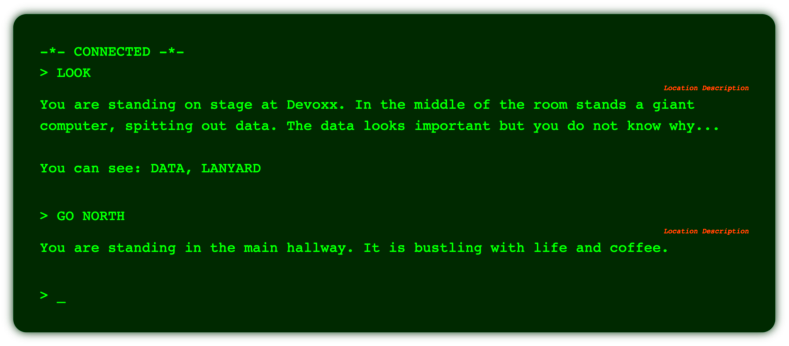
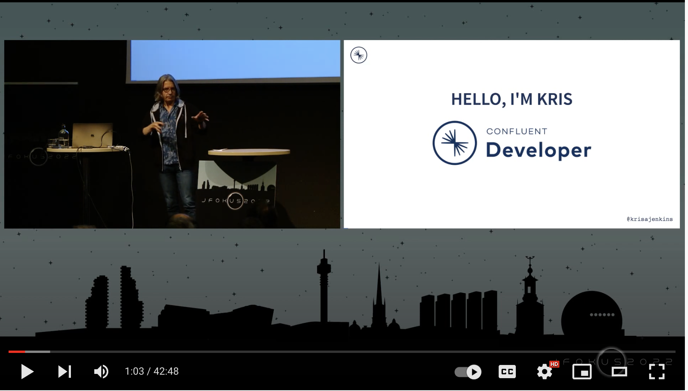

# PICKUP DATA - A Kafka Adventure Game



[](https://www.youtube.com/watch?v=uFtJH-kINgg)

## Server Setup

First start the server processes running:

```sh
docker-compose up
```


Then in another terminal create the initial streams and datasets:

```sh
docker-compose run --entrypoint "/ksql/migrate" ksqldb-cli
```

This should end with output similar to:

```sh

 Stream Name         | Kafka Topic                   | Key Format | Value Format | Windowed 
--------------------------------------------------------------------------------------------
 COMMANDS            | commands                      | KAFKA      | AVRO         | false    
 INVENTORY           | inventory                     | KAFKA      | AVRO         | false    
 INVENTORY_COMMANDS  | inventory_commands            | KAFKA      | AVRO         | false    
 ITEM_RULES          | item_rules                    | KAFKA      | AVRO         | false    
 KSQL_PROCESSING_LOG | default_ksql_processing_log   | KAFKA      | JSON         | false    
 LOCATION_DATA       | location_data                 | JSON       | AVRO         | false    
 MIGRATION_EVENTS    | default_ksql_MIGRATION_EVENTS | KAFKA      | JSON         | false    
 MOVEMENT_COMMANDS   | movement_commands             | KAFKA      | AVRO         | false    
 RESPONSES           | responses                     | KAFKA      | AVRO         | false    
 STATUS_COMMANDS     | status_commands               | KAFKA      | AVRO         | false    
```


_Note: To recreate the database from scratch, use this `docker-compose` command instead_

```sh
docker compose up --renew-anon-volumes --force-recreate
```

## Running The Streams Services

```sh
cd server 
./gradlew run
```

## Running The Webserver

```sh
cd server 
./gradlew appStart
```

## Running The Client

```sh
cd client 
yarn
yarn dev
```
