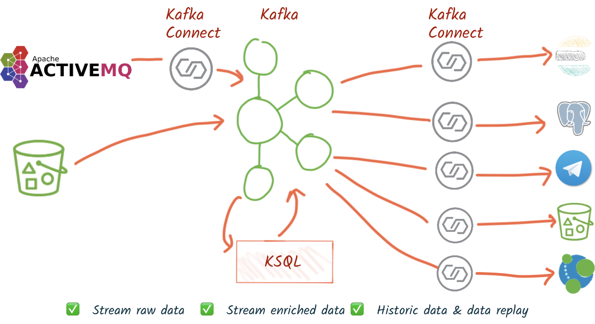
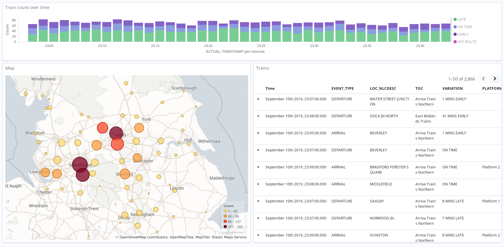
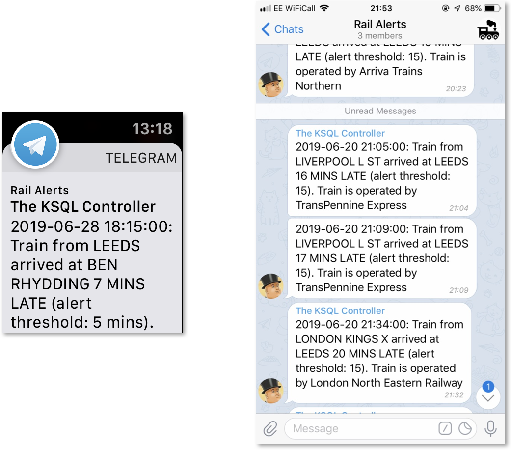
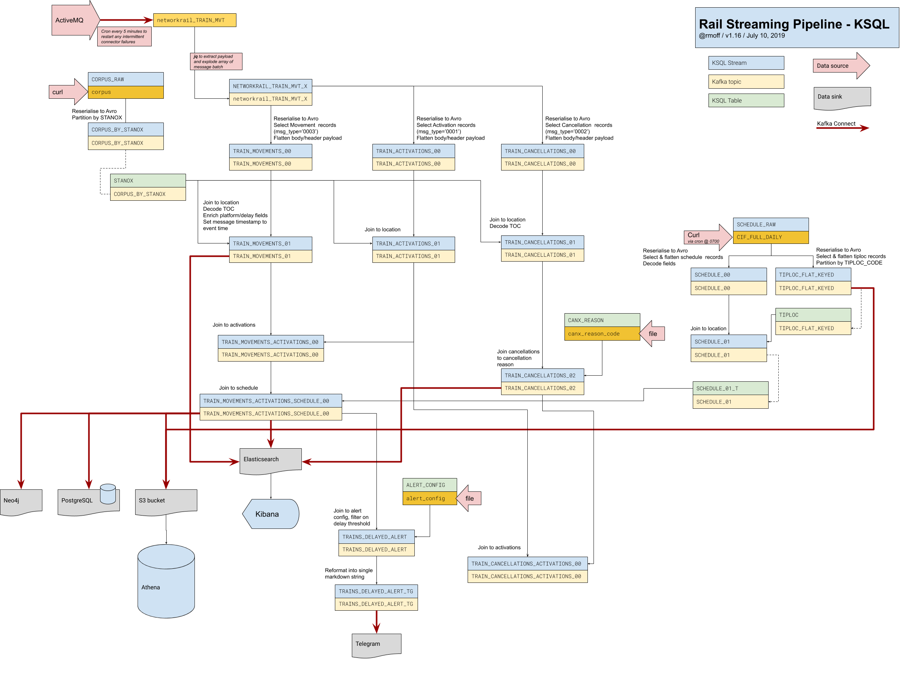

= Building a Streaming Data Pipeline with Rail Data
Robin Moffatt <robin@confluent.io>
v1.20, 7 August 2019

== What is it?

A PoC showing what can be done with streaming and batch sources of data, Apache Kafka and KSQL, and various data stores and tools. 

== What can it do? 

image::images/graph01.jpg[]
image::images/pgadmin.jpg[]

== Slides? 

Yes!

http://rmoff.dev/kafka-trains-slides

== Setup

* Register for an account at https://datafeeds.networkrail.co.uk/
* Set username and password in 
+
[source,bash]
----
/data/credentials.properties
/data/set_credentials_env.sh
----

* **Make sure you've allocated Docker a bunch of memory. Like, at least 8GB. If you don't then you'll see containers appearing to randomly die and you'll get frustrated 😕**
+
** Check how much memory Docker has using this: 
+
[source,bash]
----
docker system info | grep Memory
----

* Launch the stack
+
[source,bash]
----
docker-compose up -d
----

* Check health
+
[source,bash]
----
docker-compose ps
----

* Launch KSQL CLI
+
[source,bash]
----
$ docker exec -it ksql-cli ksql http://ksql-server:8088

                  ===========================================
                  =        _  __ _____  ____  _             =
                  =       | |/ // ____|/ __ \| |            =
                  =       | ' /| (___ | |  | | |            =
                  =       |  <  \___ \| |  | | |            =
                  =       | . \ ____) | |__| | |____        =
                  =       |_|\_\_____/ \___\_\______|       =
                  =                                         =
                  =  Streaming SQL Engine for Apache Kafka® =
                  ===========================================

Copyright 2017-2018 Confluent Inc.

CLI v5.3.0, Server v5.3.0 located at http://ksql-server:8088

Having trouble? Type 'help' (case-insensitive) for a rundown of how things work!

ksql>
----

== Detailed pipeline view

https://docs.google.com/drawings/d/1xL5E1Zfj6YZcjbSI9aexBIZO_8wNVMsYhis96dTiJE4/edit?usp=sharing[Source]

N.B. A lot of the code is complete, but not documented below. The canonical version is the code; the docs below may or may not be accurate and/or complete. The code is sensibly named and laid out though so should be easy to follow. 

== Schedules, location, and cancellation reason reference data

=== Ingest data

[source,bash]
----
source ./data/set_credentials_env.sh
cd ./data/ingest/movements/
./00_load_canx_reason_code.sh
cd ../cif_schedule
./00_load_opencage.sh
./00_process_schedule.sh &
./01_ingest_schedule.sh
----

_So long as you've `source`d the credentials filer, you can ignore the `readlink`/`set_credentials_env.sh: No such file or directory` error on the Mac when running `./00_ingest_schedule.sh`_

_You can also ignore the `jq: error (at <stdin>:16515): Cannot iterate over null (null)` messages._

[source,bash]
----
$ kafkacat -b localhost:9092 -t CIF_FULL_DAILY -C -c1
{"JsonTimetableV1":{"classification":"public","timestamp":1558653193,"owner":"Network Rail","Sender":{"organisation":"Rockshore","application":"NTROD","component":"SCHEDULE"},"Metadata":{"type":"full","sequence":2535}}}

$ kafkacat -b localhost:9092 -t JsonScheduleV1 -C -c1 
{"CIF_bank_holiday_running":null,"CIF_stp_indicator":"P","CIF_train_uid":"C02207","applicable_timetable":"Y","atoc_code":"NT","new_schedule_segment":{"traction_class":"","uic_code":""},"schedule_days_runs":"0000010","schedule_end_date":"2019-12-14","schedule_segment":{"signalling_id":"5A99","CIF_train_category":"EE","CIF_headcode":"5102","CIF_course_indicator":1,"CIF_train_service_code":"21791000","CIF_business_sector":"??","CIF_power_type":"DMU","CIF_timing_load":"A","CIF_speed":"075","CIF_operating_characteristics":null,"CIF_train_class":null,"CIF_sleepers":null,"CIF_reservations":null,"CIF_connection_indicator":null,"CIF_catering_code":null,"CIF_service_branding":"","schedule_location":[{"location_type":"LO","record_identity":"LO","tiploc_code":"DLTN","tiploc_instance":null,"ORIGIN":"2319","public_ORIGIN":null,"platform":"1","line":null,"engineering_allowance":null,"pathing_allowance":null,"performance_allowance":null},{"location_type":"LI","record_identity":"LI","tiploc_code":"FYHLSJN","tiploc_instance":null,"DESTINATION":null,"ORIGIN":null,"pass":"2331","public_DESTINATION":null,"public_ORIGIN":null,"platform":null,"line":null,"path":null,"engineering_allowance":null,"pathing_allowance":null,"performance_allowance":null},{"location_type":"LI","record_identity":"LI","tiploc_code":"TURSDLJ","tiploc_instance":null,"DESTINATION":null,"ORIGIN":null,"pass":"2333","public_DESTINATION":null,"public_ORIGIN":null,"platform":null,"line":null,"path":null,"engineering_allowance":null,"pathing_allowance":null,"performance_allowance":null},{"location_type":"LI","record_identity":"LI","tiploc_code":"DRHM","tiploc_instance":null,"DESTINATION":null,"ORIGIN":null,"pass":"2339","public_DESTINATION":null,"public_ORIGIN":null,"platform":"DM","line":null,"path":null,"engineering_allowance":"1","pathing_allowance":null,"performance_allowance":null},{"location_type":"LI","record_identity":"LI","tiploc_code":"BRTLYJN","tiploc_instance":null,"DESTINATION":null,"ORIGIN":null,"pass":"2347","public_DESTINATION":null,"public_ORIGIN":null,"platform":null,"line":null,"path":null,"engineering_allowance":null,"pathing_allowance":null,"performance_allowance":null},{"location_type":"LI","record_identity":"LI","tiploc_code":"KEBGSJN","tiploc_instance":null,"DESTINATION":null,"ORIGIN":null,"pass":"2350H","public_DESTINATION":null,"public_ORIGIN":null,"platform":null,"line":null,"path":null,"engineering_allowance":null,"pathing_allowance":null,"performance_allowance":null},{"location_type":"LT","record_identity":"LT","tiploc_code":"NWCSTLE","tiploc_instance":null,"DESTINATION":"2353","public_DESTINATION":null,"platform":"6","path":null}]},"schedule_start_date":"2019-05-25","train_status":"P","transaction_type":"Create","last_schedule_segment":{"location_type":"LT","record_identity":"LT","tiploc_code":"NWCSTLE","tiploc_instance":null,"DESTINATION":"2353","public_DESTINATION":null,"platform":"6","path":null}}
----

=== KSQL 

**Do this before starting on the movement/cancellation data below**

From KSQL CLI: 

[source,sql]
----
run script '/data/ksql/02_cif_schedule/00_opencage.ksql';
PRINT 'LOCATION_GEOCODE' FROM BEGINNING LIMIT 1;
run script '/data/ksql/02_cif_schedule/01_geocode_table.ksql';
run script '/data/ksql/02_cif_schedule/01_schedule_raw.ksql';
run script '/data/ksql/02_cif_schedule/02_location.ksql';
PRINT 'TIPLOC_FLAT_KEYED' FROM BEGINNING LIMIT 1;
PRINT 'STANOX_FLAT_KEYED' FROM BEGINNING LIMIT 1;
run script '/data/ksql/02_cif_schedule/03_location_table.ksql';
run script '/data/ksql/02_cif_schedule/04_schedule.ksql';
PRINT 'SCHEDULE_02' FROM BEGINNING LIMIT 1;
run script '/data/ksql/02_cif_schedule/05_schedule_table.ksql';
----

If you get `Avro schema for message values on topic TIPLOC_FLAT_KEYED does not exist in the Schema Registry.` after running `02_tiploc.ksql` then wait a few moments and then re-run it; the topic on which it's built is created and populated by the preceeding step, and it may not have kicked in yet. You can also run `PRINT 'SCHEDULE_02' FROM BEGINNING LIMIT 5;` and wait until you get some data.

[source,sql]
----
ksql> SHOW STREAMS;

 Stream Name       | Kafka Topic       | Format
------------------------------------------------
 JSONSCHEDULEV1    | JsonScheduleV1    | JSON
 LOCATION_GEOCODE  | LOCATION_GEOCODE  | AVRO
 OPENCAGE          | opencage          | JSON
 SCHEDULE_00       | SCHEDULE_00       | AVRO
 SCHEDULE_01       | SCHEDULE_01       | AVRO
 SCHEDULE_02       | SCHEDULE_02       | AVRO
 SCHEDULE_RAW      | CIF_FULL_DAILY    | JSON
 STANOX_FLAT       | STANOX_FLAT       | AVRO
 STANOX_FLAT_KEYED | STANOX_FLAT_KEYED | AVRO
 STANOX_GEO        | STANOX_GEO        | AVRO
 TIPLOC_FLAT_KEYED | TIPLOC_FLAT_KEYED | AVRO
------------------------------------------------
 […]
----

[source,sql]
----
SET 'auto.offset.reset' = 'earliest';

SELECT SCHEDULE_KEY,
       TRAIN_STATUS,
       POWER_TYPE,
       SEATING_CLASSES,
       ORIGIN_TPS_DESCRIPTION, ORIGIN_PUBLIC_DEPARTURE_TIME,
       DESTINATION_TPS_DESCRIPTION, DESTINATION_PUBLIC_ARRIVAL_TIME 
  FROM SCHEDULE_02_T
 WHERE ORIGIN_PUBLIC_DEPARTURE_TIME IS NOT NULL
 LIMIT 1;
----

[source,sql]
----
Y62982/2019-09-03/O | Passenger & Parcels (Permanent - WTT) | Electric Multiple Unit | Standard only | BRADFORD FORSTER SQUARE | 1841 | SKIPTON | 1922
Limit Reached
Query terminated
----

[source,sql]
----
ksql> SHOW TABLES;

 Table Name         | Kafka Topic       | Format | Windowed
------------------------------------------------------------
 LOCATION_GEOCODE_T | LOCATION_GEOCODE  | AVRO   | false
 SCHEDULE_02_T      | SCHEDULE_02       | AVRO   | false
 STANOX             | STANOX_FLAT_KEYED | AVRO   | false
 TIPLOC             | TIPLOC_FLAT_KEYED | AVRO   | false
------------------------------------------------------------
----

[source,sql]
----
SET 'auto.offset.reset' = 'earliest';

SELECT TIPLOC_CODE, 
       STANOX, 
       TPS_DESCRIPTION, 
       OPENCAGE_TOTAL_RESULTS, 
       GEO_OSM_URL 
  FROM STANOX 
WHERE OPENCAGE_TOTAL_RESULTS>0 
 LIMIT 1;
----

[source,sql]
----
ksql> SELECT TIPLOC_CODE, STANOX, TPS_DESCRIPTION, OPENCAGE_TOTAL_RESULTS, GEO_OSM_URL FROM STANOX WHERE OPENCAGE_TOTAL_RESULTS>0 LIMIT 1;
+-----------------------------------+-----------------------------------+-----------------------------------+-----------------------------------+-----------------------------------+
|TIPLOC_CODE                        |STANOX                             |TPS_DESCRIPTION                    |OPENCAGE_TOTAL_RESULTS             |GEO_OSM_URL                        |
+-----------------------------------+-----------------------------------+-----------------------------------+-----------------------------------+-----------------------------------+
|IRNVLJN                            |56508                              |IRONVILLE JUNCTION                 |2                                  |https://www.openstreetmap.org/?mlat|
|                                   |                                   |                                   |                                   |=53.06611&mlon=-1.34247#map=16/53.0|
|                                   |                                   |                                   |                                   |6611/-1.34247                      |
Limit Reached
Query terminated
----

== Train event data - activations, movements, cancellations

=== Ingest data stream

1. Create Kafka Connect connector(s):
+
[source,bash]
----
./data/ingest/movements/00_ingest.sh
----
+
Check status: 
+
[source,bash]
----
# Apache Kafka >=2.3 - nicer output! Optional to use.
curl -s "http://localhost:8083/connectors?expand=info&expand=status" | \
         jq '. | to_entries[] | [ .value.info.type, .key, .value.status.connector.state,.value.status.tasks[].state,.value.info.config."connector.class"]|join(":|:")' | \
         column -s : -t| sed 's/\"//g'| sort

# Apache Kafka <2.3
curl -s "http://localhost:8083/connectors"| jq '.[]'| xargs -I{connector_name} curl -s "http://localhost:8083/connectors/"{connector_name}"/status"| jq -c -M '[.name,.connector.state,.tasks[].state]|join(":|:")'| column -s : -t| sed 's/\"//g'| sort
----
+
[source,bash]
----
# Apache Kafka >=2.3
source  |  source-activemq-networkrail-TRAIN_MVT_EA_TOC-01  |  RUNNING  |  RUNNING  |  io.confluent.connect.activemq.ActiveMQSourceConnector
source  |  source-activemq-networkrail-TRAIN_MVT_ED_TOC-01  |  RUNNING  |  RUNNING  |  io.confluent.connect.activemq.ActiveMQSourceConnector
source  |  source-activemq-networkrail-TRAIN_MVT_EM_TOC-01  |  RUNNING  |  RUNNING  |  io.confluent.connect.activemq.ActiveMQSourceConnector
source  |  source-activemq-networkrail-TRAIN_MVT_HB_TOC-01  |  RUNNING  |  RUNNING  |  io.confluent.connect.activemq.ActiveMQSourceConnector

# Apache Kafka <2.3
source-activemq-networkrail-TRAIN_MVT_EA_TOC-01  |  RUNNING  |  RUNNING
source-activemq-networkrail-TRAIN_MVT_ED_TOC-01  |  RUNNING  |  RUNNING
----
+
Check there's some data: 
+
[source,bash]
----
kafkacat -b localhost:9092 -t networkrail_TRAIN_MVT -C -c1

{"messageID":"ID:opendata-backend.rockshore.net-42259-1558600921537-11:1:1:40:2938","messageType":"text","timestamp":1558693449805,"deliveryMode":2,"correlationID":null,"replyTo":null,"destination":{"desti
nationType":"topic","name":"TRAIN_MVT_ED_TOC"},"redelivered":false,"type":null,"expiration":1558693749805,"priority":4,"properties":{},"bytes":null,"map":null,"text":"[{\"header\":{\"msg_type\":\"0003\",\"
source_dev_id\":\"\",\"user_id\":\"\",\"original_data_source\":\"SMART\",\"msg_queue_timestamp\":\"1558693442000\",\"source_system_id\":\"TRUST\"},\"body\":{\"event_type\":\"ARR…
----

2. Set pipeline running to split out payload batches into single messages
+
[source,bash]
----
./data/ingest/movements/01_explode.sh &
----
+
[source,bash]
----
Group tm_explode rebalanced (memberid rdkafka-c53a4270-e767-493a-b5de-2244b389e645): assigned: networkrail_TRAIN_MVT [0]
% Reached end of topic networkrail_TRAIN_MVT [0] at offset 189
…
----
+
Check the data on the target topic
+
[source,bash]
----
$ kafkacat -b localhost:9092 -t networkrail_TRAIN_MVT_X -C -c1 | jq '.'
{
  "header": {
    "msg_type": "0003",
    "source_dev_id": "",
    "user_id": "",
    "original_data_source": "SMART",
    "msg_queue_timestamp": "1567674217000",
    "source_system_id": "TRUST"
  },
  "body": {
    "event_type": "DESTINATION",
    "gbtt_timestamp": "1567677780000",
    "original_loc_stanox": "",
    "planned_timestamp": "1567677660000",
    "timetable_variation": "4",
    "original_loc_timestamp": "",
    "current_train_id": "",
    "delay_monitoring_point": "true",
    "next_report_run_time": "",
    "reporting_stanox": "54311",
    "actual_timestamp": "1567677900000",
    "correction_ind": "false",
    "event_source": "AUTOMATIC",
    "train_file_address": null,
    "platform": " 1",
    "division_code": "61",
    "train_terminated": "true",
    "train_id": "121Y14M605",
    "offroute_ind": "false",
    "variation_status": "LATE",
    "train_service_code": "21700001",
    "toc_id": "61",
    "loc_stanox": "54311",
    "auto_expected": "true",
    "direction_ind": "UP",
    "route": "0",
    "planned_event_type": "DESTINATION",
    "next_report_stanox": "",
    "line_ind": ""
  }
}
----

=== KSQL

[source,sql]
----
RUN SCRIPT '/data/ksql/03_movements/01_canx_reason.ksql';
RUN SCRIPT '/data/ksql/03_movements/01_movement_raw.ksql';
RUN SCRIPT '/data/ksql/03_movements/02_activations.ksql';
RUN SCRIPT '/data/ksql/03_movements/02_cancellations.ksql';
RUN SCRIPT '/data/ksql/03_movements/02_movements.ksql';
PRINT 'TRAIN_ACTIVATIONS_01_T' FROM BEGINNING LIMIT 1;
RUN SCRIPT '/data/ksql/03_movements/03_activations_table.ksql';
RUN SCRIPT '/data/ksql/03_movements/04_cancellations_activations.ksql';
RUN SCRIPT '/data/ksql/03_movements/04_movements_activations.ksql';
RUN SCRIPT '/data/ksql/03_movements/05_cancellations_activations_schedules.ksql';
RUN SCRIPT '/data/ksql/03_movements/05_movements_activations_schedules.ksql';
----

==== Movements

[source,sql]
----
SELECT TIMESTAMPTOSTRING(ROWTIME, 'yyyy-MM-dd HH:mm:ss') as ACTUAL_TIMESTAMP,
       EVENT_TYPE,
       ORIGIN_TPS_DESCRIPTION,
       DESTINATION_TPS_DESCRIPTION,
       CASE WHEN VARIATION_STATUS = 'ON TIME' THEN 'ON TIME' 
            WHEN VARIATION_STATUS = 'LATE' THEN CAST(TIMETABLE_VARIATION AS VARCHAR) + ' MINS LATE' 
            WHEN VARIATION_STATUS='EARLY' THEN CAST(TIMETABLE_VARIATION AS VARCHAR) + ' MINS EARLY' 
         END AS VARIATION ,
       VARIATION_STATUS,
       TOC,
       TRAIN_ID, SCHEDULE_KEY
  FROM TRAIN_MOVEMENTS_ACTIVATIONS_SCHEDULE_00;

  WHERE ORIGIN_TPS_DESCRIPTION = 'ILKLEY'
  LIMIT 10;

----

[source,sql]
----
2019-05-24 11:42:00 | DESTINATION | BEN RHYDDING | Platform 1 | 1 MINS LATE | LATE | Arriva Trains Northern | 172D48MI24 | 11821020
2019-05-24 11:42:00 | DESTINATION | BEN RHYDDING | Platform 2 | ON TIME | ON TIME | Arriva Trains Northern | 172V27MJ24 | 11819020
2019-05-24 11:43:00 | ORIGIN | BEN RHYDDING | Platform 2 | 1 MINS LATE | LATE | Arriva Trains Northern | 172V27MJ24 | 11819020
2019-05-24 11:43:00 | ORIGIN | BEN RHYDDING | Platform 1 | 2 MINS LATE | LATE | Arriva Trains Northern | 172D48MI24 | 11821020
2019-05-24 11:54:00 | DESTINATION | BEN RHYDDING | Platform 1 | ON TIME | ON TIME | Arriva Trains Northern | 172V26MJ24 | 11819020
----

Regarding activations: 

> Most trains are called automatically (auto-call) before the train is due to run, either 1 or 2 hours depending on the train's class. The TRUST mainframe runs an internal process every 30 seconds throughout the day, causing potentially two lots of train activation messages to be received every minute.

therefore the point at which you start the pipeline there may be movement messages for trains for which the activation message was sent prior to the pipeline starting. This consequently means that the movements won't be linked to schedules because activations provide the conduit. 

==== Cancellations

TODO

== Topic config

Once all pipelines are up and running, execute `./data/configure_topics.sh` to set the retention period to 26 weeks on each topic. 

== Egress 

=== Stream to Elasticsearch

Set up the sink connectors: 

[source,bash]
----
./data/egress/elasticsearch/00_create_template.sh
./data/egress/elasticsearch/01_create_sinks.sh
./data/egress/elasticsearch/02_create_kibana_metadata.sh
----

Status

[source,bash]
----
./data/egress/elasticsearch/list_indices_stats.sh
----

[source,bash]
----
Connectors
----------
sink-elastic-schedule_02-v01                                  |  RUNNING  |  RUNNING
sink-elastic-train_cancellations_02-v01                       |  RUNNING  |  RUNNING
sink-elastic-train_cancellations_activations_schedule_00-v01  |  RUNNING  |  RUNNING
sink-elastic-train_movements_01-v01                           |  RUNNING  |  RUNNING
sink-elastic-train_movements_activations_schedule_00-v01      |  RUNNING  |  RUNNING

Indices and doc count
---------------------
train_movements_01                              0
train_movements_activations_schedule_00         0
train_cancellations_activations_schedule_00     0
train_cancellations_02                          0
schedule_02                                 42529
----

* Explore in Kibana's http://localhost:5601/app/kibana#/discover?_g=(refreshInterval:(pause:!t,value:0),time:(from:now-7d,mode:quick,to:now))&_a=(columns:!(_source),index:train_movements_activations_schedule_00,interval:auto,query:(language:lucene,query:''),sort:!(_score,desc))[Discover view]
* Use Kibana's http://localhost:5601/app/kibana#/management/kibana/objects[Management -> Saved Objects] -> Import option to import the `/data/egress/elasticsearch/kibana_objects.json` file

=== Stream to Postgres

[source,bash]
----
./data/egress/postgres/00_create_sink.sh
----

[source,bash]
----

$ docker-compose exec postgres bash -c 'echo "select count(*) from \"TRAIN_MOVEMENTS_ACTIVATIONS_SCHEDULE_00\";" | psql -U $POSTGRES_USER $POSTGRES_DB'
 count
-------
   450
(1 row)
----

[source,sql]
----
SELECT "ACTUAL_TIMESTAMP", to_timestamp("ACTUAL_TIMESTAMP"/1000) FROM "TRAIN_MOVEMENTS_ACTIVATIONS_SCHEDULE_00" ORDER BY "ACTUAL_TIMESTAMP" DESC LIMIT 5;
 
----

=== Stream to S3

TODO

==== Set up Athena

TODO

=== Configure Telegram alerts

TODO

== TODO

* Automate ingest & monitoring
** currently cron, replace with Apache Airflow?
* Ad-hoc visual analysis
** Superset? Google Data Studio? AWS Quicksight?
* Finish this README
