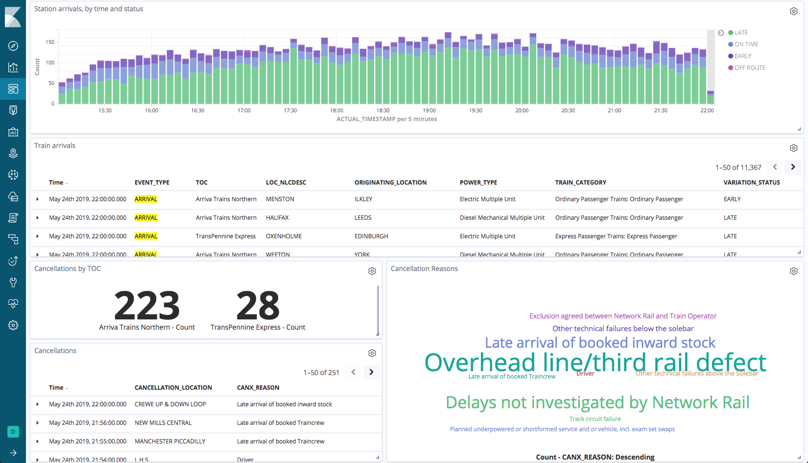
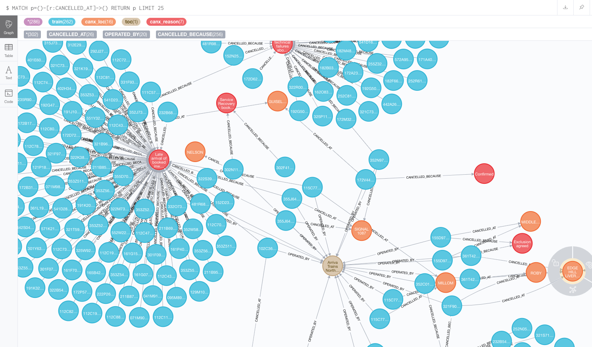
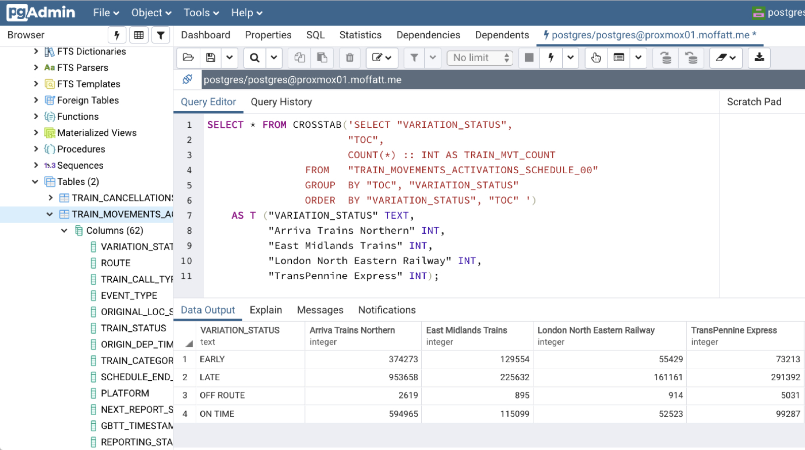

= Building a Streaming Data Pipeline with Rail Data
Robin Moffatt <robin@confluent.io>
v1.10, July 9, 2019

== What is it?

A PoC showing what can be done with streaming and batch sources of data, Apache Kafka and KSQL, and various data stores and tools. 

== Setup

* Register for an account at https://datafeeds.networkrail.co.uk/
* Set username and password in 
+
[source,bash]
----
/data/credentials.properties
/data/set_credentials_env.sh
----

== Data ingest

=== Streams

1. Create Kafka Connect connector(s):
+
[source,bash]
----
./data/ingest/movements/00_ingest.sh
----
+
Check status: 
+
[source,bash]
----
curl -s "http://localhost:8083/connectors"| jq '.[]'| xargs -I{connector_name} curl -s "http://localhost:8083/connectors/"{connector_name}"/status"| jq -c -M '[.name,.connector.state,.tasks[].state]|join(":|:")'| column -s : -t| sed 's/\"//g'| sort
----
+
[source,bash]
----
source-activemq-networkrail-TRAIN_MVT_EA_TOC-01  |  RUNNING  |  RUNNING
source-activemq-networkrail-TRAIN_MVT_ED_TOC-01  |  RUNNING  |  RUNNING
----
+
Check data: 
+
[source,bash]
----
kafkacat -b localhost:9092 -t networkrail_TRAIN_MVT -C -c1

{"messageID":"ID:opendata-backend.rockshore.net-42259-1558600921537-11:1:1:40:2938","messageType":"text","timestamp":1558693449805,"deliveryMode":2,"correlationID":null,"replyTo":null,"destination":{"desti
nationType":"topic","name":"TRAIN_MVT_ED_TOC"},"redelivered":false,"type":null,"expiration":1558693749805,"priority":4,"properties":{},"bytes":null,"map":null,"text":"[{\"header\":{\"msg_type\":\"0003\",\"
source_dev_id\":\"\",\"user_id\":\"\",\"original_data_source\":\"SMART\",\"msg_queue_timestamp\":\"1558693442000\",\"source_system_id\":\"TRUST\"},\"body\":{\"event_type\":\"ARR…
----

2. Set pipeline running to split out payload batches into single messages
+
[source,bash]
----
./data/ingest/movements/01_explode.sh &
----
+
[source,bash]
----
Group tm_explode rebalanced (memberid rdkafka-c53a4270-e767-493a-b5de-2244b389e645): assigned: networkrail_TRAIN_MVT [0]
% Reached end of topic networkrail_TRAIN_MVT [0] at offset 189
{"header":{"msg_type":"0003","source_dev_id":"","user_id":"","original_data_source":"SMART","msg_queue_timestamp":"1558694355000","source_system_id":"TRUST"},"body":{"event_type":"DEPARTURE","gbtt_timestamp":"","original_loc_stanox":"","planned_timestamp":"1558697700000","timetable_variation":"4","original_loc_timestamp":"","current_train_id":"","delay_monitoring_point":"false","next_report_run_time":"4","reporting_stanox":"00000","actual_timestamp":"1558697940000","correction_ind":"false","event_source":"AUTOMATIC","
…
----
+
Check the data on the target topic
+
[source,bash]
----
kafkacat -b localhost:9092 -t networkrail_TRAIN_MVT_X -C -c1
{"header":{"msg_type":"0003","source_dev_id":"","user_id":"","original_data_source":"SMART","msg_queue_timestamp":"1558694355000","source_system_id":"TRUST"},"body":{"event_type":"DEPARTURE","gbtt_timestamp":"","original_loc_stanox":"","planned_timestamp":"1558697700000","timetable_variation":"4","original_loc_timestamp":"","current_train_id":"","delay_monitoring_point":"false","next_report_run_time":"4","reporting_stanox":"00000","actual_timestamp":"1558697940000","correction_ind":"false","event_source":"AUTOMATIC","train_file_address":null,"platform":"","division_code":"20","train_terminated":"false","train_id":"321B74MH24","offroute_ind":"false","variation_status":"LATE","train_service_code":"11817020","toc_id":"20","loc_stanox":"32540","auto_expected":"true","direction_ind":"UP","route":"1","planned_event_type":"DEPARTURE","next_report_stanox":"32557","line_ind":""}}
----

=== Batch

[source,bash]
----
source ./data/set_credentials_env.sh
./data/ingest/corpus_location/00_ingest_corpus.sh
./data/ingest/movements/01_load_canx_reason_code.sh
./data/ingest/cif_schedule/00_ingest_schedule.sh
----

[source,bash]
----
$ kafkacat -b localhost:9092 -t corpus -C -c1
{"NLCDESC":"MERSEYRAIL ELECTRICS-HQ INPUT","NLC":"000800","TIPLOC":" ","3ALPHA":" ","STANOX":" ","NLCDESC16":"MPTE HQ INPUT","UIC":" "}

$ kafkacat -b localhost:9092 -t CIF_FULL_DAILY -C -c1
{"JsonTimetableV1":{"classification":"public","timestamp":1558653193,"owner":"Network Rail","Sender":{"organisation":"Rockshore","application":"NTROD","component":"SCHEDULE"},"Metadata":{"type":"full","sequence":2535}}}
----

== KSQL

=== CORPUS (location data)

[source,sql]
----
run script '/data/ksql/corpus_location/01_corpus.ksql';
run script '/data/ksql/corpus_location/02_stanox.ksql';
----

[source,sql]
----
ksql> show streams;

 Stream Name              | Kafka Topic              | Format
-----------------------------------------------------------------
 CORPUS_RAW               | corpus                   | JSON
 CORPUS_BY_STANOX         | CORPUS_BY_STANOX         | AVRO
 […]
----

[source,sql]
----
ksql> show tables;

 Table Name                   | Kafka Topic                  | Format | Windowed
---------------------------------------------------------------------------------
 STANOX                       | CORPUS_BY_STANOX             | AVRO   | false
 […]
----

[source,sql]
----
SET 'auto.offset.reset' = 'earliest';

SELECT STANOX, NLCDESC
  FROM STANOX
 WHERE NLCDESC='ILKLEY' 
 LIMIT 1;
----

[source,sql]
----
17055 | ILKLEY
Limit Reached
Query terminated
----

=== CIF (schedule / train attribute data & location data)

[source,sql]
----
run script '/data/ksql/cif_schedule/01_schedule_raw.ksql';
run script '/data/ksql/cif_schedule/02_tiploc.ksql';
run script '/data/ksql/cif_schedule/03_schedule.ksql';
----

If you get `Avro schema for message values on topic TIPLOC_FLAT_KEYED does not exist in the Schema Registry.` after running `02_tiploc.ksql` then wait a few moments and then re-run it; the topic on which it's built is created and populated by the preceeding step, and it may not have kicked in yet. 

[source,sql]
----
ksql> SHOW STREAMS;

 Stream Name              | Kafka Topic              | Format
-----------------------------------------------------------------
 TIPLOC_FLAT_KEYED        | TIPLOC_FLAT_KEYED        | AVRO
 SCHEDULE_RAW             | CIF_FULL_DAILY           | JSON
 SCHEDULE_00              | SCHEDULE_00              | AVRO
 SCHEDULE_01              | SCHEDULE_01              | AVRO
 […]
----

[source,sql]
----
SELECT SCHEDULE_KEY,
       TRAIN_STATUS,
       POWER_TYPE,
       SEATING_CLASSES,
       TRAIN_CATEGORY 
  FROM SCHEDULE_01 
 WHERE ORIGINATING_LOCATION='ILKLEY' 
 LIMIT 1;
----

[source,sql]
----
Y61618/2019-05-20/P | Passenger & Parcels (Permanent - WTT) | Electric Multiple Unit | Standard only | Ordinary Passenger Trains: Ordinary Passenger
Limit Reached
Query terminated
----

[source,sql]
----
ksql> SHOW TABLES;

 Table Name                   | Kafka Topic                  | Format | Windowed
---------------------------------------------------------------------------------
 TIPLOC                       | TIPLOC_FLAT_KEYED            | AVRO   | false
 […]
----

[source,sql]
----
SET 'auto.offset.reset' = 'earliest';

SELECT TIPLOC_CODE, 
       NALCO,
       STANOX, 
       CRS_CODE,
       DESCRIPTION,
       TPS_DESCRIPTION
  FROM TIPLOC
 WHERE DESCRIPTION='ILKLEY' 
 LIMIT 1;
----

[source,sql]
----
ILKLEY | 856800 | 17055 | ILK | ILKLEY | ILKLEY
Limit Reached
Query terminated
----

=== Train Movements

[source,sql]
----
RUN SCRIPT '/data/ksql/movements/01_canx_reason.ksql';
RUN SCRIPT '/data/ksql/movements/01_movement_raw.ksql';
RUN SCRIPT '/data/ksql/movements/02_activations.ksql';
RUN SCRIPT '/data/ksql/movements/02_cancellations.ksql';
RUN SCRIPT '/data/ksql/movements/02_movements.ksql';
RUN SCRIPT '/data/ksql/movements/03_activations_table.ksql';
RUN SCRIPT '/data/ksql/movements/04_cancellations_activations.ksql';
RUN SCRIPT '/data/ksql/movements/04_movements_activations.ksql';
RUN SCRIPT '/data/ksql/movements/05_cancellations_activations_schedules.ksql';
RUN SCRIPT '/data/ksql/movements/05_movements_activations_schedules.ksql';
----

==== Movements

[source,sql]
----
SELECT TIMESTAMPTOSTRING(ROWTIME, 'yyyy-MM-dd HH:mm:ss') as ACTUAL_TIMESTAMP,
       EVENT_TYPE,
       LOC_NLCDESC,
       CASE WHEN LEN(PLATFORM)> 0 THEN 'Platform' + PLATFORM ELSE '' END AS PLATFORM,
       CASE WHEN VARIATION_STATUS = 'ON TIME' THEN 'ON TIME' 
            WHEN VARIATION_STATUS = 'LATE' THEN TIMETABLE_VARIATION + ' MINS LATE' 
            WHEN VARIATION_STATUS='EARLY' THEN TIMETABLE_VARIATION + ' MINS EARLY' 
         END AS VARIATION ,
       VARIATION_STATUS,
       TOC,
       TRAIN_ID,
       TRAIN_SERVICE_CODE
  FROM TRAIN_MOVEMENTS_01 
  WHERE LOC_NLCDESC = 'BEN RHYDDING';
----

[source,sql]
----
2019-05-24 11:42:00 | ARRIVAL | BEN RHYDDING | Platform 1 | 1 MINS LATE | LATE | Arriva Trains Northern | 172D48MI24 | 11821020
2019-05-24 11:42:00 | ARRIVAL | BEN RHYDDING | Platform 2 | ON TIME | ON TIME | Arriva Trains Northern | 172V27MJ24 | 11819020
2019-05-24 11:43:00 | DEPARTURE | BEN RHYDDING | Platform 2 | 1 MINS LATE | LATE | Arriva Trains Northern | 172V27MJ24 | 11819020
2019-05-24 11:43:00 | DEPARTURE | BEN RHYDDING | Platform 1 | 2 MINS LATE | LATE | Arriva Trains Northern | 172D48MI24 | 11821020
2019-05-24 11:54:00 | ARRIVAL | BEN RHYDDING | Platform 1 | ON TIME | ON TIME | Arriva Trains Northern | 172V26MJ24 | 11819020
----

==== Activations

TODO

==== Cancellations

TODO

== TODO

* Find way to explode/process SCHEDULE_SEGMENT_LOCATION so that for a given train id we can show start/end stations and ideally list of stops in between
