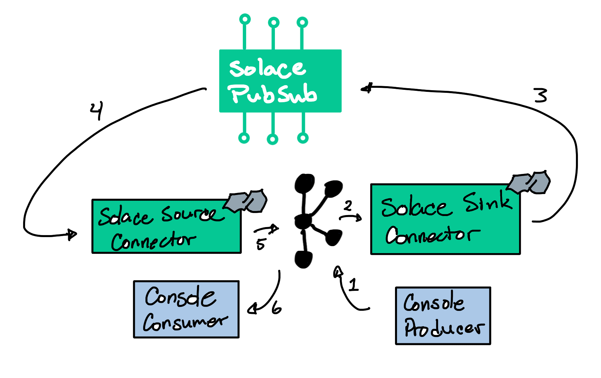

# Solace Demo

This repository demonstrates how to use the Solace source and sink connector.



## Docker

Increase the memory to around 9GiB

## Make commands

```bash
make build # builds the docker images
make cluster # creates the cluster
make topics # creates the kafka topics
# make sure solace is up and running
make queues # makes the a queue in the default Message VPN in solace
make connect # makes the source and sink solace connectors
```

## Consume and Produce messages

Run the commands below in 2 different terminals.

```bash
# terminal 1
make producer # to put your data in
# terminal 2
make consumer # to consume the data you sent to solace via connectors
```
