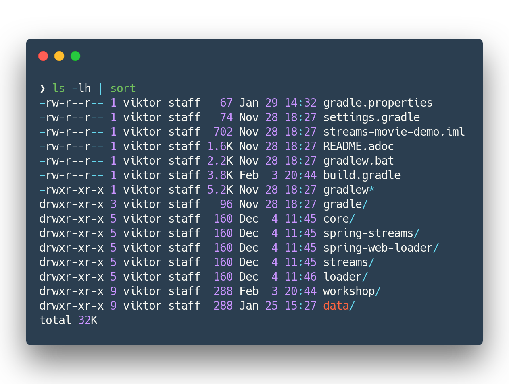
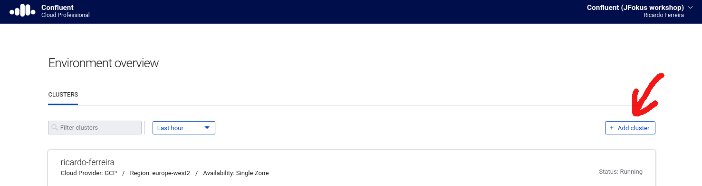
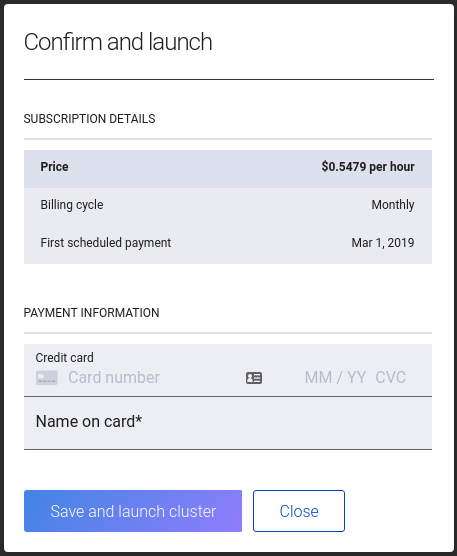
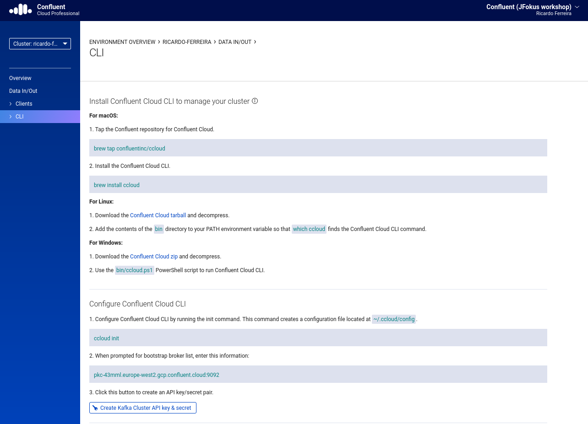
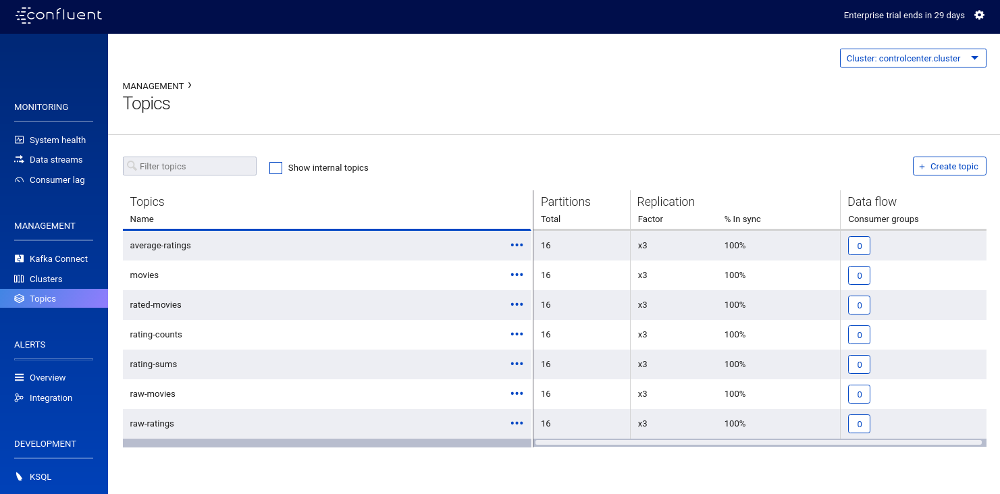
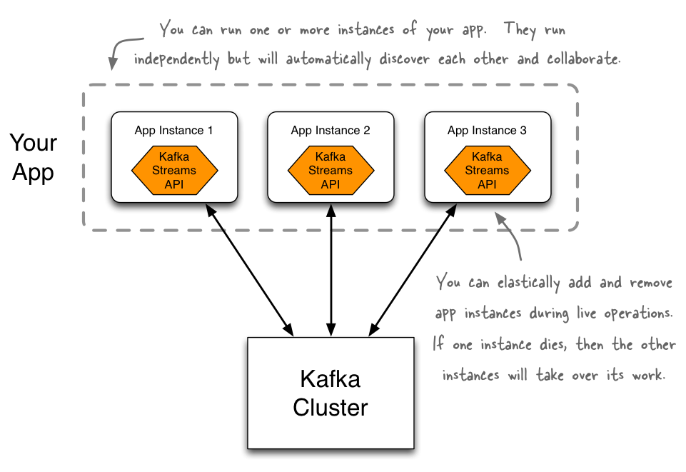
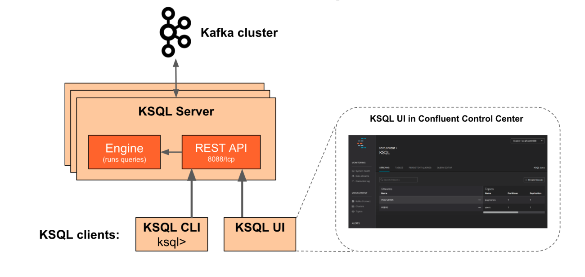

= Building a Streaming Data Pipeline with Kafka Streams and KSQL
Ricardo Ferreira<ricardo@confluent.io>, Viktor Gamov <viktor@confluent.io>, © 2019 Confluent, Inc.
:toc: auto
:toc-placement: auto
:toc-position: right
:toc-title: Table of content
:icons: font
:source-highlighter: highlight.js
:highlightjs-theme: idea
:experimental:

== Prerequisites

Welcome to the https://www.jfokus.se/jfokus19/talks/2585[«Building a Streaming Data Pipeline with Kafka Streams and KSQL»] workshop.

To be successful in executing all exercises, you need to have following installed.

* Docker CE Version 18.09.1
+
NOTE: It is OK to use Windows, but the trainers are not Windows users and may not be able to help with Windows related issues.
* Git
* JDK (min JDK 8)
** Recommended way
*** Install https://sdkman.io/install[sdkman]
*** `sdk list java`
*** `sdk install java <verison-provider>` e.g. `sdk install java 8.0.201-zulu`
* https://www.jetbrains.com/idea/download/[IntelliJ IDEA Community Edition]
* https://docs.docker.com/install/[Docker CE]
* Docker Compose Version 1.20.0 | with Docker Compose file format 2.1

== Outline

. *Lesson 0:* Introduction to Kafka, topics and events
 ** Event Streaming platform and why do we need it?
 ** Key concepts of Apache Kafka
 ** Overview of our Architecture
. *Lab 0:*
 ** Create a cluster in Confluent Cloud
 ** Install the Confluent Cloud CLI
 ** Create topic, produce and consume events from Cloud CLI
. *Lesson 1:* Introduction to Kafka Streams
 ** Producer and Consumer APIs
 ** Introduction to Kafka Streams
 ** Stream-table duality
. *Lab 1:*
 ** Code review: Streaming Moview ratings
 ** run app
 ** run data generator
. *Lesson 2:* More Kafka Streams
 ** Introduction to Kafka Streams
 ** Introducing local materialized views
 ** Stream-table duality
 ** Code review of web-service
. *Lesson 3* KSQL
 ** concepts
 **
. *Lab 3* Moview Ratings with KSQL
  ** hands on KSQL CLI
. *It's a wrap!*

== Getting the code

NOTE: If you will follow steps below you should checkout only directory that has source code relevant to this post.

* Get example from GitHub
+

[source,bash]
----
mkdir ~/temp/demo-scene
cd ~/temp/demo-scene
git init .
git remote add origin -f https://github.com/confluentinc/demo-scene/
git config core.sparsecheckout true
echo "streams-movie-demo/*" >> .git/info/sparse-checkout
git pull --depth=2 origin master
cd streams-movie-demo
ls -lh
----
// http://scriptedonachip.com/git-sparse-checkout
+

and you should see something like this
+

[role="text-center"]
.The output of `ls -lh streams-movie-demo`

== Creating a Cluster in Confluent Cloud

In this section, you are going to create your own Apache Kafka cluster on Confluent Cloud.
This cluster will be used troughout the entire workshop -- therefore make sure to follow the steps shown here.

=== Step 1: Log in to Confluent Cloud

Open the following URL in your browser: https://confluent.cloud/login

Enter with the following credentials:

[source,bash]
----
Username: viktor+jfokus@confluent.io
Password: *************
----

The instructors will provide the password for this account.

=== Step 2: Create your Cluster

From the main UI, click on the `Add Cluster` button.

Enter with a value for the `Cluster name` field.
To be able to identify your own cluster among the others, use the following notation for the name: firstName + '-' + lastName.

Make sure to select `Google Cloud Platform` as your Cloud provider.
Though any cloud provider would work, we are using GCP in this workshop because it is cheaper.
Finally, make sure to select `us-central-1` [EU West (London)] as region, since it is the closest location to Stockholm/Sweden.
The image below shows an example of how your cluster should look like.

.New cluster properties
image::images/creating-cluster-2.png[width=75%]

When you finish done the changes, click in the `Continue` button.
The UI will ask for credit card details.
Ask for some of the instructors to enter a valid credit card.

.Confirm config and create cluster

Finally, click on the `Save and launch cluster` button.

=== Step 3: Configure the Confluent Cloud CLI

From the main UI, click on your cluster.
Then, click on the `Data In/Out` menu and subsequentially on the `CLI` sub-menu.
You will be presented with the following instructions:

.Configuring Confluent Cloud CLI

Follow the instructions presented thoroughly.
This is crucial for the next sections of the workshop to work.
If you feel that you need help, please don't hesitate to call any of the instructors.

== Creating Topics and Validating Data Flowing

=== Step 1: Creating Raw Data Topics

[source,bash]
----
ccloud topic create raw-movies --partitions 16 --replication-factor 3
ccloud topic create raw-ratings --partitions 16 --replication-factor 3
----

Check if the topics were created properly by using the following command:

[source,bash]
----
ccloud topic list
----

You should see the two topics being listed in the output.

=== Step 2: Producing and Consuming Data using Confluent Cloud CLI

Open a terminal to consume records from the `raw-movies` topic using the following command:

[source,bash]
----
ccloud consume -t raw-movies
----

Open another terminal to produce records to the `raw-movies` topic using the following command:

[source,bash]
----
cat ../data/movies.dat | ccloud produce -t raw-movies
----

Open another terminal to consume records from the `raw-ratings` topic using the following command:

[source,bash]
----
ccloud consume -t raw-ratings
----

Open another terminal to produce records to the `raw-ratings` topic using the following command:

[source,bash]
----
cat ../data/ratings.dat | ccloud produce -t raw-ratings
----

Press kbd:[Ctrl + C] to interrupt the consume commands issue in this section.

=== Step 3: Creating Workshop Related Topics

[source,bash]
----
sh create-demo-topics.sh
----

You should see the following output:

[source,bash]
----
Topic "movies" created.
Topic "ratings" created.
Topic "rating-sums" created.
Topic "rating-counts" created.
Topic "average-ratings" created.
Topic "rated-movies" created.
----

== Connecting Docker with Confluent Cloud Cluster

NOTE: Use this in a _non-production_ Confluent Cloud instance for development purposes only.

On the host from which you are running Docker, ensure that you have correctly initialized Confluent Cloud CLI and have a valid configuration file at `$HOME/.ccloud/config`. More information https://docs.confluent.io/current/cloud/cli/install.html[here].

=== Step 1: Generate a file that exports environment variables used by Docker to set up the bootstrap servers and authentication details.

[source,bash]
----
sh ccloud-generate-env-vars.sh
----

=== Step 2: Source the generated file to make the exports available in the current path.

[source,bash]
----
source ./delta_configs/env.delta
----

== Bring up Services from Confluent Platform

Make sure you completed the steps in the Setup section above before proceeding.
You may bring up all services in the Docker Compose file at once...

=== All Services At-Once

[source,bash]
----
docker-compose up -d
----

=== ...or individually...

==== Confluent Schema Registry

[source,bash]
----
docker-compose up -d schema-registry
----

==== KSQL Server

[source,bash]
----
docker-compose up -d ksql-server
----

==== KSQL CLI

[source,bash]
----
docker-compose up -d ksql-cli
----

==== Confluent Control Center

[source,bash]
----
docker-compose up -d control-center
----

Control Center may take from one to five minutes until the service finish start up, depending on your hardware configuration.
To check if things are working properly, open the following URL in a browser: http://localhost:9021.
If the Control Center UI pop's up, click on the `Topics` menu.
You should be able to see the topics created previously.

.Control Center is Showing Topics

If you need to troubleshoot what is going on with a particular service, you can use the command `docker-compose logs -f <SERVICE>`.

.The example below shows how to access the logs from Control Center
[source,bash]
----
docker-compose logs -f control-center
----

== Kafka Streams: Streams API for Apache Kafka

The Streams API of Apache Kafka, available through a Java library, can be used to build highly scalable, elastic, fault-tolerant, distributed applications and microservices.
First and foremost, the Kafka Streams API allows you to create real-time applications that power your core business.
It is the easiest yet the most powerful technology to process data stored in Kafka.
It builds upon important concepts for stream processing such as efficient management of application state, fast and efficient aggregations and joins, properly distinguishing between event-time and processing-time, and seamless handling of late-arriving and out-of-order data.

.Kafka Streams in a nutshell

=== Run Streaming Movie Demo

* Start Kafka Streams application
+

[source,shell]
----
./gradlew streams:runApp -PconfigPath=$HOME/.ccloud/config
----

=== Generate test load

* Start raw rating generator
+

[source,bash]
----
./gradlew loader:streamWithRawRatingStreamer -PconfigPath=$HOME/.ccloud/config
----
+

NOTE: I recommend to run the raw rating generator in a separate terminal window so you can interrupt it with kbd:[Ctrl+C]

== KSQL: Streaming SQL for Apache Kafka

Confluent KSQL is the streaming SQL engine that enables real-time data processing against Apache Kafka®. It provides an easy-to-use, yet powerful interactive SQL interface for stream processing on Kafka, without the need to write code in a programming language such as Java or Python.
KSQL is scalable, elastic, fault-tolerant, and it supports a wide range of streaming operations, including data filtering, transformations, aggregations, joins, windowing, and sessionization.

.KSQL Architecture

In this part of the workshop, you are going to enrich the implementation you have made thus far with KSQL, which is going to provide similar stream processing capabilities found previously using Kafka Streams.

=== Step 1: Seed the Underlying Topics with Data

In this step, you are going to seed the topics `movies` and `ratings` with at least one record.
This is necessary because once we start creating streams and tables around those topics, KSQL knows how to parse the data.

[source,bash]
----
head -n1 ../data/ratings-json.js | ccloud produce -t ratings
head -n1 ../data/movies-json.js  | ccloud produce -t movies
----

=== Step 2: Create a new KSQL CLI session

In this step, you are going to create a session using KSQL CLI.
KSQL CLI is a command-line interface that allows you to send KSQL sentences to the KSQL Server, whereas these senteces are to create things on the server or simply to execute ad-hoc queries interactively.

[source,bash]
----
docker run --network workshop_default --rm --interactive --tty confluentinc/cp-ksql-cli:5.1.0 http://ksql-server:8088
----

You should be presented with a prompt as shown below:

[source,bash]
----

                  ===========================================
                  =        _  __ _____  ____  _             =
                  =       | |/ // ____|/ __ \| |            =
                  =       | ' /| (___ | |  | | |            =
                  =       |  <  \___ \| |  | | |            =
                  =       | . \ ____) | |__| | |____        =
                  =       |_|\_\_____/ \___\_\______|       =
                  =                                         =
                  =  Streaming SQL Engine for Apache Kafka® =
                  ===========================================

Copyright 2017-2018 Confluent Inc.

CLI v5.1.0, Server v5.1.0 located at http://ksql-server:8088

Having trouble? Type 'help' (case-insensitive) for a rundown of how things work!

ksql>
----

To test things out, execute the following command:

[source,bash]
----
PRINT 'movies' FROM BEGINNING;
----

You should see all the records that you loaded into the topic `movies` previously.
Press kbd:[Ctrl + C] to interrupt the print command and go back to the KSQL CLI prompt.

Using the KSQL CLI you can also read and write properties.
Properties are server and/or client attributes that defines the basic behavior of queries.
For instance, we are going to need to read the topics always from the beginning, so we can read old records and not only the newest ones.
In order to do this, execute the following command:

[source,bash]
----
SET 'auto.offset.reset' = 'earliest';
----

To show the value of properties, you can use the `SHOW PROPERTIES` command:

[source,bash]
----
SHOW PROPERTIES;
----

=== Step 3: Creating a Movies Table

In this step, you are going to create your first table.
Keep always in mind though that tables are nothing but snapshots of a stream for the last state of a given key.
That means that the building block that actually stores data are streams -- but we can capture a subset of that stream in a given time and materialize it as a table.
Sounds complicated right? It will be less complicated when you start executing the instructions below.

First, you need to create a stream around the existing topic.
Create the stream using the following command:

[source,bash]
----
CREATE STREAM MOVIES_SRC \
 (movie_id BIGINT, title VARCHAR, release_year INT, country VARCHAR, rating DOUBLE, \
  cinematographer VARCHAR, genres ARRAY<VARCHAR>, directors ARRAY<VARCHAR>, composers ARRAY<varchar>, \
   screenwriters ARRAY<VARCHAR>, production_companies ARRAY<VARCHAR>)\
 WITH (VALUE_FORMAT='JSON', KAFKA_TOPIC='movies');
----

There you have it.
You just created your first stream.
Streams are entities that are kept by KSQL and contain metadata that defines it's caracteristics.
In order to check the stream metadata, use the following command:

[source,bash]
----
DESCRIBE MOVIES_SRC;
----

You should see the following output:

[source,bash]
----
ksql> DESCRIBE MOVIES_SRC;

Name                 : MOVIES_SRC
 Field                | Type
--------------------------------------------------
 ROWTIME              | BIGINT           (system)
 ROWKEY               | VARCHAR(STRING)  (system)
 MOVIE_ID             | BIGINT
 TITLE                | VARCHAR(STRING)
 RELEASE_YEAR         | INTEGER
 COUNTRY              | VARCHAR(STRING)
 RATING               | DOUBLE
 CINEMATOGRAPHER      | VARCHAR(STRING)
 GENRES               | ARRAY<VARCHAR(STRING)>
 DIRECTORS            | ARRAY<VARCHAR(STRING)>
 COMPOSERS            | ARRAY<VARCHAR(STRING)>
 SCREENWRITERS        | ARRAY<VARCHAR(STRING)>
 PRODUCTION_COMPANIES | ARRAY<VARCHAR(STRING)>
--------------------------------------------------
For runtime statistics and query details run: DESCRIBE EXTENDED <Stream,Table>;
----

Next, we need to make sure that each record from this stream is identifiable (or partition by, as we prefer) using a field that is unique.
Think in this as if it was a primary key for a SQL database if that makes you feel more confortable.
In order to do this, we need to rekey this stream using the following command:

[source,bash]
----
CREATE STREAM MOVIES_REKEYED \
 WITH (PARTITIONS=1) \
 AS SELECT * FROM movies_src PARTITION BY movie_id;
----

The result of this command is the creation of a new stream.
This new stream will contain exactly the same records that the previous stream contained, as well as any new record that arrives on it since KSQL ensures that derived streams are kept in-sync all the time.
And the best of all... you don't need to write any additional code for that to happen.
If you want to play with this, execute the following query:

[source,bash]
----
SELECT * FROM MOVIES_REKEYED;
----

You should see the record that you previously loaded into the `movies` topic, which proves the magic of KSQL which is keeping your ETL pipeline live, with all the data copying between the pipes managed automatically.
Now, you may notice that the query you just execute never finishes.
For now, you can safely press kbd:[Ctrl + C] to interrupt the query command and go back to the KSQL CLI prompt.
But it is important to understand that queries in KSQL are executed forever.
The reason being is because streams are set of records that are continuously written and therefore, the result of a streams is always updated.
Hence why a query in KSQL never finishes.

Now that you have a stream with each of its records partitioned by the `movie_id` field, we can finally create our table.
Execute the following command:

[source,bash]
----
CREATE TABLE MOVIES_REF (movie_id BIGINT, title VARCHAR, release_year INT, country VARCHAR, rating DOUBLE, cinematographer VARCHAR, genres ARRAY<VARCHAR>, directors ARRAY<VARCHAR>, composers ARRAY<varchar>, screenwriters ARRAY<VARCHAR>, production_companies ARRAY<VARCHAR>) WITH (VALUE_FORMAT='JSON', KAFKA_TOPIC='MOVIES_REKEYED', KEY='movie_id');
----

Once the table is created, it can be queried as many times as you want.
Execute the following query over the newly created table:

[source,bash]
----
SELECT * FROM MOVIES_REF;
----

Let this query execute for now and don't interrupt it by pressing kbd:[Ctrl + C]. Open a new terminal and execute the following:

[source,bash]
----
cat ../data/movies-json.js | ccloud produce -t movies
----

If you look to the KSQL query being executed, you should see tons of records being shown.

[source,bash]
----
1549232500202 | 1 | 1 | Once Upon a Time in the West | 1968 | Italy | 8.199999809265137 | Tonino Delli Colli | [Western] | [Sergio Leone] | [Ennio Morricone] | [Sergio Leone, Sergio Donati, Dario Argento, Bernardo Bertolucci] | [Paramount Pictures]
1549236467679 | 11 | 11 | The Ugly Truth | 2009 | United States | 5.699999809265137 | Russell Carpenter | [Romance, Comedy] | [Robert Luketic] | [Aaron Zigman] | [Nicole Eastman, Karen McCullah Lutz, Kirsten Smith] | [Sony Pictures, Lakeshore Entertainment]
1549236467679 | 12 | 12 | Warlock | 1959 | United States | 7.0 | Joseph MacDonald | [Western] | [Edward Dmytryk] | [Leigh Harline] | [Robert Alan Aurthur] | [20th Century Fox]
1549236467680 | 27 | 27 | Spanish Movie | 2009 | Spain | 3.799999952316284 | Óscar Faura | [Comedy] | [Javier Ruiz Caldera] | [Fernando Velázquez] | [Paco Cabezas] | [Telecinco Cinema, Think Studio]
1549236467680 | 28 | 28 | The Little Mermaid | 1989 | United States | 6.699999809265137 | Animation | [Animation, Fantasy, Musical, Kids] | [John Musker, Ron Clements] | [Alan Menken] | [John Musker, Ron Clements] | [Walt Disney Pictures]
1549236467681 | 43 | 43 | Jurassic Park | 1993 | United States | 7.0 | Dean Cundey | [Sci-Fi, Adventure] | [Steven Spielberg] | [John Williams] | [Michael Crichton, David Koepp] | [Universal Pictures, Amblin Entertainment]
1549236467682 | 59 | 59 | Casablanca | 1942 | United States | 8.399999618530273 | Arthur Edeson | [Drama, Romance] | [Michael Curtiz] | [Max Steiner] | [Julius J. Epstein, Philip G. Epstein, Howard Koch] | [Warner Bros.
Pictures; Producer: Hal B. Wallis]
1549236467683 | 75 | 75 | The Italian Job | 2003 | United States | 6.5 | Wally Pfister | [Action] | [F. Gary Gray] | [John Powell] | [Wayne Powers, Donna Powers] | [Paramount Pictures]
1549236467681 | 44 | 44 | 310 to Yuma (Three Ten to Yuma) | 1957 | United States | 7.5 | Charles Lawton Jr. | [Western] | [Delmer Daves] | [George Duning] | [Halsted Welles] | [Columbia Pictures]
1549236467684 | 91 | 91 | Iron Man | 2008 | United States | 6.5 | Matthew Libatique | [Fantasy, Action, Adventure, Sci-Fi] | [Jon Favreau] | [Ramin Djawadi] | [Arthur Marcum, Matt Holloway, Mark Fergus, Hawk Ostby] | [Paramount Pictures, Marvel Enterprises, Goldman & Associates]
----

Not only this proves that you are in the right track with this workshop but it also proves how KSQL is awesome.
Think for a second what just happened:

.Visualizing KSQL ETL

You just built in a matter of minutes a fairly complicated ETL pipeline in which data is being transferred from a input topic to a series of pipes that are changing the nature of the data (re-keying in this case) and finally creating a table where data is always up-to-date with whatever is written to the input topic.