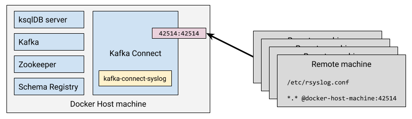

= Processing and Analysing syslog with ksqlDB

See https://rmoff.net/2019/12/18/detecting-and-analysing-ssh-attacks-with-ksqldb/

== Setup

* Clone the git repo
+
[source,bash]
----
git clone https://github.com/confluentinc/demo-scene.git
----

* Launch the stack
+
[source,bash]
----
cd syslog
docker-compose up -d
----

== ksqlDB

To start with, get a ksqlDB prompt:

[source,bash]
----
docker exec -it ksqldb-cli bash -c 'ksql http://ksqldb-server:8088'
----

== syslog

== See also…

* https://www.confluent.io/blog/real-time-syslog-processing-apache-kafka-ksql-part-1-filtering[We ❤️ syslogs: Real-time syslog Processing with Apache Kafka and KSQL – Part 1: Filtering]
* https://www.confluent.io/blog/real-time-syslog-processing-with-apache-kafka-and-ksql-part-2-event-driven-alerting-with-slack/[We ❤ syslogs: Real-time syslog Processing with Apache Kafka and KSQL – Part 2: Event-Driven Alerting with Slack]
* https://www.confluent.io/blog/real-time-syslog-processing-apache-kafka-ksql-enriching-events-with-external-data/[We ❤️ syslogs: Real-time syslog processing with Apache Kafka and KSQL – Part 3: Enriching events with external data]
