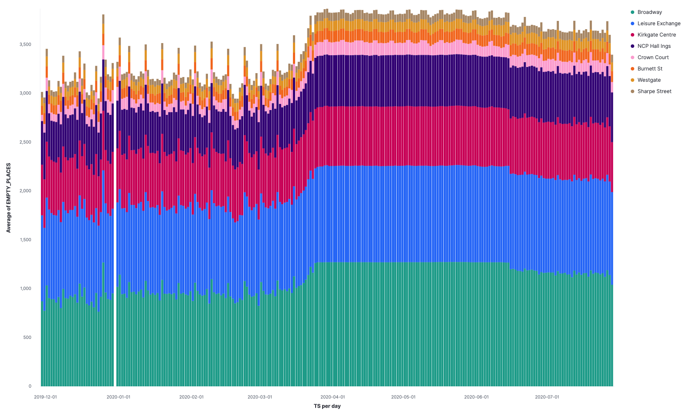
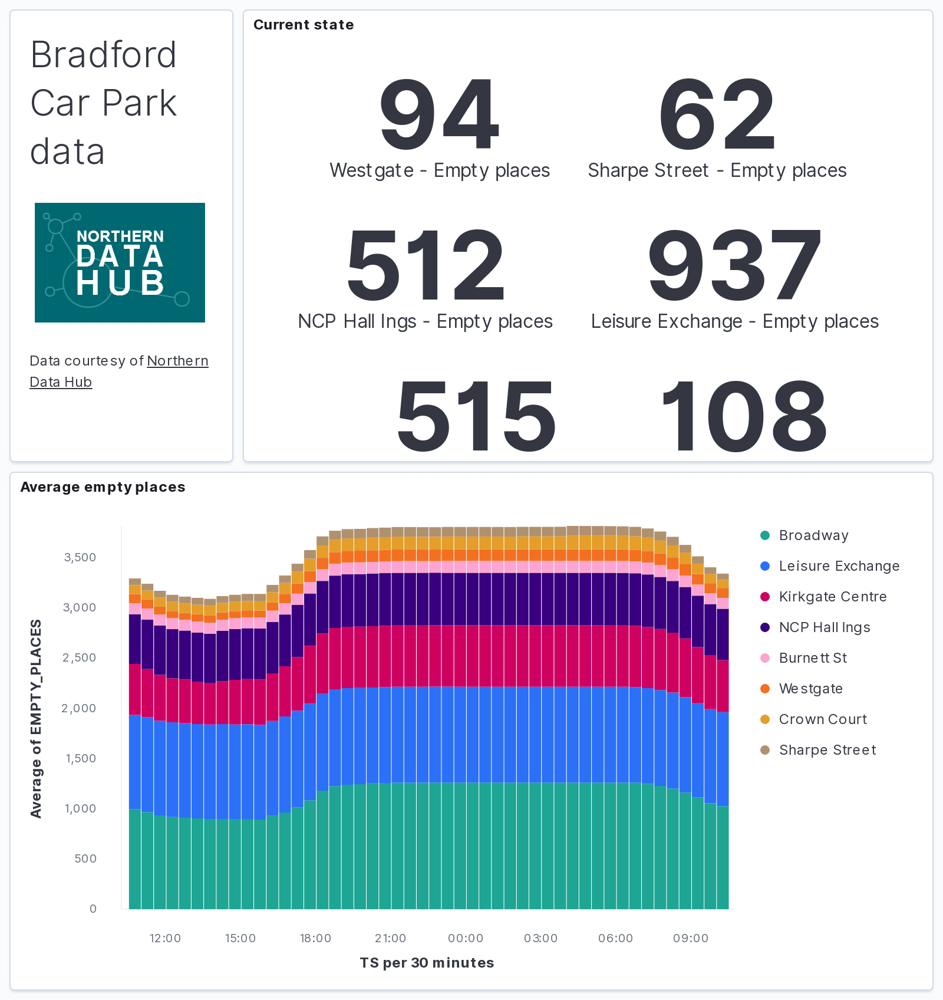

== Setting up Confluent Cloud including KSQL 

Create a Confluent Cloud account, put details in `.env`. 

Create topics: 

[source,bash]
----
ccloud login --save
ccloud kafka cluster list
ccloud kafka cluster use <i>
ccloud kafka topic create carparks
ccloud kafka topic create carparks_historic
ccloud kafka topic create --config cleanup.policy=compact,retention.ms=900000,retention.bytes=-1 carpark_table_15min
----

=== ksqlDB on Confluent Cloud

Set up ksqlDB API key and ACLs so we can use the CLI

[source,bash]
----
# Make a note of Id and Endpoint as you'll need these values
ccloud ksql app list

# Get the Service Account ID for ksqlDB - note the value after `User:` in the first column
# e.g.
#   User:118859      | ALLOW      | DESCRIBE         | TOPIC            | carparks                     | LITERAL
# Here the Service Account ID is 118859
ccloud ksql app configure-acls <Id> carparks --dry-run

# chmod 777
ccloud kafka acl create --allow --service-account <ServiceAccountID> --operation READ --operation CREATE --operation WRITE --topic '*'

# Create an API key for accessing ksqlDB - make a note of these!
ccloud api-key create --resource <Id>
----

== Stream the data into the topic

Stream the current data from the REST endpoint into Kafka, piping the output from `curl` into `kafkacat`, polling every three minutes: 

[source,bash]
----
source .env
while [ 1 -eq 1 ];
do 
    curl --show-error --silent https://datahub.bradford.gov.uk/ebase/api/getData/v2/Council/CarParkCurrent | \
        tail -n +2 | \
        docker run --rm --interactive edenhill/kafkacat:1.6.0 \
            -X security.protocol=SASL_SSL -X sasl.mechanisms=PLAIN \
            -X ssl.ca.location=./etc/ssl/cert.pem -X api.version.request=true \
            -b $CCLOUD_BROKER_HOST \
            -X sasl.username="$CCLOUD_API_KEY" \
            -X sasl.password="$CCLOUD_API_SECRET" \
            -t carparks -P -T
    sleep 180
done
----

Check it's working 

[source,bash]
----
source .env
docker run --rm --interactive edenhill/kafkacat:1.6.0 \
    -X security.protocol=SASL_SSL -X sasl.mechanisms=PLAIN \
    -X ssl.ca.location=./etc/ssl/cert.pem -X api.version.request=true \
    -b $CCLOUD_BROKER_HOST \
    -X sasl.username="$CCLOUD_API_KEY" \
    -X sasl.password="$CCLOUD_API_SECRET" \
    -t carparks -C -c5
----

=== One-off load of historic data

[source,bash]
----
source .env
curl -s https://datahub.bradford.gov.uk/ebase/api/getData/v2/Council/CarParkHistoric | \
    docker run --rm --interactive edenhill/kafkacat:1.6.0 \
    -X security.protocol=SASL_SSL -X sasl.mechanisms=PLAIN \
    -X ssl.ca.location=./etc/ssl/cert.pem -X api.version.request=true \
    -b $CCLOUD_BROKER_HOST \
    -X sasl.username="$CCLOUD_API_KEY" \
    -X sasl.password="$CCLOUD_API_SECRET" \
    -t carparks -P
----

== Manipulating the data in ksqlDB

Launch ksqlDB local CLI connecting to ksqlDB on Confluent Cloud

[source,bash]
----
docker run --interactive --tty --rm confluentinc/ksqldb-cli:0.12.0 \
    ksql --user $KSQLDB_API_KEY        \
         --password $KSQLDB_API_SECRET \
         $KSQLDB_ENDPOINT
----

[source,bash]
----
Key format: ¯\_(ツ)_/¯ - no data processed
Value format: KAFKA_STRING
rowtime: 2020/10/06 13:43:03.502 Z, key: <null>, value: 2020-10-06,14:41,Westgate,116,89,Spaces,53.796291,-1.759143,"https://maps.google.com/?daddr=53.796291,-1.759143"
rowtime: 2020/10/06 13:43:41.757 Z, key: <null>, value: 2020-10-06,14:41,Westgate,116,89,Spaces,53.796291,-1.759143,"https://maps.google.com/?daddr=53.796291,-1.759143"
rowtime: 2020/10/06 13:43:41.761 Z, key: <null>, value: 2020-10-06,14:41,Sharpe Street,98,71,Spaces,53.789785,-1.756187,"https://maps.google.com/?daddr=53.789785,-1.756187"
rowtime: 2020/10/06 13:44:19.717 Z, key: <null>, value: 2020-10-06,14:41,Leisure Exchange,996,926,Spaces,53.79222,-1.746683,"https://maps.google.com/?daddr=53.79222,-1.746683"
rowtime: 2020/10/06 13:44:19.717 Z, key: <null>, value: 2020-10-06,14:41,NCP Hall Ings,526,486,Spaces,53.791838,-1.752201,"https://maps.google.com/?daddr=53.791838,-1.752201"
Topic printing ceased
----

What's the schema of this data? 

[source,bash]
----
curl -s https://datahub.bradford.gov.uk/ebase/api/getData/v2/Council/CarParkCurrent | head -n 1
date,time,name,capacity,empty_places,status,latitude,longitude,directionsURL
----

Apply the schema, making assumptions about the data types (Yay for CSV 🤔): 

[source,sql]
----
CREATE STREAM CARPARK_SRC (date          VARCHAR ,
                           time          VARCHAR ,
                           name          VARCHAR ,
                           capacity      INT ,
                           empty_places  INT ,
                           status        VARCHAR ,
                           latitude      DOUBLE ,
                           longitude     DOUBLE ,
                           directionsURL VARCHAR)
                WITH (KAFKA_TOPIC='carparks', 
                VALUE_FORMAT='DELIMITED');
----

Check the schema once applied to the source data in the topic gives sensible results:

[source,sql]
----
SET 'auto.offset.reset' = 'earliest';
SELECT * FROM CARPARK_SRC EMIT CHANGES LIMIT 5;
----

[source,sql]
----
+-------------------+-------------------+-------------------+-------------------+-------------------+-------------------+-------------------+-------------------+-------------------+
|DATE               |TIME               |NAME               |CAPACITY           |EMPTY_PLACES       |STATUS             |LATITUDE           |LONGITUDE          |DIRECTIONSURL      |
+-------------------+-------------------+-------------------+-------------------+-------------------+-------------------+-------------------+-------------------+-------------------+
|2020-10-06         |14:41              |Burnett St         |122                |112                |Spaces             |53.795739          |-1.744756          |https://maps.google|
|                   |                   |                   |                   |                   |                   |                   |                   |.com/?daddr=53.7957|
|                   |                   |                   |                   |                   |                   |                   |                   |39,-1.744756       |
|2020-10-06         |14:41              |Sharpe Street      |98                 |71                 |Spaces             |53.789785          |-1.756187          |https://maps.google|
|                   |                   |                   |                   |                   |                   |                   |                   |.com/?daddr=53.7897|
|                   |                   |                   |                   |                   |                   |                   |                   |85,-1.756187       |
|2020-10-06         |14:41              |Sharpe Street      |98                 |71                 |Spaces             |53.789785          |-1.756187          |https://maps.google|
|                   |                   |                   |                   |                   |                   |                   |                   |.com/?daddr=53.7897|
|                   |                   |                   |                   |                   |                   |                   |                   |85,-1.756187       |
|2020-10-06         |14:44              |Westgate           |116                |91                 |Spaces             |53.796291          |-1.759143          |https://maps.google|
|                   |                   |                   |                   |                   |                   |                   |                   |.com/?daddr=53.7962|
|                   |                   |                   |                   |                   |                   |                   |                   |91,-1.759143       |
|2020-10-06         |14:44              |Leisure Exchange   |996                |926                |Spaces             |53.79222           |-1.746683          |https://maps.google|
|                   |                   |                   |                   |                   |                   |                   |                   |.com/?daddr=53.7922|
|                   |                   |                   |                   |                   |                   |                   |                   |2,-1.746683        |
Limit Reached
Query terminated
ksql>
----

Create a new stream: 

* Set the timestamp from the two source fields
* Make the location (lat/lon) a struct
* Serialise to Protobuf so that the schema is available for use downstream
** Could also use Avro or JSON Schema here

[source,sql]
----
SET 'auto.offset.reset' = 'earliest';

CREATE STREAM CARPARK_EVENTS WITH (VALUE_FORMAT='PROTOBUF', KAFKA_TOPIC='CARPARK_EVENTS_v00') AS 
SELECT STRINGTOTIMESTAMP(DATE + ' ' + TIME ,'yyyy-MM-dd HH:mm','Europe/London' ) AS TS,
       *,
       STRUCT("lat" := LATITUDE, "lon":= LONGITUDE) AS "location",
       'v2/Council/CarParkCurrent' as SOURCE 
  FROM CARPARK_SRC 
  EMIT CHANGES;
----

Check the data: 

[source,sql]
----
SELECT SOURCE, 
       COUNT(*) AS EVENT_CT, 
       TIMESTAMPTOSTRING( MIN(TS),'yyyy-MM-dd HH:mm:ss','Europe/London') AS EARLIEST_TS,
       TIMESTAMPTOSTRING( MAX(TS),'yyyy-MM-dd HH:mm:ss','Europe/London') AS LATEST_TS
  FROM CARPARK_EVENTS 
GROUP BY SOURCE 
EMIT CHANGES 
LIMIT 1;
----

[source,sql]
----
+----------------------------+---------+--------------------+--------------------+
|SOURCE                      |EVENT_CT |EARLIEST_TS         |LATEST_TS           |
+----------------------------+---------+--------------------+--------------------+
|v2/Council/CarParkCurrent   |3872     |2020-10-06 14:41:00 |2020-10-07 15:49:00 |
Limit Reached
Query terminated
----

Create a materialised view of the current state: 

[source,sql]
----
SET 'auto.offset.reset' = 'earliest';
CREATE TABLE CARPARK WITH (KAFKA_TOPIC='carpark_table_15min') AS
SELECT NAME, 
       TIMESTAMPTOSTRING( LATEST_BY_OFFSET(TS),'yyyy-MM-dd HH:mm:ss','Europe/London') AS LATEST_TS, 
       COUNT(*) AS READINGS_CT,
       LATEST_BY_OFFSET(CAPACITY) AS CAPACITY,
       LATEST_BY_OFFSET(EMPTY_PLACES) AS CURRENT_EMPTY_PLACES,
       MIN(EMPTY_PLACES) AS MIN_EMPTY_PLACES,
       MAX(EMPTY_PLACES) AS MAX_EMPTY_PLACES,
       (CAST(LATEST_BY_OFFSET(CAPACITY) - LATEST_BY_OFFSET(EMPTY_PLACES) AS DOUBLE) / 
        CAST(LATEST_BY_OFFSET(CAPACITY) AS DOUBLE)) * 100 AS PCT_FULL,
       LATEST_BY_OFFSET(STATUS) AS STATUS,
       LATEST_BY_OFFSET(LATITUDE) AS LATITUDE,
       LATEST_BY_OFFSET(LONGITUDE) AS LONGITUDE,
       LATEST_BY_OFFSET(DIRECTIONSURL) AS DIRECTIONSURL
    FROM CARPARK_EVENTS
    WHERE SOURCE='v2/Council/CarParkCurrent'
    GROUP BY NAME
    EMIT CHANGES;
----

// Create a compacted topic with the car park as the key (i.e. hold the latest value for each car park): 

// [source,sql]
// ----
// SET 'auto.offset.reset' = 'earliest';

// CREATE STREAM CARPARK_LATEST WITH (VALUE_FORMAT='PROTOBUF', KAFKA_TOPIC='carpark_15min') AS 
// SELECT * 
//   FROM CARPARK_EVENTS
//   PARTITION BY NAME 
//   EMIT CHANGES;
// ----

== Push and pull queries

=== Pull (k/v lookup): How many spaces are currently free?

[source,sql]
----
ksql> SELECT LATEST_TS, CURRENT_EMPTY_PLACES, PCT_FULL FROM CARPARK WHERE NAME='Westgate';
+----------------------+----------------------+----------+
|LATEST_TS             |CURRENT_EMPTY_PLACES  |PCT_FULL  |
+----------------------+----------------------+----------+
|2020-10-07 16:10:00   |100                   |13.793103 |
Query terminated
ksql>
----

* `/query`
+
[source,bash]
----
source .env
curl --show-error --silent --location --user $KSQLDB_API_KEY:$KSQLDB_API_SECRET \
     --request POST $KSQLDB_ENDPOINT'/query' \
     --header 'Content-Type: application/vnd.ksql.v1+json; charset=utf-8' \
     --data-raw '{
        "ksql": "SELECT LATEST_TS, CURRENT_EMPTY_PLACES, PCT_FULL FROM CARPARK WHERE NAME='\''Westgate'\'';"
     }' | jq '.'
----
+
[source,javascript]
----
[
  {
    "header": {
      "queryId": "query_1602086966182",
      "schema": "`LATEST_TS` STRING, `CURRENT_EMPTY_PLACES` INTEGER, `PCT_FULL` DOUBLE"
    }
  },
  {
    "row": {
      "columns": [
        "2020-10-07 16:10:00",
        100,
        13.793103448275861
      ]
    }
  }
]
----

* `/query-stream`
+
[source,bash]
----
curl --show-error --silent --location --user $KSQLDB_API_KEY:$KSQLDB_API_SECRET \
    --http2 --request POST $KSQLDB_ENDPOINT'/query-stream' \
    --header 'Content-Type: application/vnd.ksql.v1+json; charset=utf-8' --header 'Accept: application/json' \
    --data-raw '{"sql":"SELECT LATEST_TS, CURRENT_EMPTY_PLACES, PCT_FULL FROM CARPARK WHERE NAME='\''Westgate'\'';"}' | jq '.'
----
+
[source,javascript]
----
[
  {
    "queryId": null,
    "columnNames": [
      "LATEST_TS",
      "CURRENT_EMPTY_PLACES",
      "PCT_FULL"
    ],
    "columnTypes": [
      "STRING",
      "INTEGER",
      "DOUBLE"
    ]
  },
  [
    "2020-10-07 16:10:00",
    100,
    13.793103448275861
  ]
]
----

=== Push (Event-driven alert): Tell me when there's a space available

[source,sql]
----
SELECT NAME AS CARPARK,
      TIMESTAMPTOSTRING(TS,'yyyy-MM-dd HH:mm:ss','Europe/London') AS DATA_TS,
      CAPACITY     ,
      EMPTY_PLACES
 FROM CARPARK_EVENTS 
 WHERE NAME = 'Kirkgate Centre' 
   AND EMPTY_PLACES > 0 
   AND SOURCE='v2/Council/CarParkCurrent'
 EMIT CHANGES;
----

* `/query-stream`
+
[source,bash]
----
curl --show-error --silent --location --user $KSQLDB_API_KEY:$KSQLDB_API_SECRET \
    --http2 --request POST $KSQLDB_ENDPOINT'/query-stream' \
--header 'Content-Type: application/vnd.ksql.v1+json; charset=utf-8' \
--data-raw '{"properties":{"ksql.streams.auto.offset.reset": "latest"},
    "sql": "SELECT NAME AS CARPARK,      TIMESTAMPTOSTRING(TS,'\''yyyy-MM-dd HH:mm:ss'\'','\''Europe/London'\'') AS DATA_TS,      CAPACITY     ,      EMPTY_PLACES FROM CARPARK_EVENTS  WHERE NAME = '\''Kirkgate Centre'\''    AND EMPTY_PLACES > 0  EMIT CHANGES;"
}'
----
+
[source,bash]
----
{"queryId":"20a9c981-12d7-494e-a632-e6602b95ef96","columnNames":["CARPARK","DATA_TS","CAPACITY","EMPTY_PLACES"],"columnTypes":["STRING","STRING","INTEGER","INTEGER"]}
["Kirkgate Centre","2020-07-28 16:58:00",611,510]
----

== More fun ksqlDB stuff

=== Making the alert variable 

[source,sql]
----
CREATE TABLE ALERT_CONFIG (CARPARK VARCHAR PRIMARY KEY, SPACES_ALERT INT) WITH (KAFKA_TOPIC='alert_config_01', VALUE_FORMAT='PROTOBUF', PARTITIONS=6);

INSERT INTO ALERT_CONFIG (CARPARK, SPACES_ALERT) VALUES ('Kirkgate Centre',470);

CREATE STREAM CARPARK_ALERTS AS
    SELECT C.NAME AS CARPARK, 
           TIMESTAMPTOSTRING(C.TS,'yyyy-MM-dd HH:mm:ss','Europe/London') AS DATA_TS, 
           CAPACITY     ,
           EMPTY_PLACES,
           A.SPACES_ALERT AS ALERT_THRESHOLD, 
           STATUS      ,
           LATITUDE    ,
           LONGITUDE   ,
           DIRECTIONSURL
      FROM CARPARK_EVENTS C
            INNER JOIN 
           ALERT_CONFIG A
            ON C.NAME=A.CARPARK
      WHERE C.EMPTY_PLACES >= A.SPACES_ALERT EMIT CHANGES;
----

[source,sql]
----
SELECT CARPARK, ALERT_THRESHOLD, DATA_TS, EMPTY_PLACES FROM CARPARK_ALERTS EMIT CHANGES;
+-----------------+-----------------+--------------------+-------------+
|CARPARK          |ALERT_THRESHOLD  |DATA_TS             |EMPTY_PLACES |
+-----------------+-----------------+--------------------+-------------+
|Kirkgate Centre  |470              |2020-07-21 10:55:00 |505          |
----

== Cool stuff if you have the user's location

=== If they give you the location (lat,lon)

[source,sql]
----
SELECT NAME AS CARPARK, 
       LATEST_TS, 
       GEO_DISTANCE(CAST(53.925232 AS DOUBLE), 
	                  CAST(-1.802675 AS DOUBLE), 
                    CAST(LATITUDE AS DOUBLE), 
                    CAST(LONGITUDE AS DOUBLE)) AS DISTANCE_TO_CARPARK_KM, 
	     CURRENT_EMPTY_PLACES, 
       DIRECTIONSURL
	  FROM CARPARK C 
	 WHERE CURRENT_EMPTY_PLACES > 10
	 EMIT CHANGES;
----

[source,sql]
----
+------------------+--------------------+--------------------------+---------------------+--------------------------+
|CARPARK           |LATEST_TS           |DISTANCE_TO_CARPARK_KM    |CURRENT_EMPTY_PLACES |DIRECTIONSURL             |
+------------------+--------------------+--------------------------+---------------------+--------------------------+
|NCP Hall Ings     |2020-07-28 17:04:00 |15.197595348356613        |516                  |https://maps.google.com/?d|
|                  |                    |                          |                     |addr=53.791838,-1.752201  |
|Burnett St        |2020-07-28 17:04:00 |14.891486742270187        |111                  |https://maps.google.com/?d|
|                  |                    |                          |                     |addr=53.795739,-1.744756  |
|Crown Court       |2020-07-28 17:04:00 |15.215944827861867        |112                  |https://maps.google.com/?d|
|                  |                    |                          |                     |addr=53.792179,-1.748466  |
|Leisure Exchange  |2020-07-28 17:04:00 |15.239263028872804        |960                  |https://maps.google.com/?d|
|                  |                    |                          |                     |addr=53.79222,-1.746683   |
|Kirkgate Centre   |2020-07-28 17:04:00 |14.801711309240307        |526                  |https://maps.google.com/?d|
|                  |                    |                          |                     |addr=53.795002,-1.755938  |
|Broadway          |2020-07-28 17:04:00 |14.975072972447347        |1002                 |https://maps.google.com/?d|
|                  |                    |                          |                     |addr=53.794175,-1.750107  |
|Westgate          |2020-07-28 17:04:00 |14.619017126268641        |102                  |https://maps.google.com/?d|
|                  |                    |                          |                     |addr=53.796291,-1.759143  |
|Sharpe Street     |2020-07-28 17:04:00 |15.366501862359593        |78                   |https://maps.google.com/?d|
|                  |                    |                          |                     |addr=53.789785,-1.756187  |
----

We just need a `TOPN` function now :) 

=== If you're tracking the user location in a stream

[source,sql]
----
CREATE STREAM USER_TRACKING (USERNAME VARCHAR KEY , LAT DOUBLE, LON DOUBLE, DUMMY INT) WITH (KAFKA_TOPIC='user_loc', VALUE_FORMAT='PROTOBUF', PARTITIONS=4);

INSERT INTO USER_TRACKING (USERNAME, LAT, LON, DUMMY) VALUES ('Robin', 53.790566, -1.759100,1);
INSERT INTO USER_TRACKING (USERNAME, LAT, LON, DUMMY) VALUES ('Robin', 53.790389, -1.759765,1);
INSERT INTO USER_TRACKING (USERNAME, LAT, LON, DUMMY) VALUES ('Robin', 53.789590, -1.761407,1);
INSERT INTO USER_TRACKING (USERNAME, LAT, LON, DUMMY) VALUES ('Robin', 53.788468, -1.763703,1);
----

[source,sql]
----
SET 'auto.offset.reset' = 'earliest';
CREATE TABLE USER_LOCATION AS 
  SELECT USERNAME, 
         LATEST_BY_OFFSET(LAT) AS LAT, 
         LATEST_BY_OFFSET(LON) AS LON, 
         TIMESTAMPTOSTRING(MAX(ROWTIME),'yyyy-MM-dd HH:mm:ss','Europe/London') AS LATEST_TS, 
         COUNT(*) AS MOVEMENT_CT  
  FROM   USER_TRACKING 
  GROUP BY USERNAME;
----

[source,sql]
----
ksql> SELECT USERNAME, LAT, LON, LATEST_TS, MOVEMENT_CT FROM USER_LOCATION WHERE USERNAME='Robin';
+-----------+-----------+-----------+
|USERNAME   |LAT        |LON        |
+-----------+-----------+-----------+
|Robin      |53.788468  |-1.763703  |
----

This next bit is a bit of a half-way house. We can use `GEO_DISTANCE` to get the distance (as the crow flies) between two points, but it's not possible to do a non-key join between two tables (current user position and current car park state). Instead we do a cartesian stream-stream join on the underlying events with a window of 10 minutes (the assumption being if the data is any older on either side then it can't be treated as current). 

[source,sql]
----

CREATE STREAM CARPARK_EVENTS_WITH_DUMMY AS SELECT 1 AS DUMMY, * FROM CARPARK_EVENTS WHERE SOURCE='v2/Council/CarParkCurrent' EMIT CHANGES;

CREATE TABLE NEAREST_CARPARK AS 
SELECT USERNAME AS KEY1, NAME AS KEY2, 
       AS_VALUE(USERNAME) AS USERNAME, 
       AS_VALUE(NAME) AS CARPARK, 
       TIMESTAMPTOSTRING( LATEST_BY_OFFSET(C.TS),'yyyy-MM-dd HH:mm:ss','Europe/London') AS DATA_TS, 
       GEO_DISTANCE(CAST(LATEST_BY_OFFSET(C.LATITUDE) AS DOUBLE),
                    CAST(LATEST_BY_OFFSET(C.LONGITUDE) AS DOUBLE),
                    LATEST_BY_OFFSET(U.LAT),
                    LATEST_BY_OFFSET(U.LON)) AS DISTANCE_TO_CARPARK_KM,
        LATEST_BY_OFFSET(EMPTY_PLACES) AS CURRENT_EMPTY_PLACES,
       (CAST(LATEST_BY_OFFSET(CAPACITY) - LATEST_BY_OFFSET(EMPTY_PLACES) AS DOUBLE) / 
        CAST(LATEST_BY_OFFSET(CAPACITY) AS DOUBLE)) * 100 AS PCT_FULL,
       LATEST_BY_OFFSET(DIRECTIONSURL) AS DIRECTIONSURL                    
  FROM CARPARK_EVENTS_WITH_DUMMY C 
        INNER JOIN 
       USER_TRACKING U 
       WITHIN 10 MINUTES ON C.DUMMY=U.DUMMY 
GROUP BY USERNAME, NAME
EMIT CHANGES;
----

This results in a table which gets us most of the way there - given the user's current position, how far are they from each car park that has empty spaces? From this table the client would need to apply a function to return the closest car park (since ksqlDB doesn't yet have a TopN function, or `ORDER BY…LIMIT 1`).

[source,sql]
----
ksql> SELECT USERNAME, 
             CARPARK, 
             DISTANCE_TO_CARPARK_KM,
             CURRENT_EMPTY_PLACES, 
             PCT_FULL,
             DIRECTIONSURL 
        FROM NEAREST_CARPARK 
        WHERE CURRENT_EMPTY_PLACES>0
        EMIT CHANGES;
+----------+-----------------+-----------------------+----------------------+-------+----------------------------+
|USERNAME  |CARPARK          |DISTANCE_TO_CARPARK_KM |CURRENT_EMPTY_PLACES  |PCT_FU |DIRECTIONSURL               |
+----------+-----------------+-----------------------+----------------------+-------+----------------------------+
|Robin     |NCP Hall Ings    |0.6543405759178128     |506                   |3.8022 |https://maps.google.com/?dad|
|          |                 |                       |                      |       |dr=53.791838,-1.752201      |
|Robin     |Crown Court      |0.8974759769914396     |89                    |37.323 |https://maps.google.com/?dad|
|          |                 |                       |                      |       |dr=53.792179,-1.748466      |
|Robin     |Sharpe Street    |0.34357886788866193    |70                    |28.571 |https://maps.google.com/?dad|
|          |                 |                       |                      |       |dr=53.789785,-1.756187      |
|Robin     |Leisure Exchange |1.0104154810532562     |944                   |5.2208 |https://maps.google.com/?dad|
|          |                 |                       |                      |       |dr=53.79222,-1.746683       |
|Robin     |Westgate         |0.7598114828203173     |79                    |31.896 |https://maps.google.com/?dad|
|          |                 |                       |                      |       |dr=53.796291,-1.759143      |
|Robin     |Burnett St       |1.2898373463967188     |110                   |9.8360 |https://maps.google.com/?dad|
|          |                 |                       |                      |       |dr=53.795739,-1.744756      |
|Robin     |Broadway         |0.9004706574553182     |948                   |19.524 |https://maps.google.com/?dad|
|          |                 |                       |                      |       |dr=53.794175,-1.750107      |
|Robin     |Kirkgate Centre  |0.7008511543305518     |490                   |19.803 |https://maps.google.com/?dad|
|          |                 |                       |                      |       |dr=53.795002,-1.755938      |
----

We just need a `TOPN` function now :) 

== Stream the data to Elasticsearch. 

Create mapping template in Elasticsearch to force timestamp and location to be handled correctly:

[source,javascript]
----
curl -s -XPUT "http://localhost:9200/_template/rmoff/" \
      -H 'Content-Type: application/json' \
      -d' {
          "template": "*", "mappings": {
              "dynamic_templates": [
                  { "dates": { "match": "TS", "mapping": { "type": "date" } } },
                  { "geopoint": { "match": "location", "mapping": { "type": "geo_point" } } }
              ] }
          }'
----

Create a sink connector from ksqlDB: 

[source,sql]
----
CREATE SINK CONNECTOR SINK_ELASTIC_01 WITH (
  'connector.class'                     = 'io.confluent.connect.elasticsearch.ElasticsearchSinkConnector',
  'topics'                              = 'CARPARK_EVENTS',
  'key.converter'                       = 'org.apache.kafka.connect.storage.StringConverter',
  'value.converter'                     = 'io.confluent.connect.protobuf.ProtobufConverter',
  'value.converter.schema.registry.url' = 'http://schema-registry:8081',
  'connection.url'                      = 'http://elasticsearch:9200',
  'type.name'                           = '_doc',
  'key.ignore'                          = 'true',
  'schema.ignore'                       = 'true');
----

Check the status of the connector in ksqlDB

[source,sql]
----
SHOW CONNECTORS
----

[source,sql]
----
 Connector Name  | Type | Class                                                         | Status
----------------------------------------------------------------------------------------------------------------------
 SINK_ELASTIC_01 | SINK | io.confluent.connect.elasticsearch.ElasticsearchSinkConnector | RUNNING (1/1 tasks RUNNING)
----------------------------------------------------------------------------------------------------------------------
----

Check that data is arriving: 

[source,bash]
----
➜ docker exec elasticsearch curl -s "http://localhost:9200/_cat/indices/*?h=idx,docsCount"

.kibana_task_manager_1        2
.apm-agent-configuration      0
.kibana_1                     1
carpark_events           265793
----

Visualise it in Kibana: 

=== Automating the generation of the report and export to PNG

Exporting to PNG requires Elastic licence, so start the 30-day trial (if not already done with `xpack.license.self_generated.type: "trial"` in Docker Compose):

[source,bash]
----
curl -X POST "localhost:9200/_license/start_trial?acknowledge=true&pretty"
----

Now run a `POST` to trigger the PNG generation based on a saved dashboard

[source,bash]
----
curl --silent --location --request POST 'http://localhost:5601/api/reporting/generate/png?jobParams=(browserTimezone:Europe%2FLondon,layout:(dimensions:(height:1200,width:800),id:png),objectType:dashboard,relativeUrl:%27%2Fapp%2Fkibana%23%2Fdashboard%2F3398ecd0-d0f0-11ea-bd54-2d4c18537c1c%3F_g%3D(refreshInterval:(pause:!!f,value:60000),time:(from:now-24h,to:now))%26_a%3D(description:!%27!%27,filters:!!(),fullScreenMode:!!f,options:(hidePanelTitles:!!f,useMargins:!!t),panels:!!((embeddableConfig:(title:!%27!%27),gridData:(h:14,i:cade3656-b058-4298-be15-5486758c7a87,w:12,x:0,y:0),id:f8d0b510-d0ef-11ea-bd54-2d4c18537c1c,panelIndex:cade3656-b058-4298-be15-5486758c7a87,type:visualization,version:!%277.5.0!%27),(embeddableConfig:(),gridData:(h:14,i:!%2792f00732-2938-455f-ac33-82345947f105!%27,w:36,x:12,y:0),id:a94edb20-d0ef-11ea-bd54-2d4c18537c1c,panelIndex:!%2792f00732-2938-455f-ac33-82345947f105!%27,type:visualization,version:!%277.5.0!%27),(embeddableConfig:(),gridData:(h:16,i:!%2797ab40ba-9162-49eb-b9e8-9177d49f708d!%27,w:48,x:0,y:14),id:!%2716b34630-d0e4-11ea-bd54-2d4c18537c1c!%27,panelIndex:!%2797ab40ba-9162-49eb-b9e8-9177d49f708d!%27,type:lens,version:!%277.5.0!%27)),query:(language:kuery,query:!%27!%27),timeRestore:!!f,title:!%27Bradford%2BCar%2BPark%2Bdata!%27,viewMode:view)%27,title:%27Bradford%20Car%20Park%20data%27)' \
--header 'kbn-xsrf: nevergonnagiveyouup'|jq '.path'
"/api/reporting/jobs/download/kd75hxb500070081a4dak27r"
----

Take the resulting `path` element and fetch the PNG. 

[source,bash]
----
curl "http://localhost:5601/api/reporting/jobs/download/kd75hxb500070081a4dak27r" > ~/Downloads/1.png
----

If you get `Processing` in response then try again soon after. Image dimensions etc can be customised in the `POST` request `jobParams` query parameters. 

TODO: Automate doing this through Telegram bot 🆒

== Historic data

Apply schema to historic data

[source,sql]
----
CREATE STREAM CARPARK_HISTORIC (date          VARCHAR ,
                                time          VARCHAR ,
                                name          VARCHAR ,
                                capacity      INT ,
                                empty_places  INT ,
                                status        VARCHAR ,
                                latitude      DOUBLE ,
                                longitude     DOUBLE )
                WITH (KAFKA_TOPIC='carparks_historic', 
                VALUE_FORMAT='DELIMITED');
----

Merge current and historic data, adding a source field for lineage

[source,sql]
----
INSERT INTO CARPARK_EVENTS 
SELECT STRINGTOTIMESTAMP(DATE + ' ' + TIME ,'yyyy-MM-dd HH:mm','Europe/London' ) AS TS,
       *,
       '' AS DIRECTIONSURL,
       STRUCT("lat" := LATITUDE, "lon":= LONGITUDE) AS "location",
       'v2/Council/CarParkHistoric' as SOURCE 
  FROM CARPARK_HISTORIC
  EMIT CHANGES;
----
