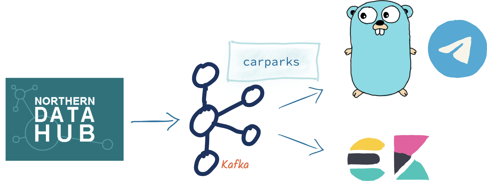
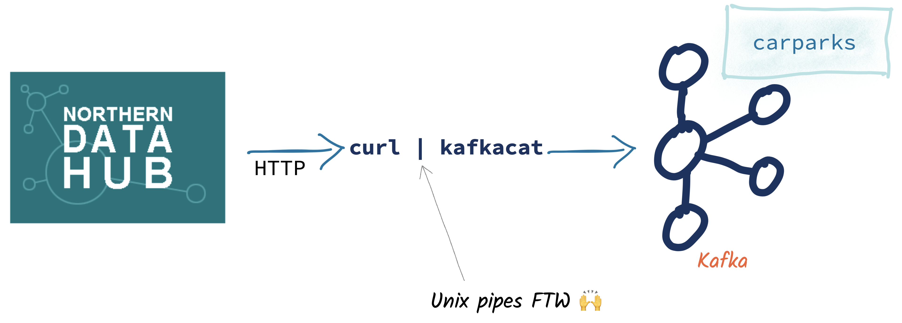

= Building a Telegram bot with Go, Apache Kafka, and ksqlDB
Robin Moffatt <robin@confluent.io>
v1.01, 14 October 2020
:toc:

== Prep

* https://t.me/kafka_alert_bot[Launch bot, clear history]

* Three terminal windows
+
[source,bash]
----
# Run the Carpark telegram bot for first demo
cd ~/git/demo-scene/telegram-bot-carparks/go
go run .
----
+
[source,bash]
----
# To show the Telegram bot basic code
cd ~/git/golang-telegram-bot
ls -l
----
+
[source,bash]
----
# For running interactive session to 
# walk through all the cool stuff
cd ~/git/demo-scene/telegram-bot-carparks/
docker-compose up -d

docker exec -it ksqldb bash -c 'echo -e "\n\n⏳ Waiting for ksqlDB to be available before launching CLI\n"; while : ; do curl_status=$(curl -s -o /dev/null -w %{http_code} http://ksqldb:8088/info) ; echo -e $(date) " ksqlDB server listener HTTP state: " $curl_status " (waiting for 200)" ; if [ $curl_status -eq 200 ] ; then  break ; fi ; sleep 5 ; done ; ksql http://ksqldb:8088'
----

== Demo

1. Show working bot
2. Show telegram/Go stuff
3. Show ksqlDB and building the actual carpark bot

''''

== Building a Telegram bot in Go

[source,bash]
----
cd ~/git/golang-telegram-bot
ls -l
----

== Stream data from REST endpoint into Kafka

Source data

[source,bash]
----
curl --show-error --silent https://datahub.bradford.gov.uk/ebase/api/getData/v2/Council/CarParkCurrent
----

Source data with header removed

[source,bash]
----
curl --show-error --silent https://datahub.bradford.gov.uk/ebase/api/getData/v2/Council/CarParkCurrent | \
        tail -n +2 
----

Source data with header removed streamed into a Kafka topic

[source,bash]
----
curl --show-error --silent https://datahub.bradford.gov.uk/ebase/api/getData/v2/Council/CarParkCurrent | \
        tail -n +2 | \
        docker exec -i kafkacat kafkacat -b broker:29092 -t carparks -P -T
----

Stream the current data from the REST endpoint into Kafka, piping the output from `curl` into `kafkacat`, polling every three minutes: 

[source,bash]
----
while [ 1 -eq 1 ];
do 
    curl --show-error --silent https://datahub.bradford.gov.uk/ebase/api/getData/v2/Council/CarParkCurrent | \
        tail -n +2 | \
        docker exec -i kafkacat kafkacat -b broker:29092 -t carparks -P -T
    sleep 180
done
----

== Apply a schema to the data with ksqlDB

[source,sql]
----
CREATE STREAM CARPARK_SRC (date          VARCHAR ,
                           time          VARCHAR ,
                           name          VARCHAR ,
                           capacity      INT ,
                           empty_places  INT ,
                           status        VARCHAR ,
                           latitude      DOUBLE ,
                           longitude     DOUBLE ,
                           directionsURL VARCHAR)
                WITH (KAFKA_TOPIC='carparks', 
                      VALUE_FORMAT='DELIMITED');
----

Use the schema to project columns: 

[source,sql]
----
SET 'auto.offset.reset' = 'earliest';
SELECT DATE, TIME, NAME, EMPTY_PLACES FROM CARPARK_SRC EMIT CHANGES LIMIT 5;
----

[source,sql]
----
+-------------+-------+-------------+-------------+
|DATE         |TIME   |NAME         |EMPTY_PLACES |
+-------------+-------+-------------+-------------+
|2020-07-28   |14:55  |Westgate     |73           |
|2020-07-28   |14:55  |Burnett St   |108          |
|2020-07-28   |14:55  |Crown Court  |94           |
|2020-07-28   |14:55  |NCP Hall Ings|505          |
----

== Transform the data

Create a new stream: 

* Add a source field for lineage
* Set the timestamp from the two source fields
* Make the location (lat/lon) a struct
* Create a calculated field (`PCT_FULL`)
* Serialise to Protobuf so that the schema is available for use downstream
** Could also use Avro or JSON Schema here

[source,sql]
----
SET 'auto.offset.reset' = 'earliest';

CREATE STREAM CARPARK_EVENTS WITH (VALUE_FORMAT='PROTOBUF') AS 
SELECT STRINGTOTIMESTAMP(DATE + ' ' + TIME ,'yyyy-MM-dd HH:mm','Europe/London' ) AS TS,
       *,
       (CAST((CAPACITY - EMPTY_PLACES) AS DOUBLE) / 
        CAST(CAPACITY AS DOUBLE)) * 100 AS PCT_FULL,
       STRUCT("lat" := LATITUDE, "lon":= LONGITUDE) AS "location",
       'v2/Council/CarParkCurrent' as SOURCE 
  FROM CARPARK_SRC 
  EMIT CHANGES;
----

== Create a materialised view of the current state

Show that there are multiple results for a given car park: 

[source,sql]
----
SELECT TIMESTAMPTOSTRING( TS,'yyyy-MM-dd HH:mm:ss','Europe/London'), 
       NAME, 
       EMPTY_PLACES 
  FROM CARPARK_EVENTS 
  WHERE NAME='Westgate'
  EMIT CHANGES 
  LIMIT 3;
----

[source,sql]
----
SET 'auto.offset.reset' = 'earliest';
CREATE TABLE CARPARK AS
SELECT NAME, 
       TIMESTAMPTOSTRING(LATEST_BY_OFFSET(TS),
                         'yyyy-MM-dd HH:mm:ss','Europe/London') AS LATEST_TS, 
       LATEST_BY_OFFSET(CAPACITY)      AS CAPACITY,
       LATEST_BY_OFFSET(EMPTY_PLACES)  AS CURRENT_EMPTY_PLACES,
       LATEST_BY_OFFSET(PCT_FULL)      AS CURRENT_PCT_FULL,
       AVG(EMPTY_PLACES)               AS AVG_EMPTY_PLACES,
       LATEST_BY_OFFSET(STATUS)        AS CURRENT_STATUS,
       LATEST_BY_OFFSET(LATITUDE)      AS LATITUDE,
       LATEST_BY_OFFSET(LONGITUDE)     AS LONGITUDE,
       LATEST_BY_OFFSET(DIRECTIONSURL) AS DIRECTIONSURL
    FROM CARPARK_EVENTS
    GROUP BY NAME;
----

=== K/V lookup: How many spaces are currently free?

[source,sql]
----
SELECT LATEST_TS, 
        CURRENT_EMPTY_PLACES
  FROM CARPARK 
  WHERE NAME='Westgate';
----

[source,sql]
----
+----------------------+--------------------+
|CURRENT_EMPTY_PLACES  |PCT_FULL            |
+----------------------+--------------------+
|111                   |4.310344827586207   |
----

=== Use the REST API

[source,bash]
----
curl --silent --http2 --location --request POST 'http://localhost:8088/query-stream' \
--header 'Content-Type: application/vnd.ksql.v1+json; charset=utf-8' --header 'Accept: application/json' \
--data-raw '{"sql":"SELECT LATEST_TS, CURRENT_EMPTY_PLACES FROM CARPARK WHERE NAME='\''Westgate'\'';"}' | jq '.'
----

[source,javascript]
----
[
  {
    "queryId": null,
    "columnNames": [
      "LATEST_TS",
      "CURRENT_EMPTY_PLACES"
    ],
    "columnTypes": [
      "STRING",
      "INTEGER"
    ]
  },
  [
    "2020-07-29 15:01:00",
    73
  ]
]
----

== Event-driven alert: Tell me when there's a space available

[source,sql]
----
SELECT NAME AS CARPARK,
      TIMESTAMPTOSTRING(TS,'yyyy-MM-dd HH:mm:ss','Europe/London') AS DATA_TS,
      CAPACITY,
      EMPTY_PLACES
 FROM CARPARK_EVENTS 
 WHERE NAME = 'Kirkgate Centre' 
   AND EMPTY_PLACES > 0 
 EMIT CHANGES;
----

=== Use the REST API

[source,bash]
----
curl --http2 --location --request POST 'http://localhost:8088//query-stream' \
--header 'Content-Type: application/vnd.ksql.v1+json; charset=utf-8' \
--data-raw '{"properties":{"ksql.streams.auto.offset.reset": "latest"},
    "sql": "SELECT NAME AS CARPARK,      TIMESTAMPTOSTRING(TS,'\''yyyy-MM-dd HH:mm:ss'\'','\''Europe/London'\'') AS DATA_TS,      CAPACITY     ,      EMPTY_PLACES FROM CARPARK_EVENTS  WHERE NAME = '\''Kirkgate Centre'\''    AND EMPTY_PLACES > 0  EMIT CHANGES;"
}'
----

[source,bash]
----
{"queryId":"20a9c981-12d7-494e-a632-e6602b95ef96","columnNames":["CARPARK","DATA_TS","CAPACITY","EMPTY_PLACES"],"columnTypes":["STRING","STRING","INTEGER","INTEGER"]}
["Kirkgate Centre","2020-07-28 16:58:00",611,510]
----

== ksqlDB-powered Telegram bot

Uses the community https://github.com/rmoff/ksqldb-go/[ksqlDB Go client]. 

[source,bash]
----
cd ~/git/demo-scene/telegram-bot-carparks/go; go run .
----

== Analytics: Stream the data to Elasticsearch. 

Create a sink connector from ksqlDB: 

[source,sql]
----
CREATE SINK CONNECTOR SINK_ELASTIC_01 WITH (
  'connector.class'                     = 'io.confluent.connect.elasticsearch.ElasticsearchSinkConnector',
  'topics'                              = 'CARPARK_EVENTS',
  'key.converter'                       = 'org.apache.kafka.connect.storage.StringConverter',
  'value.converter'                     = 'io.confluent.connect.protobuf.ProtobufConverter',
  'value.converter.schema.registry.url' = 'http://schema-registry:8081',
  'connection.url'                      = 'http://elasticsearch:9200',
  'type.name'                           = '_doc',
  'key.ignore'                          = 'true',
  'schema.ignore'                       = 'true');
----

Check the status of the connector in ksqlDB

[source,sql]
----
SHOW CONNECTORS
----

[source,sql]
----
 Connector Name  | Type | Class                                                         | Status
----------------------------------------------------------------------------------------------------------------------
 SINK_ELASTIC_01 | SINK | io.confluent.connect.elasticsearch.ElasticsearchSinkConnector | RUNNING (1/1 tasks RUNNING)
----------------------------------------------------------------------------------------------------------------------
----

Check that data is arriving: 

[source,bash]
----
docker exec elasticsearch curl -s "http://localhost:9200/_cat/indices/*?h=idx,docsCount"
----

[source,bash]
----
.kibana_task_manager_1        2
.apm-agent-configuration      0
.kibana_1                     1
carpark_events           265793
----

Open http://localhost:5601/app/kibana#/management/kibana/index_pattern[Kibana locally]

(Open https://9523a8c8714d4932a25550c031b48b6c.eu-west-1.aws.found.io:9243/app/dashboards#/view/941230f0-0c71-11eb-a1df-89d771308d42?_g=(filters:!(),refreshInterval:(pause:!f,value:30000),time:(from:now-7d,to:now))&_a=(description:'',filters:!(),fullScreenMode:!t,options:(hidePanelTitles:!f,useMargins:!t),query:(language:kuery,query:''),timeRestore:!f,title:Carpark,viewMode:view)[Kibana] (Elastic Cloud))

Visualise it in Kibana: 

image::images/carpark_kibana01.png[]

''''

== Extended demo

=== Load historic data

Preview the data

[source,bash]
----
curl --show-error --silent https://datahub.bradford.gov.uk/ebase/api/getData/v2/Council/CarParkHistoric | head
----

Load the data

[source,bash]
----
curl --show-error --silent https://datahub.bradford.gov.uk/ebase/api/getData/v2/Council/CarParkHistoric | \
  docker exec -i kafkacat kafkacat -b broker:29092 -t carparks_historic -P
----

Apply schema to historic

[source,sql]
----
CREATE STREAM CARPARK_HISTORIC (date          VARCHAR ,
                                time          VARCHAR ,
                                name          VARCHAR ,
                                capacity      INT ,
                                empty_places  INT ,
                                status        VARCHAR ,
                                latitude      DOUBLE ,
                                longitude     DOUBLE )
                WITH (KAFKA_TOPIC='carparks_historic', 
                VALUE_FORMAT='DELIMITED');
----

Merge the data into the existing carpark stream

[source,sql]
----
SET 'auto.offset.reset' = 'earliest';

INSERT INTO CARPARK_EVENTS 
SELECT STRINGTOTIMESTAMP(DATE + ' ' + TIME ,'yyyy-MM-dd HH:mm','Europe/London' ) AS TS,
       *,
       '' AS DIRECTIONSURL,
       (CAST((CAPACITY - EMPTY_PLACES) AS DOUBLE) / 
        CAST(CAPACITY AS DOUBLE)) * 100 AS PCT_FULL,
       STRUCT("lat" := LATITUDE, "lon":= LONGITUDE) AS "location",
       'v2/Council/CarParkHistoric' as SOURCE 
  FROM CARPARK_HISTORIC
  EMIT CHANGES;
----

Check the data: 

[source,sql]
----
SELECT SOURCE, 
       COUNT(*) AS EVENT_CT, 
       TIMESTAMPTOSTRING( MIN(TS),'yyyy-MM-dd HH:mm:ss','Europe/London') AS EARLIEST_TS,
       TIMESTAMPTOSTRING( MAX(TS),'yyyy-MM-dd HH:mm:ss','Europe/London') AS LATEST_TS
  FROM CARPARK_EVENTS 
GROUP BY SOURCE 
EMIT CHANGES 
LIMIT 2;
----

=== Making the alert variable 

[source,sql]
----
CREATE TABLE ALERT_CONFIG (CARPARK VARCHAR PRIMARY KEY, SPACES_ALERT INT) WITH (KAFKA_TOPIC='alert_config', VALUE_FORMAT='PROTOBUF', PARTITIONS=4);

INSERT INTO ALERT_CONFIG (CARPARK, SPACES_ALERT) VALUES ('Kirkgate Centre',470);

CREATE STREAM CARPARK_ALERTS AS
    SELECT C.NAME AS CARPARK, 
           TIMESTAMPTOSTRING(C.TS,'yyyy-MM-dd HH:mm:ss','Europe/London') AS DATA_TS, 
           CAPACITY     ,
           EMPTY_PLACES,
           A.SPACES_ALERT AS ALERT_THRESHOLD, 
           STATUS      ,
           LATITUDE    ,
           LONGITUDE   ,
           DIRECTIONSURL
      FROM CARPARK_EVENTS C
            INNER JOIN 
           ALERT_CONFIG A
            ON C.NAME=A.CARPARK
      WHERE C.EMPTY_PLACES >= A.SPACES_ALERT ;
----

[source,sql]
----
SELECT CARPARK, ALERT_THRESHOLD, DATA_TS, EMPTY_PLACES FROM CARPARK_ALERTS EMIT CHANGES;
+-----------------+-----------------+--------------------+-------------+
|CARPARK          |ALERT_THRESHOLD  |DATA_TS             |EMPTY_PLACES |
+-----------------+-----------------+--------------------+-------------+
|Kirkgate Centre  |470              |2020-07-21 10:55:00 |505          |
----
