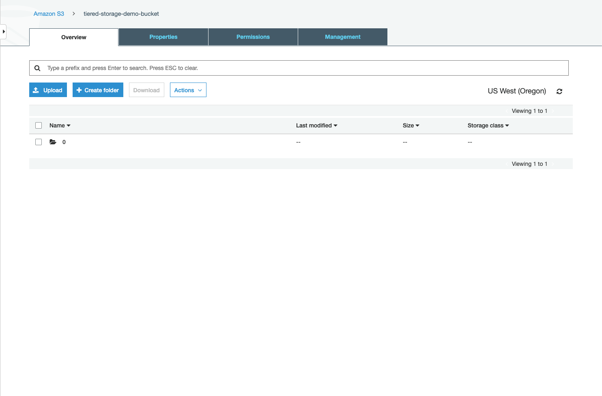
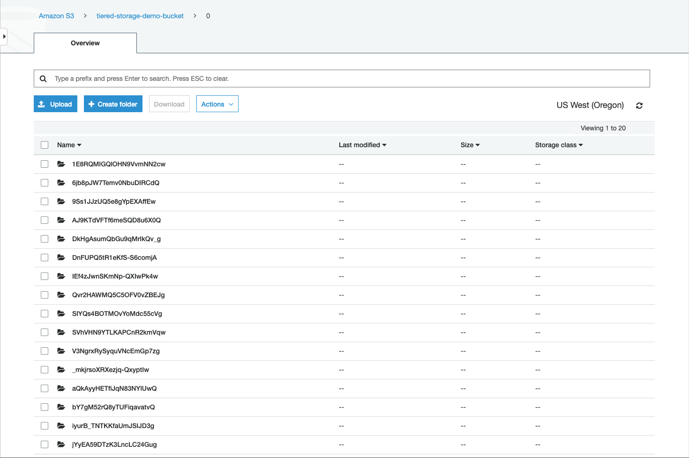
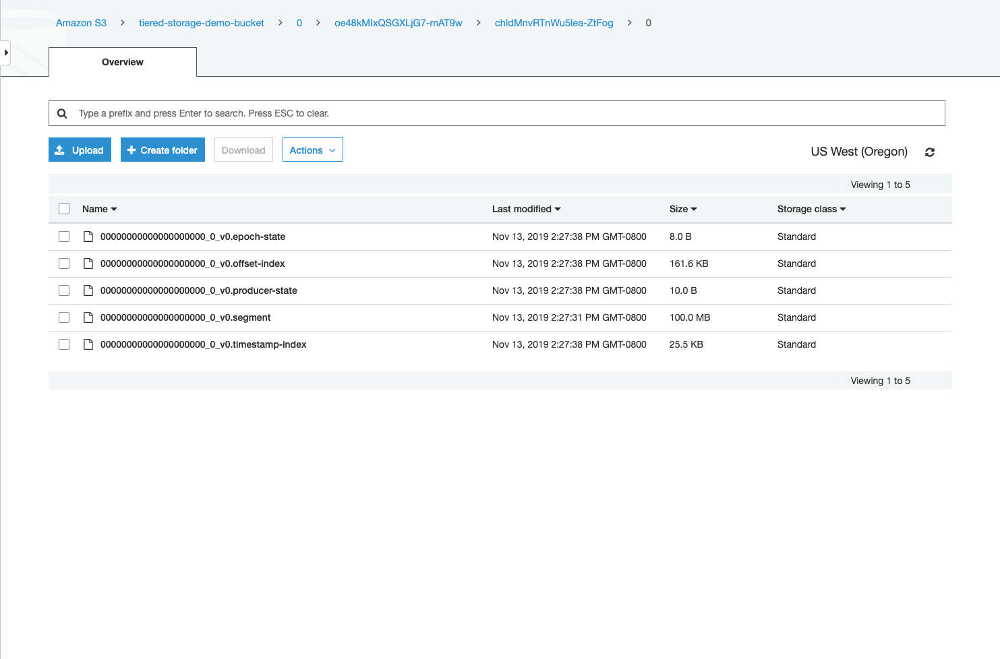

# Overview

This demo showcases Confluent's Tiered Storage capability built into Confluent Server.

In Confluent Platform 5.4, Tiered Storage is in preview and are not intended for production. There are several limitations of the preview since not all features are yet supported. For more information:

* [Link to documentation](https://docs.confluent.io/current/kafka/tiered-storage-preview.html)

## Concepts

* Hotset - The recent log segments that remain on disk. When the hotset time interval expires for a log segment, it will be deleted from disk, but will still exist in object storage.


# Run the Demo

## Requirements

* An S3 bucket and AWS credentials to access it


### Start a Broker with Tiered Storage Enabled

1. Set the following environment variables

```
export AWS_ACCESS_KEY_ID=<YOUR AWS ACCESS KEY>
export AWS_SECRET_ACCESS_KEY=<YOUR AWS SECRET>
export BUCKET_NAME=<S3 BUCKET NAME>
export REGION=<S3 REGION>
```

2. Run docker compose
```
docker-compose up
```


## Create a Topic

To observe the results of the demo within a reasonable time frame, we create a topic with a short hotset (1 minute), a short retention period (10 minutes), and smaller log segments (100 MB). These configurations were passed to the broker through the [docker-compose.yml](docker-compose.yml) file. Messages that are produced to this topic will be uploaded to the specified S3 bucket.

```
docker-compose exec broker kafka-topics \
    --bootstrap-server localhost:9092 \
    --create \
    --topic test-topic \
    --partitions 1
```

## Produce Messages to the Topic

After creating the topic, we should produce enough messages to the topic to ensure that log segments will fill to the 100MB limit and be uploaded to the S3 bucket.

```
docker-compose exec broker kafka-producer-perf-test --topic test-topic \
    --num-records 5000000 \
    --record-size 5000 \
    --throughput -1 \
    --producer-props \
        acks=all \
        bootstrap.servers=localhost:9092 \
        batch.size=8196
```

After a short wait, we should see files beginning to appear in the S3 bucket. You may notice the top directory of "0" appearing first.

<kbd></kbd>

Navigating into the directory, we should see more sub-directories that each correspond to a specific log segment:

<kbd></kbd>

At the bottom of each sub-directory, we should see the files that were uploaded for each log segment:

<kbd></kbd>

If you are monitoring the broker's logs, you may see messages indicating that log segments are being uploaded to S3. Some sample log messages for uploading segments are shown below:

```
Completed UploadInitiate(objectId: 2569b931-7bed-462a-a048-413f27c43ea3, baseOffset: 0, endOffset: 20680]) for VPTViNheT4mUBvqyXT5NTg-test-topic-0 in 3ms (kafka.tier.tasks.archive.ArchiveTask)
...
Uploaded segment for VPTViNheT4mUBvqyXT5NTg-test-topic-0 in 5796ms (kafka.tier.tasks.archive.ArchiveTask)
...
Finalized UploadComplete(2569b931-7bed-462a-a048-413f27c43ea3) for VPTViNheT4mUBvqyXT5NTg-test-topic-0 in 2 ms (kafka.tier.tasks.archive.ArchiveTask)
```


## Consume Messages

Because the topic has a short hotset period, log segments that are uploaded to the S3 bucket will not remain on disk for long. The log segments with the earliest offsets will start to be deleted from disk, since a copy of them resides in object storage. We can still consume these messages that now reside only in the S3 bucket. We can create a consumer that is configured to read messages from the beginning of the topic:

```
docker-compose exec broker kafka-consumer-perf-test --topic test-topic \
    --messages 5000 \
    --threads 1 \
    --broker-list localhost:9092 \
    --timeout 20000 \
    --consumer.config config/consumer.config
```

## Monitor JMX Metrics

It is likely that there is no obvious difference between reading messages delivered from the S3 bucket versus reading messages from log segments on disk. We can query metrics from the broker to verify that the consumer was reading messages delivered from the broker.

```
./scripts/jmx_metrics.sh
```

## Delete the Topic

The log segment files will remain in the S3 bucket for the duration of the topic's retention period, which was configured to 10 minutes for the purposes of this demo. The broker will automatically delete log segments in the S3 bucket when the retention expires.

Alternatively, if we delete the topic from the broker, the broker will delete the topic's log segments from the S3 bucket before the retention period has finished. The broker scans for log segments that need to be deleted on a time interval, which was configured to 5 minutes for this demo (default interval is 3 hours). We can run the following command to delete the topic:

```
docker-compose exec broker kafka-topics \
    --bootstrap-server localhost:9092 \
    --delete \
    --topic test-topic
```

Once the topic is deleted, the broker will begin to delete log segments from the S3 bucket. Deletion may not start immediately, due to the 5 minute time interval. After a short wait, you may notice the topic's log segments disappearing from the S3 bucket.

If you are monitoring the broker's logs, you may see messages indicating that the topic is being deleted from the S3 bucket. Some sample log messages for topic deletion are shown below:

```
Beginning segment deletion for cnHmnjURSwuq_yqRvv6Xow-test-topic-0 (kafka.tier.TierDeletedPartitionsCoordinator)
...
Completed segment deletions for cnHmnjURSwuq_yqRvv6Xow-test-topic-0 (kafka.tier.tasks.delete.DeletionTask)
Completed partition deletion for cnHmnjURSwuq_yqRvv6Xow-test-topic-0 (kafka.tier.tasks.delete.DeletionTask)
Stopping deletion process for cnHmnjURSwuq_yqRvv6Xow-test-topic-0 after task completion (kafka.tier.tasks.delete.DeletionTask)
Completed deleting segments for cnHmnjURSwuq_yqRvv6Xow-test-topic-0 (kafka.tier.TierDeletedPartitionsCoordinator)
```
