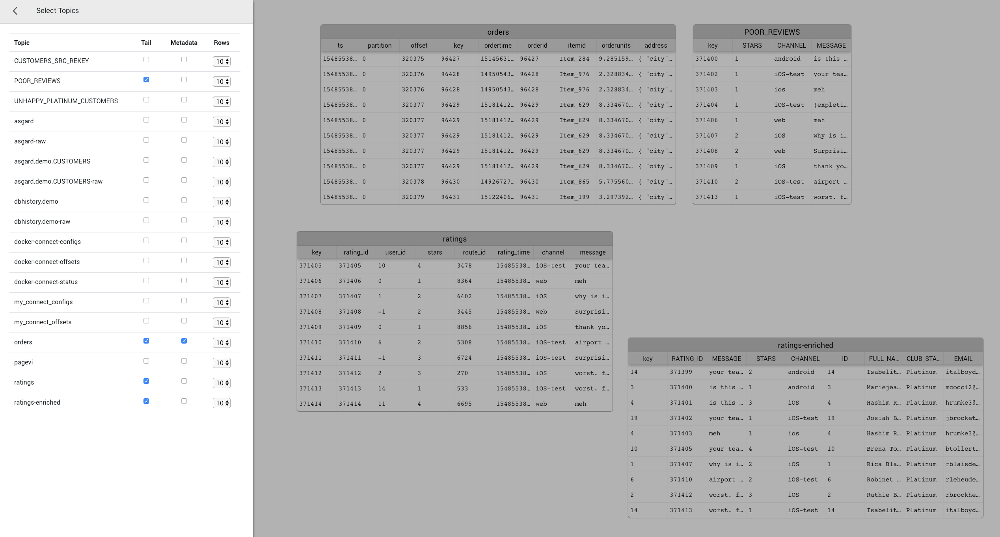

= Topic Tailer - Stream Topics to the Browser
Tom Underhill <tom.underhill@confluent.io>
v1.00, January 26, 2019

Topic Tailer can stream the tail end of multiple topics directly to the browser. Topic Tailer was designed to help with KSQL/KStreams demos or just as an alternative to the console-consumer during developemnt.

== Pre-reqs

* Node.js - https://nodejs.org/en/download/[Download & Install Node.js] and the npm package manager. 
* Confluent Platform 
    ** Zookeeper
    ** Kafka
    ** Schema Registry
    ** Rest Proxy ( optional )

== Installation

[source,bash]
----
npm install
npm start
----
Go here -> http://localhost:8666

== Configuration

Edit config.json to configure the endpoints for the Application, Kafka, Schema Registry and the Rest Proxy 

[source,bash]
----
{
  "APPLICATION_HOSTNAME": "localhost",
  "APPLICATION_PORT": 8666,
  "KAFKA_BROKER": "localhost:9092",
  "SCHEMA_REGISTRY_URL": "http://localhost:8081",
  "REST_PROXY_URL": "http://localhost:8082"
}
----

== Using Topic Tailer

* Toggle the TAB key to open/close the configuration pane
* Choose Topics to tail
* Move table around using drag and drop
* Resize tables and columns
* Toggle the SPACE key to pause/resume tailing topics
* rinse repeat

== FAQ

=== How do Messages get to the Browser?

Kafka -> Node.js(https://github.com/waldophotos/kafka-avro[kafka-avro]) -> Websockets -> Browser

=== How Does Topic Tailer get its List of Topics?

Topic Tailer communicates with the Rest Proxy to determine the list of available topics, if the Rest Proxy is not available it will fall back to the Schema Registry. Each time TAB is pressed, topic data is refreshed via a new call to the Rest Proxy/Schema Registry.

=== Which Deserializes does Topic Tailer Support?

Avro and Json, everthing else gets converted to a string.

=== Can Topic Tailer Consume from the start of a topic?

No, Topic Tailer only consumes the latest messages.

=== Does Topic Tailer Commit Offsets?

No

=== What happens to Messages when Topic Tailer is Paused?

They get thrown away, when Topic Tailer is resumed it will start from the latest offset again.

=== Can I Run Multiple Browser Sessions?

Yes, Topic Tailer creates at most 1 consumer thread per tailed topic. Messages received from a single consumer thread are broadcast to the multiple browser session via websockets.

=== Can Topic Tailer handle 1 million messages per second?

No, it was designed for relatively low throughput demos and testing—However, if you want to warm up your laptop, free to try!

