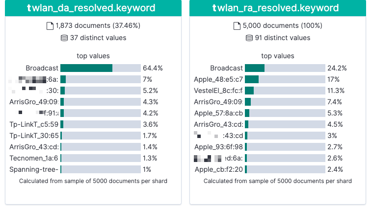

= Learning all about WiFi data with Apache Kafka and friends

I've recently been looking at what's possible with streams of WiFi packet capture ("pcap") data. It was prompted by initially setting up my https://rmoff.net/2020/03/11/streaming-wi-fi-trace-data-from-raspberry-pi-to-apache-kafka-with-confluent-cloud/[Raspberry Pi to capture this pcap data and stream it to Apache Kafka]. Because I was using Confluent Cloud it was easy enough to chuck the data at the Kafka cluster and not need to worry about where or how to run it. I set this running a month ago, and with a few blips in between (my Raspberry Pi is not deployed for _any_ nines of availability!) now have a bunch of raw pcap data that I thought it would be interesting to dig into using Apache Kafka and its surrounding ecosystem. 

At the heart of the data is https://www.wireshark.org/docs/dfref/w/wlan.html[wlan pcap data] captured from `tshark` (the command-line equivilant of Wireshark, which you may be familiar with). The data is stored in JSON on a partitioned Kafka topic, and a sample message looks like this:

[source,javascript]
----
{
  "timestamp": "1584802202655",
  "wlan_fc_type": [ "1" ],
  "wlan_fc_type_subtype": [ "25" ],
  "wlan_radio_channel": [ "1" ],
  "wlan_radio_signal_dbm": [ "-73" ],
  "wlan_radio_duration": [ "32" ],
  "wlan_ra": [ "a4:fc:77:6c:55:0d" ],
  "wlan_ra_resolved": [ "MegaWell_6c:55:0d" ],
  "wlan_ta": [ "48:d3:43:43:cd:d1" ],
  "wlan_ta_resolved": [ "ArrisGro_43:cd:d1" ]
}
----

These messages are coming in at a rate of about 100k per hour, c.30 per second. That's not "Big Data", but it's not insignificant either. 

++++

++++

It certainly gives me a bunch of data that's more than I can grok by just poking around it. I don't really know what I'm looking for in the data quite yet, I'm just interested what I've scooped up in my virtual net. Let's take two approaches, one visual and one numeric, to see if we can get a better handle on the data. 

== Understanding the overall dataset visually

Kibana has a nice tool as part of its Machine Learning feature called *Data Visualizer*. Let's stream our raw wifi packet captures into Elasticsearch and check it out.

[source,bash]
----
curl -i -X PUT -H  "Content-Type:application/json" \
    http://localhost:8083/connectors/sink-elastic-pcap-00/config \
    -d '{
        "connector.class": "io.confluent.connect.elasticsearch.ElasticsearchSinkConnector",
        "topics": "pcap",
        "value.converter": "org.apache.kafka.connect.json.JsonConverter",
        "value.converter.schemas.enable": "false",
        "connection.url": "http://elasticsearch:9200",
        "type.name": "_doc",
        "key.ignore": "true",
        "schema.ignore": "true"
    }'
----

The useful thing here is that we can see characteristics in the data including: 

* Record count per day
+
image::images/kib_doc_count01.png[]
* Which types of packet are most commonly found (`wlan_fc_type`) and the distribution of MAC addresses in senders and receivers
+

image::images/kib_type_count01.png[]

Based on https://books.google.co.uk/books?id=-AdTE9S3kigC&lpg=PA302&ots=Y8C-t2MKpN&dq=wireshark%20wlan.fc.type_subtype%2029%20ack&pg=PA301#v=onepage&q=wireshark%20wlan.fc.type_subtype%2029%20ack&f=false[this published table] we can see the top most common types of packets are: 

* 33% `ACK` (`wlan.fc.type_subtype` == 29)
* 20% `Request to Send` (`wlan.fc.type_subtype` == 27)
* 13% `Probe Request` (`wlan.fc.type_subtype` == 4)
* 11% `NULL Data` (`wlan.fc.type_subtype` == 36)

What about getting these numbers from analysing the data directly from the console, without Elasticsearch? 

== Understanding the overall dataset numerically

With ksqlDB you can use SQL-like queries to inspect, aggregate, and process data. Let's see it in action here with the raw packet capture (pcap) data that we've got. 

First up, I'm going to declare a stream on the topic, and a schema. Since I'm only interested in a couple of fields at this point (the date, and the subtype ranges) I'm just going to omit the rest of the schema, since in full it's fairly beefy

[source,sql]
----
CREATE STREAM pcap_raw_00 (timestamp BIGINT, 
                           wlan_fc_type_subtype ARRAY<INT>) 
    WITH (KAFKA_TOPIC='pcap', 
          VALUE_FORMAT='JSON', 
          TIMESTAMP='timestamp');
----

Note that I am telling ksqlDB to take the `timestamp` field from the payload as the timestamp of the message (`WITH … TIMESTAMP='timestamp'`). If I didn't do this then it would default to the timestamp of the Kafka message as held in the message's metadata, which is not what I want in this case. 

With the stream created, I tell ksqlDB to process data from the beginning of the topic: 

[source,sql]
----
SET 'auto.offset.reset' = 'earliest';
----

and then query it using SQL: 

[source,sql]
----
SELECT wlan_fc_type_subtype[1] AS SUBTYPE,
       COUNT(*) AS PACKET_COUNT,
       TIMESTAMPTOSTRING(MIN(ROWTIME),'yyyy-MM-dd HH:mm:ss','Europe/London') AS MIN_TS,
       TIMESTAMPTOSTRING(MAX(ROWTIME),'yyyy-MM-dd HH:mm:ss','Europe/London') AS MAX_TS
FROM   pcap_raw_00 WHERE ROWTIME < (UNIX_TIMESTAMP() - 1800000)
GROUP BY wlan_fc_type_subtype[1]
EMIT CHANGES;
----

Here we're aggregating by subtype for all messages received up until the last half hour, but you'll notice that it's calculating the numbers from the start of the topic and continually updating as newer messages are processed:

++++

++++

Instead, let's persist this aggregate to a table: 

[source,sql]
----
SET 'auto.offset.reset' = 'earliest';
CREATE TABLE PCAP_STATS WITH (VALUE_FORMAT='AVRO') AS
SELECT wlan_fc_type_subtype[1] AS SUBTYPE,
       COUNT(*) AS PACKET_COUNT,
       TIMESTAMPTOSTRING(MIN(ROWTIME),'yyyy-MM-dd HH:mm:ss','Europe/London') AS MIN_TS,
       TIMESTAMPTOSTRING(MAX(ROWTIME),'yyyy-MM-dd HH:mm:ss','Europe/London') AS MAX_TS
FROM   pcap_raw_00 WHERE ROWTIME < (UNIX_TIMESTAMP() - 1800000)
GROUP BY wlan_fc_type_subtype[1]
EMIT CHANGES;
----

Now there's an actual materialised view of this data, backed by a persisted Kafka topic: 

[source,sql]
----
ksql> SHOW TABLES;

 Table Name | Kafka Topic | Format | Windowed
----------------------------------------------
 PCAP_STATS | PCAP_STATS  | AVRO   | false
----------------------------------------------
----

This table we can query either as a "push" query showing all updates as they arrive: 

++++

++++

or query the value directly for any of the subtypes: 

[source,sql]
----
ksql> SELECT SUBTYPE, PACKET_COUNT, MIN_TS, MAX_TS FROM PCAP_STATS WHERE ROWKEY = 4 ;
+----------+-------------+---------------------+---------------------+
|SUBTYPE   |PACKET_COUNT |MIN_TS               |MAX_TS               |
+----------+-------------+---------------------+---------------------+
|4         |48975        |2020-02-28 22:45:48  |2020-03-07 00:49:24  |
Query terminated
----

Since it's just a Kafka topic, you can persist this aggregate to a database, using the message key to ensure that values update in-place. We'll use Kafka Connect like we did above for Elasticsearch, but here using ksqlDB as the interface:

[source,sql]
----
CREATE SINK CONNECTOR SINK_POSTGRES_PCAP_STATS_00 WITH (
    'connector.class'     = 'io.confluent.connect.jdbc.JdbcSinkConnector',
    'connection.url'      = 'jdbc:postgresql://postgres:5432/',
    'connection.user'     = 'postgres',
    'connection.password' = 'postgres',
    'topics'              = 'PCAP_STATS',
    'key.converter'       = 'org.apache.kafka.connect.storage.StringConverter',
    'auto.create'         = 'true',
    'auto.evolve'         = 'true',
    'insert.mode'         = 'upsert',
    'pk.mode'             = 'record_value',
    'pk.fields'           = 'SUBTYPE',
    'table.name.format'   = '${topic}'
);
----

Now as each message arrives in the source Kafka topic, it's incorporated in the aggregation by ksqlDB and the resulting change to the aggregate pushed to Postgres, where each key is updated in-place: 

++++

++++

== Splitting the pcap data into separate topics

Knowing from our above analysis the types of data that we've got, let's use ksqlDB to split them out into separate topics as we'll want to analyse them further separately and each may well have different schema. 

To start with, I'll declare a schema which covers fields across all types of packet: 

[source,sql]
----
CREATE STREAM pcap_raw (timestamp                    BIGINT, 
                        wlan_fc_type_subtype         ARRAY<INT>,
                        wlan_radio_channel           ARRAY<INT>,
                        wlan_radio_signal_percentage ARRAY<VARCHAR>,
                        wlan_radio_signal_dbm        ARRAY<DOUBLE>,
                        wlan_radio_duration		  	 ARRAY<INT>,
                        wlan_ra						 ARRAY<VARCHAR>,
                        wlan_ra_resolved			 ARRAY<VARCHAR>,
                        wlan_da						 ARRAY<VARCHAR>,
                        wlan_da_resolved			 ARRAY<VARCHAR>,
                        wlan_ta						 ARRAY<VARCHAR>,
                        wlan_ta_resolved			 ARRAY<VARCHAR>,
                        wlan_sa						 ARRAY<VARCHAR>,
                        wlan_sa_resolved			 ARRAY<VARCHAR>,
                        wlan_staa					 ARRAY<VARCHAR>,
                        wlan_staa_resolved			 ARRAY<VARCHAR>,
                        wlan_tagged_all				 ARRAY<VARCHAR>,
                        wlan_tag_vendor_data		 ARRAY<VARCHAR>,
                        wlan_tag_vendor_oui_type	 ARRAY<VARCHAR>,
                        wlan_tag_oui				 ARRAY<VARCHAR>,
                        wlan_country_info_code		 ARRAY<VARCHAR>,
                        wps_device_name				 ARRAY<VARCHAR>,
                        wlan_ssid					 ARRAY<VARCHAR>) 
    WITH (KAFKA_TOPIC='pcap', 
        VALUE_FORMAT='JSON', 
        TIMESTAMP='timestamp');
----

Now we can pull out records of different types into new streams, and take the opportunity to serialise the resulting data to Avro. 

[source,sql]
----
SET 'auto.offset.reset' = 'earliest';
CREATE STREAM PCAP_PROBE  WITH (VALUE_FORMAT='AVRO') AS SELECT * FROM PCAP_RAW WHERE WLAN_FC_TYPE_SUBTYPE[1]=4;
CREATE STREAM PCAP_BEACON WITH (VALUE_FORMAT='AVRO') AS SELECT * FROM PCAP_RAW WHERE WLAN_FC_TYPE_SUBTYPE[1]=8;
CREATE STREAM PCAP_RTS    WITH (VALUE_FORMAT='AVRO') AS SELECT * FROM PCAP_RAW WHERE WLAN_FC_TYPE_SUBTYPE[1]=27;
CREATE STREAM PCAP_CTS    WITH (VALUE_FORMAT='AVRO') AS SELECT * FROM PCAP_RAW WHERE WLAN_FC_TYPE_SUBTYPE[1]=28;
CREATE STREAM PCAP_ACK    WITH (VALUE_FORMAT='AVRO') AS SELECT * FROM PCAP_RAW WHERE WLAN_FC_TYPE_SUBTYPE[1]=29;
CREATE STREAM PCAP_NULL   WITH (VALUE_FORMAT='AVRO') AS SELECT * FROM PCAP_RAW WHERE WLAN_FC_TYPE_SUBTYPE[1]=36;
----

If we had a partition key strategy that we wanted to apply we could do this here too by specifying `PARTITION BY`—but since we're still at the early stages of analysis we'll leave the key unset for now (which means that messages will be distributed evenly across all partitions). We could also opt to drop unused columns from the schema for particular message types by replacing `SELECT *` with a specific projection of required columns. 

You'll observe that this creates and populates new Kafka topics: 

[source,sql]
----
ksql> SHOW TOPICS;

 Kafka Topic                            | Partitions | Partition Replicas
--------------------------------------------------------------------------
 PCAP_ACK                               | 12         | 3
 PCAP_BEACON                            | 12         | 3
 PCAP_CTS                               | 12         | 3
 PCAP_NULL                              | 12         | 3
 PCAP_PROBE                             | 12         | 3
 PCAP_RTS                               | 12         | 3
 PCAP_STATS                             | 12         | 3
 …
----

== Analysing WiFi probe requests

Mobile devices send probe requests to see what Access Points (AP) are available, and are an interesting source of analysis. Kibana is a great tool here for "slicing and dicing" the data to explore it. By adding a filter for the subtype we can easily pick out the fields that have got relevant data: 

image::images/kib_probe_01.png[]

* `wlan_sa` is the raw source MAC address, whilst `wlan_sa_resolved` includes in some cases the manufacturer's prefix
* Most requests are looking for any AP but some are for a specific wireless network (`wlan_ssid`)

=== Enriching pcap data with lookups

So in amongst all this "digital exhaust" is going to be a load of devices from within my house, plus others externally. Wouldn't it be nice to be able to identify them? This is where the real power of ksqlDB comes in, because I can use it to join a stream of events (pcap data) with lookup data from elsewhere. I've got a list of known MAC addresses for my household devices that I can draw from my router where they're stored on MongoDB. Let's pull that data into Kafka through ksqlDB: 

[source,sql]
----
CREATE SOURCE CONNECTOR SOURCE_MONGODB_UNIFI_01 WITH (
    'connector.class' = 'io.debezium.connector.mongodb.MongoDbConnector',
    'mongodb.hosts' = 'rs0/mongodb:27017',
    'mongodb.name' = 'unifi',
    'collection.whitelist' = 'ace.device, ace.user'
);
----

With this data in Kafka we can use some of the data wrangling tricks to get two ksqlDB tables of devices (switches, APs, routers) and users (i.e. wifi clients - mobiles, laptops, etc). 

[source,sql]
----
-- Model source topics
CREATE STREAM DEVICES_RAW WITH (KAFKA_TOPIC='unifi.ace.device', VALUE_FORMAT='AVRO');
CREATE STREAM USERS_RAW   WITH (KAFKA_TOPIC='unifi.ace.user',   VALUE_FORMAT='AVRO');

-- Extract device data fields from JSON payload
SET 'auto.offset.reset' = 'earliest';
CREATE STREAM ALL_DEVICES WITH (PARTITIONS=12,
                                KAFKA_TOPIC='all_devices_00') AS
        SELECT  'ace.device'                       AS SOURCE,
                EXTRACTJSONFIELD(AFTER ,'$.mac')   AS MAC, 
                EXTRACTJSONFIELD(AFTER ,'$.ip')    AS IP, 
                EXTRACTJSONFIELD(AFTER ,'$.name')  AS NAME, 
                EXTRACTJSONFIELD(AFTER ,'$.model') AS MODEL, 
                EXTRACTJSONFIELD(AFTER ,'$.type')  AS TYPE,
                CAST('0' AS BOOLEAN)               AS IS_GUEST
        FROM    DEVICES_RAW 
        PARTITION BY EXTRACTJSONFIELD(AFTER ,'$.mac')
        EMIT CHANGES;

-- Extract user (client device) data from JSON payload with some 
--  wrangling to handle null/empty fields etc.
-- Note that this is an "INSERT INTO" and thus in effect is a UNION of
--  the two source topics with some wrangling to align the schemas. 
SET 'auto.offset.reset' = 'earliest';
INSERT INTO ALL_DEVICES
      SELECT 'ace.user' AS SOURCE,
             EXTRACTJSONFIELD(AFTER ,'$.mac') AS MAC, 
             '' AS IP,
             CASE WHEN EXTRACTJSONFIELD(AFTER ,'$.name') IS NULL THEN 
                CASE WHEN EXTRACTJSONFIELD(AFTER ,'$.hostname') IS NULL THEN
                    CASE WHEN CAST(EXTRACTJSONFIELD(AFTER ,'$.is_guest') AS BOOLEAN) THEN 
                        'guest_' 
                    ELSE 
                        'nonguest_' 
                    END + EXTRACTJSONFIELD(AFTER ,'$.oui') 
                ELSE EXTRACTJSONFIELD(AFTER ,'$.hostname') 
                END
            ELSE 
                CASE WHEN EXTRACTJSONFIELD(AFTER ,'$.hostname') IS NULL THEN 
                    EXTRACTJSONFIELD(AFTER ,'$.name') 
                ELSE 
                    EXTRACTJSONFIELD(AFTER ,'$.name') + ' (' + EXTRACTJSONFIELD(AFTER ,'$.hostname') + ')'
                END
            END AS NAME,
            EXTRACTJSONFIELD(AFTER ,'$.oui')      AS MODEL,
            '' AS TYPE,
            CAST(EXTRACTJSONFIELD(AFTER ,'$.is_guest') AS BOOLEAN) AS IS_GUEST
        FROM USERS_RAW 
        WHERE EXTRACTJSONFIELD(AFTER ,'$.oui')!='Ubiquiti'
        PARTITION BY EXTRACTJSONFIELD(AFTER ,'$.mac')
        EMIT CHANGES;

-- Declare a materialised ksqlDB table over the resulting combined stream
SET 'auto.offset.reset' = 'earliest';
CREATE TABLE DEVICES AS 
    SELECT MAC,
           LATEST_BY_OFFSET(SOURCE) AS SOURCE,
           LATEST_BY_OFFSET(NAME) AS NAME,
           LATEST_BY_OFFSET(IS_GUEST) AS IS_GUEST
    FROM   ALL_DEVICES
    GROUP BY MAC;
           
----

To get more background on what these steps do check out https://rmoff.net/2019/12/20/analysing-network-behaviour-with-ksqldb-and-mongodb/[this article].

We've built a lookup table which because we've used an aggregation (`LATEST_BY_OFFSET`) is materialised. This means that as well as the usual ksqlDB "push query" of streaming updates as the data changes, we can also query the state directly (known as a "pull query"): 

[source,sql]
----
SELECT MAC, SOURCE, NAME, IS_GUEST FROM DEVICES WHERE ROWKEY='88:ae:07:29:e6:75' ;
----

[source,sql]
----
+------------------+----------+---------------+---------+
|MAC               |SOURCE    |NAME           |IS_GUEST |
+------------------+----------+---------------+---------+
|88:ae:07:29:e6:75 |ace.user  |rmoff-ipad-pro |false    |
Query terminated
----

With this lookup data in place and available through ksqlDB, we can join it to the stream of pcap probe data, so instead of this: 

[source,sql]
----
SELECT TIMESTAMPTOSTRING(ROWTIME,'yyyy-MM-dd HH:mm:ss','Europe/London') AS PCAP_TS,
       WLAN_SA[1] AS SOURCE_ADDRESS, 
       WLAN_SA_RESOLVED[1] AS SOURCE_ADDRESS_RESOLVED, 
       WLAN_DA[1] AS DESTINATION_ADDRESS, 
       WLAN_DA_RESOLVED[1]  AS DESTINATION_ADDRESS_RESOLVED, 
       WLAN_RADIO_SIGNAL_DBM[1] AS RADIO_SIGNAL_DBM, 
       WLAN_SSID[1] AS SSID 
  FROM PCAP_PROBE 
  EMIT CHANGES 
  LIMIT 5;
----

[source,sql]
----
+--------------------+------------------+------------------------+--------------------+-----------------------------+-----------------+------+
|PCAP_TS             |SOURCE_ADDRESS    |SOURCE_ADDRESS_RESOLVED |DESTINATION_ADDRESS |DESTINATION_ADDRESS_RESOLVED |RADIO_SIGNAL_DBM |SSID  |
+--------------------+------------------+------------------------+--------------------+-----------------------------+-----------------+------+
|2020-03-31 13:07:14 |f0:c3:71:2a:04:20 |f0:c3:71:2a:04:20       |ff:ff:ff:ff:ff:ff   |Broadcast                    |-75.0            |RNM0  |
|2020-03-31 13:09:41 |40:b4:cd:58:40:8f |AmazonTe_58:40:8f       |ff:ff:ff:ff:ff:ff   |Broadcast                    |-75.0            |      |
|2020-03-31 12:47:31 |e8:b2:ac:6f:3f:a8 |Apple_6f:3f:a8          |ff:ff:ff:ff:ff:ff   |Broadcast                    |-79.0            |      |
|2020-03-31 13:12:24 |f0:c3:71:2a:04:20 |f0:c3:71:2a:04:20       |ff:ff:ff:ff:ff:ff   |Broadcast                    |-81.0            |      |
|2020-03-31 13:14:31 |e8:b2:ac:6f:3f:a8 |Apple_6f:3f:a8          |ff:ff:ff:ff:ff:ff   |Broadcast                    |-77.0            |      |
Limit Reached
Query terminated
----

We can get this: 

[source,sql]
----
SELECT TIMESTAMPTOSTRING(P.ROWTIME,'yyyy-MM-dd HH:mm:ss','Europe/London') AS PCAP_TS,
       WLAN_SA[1] AS SOURCE_ADDRESS, 
       NAME AS DEVICE_NAME, 
       CASE WHEN IS_GUEST IS NULL THEN FALSE ELSE CASE WHEN IS_GUEST THEN FALSE ELSE TRUE END END AS IS_KNOWN_DEVICE,
       WLAN_SA_RESOLVED[1] AS SOURCE_ADDRESS_RESOLVED, 
       WLAN_DA[1] AS DESTINATION_ADDRESS, 
       WLAN_DA_RESOLVED[1]  AS DESTINATION_ADDRESS_RESOLVED, 
       WLAN_RADIO_SIGNAL_DBM[1] AS RADIO_SIGNAL_DBM, 
       WLAN_SSID[1] AS SSID
  FROM PCAP_PROBE P
        LEFT JOIN 
        DEVICES D
        ON P.WLAN_SA[1] = D.ROWKEY
  EMIT CHANGES 
  LIMIT 5;
----

[source,sql]
----
+--------------------+------------------+---------------+----------------+------------------------+--------------------+-----------------------------+-----------------+-------------+
|PCAP_TS             |SOURCE_ADDRESS    |DEVICE_NAME    |IS_KNOWN_DEVICE |SOURCE_ADDRESS_RESOLVED |DESTINATION_ADDRESS |DESTINATION_ADDRESS_RESOLVED |RADIO_SIGNAL_DBM |SSID         |
+--------------------+------------------+---------------+----------------+------------------------+--------------------+-----------------------------+-----------------+-------------+
|2020-03-31 13:15:49 |78:67:d7:48:e5:c7 |null           |false           |Apple_48:e5:c7          |ff:ff:ff:ff:ff:ff   |Broadcast                    |-81.0            |VM9654567    |
|2020-03-23 18:12:12 |e8:b2:ac:6f:3f:a8 |Gillians-iPad  |true            |Apple_6f:3f:a8          |ff:ff:ff:ff:ff:ff   |Broadcast                    |-77.0            |             |
|2020-03-31 19:59:03 |62:45:b6:c6:7e:03 |null           |false           |62:45:b6:c6:7e:03       |ff:ff:ff:ff:ff:ff   |Broadcast                    |-77.0            |             |
|2020-03-31 22:53:25 |44:65:0d:e0:94:66 |Robin's Kindle |true            |AmazonTe_e0:94:66       |ff:ff:ff:ff:ff:ff   |Broadcast                    |-63.0            |RNM0         |
|2020-03-31 20:25:00 |30:07:4d:91:96:56 |null           |false           |SamsungE_91:96:56       |ff:ff:ff:ff:ff:ff   |Broadcast                    |-79.0            |VodafoneWiFi |
Limit Reached
Query terminated
----

Now we can write this enriched data back into Kafka and from there to Elasticsearch: 

[source,sql]
----
SET 'auto.offset.reset' = 'earliest';
CREATE STREAM PCAP_PROBE_ENRICHED 
    WITH (KAFKA_TOPIC='pcap_probe_enriched_03') AS
    SELECT WLAN_SA[1] AS SOURCE_ADDRESS, 
        NAME AS SOURCE_DEVICE_NAME, 
        CASE WHEN IS_GUEST IS NULL THEN 
                    FALSE 
            ELSE 
                CASE WHEN IS_GUEST THEN 
                    FALSE 
                ELSE 
                    TRUE 
                END 
            END AS IS_KNOWN_DEVICE,
        WLAN_SA_RESOLVED[1] AS SOURCE_ADDRESS_RESOLVED, 
        WLAN_DA[1] AS DESTINATION_ADDRESS, 
        WLAN_DA_RESOLVED[1]  AS DESTINATION_ADDRESS_RESOLVED, 
        WLAN_RADIO_SIGNAL_DBM[1] AS RADIO_SIGNAL_DBM, 
        WLAN_SSID[1] AS SSID,
        WLAN_TAG_VENDOR_DATA,
        WLAN_TAG_VENDOR_OUI_TYPE,
        WLAN_TAG_OUI
    FROM PCAP_PROBE P
            LEFT JOIN 
            DEVICES D
            ON P.WLAN_SA[1] = D.ROWKEY
    EMIT CHANGES;

CREATE SINK CONNECTOR SINK_ELASTIC_PCAP_ENRICHED_03 WITH (
    'connector.class' = 'io.confluent.connect.elasticsearch.ElasticsearchSinkConnector',
    'connection.url' = 'http://elasticsearch:9200',
    'topics' = 'pcap_probe_enriched_03',
    'type.name' = '_doc',
    'key.ignore' = 'true',
    'schema.ignore' = 'true',
    'key.converter' = 'org.apache.kafka.connect.storage.StringConverter',
    'transforms'= 'ExtractTimestamp',
    'transforms.ExtractTimestamp.type'= 'org.apache.kafka.connect.transforms.InsertField$Value',
    'transforms.ExtractTimestamp.timestamp.field' = 'PCAP_TS',
    'flush.timeout.ms'=  60000, 
    'batch.size'= 200000,
    'linger.ms'= 1000,
    'read.timeout.ms'= 60000
);
----

=== Building Wi-Fi Probe pcap statistics 

Using this enriched data we can build ourselves some stateful aggregations to understand more about the patterns within it:

[source,sql]
----
SET 'auto.offset.reset' = 'earliest';
CREATE TABLE PCAP_PROBE_STATS_BY_SOURCE_DEVICE AS 
    SELECT CASE WHEN SOURCE_DEVICE_NAME IS NULL THEN 
                SOURCE_ADDRESS_RESOLVED 
            ELSE 
                SOURCE_DEVICE_NAME END			AS SOURCE, 
           LATEST_BY_OFFSET(SOURCE_ADDRESS)		AS LATEST_SOURCE_ADDRESS,
           LATEST_BY_OFFSET(IS_KNOWN_DEVICE)	AS LATEST_IS_KNOWN_DEVICE,
           COUNT(*)								AS PCAP_PROBES, 
           MIN(ROWTIME)							AS EARLIEST_PROBE,
           MAX(ROWTIME)							AS LATEST_PROBE,
           MIN(RADIO_SIGNAL_DBM)				AS MIN_RADIO_SIGNAL_DBM,
           MAX(RADIO_SIGNAL_DBM)				AS MAX_RADIO_SIGNAL_DBM,
           AVG(RADIO_SIGNAL_DBM)				AS AVG_RADIO_SIGNAL_DBM,
           LATEST_BY_OFFSET(SSID)				AS LATEST_SSID_PROBED,
           COLLECT_SET(SSID)					AS PROBED_SSIDS,
           COUNT_DISTINCT(SSID)					AS UNIQUE_SSIDS_PROBED,
           COUNT_DISTINCT(DESTINATION_ADDRESS)	AS UNIQUE_DESTINATION_ADDRESSES
    FROM   PCAP_PROBE_ENRICHED
    GROUP BY CASE WHEN SOURCE_DEVICE_NAME IS NULL THEN SOURCE_ADDRESS_RESOLVED ELSE SOURCE_DEVICE_NAME END;           
----

Under the covers, this aggregation is materialised by ksqlDB, which means that we can query the state directly: 

[source,sql]
----
SELECT SOURCE,
       PCAP_PROBES, 
       LATEST_SOURCE_ADDRESS,
       LATEST_IS_KNOWN_DEVICE,
       TIMESTAMPTOSTRING(EARLIEST_PROBE,'yyyy-MM-dd HH:mm:ss','Europe/London') AS EARLIEST_PROBE, 
       TIMESTAMPTOSTRING(LATEST_PROBE,'yyyy-MM-dd HH:mm:ss','Europe/London') AS LATEST_PROBE, 
       PROBED_SSIDS, 
       UNIQUE_SSIDS_PROBED 
  FROM PCAP_PROBE_STATS_BY_SOURCE_DEVICE 
 WHERE ROWKEY='asgard03';
----

[source,sql]
----
+---------+------------+----------------------+-----------------------+--------------------+--------------------+---------------------------------+--------------------+
|SOURCE   |PCAP_PROBES |LATEST_SOURCE_ADDRESS |LATEST_IS_KNOWN_DEVICE |EARLIEST_PROBE      |LATEST_PROBE        |PROBED_SSIDS                     |UNIQUE_SSIDS_PROBED |
+---------+------------+----------------------+-----------------------+--------------------+--------------------+---------------------------------+--------------------+
|asgard03 |2322        |a4:83:e7:4e:39:15     |true                   |2020-03-23 17:46:18 |2020-04-08 06:39:45 |[, RNM0, FULLERS, CrossCountryWiF|12                  |
|         |            |                      |                       |                    |                    |i, Escape Lounge WiFi, QConLondon|                    |
|         |            |                      |                       |                    |                    |2020, Marriott_PUBLIC, loews_conf|                    |
|         |            |                      |                       |                    |                    |, Loews, FreePubWiFi, skyclub, _T|                    |
|         |            |                      |                       |                    |                    |he Wheatley Free WiFi]           |                    |
Query terminated
----

This is for my Mac laptop, and you can see various public and private networks being looked for. The names of these match those on my known WiFi networks settings

image::images/mac_wifi01.png[]

ksqlDB is proving pretty handy here. We've taken a raw stream of data, and using a couple of SQL statements built a stateful, scalable, aggregation that we can query in place from the ksqlDB prompt. We can also use the REST API to query it programatically, for example to see when a given device last ran a probe:

[source,bash]
----
$ curl -s -XPOST "http://localhost:8088/query" \
     -H "Content-Type: application/vnd.ksql.v1+json; charset=utf-8" \
     -d '{"ksql":"SELECT TIMESTAMPTOSTRING(LATEST_PROBE,'\''yyyy-MM-dd HH:mm:ss'\'','\''Europe/London'\'') AS LATEST_PROBE FROM PCAP_PROBE_STATS_BY_SOURCE_DEVICE WHERE ROWKEY='\''asgard03'\'';"}' |jq '.[].row.columns'

[
  "2020-04-08 06:39:45"
]
----

And of course, we can take the data that ksqlDB is aggregating for us and push it down to one, or more, target systems for further analysis: 

* Elasticsearch
+
[source,sql]
----
CREATE SINK CONNECTOR SINK_ELASTIC_PCAP_STATS_01 WITH (
  'connector.class' 							= 'io.confluent.connect.elasticsearch.ElasticsearchSinkConnector',
  'connection.url' 								= 'http://elasticsearch:9200',
  'topics' 										= 'PCAP_PROBE_STATS_BY_SOURCE_DEVICE',
  'type.name' 									= '_doc',
  'key.ignore' 									= 'false',
  'schema.ignore' 								= 'true',
  'transforms' 									= 'appendTimestampToColName',
  'transforms.appendTimestampToColName.type' 	= 'org.apache.kafka.connect.transforms.ReplaceField$Value',
  'transforms.appendTimestampToColName.renames' = 'EARLIEST_PROBE:EARLIEST_PROBE_TS,LATEST_PROBE:LATEST_PROBE_TS',
  'key.converter' 								= 'org.apache.kafka.connect.storage.StringConverter'
);
----
+
** `'key.ignore' = 'false'` which means that it takes the key of the Kafka message (which is set in the `CREATE TABLE` above to the `SOURCE` field) and so will update documents in place when changes occur in the source table.
** A Single Message Transform (SMT) is used to append `_TS` to the date fields. I created a document mapping template in Elasticsearch to match any field named `*_TS` as a date, which these two fields are (but stored as `BIGINT` epoch in ksqlDB)

* Postgres
+
[source,sql]
----
CREATE SINK CONNECTOR SINK_POSTGRES_PCAP_PROBE_STATS_00 WITH (
    'connector.class'     = 'io.confluent.connect.jdbc.JdbcSinkConnector',
    'connection.url'      = 'jdbc:postgresql://postgres:5432/',
    'connection.user'     = 'postgres',
    'connection.password' = 'postgres',
    'topics'              = 'PCAP_PROBE_STATS_BY_SOURCE_DEVICE',
    'key.converter'       = 'org.apache.kafka.connect.storage.StringConverter',
    'auto.create'         = 'true',
    'auto.evolve'         = 'true',
    'insert.mode'         = 'upsert',
    'pk.mode'             = 'record_value',
    'pk.fields'           = 'SOURCE',
    'table.name.format'   = '${topic}',
    'transforms'          = 'dropArray,setTimestampType0,setTimestampType1',
    'transforms.dropArray.type' = 'org.apache.kafka.connect.transforms.ReplaceField$Value',
    'transforms.dropArray.blacklist' = 'PROBED_SSIDS',
    'transforms.setTimestampType0.type'= 'org.apache.kafka.connect.transforms.TimestampConverter$Value',
    'transforms.setTimestampType0.field'= 'EARLIEST_PROBE',
    'transforms.setTimestampType0.target.type' ='Timestamp',
    'transforms.setTimestampType1.type'= 'org.apache.kafka.connect.transforms.TimestampConverter$Value',
    'transforms.setTimestampType1.field'= 'LATEST_PROBE',
    'transforms.setTimestampType1.target.type' ='Timestamp'
);
----
+
** Since the JDBC sink doesn't support writing array objects to Postgres (you'll get the error `org.apache.kafka.connect.errors.ConnectException: null (ARRAY) type doesn't have a mapping to the SQL database column type`) we just drop it here using the `ReplaceField` SMT.
** The `TimestampConverter` Single Message Transform is used to set the type of the two timestamp fields so that they're ingested into Postgres as timestamps (and not BIGINT)
** To get the rows updating in place as the source table in ksqlDB changes `'insert.mode'` is set to `upsert`. The primary key on the target table in Postgres is set to be built from the value of `SOURCE` (`pk.fields`) in the message value (`record_value`). 
+
[source,sql]
----
postgres=# \d "PCAP_PROBE_STATS_BY_SOURCE_DEVICE"
                 Table "public.PCAP_PROBE_STATS_BY_SOURCE_DEVICE"
            Column            |       Type       | Collation | Nullable | Default
------------------------------+------------------+-----------+----------+---------
 SOURCE                       | text             |           | not null |
…
Indexes:
    "PCAP_PROBE_STATS_BY_SOURCE_DEVICE_pkey" PRIMARY KEY, btree ("SOURCE")
----
+
Since `SOURCE` is also the record _key_ in the Kafka message you could use `pk.mode` = `record_key` here, but it would still need to be materialised onto the Postgres table, and so you'd end up with two fields in Postgres with the same value (`SOURCE`, plus whatever you set `pk.fields` to as in this context it would be used by the connector as the _name of the field in Postgres_ to store the Kafka message key in):
+
[source,sql]
----
'pk.mode'             = 'record_key',
'pk.fields'           = 'PK',
----
+
[source,sql]
----
postgres=# \d "PCAP_PROBE_STATS_BY_SOURCE_DEVICE"
                Table "public.PCAP_PROBE_STATS_BY_SOURCE_DEVICE"
            Column            |       Type       | Collation | Nullable | Default
------------------------------+------------------+-----------+----------+---------
 SOURCE                       | text             |           |          |
…
 PK                           | text             |           | not null |
Indexes:
    "PCAP_PROBE_STATS_BY_SOURCE_DEVICE_pkey" PRIMARY KEY, btree ("PK")

postgres=# SELECT "SOURCE","PK" FROM "PCAP_PROBE_STATS_BY_SOURCE_DEVICE";
      SOURCE       |        PK
-------------------+-------------------
 ea:28:50:4d:44:fb | ea:28:50:4d:44:fb
 12:c3:06:85:53:96 | 12:c3:06:85:53:96
…
(3 rows)
----

But if we have a poke around in the data a bit more we'll notice there are *other* devices looking for the same networks. Some of these are generic public networks, but others are pretty specific (`QConLondon2020`): 

[source,sql]
----
SELECT SOURCE,
       PCAP_PROBES,
       LATEST_SOURCE_ADDRESS,
       LATEST_IS_KNOWN_DEVICE,
       TIMESTAMPTOSTRING(EARLIEST_PROBE,'yyyy-MM-dd HH:mm:ss','Europe/London') AS EARLIEST_PROBE,
       TIMESTAMPTOSTRING(LATEST_PROBE,'yyyy-MM-dd HH:mm:ss','Europe/London') AS LATEST_PROBE,
       PROBED_SSIDS,
       UNIQUE_SSIDS_PROBED
  FROM PCAP_PROBE_STATS_BY_SOURCE_DEVICE
 WHERE ARRAY_CONTAINS(PROBED_SSIDS,'QConLondon2020') EMIT CHANGES;
----

[source,sql]
----
+------------------+------------+----------------------+-----------------------+--------------------+--------------------+---------------------------------+--------------------+
|SOURCE            |PCAP_PROBES |LATEST_SOURCE_ADDRESS |LATEST_IS_KNOWN_DEVICE |EARLIEST_PROBE      |LATEST_PROBE        |PROBED_SSIDS                     |UNIQUE_SSIDS_PROBED |
+------------------+------------+----------------------+-----------------------+--------------------+--------------------+---------------------------------+--------------------+
|4a:f6:d0:79:a2:69 |4           |4a:f6:d0:79:a2:69     |false                  |2020-04-02 18:06:43 |2020-04-02 18:06:43 |[, loews_conf, skyclub, QConLondo|4                   |
|                  |            |                      |                       |                    |                    |n2020]                           |                    |
|asgard03          |2322        |a4:83:e7:4e:39:15     |true                   |2020-03-23 17:46:18 |2020-04-08 06:39:45 |[, RNM0, FULLERS, CrossCountryWiF|12                  |
|                  |            |                      |                       |                    |                    |i, Escape Lounge WiFi, QConLondon|                    |
|                  |            |                      |                       |                    |                    |2020, Marriott_PUBLIC, loews_conf|                    |
|                  |            |                      |                       |                    |                    |, Loews, FreePubWiFi, skyclub, _T|                    |
|                  |            |                      |                       |                    |                    |he Wheatley Free WiFi]           |                    |
|86:23:8e:0f:66:f7 |6           |86:23:8e:0f:66:f7     |false                  |2020-04-07 08:52:52 |2020-04-07 08:52:52 |[skyclub, Escape Lounge WiFi, , l|5                   |
|                  |            |                      |                       |                    |                    |oews_conf, QConLondon2020]       |                    |
|82:bc:f5:4c:07:61 |13          |82:bc:f5:4c:07:61     |false                  |2020-04-07 08:52:56 |2020-04-07 08:52:56 |[Escape Lounge WiFi, Loews, skycl|10                  |
|                  |            |                      |                       |                    |                    |ub, FreePubWiFi, CrossCountryWiFi|                    |
|                  |            |                      |                       |                    |                    |, FULLERS, _The Wheatley Free WiF|                    |
|                  |            |                      |                       |                    |                    |i, loews_conf, QConLondon2020, Ma|                    |
|                  |            |                      |                       |                    |                    |rriott_PUBLIC]                   |                    |
|86:23:8e:0f:66:f7 |6           |null                  |null                   |2020-04-07 08:52:52 |2020-04-07 08:52:52 |[skyclub, Escape Lounge WiFi, , l|5                   |
|                  |            |                      |                       |                    |                    |oews_conf, QConLondon2020]       |                    |
|32:ad:45:aa:2c:3b |3           |32:ad:45:aa:2c:3b     |false                  |2020-04-01 13:25:15 |2020-04-01 13:25:15 |[QConLondon2020, , FULLERS]      |3                   |
|a2:9e:c8:47:3b:09 |13          |a2:9e:c8:47:3b:09     |false                  |2020-03-31 14:32:37 |2020-03-31 14:32:37 |[skyclub, FULLERS, , Escape Loung|7                   |
|                  |            |                      |                       |                    |                    |e WiFi, CrossCountryWiFi, loews_c|                    |
|                  |            |                      |                       |                    |                    |onf, QConLondon2020]             |                    |
----

So this suggests that one device actually uses more than one MAC address when issuing a Wi-Fi `Probe Request` - which is indeed the case. You can read more about it https://papers.mathyvanhoef.com/asiaccs2016.pdf[here] but in essence, this is done deliberately for privacy reasons. At this point we could decide to dig into the data even further to see what other kind of 'fingerprints' exist in the data. The data that we're streaming into Kafka can also be written to a local pcap file (add `-b duration:3600 -b files:12 -w /pcap_data/mon0` to the `shark` command to keep 12 hourly files of data), and this pcap file loaded into Wireshark to see the real guts of the data that's captured: 

image::images/wireshark_probe00.png[]

Let's recap: probe requests are sent by mobile devices, which sometimes (but not always) randomise their MAC addresses. Depending on how often the devices probe for networks, we can get an idea of the density of devices in the area 

<<TODO: is there a pattern of number of unique MACs probing per <window> over time since end of feb? anything that can be pointed to for when the school closed? >>

== Testing with Confluent Cloud locally

(replicator)

set local retention to match remote retention ?

== GCP: Come for the storage (GCS), stay for the analysis (BigQuery)

BigQuery add dataset with external table

Source URI prefix: gs://rmoff-pcap-test/topics/pksqlc-4n5yzPROBE_REQUESTS_JSON2
File: gs://rmoff-pcap-test/topics/pksqlc-4n5yzPROBE_REQUESTS_JSON2/*/*/*/*

Sample file: https://storage.cloud.google.com/rmoff-pcap-test/topics/pksqlc-4n5yzPROBE_REQUESTS_JSON2/year%3D2020/month%3D04/day%3D05/pksqlc-4n5yzPROBE_REQUESTS_JSON2%2B0%2B0000017638.json?authuser=1&organizationId=857571319459

gs://rmoff-pcap-test/topics/pksqlc-4n5yzPROBE_REQUESTS_JSON2/year=2020/month=04/day=05/pksqlc-4n5yzPROBE_REQUESTS_JSON2+0+0000017638.json
