= Learning all about WiFi data with Apache Kafka and friends

*TODO*: diagram of the stuff that's going on in this article

I've recently been looking at what's possible with streams of WiFi packet capture ("pcap") data. It was prompted by initially setting up my https://rmoff.net/2020/03/11/streaming-wi-fi-trace-data-from-raspberry-pi-to-apache-kafka-with-confluent-cloud/[Raspberry Pi to capture this pcap data and stream it to Apache Kafka]. Because I was using Confluent Cloud it was easy enough to chuck the data at the Kafka cluster and not need to worry about where or how to run it. I set this running a month ago, and with a few blips in between (my Raspberry Pi is not deployed for _any_ nines of availability!) now have a bunch of raw pcap data that I thought it would be interesting to dig into using Apache Kafka and its surrounding ecosystem. 

At the heart of the data is https://www.wireshark.org/docs/dfref/w/wlan.html[wlan pcap data] captured from `tshark` (the command-line equivilant of Wireshark, which you may be familiar with). The data is stored in JSON on a partitioned Kafka topic, and a sample message looks like this:

[source,javascript]
----
{
  "timestamp": "1584802202655",
  "wlan_fc_type": [ "1" ],
  "wlan_fc_type_subtype": [ "25" ],
  "wlan_radio_channel": [ "1" ],
  "wlan_radio_signal_dbm": [ "-73" ],
  "wlan_radio_duration": [ "32" ],
  "wlan_ra": [ "a4:fc:77:6c:55:0d" ],
  "wlan_ra_resolved": [ "MegaWell_6c:55:0d" ],
  "wlan_ta": [ "48:d3:43:43:cd:d1" ],
  "wlan_ta_resolved": [ "ArrisGro_43:cd:d1" ]
}
----

These messages are coming in at a rate of about 100k per hour, c.30 per second. That's not "Big Data", but it's not insignificant either. 

++++

++++

It certainly gives me a bunch of data that's more than I can grok by just poking around it. I don't really know what I'm looking for in the data quite yet, I'm just interested what I've scooped up in my virtual net. Let's take two approaches, one visual and one numeric, to see if we can get a better handle on the data. 

== Understanding the overall dataset visually

Kibana has a nice tool as part of its Machine Learning feature called *Data Visualizer*. Let's stream our raw wifi packet captures into Elasticsearch and check it out.

[source,bash]
----
curl -i -X PUT -H  "Content-Type:application/json" \
    http://localhost:8083/connectors/sink-elastic-pcap-00/config \
    -d '{
        "connector.class": "io.confluent.connect.elasticsearch.ElasticsearchSinkConnector",
        "topics": "pcap",
        "value.converter": "org.apache.kafka.connect.json.JsonConverter",
        "value.converter.schemas.enable": "false",
        "connection.url": "http://elasticsearch:9200",
        "type.name": "_doc",
        "key.ignore": "true",
        "schema.ignore": "true"
    }'
----

The useful thing here is that we can see characteristics in the data including: 

* Record count per day
+
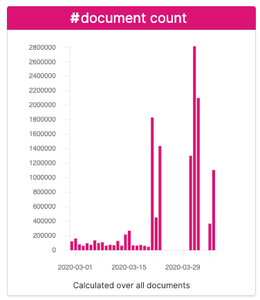
* The distribution of MAC addresses in senders (`sa`) and receivers (`ra`)
+
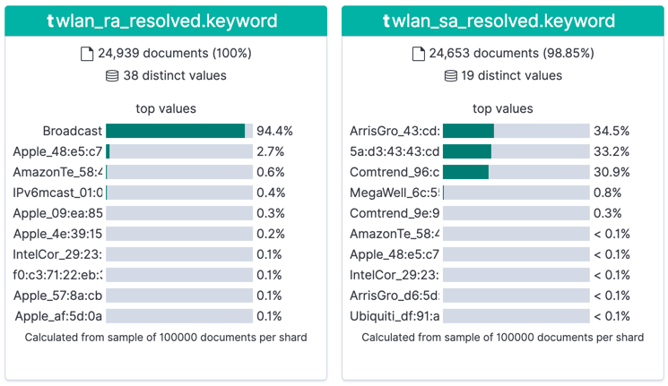
* Which types of packet are most commonly found (`wlan_fc_subtype`)
+
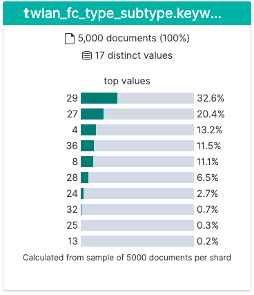

Based on https://books.google.co.uk/books?id=-AdTE9S3kigC&lpg=PA302&ots=Y8C-t2MKpN&dq=wireshark%20wlan.fc.type_subtype%2029%20ack&pg=PA301#v=onepage&q=wireshark%20wlan.fc.type_subtype%2029%20ack&f=false[this published table] we can see the top most common types of packets are: 

* 33% `ACK` (`wlan.fc.type_subtype` == 29)
* 20% `Request to Send` (`wlan.fc.type_subtype` == 27)
* 13% `Probe Request` (`wlan.fc.type_subtype` == 4)
* 11% `NULL Data` (`wlan.fc.type_subtype` == 36)

What about getting these numbers from analysing the data directly from the console, without Elasticsearch? 

== Understanding the overall dataset numerically

With ksqlDB you can use SQL-like queries to inspect, aggregate, and process data. Let's see it in action here with the raw packet capture (pcap) data that we've got. 

First up, I'm going to declare a schema so that I can query attributes of the data in the topic. Since I'm only interested in a couple of fields at this point (the date, and the subtype ranges) I'm just going to specify a partial schema since in full it's fairly beefy and redundant to type out in full at this stage. 

[source,sql]
----
CREATE STREAM PCAP_RAW_00 (timestamp BIGINT, 
                           wlan_fc_type_subtype ARRAY<INT>) 
    WITH (KAFKA_TOPIC='pcap', 
          VALUE_FORMAT='JSON', 
          TIMESTAMP='timestamp');
----

A couple of things to point out here: 

* Notice that the `wlan_fc_type_subtype` is written by the source application (`tshark`) as an _array_ of `INT`, e.g. `"wlan_fc_type": [ "1" ]`
* I am telling ksqlDB to take the `timestamp` field from the payload as the timestamp of the message (`WITH … TIMESTAMP='timestamp'`). 
+
If I didn't do this then it would default to the timestamp of the Kafka message as held in the message's metadata, which is not what I want in this case. Since we're going to be analysing the time attributes of the data it's important to be correctly handling **event time** vs **ingest time** here.

With the stream created, I tell ksqlDB to process data from the beginning of the topic: 

[source,sql]
----
SET 'auto.offset.reset' = 'earliest';
----

and then query it using SQL: 

[source,sql]
----
SELECT wlan_fc_type_subtype[1] AS SUBTYPE,
       COUNT(*) AS PACKET_COUNT,
       TIMESTAMPTOSTRING(MIN(ROWTIME),'yyyy-MM-dd HH:mm:ss','GMT') AS MIN_TS,
       TIMESTAMPTOSTRING(MAX(ROWTIME),'yyyy-MM-dd HH:mm:ss','GMT') AS MAX_TS
FROM   PCAP_RAW_00 WHERE ROWTIME < (UNIX_TIMESTAMP() - 1800000)
GROUP BY wlan_fc_type_subtype[1]
EMIT CHANGES;
----

Here we're aggregating by subtype for all messages received up until the last half hour, but you'll notice that it's calculating the numbers from the start of the topic and continually updating as newer messages are processed:

++++

++++

Let's build on this example, and break down the subtype count by day. You'll notice here that instead of writing the aggregate result to the screen we're instead instantiating it as a table within ksqlDB: 

[source,sql]
----
SET 'auto.offset.reset' = 'earliest';
CREATE TABLE PCAP_STATS WITH (VALUE_FORMAT='AVRO') AS
SELECT TIMESTAMPTOSTRING(WINDOWSTART,'yyyy-MM-dd','GMT') AS WINDOW_DAY,
       WLAN_FC_TYPE_SUBTYPE[1] AS SUBTYPE,
       COUNT(*) AS PACKET_COUNT,
       TIMESTAMPTOSTRING(MIN(ROWTIME),'HH:mm:ss','GMT') AS EARLIEST_TIME, 
       TIMESTAMPTOSTRING(MAX(ROWTIME),'HH:mm:ss','GMT') AS LATEST_TIME
FROM   PCAP_RAW_00 
        WINDOW TUMBLING (SIZE 1 DAY)
GROUP BY WLAN_FC_TYPE_SUBTYPE[1]
EMIT CHANGES;
----

Now there's an actual materialised view of this data, backed by a persisted Kafka topic: 

[source,sql]
----
ksql> SHOW TABLES;

 Table Name | Kafka Topic | Format | Windowed
----------------------------------------------
 PCAP_STATS | PCAP_STATS  | AVRO   | false
----------------------------------------------
----

This table we can query either as a "push" query showing all updates as they arrive: 

++++

++++

or query the value directly with a "pull" query for any of the subtypes: 

[source,sql]
----
ksql> SELECT WINDOW_DAY, SUBTYPE, PACKET_COUNT, EARLIEST_TIME, LATEST_TIME 
        FROM PCAP_STATS 
       WHERE ROWKEY = 4 ;
+-----------+--------+-------------+--------------+------------+
|WINDOW_DAY |SUBTYPE |PACKET_COUNT |EARLIEST_TIME |LATEST_TIME |
+-----------+--------+-------------+--------------+------------+
|2020-02-28 |4       |84           |22:47:06      |23:59:35    |
|2020-02-29 |4       |3934         |00:02:01      |23:58:19    |
|2020-03-01 |4       |1601         |00:00:06      |23:58:07    |
|2020-03-02 |4       |1125         |00:00:12      |23:59:13    |
Query terminated
----

Since it's just a Kafka topic, you can persist this aggregate to a database, using the message key to ensure that values update in-place. We'll use Kafka Connect like we did above for Elasticsearch, but here using ksqlDB as the interface:

[source,sql]
----
CREATE SINK CONNECTOR SINK_POSTGRES_PCAP_STATS_00 WITH (
    'connector.class'     = 'io.confluent.connect.jdbc.JdbcSinkConnector',
    'connection.url'      = 'jdbc:postgresql://postgres:5432/',
    'connection.user'     = 'postgres',
    'connection.password' = 'postgres',
    'topics'              = 'PCAP_STATS',
    'key.converter'       = 'org.apache.kafka.connect.storage.StringConverter',
    'auto.create'         = 'true',
    'auto.evolve'         = 'true',
    'insert.mode'         = 'upsert',
    'pk.mode'             = 'record_value',
    'pk.fields'           = 'WINDOW_DAY,SUBTYPE',
    'table.name.format'   = '${topic}'
);
----

Now as each message arrives in the source Kafka topic, it's incorporated in the aggregation by ksqlDB and the resulting change to the aggregate pushed to Postgres, where each key (which is a composite of the `SUBTYPE` plus the day) is updated in-place: 

[source,sql]
----
postgres=# SELECT * FROM "PCAP_STATS" WHERE "SUBTYPE"=4 ORDER BY "WINDOW_DAY" ;
 WINDOW_DAY | SUBTYPE | PACKET_COUNT | EARLIEST_TIME | LATEST_TIME
------------+---------+--------------+---------------+-------------
 2020-02-28 |       4 |           89 | 22:47:25      | 23:55:44
 2020-02-29 |       4 |         4148 | 00:02:01      | 23:58:19
 2020-03-01 |       4 |         1844 | 00:00:24      | 23:56:53
 2020-03-02 |       4 |          847 | 00:00:12      | 23:59:13
…
----

++++

++++

== Analysing relationships in the data with Kibana

As well as the Data Visualiser in Kibana, the Graph capabilities are quite interesting for exploring high-level relationships in the data: 

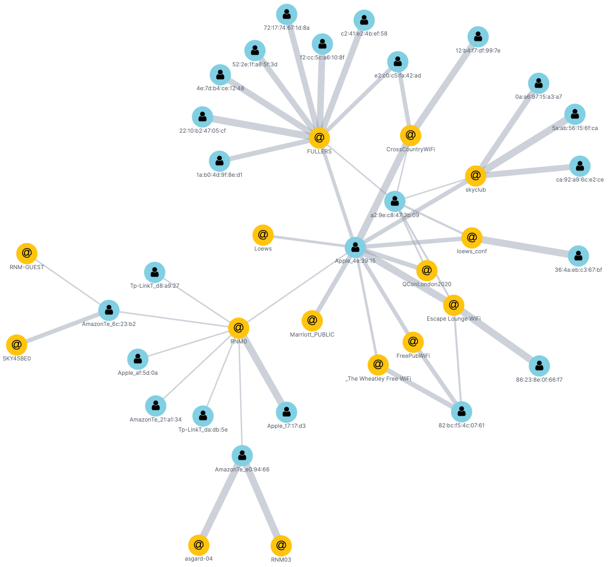

For dedicated Graph modelling and analysis of the data, see later in this article where we'll stream the data from Kafka into Neo4j and analyse it there. 

== Splitting the pcap data into separate topics

Knowing from our above analysis the types of data that we've got, let's use ksqlDB to split them out into separate topics as we'll want to analyse them further separately and each may well have different schema. 

To start with, I'll declare a schema which covers fields across all types of packet: 

[source,sql]
----
CREATE STREAM pcap_raw (timestamp                    BIGINT, 
                        wlan_fc_type_subtype         ARRAY<INT>,
                        wlan_radio_channel           ARRAY<INT>,
                        wlan_radio_signal_percentage ARRAY<VARCHAR>,
                        wlan_radio_signal_dbm        ARRAY<DOUBLE>,
                        wlan_radio_duration		  	 ARRAY<INT>,
                        wlan_ra						 ARRAY<VARCHAR>,
                        wlan_ra_resolved			 ARRAY<VARCHAR>,
                        wlan_da						 ARRAY<VARCHAR>,
                        wlan_da_resolved			 ARRAY<VARCHAR>,
                        wlan_ta						 ARRAY<VARCHAR>,
                        wlan_ta_resolved			 ARRAY<VARCHAR>,
                        wlan_sa						 ARRAY<VARCHAR>,
                        wlan_sa_resolved			 ARRAY<VARCHAR>,
                        wlan_staa					 ARRAY<VARCHAR>,
                        wlan_staa_resolved			 ARRAY<VARCHAR>,
                        wlan_tagged_all				 ARRAY<VARCHAR>,
                        wlan_tag_vendor_data		 ARRAY<VARCHAR>,
                        wlan_tag_vendor_oui_type	 ARRAY<VARCHAR>,
                        wlan_tag_oui				 ARRAY<VARCHAR>,
                        wlan_country_info_code		 ARRAY<VARCHAR>,
                        wps_device_name				 ARRAY<VARCHAR>,
                        wlan_ssid					 ARRAY<VARCHAR>) 
    WITH (KAFKA_TOPIC='pcap', 
        VALUE_FORMAT='JSON', 
        TIMESTAMP='timestamp');
----

Now we can pull out records of different types into new streams, and take the opportunity to serialise the resulting data to Avro. 

[source,sql]
----
SET 'auto.offset.reset' = 'earliest';
CREATE STREAM PCAP_PROBE  WITH (VALUE_FORMAT='AVRO') AS SELECT * FROM PCAP_RAW WHERE WLAN_FC_TYPE_SUBTYPE[1]=4;
CREATE STREAM PCAP_BEACON WITH (VALUE_FORMAT='AVRO') AS SELECT * FROM PCAP_RAW WHERE WLAN_FC_TYPE_SUBTYPE[1]=8;
CREATE STREAM PCAP_RTS    WITH (VALUE_FORMAT='AVRO') AS SELECT * FROM PCAP_RAW WHERE WLAN_FC_TYPE_SUBTYPE[1]=27;
CREATE STREAM PCAP_CTS    WITH (VALUE_FORMAT='AVRO') AS SELECT * FROM PCAP_RAW WHERE WLAN_FC_TYPE_SUBTYPE[1]=28;
CREATE STREAM PCAP_ACK    WITH (VALUE_FORMAT='AVRO') AS SELECT * FROM PCAP_RAW WHERE WLAN_FC_TYPE_SUBTYPE[1]=29;
CREATE STREAM PCAP_NULL   WITH (VALUE_FORMAT='AVRO') AS SELECT * FROM PCAP_RAW WHERE WLAN_FC_TYPE_SUBTYPE[1]=36;
----

If we had a partition key strategy that we wanted to apply we could do this here too by specifying `PARTITION BY`—but since we're still at the early stages of analysis we'll leave the key unset for now (which means that messages will be distributed "round robin" evenly across all partitions). We could also opt to drop unused columns from the schema for particular message types by replacing `SELECT *` with a specific projection of required columns. 

You'll observe that this creates and populates new Kafka topics: 

[source,sql]
----
ksql> SHOW TOPICS;

 Kafka Topic                            | Partitions | Partition Replicas
--------------------------------------------------------------------------
 PCAP_ACK                               | 12         | 3
 PCAP_BEACON                            | 12         | 3
 PCAP_CTS                               | 12         | 3
 PCAP_NULL                              | 12         | 3
 PCAP_PROBE                             | 12         | 3
 PCAP_RTS                               | 12         | 3
 PCAP_STATS                             | 12         | 3
 …
----

== Analysing WiFi probe requests

Mobile devices send probe requests to see what Access Points (AP) are available, and are an interesting source of analysis. Kibana is a great tool here for "slicing and dicing" the data to explore it. By adding a filter for the subtype we can easily pick out the fields that have got relevant data: 

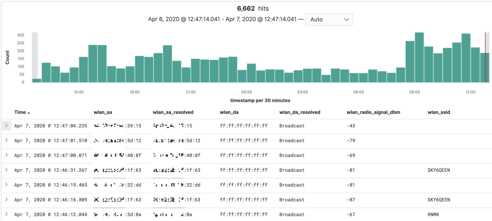

* `wlan_sa` is the raw source MAC address, whilst `wlan_sa_resolved` includes in some cases the manufacturer's prefix
* Most requests are looking for any AP but some are for a specific wireless network (`wlan_ssid`)

=== Enriching pcap data with lookups

So in amongst all this "digital exhaust" is going to be a load of devices from within my house, plus others externally. Wouldn't it be nice to be able to identify them? This is where the real power of ksqlDB comes in, because I can use it to join a stream of events (pcap data) with lookup data from elsewhere. I've got a list of known MAC addresses for my household devices that I can draw from my router where they're stored on MongoDB. Let's pull that data into Kafka through ksqlDB: 

[source,sql]
----
CREATE SOURCE CONNECTOR SOURCE_MONGODB_UNIFI_01 WITH (
    'connector.class' = 'io.debezium.connector.mongodb.MongoDbConnector',
    'mongodb.hosts' = 'rs0/mongodb:27017',
    'mongodb.name' = 'unifi',
    'collection.whitelist' = 'ace.device, ace.user'
);
----

With this data in Kafka we can use some of the data wrangling tricks to get two ksqlDB tables of devices (switches, APs, routers) and users (i.e. wifi clients - mobiles, laptops, etc). To get more background on what this ksqlDB code does and why, check out https://rmoff.net/2019/12/20/analysing-network-behaviour-with-ksqldb-and-mongodb/[this article].

[source,sql]
----
-- Model source topics
CREATE STREAM DEVICES_RAW WITH (KAFKA_TOPIC='unifi.ace.device', VALUE_FORMAT='AVRO');
CREATE STREAM USERS_RAW   WITH (KAFKA_TOPIC='unifi.ace.user',   VALUE_FORMAT='AVRO');

-- Extract device data fields from JSON payload
SET 'auto.offset.reset' = 'earliest';
CREATE STREAM ALL_DEVICES WITH (PARTITIONS=12,
                                KAFKA_TOPIC='all_devices_00') AS
        SELECT  'ace.device'                       AS SOURCE,
                EXTRACTJSONFIELD(AFTER ,'$.mac')   AS MAC, 
                EXTRACTJSONFIELD(AFTER ,'$.ip')    AS IP, 
                EXTRACTJSONFIELD(AFTER ,'$.name')  AS NAME, 
                EXTRACTJSONFIELD(AFTER ,'$.model') AS MODEL, 
                EXTRACTJSONFIELD(AFTER ,'$.type')  AS TYPE,
                CAST('0' AS BOOLEAN)               AS IS_GUEST
        FROM    DEVICES_RAW 
        -- Set the MAC address as a the message key
        PARTITION BY EXTRACTJSONFIELD(AFTER ,'$.mac')
        EMIT CHANGES;

-- Extract user (client device) data from JSON payload with some 
--  wrangling to handle null/empty fields etc.
-- Note that this is an "INSERT INTO" and thus in effect is a UNION of
--  the two source topics with some wrangling to align the schemas. 
SET 'auto.offset.reset' = 'earliest';
INSERT INTO ALL_DEVICES
      SELECT 'ace.user' AS SOURCE,
             EXTRACTJSONFIELD(AFTER ,'$.mac') AS MAC, 
             '' AS IP,
             -- Use a CASE statement to build a single label per device
             --  based on whether we have a name and/or hostname, and
             --  whether the device is a guest or not.
             CASE WHEN EXTRACTJSONFIELD(AFTER ,'$.name') IS NULL THEN 
                CASE WHEN EXTRACTJSONFIELD(AFTER ,'$.hostname') IS NULL THEN
                    CASE WHEN CAST(EXTRACTJSONFIELD(AFTER ,'$.is_guest') AS BOOLEAN) THEN 
                        'guest_' 
                    ELSE 
                        'nonguest_' 
                    END + EXTRACTJSONFIELD(AFTER ,'$.oui') 
                ELSE EXTRACTJSONFIELD(AFTER ,'$.hostname') 
                END
            ELSE 
                CASE WHEN EXTRACTJSONFIELD(AFTER ,'$.hostname') IS NULL THEN 
                    EXTRACTJSONFIELD(AFTER ,'$.name') 
                ELSE 
                    EXTRACTJSONFIELD(AFTER ,'$.name') + ' (' + EXTRACTJSONFIELD(AFTER ,'$.hostname') + ')'
                END
            END AS NAME,
            EXTRACTJSONFIELD(AFTER ,'$.oui')      AS MODEL,
            '' AS TYPE,
            CAST(EXTRACTJSONFIELD(AFTER ,'$.is_guest') AS BOOLEAN) AS IS_GUEST
        FROM USERS_RAW 
        -- Ignore Ubiquiti devices because these are picked up 
        --  from the `unifi.ace.device` data
        WHERE EXTRACTJSONFIELD(AFTER ,'$.oui')!='Ubiquiti'
        -- Set the MAC address as a the message key
        PARTITION BY EXTRACTJSONFIELD(AFTER ,'$.mac')
        EMIT CHANGES;

-- Declare a materialised ksqlDB table over the resulting combined stream
SET 'auto.offset.reset' = 'earliest';
CREATE TABLE DEVICES AS 
    SELECT MAC,
           LATEST_BY_OFFSET(SOURCE) AS SOURCE,
           LATEST_BY_OFFSET(NAME) AS NAME,
           LATEST_BY_OFFSET(IS_GUEST) AS IS_GUEST
    FROM   ALL_DEVICES
    GROUP BY MAC;
           
----

We've built a lookup table which because we've used an aggregation (`LATEST_BY_OFFSET`) is materialised. This means that as well as the usual ksqlDB "push query" of streaming updates as the data changes, we can also query the state directly (known as a "pull query"): 

[source,sql]
----
SELECT MAC, SOURCE, NAME, IS_GUEST FROM DEVICES WHERE ROWKEY='88:ae:07:29:e6:75' ;
----

[source,sql]
----
+------------------+----------+---------------+---------+
|MAC               |SOURCE    |NAME           |IS_GUEST |
+------------------+----------+---------------+---------+
|88:ae:07:29:e6:75 |ace.user  |rmoff-ipad-pro |false    |
Query terminated
----

With this lookup data in place and available through ksqlDB, we can join it to the stream of pcap probe data, so instead of this: 

[source,sql]
----
SELECT TIMESTAMPTOSTRING(ROWTIME,'yyyy-MM-dd HH:mm:ss','GMT') AS PCAP_TS,
       WLAN_SA[1] AS SOURCE_ADDRESS, 
       WLAN_SA_RESOLVED[1] AS SOURCE_ADDRESS_RESOLVED, 
       WLAN_DA[1] AS DESTINATION_ADDRESS, 
       WLAN_DA_RESOLVED[1]  AS DESTINATION_ADDRESS_RESOLVED, 
       WLAN_RADIO_SIGNAL_DBM[1] AS RADIO_SIGNAL_DBM, 
       WLAN_SSID[1] AS SSID 
  FROM PCAP_PROBE 
  EMIT CHANGES 
  LIMIT 5;
----

[source,sql]
----
+--------------------+------------------+------------------------+--------------------+-----------------------------+-----------------+------+
|PCAP_TS             |SOURCE_ADDRESS    |SOURCE_ADDRESS_RESOLVED |DESTINATION_ADDRESS |DESTINATION_ADDRESS_RESOLVED |RADIO_SIGNAL_DBM |SSID  |
+--------------------+------------------+------------------------+--------------------+-----------------------------+-----------------+------+
|2020-03-31 13:07:14 |f0:c3:71:2a:04:20 |f0:c3:71:2a:04:20       |ff:ff:ff:ff:ff:ff   |Broadcast                    |-75.0            |RNM0  |
|2020-03-31 13:09:41 |40:b4:cd:58:40:8f |AmazonTe_58:40:8f       |ff:ff:ff:ff:ff:ff   |Broadcast                    |-75.0            |      |
|2020-03-31 12:47:31 |e8:b2:ac:6f:3f:a8 |Apple_6f:3f:a8          |ff:ff:ff:ff:ff:ff   |Broadcast                    |-79.0            |      |
|2020-03-31 13:12:24 |f0:c3:71:2a:04:20 |f0:c3:71:2a:04:20       |ff:ff:ff:ff:ff:ff   |Broadcast                    |-81.0            |      |
|2020-03-31 13:14:31 |e8:b2:ac:6f:3f:a8 |Apple_6f:3f:a8          |ff:ff:ff:ff:ff:ff   |Broadcast                    |-77.0            |      |
Limit Reached
Query terminated
----

We can get this: 

[source,sql]
----
SELECT TIMESTAMPTOSTRING(P.ROWTIME,'yyyy-MM-dd HH:mm:ss','GMT') AS PCAP_TS,
       WLAN_SA[1] AS SOURCE_ADDRESS, 
       NAME AS DEVICE_NAME, 
       CASE WHEN IS_GUEST IS NULL THEN FALSE ELSE CASE WHEN IS_GUEST THEN FALSE ELSE TRUE END END AS IS_KNOWN_DEVICE,
       WLAN_SA_RESOLVED[1] AS SOURCE_ADDRESS_RESOLVED, 
       WLAN_DA[1] AS DESTINATION_ADDRESS, 
       WLAN_DA_RESOLVED[1]  AS DESTINATION_ADDRESS_RESOLVED, 
       WLAN_RADIO_SIGNAL_DBM[1] AS RADIO_SIGNAL_DBM, 
       WLAN_SSID[1] AS SSID
  FROM PCAP_PROBE P
        LEFT JOIN 
        DEVICES D
        ON P.WLAN_SA[1] = D.ROWKEY
  EMIT CHANGES 
  LIMIT 5;
----

[source,sql]
----
+--------------------+------------------+---------------+----------------+------------------------+--------------------+-----------------------------+-----------------+-------------+
|PCAP_TS             |SOURCE_ADDRESS    |DEVICE_NAME    |IS_KNOWN_DEVICE |SOURCE_ADDRESS_RESOLVED |DESTINATION_ADDRESS |DESTINATION_ADDRESS_RESOLVED |RADIO_SIGNAL_DBM |SSID         |
+--------------------+------------------+---------------+----------------+------------------------+--------------------+-----------------------------+-----------------+-------------+
|2020-03-31 13:15:49 |78:67:d7:48:e5:c7 |null           |false           |Apple_48:e5:c7          |ff:ff:ff:ff:ff:ff   |Broadcast                    |-81.0            |VM9654567    |
|2020-03-23 18:12:12 |e8:b2:ac:6f:3f:a8 |Gillians-iPad  |true            |Apple_6f:3f:a8          |ff:ff:ff:ff:ff:ff   |Broadcast                    |-77.0            |             |
|2020-03-31 19:59:03 |62:45:b6:c6:7e:03 |null           |false           |62:45:b6:c6:7e:03       |ff:ff:ff:ff:ff:ff   |Broadcast                    |-77.0            |             |
|2020-03-31 22:53:25 |44:65:0d:e0:94:66 |Robin's Kindle |true            |AmazonTe_e0:94:66       |ff:ff:ff:ff:ff:ff   |Broadcast                    |-63.0            |RNM0         |
|2020-03-31 20:25:00 |30:07:4d:91:96:56 |null           |false           |SamsungE_91:96:56       |ff:ff:ff:ff:ff:ff   |Broadcast                    |-79.0            |VodafoneWiFi |
Limit Reached
Query terminated
----

Now we can write this enriched data back into Kafka and from there to Elasticsearch: 

[source,sql]
----
SET 'auto.offset.reset' = 'earliest';
CREATE STREAM PCAP_PROBE_ENRICHED 
    WITH (KAFKA_TOPIC='pcap_probe_enriched_00') AS
    SELECT WLAN_SA[1] AS SOURCE_ADDRESS, 
        NAME AS SOURCE_DEVICE_NAME, 
        CASE WHEN IS_GUEST IS NULL THEN 
                    FALSE 
            ELSE 
                CASE WHEN IS_GUEST THEN 
                    FALSE 
                ELSE 
                    TRUE 
                END 
            END AS IS_KNOWN_DEVICE,
        WLAN_SA_RESOLVED[1] AS SOURCE_ADDRESS_RESOLVED, 
        WLAN_DA[1] AS DESTINATION_ADDRESS, 
        WLAN_DA_RESOLVED[1]  AS DESTINATION_ADDRESS_RESOLVED, 
        WLAN_RADIO_SIGNAL_DBM[1] AS RADIO_SIGNAL_DBM, 
        WLAN_SSID[1] AS SSID,
        WLAN_TAG_VENDOR_DATA,
        WLAN_TAG_VENDOR_OUI_TYPE,
        WLAN_TAG_OUI
    FROM PCAP_PROBE P
            LEFT JOIN 
            DEVICES D
            ON P.WLAN_SA[1] = D.ROWKEY
    EMIT CHANGES;

CREATE SINK CONNECTOR SINK_ELASTIC_PCAP_ENRICHED_00 WITH (
    'connector.class' = 'io.confluent.connect.elasticsearch.ElasticsearchSinkConnector',
    'connection.url' = 'http://elasticsearch:9200',
    'topics' = 'pcap_probe_enriched_00',
    'type.name' = '_doc',
    'key.ignore' = 'true',
    'schema.ignore' = 'true',
    'key.converter' = 'org.apache.kafka.connect.storage.StringConverter',
    'transforms'= 'ExtractTimestamp',
    'transforms.ExtractTimestamp.type'= 'org.apache.kafka.connect.transforms.InsertField$Value',
    'transforms.ExtractTimestamp.timestamp.field' = 'PCAP_TS',
    'flush.timeout.ms'=  60000, 
    'batch.size'= 200000,
    'linger.ms'= 1000,
    'read.timeout.ms'= 60000
);
----

So what can we do with this data that we couldn't if streaming the pcap directly from source into Elasticsearch directly? We can use the device names, and a filter on whether the device is known or not (based on whether the MAC has an entry in the router's internal table). Here's a useful illustration with the data. It shows, per device, the average signal strength through a period of time. Darker green means a stronger signal.

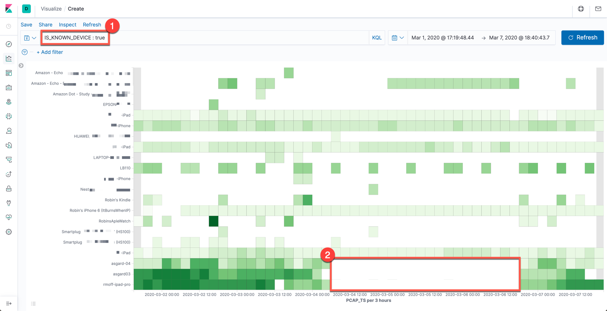

1. We can accurately label all the devices, and filter for ones which are known devices
2. There's only data when a device runs a probe request - and if the device is absent there'll be no probes at all. The time period highlighted towards the bottom of the image matches when I (and my laptop, phone, and iPad) were away from home at a conference. 
** You'll also notice for the iPad and `asgard03` devices (and to an extent `asgard-04`) that the signal—when present—is much stronger - because the devices are in the same room as the https://rmoff.net/2020/03/11/streaming-wi-fi-trace-data-from-raspberry-pi-to-apache-kafka-with-confluent-cloud/[Raspberry Pi that is capturing the pcap data].

One of the things that I was interested to see was whether there would be a discernable pattern in the data relating to the impact of the Coronavirus pandemic. Unfortunately my test-rig failed right around the time when the severe restrictions were put in place, but this is what it looks like for the first three weeks of March:

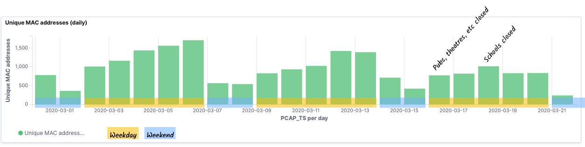

As discussed above, there's a huge caveat to this data though - tracking MAC addresses alone is not accurate, because of MAC address randomisation used by many newer devices. You can read more about it https://papers.mathyvanhoef.com/asiaccs2016.pdf[here] but in essence, this is done deliberately for privacy reasons. By charting the data out this way we can actually dig into this randomisation a bit. Looking at the recent probe activity I can see a relatively consistent number of probes, but a spike in the number of unique MACs on one of the days. 

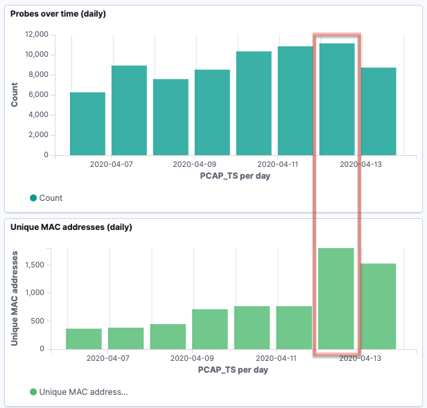

Drilling into that particular day there's a couple of spikes at specific points in the day: 

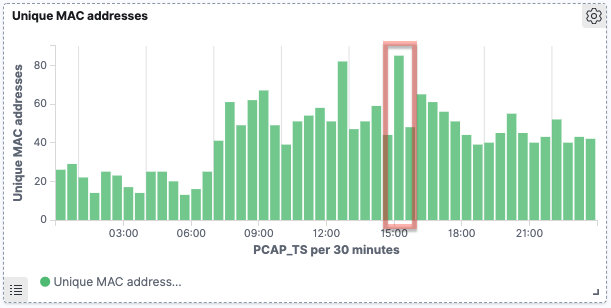

So let's take a closer look at one of those. If we use a similar heatplot to above we can see that some devices (1) retain the same MAC address, and so we see multiple probes over time from it at varying strength. In other cases those (2) we can see signals of approximately the same strength (`-69` - `-67`, in orange on the image below ), but with just single probes recorded. 

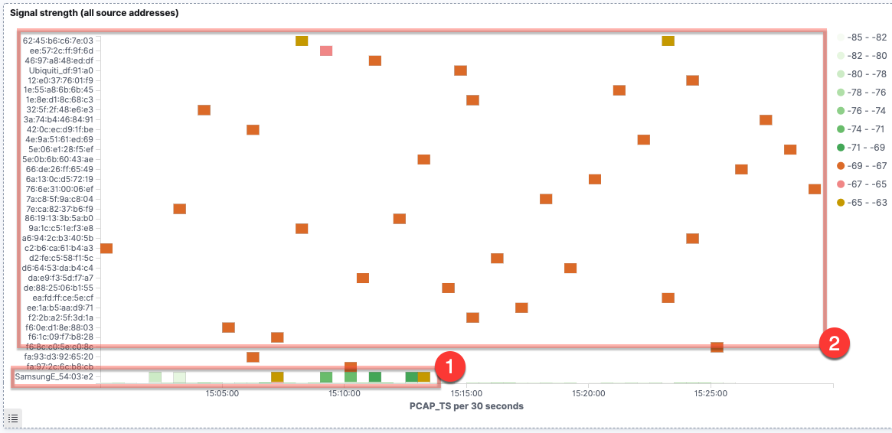

There are two scenarios that would account for the latter behaviour. The first is that there are multiple devices, each of a similar proximity to the device capturing the wifi probes, and each _only sending a single probe request in the 30 minute interval_. The second scenario is that it is a smaller number of devices, issuing multiple probe requests over time, but changing the MAC address each time. Let's see what else the data can offer us to help us pursue these hypotheses. 

By filtering the probe data for the signal range observed above we get this set of data, in which there's an interesting pattern to observe:

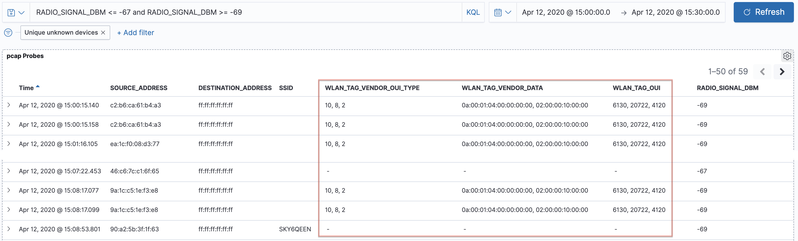

When devices send out probe requests they include other data about the kind of protocol that they support, and so on. These fields (including `wlan.tag.oui` and `wlan.tag.vendor.oui.type`) are not unique to each device, but the combination of the values per packet forms a lower cardinality set than the probe results alone. 

Looking at this set of probe requests, at the same signal strength, in the same time period, we can see that almost all of them share the same set of `wlan.tag.oui` properties

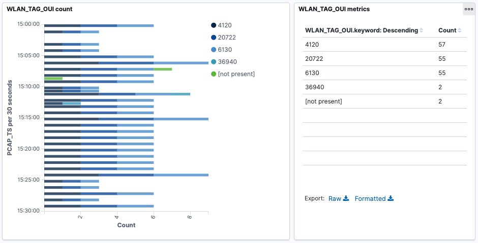

Using the https://gitlab.com/wireshark/wireshark/raw/master/manuf[Manufacturer's database from Wireshark] the OUIs can be decoded based on their hex representation

* 4120 == 00:10:18 == Broadcom
* 20722 == 00:50:F2 == Microsoft Corp.
* 6130 == 00:17:F2 == Apple, Inc.

If you want to dig even further into this, the data that we're streaming into Kafka can also be written to a local pcap file (add `-b duration:3600 -b files:12 -w /pcap_data/mon0` to the `shark` command to keep 12 hourly files of data), and this pcap file loaded into Wireshark to see the real guts of the data that's captured: 

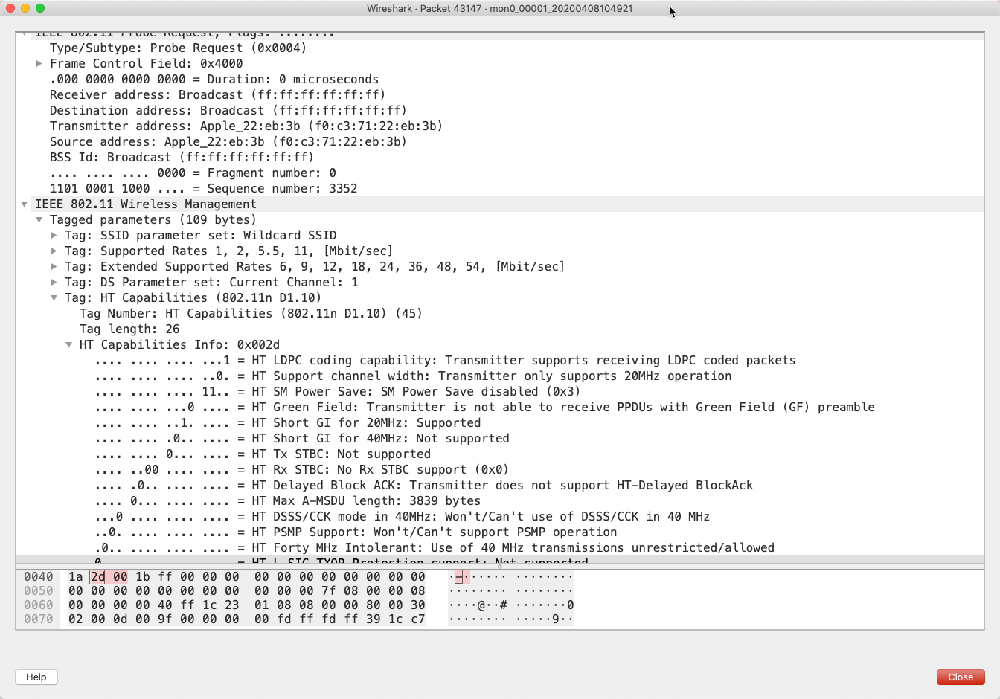

=== Wi-Fi Probe pcap pattern matching with ksqlDB

The above analysis in Kibana showed how we can eyeball the data to explore and identify patterns of interest. But can we take a stream of data and automagically look for such patterns? Sure we can - with ksqlDB. 

[source,sql]
----
SET 'auto.offset.reset' = 'earliest';

CREATE TABLE OUI_FINGERPRINT_PROBES_01 AS 
    SELECT WLAN_TAG_VENDOR_DATA,
           WLAN_TAG_VENDOR_OUI_TYPE,
           WLAN_TAG_OUI,
           COUNT(*)                                                    AS PROBE_COUNT,
           COUNT_DISTINCT(WLAN_SA[1])                                  AS SOURCE_MAC_ADDRESS_COUNT, 
           COLLECT_SET(WLAN_SA[1])                                     AS SOURCE_MAC_ADDRESSES,
           TIMESTAMPTOSTRING(WINDOWSTART,'yyyy-MM-dd HH:mm:ss','GMT')  AS FIRST_PROBE, 
           TIMESTAMPTOSTRING(WINDOWEND,'yyyy-MM-dd HH:mm:ss','GMT')    AS LAST_PROBE, 
           (WINDOWEND-WINDOWSTART)/1000                                AS SESSION_LENGTH_SEC,
           MAX(WLAN_RADIO_SIGNAL_DBM[1])-MIN(WLAN_RADIO_SIGNAL_DBM[1]) AS SIGNAL_DBM_RANGE,
           HISTOGRAM(CAST(WLAN_RADIO_SIGNAL_DBM[1] AS VARCHAR))        AS SIGNAL_DBM_DISTRIBUTION
      FROM PCAP_PROBE
        WINDOW SESSION (5 MINUTES)
     GROUP BY WLAN_TAG_VENDOR_DATA, 
              WLAN_TAG_VENDOR_OUI_TYPE, 
              WLAN_TAG_OUI 
    HAVING COUNT_DISTINCT(WLAN_SA[1]) > 2 
    EMIT CHANGES ;
----

This uses a *session window* to identify probe requests matching this pattern: 

* identical set of properties (`wlan.tag.oui`, `wlan.tag.vendor.oui.type`, `wlan.tag.vendor.data`)
* issued with a gap of no more than five minutes apart 
* more than two different source MAC addresses
* Signal strength of all probes within 3 https://en.wikipedia.org/wiki/DBm[dBm] of each other

All requests matching this pattern are grouped into a single result, from which we can see how many requests there were, which source MACs were used (and how many), the range of signal strengths, and so on: 

[source,sql]
----
SELECT ROWKEY AS FINGERPRINT,
       PROBE_COUNT,
       SOURCE_MAC_ADDRESS_COUNT,
       SOURCE_MAC_ADDRESSES,
       FIRST_PROBE,
       LAST_PROBE,
       SIGNAL_DBM_DISTRIBUTION
  FROM OUI_FINGERPRINT_PROBES_01
  WHERE WINDOWSTART > STRINGTOTIMESTAMP('2020-04-12 14:55:00','yyyy-MM-dd HH:mm:ss') AND WINDOWSTART < STRINGTOTIMESTAMP('2020-04-12 15:35:00','yyyy-MM-dd HH:mm:ss')
  EMIT CHANGES;
----

[source,sql]
----
+---------------------+---------------------+---------------------+---------------------+---------------------+---------------------+---------------------+
|FINGERPRINT          |PROBE_COUNT          |SOURCE_MAC_ADDRESS_CO|SOURCE_MAC_ADDRESSES |FIRST_PROBE          |LAST_PROBE           |SIGNAL_DBM_DISTRIBUTI|
|                     |                     |UNT                  |                     |                     |                     |ON                   |
+---------------------+---------------------+---------------------+---------------------+---------------------+---------------------+---------------------+
|[0a:00:01:04:00:00:00|16                   |14                   |[6e:6f:18:05:08:16, 7|2020-04-13 14:21:56  |2020-04-13 14:45:03  |{-73.0=4, -71.0=11, -|
|:00, 02:00:00:10:00:0|                     |                     |2:97:6c:9b:18:e9, 7e:|                     |                     |65.0=1}              |
|0]|+|[10, 8, 2]|+|[61|                     |                     |08:a9:8e:6c:79, 9e:89|                     |                     |                     |
|30, 20722, 4120]     |                     |                     |:88:d4:3f:64, 7a:5f:3|                     |                     |                     |
|                     |                     |                     |f:52:1d:ae, a6:ae:14:|                     |                     |                     |
|                     |                     |                     |78:b4:6a, 8e:2b:57:2a|                     |                     |                     |
|                     |                     |                     |:e7:ff, 86:d8:dc:50:a|                     |                     |                     |
|                     |                     |                     |a:b0, 8a:db:cf:ba:65:|                     |                     |                     |
|                     |                     |                     |3a, 5a:83:54:0a:4f:8c|                     |                     |                     |
|                     |                     |                     |, 62:d4:97:c2:ac:62, |                     |                     |                     |
|                     |                     |                     |52:b2:39:e7:b1:cf, 42|                     |                     |                     |
|                     |                     |                     |:c4:7b:48:99:54, d6:5|                     |                     |                     |
|                     |                     |                     |f:7b:35:0b:a6]       |                     |                     |                     |
----

== Analysing streams of data with ksqlDB

Let us now take a step back from the nitty-gritty of Wi-Fi probe requests and randomisation of MAC addresses, and take a higher level view of the data we're capturing. Using the enriched stream of data that we've created from the live stream of packet captures joined to device information from my router, we can build a picture of all the devices that we see along with some summary statistics about them - when they last probed, which SSIDs they look for, and so on. 

[source,sql]
----
SET 'auto.offset.reset' = 'earliest';
CREATE TABLE PCAP_PROBE_STATS_BY_SOURCE_DEVICE_02 AS 
    SELECT CASE WHEN SOURCE_DEVICE_NAME IS NULL THEN 
                SOURCE_ADDRESS_RESOLVED 
            ELSE 
                SOURCE_DEVICE_NAME END			AS SOURCE, 
           COUNT(*)								AS PCAP_PROBES, 
           MIN(ROWTIME)							AS EARLIEST_PROBE,
           MAX(ROWTIME)							AS LATEST_PROBE,
           MIN(RADIO_SIGNAL_DBM)				AS MIN_RADIO_SIGNAL_DBM,
           MAX(RADIO_SIGNAL_DBM)				AS MAX_RADIO_SIGNAL_DBM,
           AVG(RADIO_SIGNAL_DBM)				AS AVG_RADIO_SIGNAL_DBM,
           COLLECT_SET(SSID)					AS PROBED_SSIDS,
           COUNT_DISTINCT(SSID)					AS UNIQUE_SSIDS_PROBED,
           COUNT_DISTINCT(DESTINATION_ADDRESS)	AS UNIQUE_DESTINATION_ADDRESSES
    FROM   PCAP_PROBE_ENRICHED
    GROUP BY CASE WHEN SOURCE_DEVICE_NAME IS NULL THEN SOURCE_ADDRESS_RESOLVED ELSE SOURCE_DEVICE_NAME END;    
----

Under the covers, this aggregation is materialised by ksqlDB, which means that we can query the state directly: 

[source,sql]
----
SELECT SOURCE_DEVICE_NAME,
       PCAP_PROBES,
       TIMESTAMPTOSTRING(EARLIEST_PROBE,'yyyy-MM-dd HH:mm:ss','GMT') AS EARLIEST_PROBE,
       TIMESTAMPTOSTRING(LATEST_PROBE,'yyyy-MM-dd HH:mm:ss','GMT') AS LATEST_PROBE,
       PROBED_SSIDS,
       UNIQUE_SSIDS_PROBED
  FROM PCAP_PROBE_STATS_BY_SOURCE_DEVICE_02
 WHERE ROWKEY='asgard03';
----

[source,sql]
----
+-------------------+------------+--------------------+--------------------+----------------------------+--------------------+
|SOURCE_DEVICE_NAME |PCAP_PROBES |EARLIEST_PROBE      |LATEST_PROBE        |PROBED_SSIDS                |UNIQUE_SSIDS_PROBED |
+-------------------+------------+--------------------+--------------------+----------------------------+--------------------+
|asgard03           |3110        |2020-02-28 22:51:22 |2020-04-14 11:06:13 |[null, , FULLERS, RNM0, loew|12                  |
|                   |            |                    |                    |s_conf, _The Wheatley Free W|                    |
|                   |            |                    |                    |iFi, skyclub, CrossCountryWi|                    |
|                   |            |                    |                    |Fi, QConLondon2020, FreePubW|                    |
|                   |            |                    |                    |iFi, Marriott_PUBLIC, Loews,|                    |
|                   |            |                    |                    | Escape Lounge WiFi]        |                    |
Query terminated
----

This is for my Mac laptop, and you can see various public and private networks being looked for. The names of these match those on my known WiFi networks settings

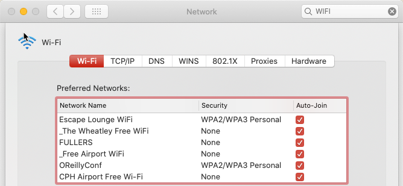

ksqlDB is proving pretty handy here. We've taken a raw stream of data, and using a couple of SQL statements built a stateful, scalable, aggregation that we can query in place from the ksqlDB prompt. We can also use the REST API to query it programatically, for example to see when a given device last ran a probe:

[source,bash]
----
$ curl -s -XPOST "http://localhost:8088/query" \
     -H "Content-Type: application/vnd.ksql.v1+json; charset=utf-8" \
     -d '{"ksql":"SELECT TIMESTAMPTOSTRING(LATEST_PROBE,'\''yyyy-MM-dd HH:mm:ss'\'','\''GMT'\'') AS LATEST_PROBE FROM PCAP_PROBE_STATS_BY_SOURCE_DEVICE_02 WHERE ROWKEY='\''asgard03'\'';"}' |jq '.[].row.columns'

[
  "2020-04-08 06:39:45"
]
----

And of course, we can take the data that ksqlDB is aggregating for us and push it down to one, or more, target systems for further use and analysis: 

*TODO*: diagram showing pcap -> kafka -> ksqlDB -> Kafka -> postgres & elastic

* Elasticsearch
+
[source,sql]
----
CREATE SINK CONNECTOR SINK_ELASTIC_PCAP_PROBE_STATS_BY_SOURCE_DEVICE_02 WITH (
  'connector.class' 							= 'io.confluent.connect.elasticsearch.ElasticsearchSinkConnector',
  'connection.url' 								= 'http://elasticsearch:9200',
  'topics' 										= 'PCAP_PROBE_STATS_BY_SOURCE_DEVICE_02',
  'type.name' 									= '_doc',
  'key.ignore' 									= 'false',
  'schema.ignore' 								= 'true',
  'transforms' 									= 'appendTimestampToColName',
  'transforms.appendTimestampToColName.type' 	= 'org.apache.kafka.connect.transforms.ReplaceField$Value',
  'transforms.appendTimestampToColName.renames' = 'EARLIEST_PROBE:EARLIEST_PROBE_TS,LATEST_PROBE:LATEST_PROBE_TS',
  'key.converter' 								= 'org.apache.kafka.connect.storage.StringConverter'
);
----
+
** `'key.ignore' = 'false'` which means that it takes the key of the Kafka message (which is set in the `CREATE TABLE` above to the `SOURCE` field) and so will update documents in place when changes occur in the source table.
** A Single Message Transform (SMT) is used to append `_TS` to the date fields. I created a document mapping template in Elasticsearch to match any field named `*_TS` as a date, which these two fields are (but stored as `BIGINT` epoch in ksqlDB)

* Postgres
+
[source,sql]
----
CREATE SINK CONNECTOR SINK_POSTGRES_PCAP_PROBE_STATS_BY_SOURCE_DEVICE_02 WITH (
    'connector.class'     = 'io.confluent.connect.jdbc.JdbcSinkConnector',
    'connection.url'      = 'jdbc:postgresql://postgres:5432/',
    'connection.user'     = 'postgres',
    'connection.password' = 'postgres',
    'topics'              = 'PCAP_PROBE_STATS_BY_SOURCE_DEVICE_02',
    'key.converter'       = 'org.apache.kafka.connect.storage.StringConverter',
    'auto.create'         = 'true',
    'auto.evolve'         = 'true',
    'insert.mode'         = 'upsert',
    'pk.mode'             = 'record_value',
    'pk.fields'           = 'SOURCE',
    'table.name.format'   = '${topic}',
    'transforms'          = 'dropArray,setTimestampType0,setTimestampType1',
    'transforms.dropArray.type' = 'org.apache.kafka.connect.transforms.ReplaceField$Value',
    'transforms.dropArray.blacklist' = 'PROBED_SSIDS',
    'transforms.setTimestampType0.type'= 'org.apache.kafka.connect.transforms.TimestampConverter$Value',
    'transforms.setTimestampType0.field'= 'EARLIEST_PROBE',
    'transforms.setTimestampType0.target.type' ='Timestamp',
    'transforms.setTimestampType1.type'= 'org.apache.kafka.connect.transforms.TimestampConverter$Value',
    'transforms.setTimestampType1.field'= 'LATEST_PROBE',
    'transforms.setTimestampType1.target.type' ='Timestamp'
);
----
+
** Since the JDBC sink doesn't support writing array objects to Postgres (you'll get the error `org.apache.kafka.connect.errors.ConnectException: null (ARRAY) type doesn't have a mapping to the SQL database column type`) we just drop it here using the `ReplaceField` SMT.
** The `TimestampConverter` Single Message Transform is used to set the type of the two timestamp fields so that they're ingested into Postgres as timestamps (and not BIGINT)
** To get the rows updating in place as the source table in ksqlDB changes `'insert.mode'` is set to `upsert`. The primary key on the target table in Postgres is set to be built from the value of `SOURCE` (`pk.fields`) in the message value (`record_value`). 
+
[source,sql]
----
postgres=# \d "PCAP_PROBE_STATS_BY_SOURCE_DEVICE_02"
                 Table "public.PCAP_PROBE_STATS_BY_SOURCE_DEVICE_02"
            Column            |       Type       | Collation | Nullable | Default
------------------------------+------------------+-----------+----------+---------
 SOURCE                       | text             |           | not null |
…
Indexes:
    "PCAP_PROBE_STATS_BY_SOURCE_DEVICE_02_pkey" PRIMARY KEY, btree ("SOURCE")
----
+
Since `SOURCE` is also the record _key_ in the Kafka message you could use `pk.mode` = `record_key` here, but it would still need to be materialised onto the Postgres table, and so you'd end up with two fields in Postgres with the same value (`SOURCE`, plus whatever you set `pk.fields` to as in this context it would be used by the connector as the _name of the field in Postgres_ to store the Kafka message key in):
+
[source,sql]
----
'pk.mode'             = 'record_key',
'pk.fields'           = 'PK',
----
+
[source,sql]
----
postgres=# \d "PCAP_PROBE_STATS_BY_SOURCE_DEVICE"
                Table "public.PCAP_PROBE_STATS_BY_SOURCE_DEVICE"
            Column            |       Type       | Collation | Nullable | Default
------------------------------+------------------+-----------+----------+---------
 SOURCE                       | text             |           |          |
…
 PK                           | text             |           | not null |
Indexes:
    "PCAP_PROBE_STATS_BY_SOURCE_DEVICE_pkey" PRIMARY KEY, btree ("PK")

postgres=# SELECT "SOURCE","PK" FROM "PCAP_PROBE_STATS_BY_SOURCE_DEVICE";
      SOURCE       |        PK
-------------------+-------------------
 ea:28:50:4d:44:fb | ea:28:50:4d:44:fb
 12:c3:06:85:53:96 | 12:c3:06:85:53:96
…
(3 rows)
----

== Graph relationships in the data

*TODO*: diagram showing pcap -> kafka -> ksqlDB -> Kafka -> neo4j

Phew. That was some deep stuff we did there with both Elasticsearch & Kibana for analysis and identifying patterns, and ksqlDB for building stateful aggregations of these patterns and general statistics on the data. 

Let's look at what else we can do with streams of data that we've got in Kafka. Here we'll take the stream of probe requests that we filtered into its own topic and stream it to Neo4j: 

[source,sql]
----
CREATE SINK CONNECTOR SINK_NEO4J_PROBES_01 WITH (
	'connector.class'= 'streams.kafka.connect.sink.Neo4jSinkConnector',
	'topics'= 'pcap_probe_enriched_00',
	'neo4j.server.uri'= 'bolt://neo4j:7687',
	'neo4j.authentication.basic.username'= 'neo4j',
	'neo4j.authentication.basic.password'= 'connect',
	'neo4j.topic.cypher.pcap_probe_enriched_00'= 'MERGE (source:source{mac: event.SOURCE_ADDRESS, mac_resolved: event.SOURCE_ADDRESS_RESOLVED, device_name: coalesce(event.SOURCE_DEVICE_NAME,""), is_known: event.IS_KNOWN_DEVICE}) MERGE (ssid:ssid{name: coalesce(event.SSID, "")}) MERGE (ssid)<-[:LOOKED_FOR_SSID]-(source)'
);
----

From here we can really dig into the property graph relationships, for example that exist between devices and the Wi-Fi networks (SSIDs) that they scan for. Here we can see my known devices (denoted by diamonds with red edging) scanning for my home Wi-Fi network, and a couple of these devices also scanning for other public networks (pubs, airline lounges, train Wi-Fi, etc) which other non-known devices also scan for: 

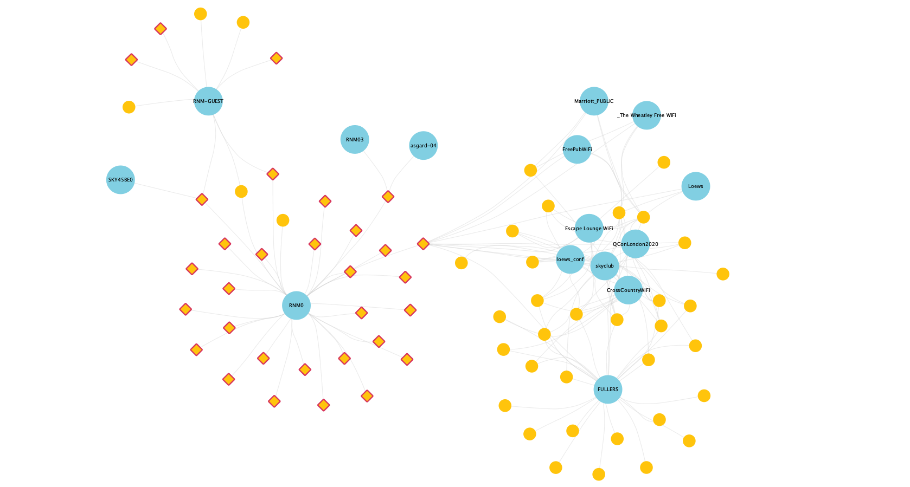

You also get patterns like this, where some devices (yellow dots) have evidently connected to (and are thus scanning for) many networks, whilst others overlap only on common public ones (`Northern-FreeWiFi` is from the local train company, `BTWiFi-with-FON` is a shared Wi-Fi service)

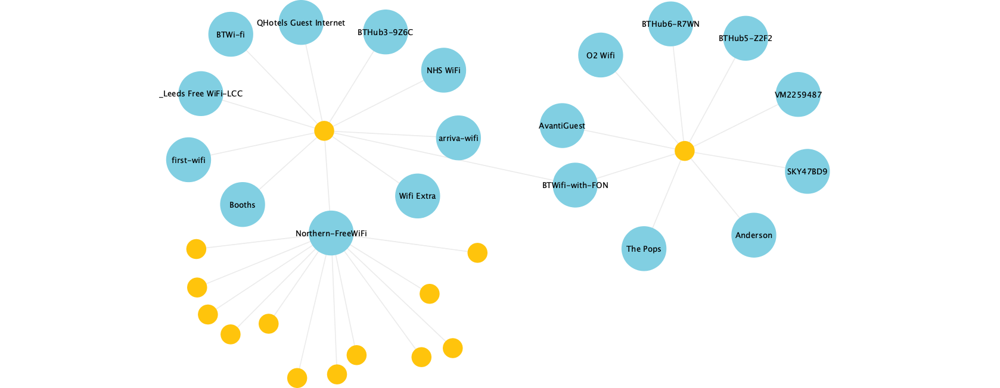

Other devices clearly just connect to one network only, ignoring all others

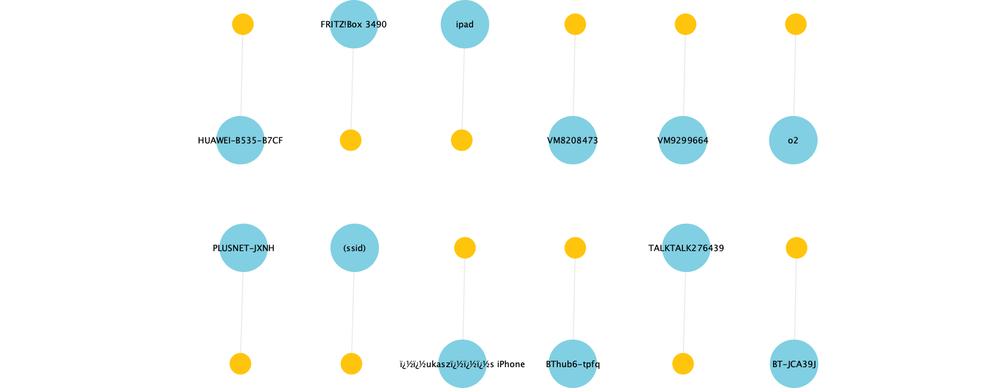

== Conclusion 

Kafka is a great platform into which you can stream and store high volumes of data, and on which you can process and analyse it using tools such as ksqlDB, Elasticsearch, and Neo4j. With the ability to create connectors from within ksqlDB it is easy to integrate systems both pulling data into Kafka and pushing it out downstream. 

    >>>>>

Move to other posts: 

== Testing with Confluent Cloud locally

(replicator)

set local retention to match remote retention ?

