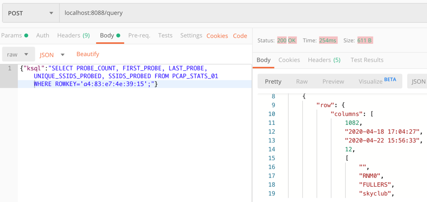
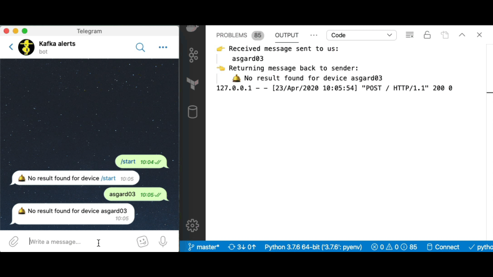
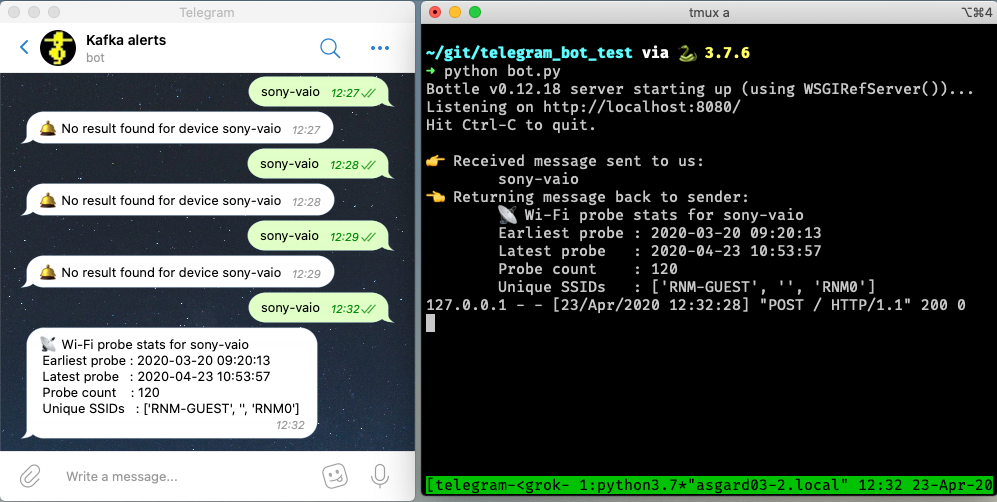
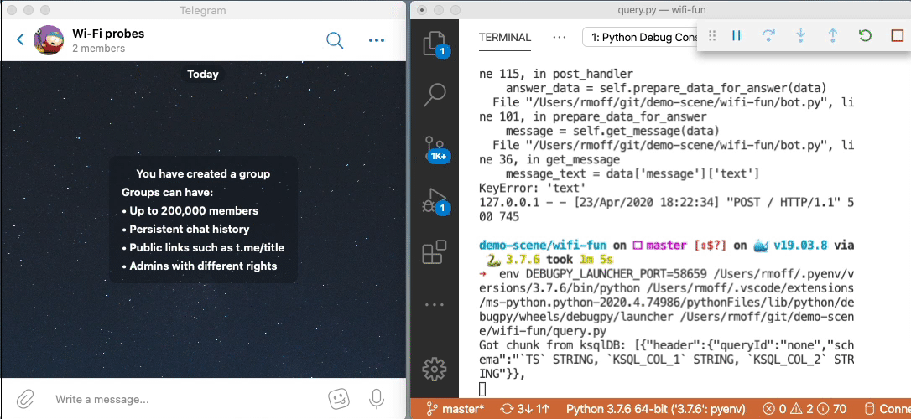
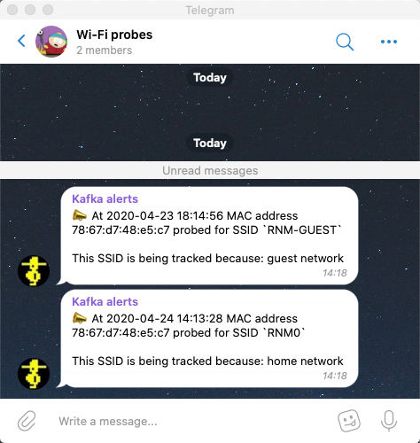

= Building a Telegram bot powered by Kafka and ksqlDB

Robin Moffatt <robin@confluent.io>
v0.01, 21 April 2020

Imagine you've got a stream of data. It's not Big Data but it's certainly a lot. Within that data you've got some bits you're interested in, and of those bits, you'd like to be able to at any point query information about them. Sounds fun, right? Since I said "stream of data" (and you're reading this on a Kafka blog) you're probably thinking about Kafka, and then because I mentioned "querying" I'd hazard a guess that you've got in mind an additional datastore of some sort, whether relational or noSQL. But what about if you didn't need any data store other than Kafka itself? 

What if you could ingest, filter, enrich, aggregate, and query data with just Kafka? With ksqlDB we can do just this, and I want to show you exactly how in this article. 

We're going to build a simple system that captures Wi-Fi packets, processes them, and serves up on demand information about the devices connecting to Wi-Fi. The "secret sauce" here is ksqlDB's ability to build stateful aggregates that can be directly accessed using _pull queries_. This is going to power a very simple bot for the messaging platform Telegram, which takes a device name as input and returns statistics about its Wi-Fi probe activities to the user: 

image::images/telegram01.gif[]

The overall architecture looks like this: 

== Turning a stream into state

The data comes from https://rmoff.net/2020/03/11/streaming-wi-fi-trace-data-from-raspberry-pi-to-apache-kafka-with-confluent-cloud/[Wireshark and is streamed to Kafka (provided by Confluent Cloud)]. This raw Kafka topic looks like this: 

image::images/topic01.gif[]

The first thing we do is declare a schema on it in ksqlDB with a `STREAM`: 

[source,sql]
----
CREATE STREAM PCAP_RAW (timestamp                    BIGINT,
                        wlan_fc_type_subtype         ARRAY<INT>,
                        wlan_radio_signal_dbm        ARRAY<DOUBLE>,
                        wlan_ra						 ARRAY<VARCHAR>,
                        wlan_ra_resolved			 ARRAY<VARCHAR>,
                        wlan_sa						 ARRAY<VARCHAR>,
                        wlan_sa_resolved			 ARRAY<VARCHAR>,
                        wlan_ssid					 ARRAY<VARCHAR>)
    WITH (KAFKA_TOPIC='pcap',
        VALUE_FORMAT='JSON',
        TIMESTAMP='timestamp');
----

From this we can materialise _state_ to answer a question such as 

* how many Wi-Fi probes have there been for each device?
* when was the first probe? 
* when was the last probe? 

Since we're dealing with _state_ ("what's the _value_ for this _key_?") and not a _stream_ (unbounded series of values which may or may not have a key) this is a `TABLE` object in ksqlDB: 

[source,sql]
----
CREATE TABLE PCAP_STATS_01 AS
    SELECT WLAN_SA[1]                                                  AS SOURCE_DEVICE
          ,COUNT(*)                                                    AS PROBE_COUNT
          ,TIMESTAMPTOSTRING(MIN(ROWTIME),'yyyy-MM-dd HH:mm:ss','Europe/London') AS FIRST_PROBE
          ,TIMESTAMPTOSTRING(MAX(ROWTIME),'yyyy-MM-dd HH:mm:ss','Europe/London') AS LAST_PROBE
          ,COUNT_DISTINCT(WLAN_SSID[1])                                          AS UNIQUE_SSIDS_PROBED
          ,COLLECT_SET(WLAN_SSID[1])                                             AS SSIDS_PROBED
    FROM PCAP_RAW
    WHERE wlan_fc_type_subtype[1]=4
    GROUP BY WLAN_SA[1];
----

Now we can query this table to find out the current state: 

[source,sql]
----
SELECT PROBE_COUNT, FIRST_PROBE, LAST_PROBE, UNIQUE_SSIDS_PROBED, SSIDS_PROBED
  FROM PCAP_STATS_01
 WHERE ROWKEY='a4:83:e7:4e:39:15';
----

[source,sql]
----
+------------+--------------------+--------------------+--------------------+-----------------------------------+
|PROBE_COUNT |FIRST_PROBE         |LAST_PROBE          |UNIQUE_SSIDS_PROBED |SSIDS_PROBED                       |
+------------+--------------------+--------------------+--------------------+-----------------------------------+
|178         |2020-04-18 17:04:27 |2020-04-22 14:43:40 |10                  |[, RNM0, FULLERS, skyclub, FreePubW|
|            |                    |                    |                    |iFi, _The Wheatley Free WiFi, Cross|
|            |                    |                    |                    |CountryWiFi, Marriott_PUBLIC, QConL|
|            |                    |                    |                    |ondon2020, Loews]                  |
----

Pretty neat, right? 

== Taking a brief peek under the covers

So what's going on here? It turns out that Apache Kafka is not just a pretty face, and nor is it just a highly-scalable message broker. It's also a platform with integration (Kafka Connect) and stream processing (Kafka Streams) APIs. Combined with ksqlDB we can write SQL statements to take a Kafka topic and apply stream processing techniques to it such as: 

* Filtering rows (predicates)
* Filtering columns (projection)
* Schema manipulation
* Aggregations
* Type conversions

But where's it all stored? Normally we'd be off to a NoSQL store or RDBMS to write this data out before and application can query it. Turns out, Apache Kafka is a https://www.confluent.io/blog/okay-store-data-apache-kafka/[great place to store data] (particularly with recent developments in https://docs.confluent.io/current/kafka/tiered-storage-preview.html#tiered-storage[tiered storage for data in Apache Kafka]). Kafka is distributed, scalable, and fault-tolerant, and ksqlDB uses it as the persistent store for any tables (or streams) that are populated within it. ksqlDB also uses RocksDB to build a local in-memory materialised view of the data held in tables. ksqlDB is also a distributed system and can run clustered across multiple nodes - and the RocksDB will do the same. In a rather clever design, ksqlDB maintains a changelog for RocksDB _in a Kafka topic itself_ - so if a node is lost its state can be rebuilt directly from Kafka. 

ksqlDB supports the ability to query this state store in RocksDB directly, and that's what we saw above in the `SELECT` that we ran. If you're familiar with Kafka Streams (on which ksqlDB is built) then you'll recognise this functionality as https://docs.confluent.io/current/streams/developer-guide/interactive-queries.html#interactive-queries[_interactive query_]. 

== Why being able to query state from a Kafka stream is insanely useful

There is an aphorism in the stream processing world: 

> Life is a stream of events

Put into more concrete terms: most of what happens around us and in our businesses for which we're building systems usually _originates_ as an *event*. Something *happened*. These 'things' may well get batched up as part of the implementation detail of how they are stored and processed, but fundamentally they occur as an unbounded (never-ending) series of _things_. So given that, it makes a lot of sense to consider building a system around this model of _events_ because it gives us the low-latency and semantic models that we need when dealing with this data. Put another way, events are the lowest granularity of most data that we work with in our systems, and just as you can't go back from a low-fidelity replica back to the original, the same happens with our data. As soon as we roll it up an store it as a lump of state in a database, we lose all the benefit of the events underneath. Those benefits include event-driven applications and the analysis of behaviours within a stream of events too. 

So if we agree that capturing the changes that happen around us as a stream of events _first_ is a good idea, then we need to think about how we build systems around that. At one end of the scale we have the classic kind of ad-hoc analytics and static reporting that is invariably going to be driven from data in a store such as S3, Snowflake, or a suitable RDBMS. Kafka can stream events into these systems with Kafka Connect, so there's no problem there. At the other end of the scale we have applications that are going to be _driven_ by these events, and subscribing to Kafka topics is the perfect way to do that. But what about applications in between, that need to work with the data held by these events *but materialised as _state_*? Instead of an event-driven application that does something when an order is placed, we want another application to be able to look at _how many orders have been placed for a given customer_ or _what was the total sales of a given item in the last hour_. 

We can build this using Kafka (which already has the events in, as discussed), and ksqlDB. ksqlDB provides the ability to define these views on top of the stream of data, which are available to query at low-latency´. They're available to query at low-latency because they're built and maintained in memory - they're *materialised*. Or to put it another way - they are *materialised views*! ksqlDB uses a SQL-like language to declare these. Once the view is declared, any application can use the REST API to query it: 

== Building a Telegram bot with Kafka and ksqlDB

https://telegram.org/[Telegram] is messaging platform, similar in concept to WhatsApp, Facebook Messenger, and so on. It has a nice https://core.telegram.org/bots/api[bot API], which we're going to use here. I've drawn heavily on https://djangostars.com/blog/how-to-create-and-deploy-a-telegram-bot/[this tutorial] for the foundations of this bot. It's 💯 a proof of concept, so do take it with a pinch of salt. Whilst I'm using Telegram, this would of course work just great with a bot on your own platform of choice (Slack, etc) or indeed within your own standalone application that wants to look up state that's being populated and maintained from a stream of events in Kafka. 

You first need to set up a Telegram bot, which I cover in detail already https://rmoff.net/2020/04/16/a-quick-and-dirty-way-to-monitor-data-arriving-on-kafka/[here]. Once you've set up the Telegram bot you need to run your code which is going to provide the automation. We're building a very simple example - someone sends a device name to the bot in Telegram, and it replies with the various statistics about the device. To enable the bot's code to receive these messages we'll use the https://core.telegram.org/bots/api#setwebhook[webhook API], which pushes the message to our local code. Since this is all just running on a laptop at home we need to be able to listen for that inbound communication, and an easy way to do that is with https://ngrok.com/[ngrok]. Set up an account on there and download the small executable and configure it with the auth token you got when signing up and then run it for port 8080

[source,bash]
----
./ngrok authtoken xxxxyyyy
./ngrok http 8080
----

This then gives you a temporary public URL that will forward traffic to your local laptop

[source,sql]
----
ngrok by @inconshreveable                                                   (Ctrl+C to quit)

Session Status                online
Account                       rmoff42 (Plan: Free)
Version                       2.3.35
Region                        United States (us)
Web Interface                 http://127.0.0.1:4040
Forwarding                    http://272a201c.ngrok.io -> http://localhost:8080
Forwarding                    https://272a201c.ngrok.io -> http://localhost:8080

Connections                   ttl     opn     rt1     rt5     p50     p90
                              0       0       0.00    0.00    0.00    0.00
----

Taking that URL (`http://272a201c.ngrok.io` in the example above) we register it with Telegram as the webhook for our bot: 

[source,bash]
----
$ curl -L http://api.telegram.org/bot<my_bot_auth_token>/setWebHook?url=https://272a201c.ngrok.io
----

The final piece to the puzzle is the _actual_ bot code itself, which is going to receive the message sent to the Telegram bot and do something with it. 

You can find the full code <<LINK_TODO>>here, but the salient snippets are where we take an inbound message, process it, and reply: 

[source,python]
----
def post_handler(self):
    data = bottle_request.json
    answer_data = self.prepare_data_for_answer(data)
    self.send_message(answer_data)
----

and the actual lookup against the ksqlDB REST API: 

[source,python]
----
def lookup_last_probe(self,machine):
    ksqldb_url = "http://ksqldb-server.acme.com:8088/query"
    headers = {'Content-Type':'application/vnd.ksql.v1+json; charset=utf-8'}
        query={'ksql':'SELECT PROBE_COUNT, FIRST_PROBE, LAST_PROBE, UNIQUE_SSIDS_PROBED, SSIDS_PROBED FROM PCAP_STATS_01 WHERE ROWKEY = \''+device+'\';'}

        r = requests.post(ksqldb_url, data=json.dumps(query), headers=headers)

        if r.status_code==200:
            result=r.json()
            if len(result)==2:
                probe_count=result[1]['row']['columns'][0]
                probe_first=result[1]['row']['columns'][1]
                probe_last=result[1]['row']['columns'][2]
                unique_ssids=result[1]['row']['columns'][3]
                probed_ssids=result[1]['row']['columns'][4]

                return('📡 Wi-Fi probe stats for %s\n\tEarliest probe : %s\n\tLatest probe   : %s\n\tProbe count    : %d\n\tUnique SSIDs   : %d (%s)' % (device, probe_first, probe_last, probe_count, unique_ssids, probed_ssids))
        else:
            return('🛎 No result found for device %s' % (machine))
    else:
        return('❌ Query failed (%s %s)\n%s' % (r.status_code, r.reason, r.text))
----

NOTE: This is a proof-of-concept. The code above fell out of the ugly tree and hit every branch on the way down for sure, but hey, it works ;-) 

Now we can send a message to our Telegram bot and get a reply back based on a direct lookup of state from ksqlDB: 

== Enriching streams of data with lookups

What we've built so far is already rather useful. We've simplified our architecture, and we're about to do so again even further. Because what data truly lives in isolation in this world? Much of the data that we pass around is normalised to an extent, and thus when it comes to present it back to a human being benefits from a degree of _denormalisation._ We don't have to go the whole hog, but simple touches like resolving a MAC address to a device name is pretty handy, right? Let's do that here. 

The source of our lookup data is MongoDB, and instead of calling out to it each time we just replicate it as a local cache within Kafka and ksqlDB: 

[source,sql]
----
CREATE SOURCE CONNECTOR SOURCE_MONGODB_01 WITH (
    'connector.class' = 'io.debezium.connector.mongodb.MongoDbConnector',
    'mongodb.hosts' = 'rs0/mongodb:27017',
    'mongodb.name' = 'unifi',
    'collection.whitelist' = 'ace.device, ace.user'
);
----

Now we have a snapshot of everything in the specified MongoDB collections, _as well as every subsequent change to the data in MongoDB._ The data that we get from MongoDB is the raw JSON so we first treat it as a *stream* (because we want to process each message that comes through as its own event) to apply processing that gets it into the form that we need: 

[source,sql]
----
-- Extract device data fields from JSON payload
CREATE STREAM DEVICES_RAW WITH (KAFKA_TOPIC='unifi.ace.device', VALUE_FORMAT='AVRO');
SET 'auto.offset.reset' = 'earliest';
CREATE STREAM ALL_DEVICES AS
        SELECT  'ace.device'                       AS SOURCE,
                EXTRACTJSONFIELD(AFTER ,'$.mac')   AS MAC, 
                EXTRACTJSONFIELD(AFTER ,'$.ip')    AS IP, 
                EXTRACTJSONFIELD(AFTER ,'$.name')  AS NAME, 
                EXTRACTJSONFIELD(AFTER ,'$.model') AS MODEL, 
                EXTRACTJSONFIELD(AFTER ,'$.type')  AS TYPE,
                CAST('0' AS BOOLEAN)               AS IS_GUEST
        FROM    DEVICES_RAW 
        -- Set the MAC address as a the message key
        PARTITION BY EXTRACTJSONFIELD(AFTER ,'$.mac')
        EMIT CHANGES;
----

Now we transform this stream into a table, because we'll be doing key/value lookups, rather than considering it as a stream of events:

[source,sql]
----
CREATE TABLE DEVICES AS 
    SELECT                               MAC,
           LATEST_BY_OFFSET(SOURCE)   AS SOURCE,
           LATEST_BY_OFFSET(NAME)     AS NAME,
           LATEST_BY_OFFSET(IS_GUEST) AS IS_GUEST
    FROM   ALL_DEVICES
    GROUP BY MAC;
----

NOTE: this is an abridged form of the transformation - if you want to see how to wrangle Unifi data into a form to join to MAC address events, see here<<LINK TO DO>>

With this reference table in place we can use it to add the name of devices into a new version of the table that we built above

[source,sql]
----
CREATE TABLE PCAP_STATS_ENRICHED_01 AS
    SELECT D.NAME                           AS DEVICE_NAME
          ,COUNT(*)                         AS PROBE_COUNT
          ,MIN(P.ROWTIME)                   AS FIRST_PROBE
          ,MAX(P.ROWTIME)                   AS LAST_PROBE
          ,COUNT_DISTINCT(P.WLAN_SSID[1])   AS UNIQUE_SSIDS_PROBED
          ,COLLECT_SET(P.WLAN_SSID[1])      AS SSIDS_PROBED
    FROM PCAP_PROBE P 
            INNER JOIN 
         DEVICES D 
            ON P.WLAN_SA[1] = D.ROWKEY
    GROUP BY D.NAME;
----

When we query the new table we can see that we have more useful device names shown than just MAC addresses. 

[source,sql]
----
SELECT DEVICE_NAME
     , PROBE_COUNT
     , TIMESTAMPTOSTRING(FIRST_PROBE,'yyyy-MM-dd HH:mm:ss','Europe/London') AS FIRST_PROBE
     , TIMESTAMPTOSTRING(LAST_PROBE,'yyyy-MM-dd HH:mm:ss','Europe/London')  AS LAST_PROBE
     , UNIQUE_SSIDS_PROBED
     , SSIDS_PROBED
  FROM PCAP_STATS_ENRICHED_01
  EMIT CHANGES;
----

[source,sql]
----
+-------------------+------------+-------------------+-------------------+-------------------+-------------------+
|DEVICE_NAME        |PROBE_COUNT |FIRST_PROBE        |LAST_PROBE         |UNIQUE_SSIDS_PROBED|SSIDS_PROBED       |
+-------------------+------------+-------------------+-------------------+-------------------+-------------------+
|sony-vaio          |23          |2020-03-20 09:21:37|2020-04-11 13:53:13|2                  |[RNM-GUEST, ]      |
|Amazon - Echo      |667         |2020-02-29 06:38:52|2020-04-23 09:31:40|4                  |[null, SKY45BE0, RN|
|                   |            |                   |                   |                   |M0, , RNM-GUEST]   |
|                   |            |                   |                   |                   |                   |
----

If we modify our Telegram bot code slightly to cater for the new fields, we can now looking device information directly using the name of the device itself: 

== Event-driven notifications with Telegram and Kafka

The example above is built around the idea of serving state to the user *prompted by a user action*. What about the opposite approach, in which we push something to the user based on an event happening? Events are Kafka's bread and butter, and any consumer subscribing to a Kafka topic can produce notifications driven by messages arriving on the topic. Here's a simple example in which we use ksqlDB REST API again to deserialise and project the columns from the data that we're interested in, as well as applying a filter to only alert on probes for a given SSID (`WLAN_SSID[1] = 'RNM0'`): 

[source,python]
----
ksqlDB_url = "http://localhost:8088/query"
query   = """
    SELECT TIMESTAMPTOSTRING(ROWTIME,'yyyy-MM-dd HH:mm:ss','Europe/London') AS TS, 
            WLAN_SA[1], 
            WLAN_SSID[1] 
        FROM PCAP_PROBE 
        WHERE WLAN_SSID[1] = 'RNM0'
        EMIT CHANGES;
        """
…

r = requests.request("POST", ksqlDB_url, headers=headers, data=json.dumps(payload), stream=True)

…
            probe_ts=result['row']['columns'][0]
            probe_mac=result['row']['columns'][1]
            probe_ssid=result['row']['columns'][2]

            sendMessage('📣 At %s MAC address %s probed for SSID `%s`' % (probe_ts,probe_mac,probe_ssid))

----

There are two magical words to notice in the ksqlDB statement that we're running: 

    EMIT CHANGES

This turns the query from a "pull query" (as we ran above, where the value is returned and the query exits) into a "push query". In a push query the query runs continuously and results are pushed to the client. Because Kafka topics are unbounded, so are these push queries - they will run forever until you terminate the query, and thus your application receives any new messages that arrive. 

== Parameter-driven notifications

Did you see that hard-coded predicate up there ☝️ ?

     WLAN_SSID[1] = 'RNM0'

Not nice, is it? What if we want to alert on a different SSID; do we really want to have to recompile our application? Let me show you how you can set up a parameter list that's dynamically evaluated when an event arrives. Here we'll use it to store a list of SSIDs that we're interested in alerting for probes against, but it could easily be a variable SLA that you're tracking, or anything conditional really. 

Remember those *table* objects that we talked about above, that give us key/value lookups? We used these for stateful aggregations, and also for MAC->device name resolution. We're going to use a table again now, to store a list of SSIDs that we'd like to track. 

[source,sql]
----
CREATE TABLE SSID_ALERT_LIST (ROWKEY VARCHAR KEY, REASON VARCHAR) 
    WITH (KAFKA_TOPIC='ssid_alert_list_01', PARTITIONS=12, VALUE_FORMAT='AVRO');

INSERT INTO SSID_ALERT_LIST VALUES ('RNM0','home network');
INSERT INTO SSID_ALERT_LIST VALUES ('RNM-GUEST','guest network');
----

Now we amend our query from above to join to this table. Inbound events on the source *stream* will get matched against this *table* and if there is a match a notification will be created. Those of an RDBMS-bent will recognise what I've just described as an `INNER JOIN` - _if_ there is a match _then_ return a value. 

[source,sql]
----
SELECT TIMESTAMPTOSTRING(P.ROWTIME,'yyyy-MM-dd HH:mm:ss',
                                         'Europe/London') AS TS, 
        P.WLAN_SA[1]                                      AS MAC, 
        P.WLAN_SSID[1]                                    AS SSID,
        S.REASON                                          AS REASON  
   FROM PCAP_PROBE P
        INNER JOIN SSID_ALERT_LIST S
        ON P.WLAN_SSID[1] = S.ROWKEY
EMIT CHANGES;
----

The ksqlDB returns a dataset that looks like this: 

[source,sql]
----
+--------------------+------------------+----------+--------------+
|TS                  |MAC               |SSID      |REASON        |
+--------------------+------------------+----------+--------------+
|2020-04-23 18:14:56 |78:67:d7:48:e5:c7 |RNM-GUEST |guest network |
|2020-04-23 18:13:16 |78:67:d7:48:e5:c7 |RNM0      |home network  |
----

which we parse and send to the Telegram REST API:

A ksqlDB table is backed by a topic in Kafka. There are several ways we could populate this - I showed you one way above, using ksqlDB directly. In practice you may well want to populate such a table in other ways: 

* Produce messages directly to a Kafka topic with the producer API from an application
* Ingest messages into the Kafka topic from another system (e.g. https://www.confluent.io/blog/kafka-connect-deep-dive-jdbc-source-connector/[a database with Kafka Connect])

